# Application Layer Models

## Overview
This document contains comprehensive ArchiMate Application Layer models representing the application architecture that supports business functions and processes through application services, interfaces, and components.

## Application Layer Framework

### Application Elements
- **Application Component:** Encapsulated application functionality
- **Application Service:** Automated behavior accessible through interfaces
- **Application Interface:** Point of access for application services
- **Application Function:** Automated behavior performed by components
- **Application Collaboration:** Aggregate of components working together
- **Application Process:** Sequence of application behaviors
- **Data Object:** Coherent data structure

### Application Architecture Patterns
- **Microservices Architecture:** Distributed application components
- **API-First Design:** Service-oriented interfaces
- **Event-Driven Architecture:** Asynchronous communication patterns
- **Cloud-Native Patterns:** Scalable, resilient application design

## Application Landscape Model

```mermaid
graph TB
    subgraph "Customer Experience Applications"
        CEA1[Customer Portal<br/>💻 Application Component] --> CEA2[Self-Service Interface<br/>🔌 Application Interface]
        CEA3[Mobile App<br/>📱 Application Component] --> CEA4[Mobile API Gateway<br/>🔌 Application Interface]
        CEA5[Customer Analytics<br/>📊 Application Component] --> CEA6[Analytics Dashboard<br/>🔌 Application Interface]
        
        CEA1 --> CES1[Account Management<br/>⚙️ Application Service]
        CEA3 --> CES2[Mobile Services<br/>⚙️ Application Service]
        CEA5 --> CES3[Customer Insights<br/>⚙️ Application Service]
    end
    
    subgraph "Core Business Applications"
        CBA1[CRM System<br/>💻 Application Component] --> CBA2[Customer API<br/>🔌 Application Interface]
        CBA3[ERP System<br/>💻 Application Component] --> CBA4[Business API<br/>🔌 Application Interface]
        CBA5[Product Catalog<br/>💻 Application Component] --> CBA6[Catalog API<br/>🔌 Application Interface]
        CBA7[Order Management<br/>💻 Application Component] --> CBA8[Order API<br/>🔌 Application Interface]
        
        CBA1 --> CBS1[Customer Management<br/>⚙️ Application Service]
        CBA3 --> CBS2[Financial Management<br/>⚙️ Application Service]
        CBA5 --> CBS3[Product Information<br/>⚙️ Application Service]
        CBA7 --> CBS4[Order Processing<br/>⚙️ Application Service]
    end
    
    subgraph "Integration & Data Applications"
        IDA1[API Gateway<br/>💻 Application Component] --> IDA2[API Management<br/>🔌 Application Interface]
        IDA3[Data Lake<br/>💻 Application Component] --> IDA4[Data Access API<br/>🔌 Application Interface]
        IDA5[ETL Engine<br/>💻 Application Component] --> IDA6[Data Pipeline API<br/>🔌 Application Interface]
        IDA7[Message Broker<br/>💻 Application Component] --> IDA8[Messaging Interface<br/>🔌 Application Interface]
        
        IDA1 --> IDS1[API Orchestration<br/>⚙️ Application Service]
        IDA3 --> IDS2[Data Storage<br/>⚙️ Application Service]
        IDA5 --> IDS3[Data Processing<br/>⚙️ Application Service]
        IDA7 --> IDS4[Event Streaming<br/>⚙️ Application Service]
    end
    
    subgraph "AI & Analytics Applications"
        AIA1[ML Platform<br/>💻 Application Component] --> AIA2[ML Model API<br/>🔌 Application Interface]
        AIA3[Analytics Engine<br/>💻 Application Component] --> AIA4[Analytics API<br/>🔌 Application Interface]
        AIA5[BI Platform<br/>💻 Application Component] --> AIA6[Reporting Interface<br/>🔌 Application Interface]
        AIA7[AI Assistant<br/>💻 Application Component] --> AIA8[Chatbot Interface<br/>🔌 Application Interface]
        
        AIA1 --> AIS1[Model Training<br/>⚙️ Application Service]
        AIA3 --> AIS2[Data Analytics<br/>⚙️ Application Service]
        AIA5 --> AIS3[Business Intelligence<br/>⚙️ Application Service]
        AIA7 --> AIS4[Conversational AI<br/>⚙️ Application Service]
    end
```

## Application Service Architecture Model

```mermaid
graph TB
    subgraph "Presentation Layer Services"
        PLS1[Web UI Service<br/>⚙️ Application Service] --> PLS2[Mobile UI Service<br/>⚙️ Application Service]
        PLS3[API Gateway Service<br/>⚙️ Application Service] --> PLS4[Authentication Service<br/>⚙️ Application Service]
        
        PLS1 --> PLSI1[Web Interface<br/>🔌 Application Interface]
        PLS2 --> PLSI2[Mobile Interface<br/>🔌 Application Interface]
        PLS3 --> PLSI3[API Interface<br/>🔌 Application Interface]
        PLS4 --> PLSI4[Auth Interface<br/>🔌 Application Interface]
    end
    
    subgraph "Business Logic Services"
        BLS1[Customer Service<br/>⚙️ Application Service] --> BLS2[Order Service<br/>⚙️ Application Service]
        BLS3[Product Service<br/>⚙️ Application Service] --> BLS4[Inventory Service<br/>⚙️ Application Service]
        BLS5[Payment Service<br/>⚙️ Application Service] --> BLS6[Notification Service<br/>⚙️ Application Service]
        BLS7[Analytics Service<br/>⚙️ Application Service] --> BLS8[Reporting Service<br/>⚙️ Application Service]
        
        BLS1 --> BLSI1[Customer API<br/>🔌 Application Interface]
        BLS2 --> BLSI2[Order API<br/>🔌 Application Interface]
        BLS3 --> BLSI3[Product API<br/>🔌 Application Interface]
        BLS4 --> BLSI4[Inventory API<br/>🔌 Application Interface]
        BLS5 --> BLSI5[Payment API<br/>🔌 Application Interface]
        BLS6 --> BLSI6[Notification API<br/>🔌 Application Interface]
        BLS7 --> BLSI7[Analytics API<br/>🔌 Application Interface]
        BLS8 --> BLSI8[Reporting API<br/>🔌 Application Interface]
    end
    
    subgraph "Data Access Services"
        DAS1[Data Access Service<br/>⚙️ Application Service] --> DAS2[Cache Service<br/>⚙️ Application Service]
        DAS3[Search Service<br/>⚙️ Application Service] --> DAS4[File Service<br/>⚙️ Application Service]
        
        DAS1 --> DASI1[Data API<br/>🔌 Application Interface]
        DAS2 --> DASI2[Cache API<br/>🔌 Application Interface]
        DAS3 --> DASI3[Search API<br/>🔌 Application Interface]
        DAS4 --> DASI4[File API<br/>🔌 Application Interface]
    end
    
    subgraph "Infrastructure Services"
        IS1[Monitoring Service<br/>⚙️ Application Service] --> IS2[Logging Service<br/>⚙️ Application Service]
        IS3[Security Service<br/>⚙️ Application Service] --> IS4[Configuration Service<br/>⚙️ Application Service]
        
        IS1 --> ISI1[Monitoring API<br/>🔌 Application Interface]
        IS2 --> ISI2[Logging API<br/>🔌 Application Interface]
        IS3 --> ISI3[Security API<br/>🔌 Application Interface]
        IS4 --> ISI4[Config API<br/>🔌 Application Interface]
    end
```

## Microservices Architecture Model

```mermaid
graph TB
    subgraph "Customer Domain"
        CD1[Customer Service<br/>🔧 Application Component] --> CD2[Customer Database<br/>📊 Data Object]
        CD3[Profile Service<br/>🔧 Application Component] --> CD4[Profile Database<br/>📊 Data Object]
        CD5[Preference Service<br/>🔧 Application Component] --> CD6[Preference Database<br/>📊 Data Object]
        
        CD1 --> CDI1[Customer API<br/>🔌 Application Interface]
        CD3 --> CDI2[Profile API<br/>🔌 Application Interface]
        CD5 --> CDI3[Preference API<br/>🔌 Application Interface]
    end
    
    subgraph "Order Domain"
        OD1[Order Service<br/>🔧 Application Component] --> OD2[Order Database<br/>📊 Data Object]
        OD3[Cart Service<br/>🔧 Application Component] --> OD4[Cart Database<br/>📊 Data Object]
        OD5[Fulfillment Service<br/>🔧 Application Component] --> OD6[Fulfillment Database<br/>📊 Data Object]
        
        OD1 --> ODI1[Order API<br/>🔌 Application Interface]
        OD3 --> ODI2[Cart API<br/>🔌 Application Interface]
        OD5 --> ODI3[Fulfillment API<br/>🔌 Application Interface]
    end
    
    subgraph "Product Domain"
        PD1[Catalog Service<br/>🔧 Application Component] --> PD2[Catalog Database<br/>📊 Data Object]
        PD3[Inventory Service<br/>🔧 Application Component] --> PD4[Inventory Database<br/>📊 Data Object]
        PD5[Pricing Service<br/>🔧 Application Component] --> PD6[Pricing Database<br/>📊 Data Object]
        
        PD1 --> PDI1[Catalog API<br/>🔌 Application Interface]
        PD3 --> PDI2[Inventory API<br/>🔌 Application Interface]
        PD5 --> PDI3[Pricing API<br/>🔌 Application Interface]
    end
    
    subgraph "Payment Domain"
        PAD1[Payment Service<br/>🔧 Application Component] --> PAD2[Payment Database<br/>📊 Data Object]
        PAD3[Billing Service<br/>🔧 Application Component] --> PAD4[Billing Database<br/>📊 Data Object]
        PAD5[Wallet Service<br/>🔧 Application Component] --> PAD6[Wallet Database<br/>📊 Data Object]
        
        PAD1 --> PADI1[Payment API<br/>🔌 Application Interface]
        PAD3 --> PADI2[Billing API<br/>🔌 Application Interface]
        PAD5 --> PADI3[Wallet API<br/>🔌 Application Interface]
    end
    
    subgraph "Cross-Cutting Services"
        CCS1[API Gateway<br/>🔧 Application Component] --> CCS2[Service Discovery<br/>🔧 Application Component]
        CCS3[Event Bus<br/>🔧 Application Component] --> CCS4[Configuration Service<br/>🔧 Application Component]
        CCS5[Security Service<br/>🔧 Application Component] --> CCS6[Monitoring Service<br/>🔧 Application Component]
        
        CCS1 --> CCSI1[Gateway API<br/>🔌 Application Interface]
        CCS3 --> CCSI2[Event Interface<br/>🔌 Application Interface]
        CCS5 --> CCSI3[Security Interface<br/>🔌 Application Interface]
    end
```

## Data Flow Model

```mermaid
graph LR
    subgraph "Data Sources"
        DS1[Customer Portal<br/>💻 Application Component] --> DO1[Customer Data<br/>📊 Data Object]
        DS2[Mobile App<br/>📱 Application Component] --> DO2[Mobile Data<br/>📊 Data Object]
        DS3[External APIs<br/>🔌 Application Interface] --> DO3[External Data<br/>📊 Data Object]
        DS4[IoT Sensors<br/>📡 Application Component] --> DO4[Sensor Data<br/>📊 Data Object]
    end
    
    subgraph "Data Processing"
        DP1[Data Ingestion<br/>⚙️ Application Service] --> DP2[Data Validation<br/>⚙️ Application Service]
        DP2 --> DP3[Data Transformation<br/>⚙️ Application Service]
        DP3 --> DP4[Data Enrichment<br/>⚙️ Application Service]
        DP4 --> DP5[Data Classification<br/>⚙️ Application Service]
        
        DO1 --> DP1
        DO2 --> DP1
        DO3 --> DP1
        DO4 --> DP1
    end
    
    subgraph "Data Storage"
        DST1[Operational Database<br/>📊 Data Object] --> DST2[Data Warehouse<br/>📊 Data Object]
        DST2 --> DST3[Data Lake<br/>📊 Data Object]
        DST3 --> DST4[Data Marts<br/>📊 Data Object]
        
        DP5 --> DST1
        DP5 --> DST2
        DP5 --> DST3
    end
    
    subgraph "Data Consumption"
        DC1[Analytics Engine<br/>💻 Application Component] --> DC2[Reporting Service<br/>⚙️ Application Service]
        DC3[ML Platform<br/>💻 Application Component] --> DC4[Model Service<br/>⚙️ Application Service]
        DC5[BI Tools<br/>💻 Application Component] --> DC6[Dashboard Service<br/>⚙️ Application Service]
        
        DST2 --> DC1
        DST3 --> DC3
        DST4 --> DC5
    end
```

## API Architecture Model

```mermaid
graph TB
    subgraph "API Gateway Layer"
        AG1[Public API Gateway<br/>🔧 Application Component] --> AG2[Internal API Gateway<br/>🔧 Application Component]
        AG3[Partner API Gateway<br/>🔧 Application Component] --> AG4[Admin API Gateway<br/>🔧 Application Component]
        
        AG1 --> AGI1[Public API<br/>🔌 Application Interface]
        AG2 --> AGI2[Internal API<br/>🔌 Application Interface]
        AG3 --> AGI3[Partner API<br/>🔌 Application Interface]
        AG4 --> AGI4[Admin API<br/>🔌 Application Interface]
    end
    
    subgraph "API Management Services"
        AMS1[Authentication Service<br/>⚙️ Application Service] --> AMS2[Authorization Service<br/>⚙️ Application Service]
        AMS3[Rate Limiting Service<br/>⚙️ Application Service] --> AMS4[API Analytics Service<br/>⚙️ Application Service]
        AMS5[API Documentation<br/>⚙️ Application Service] --> AMS6[API Versioning Service<br/>⚙️ Application Service]
        
        AG1 --> AMS1
        AG1 --> AMS3
        AG1 --> AMS4
    end
    
    subgraph "Business APIs"
        BA1[Customer API<br/>🔌 Application Interface] --> BA2[Order API<br/>🔌 Application Interface]
        BA3[Product API<br/>🔌 Application Interface] --> BA4[Payment API<br/>🔌 Application Interface]
        BA5[Inventory API<br/>🔌 Application Interface] --> BA6[Analytics API<br/>🔌 Application Interface]
        
        AGI2 --> BA1
        AGI2 --> BA2
        AGI2 --> BA3
        AGI2 --> BA4
        AGI2 --> BA5
        AGI2 --> BA6
    end
    
    subgraph "Data APIs"
        DA1[Data Access API<br/>🔌 Application Interface] --> DA2[Search API<br/>🔌 Application Interface]
        DA3[File Storage API<br/>🔌 Application Interface] --> DA4[Metadata API<br/>🔌 Application Interface]
        
        AGI2 --> DA1
        AGI2 --> DA2
        AGI2 --> DA3
        AGI2 --> DA4
    end
    
    subgraph "Integration APIs"
        IA1[Webhook API<br/>🔌 Application Interface] --> IA2[Event API<br/>🔌 Application Interface]
        IA3[Sync API<br/>🔌 Application Interface] --> IA4[Async API<br/>🔌 Application Interface]
        
        AGI3 --> IA1
        AGI3 --> IA2
        AGI3 --> IA3
        AGI3 --> IA4
    end
```

## Event-Driven Architecture Model

```mermaid
graph TB
    subgraph "Event Producers"
        EP1[Customer Service<br/>🔧 Application Component] --> EE1[Customer Events<br/>⚡ Application Event]
        EP2[Order Service<br/>🔧 Application Component] --> EE2[Order Events<br/>⚡ Application Event]
        EP3[Payment Service<br/>🔧 Application Component] --> EE3[Payment Events<br/>⚡ Application Event]
        EP4[Inventory Service<br/>🔧 Application Component] --> EE4[Inventory Events<br/>⚡ Application Event]
    end
    
    subgraph "Event Infrastructure"
        EI1[Event Bus<br/>🔧 Application Component] --> EI2[Event Store<br/>📊 Data Object]
        EI3[Message Broker<br/>🔧 Application Component] --> EI4[Event Router<br/>🔧 Application Component]
        EI5[Event Schema Registry<br/>🔧 Application Component] --> EI6[Event Monitor<br/>🔧 Application Component]
        
        EE1 --> EI1
        EE2 --> EI1
        EE3 --> EI1
        EE4 --> EI1
        
        EI1 --> EI3
        EI3 --> EI4
    end
    
    subgraph "Event Consumers"
        EC1[Notification Service<br/>🔧 Application Component] --> ECF1[Send Notifications<br/>⚙️ Application Function]
        EC2[Analytics Service<br/>🔧 Application Component] --> ECF2[Process Analytics<br/>⚙️ Application Function]
        EC3[Audit Service<br/>🔧 Application Component] --> ECF3[Log Events<br/>⚙️ Application Function]
        EC4[Integration Service<br/>🔧 Application Component] --> ECF4[Sync External<br/>⚙️ Application Function]
        
        EI4 --> EC1
        EI4 --> EC2
        EI4 --> EC3
        EI4 --> EC4
    end
    
    subgraph "Event Processing"
        EPR1[Stream Processing<br/>🔧 Application Component] --> EPR2[Complex Event Processing<br/>🔧 Application Component]
        EPR3[Event Aggregation<br/>🔧 Application Component] --> EPR4[Event Correlation<br/>🔧 Application Component]
        
        EI3 --> EPR1
        EPR1 --> EPR2
        EPR1 --> EPR3
        EPR2 --> EPR4
    end
```

## Application Security Model

```mermaid
graph TB
    subgraph "Authentication & Authorization"
        AA1[Identity Provider<br/>🔧 Application Component] --> AA2[Token Service<br/>⚙️ Application Service]
        AA3[User Management<br/>🔧 Application Component] --> AA4[Role Management<br/>⚙️ Application Service]
        AA5[SSO Service<br/>🔧 Application Component] --> AA6[Federation Service<br/>⚙️ Application Service]
        
        AA1 --> AAI1[Auth Interface<br/>🔌 Application Interface]
        AA3 --> AAI2[User Interface<br/>🔌 Application Interface]
        AA5 --> AAI3[SSO Interface<br/>🔌 Application Interface]
    end
    
    subgraph "API Security"
        AS1[API Gateway Security<br/>🔧 Application Component] --> AS2[Rate Limiting<br/>⚙️ Application Service]
        AS3[Request Validation<br/>🔧 Application Component] --> AS4[Response Filtering<br/>⚙️ Application Service]
        AS5[Threat Detection<br/>🔧 Application Component] --> AS6[Anomaly Detection<br/>⚙️ Application Service]
        
        AS1 --> ASI1[Security Interface<br/>🔌 Application Interface]
        AS3 --> ASI2[Validation Interface<br/>🔌 Application Interface]
        AS5 --> ASI3[Threat Interface<br/>🔌 Application Interface]
    end
    
    subgraph "Data Security"
        DS1[Encryption Service<br/>🔧 Application Component] --> DS2[Key Management<br/>⚙️ Application Service]
        DS3[Data Masking<br/>🔧 Application Component] --> DS4[Tokenization<br/>⚙️ Application Service]
        DS5[Access Control<br/>🔧 Application Component] --> DS6[Data Classification<br/>⚙️ Application Service]
        
        DS1 --> DSI1[Encryption Interface<br/>🔌 Application Interface]
        DS3 --> DSI2[Masking Interface<br/>🔌 Application Interface]
        DS5 --> DSI3[Access Interface<br/>🔌 Application Interface]
    end
    
    subgraph "Security Monitoring"
        SM1[Security Log Aggregation<br/>🔧 Application Component] --> SM2[SIEM Service<br/>⚙️ Application Service]
        SM3[Vulnerability Scanner<br/>🔧 Application Component] --> SM4[Security Assessment<br/>⚙️ Application Service]
        SM5[Incident Response<br/>🔧 Application Component] --> SM6[Security Automation<br/>⚙️ Application Service]
        
        SM1 --> SMI1[Logging Interface<br/>🔌 Application Interface]
        SM3 --> SMI2[Scanner Interface<br/>🔌 Application Interface]
        SM5 --> SMI3[Response Interface<br/>🔌 Application Interface]
    end
```

## Application Integration Model

```mermaid
graph LR
    subgraph "Internal Applications"
        IA1[CRM System<br/>💻 Application Component] --> II1[CRM Interface<br/>🔌 Application Interface]
        IA2[ERP System<br/>💻 Application Component] --> II2[ERP Interface<br/>🔌 Application Interface]
        IA3[HRM System<br/>💻 Application Component] --> II3[HRM Interface<br/>🔌 Application Interface]
        IA4[Analytics Platform<br/>💻 Application Component] --> II4[Analytics Interface<br/>🔌 Application Interface]
    end
    
    subgraph "Integration Layer"
        IL1[ESB<br/>🔧 Application Component] --> IL2[Message Transformation<br/>⚙️ Application Service]
        IL3[API Gateway<br/>🔧 Application Component] --> IL4[Protocol Translation<br/>⚙️ Application Service]
        IL5[Data Integration<br/>🔧 Application Component] --> IL6[Data Synchronization<br/>⚙️ Application Service]
        IL7[Process Orchestration<br/>🔧 Application Component] --> IL8[Workflow Management<br/>⚙️ Application Service]
        
        II1 --> IL1
        II2 --> IL1
        II3 --> IL1
        II4 --> IL1
    end
    
    subgraph "External Applications"
        EA1[Payment Gateway<br/>💻 Application Component] --> EI1[Payment Interface<br/>🔌 Application Interface]
        EA2[Shipping Provider<br/>💻 Application Component] --> EI2[Shipping Interface<br/>🔌 Application Interface]
        EA3[Marketing Platform<br/>💻 Application Component] --> EI3[Marketing Interface<br/>🔌 Application Interface]
        EA4[Cloud Services<br/>💻 Application Component] --> EI4[Cloud Interface<br/>🔌 Application Interface]
        
        IL3 --> EI1
        IL3 --> EI2
        IL3 --> EI3
        IL3 --> EI4
    end
    
    subgraph "Integration Patterns"
        IP1[Request-Response<br/>📋 Application Process] --> IP2[Publish-Subscribe<br/>📋 Application Process]
        IP3[Message Queue<br/>📋 Application Process] --> IP4[Event Streaming<br/>📋 Application Process]
        
        IL1 --> IP1
        IL3 --> IP2
        IL5 --> IP3
        IL7 --> IP4
    end
```

## Application Monitoring Model

```mermaid
graph TB
    subgraph "Application Performance Monitoring"
        APM1[Performance Agent<br/>🔧 Application Component] --> APM2[Metrics Collection<br/>⚙️ Application Service]
        APM3[Trace Collector<br/>🔧 Application Component] --> APM4[Distributed Tracing<br/>⚙️ Application Service]
        APM5[Health Checker<br/>🔧 Application Component] --> APM6[Health Monitoring<br/>⚙️ Application Service]
        
        APM1 --> APMI1[Performance Interface<br/>🔌 Application Interface]
        APM3 --> APMI2[Tracing Interface<br/>🔌 Application Interface]
        APM5 --> APMI3[Health Interface<br/>🔌 Application Interface]
    end
    
    subgraph "Log Management"
        LM1[Log Aggregator<br/>🔧 Application Component] --> LM2[Log Processing<br/>⚙️ Application Service]
        LM3[Log Storage<br/>🔧 Application Component] --> LM4[Log Analysis<br/>⚙️ Application Service]
        LM5[Log Visualization<br/>🔧 Application Component] --> LM6[Log Dashboard<br/>⚙️ Application Service]
        
        LM1 --> LMI1[Log Interface<br/>🔌 Application Interface]
        LM3 --> LMI2[Storage Interface<br/>🔌 Application Interface]
        LM5 --> LMI3[Dashboard Interface<br/>🔌 Application Interface]
    end
    
    subgraph "Error Tracking"
        ET1[Error Collector<br/>🔧 Application Component] --> ET2[Error Classification<br/>⚙️ Application Service]
        ET3[Exception Handler<br/>🔧 Application Component] --> ET4[Error Notification<br/>⚙️ Application Service]
        ET5[Error Analytics<br/>🔧 Application Component] --> ET6[Trend Analysis<br/>⚙️ Application Service]
        
        ET1 --> ETI1[Error Interface<br/>🔌 Application Interface]
        ET3 --> ETI2[Handler Interface<br/>🔌 Application Interface]
        ET5 --> ETI3[Analytics Interface<br/>🔌 Application Interface]
    end
    
    subgraph "Alerting & Notification"
        AN1[Alert Manager<br/>🔧 Application Component] --> AN2[Alert Processing<br/>⚙️ Application Service]
        AN3[Notification Engine<br/>🔧 Application Component] --> AN4[Multi-channel Delivery<br/>⚙️ Application Service]
        AN5[Escalation Manager<br/>🔧 Application Component] --> AN6[Escalation Rules<br/>⚙️ Application Service]
        
        AN1 --> ANI1[Alert Interface<br/>🔌 Application Interface]
        AN3 --> ANI2[Notification Interface<br/>🔌 Application Interface]
        AN5 --> ANI3[Escalation Interface<br/>🔌 Application Interface]
    end
```

## Application Quality Model

```mermaid
graph TB
    subgraph "Code Quality"
        CQ1[Static Analysis<br/>🔧 Application Component] --> CQ2[Code Review<br/>⚙️ Application Service]
        CQ3[Security Scanning<br/>🔧 Application Component] --> CQ4[Vulnerability Assessment<br/>⚙️ Application Service]
        CQ5[Dependency Check<br/>🔧 Application Component] --> CQ6[License Compliance<br/>⚙️ Application Service]
        
        CQ1 --> CQI1[Analysis Interface<br/>🔌 Application Interface]
        CQ3 --> CQI2[Security Interface<br/>🔌 Application Interface]
        CQ5 --> CQI3[Dependency Interface<br/>🔌 Application Interface]
    end
    
    subgraph "Testing Framework"
        TF1[Unit Testing<br/>🔧 Application Component] --> TF2[Test Execution<br/>⚙️ Application Service]
        TF3[Integration Testing<br/>🔧 Application Component] --> TF4[API Testing<br/>⚙️ Application Service]
        TF5[Performance Testing<br/>🔧 Application Component] --> TF6[Load Testing<br/>⚙️ Application Service]
        TF7[Security Testing<br/>🔧 Application Component] --> TF8[Penetration Testing<br/>⚙️ Application Service]
        
        TF1 --> TFI1[Unit Test Interface<br/>🔌 Application Interface]
        TF3 --> TFI2[Integration Interface<br/>🔌 Application Interface]
        TF5 --> TFI3[Performance Interface<br/>🔌 Application Interface]
        TF7 --> TFI4[Security Test Interface<br/>🔌 Application Interface]
    end
    
    subgraph "Quality Metrics"
        QM1[Coverage Analysis<br/>🔧 Application Component] --> QM2[Coverage Reporting<br/>⚙️ Application Service]
        QM3[Complexity Analysis<br/>🔧 Application Component] --> QM4[Complexity Metrics<br/>⚙️ Application Service]
        QM5[Performance Metrics<br/>🔧 Application Component] --> QM6[Performance Reporting<br/>⚙️ Application Service]
        
        QM1 --> QMI1[Coverage Interface<br/>🔌 Application Interface]
        QM3 --> QMI2[Complexity Interface<br/>🔌 Application Interface]
        QM5 --> QMI3[Performance Interface<br/>🔌 Application Interface]
    end
    
    subgraph "Quality Gates"
        QG1[Build Gate<br/>🔧 Application Component] --> QG2[Quality Check<br/>⚙️ Application Service]
        QG3[Deployment Gate<br/>🔧 Application Component] --> QG4[Release Validation<br/>⚙️ Application Service]
        QG5[Production Gate<br/>🔧 Application Component] --> QG6[Production Readiness<br/>⚙️ Application Service]
        
        QG1 --> QGI1[Build Interface<br/>🔌 Application Interface]
        QG3 --> QGI2[Deployment Interface<br/>🔌 Application Interface]
        QG5 --> QGI3[Production Interface<br/>🔌 Application Interface]
    end
```

## Application Lifecycle Management

### Development Lifecycle
1. **Design Phase:** Application component and service design
2. **Development Phase:** Code implementation and unit testing
3. **Integration Phase:** Component integration and API testing
4. **Testing Phase:** Quality assurance and security testing
5. **Deployment Phase:** Release management and production deployment
6. **Monitoring Phase:** Performance monitoring and maintenance

### Application Governance
- **Architecture Review:** Design compliance and standards adherence
- **Code Review:** Quality and security standards verification
- **Security Review:** Vulnerability assessment and penetration testing
- **Performance Review:** Scalability and performance validation
- **Compliance Review:** Regulatory and policy compliance verification

### Application Portfolio Management

| Application Category | Count | Technology Stack | Modernization Priority |
|---|---|---|---|
| Customer Experience | 8 | React, Node.js, MongoDB | High |
| Core Business | 12 | Java, Spring, PostgreSQL | Medium |
| Integration & Data | 6 | Python, Apache Kafka, Elasticsearch | High |
| AI & Analytics | 5 | Python, TensorFlow, Apache Spark | High |
| Infrastructure | 10 | Docker, Kubernetes, Terraform | Medium |

### Quality Metrics and Targets

| Quality Attribute | Current State | Target State | Improvement Plan |
|---|---|---|---|
| Code Coverage | 75% | 90% | Enhanced testing framework |
| API Response Time | 200ms | 100ms | Performance optimization |
| System Availability | 99.5% | 99.9% | Resilience patterns |
| Security Vulnerabilities | 15/month | <5/month | Security automation |
| Deployment Frequency | Weekly | Daily | CI/CD enhancement |

---
**Document Version:** 1.0  
**Last Updated:** [Date]  
**Owner:** Application Architecture Team  
**Review Frequency:** Monthly  
**Next Review:** [Date + 1 month]