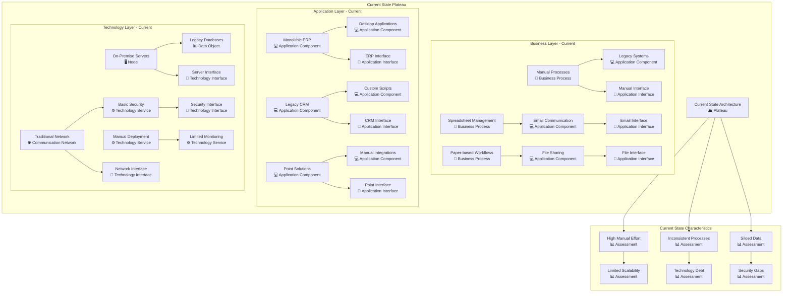
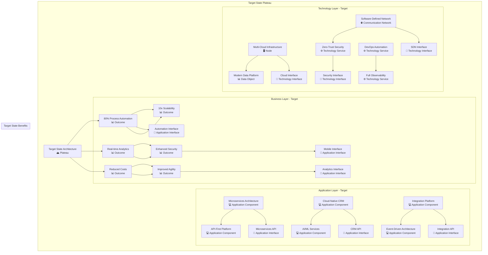
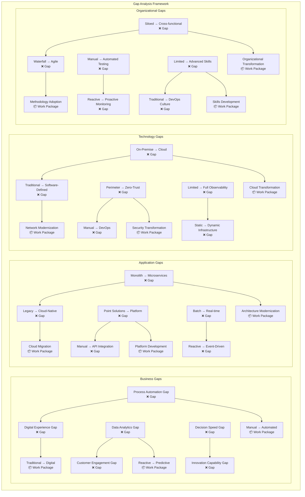
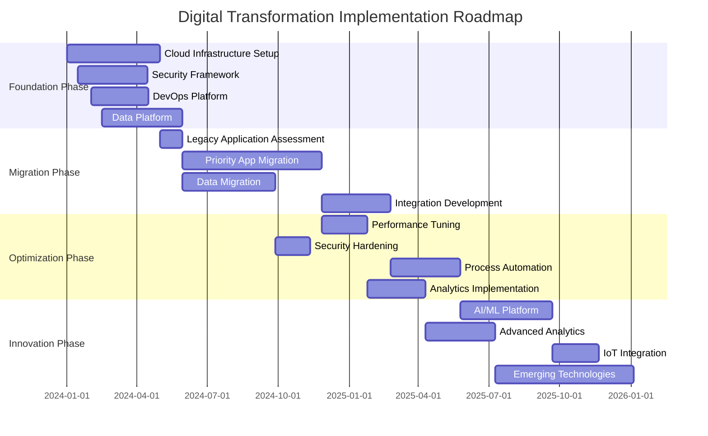
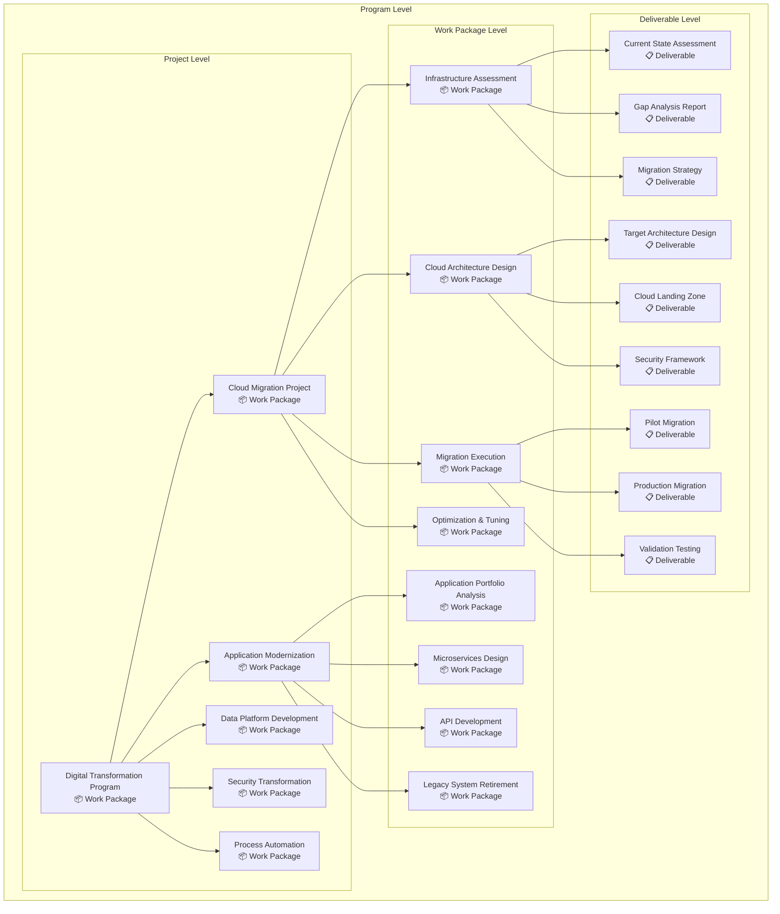
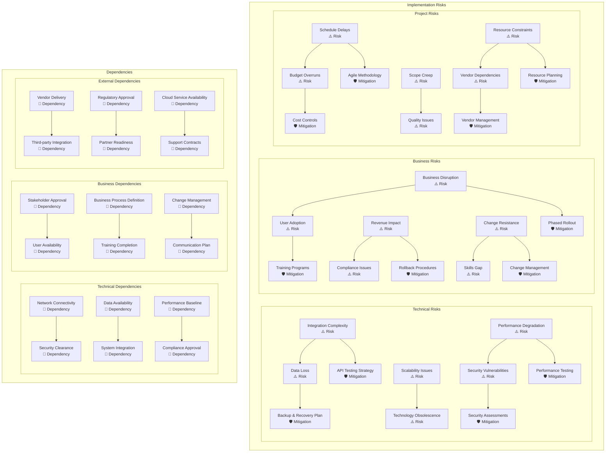
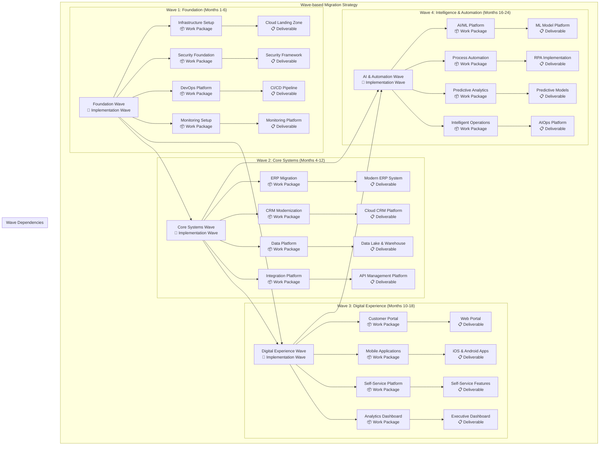
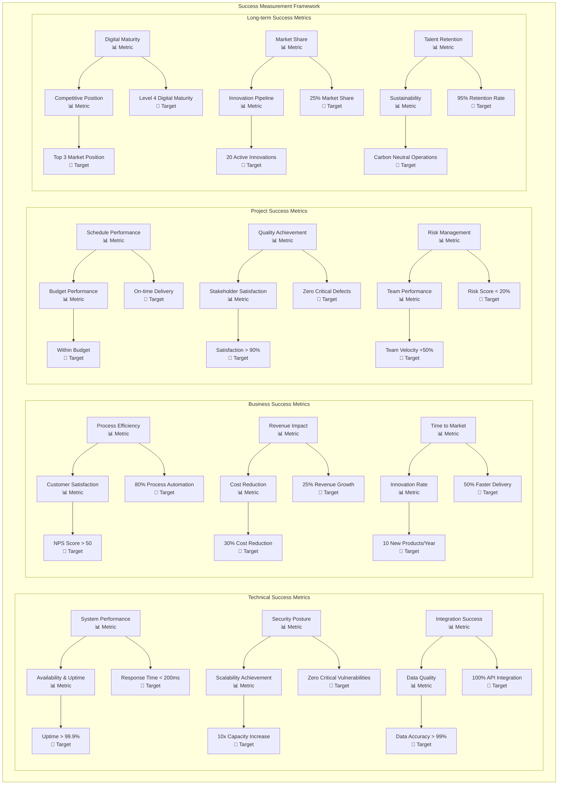
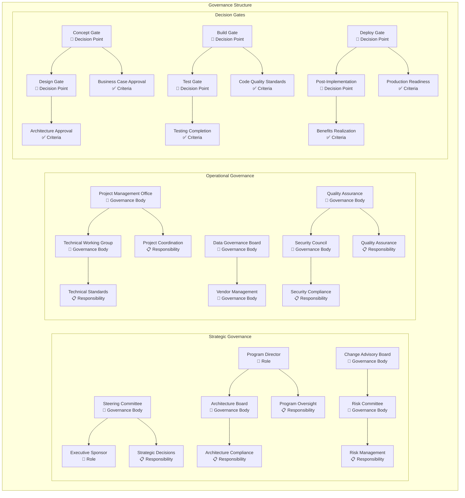

# Implementation and Migration Layer Models

## Overview
This document contains comprehensive ArchiMate Implementation and Migration Layer models representing the transformation planning, migration strategies, and implementation roadmaps for the enterprise architecture.

## Implementation Layer Framework

### Implementation Elements
- **Work Package:** Series of actions identified and designed to achieve specific goals
- **Deliverable:** Precisely-defined result of a work package
- **Implementation Event:** Occurrence during implementation process
- **Plateau:** Relatively stable state of architecture
- **Gap:** Statement of difference between two plateaus

### Migration Planning Approach
- **Current State Assessment:** Baseline architecture evaluation
- **Target State Design:** Future architecture vision
- **Gap Analysis:** Identification of transformation requirements
- **Migration Strategy:** Approach for achieving target state
- **Implementation Planning:** Detailed execution roadmap

## Current State Architecture Model



## Target State Architecture Model



## Gap Analysis Model



## Migration Strategy Model

```mermaid
graph TB
    subgraph "Migration Approaches"
        subgraph "Application Migration Strategies"
            AMS1[Rehost (Lift & Shift)<br/>🔄 Course of Action] --> AMS2[Replatform<br/>🔄 Course of Action]
            AMS3[Refactor/Re-architect<br/>🔄 Course of Action] --> AMS4[Rebuild<br/>🔄 Course of Action]
            AMS5[Replace<br/>🔄 Course of Action] --> AMS6[Retire<br/>🔄 Course of Action]
            
            AMS1 --> AMSD1[Virtual Machine Migration<br/>📋 Deliverable]
            AMS2 --> AMSD2[Container Platform<br/>📋 Deliverable]
            AMS3 --> AMSD3[Microservices Architecture<br/>📋 Deliverable]
            AMS4 --> AMSD4[Cloud-Native Application<br/>📋 Deliverable]
            AMS5 --> AMSD5[SaaS Implementation<br/>📋 Deliverable]
            AMS6 --> AMSD6[Application Decommission<br/>📋 Deliverable]
        end
        
        subgraph "Data Migration Strategies"
            DMS1[Big Bang Migration<br/>🔄 Course of Action] --> DMS2[Phased Migration<br/>🔄 Course of Action]
            DMS3[Parallel Run<br/>🔄 Course of Action] --> DMS4[Trickle Migration<br/>🔄 Course of Action]
            DMS5[Zero Downtime<br/>🔄 Course of Action] --> DMS6[Hybrid Approach<br/>🔄 Course of Action]
            
            DMS1 --> DMSD1[Complete Data Transfer<br/>📋 Deliverable]
            DMS2 --> DMSD2[Incremental Data Sync<br/>📋 Deliverable]
            DMS3 --> DMSD3[Dual System Operation<br/>📋 Deliverable]
            DMS4 --> DMSD4[Continuous Replication<br/>📋 Deliverable]
            DMS5 --> DMSD5[Online Migration<br/>📋 Deliverable]
            DMS6 --> DMSD6[Mixed Migration Methods<br/>📋 Deliverable]
        end
        
        subgraph "Infrastructure Migration"
            IMS1[Forklift Migration<br/>🔄 Course of Action] --> IMS2[Greenfield Deployment<br/>🔄 Course of Action]
            IMS3[Hybrid Cloud<br/>🔄 Course of Action] --> IMS4[Multi-Cloud<br/>🔄 Course of Action]
            IMS5[Edge Computing<br/>🔄 Course of Action] --> IMS6[Serverless Adoption<br/>🔄 Course of Action]
            
            IMS1 --> IMSD1[Infrastructure Replication<br/>📋 Deliverable]
            IMS2 --> IMSD2[New Cloud Environment<br/>📋 Deliverable]
            IMS3 --> IMSD3[Hybrid Architecture<br/>📋 Deliverable]
            IMS4 --> IMSD4[Multi-Cloud Platform<br/>📋 Deliverable]
            IMS5 --> IMSD5[Edge Infrastructure<br/>📋 Deliverable]
            IMS6 --> IMSD6[Serverless Platform<br/>📋 Deliverable]
        end
    end
```

## Implementation Roadmap Model



## Work Package Decomposition Model



## Risk and Dependency Model



## Migration Wave Planning Model



## Success Criteria and Metrics Model



## Implementation Governance Model



## Implementation Timeline and Milestones

### Phase 1: Foundation (Months 1-6)
- **Month 1:** Project initiation and team formation
- **Month 2:** Current state assessment completion
- **Month 3:** Cloud infrastructure deployment
- **Month 4:** Security framework implementation
- **Month 5:** DevOps platform setup
- **Month 6:** Foundation validation and testing

### Phase 2: Core Migration (Months 4-12)
- **Month 7:** ERP system migration start
- **Month 8:** Data platform development
- **Month 9:** CRM modernization
- **Month 10:** Integration platform deployment
- **Month 11:** Core systems testing
- **Month 12:** Core migration validation

### Phase 3: Digital Experience (Months 10-18)
- **Month 13:** Customer portal development
- **Month 14:** Mobile application development
- **Month 15:** Self-service platform
- **Month 16:** Analytics dashboard
- **Month 17:** User acceptance testing
- **Month 18:** Digital experience go-live

### Phase 4: Intelligence & Automation (Months 16-24)
- **Month 19:** AI/ML platform setup
- **Month 20:** Process automation implementation
- **Month 21:** Predictive analytics deployment
- **Month 22:** Intelligent operations
- **Month 23:** Performance optimization
- **Month 24:** Program completion and handover

### Budget and Resource Allocation

| Phase | Duration | Budget ($M) | FTE Resources | Key Deliverables |
|---|---|---|---|---|
| Foundation | 6 months | $5.2M | 25 FTE | Infrastructure, Security, DevOps |
| Core Migration | 8 months | $8.7M | 40 FTE | ERP, CRM, Data Platform |
| Digital Experience | 8 months | $6.3M | 30 FTE | Portal, Mobile, Analytics |
| Intelligence & Automation | 8 months | $4.8M | 20 FTE | AI/ML, Automation, Optimization |
| **Total** | **24 months** | **$25M** | **115 FTE** | **Complete Transformation** |

---
**Document Version:** 1.0  
**Last Updated:** [Date]  
**Owner:** Implementation & Migration Team  
**Review Frequency:** Bi-weekly  
**Next Review:** [Date + 2 weeks]