# Implementation and Migration Layer Models

## Overview
This document contains comprehensive ArchiMate Implementation and Migration Layer models representing the transformation planning, migration strategies, and implementation roadmaps for the enterprise architecture.

## Implementation Layer Framework

### Implementation Elements
- **Work Package:** Series of actions identified and designed to achieve specific goals
- **Deliverable:** Precisely-defined result of a work package
- **Implementation Event:** Occurrence during implementation process
- **Plateau:** Relatively stable state of architecture
- **Gap:** Statement of difference between two plateaus

### Migration Planning Approach
- **Current State Assessment:** Baseline architecture evaluation
- **Target State Design:** Future architecture vision
- **Gap Analysis:** Identification of transformation requirements
- **Migration Strategy:** Approach for achieving target state
- **Implementation Planning:** Detailed execution roadmap

## Current State Architecture Model

```mermaid
graph TB
    subgraph "Current State Plateau"
        CSP[Current State Architecture<br/>🏔️ Plateau]
        
        subgraph "Business Layer - Current"
            CSB1[Manual Processes<br/>🎯 Business Process] --> CSB2[Legacy Systems<br/>💻 Application Component]
            CSB3[Spreadsheet Management<br/>🎯 Business Process] --> CSB4[Email Communication<br/>💻 Application Component]
            CSB5[Paper-based Workflows<br/>🎯 Business Process] --> CSB6[File Sharing<br/>💻 Application Component]
            
            CSB1 --> CSBI1[Manual Interface<br/>🔌 Application Interface]
            CSB4 --> CSBI2[Email Interface<br/>🔌 Application Interface]
            CSB6 --> CSBI3[File Interface<br/>🔌 Application Interface]
        end
        
        subgraph "Application Layer - Current"
            CSA1[Monolithic ERP<br/>💻 Application Component] --> CSA2[Desktop Applications<br/>💻 Application Component]
            CSA3[Legacy CRM<br/>💻 Application Component] --> CSA4[Custom Scripts<br/>💻 Application Component]
            CSA5[Point Solutions<br/>💻 Application Component] --> CSA6[Manual Integrations<br/>💻 Application Component]
            
            CSA1 --> CSAI1[ERP Interface<br/>🔌 Application Interface]
            CSA3 --> CSAI2[CRM Interface<br/>🔌 Application Interface]
            CSA5 --> CSAI3[Point Interface<br/>🔌 Application Interface]
        end
        
        subgraph "Technology Layer - Current"
            CST1[On-Premise Servers<br/>🖥️ Node] --> CST2[Legacy Databases<br/>📊 Data Object]
            CST3[Traditional Network<br/>🌐 Communication Network] --> CST4[Basic Security<br/>⚙️ Technology Service]
            CST5[Manual Deployment<br/>⚙️ Technology Service] --> CST6[Limited Monitoring<br/>⚙️ Technology Service]
            
            CST1 --> CSTI1[Server Interface<br/>🔌 Technology Interface]
            CST3 --> CSTI2[Network Interface<br/>🔌 Technology Interface]
            CST4 --> CSTI3[Security Interface<br/>🔌 Technology Interface]
        end
    end
    
    subgraph "Current State Characteristics"
        CSC1[High Manual Effort<br/>📊 Assessment] --> CSC2[Limited Scalability<br/>📊 Assessment]
        CSC3[Inconsistent Processes<br/>📊 Assessment] --> CSC4[Technology Debt<br/>📊 Assessment]
        CSC5[Siloed Data<br/>📊 Assessment] --> CSC6[Security Gaps<br/>📊 Assessment]
        
        CSP --> CSC1
        CSP --> CSC3
        CSP --> CSC5
    end
```



## Target State Architecture Model

```mermaid
graph TB
    subgraph "Target State Plateau"
        TSP[Target State Architecture<br/>🏔️ Plateau]
        
        subgraph "Business Layer - Target"
            TSB1[Automated Processes<br/>🎯 Business Process] --> TSB2[Digital Workflows<br/>💻 Application Component]
            TSB3[Self-Service Portals<br/>🎯 Business Process] --> TSB4[Mobile Applications<br/>💻 Application Component]
            TSB5[AI-Assisted Decisions<br/>🎯 Business Process] --> TSB6[Analytics Platform<br/>💻 Application Component]
            
            TSB1 --> TSBI1[Automation Interface<br/>🔌 Application Interface]
            TSB4 --> TSBI2[Mobile Interface<br/>🔌 Application Interface]
            TSB6 --> TSBI3[Analytics Interface<br/>🔌 Application Interface]
        end
        
        subgraph "Application Layer - Target"
            TSA1[Microservices Architecture<br/>💻 Application Component] --> TSA2[API-First Platform<br/>💻 Application Component]
            TSA3[Cloud-Native CRM<br/>💻 Application Component] --> TSA4[AI/ML Services<br/>💻 Application Component]
            TSA5[Integration Platform<br/>💻 Application Component] --> TSA6[Event-Driven Architecture<br/>💻 Application Component]
            
            TSA1 --> TSAI1[Microservices API<br/>🔌 Application Interface]
            TSA3 --> TSAI2[CRM API<br/>🔌 Application Interface]
            TSA5 --> TSAI3[Integration API<br/>🔌 Application Interface]
        end
        
        subgraph "Technology Layer - Target"
            TST1[Multi-Cloud Infrastructure<br/>🖥️ Node] --> TST2[Modern Data Platform<br/>📊 Data Object]
            TST3[Software-Defined Network<br/>🌐 Communication Network] --> TST4[Zero-Trust Security<br/>⚙️ Technology Service]
            TST5[DevOps Automation<br/>⚙️ Technology Service] --> TST6[Full Observability<br/>⚙️ Technology Service]
            
            TST1 --> TSTI1[Cloud Interface<br/>🔌 Technology Interface]
            TST3 --> TSTI2[SDN Interface<br/>🔌 Technology Interface]
            TST4 --> TSTI3[Security Interface<br/>🔌 Technology Interface]
        end
    end
    
    subgraph "Target State Benefits"
        TSB1[80% Process Automation<br/>📊 Outcome] --> TSB2[10x Scalability<br/>📊 Outcome]
        TSB3[Real-time Analytics<br/>📊 Outcome] --> TSB4[Enhanced Security<br/>📊 Outcome]
        TSB5[Reduced Costs<br/>📊 Outcome] --> TSB6[Improved Agility<br/>📊 Outcome]
        
        TSP --> TSB1
        TSP --> TSB3
        TSP --> TSB5
    end
```



## Gap Analysis Model

```mermaid
graph TB
    subgraph "Gap Analysis Framework"
        subgraph "Business Gaps"
            BG1[Process Automation Gap<br/>❌ Gap] --> BG2[Digital Experience Gap<br/>❌ Gap]
            BG3[Data Analytics Gap<br/>❌ Gap] --> BG4[Customer Engagement Gap<br/>❌ Gap]
            BG5[Decision Speed Gap<br/>❌ Gap] --> BG6[Innovation Capability Gap<br/>❌ Gap]
            
            BG1 --> BGW1[Manual → Automated<br/>📦 Work Package]
            BG2 --> BGW2[Traditional → Digital<br/>📦 Work Package]
            BG3 --> BGW3[Reactive → Predictive<br/>📦 Work Package]
        end
        
        subgraph "Application Gaps"
            AG1[Monolith → Microservices<br/>❌ Gap] --> AG2[Legacy → Cloud-Native<br/>❌ Gap]
            AG3[Point Solutions → Platform<br/>❌ Gap] --> AG4[Manual → API Integration<br/>❌ Gap]
            AG5[Batch → Real-time<br/>❌ Gap] --> AG6[Reactive → Event-Driven<br/>❌ Gap]
            
            AG1 --> AGW1[Architecture Modernization<br/>📦 Work Package]
            AG2 --> AGW2[Cloud Migration<br/>📦 Work Package]
            AG3 --> AGW3[Platform Development<br/>📦 Work Package]
        end
        
        subgraph "Technology Gaps"
            TG1[On-Premise → Cloud<br/>❌ Gap] --> TG2[Traditional → Software-Defined<br/>❌ Gap]
            TG3[Perimeter → Zero-Trust<br/>❌ Gap] --> TG4[Manual → DevOps<br/>❌ Gap]
            TG5[Limited → Full Observability<br/>❌ Gap] --> TG6[Static → Dynamic Infrastructure<br/>❌ Gap]
            
            TG1 --> TGW1[Cloud Transformation<br/>📦 Work Package]
            TG2 --> TGW2[Network Modernization<br/>📦 Work Package]
            TG3 --> TGW3[Security Transformation<br/>📦 Work Package]
        end
        
        subgraph "Organizational Gaps"
            OG1[Siloed → Cross-functional<br/>❌ Gap] --> OG2[Waterfall → Agile<br/>❌ Gap]
            OG3[Manual → Automated Testing<br/>❌ Gap] --> OG4[Reactive → Proactive Monitoring<br/>❌ Gap]
            OG5[Limited → Advanced Skills<br/>❌ Gap] --> OG6[Traditional → DevOps Culture<br/>❌ Gap]
            
            OG1 --> OGW1[Organizational Transformation<br/>📦 Work Package]
            OG2 --> OGW2[Methodology Adoption<br/>📦 Work Package]
            OG5 --> OGW3[Skills Development<br/>📦 Work Package]
        end
    end
```



## Migration Strategy Model

```mermaid
graph TB
    subgraph "Migration Approaches"
        subgraph "Application Migration Strategies"
            AMS1[Rehost (Lift & Shift)<br/>🔄 Course of Action] --> AMS2[Replatform<br/>🔄 Course of Action]
            AMS3[Refactor/Re-architect<br/>🔄 Course of Action] --> AMS4[Rebuild<br/>🔄 Course of Action]
            AMS5[Replace<br/>🔄 Course of Action] --> AMS6[Retire<br/>🔄 Course of Action]
            
            AMS1 --> AMSD1[Virtual Machine Migration<br/>📋 Deliverable]
            AMS2 --> AMSD2[Container Platform<br/>📋 Deliverable]
            AMS3 --> AMSD3[Microservices Architecture<br/>📋 Deliverable]
            AMS4 --> AMSD4[Cloud-Native Application<br/>📋 Deliverable]
            AMS5 --> AMSD5[SaaS Implementation<br/>📋 Deliverable]
            AMS6 --> AMSD6[Application Decommission<br/>📋 Deliverable]
        end
        
        subgraph "Data Migration Strategies"
            DMS1[Big Bang Migration<br/>🔄 Course of Action] --> DMS2[Phased Migration<br/>🔄 Course of Action]
            DMS3[Parallel Run<br/>🔄 Course of Action] --> DMS4[Trickle Migration<br/>🔄 Course of Action]
            DMS5[Zero Downtime<br/>🔄 Course of Action] --> DMS6[Hybrid Approach<br/>🔄 Course of Action]
            
            DMS1 --> DMSD1[Complete Data Transfer<br/>📋 Deliverable]
            DMS2 --> DMSD2[Incremental Data Sync<br/>📋 Deliverable]
            DMS3 --> DMSD3[Dual System Operation<br/>📋 Deliverable]
            DMS4 --> DMSD4[Continuous Replication<br/>📋 Deliverable]
            DMS5 --> DMSD5[Online Migration<br/>📋 Deliverable]
            DMS6 --> DMSD6[Mixed Migration Methods<br/>📋 Deliverable]
        end
        
        subgraph "Infrastructure Migration"
            IMS1[Forklift Migration<br/>🔄 Course of Action] --> IMS2[Greenfield Deployment<br/>🔄 Course of Action]
            IMS3[Hybrid Cloud<br/>🔄 Course of Action] --> IMS4[Multi-Cloud<br/>🔄 Course of Action]
            IMS5[Edge Computing<br/>🔄 Course of Action] --> IMS6[Serverless Adoption<br/>🔄 Course of Action]
            
            IMS1 --> IMSD1[Infrastructure Replication<br/>📋 Deliverable]
            IMS2 --> IMSD2[New Cloud Environment<br/>📋 Deliverable]
            IMS3 --> IMSD3[Hybrid Architecture<br/>📋 Deliverable]
            IMS4 --> IMSD4[Multi-Cloud Platform<br/>📋 Deliverable]
            IMS5 --> IMSD5[Edge Infrastructure<br/>📋 Deliverable]
            IMS6 --> IMSD6[Serverless Platform<br/>📋 Deliverable]
        end
    end
```

## Implementation Roadmap Model


## Work Package Decomposition Model


## Risk and Dependency Model

```mermaid
graph TB
    subgraph "Implementation Risks"
        subgraph "Technical Risks"
            TR1[Integration Complexity<br/>⚠️ Risk] --> TR2[Data Loss<br/>⚠️ Risk]
            TR3[Performance Degradation<br/>⚠️ Risk] --> TR4[Security Vulnerabilities<br/>⚠️ Risk]
            TR5[Scalability Issues<br/>⚠️ Risk] --> TR6[Technology Obsolescence<br/>⚠️ Risk]
            
            TR1 --> TRM1[API Testing Strategy<br/>🛡️ Mitigation]
            TR2 --> TRM2[Backup & Recovery Plan<br/>🛡️ Mitigation]
            TR3 --> TRM3[Performance Testing<br/>🛡️ Mitigation]
            TR4 --> TRM4[Security Assessments<br/>🛡️ Mitigation]
        end
        
        subgraph "Business Risks"
            BR1[Business Disruption<br/>⚠️ Risk] --> BR2[User Adoption<br/>⚠️ Risk]
            BR3[Revenue Impact<br/>⚠️ Risk] --> BR4[Compliance Issues<br/>⚠️ Risk]
            BR5[Change Resistance<br/>⚠️ Risk] --> BR6[Skills Gap<br/>⚠️ Risk]
            
            BR1 --> BRM1[Phased Rollout<br/>🛡️ Mitigation]
            BR2 --> BRM2[Training Programs<br/>🛡️ Mitigation]
            BR3 --> BRM3[Rollback Procedures<br/>🛡️ Mitigation]
            BR5 --> BRM4[Change Management<br/>🛡️ Mitigation]
        end
        
        subgraph "Project Risks"
            PR1[Schedule Delays<br/>⚠️ Risk] --> PR2[Budget Overruns<br/>⚠️ Risk]
            PR3[Resource Constraints<br/>⚠️ Risk] --> PR4[Vendor Dependencies<br/>⚠️ Risk]
            PR5[Scope Creep<br/>⚠️ Risk] --> PR6[Quality Issues<br/>⚠️ Risk]
            
            PR1 --> PRM1[Agile Methodology<br/>🛡️ Mitigation]
            PR2 --> PRM2[Cost Controls<br/>🛡️ Mitigation]
            PR3 --> PRM3[Resource Planning<br/>🛡️ Mitigation]
            PR4 --> PRM4[Vendor Management<br/>🛡️ Mitigation]
        end
    end
    
    subgraph "Dependencies"
        subgraph "Technical Dependencies"
            TD1[Network Connectivity<br/>🔗 Dependency] --> TD2[Security Clearance<br/>🔗 Dependency]
            TD3[Data Availability<br/>🔗 Dependency] --> TD4[System Integration<br/>🔗 Dependency]
            TD5[Performance Baseline<br/>🔗 Dependency] --> TD6[Compliance Approval<br/>🔗 Dependency]
        end
        
        subgraph "Business Dependencies"
            BD1[Stakeholder Approval<br/>🔗 Dependency] --> BD2[User Availability<br/>🔗 Dependency]
            BD3[Business Process Definition<br/>🔗 Dependency] --> BD4[Training Completion<br/>🔗 Dependency]
            BD5[Change Management<br/>🔗 Dependency] --> BD6[Communication Plan<br/>🔗 Dependency]
        end
        
        subgraph "External Dependencies"
            ED1[Vendor Delivery<br/>🔗 Dependency] --> ED2[Third-party Integration<br/>🔗 Dependency]
            ED3[Regulatory Approval<br/>🔗 Dependency] --> ED4[Partner Readiness<br/>🔗 Dependency]
            ED5[Cloud Service Availability<br/>🔗 Dependency] --> ED6[Support Contracts<br/>🔗 Dependency]
        end
    end
```



## Migration Wave Planning Model

```mermaid
graph TB
    subgraph "Wave-based Migration Strategy"
        subgraph "Wave 1: Foundation (Months 1-6)"
            W1[Foundation Wave<br/>🌊 Implementation Wave]
            W1 --> W1WP1[Infrastructure Setup<br/>📦 Work Package]
            W1 --> W1WP2[Security Foundation<br/>📦 Work Package]
            W1 --> W1WP3[DevOps Platform<br/>📦 Work Package]
            W1 --> W1WP4[Monitoring Setup<br/>📦 Work Package]
            
            W1WP1 --> W1D1[Cloud Landing Zone<br/>📋 Deliverable]
            W1WP2 --> W1D2[Security Framework<br/>📋 Deliverable]
            W1WP3 --> W1D3[CI/CD Pipeline<br/>📋 Deliverable]
            W1WP4 --> W1D4[Monitoring Platform<br/>📋 Deliverable]
        end
        
        subgraph "Wave 2: Core Systems (Months 4-12)"
            W2[Core Systems Wave<br/>🌊 Implementation Wave]
            W2 --> W2WP1[ERP Migration<br/>📦 Work Package]
            W2 --> W2WP2[CRM Modernization<br/>📦 Work Package]
            W2 --> W2WP3[Data Platform<br/>📦 Work Package]
            W2 --> W2WP4[Integration Platform<br/>📦 Work Package]
            
            W2WP1 --> W2D1[Modern ERP System<br/>📋 Deliverable]
            W2WP2 --> W2D2[Cloud CRM Platform<br/>📋 Deliverable]
            W2WP3 --> W2D3[Data Lake & Warehouse<br/>📋 Deliverable]
            W2WP4 --> W2D4[API Management Platform<br/>📋 Deliverable]
        end
        
        subgraph "Wave 3: Digital Experience (Months 10-18)"
            W3[Digital Experience Wave<br/>🌊 Implementation Wave]
            W3 --> W3WP1[Customer Portal<br/>📦 Work Package]
            W3 --> W3WP2[Mobile Applications<br/>📦 Work Package]
            W3 --> W3WP3[Self-Service Platform<br/>📦 Work Package]
            W3 --> W3WP4[Analytics Dashboard<br/>📦 Work Package]
            
            W3WP1 --> W3D1[Web Portal<br/>📋 Deliverable]
            W3WP2 --> W3D2[iOS & Android Apps<br/>📋 Deliverable]
            W3WP3 --> W3D3[Self-Service Features<br/>📋 Deliverable]
            W3WP4 --> W3D4[Executive Dashboard<br/>📋 Deliverable]
        end
        
        subgraph "Wave 4: Intelligence & Automation (Months 16-24)"
            W4[AI & Automation Wave<br/>🌊 Implementation Wave]
            W4 --> W4WP1[AI/ML Platform<br/>📦 Work Package]
            W4 --> W4WP2[Process Automation<br/>📦 Work Package]
            W4 --> W4WP3[Predictive Analytics<br/>📦 Work Package]
            W4 --> W4WP4[Intelligent Operations<br/>📦 Work Package]
            
            W4WP1 --> W4D1[ML Model Platform<br/>📋 Deliverable]
            W4WP2 --> W4D2[RPA Implementation<br/>📋 Deliverable]
            W4WP3 --> W4D3[Predictive Models<br/>📋 Deliverable]
            W4WP4 --> W4D4[AIOps Platform<br/>📋 Deliverable]
        end
    end
    
    subgraph "Wave Dependencies"
        W1 --> W2
        W2 --> W3
        W1 --> W3
        W2 --> W4
        W3 --> W4
    end
```



## Success Criteria and Metrics Model


## Implementation Governance Model

```mermaid
graph TB
    subgraph "Governance Structure"
        subgraph "Strategic Governance"
            SG1[Steering Committee<br/>👥 Governance Body] --> SG2[Executive Sponsor<br/>👤 Role]
            SG3[Program Director<br/>👤 Role] --> SG4[Architecture Board<br/>👥 Governance Body]
            SG5[Change Advisory Board<br/>👥 Governance Body] --> SG6[Risk Committee<br/>👥 Governance Body]
            
            SG1 --> SGR1[Strategic Decisions<br/>📋 Responsibility]
            SG3 --> SGR2[Program Oversight<br/>📋 Responsibility]
            SG4 --> SGR3[Architecture Compliance<br/>📋 Responsibility]
            SG6 --> SGR4[Risk Management<br/>📋 Responsibility]
        end
        
        subgraph "Operational Governance"
            OG1[Project Management Office<br/>👥 Governance Body] --> OG2[Technical Working Group<br/>👥 Governance Body]
            OG3[Quality Assurance<br/>👥 Governance Body] --> OG4[Security Council<br/>👥 Governance Body]
            OG5[Data Governance Board<br/>👥 Governance Body] --> OG6[Vendor Management<br/>👥 Governance Body]
            
            OG1 --> OGR1[Project Coordination<br/>📋 Responsibility]
            OG2 --> OGR2[Technical Standards<br/>📋 Responsibility]
            OG3 --> OGR3[Quality Assurance<br/>📋 Responsibility]
            OG4 --> OGR4[Security Compliance<br/>📋 Responsibility]
        end
        
        subgraph "Decision Gates"
            DG1[Concept Gate<br/>🚪 Decision Point] --> DG2[Design Gate<br/>🚪 Decision Point]
            DG3[Build Gate<br/>🚪 Decision Point] --> DG4[Test Gate<br/>🚪 Decision Point]
            DG5[Deploy Gate<br/>🚪 Decision Point] --> DG6[Post-Implementation<br/>🚪 Decision Point]
            
            DG1 --> DGC1[Business Case Approval<br/>✅ Criteria]
            DG2 --> DGC2[Architecture Approval<br/>✅ Criteria]
            DG3 --> DGC3[Code Quality Standards<br/>✅ Criteria]
            DG4 --> DGC4[Testing Completion<br/>✅ Criteria]
            DG5 --> DGC5[Production Readiness<br/>✅ Criteria]
            DG6 --> DGC6[Benefits Realization<br/>✅ Criteria]
        end
    end
```



## Implementation Timeline and Milestones

### Phase 1: Foundation (Months 1-6)
- **Month 1:** Project initiation and team formation
- **Month 2:** Current state assessment completion
- **Month 3:** Cloud infrastructure deployment
- **Month 4:** Security framework implementation
- **Month 5:** DevOps platform setup
- **Month 6:** Foundation validation and testing

### Phase 2: Core Migration (Months 4-12)
- **Month 7:** ERP system migration start
- **Month 8:** Data platform development
- **Month 9:** CRM modernization
- **Month 10:** Integration platform deployment
- **Month 11:** Core systems testing
- **Month 12:** Core migration validation

### Phase 3: Digital Experience (Months 10-18)
- **Month 13:** Customer portal development
- **Month 14:** Mobile application development
- **Month 15:** Self-service platform
- **Month 16:** Analytics dashboard
- **Month 17:** User acceptance testing
- **Month 18:** Digital experience go-live

### Phase 4: Intelligence & Automation (Months 16-24)
- **Month 19:** AI/ML platform setup
- **Month 20:** Process automation implementation
- **Month 21:** Predictive analytics deployment
- **Month 22:** Intelligent operations
- **Month 23:** Performance optimization
- **Month 24:** Program completion and handover

### Budget and Resource Allocation

| Phase | Duration | Budget ($M) | FTE Resources | Key Deliverables |
|---|---|---|---|---|
| Foundation | 6 months | $5.2M | 25 FTE | Infrastructure, Security, DevOps |
| Core Migration | 8 months | $8.7M | 40 FTE | ERP, CRM, Data Platform |
| Digital Experience | 8 months | $6.3M | 30 FTE | Portal, Mobile, Analytics |
| Intelligence & Automation | 8 months | $4.8M | 20 FTE | AI/ML, Automation, Optimization |
| **Total** | **24 months** | **$25M** | **115 FTE** | **Complete Transformation** |

---
**Document Version:** 1.0  
**Last Updated:** [Date]  
**Owner:** Implementation & Migration Team  
**Review Frequency:** Bi-weekly  
**Next Review:** [Date + 2 weeks]