# Physical Layer Models

## Overview
This document contains comprehensive ArchiMate Physical Layer models representing the physical infrastructure, facilities, equipment, materials, and distribution networks that support the enterprise architecture.

## Physical Infrastructure Framework

### Physical Elements
- **Equipment:** Physical machine, instrument, or apparatus
- **Facility:** Physical location where business activities are performed
- **Distribution Network:** Physical infrastructure for moving materials/energy
- **Material:** Physical substance used or produced by business processes

### Infrastructure Categories
- **Data Centers:** Primary and secondary computing facilities
- **Network Infrastructure:** Physical connectivity and communication equipment
- **Edge Computing:** Distributed computing resources at network edge
- **IoT/Sensors:** Physical devices for data collection and control
- **Power & Cooling:** Utility infrastructure supporting IT operations

## Data Center Infrastructure Model

```mermaid
graph TB
    subgraph "Primary Data Center - Riyadh"
        PDC[Primary Data Center<br/>🏢 Facility]
        
        subgraph "Server Infrastructure"
            PDC_RACK1[Server Rack 1<br/>📦 Equipment] --> PDC_SVR1[Application Servers<br/>🖥️ Equipment]
            PDC_RACK2[Server Rack 2<br/>📦 Equipment] --> PDC_SVR2[Database Servers<br/>🖥️ Equipment]
            PDC_RACK3[Server Rack 3<br/>📦 Equipment] --> PDC_SVR3[Storage Arrays<br/>💾 Equipment]
            PDC_RACK4[Server Rack 4<br/>📦 Equipment] --> PDC_SVR4[Network Equipment<br/>🔀 Equipment]
            
            PDC_SVR1 --> PDC_CPU1[Intel Xeon Processors<br/>⚙️ Material]
            PDC_SVR2 --> PDC_MEM1[DDR5 Memory Modules<br/>⚙️ Material]
            PDC_SVR3 --> PDC_SSD1[NVMe SSD Arrays<br/>⚙️ Material]
            PDC_SVR4 --> PDC_FIBER1[Fiber Optic Cables<br/>⚙️ Material]
        end
        
        subgraph "Power & Cooling"
            PDC_UPS[UPS Systems<br/>⚡ Equipment] --> PDC_GEN[Backup Generators<br/>⚡ Equipment]
            PDC_HVAC[HVAC Systems<br/>❄️ Equipment] --> PDC_COOL[Cooling Towers<br/>❄️ Equipment]
            PDC_PDU[Power Distribution Units<br/>⚡ Equipment] --> PDC_FIRE[Fire Suppression<br/>🚨 Equipment]
            
            PDC_UPS --> PDC_BATT[Lithium Batteries<br/>⚙️ Material]
            PDC_HVAC --> PDC_REFRIG[Refrigerant<br/>⚙️ Material]
            PDC_FIRE --> PDC_SUPP[Suppressant Agent<br/>⚙️ Material]
        end
        
        subgraph "Security & Access"
            PDC_SEC[Security Systems<br/>🔒 Equipment] --> PDC_CAM[CCTV Cameras<br/>📹 Equipment]
            PDC_ACCESS[Access Control<br/>🔑 Equipment] --> PDC_BADGE[Badge Readers<br/>🏷️ Equipment]
            PDC_MOTION[Motion Sensors<br/>👁️ Equipment] --> PDC_ALARM[Alarm Systems<br/>🚨 Equipment]
        end
    end
    
    subgraph "Secondary Data Center - Jeddah"
        SDC[Secondary Data Center<br/>🏢 Facility]
        
        subgraph "Disaster Recovery Infrastructure"
            SDC_RACK1[DR Server Rack 1<br/>📦 Equipment] --> SDC_SVR1[Standby Servers<br/>🖥️ Equipment]
            SDC_RACK2[DR Server Rack 2<br/>📦 Equipment] --> SDC_STOR1[Backup Storage<br/>💾 Equipment]
            SDC_RACK3[DR Network Rack<br/>📦 Equipment] --> SDC_NET1[Network Switches<br/>🔀 Equipment]
            
            SDC_SVR1 --> SDC_CPU1[AMD EPYC Processors<br/>⚙️ Material]
            SDC_STOR1 --> SDC_TAPE1[LTO Tape Drives<br/>⚙️ Material]
            SDC_NET1 --> SDC_FIBER2[Redundant Fiber<br/>⚙️ Material]
        end
        
        subgraph "DR Power & Environmental"
            SDC_UPS[DR UPS Systems<br/>⚡ Equipment] --> SDC_GEN[DR Generators<br/>⚡ Equipment]
            SDC_HVAC[DR HVAC<br/>❄️ Equipment] --> SDC_MONITOR[Environmental Monitoring<br/>📊 Equipment]
        end
    end
    
    subgraph "Cloud Infrastructure Extensions"
        AZURE_DC[Azure Middle East<br/>🏢 Facility] --> AZURE_COMPUTE[Azure Compute<br/>🖥️ Equipment]
        AWS_DC[AWS Bahrain<br/>🏢 Facility] --> AWS_COMPUTE[AWS EC2<br/>🖥️ Equipment]
        
        AZURE_COMPUTE --> AZURE_NET[Azure Networking<br/>🔀 Equipment]
        AWS_COMPUTE --> AWS_NET[AWS VPC<br/>🔀 Equipment]
    end
```

## Network Infrastructure Model

```mermaid
graph TB
    subgraph "Core Network Infrastructure"
        subgraph "Wide Area Network"
            WAN[WAN Infrastructure<br/>🌐 Distribution Network]
            
            WAN_FIBER[Fiber Backbone<br/>🔗 Equipment] --> WAN_ROUTER[Core Routers<br/>🔀 Equipment]
            WAN_SATELLITE[Satellite Links<br/>📡 Equipment] --> WAN_GATEWAY[WAN Gateways<br/>🚪 Equipment]
            WAN_MICROWAVE[Microwave Links<br/>📡 Equipment] --> WAN_REPEATER[Signal Repeaters<br/>📡 Equipment]
            
            WAN_FIBER --> FIBER_CABLE[Single-mode Fiber<br/>⚙️ Material]
            WAN_SATELLITE --> SAT_DISH[Satellite Dishes<br/>⚙️ Material]
            WAN_MICROWAVE --> MW_ANTENNA[Microwave Antennas<br/>⚙️ Material]
        end
        
        subgraph "Metropolitan Network"
            MAN[Metro Network<br/>🌆 Distribution Network]
            
            MAN_RING[Metro Ring<br/>🔗 Equipment] --> MAN_NODE[Metro Nodes<br/>🔀 Equipment]
            MAN_DWDM[DWDM Equipment<br/>📡 Equipment] --> MAN_OADM[Optical Multiplexers<br/>📡 Equipment]
            MAN_ETHERNET[Metro Ethernet<br/>🔗 Equipment] --> MAN_SWITCH[Metro Switches<br/>🔀 Equipment]
            
            MAN_RING --> METRO_FIBER[Metro Fiber Cables<br/>⚙️ Material]
            MAN_DWDM --> OPTICAL_AMP[Optical Amplifiers<br/>⚙️ Material]
        end
        
        subgraph "Local Area Networks"
            LAN[LAN Infrastructure<br/>🏢 Distribution Network]
            
            LAN_CORE[Core Switches<br/>🔀 Equipment] --> LAN_DIST[Distribution Switches<br/>🔀 Equipment]
            LAN_ACCESS[Access Switches<br/>🔀 Equipment] --> LAN_WIRELESS[Wireless APs<br/>📶 Equipment]
            LAN_SECURITY[Network Security<br/>🔒 Equipment] --> LAN_MONITOR[Network Monitoring<br/>📊 Equipment]
            
            LAN_CORE --> CAT6_CABLE[Cat 6A Cables<br/>⚙️ Material]
            LAN_WIRELESS --> WIFI_ANTENNA[WiFi Antennas<br/>⚙️ Material]
        end
    end
    
    subgraph "Internet Connectivity"
        ISP1[Primary ISP<br/>🌐 Distribution Network] --> BORDER1[Border Router 1<br/>🔀 Equipment]
        ISP2[Secondary ISP<br/>🌐 Distribution Network] --> BORDER2[Border Router 2<br/>🔀 Equipment]
        ISP3[Backup ISP<br/>🌐 Distribution Network] --> BORDER3[Border Router 3<br/>🔀 Equipment]
        
        BORDER1 --> FW1[Primary Firewall<br/>🔒 Equipment]
        BORDER2 --> FW2[Secondary Firewall<br/>🔒 Equipment]
        BORDER3 --> FW3[Backup Firewall<br/>🔒 Equipment]
    end
```

## Edge Computing Infrastructure Model

```mermaid
graph TB
    subgraph "Edge Computing Network"
        subgraph "Regional Edge Hubs"
            EDGE_RH1[Riyadh Edge Hub<br/>🏢 Facility] --> EDGE_RH1_SVR[Edge Servers<br/>🖥️ Equipment]
            EDGE_RH2[Jeddah Edge Hub<br/>🏢 Facility] --> EDGE_RH2_SVR[Edge Servers<br/>🖥️ Equipment]
            EDGE_RH3[Dammam Edge Hub<br/>🏢 Facility] --> EDGE_RH3_SVR[Edge Servers<br/>🖥️ Equipment]
            
            EDGE_RH1_SVR --> EDGE_GPU1[NVIDIA GPU Cards<br/>⚙️ Material]
            EDGE_RH2_SVR --> EDGE_GPU2[AMD GPU Cards<br/>⚙️ Material]
            EDGE_RH3_SVR --> EDGE_FPGA1[Intel FPGA Cards<br/>⚙️ Material]
        end
        
        subgraph "Micro Edge Nodes"
            MICRO_E1[Branch Office 1<br/>🏢 Facility] --> MICRO_SVR1[Micro Server<br/>🖥️ Equipment]
            MICRO_E2[Branch Office 2<br/>🏢 Facility] --> MICRO_SVR2[Micro Server<br/>🖥️ Equipment]
            MICRO_E3[Retail Location<br/>🏢 Facility] --> MICRO_SVR3[Mini PC<br/>🖥️ Equipment]
            
            MICRO_SVR1 --> MICRO_SSD1[m.2 SSD Storage<br/>⚙️ Material]
            MICRO_SVR2 --> MICRO_RAM1[SO-DIMM Memory<br/>⚙️ Material]
            MICRO_SVR3 --> MICRO_CPU1[ARM Processors<br/>⚙️ Material]
        end
        
        subgraph "Mobile Edge Computing"
            MEC1[5G Base Station 1<br/>📡 Equipment] --> MEC_SVR1[MEC Server<br/>🖥️ Equipment]
            MEC2[5G Base Station 2<br/>📡 Equipment] --> MEC_SVR2[MEC Server<br/>🖥️ Equipment]
            MEC3[4G Cell Tower<br/>📡 Equipment] --> MEC_SVR3[Edge Gateway<br/>🖥️ Equipment]
            
            MEC_SVR1 --> MEC_ANTENNA1[5G Antennas<br/>⚙️ Material]
            MEC_SVR2 --> MEC_RADIO1[Radio Units<br/>⚙️ Material]
            MEC_SVR3 --> MEC_BASEBAND[Baseband Units<br/>⚙️ Material]
        end
        
        subgraph "Edge Connectivity"
            EDGE_FIBER[Edge Fiber Network<br/>🔗 Distribution Network] --> EDGE_SWITCH[Edge Switches<br/>🔀 Equipment]
            EDGE_WIRELESS[Edge Wireless<br/>📶 Distribution Network] --> EDGE_AP[Edge Access Points<br/>📶 Equipment]
            EDGE_SATELLITE[Edge Satellite<br/>📡 Distribution Network] --> EDGE_VSAT[VSAT Terminals<br/>📡 Equipment]
        end
    end
```

## IoT and Sensor Infrastructure Model

```mermaid
graph TB
    subgraph "IoT Infrastructure Network"
        subgraph "Industrial IoT"
            IIOT_FAC[Manufacturing Facility<br/>🏢 Facility]
            
            IIOT_FAC --> IIOT_LINE1[Production Line 1<br/>🏭 Equipment]
            IIOT_FAC --> IIOT_LINE2[Production Line 2<br/>🏭 Equipment]
            IIOT_FAC --> IIOT_UTIL[Utility Systems<br/>⚙️ Equipment]
            
            IIOT_LINE1 --> IIOT_SENSOR1[Temperature Sensors<br/>🌡️ Equipment]
            IIOT_LINE1 --> IIOT_SENSOR2[Pressure Sensors<br/>🔧 Equipment]
            IIOT_LINE1 --> IIOT_SENSOR3[Vibration Sensors<br/>📳 Equipment]
            
            IIOT_LINE2 --> IIOT_CAMERA[Vision Systems<br/>📹 Equipment]
            IIOT_LINE2 --> IIOT_RFID[RFID Readers<br/>🏷️ Equipment]
            IIOT_LINE2 --> IIOT_BARCODE[Barcode Scanners<br/>📊 Equipment]
            
            IIOT_UTIL --> IIOT_ENERGY[Energy Meters<br/>⚡ Equipment]
            IIOT_UTIL --> IIOT_FLOW[Flow Meters<br/>💧 Equipment]
            IIOT_UTIL --> IIOT_GAS[Gas Detectors<br/>🌬️ Equipment]
        end
        
        subgraph "Smart Building IoT"
            SMART_BUILD[Smart Office Building<br/>🏢 Facility]
            
            SMART_BUILD --> SMART_HVAC[Smart HVAC<br/>❄️ Equipment]
            SMART_BUILD --> SMART_LIGHT[Smart Lighting<br/>💡 Equipment]
            SMART_BUILD --> SMART_SEC[Smart Security<br/>🔒 Equipment]
            
            SMART_HVAC --> HVAC_TEMP[Temperature Sensors<br/>🌡️ Equipment]
            SMART_HVAC --> HVAC_HUMID[Humidity Sensors<br/>💧 Equipment]
            SMART_HVAC --> HVAC_CO2[CO2 Sensors<br/>🌬️ Equipment]
            
            SMART_LIGHT --> LIGHT_MOTION[Motion Detectors<br/>👁️ Equipment]
            SMART_LIGHT --> LIGHT_PHOTO[Photocells<br/>☀️ Equipment]
            SMART_LIGHT --> LIGHT_SWITCH[Smart Switches<br/>🎛️ Equipment]
            
            SMART_SEC --> SEC_DOOR[Door Sensors<br/>🚪 Equipment]
            SMART_SEC --> SEC_WINDOW[Window Sensors<br/>🪟 Equipment]
            SMART_SEC --> SEC_GLASS[Glass Break Sensors<br/>🔍 Equipment]
        end
        
        subgraph "Vehicle & Asset Tracking"
            FLEET_MGT[Fleet Management<br/>🚗 Distribution Network]
            
            FLEET_MGT --> VEHICLE1[Company Vehicle 1<br/>🚛 Equipment]
            FLEET_MGT --> VEHICLE2[Company Vehicle 2<br/>🚚 Equipment]
            FLEET_MGT --> ASSET1[Mobile Asset 1<br/>📦 Equipment]
            
            VEHICLE1 --> GPS1[GPS Tracker<br/>📍 Equipment]
            VEHICLE1 --> OBD1[OBD-II Device<br/>🔧 Equipment]
            VEHICLE1 --> DASH1[Dashcam<br/>📹 Equipment]
            
            VEHICLE2 --> GPS2[GPS Tracker<br/>📍 Equipment]
            VEHICLE2 --> FUEL1[Fuel Sensor<br/>⛽ Equipment]
            VEHICLE2 --> TEMP1[Cargo Temperature<br/>🌡️ Equipment]
            
            ASSET1 --> RFID1[Asset RFID Tag<br/>🏷️ Equipment]
            ASSET1 --> ACCEL1[Accelerometer<br/>📳 Equipment]
            ASSET1 --> BATTERY1[Battery Monitor<br/>🔋 Equipment]
        end
        
        subgraph "Environmental Monitoring"
            ENV_NETWORK[Environmental Network<br/>🌍 Distribution Network]
            
            ENV_NETWORK --> ENV_WEATHER[Weather Station<br/>🌤️ Equipment]
            ENV_NETWORK --> ENV_AIR[Air Quality Station<br/>🌬️ Equipment]
            ENV_NETWORK --> ENV_WATER[Water Quality Station<br/>💧 Equipment]
            
            ENV_WEATHER --> WEATHER_WIND[Wind Speed Sensor<br/>💨 Equipment]
            ENV_WEATHER --> WEATHER_RAIN[Rain Gauge<br/>🌧️ Equipment]
            ENV_WEATHER --> WEATHER_BARO[Barometer<br/>📏 Equipment]
            
            ENV_AIR --> AIR_PM25[PM2.5 Sensor<br/>🌫️ Equipment]
            ENV_AIR --> AIR_NOX[NOx Sensor<br/>🌬️ Equipment]
            ENV_AIR --> AIR_OZONE[Ozone Sensor<br/>☁️ Equipment]
            
            ENV_WATER --> WATER_PH[pH Sensor<br/>🧪 Equipment]
            ENV_WATER --> WATER_TDS[TDS Meter<br/>💧 Equipment]
            ENV_WATER --> WATER_TURB[Turbidity Sensor<br/>🌊 Equipment]
        end
    end
    
    subgraph "IoT Connectivity Infrastructure"
        subgraph "IoT Communication Networks"
            IOT_WIFI[WiFi Networks<br/>📶 Distribution Network] --> IOT_AP[WiFi Access Points<br/>📶 Equipment]
            IOT_LORA[LoRaWAN Network<br/>📡 Distribution Network] --> IOT_GATEWAY[LoRa Gateways<br/>📡 Equipment]
            IOT_CELLULAR[Cellular Network<br/>📱 Distribution Network] --> IOT_MODEM[Cellular Modems<br/>📱 Equipment]
            IOT_ZIGBEE[ZigBee Network<br/>🐝 Distribution Network] --> IOT_COORD[ZigBee Coordinators<br/>🐝 Equipment]
        end
        
        subgraph "IoT Data Processing"
            IOT_EDGE[Edge Computing<br/>🖥️ Equipment] --> IOT_ANALYTICS[Edge Analytics<br/>📊 Equipment]
            IOT_CLOUD[Cloud IoT Platform<br/>☁️ Equipment] --> IOT_ML[ML Processing<br/>🧠 Equipment]
            IOT_DB[IoT Database<br/>💾 Equipment] --> IOT_STREAM[Stream Processing<br/>🌊 Equipment]
        end
    end
```

## Power and Utilities Infrastructure Model

```mermaid
graph TB
    subgraph "Power Infrastructure"
        subgraph "Primary Power Systems"
            GRID[National Grid<br/>⚡ Distribution Network] --> TRANSFORMER[Main Transformer<br/>⚡ Equipment]
            TRANSFORMER --> SWITCH_GEAR[Switchgear<br/>⚡ Equipment]
            SWITCH_GEAR --> DIST_PANEL[Distribution Panels<br/>⚡ Equipment]
            
            TRANSFORMER --> COPPER_WIRE[Copper Conductors<br/>⚙️ Material]
            SWITCH_GEAR --> BREAKERS[Circuit Breakers<br/>⚙️ Material]
            DIST_PANEL --> FUSES[Protective Fuses<br/>⚙️ Material]
        end
        
        subgraph "Backup Power Systems"
            UPS_MAIN[Main UPS<br/>⚡ Equipment] --> BATTERY_BANK[Battery Bank<br/>⚡ Equipment]
            GENERATOR[Diesel Generator<br/>⚡ Equipment] --> FUEL_TANK[Fuel Tank<br/>⛽ Equipment]
            ATS[Automatic Transfer Switch<br/>⚡ Equipment] --> LOAD_BANK[Load Bank<br/>⚡ Equipment]
            
            BATTERY_BANK --> LITHIUM_CELLS[Lithium Ion Cells<br/>⚙️ Material]
            GENERATOR --> DIESEL_FUEL[Diesel Fuel<br/>⚙️ Material]
            FUEL_TANK --> STEEL_TANK[Steel Tank Material<br/>⚙️ Material]
        end
        
        subgraph "Power Monitoring"
            SMART_METER[Smart Meters<br/>⚡ Equipment] --> POWER_MONITOR[Power Monitors<br/>📊 Equipment]
            ENERGY_MGMT[Energy Management<br/>📊 Equipment] --> LOAD_MONITOR[Load Monitoring<br/>📊 Equipment]
            QUALITY_METER[Power Quality Meter<br/>📊 Equipment] --> HARMONIC_ANALYZER[Harmonic Analyzer<br/>📊 Equipment]
        end
        
        subgraph "Renewable Energy"
            SOLAR_FARM[Solar Farm<br/>☀️ Facility] --> SOLAR_PANELS[Solar Panels<br/>☀️ Equipment]
            WIND_FARM[Wind Farm<br/>💨 Facility] --> WIND_TURBINES[Wind Turbines<br/>💨 Equipment]
            INVERTERS[Power Inverters<br/>⚡ Equipment] --> BATTERY_STORAGE[Battery Storage<br/>🔋 Equipment]
            
            SOLAR_PANELS --> SILICON_CELLS[Silicon Cells<br/>⚙️ Material]
            WIND_TURBINES --> CARBON_BLADES[Carbon Fiber Blades<br/>⚙️ Material]
            BATTERY_STORAGE --> LITHIUM_STORAGE[Lithium Storage Cells<br/>⚙️ Material]
        end
    end
    
    subgraph "Cooling Infrastructure"
        subgraph "HVAC Systems"
            CHILLER_PLANT[Chiller Plant<br/>❄️ Facility] --> CHILLERS[Chillers<br/>❄️ Equipment]
            COOLING_TOWERS[Cooling Towers<br/>💧 Equipment] --> PUMPS[Circulation Pumps<br/>💧 Equipment]
            AIR_HANDLERS[Air Handlers<br/>💨 Equipment] --> DUCTWORK[Ductwork System<br/>💨 Distribution Network]
            
            CHILLERS --> REFRIGERANT[R134a Refrigerant<br/>⚙️ Material]
            COOLING_TOWERS --> COOLING_WATER[Cooling Water<br/>⚙️ Material]
            DUCTWORK --> INSULATION[Thermal Insulation<br/>⚙️ Material]
        end
        
        subgraph "Precision Cooling"
            CRAC_UNITS[CRAC Units<br/>❄️ Equipment] --> RAISED_FLOOR[Raised Floor Plenum<br/>💨 Distribution Network]
            HOT_AISLE[Hot Aisle Containment<br/>🔥 Equipment] --> COLD_AISLE[Cold Aisle Containment<br/>❄️ Equipment]
            LIQUID_COOLING[Liquid Cooling System<br/>💧 Equipment] --> HEAT_EXCHANGER[Heat Exchangers<br/>💧 Equipment]
            
            RAISED_FLOOR --> FLOOR_TILES[Perforated Tiles<br/>⚙️ Material]
            LIQUID_COOLING --> COOLANT_FLUID[Coolant Fluid<br/>⚙️ Material]
        end
        
        subgraph "Environmental Controls"
            TEMP_SENSORS[Temperature Sensors<br/>🌡️ Equipment] --> HUMIDITY_SENSORS[Humidity Sensors<br/>💧 Equipment]
            PRESSURE_SENSORS[Pressure Sensors<br/>🔧 Equipment] --> FLOW_SENSORS[Flow Sensors<br/>💨 Equipment]
            BMS[Building Management System<br/>📊 Equipment] --> CONTROLS[Control Actuators<br/>🎛️ Equipment]
        end
    end
```

## Security Infrastructure Model

```mermaid
graph TB
    subgraph "Physical Security Infrastructure"
        subgraph "Perimeter Security"
            FENCE[Security Fence<br/>🚧 Equipment] --> GATES[Security Gates<br/>🚪 Equipment]
            BARRIER[Vehicle Barriers<br/>🚧 Equipment] --> BOLLARDS[Security Bollards<br/>🚧 Equipment]
            GUARD_HOUSE[Guard House<br/>🏠 Facility] --> CHECKPOINT[Security Checkpoint<br/>🔍 Equipment]
            
            FENCE --> RAZOR_WIRE[Razor Wire<br/>⚙️ Material]
            BARRIER --> STEEL_BARRIER[Steel Barriers<br/>⚙️ Material]
            BOLLARDS --> CONCRETE_BOLLARDS[Reinforced Concrete<br/>⚙️ Material]
        end
        
        subgraph "Access Control Systems"
            MAIN_ENTRANCE[Main Entrance<br/>🚪 Facility] --> TURNSTILES[Security Turnstiles<br/>🚪 Equipment]
            CARD_READERS[Card Readers<br/>🏷️ Equipment] --> BIOMETRIC[Biometric Scanners<br/>👤 Equipment]
            INTERLOCK_DOORS[Interlock Doors<br/>🚪 Equipment] --> METAL_DETECTOR[Metal Detectors<br/>🔍 Equipment]
            
            CARD_READERS --> RFID_CARDS[RFID Cards<br/>⚙️ Material]
            BIOMETRIC --> FINGERPRINT[Fingerprint Sensors<br/>⚙️ Material]
            METAL_DETECTOR --> DETECTOR_COILS[Detection Coils<br/>⚙️ Material]
        end
        
        subgraph "Surveillance Systems"
            CCTV_SYSTEM[CCTV System<br/>📹 Distribution Network] --> IP_CAMERAS[IP Cameras<br/>📹 Equipment]
            PTZ_CAMERAS[PTZ Cameras<br/>📹 Equipment] --> THERMAL_CAMERAS[Thermal Cameras<br/>🌡️ Equipment]
            NVR_SYSTEM[NVR System<br/>💾 Equipment] --> VIDEO_ANALYTICS[Video Analytics<br/>🧠 Equipment]
            
            IP_CAMERAS --> CAMERA_LENSES[Camera Lenses<br/>⚙️ Material]
            THERMAL_CAMERAS --> THERMAL_SENSORS[Thermal Sensors<br/>⚙️ Material]
            NVR_SYSTEM --> STORAGE_DRIVES[Storage Drives<br/>⚙️ Material]
        end
        
        subgraph "Intrusion Detection"
            MOTION_DETECTORS[Motion Detectors<br/>👁️ Equipment] --> PIR_SENSORS[PIR Sensors<br/>👁️ Equipment]
            GLASS_BREAK[Glass Break Sensors<br/>🔍 Equipment] --> VIBRATION_DET[Vibration Detectors<br/>📳 Equipment]
            DOOR_CONTACTS[Door Contacts<br/>🚪 Equipment] --> WINDOW_CONTACTS[Window Contacts<br/>🪟 Equipment]
            
            PIR_SENSORS --> INFRARED_SENSORS[IR Sensor Elements<br/>⚙️ Material]
            GLASS_BREAK --> ACOUSTIC_SENSORS[Acoustic Sensors<br/>⚙️ Material]
            DOOR_CONTACTS --> MAGNETIC_SWITCHES[Magnetic Switches<br/>⚙️ Material]
        end
        
        subgraph "Fire & Safety Systems"
            FIRE_PANEL[Fire Control Panel<br/>🚨 Equipment] --> SMOKE_DETECTORS[Smoke Detectors<br/>💨 Equipment]
            SPRINKLER_SYS[Sprinkler System<br/>💧 Distribution Network] --> FIRE_PUMPS[Fire Pumps<br/>💧 Equipment]
            SUPPRESSION[Gas Suppression<br/>💨 Equipment] --> EMERGENCY_LIGHTS[Emergency Lighting<br/>💡 Equipment]
            
            SMOKE_DETECTORS --> PHOTOELECTRIC[Photoelectric Sensors<br/>⚙️ Material]
            SPRINKLER_SYS --> WATER_SUPPLY[Water Supply<br/>⚙️ Material]
            SUPPRESSION --> CLEAN_AGENT[Clean Agent Gas<br/>⚙️ Material]
        end
    end
```

## Facility and Location Model

```mermaid
graph TB
    subgraph "Corporate Facilities"
        subgraph "Headquarters - Riyadh"
            HQ[Headquarters Building<br/>🏢 Facility]
            
            HQ --> HQ_EXEC[Executive Floor<br/>🏢 Facility]
            HQ --> HQ_IT[IT Department Floor<br/>🏢 Facility]
            HQ --> HQ_OPS[Operations Floor<br/>🏢 Facility]
            HQ --> HQ_CONF[Conference Center<br/>🏢 Facility]
            
            HQ_EXEC --> HQ_BOARD[Boardroom<br/>🏢 Facility]
            HQ_IT --> HQ_SOC[Security Operations Center<br/>🏢 Facility]
            HQ_OPS --> HQ_NOC[Network Operations Center<br/>🏢 Facility]
            HQ_CONF --> HQ_AUDITORIUM[Auditorium<br/>🏢 Facility]
        end
        
        subgraph "Regional Offices"
            JEDDAH[Jeddah Office<br/>🏢 Facility] --> JEDDAH_SALES[Sales Department<br/>🏢 Facility]
            DAMMAM[Dammam Office<br/>🏢 Facility] --> DAMMAM_SUPPORT[Support Center<br/>🏢 Facility]
            ABHA[Abha Office<br/>🏢 Facility] --> ABHA_BRANCH[Branch Operations<br/>🏢 Facility]
            
            JEDDAH_SALES --> JEDDAH_SHOWROOM[Customer Showroom<br/>🏢 Facility]
            DAMMAM_SUPPORT --> DAMMAM_CALL[Call Center<br/>🏢 Facility]
            ABHA_BRANCH --> ABHA_TRAINING[Training Room<br/>🏢 Facility]
        end
        
        subgraph "Specialized Facilities"
            RESEARCH[R&D Center<br/>🏢 Facility] --> LABS[Research Labs<br/>🏢 Facility]
            TRAINING[Training Center<br/>🏢 Facility] --> CLASSROOMS[Training Classrooms<br/>🏢 Facility]
            WAREHOUSE[Distribution Center<br/>🏢 Facility] --> LOGISTICS[Logistics Hub<br/>🏢 Facility]
            
            LABS --> LAB_EQUIPMENT[Lab Equipment<br/>🧪 Equipment]
            CLASSROOMS --> AV_EQUIPMENT[AV Systems<br/>📺 Equipment]
            LOGISTICS --> WAREHOUSE_SYS[Warehouse Management<br/>📦 Equipment]
        end
    end
    
    subgraph "Infrastructure Locations"
        subgraph "Data Center Locations"
            DC_PRIMARY[Primary DC - King Abdullah Economic City<br/>🏢 Facility]
            DC_SECONDARY[Secondary DC - Prince Abdul Aziz Bin Mousaed Economic City<br/>🏢 Facility]
            DC_EDGE[Edge DC - NEOM<br/>🏢 Facility]
            
            DC_PRIMARY --> DC_COLO[Colocation Space<br/>🏢 Facility]
            DC_SECONDARY --> DC_DR[Disaster Recovery Site<br/>🏢 Facility]
            DC_EDGE --> DC_MICRO[Micro Data Center<br/>🏢 Facility]
        end
        
        subgraph "Communication Sites"
            CELL_TOWER1[Cell Tower - Riyadh North<br/>📡 Facility] --> ANTENNA_ARRAY1[Antenna Arrays<br/>📡 Equipment]
            CELL_TOWER2[Cell Tower - Jeddah Central<br/>📡 Facility] --> ANTENNA_ARRAY2[Antenna Arrays<br/>📡 Equipment]
            SATELLITE_STATION[Satellite Ground Station<br/>📡 Facility] --> SATELLITE_DISH[Satellite Dishes<br/>📡 Equipment]
            
            ANTENNA_ARRAY1 --> 5G_EQUIPMENT[5G Radio Equipment<br/>📡 Equipment]
            ANTENNA_ARRAY2 --> 4G_EQUIPMENT[4G Radio Equipment<br/>📡 Equipment]
            SATELLITE_DISH --> UPLINK_EQUIPMENT[Uplink Equipment<br/>📡 Equipment]
        end
        
        subgraph "Utility Infrastructure"
            POWER_SUBSTATION[Electrical Substation<br/>⚡ Facility] --> TRANSFORMERS[Power Transformers<br/>⚡ Equipment]
            WATER_FACILITY[Water Treatment<br/>💧 Facility] --> TREATMENT_EQUIPMENT[Treatment Systems<br/>💧 Equipment]
            WASTE_FACILITY[Waste Management<br/>♻️ Facility] --> RECYCLING_EQUIPMENT[Recycling Systems<br/>♻️ Equipment]
            
            TRANSFORMERS --> HIGH_VOLTAGE[High Voltage Equipment<br/>⚡ Equipment]
            TREATMENT_EQUIPMENT --> FILTRATION[Filtration Systems<br/>💧 Equipment]
            RECYCLING_EQUIPMENT --> COMPACTORS[Waste Compactors<br/>♻️ Equipment]
        end
    end
```

## Physical Asset Management Model

```mermaid
graph TB
    subgraph "Asset Management Framework"
        subgraph "IT Asset Categories"
            COMPUTE_ASSETS[Compute Assets<br/>📊 Asset Category]
            STORAGE_ASSETS[Storage Assets<br/>📊 Asset Category]
            NETWORK_ASSETS[Network Assets<br/>📊 Asset Category]
            SECURITY_ASSETS[Security Assets<br/>📊 Asset Category]
            
            COMPUTE_ASSETS --> SERVERS[Physical Servers<br/>🖥️ Equipment]
            COMPUTE_ASSETS --> WORKSTATIONS[Workstations<br/>💻 Equipment]
            COMPUTE_ASSETS --> LAPTOPS[Laptops<br/>💻 Equipment]
            
            STORAGE_ASSETS --> SAN_STORAGE[SAN Arrays<br/>💾 Equipment]
            STORAGE_ASSETS --> NAS_STORAGE[NAS Systems<br/>💾 Equipment]
            STORAGE_ASSETS --> TAPE_LIBRARY[Tape Libraries<br/>📼 Equipment]
            
            NETWORK_ASSETS --> SWITCHES[Network Switches<br/>🔀 Equipment]
            NETWORK_ASSETS --> ROUTERS[Routers<br/>🔀 Equipment]
            NETWORK_ASSETS --> FIREWALLS[Firewalls<br/>🔒 Equipment]
            
            SECURITY_ASSETS --> CAMERAS[Security Cameras<br/>📹 Equipment]
            SECURITY_ASSETS --> ACCESS_CONTROL[Access Control<br/>🔑 Equipment]
            SECURITY_ASSETS --> SENSORS[Security Sensors<br/>👁️ Equipment]
        end
        
        subgraph "Facility Assets"
            BUILDING_SYSTEMS[Building Systems<br/>📊 Asset Category]
            POWER_SYSTEMS[Power Systems<br/>📊 Asset Category]
            COOLING_SYSTEMS[Cooling Systems<br/>📊 Asset Category]
            SAFETY_SYSTEMS[Safety Systems<br/>📊 Asset Category]
            
            BUILDING_SYSTEMS --> ELEVATORS[Elevators<br/>🏗️ Equipment]
            BUILDING_SYSTEMS --> HVAC[HVAC Units<br/>❄️ Equipment]
            BUILDING_SYSTEMS --> LIGHTING[Lighting Systems<br/>💡 Equipment]
            
            POWER_SYSTEMS --> UPS_UNITS[UPS Units<br/>⚡ Equipment]
            POWER_SYSTEMS --> GENERATORS[Generators<br/>⚡ Equipment]
            POWER_SYSTEMS --> PDUS[PDU Units<br/>⚡ Equipment]
            
            COOLING_SYSTEMS --> CHILLERS[Chiller Units<br/>❄️ Equipment]
            COOLING_SYSTEMS --> CRAC[CRAC Units<br/>❄️ Equipment]
            COOLING_SYSTEMS --> FANS[Cooling Fans<br/>💨 Equipment]
            
            SAFETY_SYSTEMS --> FIRE_SYSTEMS[Fire Systems<br/>🚨 Equipment]
            SAFETY_SYSTEMS --> EMERGENCY_SYS[Emergency Systems<br/>🆘 Equipment]
            SAFETY_SYSTEMS --> BACKUP_SYSTEMS[Backup Systems<br/>🔄 Equipment]
        end
        
        subgraph "Asset Lifecycle Management"
            PROCUREMENT[Asset Procurement<br/>📦 Process]
            DEPLOYMENT[Asset Deployment<br/>🚀 Process]
            OPERATION[Asset Operation<br/>⚙️ Process]
            MAINTENANCE[Asset Maintenance<br/>🔧 Process]
            DISPOSAL[Asset Disposal<br/>♻️ Process]
            
            PROCUREMENT --> VENDOR_MGMT[Vendor Management<br/>🤝 Process]
            DEPLOYMENT --> CONFIG_MGMT[Configuration Management<br/>⚙️ Process]
            OPERATION --> MONITORING[Asset Monitoring<br/>📊 Process]
            MAINTENANCE --> SUPPORT[Technical Support<br/>🛠️ Process]
            DISPOSAL --> RECYCLING[Asset Recycling<br/>♻️ Process]
        end
        
        subgraph "Asset Tracking & RFID"
            RFID_SYSTEM[RFID Tracking System<br/>🏷️ Distribution Network]
            
            RFID_SYSTEM --> RFID_READERS[RFID Readers<br/>📡 Equipment]
            RFID_SYSTEM --> RFID_TAGS[RFID Tags<br/>🏷️ Equipment]
            RFID_SYSTEM --> RFID_ANTENNAS[RFID Antennas<br/>📡 Equipment]
            
            RFID_READERS --> UHF_READERS[UHF Readers<br/>📡 Equipment]
            RFID_TAGS --> PASSIVE_TAGS[Passive Tags<br/>🏷️ Material]
            RFID_ANTENNAS --> CIRCULAR_ANTENNA[Circular Antennas<br/>📡 Material]
            
            RFID_SYSTEM --> ASSET_DB[Asset Database<br/>💾 Equipment]
            ASSET_DB --> TRACKING_SOFTWARE[Tracking Software<br/>💻 Equipment]
            TRACKING_SOFTWARE --> REPORTING[Asset Reports<br/>📊 Equipment]
        end
    end
```

## Environmental and Sustainability Model

```mermaid
graph TB
    subgraph "Environmental Infrastructure"
        subgraph "Green Energy Systems"
            RENEWABLE[Renewable Energy<br/>🌱 Distribution Network]
            
            RENEWABLE --> SOLAR_SYSTEM[Solar Power System<br/>☀️ Equipment]
            RENEWABLE --> WIND_SYSTEM[Wind Power System<br/>💨 Equipment]
            RENEWABLE --> GEOTHERMAL[Geothermal System<br/>🌍 Equipment]
            
            SOLAR_SYSTEM --> SOLAR_PANELS_ENE[Photovoltaic Panels<br/>☀️ Equipment]
            SOLAR_SYSTEM --> SOLAR_INVERTERS[Solar Inverters<br/>⚡ Equipment]
            SOLAR_SYSTEM --> SOLAR_BATTERIES[Solar Batteries<br/>🔋 Equipment]
            
            WIND_SYSTEM --> WIND_TURBINES_ENE[Wind Turbines<br/>💨 Equipment]
            WIND_SYSTEM --> WIND_CONTROLLERS[Wind Controllers<br/>⚡ Equipment]
            WIND_SYSTEM --> WIND_STORAGE[Wind Storage<br/>🔋 Equipment]
            
            SOLAR_PANELS_ENE --> SILICON_WAFERS[Silicon Wafers<br/>⚙️ Material]
            WIND_TURBINES_ENE --> RARE_EARTH[Rare Earth Magnets<br/>⚙️ Material]
            SOLAR_BATTERIES --> LITHIUM_PHOSPHATE[LiFePO4 Cells<br/>⚙️ Material]
        end
        
        subgraph "Water Management Systems"
            WATER_SYSTEM[Water Management<br/>💧 Distribution Network]
            
            WATER_SYSTEM --> RAINWATER[Rainwater Harvesting<br/>🌧️ Equipment]
            WATER_SYSTEM --> GREYWATER[Greywater Recycling<br/>♻️ Equipment]
            WATER_SYSTEM --> IRRIGATION[Smart Irrigation<br/>🌱 Equipment]
            
            RAINWATER --> COLLECTION[Collection Systems<br/>💧 Equipment]
            RAINWATER --> FILTRATION_SYS[Filtration Systems<br/>💧 Equipment]
            RAINWATER --> STORAGE_TANKS[Storage Tanks<br/>💧 Equipment]
            
            GREYWATER --> TREATMENT_PLANT[Treatment Plant<br/>♻️ Equipment]
            GREYWATER --> PURIFICATION[Purification Systems<br/>♻️ Equipment]
            GREYWATER --> REUSE_SYSTEM[Reuse Systems<br/>♻️ Equipment]
            
            COLLECTION --> GUTTERS[Gutter Systems<br/>⚙️ Material]
            STORAGE_TANKS --> POLYETHYLENE[Polyethylene Tanks<br/>⚙️ Material]
            TREATMENT_PLANT --> MEMBRANE_FILTERS[Membrane Filters<br/>⚙️ Material]
        end
        
        subgraph "Waste Management Systems"
            WASTE_MGMT[Waste Management<br/>♻️ Distribution Network]
            
            WASTE_MGMT --> E_WASTE[E-Waste Processing<br/>♻️ Equipment]
            WASTE_MGMT --> ORGANIC_WASTE[Organic Waste<br/>🌱 Equipment]
            WASTE_MGMT --> RECYCLING_SYS[Recycling Systems<br/>♻️ Equipment]
            
            E_WASTE --> SHREDDERS[Electronic Shredders<br/>♻️ Equipment]
            E_WASTE --> SEPARATORS[Material Separators<br/>♻️ Equipment]
            E_WASTE --> RECOVERY[Metal Recovery<br/>♻️ Equipment]
            
            ORGANIC_WASTE --> COMPOSTERS[Composting Systems<br/>🌱 Equipment]
            ORGANIC_WASTE --> BIOGAS[Biogas Generators<br/>🌱 Equipment]
            ORGANIC_WASTE --> DIGESTERS[Anaerobic Digesters<br/>🌱 Equipment]
            
            SHREDDERS --> STEEL_BLADES[Hardened Steel Blades<br/>⚙️ Material]
            COMPOSTERS --> ORGANIC_MATTER[Organic Matter<br/>⚙️ Material]
            BIOGAS --> METHANE_GAS[Methane Gas<br/>⚙️ Material]
        end
        
        subgraph "Air Quality Systems"
            AIR_QUALITY[Air Quality Management<br/>🌬️ Distribution Network]
            
            AIR_QUALITY --> VENTILATION[Smart Ventilation<br/>💨 Equipment]
            AIR_QUALITY --> FILTRATION[Air Filtration<br/>🌬️ Equipment]
            AIR_QUALITY --> MONITORING_SYS[Air Monitoring<br/>📊 Equipment]
            
            VENTILATION --> SMART_VENTS[Smart Vents<br/>💨 Equipment]
            VENTILATION --> HEAT_RECOVERY[Heat Recovery<br/>♻️ Equipment]
            VENTILATION --> IAQ_SENSORS[IAQ Sensors<br/>🌬️ Equipment]
            
            FILTRATION --> HEPA_FILTERS[HEPA Filters<br/>🌬️ Equipment]
            FILTRATION --> UV_PURIFIERS[UV Purifiers<br/>💡 Equipment]
            FILTRATION --> CARBON_FILTERS[Carbon Filters<br/>🌬️ Equipment]
            
            HEPA_FILTERS --> FILTER_MEDIA[Filter Media<br/>⚙️ Material]
            UV_PURIFIERS --> UV_LAMPS[UV-C Lamps<br/>⚙️ Material]
            CARBON_FILTERS --> ACTIVATED_CARBON[Activated Carbon<br/>⚙️ Material]
        end
    end
```

## Performance and Monitoring Metrics

### Infrastructure Performance KPIs

| Category | Metric | Target | Current | Trend |
|---|---|---|---|---|
| **Data Center** | PUE (Power Usage Effectiveness) | < 1.4 | 1.35 | ↓ |
| **Availability** | Infrastructure Uptime | > 99.99% | 99.97% | ↑ |
| **Energy** | Renewable Energy % | > 60% | 45% | ↑ |
| **Security** | Physical Security Incidents | < 5/year | 2/year | ↓ |
| **Environmental** | Carbon Footprint | -30% vs 2020 | -25% | ↑ |
| **Asset Utilization** | Equipment Utilization | > 85% | 78% | ↑ |

### Sustainability Metrics

| Environmental KPI | 2024 Target | Current Status | 2030 Vision |
|---|---|---|---|
| **Carbon Neutrality** | 50% reduction | 25% achieved | Net Zero |
| **Renewable Energy** | 60% renewable | 45% current | 100% renewable |
| **Water Conservation** | 30% reduction | 20% achieved | 50% reduction |
| **E-Waste Recycling** | 95% recycling | 85% current | 100% circular |
| **Green Buildings** | LEED Gold | LEED Silver | LEED Platinum |

---
**Document Version:** 1.0  
**Last Updated:** [Date]  
**Owner:** Physical Infrastructure Team  
**Review Frequency:** Monthly  
**Next Review:** [Date + 1 month]