# Strategy Layer Models

## Overview
This document contains comprehensive ArchiMate Strategy Layer models representing strategic context, goals, capabilities, and resources that drive the enterprise architecture.

## Strategy Layer Framework

### Strategy Elements
- **Resource:** Asset owned or controlled by individual or organization
- **Capability:** Ability to employ resources to achieve some goal
- **Course of Action:** Approach or plan for configuring capabilities
- **Value Stream:** Sequence of activities that create overall result

### Strategic Context
The strategy layer models support:
- Strategic planning and alignment
- Capability development and optimization
- Resource allocation and investment
- Value creation and delivery

## Strategic Goal Hierarchy Model

```mermaid
graph TD
    subgraph "Mission & Vision"
        M[Transform enterprises through<br/>innovative technology solutions<br/>🎯 Mission]
        V[Be the leading digital<br/>transformation partner<br/>🔮 Vision]
    end
    
    subgraph "Strategic Goals"
        M --> SG1[Market Leadership<br/>🎯 Goal]
        M --> SG2[Customer Excellence<br/>🎯 Goal]
        M --> SG3[Innovation Leadership<br/>🎯 Goal]
        V --> SG4[Operational Excellence<br/>🎯 Goal]
        V --> SG5[Sustainable Growth<br/>🎯 Goal]
    end
    
    subgraph "Strategic Objectives"
        SG1 --> SO1[Achieve 25% market share<br/>in digital transformation<br/>🎯 Objective]
        SG1 --> SO2[Establish presence in<br/>5 new markets<br/>🎯 Objective]
        
        SG2 --> SO3[Achieve NPS score >50<br/>across all segments<br/>🎯 Objective]
        SG2 --> SO4[Reduce customer churn<br/>to <5% annually<br/>🎯 Objective]
        
        SG3 --> SO5[Launch 10 new products<br/>annually<br/>🎯 Objective]
        SG3 --> SO6[Invest 15% revenue<br/>in R&D<br/>🎯 Objective]
        
        SG4 --> SO7[Achieve 30% cost reduction<br/>through automation<br/>🎯 Objective]
        SG4 --> SO8[Maintain 99.9% system<br/>availability<br/>🎯 Objective]
        
        SG5 --> SO9[Achieve 25% annual<br/>revenue growth<br/>🎯 Objective]
        SG5 --> SO10[Expand to 50 countries<br/>by 2027<br/>🎯 Objective]
    end
    
    subgraph "Key Results"
        SO1 --> KR1[Market share: 15% → 25%<br/>📊 Outcome]
        SO3 --> KR2[NPS: 35 → 50+<br/>📊 Outcome]
        SO5 --> KR3[Products: 5 → 10 annually<br/>📊 Outcome]
        SO7 --> KR4[Costs: Baseline → -30%<br/>📊 Outcome]
        SO9 --> KR5[Revenue: $500M → $625M<br/>📊 Outcome]
    end
```

## Business Capability Landscape Model

```mermaid
graph TB
    subgraph "Strategic Capabilities"
        SC1[Strategic Planning<br/>📊 Capability] --> SC2[Portfolio Management<br/>📊 Capability]
        SC1 --> SC3[Innovation Management<br/>📊 Capability]
        SC2 --> SC4[Investment Management<br/>📊 Capability]
        SC3 --> SC5[Research & Development<br/>📊 Capability]
    end
    
    subgraph "Core Business Capabilities"
        CBC1[Customer Management<br/>📊 Capability] --> CBC2[Product Development<br/>📊 Capability]
        CBC1 --> CBC3[Service Delivery<br/>📊 Capability]
        CBC2 --> CBC4[Solution Engineering<br/>📊 Capability]
        CBC3 --> CBC5[Customer Success<br/>📊 Capability]
        
        CBC6[Sales & Marketing<br/>📊 Capability] --> CBC7[Digital Marketing<br/>📊 Capability]
        CBC6 --> CBC8[Partner Management<br/>📊 Capability]
        CBC7 --> CBC9[Lead Generation<br/>📊 Capability]
        CBC8 --> CBC10[Channel Management<br/>📊 Capability]
    end
    
    subgraph "Enabling Capabilities"
        EC1[Technology Innovation<br/>📊 Capability] --> EC2[Platform Engineering<br/>📊 Capability]
        EC1 --> EC3[AI & Analytics<br/>📊 Capability]
        EC2 --> EC4[Cloud Engineering<br/>📊 Capability]
        EC3 --> EC5[Data Science<br/>📊 Capability]
        
        EC6[Operational Excellence<br/>📊 Capability] --> EC7[Process Automation<br/>📊 Capability]
        EC6 --> EC8[Quality Management<br/>📊 Capability]
        EC7 --> EC9[DevOps<br/>📊 Capability]
        EC8 --> EC10[Continuous Improvement<br/>📊 Capability]
    end
    
    subgraph "Foundation Capabilities"
        FC1[Human Capital<br/>📊 Capability] --> FC2[Talent Development<br/>📊 Capability]
        FC1 --> FC3[Culture & Values<br/>📊 Capability]
        FC4[Financial Management<br/>📊 Capability] --> FC5[Performance Management<br/>📊 Capability]
        FC4 --> FC6[Risk Management<br/>📊 Capability]
        FC7[Information Management<br/>📊 Capability] --> FC8[Data Governance<br/>📊 Capability]
        FC7 --> FC9[Knowledge Management<br/>📊 Capability]
    end
    
    subgraph "Capability Relationships"
        SC1 -.-> CBC1
        SC3 -.-> CBC2
        CBC1 -.-> EC1
        CBC2 -.-> EC2
        EC1 -.-> FC7
        FC1 -.-> EC6
    end
```

## Resource Portfolio Model

```mermaid
graph TD
    subgraph "Human Resources"
        HR1[Leadership Team<br/>👥 Resource] --> HR2[Executive Expertise<br/>🎓 Resource]
        HR3[Development Teams<br/>👥 Resource] --> HR4[Technical Skills<br/>🎓 Resource]
        HR5[Sales Teams<br/>👥 Resource] --> HR6[Market Knowledge<br/>🎓 Resource]
        HR7[Support Teams<br/>👥 Resource] --> HR8[Customer Expertise<br/>🎓 Resource]
    end
    
    subgraph "Technology Resources"
        TR1[Cloud Infrastructure<br/>🖥️ Resource] --> TR2[Compute Capacity<br/>⚡ Resource]
        TR1 --> TR3[Storage Systems<br/>💾 Resource]
        TR4[Software Platforms<br/>💻 Resource] --> TR5[Development Tools<br/>🔧 Resource]
        TR4 --> TR6[Analytics Platforms<br/>📊 Resource]
        TR7[Data Assets<br/>📄 Resource] --> TR8[Customer Data<br/>📊 Resource]
        TR7 --> TR9[Product Data<br/>📊 Resource]
    end
    
    subgraph "Intellectual Property"
        IP1[Patents & Trademarks<br/>📜 Resource] --> IP2[Technology Patents<br/>📜 Resource]
        IP1 --> IP3[Brand Assets<br/>📜 Resource]
        IP4[Proprietary Software<br/>💻 Resource] --> IP5[Core Algorithms<br/>🧮 Resource]
        IP4 --> IP6[Platform Code<br/>💻 Resource]
        IP7[Business Processes<br/>📋 Resource] --> IP8[Methodologies<br/>📋 Resource]
        IP7 --> IP9[Best Practices<br/>📋 Resource]
    end
    
    subgraph "Financial Resources"
        FR1[Capital Investments<br/>💰 Resource] --> FR2[R&D Funding<br/>💰 Resource]
        FR1 --> FR3[Infrastructure Investment<br/>💰 Resource]
        FR4[Revenue Streams<br/>💰 Resource] --> FR5[Subscription Revenue<br/>💰 Resource]
        FR4 --> FR6[Service Revenue<br/>💰 Resource]
    end
    
    subgraph "Strategic Assets"
        SA1[Customer Relationships<br/>🤝 Resource] --> SA2[Enterprise Accounts<br/>🏢 Resource]
        SA1 --> SA3[Partner Network<br/>🤝 Resource]
        SA4[Market Position<br/>📈 Resource] --> SA5[Brand Recognition<br/>📈 Resource]
        SA4 --> SA6[Competitive Advantage<br/>📈 Resource]
    end
```

## Value Stream Architecture Model

```mermaid
graph LR
    subgraph "Customer Solution Delivery Value Stream"
        VS1[Customer Solution Delivery<br/>💰 Value Stream]
        
        subgraph "Discovery Stage"
            VS1 --> VSE1[Understand Market Needs<br/>💎 Value Stream Element]
            VSE1 --> |employs| C1[Market Research<br/>📊 Capability]
            VSE1 --> |employs| C2[Customer Analysis<br/>📊 Capability]
            C1 --> |uses| R1[Market Data<br/>📄 Resource]
            C2 --> |uses| R2[Customer Data<br/>📄 Resource]
        end
        
        subgraph "Design Stage"
            VSE1 --> VSE2[Design Solutions<br/>💎 Value Stream Element]
            VSE2 --> |employs| C3[Solution Architecture<br/>📊 Capability]
            VSE2 --> |employs| C4[Product Design<br/>📊 Capability]
            C3 --> |uses| R3[Technology Platforms<br/>💻 Resource]
            C4 --> |uses| R4[Design Tools<br/>🔧 Resource]
        end
        
        subgraph "Build Stage"
            VSE2 --> VSE3[Develop Products<br/>💎 Value Stream Element]
            VSE3 --> |employs| C5[Software Development<br/>📊 Capability]
            VSE3 --> |employs| C6[Quality Assurance<br/>📊 Capability]
            C5 --> |uses| R5[Development Teams<br/>👥 Resource]
            C6 --> |uses| R6[Testing Infrastructure<br/>🖥️ Resource]
        end
        
        subgraph "Market Stage"
            VSE3 --> VSE4[Go to Market<br/>💎 Value Stream Element]
            VSE4 --> |employs| C7[Marketing<br/>📊 Capability]
            VSE4 --> |employs| C8[Sales<br/>📊 Capability]
            C7 --> |uses| R7[Marketing Platforms<br/>💻 Resource]
            C8 --> |uses| R8[Sales Teams<br/>👥 Resource]
        end
        
        subgraph "Deliver Stage"
            VSE4 --> VSE5[Deliver & Support<br/>💎 Value Stream Element]
            VSE5 --> |employs| C9[Service Delivery<br/>📊 Capability]
            VSE5 --> |employs| C10[Customer Success<br/>📊 Capability]
            C9 --> |uses| R9[Delivery Teams<br/>👥 Resource]
            C10 --> |uses| R10[Support Systems<br/>💻 Resource]
        end
    end
    
    subgraph "Value Creation"
        VSE5 --> V1[Customer Value<br/>💰 Value]
        V1 --> VO1[Digital Transformation<br/>📈 Value]
        V1 --> VO2[Cost Optimization<br/>💰 Value]
        V1 --> VO3[Efficiency Gains<br/>⚡ Value]
    end
```

## Strategic Course of Action Model

```mermaid
graph TB
    subgraph "Digital Transformation Strategy"
        COA1[Cloud-First Strategy<br/>🎯 Course of Action]
        COA2[AI-Driven Innovation<br/>🎯 Course of Action]
        COA3[Customer-Centric Design<br/>🎯 Course of Action]
        COA4[Agile Transformation<br/>🎯 Course of Action]
        COA5[Data-Driven Decisions<br/>🎯 Course of Action]
    end
    
    subgraph "Strategic Initiatives"
        COA1 --> SI1[Cloud Migration Program<br/>📋 Course of Action]
        COA1 --> SI2[Multi-Cloud Strategy<br/>📋 Course of Action]
        
        COA2 --> SI3[AI Center of Excellence<br/>📋 Course of Action]
        COA2 --> SI4[ML Platform Development<br/>📋 Course of Action]
        
        COA3 --> SI5[Design Thinking Program<br/>📋 Course of Action]
        COA3 --> SI6[Customer Journey Optimization<br/>📋 Course of Action]
        
        COA4 --> SI7[Agile Coaching Program<br/>📋 Course of Action]
        COA4 --> SI8[DevOps Implementation<br/>📋 Course of Action]
        
        COA5 --> SI9[Data Governance Program<br/>📋 Course of Action]
        COA5 --> SI10[Analytics Platform<br/>📋 Course of Action]
    end
    
    subgraph "Implementation Plans"
        SI1 --> IP1[Phase 1: Assessment<br/>📅 Course of Action]
        SI1 --> IP2[Phase 2: Migration<br/>📅 Course of Action]
        SI1 --> IP3[Phase 3: Optimization<br/>📅 Course of Action]
        
        SI3 --> IP4[Team Formation<br/>📅 Course of Action]
        SI3 --> IP5[Platform Setup<br/>📅 Course of Action]
        SI3 --> IP6[Use Case Development<br/>📅 Course of Action]
        
        SI5 --> IP7[Training Program<br/>📅 Course of Action]
        SI5 --> IP8[Pilot Projects<br/>📅 Course of Action]
        SI5 --> IP9[Methodology Rollout<br/>📅 Course of Action]
    end
```

## Capability Heat Map Model

```mermaid
graph TB
    subgraph "Capability Maturity Assessment"
        subgraph "High Strategic Value"
            HSV1[Customer Experience<br/>📊 Capability<br/>🔥 High Priority]
            HSV2[AI & Analytics<br/>📊 Capability<br/>🔥 High Priority]
            HSV3[Cloud Engineering<br/>📊 Capability<br/>🔥 High Priority]
            HSV4[Data Science<br/>📊 Capability<br/>🔥 High Priority]
        end
        
        subgraph "Medium Strategic Value"
            MSV1[Process Automation<br/>📊 Capability<br/>🟡 Medium Priority]
            MSV2[Digital Marketing<br/>📊 Capability<br/>🟡 Medium Priority]
            MSV3[DevOps<br/>📊 Capability<br/>🟡 Medium Priority]
            MSV4[Quality Management<br/>📊 Capability<br/>🟡 Medium Priority]
        end
        
        subgraph "Foundation Value"
            FV1[Financial Management<br/>📊 Capability<br/>🟢 Foundation]
            FV2[Human Capital<br/>📊 Capability<br/>🟢 Foundation]
            FV3[Risk Management<br/>📊 Capability<br/>🟢 Foundation]
            FV4[Compliance<br/>📊 Capability<br/>🟢 Foundation]
        end
    end
    
    subgraph "Capability Gaps"
        HSV1 --> CG1[UX Design Skills<br/>❌ Gap]
        HSV2 --> CG2[ML Engineering<br/>❌ Gap]
        HSV3 --> CG3[Kubernetes Expertise<br/>❌ Gap]
        HSV4 --> CG4[Data Engineering<br/>❌ Gap]
    end
    
    subgraph "Investment Priorities"
        CG1 --> INV1[UX Training Program<br/>💰 Investment]
        CG2 --> INV2[ML Engineer Hiring<br/>💰 Investment]
        CG3 --> INV3[K8s Certification<br/>💰 Investment]
        CG4 --> INV4[Data Platform Upgrade<br/>💰 Investment]
    end
```

## Stakeholder Value Model

```mermaid
graph TB
    subgraph "Stakeholder Ecosystem"
        subgraph "Internal Stakeholders"
            IS1[Shareholders<br/>👥 Stakeholder] --> IV1[ROI Maximization<br/>💰 Value]
            IS2[Employees<br/>👥 Stakeholder] --> IV2[Career Growth<br/>🎓 Value]
            IS3[Management<br/>👥 Stakeholder] --> IV3[Operational Excellence<br/>⚡ Value]
        end
        
        subgraph "External Stakeholders"
            ES1[Customers<br/>👥 Stakeholder] --> EV1[Digital Transformation<br/>📈 Value]
            ES2[Partners<br/>👥 Stakeholder] --> EV2[Mutual Growth<br/>🤝 Value]
            ES3[Regulators<br/>👥 Stakeholder] --> EV3[Compliance<br/>📋 Value]
            ES4[Community<br/>👥 Stakeholder] --> EV4[Social Impact<br/>🌍 Value]
        end
    end
    
    subgraph "Value Propositions"
        IV1 --> VP1[25% Annual Growth<br/>💰 Value Proposition]
        IV2 --> VP2[Skills Development<br/>🎓 Value Proposition]
        IV3 --> VP3[Process Efficiency<br/>⚡ Value Proposition]
        
        EV1 --> VP4[Innovation Solutions<br/>📈 Value Proposition]
        EV2 --> VP5[Ecosystem Benefits<br/>🤝 Value Proposition]
        EV3 --> VP6[Regulatory Alignment<br/>📋 Value Proposition]
        EV4 --> VP7[Sustainability Focus<br/>🌍 Value Proposition]
    end
    
    subgraph "Value Drivers"
        VP1 --> VD1[Revenue Growth<br/>📈 Driver]
        VP2 --> VD2[Talent Retention<br/>👥 Driver]
        VP3 --> VD3[Cost Reduction<br/>💰 Driver]
        VP4 --> VD4[Customer Success<br/>😊 Driver]
        VP5 --> VD5[Partner Satisfaction<br/>🤝 Driver]
        VP6 --> VD6[Audit Success<br/>✅ Driver]
        VP7 --> VD7[ESG Metrics<br/>🌱 Driver]
    end
```

## Strategy Implementation Model

```mermaid
graph TD
    subgraph "Strategy Execution Framework"
        SF1[Strategic Planning<br/>🎯 Strategy Function] --> SF2[Portfolio Management<br/>📊 Strategy Function]
        SF2 --> SF3[Program Management<br/>📋 Strategy Function]
        SF3 --> SF4[Performance Management<br/>📈 Strategy Function]
        SF4 --> SF1
    end
    
    subgraph "Governance Structure"
        GS1[Strategy Committee<br/>👥 Governance Body] --> GS2[Investment Board<br/>👥 Governance Body]
        GS2 --> GS3[Architecture Board<br/>👥 Governance Body]
        GS3 --> GS4[Risk Committee<br/>👥 Governance Body]
    end
    
    subgraph "Implementation Layers"
        IL1[Strategic Initiatives<br/>📋 Implementation]
        IL2[Transformation Programs<br/>📋 Implementation]
        IL3[Operational Projects<br/>📋 Implementation]
        IL4[Business as Usual<br/>📋 Implementation]
        
        IL1 --> IL2
        IL2 --> IL3
        IL3 --> IL4
    end
    
    subgraph "Success Metrics"
        SM1[Financial KPIs<br/>📊 Metric] --> SM2[Revenue Growth: 25%<br/>📈 Target]
        SM3[Customer KPIs<br/>📊 Metric] --> SM4[NPS Score: >50<br/>😊 Target]
        SM5[Operational KPIs<br/>📊 Metric] --> SM6[Efficiency: +30%<br/>⚡ Target]
        SM7[Innovation KPIs<br/>📊 Metric] --> SM8[New Products: 10/year<br/>🚀 Target]
    end
```

## Model Relationships and Dependencies

### Strategy-to-Execution Traceability

| Strategic Goal | Capabilities Required | Resources Needed | Value Delivered |
|---|---|---|---|
| Market Leadership | Customer Experience, Innovation | Marketing Teams, R&D Investment | Market Share Growth |
| Customer Excellence | Service Delivery, Support | Customer Success Teams, Platforms | Customer Satisfaction |
| Innovation Leadership | R&D, Product Development | Technical Teams, Innovation Labs | New Product Revenue |
| Operational Excellence | Process Automation, Quality | Technology Platforms, Training | Cost Reduction |
| Sustainable Growth | All Core Capabilities | Balanced Resource Portfolio | Stakeholder Value |

### Capability-Resource Mapping

| Capability | Primary Resources | Supporting Resources | Investment Priority |
|---|---|---|---|
| AI & Analytics | Data Scientists, ML Platforms | Training, Cloud Infrastructure | High |
| Customer Experience | UX Designers, Journey Tools | Customer Data, Feedback Systems | High |
| Cloud Engineering | DevOps Engineers, Cloud Platforms | Certifications, Automation Tools | High |
| Digital Marketing | Marketing Teams, MarTech Stack | Content Creators, Analytics | Medium |
| Process Automation | RPA Developers, Automation Tools | Change Management, Training | Medium |

## Implementation Roadmap

### Phase 1: Foundation (Months 1-6)
- Establish strategy governance framework
- Complete capability assessment
- Define value stream architecture
- Initiate high-priority capability development

### Phase 2: Acceleration (Months 7-12)
- Deploy strategic initiatives
- Implement course of action plans
- Develop missing capabilities
- Monitor performance metrics

### Phase 3: Optimization (Months 13-18)
- Optimize capability portfolio
- Enhance value delivery
- Scale successful initiatives
- Prepare for next strategy cycle

### Phase 4: Evolution (Months 19-24)
- Evolve strategy based on results
- Integrate emerging technologies
- Expand to new markets
- Establish innovation culture

---
**Document Version:** 1.0  
**Last Updated:** [Date]  
**Owner:** Strategy & Architecture Team  
**Review Frequency:** Quarterly  
**Next Review:** [Date + 3 months]