# Technology Layer Models

## Overview
This document contains comprehensive ArchiMate Technology Layer models representing the technology infrastructure that supports application services through technology services, interfaces, and infrastructure components.

## Technology Layer Framework

### Technology Elements
- **Node:** Computational or physical resource hosting applications
- **Device:** Physical IT resource performing automated behaviors
- **System Software:** Software environment for other software
- **Technology Collaboration:** Aggregate of nodes working together
- **Technology Interface:** Point of access to technology services
- **Technology Service:** Collection of technology behaviors
- **Technology Process:** Sequence of technology behaviors
- **Technology Function:** Technology behavior assigned to nodes
- **Artifact:** Physical piece of data used or produced
- **Technology Event:** Technology occurrence triggering behavior
- **Equipment:** One or more physical machines, tools, or instruments
- **Facility:** Physical environment for housing technology
- **Distribution Network:** Physical link between nodes
- **Material:** Tangible element

### Technology Architecture Patterns
- **Multi-Cloud Architecture:** Distributed cloud infrastructure
- **Containerization:** Application packaging and orchestration
- **Infrastructure as Code:** Automated infrastructure management
- **Event-Driven Infrastructure:** Reactive technology components

## Cloud Infrastructure Model

## Container Orchestration Model

```mermaid
graph TB
    subgraph "Kubernetes Platform"
        subgraph "Control Plane"
            CP1[API Server<br/>💻 System Software] --> CP2[etcd Cluster<br/>🖥️ Node]
            CP3[Controller Manager<br/>💻 System Software] --> CP4[Scheduler<br/>💻 System Software]
            CP5[Cloud Controller<br/>💻 System Software] --> CP6[DNS Service<br/>⚙️ Technology Service]
            
            CP1 --> CPI1[Kubernetes API<br/>🔌 Technology Interface]
            CP6 --> CPI2[DNS Interface<br/>🔌 Technology Interface]
        end
        
        subgraph "Worker Nodes"
            WN1[Node 1<br/>🖥️ Node] --> WN2[Node 2<br/>🖥️ Node]
            WN3[Node 3<br/>🖥️ Node] --> WN4[Node 4<br/>🖥️ Node]
            
            WN1 --> WNS1[Kubelet<br/>💻 System Software]
            WN1 --> WNS2[Container Runtime<br/>💻 System Software]
            WN1 --> WNS3[kube-proxy<br/>💻 System Software]
            
            WNS1 --> WNSI1[Runtime Interface<br/>🔌 Technology Interface]
            WNS2 --> WNSI2[Container Interface<br/>🔌 Technology Interface]
            WNS3 --> WNSI3[Network Interface<br/>🔌 Technology Interface]
        end
        
        subgraph "Container Workloads"
            CW1[Application Pods<br/>📦 Artifact] --> CW2[Database Pods<br/>📦 Artifact]
            CW3[Cache Pods<br/>📦 Artifact] --> CW4[Monitoring Pods<br/>📦 Artifact]
            
            WN1 --> CW1
            WN2 --> CW2
            WN3 --> CW3
            WN4 --> CW4
        end
        
        subgraph "Storage & Networking"
            SN1[Persistent Volumes<br/>📊 Artifact] --> SN2[Storage Classes<br/>⚙️ Technology Service]
            SN3[Service Mesh<br/>🌐 Communication Network] --> SN4[Ingress Controller<br/>🔌 Technology Interface]
            SN5[Load Balancer<br/>⚙️ Technology Service] --> SN6[Network Policies<br/>📋 Artifact]
            
            CW1 --> SN1
            CW1 --> SN3
            SN3 --> SN4
            SN4 --> SN5
        end
    end
```

## Database Architecture Model

```mermaid
graph TB
    subgraph "Database Ecosystem"
        subgraph "Relational Databases"
            RDB1[PostgreSQL Primary<br/>🖥️ Node] --> RDB2[PostgreSQL Replica<br/>🖥️ Node]
            RDB3[SQL Server<br/>🖥️ Node] --> RDB4[Azure SQL Database<br/>⚙️ Technology Service]
            RDB5[MySQL Cluster<br/>🤝 Technology Collaboration] --> RDB6[Maria DB<br/>🖥️ Node]
            
            RDB1 --> RDBI1[PostgreSQL API<br/>🔌 Technology Interface]
            RDB3 --> RDBI2[SQL Server API<br/>🔌 Technology Interface]
            RDB4 --> RDBI3[Azure SQL API<br/>🔌 Technology Interface]
            RDB5 --> RDBI4[MySQL API<br/>🔌 Technology Interface]
        end
        
        subgraph "NoSQL Databases"
            NDB1[MongoDB Cluster<br/>🤝 Technology Collaboration] --> NDB2[MongoDB Shards<br/>🖥️ Node]
            NDB3[Redis Cluster<br/>🤝 Technology Collaboration] --> NDB4[Redis Nodes<br/>🖥️ Node]
            NDB5[Elasticsearch<br/>🖥️ Node] --> NDB6[Kibana<br/>💻 System Software]
            NDB7[Cassandra Ring<br/>🤝 Technology Collaboration] --> NDB8[Cassandra Nodes<br/>🖥️ Node]
            
            NDB1 --> NDBI1[MongoDB API<br/>🔌 Technology Interface]
            NDB3 --> NDBI2[Redis API<br/>🔌 Technology Interface]
            NDB5 --> NDBI3[Elasticsearch API<br/>🔌 Technology Interface]
            NDB7 --> NDBI4[Cassandra API<br/>🔌 Technology Interface]
        end
        
        subgraph "Data Streaming"
            DS1[Apache Kafka<br/>🤝 Technology Collaboration] --> DS2[Kafka Brokers<br/>🖥️ Node]
            DS3[Apache Pulsar<br/>🖥️ Node] --> DS4[Azure Event Hubs<br/>⚙️ Technology Service]
            DS5[Apache Spark<br/>🤝 Technology Collaboration] --> DS6[Spark Workers<br/>🖥️ Node]
            
            DS1 --> DSI1[Kafka API<br/>🔌 Technology Interface]
            DS3 --> DSI2[Pulsar API<br/>🔌 Technology Interface]
            DS4 --> DSI3[Event Hub API<br/>🔌 Technology Interface]
            DS5 --> DSI4[Spark API<br/>🔌 Technology Interface]
        end
        
        subgraph "Database Management"
            DM1[Database Monitoring<br/>⚙️ Technology Service] --> DM2[Performance Tuning<br/>⚙️ Technology Service]
            DM3[Backup & Recovery<br/>⚙️ Technology Service] --> DM4[High Availability<br/>⚙️ Technology Service]
            DM5[Data Migration<br/>⚙️ Technology Service] --> DM6[Schema Management<br/>⚙️ Technology Service]
            
            DM1 --> DMI1[Monitoring Interface<br/>🔌 Technology Interface]
            DM3 --> DMI2[Backup Interface<br/>🔌 Technology Interface]
            DM5 --> DMI3[Migration Interface<br/>🔌 Technology Interface]
        end
    end
```

## Network Architecture Model

```mermaid
graph TB
    subgraph "Network Infrastructure"
        subgraph "Physical Network"
            PN1[Core Switches<br/>📱 Device] --> PN2[Distribution Switches<br/>📱 Device]
            PN3[Access Switches<br/>📱 Device] --> PN4[Wireless Controllers<br/>📱 Device]
            PN5[Routers<br/>📱 Device] --> PN6[Firewalls<br/>📱 Device]
            PN7[Load Balancers<br/>📱 Device] --> PN8[WAN Accelerators<br/>📱 Device]
            
            PN1 --> PNI1[Switch Management<br/>🔌 Technology Interface]
            PN5 --> PNI2[Router Interface<br/>🔌 Technology Interface]
            PN6 --> PNI3[Firewall Interface<br/>🔌 Technology Interface]
            PN7 --> PNI4[LB Interface<br/>🔌 Technology Interface]
        end
        
        subgraph "Virtual Network"
            VN1[Software Defined Network<br/>⚙️ Technology Service] --> VN2[Network Virtualization<br/>💻 System Software]
            VN3[Virtual Switches<br/>💻 System Software] --> VN4[Virtual Routers<br/>💻 System Software]
            VN5[Network Overlays<br/>🌐 Communication Network] --> VN6[Micro-segmentation<br/>⚙️ Technology Service]
            
            VN1 --> VNI1[SDN Controller<br/>🔌 Technology Interface]
            VN3 --> VNI2[vSwitch Interface<br/>🔌 Technology Interface]
            VN6 --> VNI3[Security Interface<br/>🔌 Technology Interface]
        end
        
        subgraph "Cloud Networking"
            CN1[Azure Virtual Network<br/>🌐 Communication Network] --> CN2[AWS VPC<br/>🌐 Communication Network]
            CN3[Azure Application Gateway<br/>⚙️ Technology Service] --> CN4[AWS ALB<br/>⚙️ Technology Service]
            CN5[Azure DNS<br/>⚙️ Technology Service] --> CN6[Route 53<br/>⚙️ Technology Service]
            CN7[ExpressRoute<br/>🌐 Communication Network] --> CN8[Direct Connect<br/>🌐 Communication Network]
            
            CN1 --> CNI1[VNet Interface<br/>🔌 Technology Interface]
            CN3 --> CNI2[Gateway Interface<br/>🔌 Technology Interface]
            CN5 --> CNI3[DNS Interface<br/>🔌 Technology Interface]
        end
        
        subgraph "Network Security"
            NS1[Next-Gen Firewalls<br/>📱 Device] --> NS2[Intrusion Detection<br/>⚙️ Technology Service]
            NS3[VPN Gateways<br/>📱 Device] --> NS4[Network Access Control<br/>⚙️ Technology Service]
            NS5[DDoS Protection<br/>⚙️ Technology Service] --> NS6[Web Application Firewall<br/>⚙️ Technology Service]
            
            NS1 --> NSI1[Firewall Interface<br/>🔌 Technology Interface]
            NS3 --> NSI2[VPN Interface<br/>🔌 Technology Interface]
            NS5 --> NSI3[Protection Interface<br/>🔌 Technology Interface]
        end
    end
```

## Security Infrastructure Model

```mermaid
graph TB
    subgraph "Security Architecture"
        subgraph "Identity & Access Management"
            IAM1[Active Directory<br/>💻 System Software] --> IAM2[Azure AD<br/>⚙️ Technology Service]
            IAM3[Identity Provider<br/>🖥️ Node] --> IAM4[SSO Service<br/>⚙️ Technology Service]
            IAM5[Privileged Access Management<br/>⚙️ Technology Service] --> IAM6[Multi-Factor Authentication<br/>⚙️ Technology Service]
            
            IAM1 --> IAMI1[LDAP Interface<br/>🔌 Technology Interface]
            IAM2 --> IAMI2[Graph API<br/>🔌 Technology Interface]
            IAM4 --> IAMI3[SAML Interface<br/>🔌 Technology Interface]
            IAM6 --> IAMI4[Auth Interface<br/>🔌 Technology Interface]
        end
        
        subgraph "Data Protection"
            DP1[Encryption Service<br/>⚙️ Technology Service] --> DP2[Key Management<br/>⚙️ Technology Service]
            DP3[Data Loss Prevention<br/>⚙️ Technology Service] --> DP4[Data Classification<br/>⚙️ Technology Service]
            DP5[Backup Systems<br/>🖥️ Node] --> DP6[Disaster Recovery<br/>⚙️ Technology Service]
            
            DP1 --> DPI1[Encryption Interface<br/>🔌 Technology Interface]
            DP2 --> DPI2[Key Management Interface<br/>🔌 Technology Interface]
            DP3 --> DPI3[DLP Interface<br/>🔌 Technology Interface]
            DP6 --> DPI4[DR Interface<br/>🔌 Technology Interface]
        end
        
        subgraph "Threat Protection"
            TP1[Antivirus Systems<br/>💻 System Software] --> TP2[Endpoint Protection<br/>⚙️ Technology Service]
            TP3[SIEM Platform<br/>🖥️ Node] --> TP4[Security Analytics<br/>⚙️ Technology Service]
            TP5[Threat Intelligence<br/>⚙️ Technology Service] --> TP6[Incident Response<br/>⚙️ Technology Service]
            
            TP1 --> TPI1[AV Interface<br/>🔌 Technology Interface]
            TP3 --> TPI2[SIEM Interface<br/>🔌 Technology Interface]
            TP5 --> TPI3[Threat Intel Interface<br/>🔌 Technology Interface]
        end
        
        subgraph "Compliance & Governance"
            CG1[Compliance Monitoring<br/>⚙️ Technology Service] --> CG2[Policy Management<br/>⚙️ Technology Service]
            CG3[Audit Logging<br/>⚙️ Technology Service] --> CG4[Vulnerability Scanning<br/>⚙️ Technology Service]
            CG5[Risk Assessment<br/>⚙️ Technology Service] --> CG6[Security Reporting<br/>⚙️ Technology Service]
            
            CG1 --> CGI1[Compliance Interface<br/>🔌 Technology Interface]
            CG3 --> CGI2[Audit Interface<br/>🔌 Technology Interface]
            CG4 --> CGI3[Scan Interface<br/>🔌 Technology Interface]
        end
    end
```

## DevOps Infrastructure Model

```mermaid
graph TB
    subgraph "CI/CD Pipeline"
        subgraph "Source Control"
            SC1[Git Repositories<br/>📊 Artifact] --> SC2[GitHub Enterprise<br/>⚙️ Technology Service]
            SC3[Branch Management<br/>⚙️ Technology Service] --> SC4[Code Review Tools<br/>💻 System Software]
            
            SC2 --> SCI1[Git API<br/>🔌 Technology Interface]
            SC4 --> SCI2[Review Interface<br/>🔌 Technology Interface]
        end
        
        subgraph "Build & Test"
            BT1[Build Servers<br/>🖥️ Node] --> BT2[Jenkins Pipeline<br/>⚙️ Technology Service]
            BT3[Test Automation<br/>⚙️ Technology Service] --> BT4[Quality Gates<br/>⚙️ Technology Service]
            BT5[Artifact Repository<br/>📊 Artifact] --> BT6[Container Registry<br/>⚙️ Technology Service]
            
            BT2 --> BTI1[Build API<br/>🔌 Technology Interface]
            BT3 --> BTI2[Test Interface<br/>🔌 Technology Interface]
            BT6 --> BTI3[Registry Interface<br/>🔌 Technology Interface]
        end
        
        subgraph "Deployment"
            D1[Deployment Automation<br/>⚙️ Technology Service] --> D2[Environment Management<br/>⚙️ Technology Service]
            D3[Release Management<br/>⚙️ Technology Service] --> D4[Configuration Management<br/>⚙️ Technology Service]
            D5[Blue-Green Deployment<br/>⚙️ Technology Service] --> D6[Canary Releases<br/>⚙️ Technology Service]
            
            D1 --> DI1[Deploy Interface<br/>🔌 Technology Interface]
            D3 --> DI2[Release Interface<br/>🔌 Technology Interface]
            D4 --> DI3[Config Interface<br/>🔌 Technology Interface]
        end
        
        subgraph "Monitoring & Feedback"
            MF1[Application Monitoring<br/>⚙️ Technology Service] --> MF2[Infrastructure Monitoring<br/>⚙️ Technology Service]
            MF3[Log Aggregation<br/>⚙️ Technology Service] --> MF4[Alerting System<br/>⚙️ Technology Service]
            MF5[Performance Testing<br/>⚙️ Technology Service] --> MF6[Chaos Engineering<br/>⚙️ Technology Service]
            
            MF1 --> MFI1[Monitoring Interface<br/>🔌 Technology Interface]
            MF3 --> MFI2[Logging Interface<br/>🔌 Technology Interface]
            MF4 --> MFI3[Alert Interface<br/>🔌 Technology Interface]
        end
    end
```

## Monitoring & Observability Model

```mermaid
graph TB
    subgraph "Observability Stack"
        subgraph "Metrics Collection"
            MC1[Prometheus<br/>🖥️ Node] --> MC2[Grafana<br/>💻 System Software]
            MC3[InfluxDB<br/>🖥️ Node] --> MC4[Telegraf Agents<br/>💻 System Software]
            MC5[Azure Monitor<br/>⚙️ Technology Service] --> MC6[CloudWatch<br/>⚙️ Technology Service]
            
            MC1 --> MCI1[Prometheus API<br/>🔌 Technology Interface]
            MC2 --> MCI2[Grafana Interface<br/>🔌 Technology Interface]
            MC5 --> MCI3[Monitor Interface<br/>🔌 Technology Interface]
        end
        
        subgraph "Logging Pipeline"
            LP1[Fluentd Collectors<br/>💻 System Software] --> LP2[Elasticsearch<br/>🖥️ Node]
            LP3[Logstash<br/>💻 System Software] --> LP4[Kibana<br/>💻 System Software]
            LP5[Azure Log Analytics<br/>⚙️ Technology Service] --> LP6[Splunk<br/>🖥️ Node]
            
            LP1 --> LPI1[Fluentd Interface<br/>🔌 Technology Interface]
            LP2 --> LPI2[Elasticsearch API<br/>🔌 Technology Interface]
            LP4 --> LPI3[Kibana Interface<br/>🔌 Technology Interface]
        end
        
        subgraph "Distributed Tracing"
            DT1[Jaeger<br/>🖥️ Node] --> DT2[OpenTelemetry<br/>💻 System Software]
            DT3[Zipkin<br/>🖥️ Node] --> DT4[Service Mesh Tracing<br/>⚙️ Technology Service]
            DT5[Application Insights<br/>⚙️ Technology Service] --> DT6[X-Ray<br/>⚙️ Technology Service]
            
            DT1 --> DTI1[Jaeger Interface<br/>🔌 Technology Interface]
            DT3 --> DTI2[Zipkin Interface<br/>🔌 Technology Interface]
            DT5 --> DTI3[Insights Interface<br/>🔌 Technology Interface]
        end
        
        subgraph "Alerting & Notification"
            AN1[Alert Manager<br/>🖥️ Node] --> AN2[PagerDuty<br/>⚙️ Technology Service]
            AN3[Slack Integration<br/>⚙️ Technology Service] --> AN4[Email Notifications<br/>⚙️ Technology Service]
            AN5[SMS Alerts<br/>⚙️ Technology Service] --> AN6[Mobile Push<br/>⚙️ Technology Service]
            
            AN1 --> ANI1[Alert Interface<br/>🔌 Technology Interface]
            AN2 --> ANI2[PagerDuty Interface<br/>🔌 Technology Interface]
            AN3 --> ANI3[Slack Interface<br/>🔌 Technology Interface]
        end
    end
```

## Backup & Disaster Recovery Model

## Infrastructure as Code Model

```mermaid
graph TB
    subgraph "IaC Framework"
        subgraph "Infrastructure Definition"
            ID1[Terraform Templates<br/>📊 Artifact] --> ID2[ARM Templates<br/>📊 Artifact]
            ID3[CloudFormation<br/>📊 Artifact] --> ID4[Ansible Playbooks<br/>📊 Artifact]
            ID5[Helm Charts<br/>📊 Artifact] --> ID6[Docker Compose<br/>📊 Artifact]
            
            ID1 --> IDI1[Terraform Interface<br/>🔌 Technology Interface]
            ID2 --> IDI2[ARM Interface<br/>🔌 Technology Interface]
            ID4 --> IDI3[Ansible Interface<br/>🔌 Technology Interface]
        end
        
        subgraph "State Management"
            SM1[Terraform State<br/>📊 Artifact] --> SM2[Remote State Storage<br/>⚙️ Technology Service]
            SM3[State Locking<br/>⚙️ Technology Service] --> SM4[State Versioning<br/>⚙️ Technology Service]
            SM5[GitOps Workflow<br/>⚙️ Technology Service] --> SM6[Configuration Drift<br/>⚙️ Technology Service]
            
            SM1 --> SMI1[State Interface<br/>🔌 Technology Interface]
            SM2 --> SMI2[Storage Interface<br/>🔌 Technology Interface]
            SM5 --> SMI3[GitOps Interface<br/>🔌 Technology Interface]
        end
        
        subgraph "Deployment Pipeline"
            DP1[Code Repository<br/>📊 Artifact] --> DP2[CI/CD Pipeline<br/>⚙️ Technology Service]
            DP3[Testing Framework<br/>⚙️ Technology Service] --> DP4[Deployment Automation<br/>⚙️ Technology Service]
            DP5[Environment Promotion<br/>⚙️ Technology Service] --> DP6[Rollback Capability<br/>⚙️ Technology Service]
            
            DP1 --> DPI1[Repo Interface<br/>🔌 Technology Interface]
            DP2 --> DPI2[Pipeline Interface<br/>🔌 Technology Interface]
            DP4 --> DPI3[Deploy Interface<br/>🔌 Technology Interface]
        end
        
        subgraph "Compliance & Governance"
            CG1[Policy as Code<br/>📊 Artifact] --> CG2[Compliance Scanning<br/>⚙️ Technology Service]
            CG3[Security Policies<br/>📊 Artifact] --> CG4[Cost Management<br/>⚙️ Technology Service]
            CG5[Resource Tagging<br/>⚙️ Technology Service] --> CG6[Audit Trail<br/>⚙️ Technology Service]
            
            CG1 --> CGI1[Policy Interface<br/>🔌 Technology Interface]
            CG2 --> CGI2[Scanning Interface<br/>🔌 Technology Interface]
            CG4 --> CGI3[Cost Interface<br/>🔌 Technology Interface]
        end
    end
```

## Edge Computing Model

```mermaid
graph TB
    subgraph "Edge Infrastructure"
        subgraph "Edge Locations"
            EL1[Regional Edge<br/>🏢 Facility] --> EL2[Metropolitan Edge<br/>🏢 Facility]
            EL3[Local Edge<br/>🏢 Facility] --> EL4[Customer Premise<br/>🏢 Facility]
            EL5[Mobile Edge<br/>📱 Device] --> EL6[IoT Edge<br/>📱 Device]
            
            EL1 --> ELI1[Regional Interface<br/>🔌 Technology Interface]
            EL3 --> ELI2[Local Interface<br/>🔌 Technology Interface]
            EL5 --> ELI3[Mobile Interface<br/>🔌 Technology Interface]
        end
        
        subgraph "Edge Services"
            ES1[Edge Computing<br/>⚙️ Technology Service] --> ES2[Edge Storage<br/>⚙️ Technology Service]
            ES3[Edge Networking<br/>⚙️ Technology Service] --> ES4[Edge Analytics<br/>⚙️ Technology Service]
            ES5[Edge AI<br/>⚙️ Technology Service] --> ES6[Edge Security<br/>⚙️ Technology Service]
            
            ES1 --> ESI1[Compute Interface<br/>🔌 Technology Interface]
            ES2 --> ESI2[Storage Interface<br/>🔌 Technology Interface]
            ES4 --> ESI3[Analytics Interface<br/>🔌 Technology Interface]
        end
        
        subgraph "Edge Management"
            EM1[Edge Orchestration<br/>⚙️ Technology Service] --> EM2[Edge Monitoring<br/>⚙️ Technology Service]
            EM3[Edge Deployment<br/>⚙️ Technology Service] --> EM4[Edge Updates<br/>⚙️ Technology Service]
            EM5[Edge Governance<br/>⚙️ Technology Service] --> EM6[Edge Compliance<br/>⚙️ Technology Service]
            
            EM1 --> EMI1[Orchestration Interface<br/>🔌 Technology Interface]
            EM2 --> EMI2[Monitoring Interface<br/>🔌 Technology Interface]
            EM3 --> EMI3[Deployment Interface<br/>🔌 Technology Interface]
        end
        
        subgraph "Connectivity"
            C1[5G Networks<br/>🌐 Communication Network] --> C2[Fiber Optics<br/>🌐 Communication Network]
            C3[Satellite Links<br/>🌐 Communication Network] --> C4[Wireless Networks<br/>🌐 Communication Network]
            C5[VPN Tunnels<br/>🌐 Communication Network] --> C6[SD-WAN<br/>⚙️ Technology Service]
            
            C1 --> CI1[5G Interface<br/>🔌 Technology Interface]
            C2 --> CI2[Fiber Interface<br/>🔌 Technology Interface]
            C6 --> CI3[SD-WAN Interface<br/>🔌 Technology Interface]
        end
    end
```

## Technology Service Catalog

### Infrastructure Services

| Service Category | Service Name | Technology Stack | SLA | Cost Model |
|---|---|---|---|---|
| Compute | Virtual Machines | Azure VMs, AWS EC2 | 99.9% | Pay-per-use |
| Compute | Container Platform | AKS, EKS | 99.95% | Reserved capacity |
| Compute | Serverless Functions | Azure Functions, Lambda | 99.95% | Per execution |
| Storage | Block Storage | Azure Disks, EBS | 99.999% | Per GB/month |
| Storage | Object Storage | Blob Storage, S3 | 99.99% | Per GB/month |
| Database | SQL Database | Azure SQL, RDS | 99.99% | DTU/vCore model |
| Database | NoSQL Database | Cosmos DB, DynamoDB | 99.999% | Request units |
| Networking | Load Balancing | Application Gateway, ALB | 99.99% | Per rule/hour |
| Security | Identity Management | Azure AD, AWS IAM | 99.9% | Per user/month |

### Platform Services

| Service Category | Service Name | Technology Stack | SLA | Integration |
|---|---|---|---|---|
| DevOps | CI/CD Pipeline | Azure DevOps, GitHub Actions | 99.9% | Git, Docker |
| Monitoring | Application Monitoring | Application Insights, New Relic | 99.9% | REST API |
| Analytics | Big Data Platform | Synapse, EMR | 99.9% | Spark, Hadoop |
| AI/ML | Machine Learning | Azure ML, SageMaker | 99.9% | Python, R |
| Integration | API Management | APIM, API Gateway | 99.95% | REST, GraphQL |

### Quality Attributes and Targets

| Quality Attribute | Current State | Target State | Technology Enabler |
|---|---|---|---|
| Availability | 99.5% | 99.9% | Multi-region deployment |
| Performance | 500ms | 200ms | CDN, caching, optimization |
| Scalability | 10K users | 100K users | Auto-scaling, load balancing |
| Security | 95% compliance | 99% compliance | Zero-trust architecture |
| Reliability | 99% uptime | 99.95% uptime | Redundancy, failover |

---
**Document Version:** 1.0  
**Last Updated:** [Date]  
**Owner:** Technology Architecture Team  
**Review Frequency:** Monthly  
**Next Review:** [Date + 1 month]