# Business Intelligence Strategy

## Overview
This document outlines a comprehensive Business Intelligence (BI) strategy that encompasses analytics, reporting, data governance, and intelligent decision-making capabilities. The strategy enables data-driven insights, self-service analytics, and enterprise-wide intelligence to support strategic business objectives and operational excellence.

## Business Intelligence Framework

### BI Strategic Objectives
- **Data-Driven Decision Making:** Enable fact-based business decisions
- **Self-Service Analytics:** Empower business users with analytics tools
- **Real-Time Intelligence:** Provide immediate insights for operational decisions
- **Predictive Analytics:** Forecast trends and anticipate business outcomes
- **360-Degree View:** Comprehensive view of customers, operations, and performance
- **Democratized Data:** Make data accessible across the organization

### BI Architecture Principles
- **Single Source of Truth:** Unified data models and definitions
- **Scalable Architecture:** Support growing data volumes and users
- **Security by Design:** Comprehensive data protection and privacy
- **Agile Development:** Rapid delivery of analytics solutions
- **Cloud-First Approach:** Leverage cloud-native BI capabilities
- **Embedded Analytics:** Integrate insights into business processes

## Enterprise Data Architecture

```mermaid
graph TB
    subgraph "Enterprise Data Architecture"
        subgraph "Data Sources"
            DATA_SOURCES[Data Sources<br/>📊 Sources]
            
            DATA_SOURCES --> OPERATIONAL_SYSTEMS[Operational Systems<br/>⚙️ Systems]
            DATA_SOURCES --> EXTERNAL_DATA[External Data<br/>🌐 External]
            DATA_SOURCES --> CLOUD_SERVICES[Cloud Services<br/>☁️ Services]
            DATA_SOURCES --> IOT_SENSORS[IoT Sensors<br/>📡 IoT]
            
            OPERATIONAL_SYSTEMS --> ERP_DATA[ERP System<br/>🏭 ERP]
            OPERATIONAL_SYSTEMS --> CRM_DATA[CRM System<br/>👥 CRM]
            OPERATIONAL_SYSTEMS --> HRM_DATA[HR System<br/>👤 HRM]
            OPERATIONAL_SYSTEMS --> FINANCE_DATA[Finance System<br/>💰 Finance]
            
            EXTERNAL_DATA --> MARKET_DATA[Market Data<br/>📈 Market]
            EXTERNAL_DATA --> SOCIAL_DATA[Social Media<br/>📱 Social]
            EXTERNAL_DATA --> ECONOMIC_DATA[Economic Data<br/>📊 Economic]
            EXTERNAL_DATA --> WEATHER_DATA[Weather Data<br/>🌤️ Weather]
            
            CLOUD_SERVICES --> SAAS_DATA[SaaS Applications<br/>☁️ SaaS]
            CLOUD_SERVICES --> API_DATA[API Services<br/>🔌 APIs]
            
            IOT_SENSORS --> SENSOR_DATA[Sensor Data<br/>📡 Sensors]
            IOT_SENSORS --> TELEMETRY[Telemetry Data<br/>📊 Telemetry]
        end
        
        subgraph "Data Integration Layer"
            DATA_INTEGRATION[Data Integration<br/>🔗 Integration]
            
            DATA_INTEGRATION --> ETL_PIPELINES[ETL Pipelines<br/>🏗️ ETL]
            DATA_INTEGRATION --> REAL_TIME_STREAMING[Real-time Streaming<br/>🌊 Streaming]
            DATA_INTEGRATION --> DATA_VIRTUALIZATION[Data Virtualization<br/>🔮 Virtualization]
            DATA_INTEGRATION --> API_INTEGRATION[API Integration<br/>🔌 APIs]
            
            ETL_PIPELINES --> BATCH_PROCESSING[Batch Processing<br/>📦 Batch]
            ETL_PIPELINES --> INCREMENTAL_LOAD[Incremental Load<br/>📈 Incremental]
            
            REAL_TIME_STREAMING --> KAFKA_STREAMS[Kafka Streams<br/>🌊 Kafka]
            REAL_TIME_STREAMING --> SPARK_STREAMING[Spark Streaming<br/>⚡ Spark]
            
            DATA_VIRTUALIZATION --> LOGICAL_VIEWS[Logical Views<br/>👀 Views]
            API_INTEGRATION --> REST_APIS[REST APIs<br/>🌐 REST]
        end
        
        subgraph "Data Storage Layer"
            DATA_STORAGE[Data Storage<br/>💾 Storage]
            
            DATA_STORAGE --> DATA_LAKE[Data Lake<br/>🏞️ Lake]
            DATA_STORAGE --> DATA_WAREHOUSE[Data Warehouse<br/>🏭 Warehouse]
            DATA_STORAGE --> DATA_MARTS[Data Marts<br/>🏪 Marts]
            DATA_STORAGE --> OPERATIONAL_DATA_STORE[Operational Data Store<br/>⚙️ ODS]
            
            DATA_LAKE --> RAW_DATA[Raw Data Zone<br/>📦 Raw]
            DATA_LAKE --> CURATED_DATA[Curated Data Zone<br/>✨ Curated]
            DATA_LAKE --> SANDBOX[Data Sandbox<br/>🏖️ Sandbox]
            
            DATA_WAREHOUSE --> FACT_TABLES[Fact Tables<br/>📊 Facts]
            DATA_WAREHOUSE --> DIMENSION_TABLES[Dimension Tables<br/>📋 Dimensions]
            DATA_WAREHOUSE --> SUMMARY_TABLES[Summary Tables<br/>📈 Summary]
            
            DATA_MARTS --> SALES_MART[Sales Data Mart<br/>💰 Sales]
            DATA_MARTS --> FINANCE_MART[Finance Data Mart<br/>📊 Finance]
            DATA_MARTS --> HR_MART[HR Data Mart<br/>👤 HR]
            DATA_MARTS --> CUSTOMER_MART[Customer Data Mart<br/>👥 Customer]
        end
        
        subgraph "Data Processing & Analytics"
            DATA_PROCESSING[Data Processing<br/>⚙️ Processing]
            
            DATA_PROCESSING --> BATCH_ANALYTICS[Batch Analytics<br/>📦 Analytics]
            DATA_PROCESSING --> STREAM_ANALYTICS[Stream Analytics<br/>🌊 Analytics]
            DATA_PROCESSING --> ML_PROCESSING[ML Processing<br/>🤖 ML]
            DATA_PROCESSING --> COMPLEX_ANALYTICS[Complex Analytics<br/>🧠 Complex]
            
            BATCH_ANALYTICS --> SPARK_BATCH[Apache Spark<br/>⚡ Spark]
            STREAM_ANALYTICS --> FLINK[Apache Flink<br/>🌊 Flink]
            ML_PROCESSING --> ML_PLATFORM[ML Platform<br/>🤖 Platform]
            COMPLEX_ANALYTICS --> GRAPH_ANALYTICS[Graph Analytics<br/>🕸️ Graph]
        end
    end
```

## Business Intelligence Platform

```mermaid
graph TB
    subgraph "BI Platform Architecture"
        subgraph "Data Modeling Layer"
            DATA_MODELING[Data Modeling<br/>📐 Modeling]
            
            DATA_MODELING --> SEMANTIC_LAYER[Semantic Layer<br/>🧠 Semantic]
            DATA_MODELING --> BUSINESS_GLOSSARY[Business Glossary<br/>📚 Glossary]
            DATA_MODELING --> METADATA_MGMT[Metadata Management<br/>📋 Metadata]
            DATA_MODELING --> DATA_LINEAGE[Data Lineage<br/>🧬 Lineage]
            
            SEMANTIC_LAYER --> UNIFIED_MODEL[Unified Data Model<br/>🔗 Model]
            SEMANTIC_LAYER --> BUSINESS_LOGIC[Business Logic<br/>⚙️ Logic]
            SEMANTIC_LAYER --> CALCULATIONS[Calculated Fields<br/>🧮 Calculations]
            
            BUSINESS_GLOSSARY --> DEFINITIONS[Data Definitions<br/>📖 Definitions]
            BUSINESS_GLOSSARY --> STANDARDS[Data Standards<br/>📏 Standards]
            
            METADATA_MGMT --> TECHNICAL_METADATA[Technical Metadata<br/>⚙️ Technical]
            METADATA_MGMT --> BUSINESS_METADATA[Business Metadata<br/>💼 Business]
            
            DATA_LINEAGE --> SOURCE_TRACKING[Source Tracking<br/>📍 Tracking]
            DATA_LINEAGE --> IMPACT_ANALYSIS_BI[Impact Analysis<br/>💥 Impact]
        end
        
        subgraph "Analytics & Reporting"
            ANALYTICS_REPORTING[Analytics & Reporting<br/>📊 Analytics]
            
            ANALYTICS_REPORTING --> SELF_SERVICE[Self-Service Analytics<br/>🔧 Self-Service]
            ANALYTICS_REPORTING --> ENTERPRISE_REPORTS[Enterprise Reports<br/>📈 Reports]
            ANALYTICS_REPORTING --> DASHBOARDS[Dashboards<br/>📊 Dashboards]
            ANALYTICS_REPORTING --> AD_HOC_ANALYSIS[Ad-hoc Analysis<br/>🔍 Ad-hoc]
            
            SELF_SERVICE --> DRAG_DROP[Drag & Drop Interface<br/>🖱️ Interface]
            SELF_SERVICE --> VISUAL_QUERY[Visual Query Builder<br/>👀 Query]
            SELF_SERVICE --> DATA_DISCOVERY[Data Discovery<br/>🔍 Discovery]
            
            ENTERPRISE_REPORTS --> SCHEDULED_REPORTS[Scheduled Reports<br/>⏰ Scheduled]
            ENTERPRISE_REPORTS --> PARAMETERIZED[Parameterized Reports<br/>⚙️ Parameters]
            ENTERPRISE_REPORTS --> REGULATORY_REPORTS[Regulatory Reports<br/>📋 Regulatory]
            
            DASHBOARDS --> EXECUTIVE_DASHBOARD[Executive Dashboard<br/>👔 Executive]
            DASHBOARDS --> OPERATIONAL_DASHBOARD[Operational Dashboard<br/>⚙️ Operational]
            DASHBOARDS --> REAL_TIME_DASHBOARD[Real-time Dashboard<br/>⚡ Real-time]
            
            AD_HOC_ANALYSIS --> EXPLORATORY[Exploratory Analysis<br/>🔍 Exploratory]
            AD_HOC_ANALYSIS --> WHAT_IF[What-if Analysis<br/>❓ What-if]
        end
        
        subgraph "Advanced Analytics"
            ADVANCED_ANALYTICS[Advanced Analytics<br/>🧠 Advanced]
            
            ADVANCED_ANALYTICS --> PREDICTIVE_ANALYTICS[Predictive Analytics<br/>🔮 Predictive]
            ADVANCED_ANALYTICS --> PRESCRIPTIVE_ANALYTICS[Prescriptive Analytics<br/>💡 Prescriptive]
            ADVANCED_ANALYTICS --> ML_ANALYTICS[Machine Learning<br/>🤖 ML]
            ADVANCED_ANALYTICS --> STATISTICAL_ANALYSIS[Statistical Analysis<br/>📊 Statistical]
            
            PREDICTIVE_ANALYTICS --> FORECASTING[Forecasting<br/>📈 Forecasting]
            PREDICTIVE_ANALYTICS --> TREND_ANALYSIS[Trend Analysis<br/>📊 Trends]
            PREDICTIVE_ANALYTICS --> ANOMALY_DETECTION_BI[Anomaly Detection<br/>🚨 Anomaly]
            
            PRESCRIPTIVE_ANALYTICS --> OPTIMIZATION[Optimization<br/>⚡ Optimization]
            PRESCRIPTIVE_ANALYTICS --> SIMULATION[Simulation<br/>🎭 Simulation]
            PRESCRIPTIVE_ANALYTICS --> DECISION_TREES[Decision Trees<br/>🌳 Trees]
            
            ML_ANALYTICS --> CLUSTERING[Clustering<br/>🔗 Clustering]
            ML_ANALYTICS --> CLASSIFICATION[Classification<br/>📂 Classification]
            ML_ANALYTICS --> REGRESSION[Regression<br/>📈 Regression]
            
            STATISTICAL_ANALYSIS --> CORRELATION[Correlation Analysis<br/>🔗 Correlation]
            STATISTICAL_ANALYSIS --> HYPOTHESIS_TESTING[Hypothesis Testing<br/>🧪 Testing]
        end
        
        subgraph "Data Visualization"
            DATA_VISUALIZATION[Data Visualization<br/>📊 Visualization]
            
            DATA_VISUALIZATION --> INTERACTIVE_CHARTS[Interactive Charts<br/>📊 Charts]
            DATA_VISUALIZATION --> GEOGRAPHIC_MAPS[Geographic Maps<br/>🗺️ Maps]
            DATA_VISUALIZATION --> NETWORK_DIAGRAMS[Network Diagrams<br/>🕸️ Networks]
            DATA_VISUALIZATION --> STORYTELLING[Data Storytelling<br/>📖 Stories]
            
            INTERACTIVE_CHARTS --> BAR_CHARTS[Bar Charts<br/>📊 Bars]
            INTERACTIVE_CHARTS --> LINE_CHARTS[Line Charts<br/>📈 Lines]
            INTERACTIVE_CHARTS --> SCATTER_PLOTS[Scatter Plots<br/>🎯 Scatter]
            INTERACTIVE_CHARTS --> HEAT_MAPS[Heat Maps<br/>🔥 Heat]
            
            GEOGRAPHIC_MAPS --> CHOROPLETH[Choropleth Maps<br/>🗺️ Choropleth]
            GEOGRAPHIC_MAPS --> POINT_MAPS[Point Maps<br/>📍 Points]
            GEOGRAPHIC_MAPS --> FLOW_MAPS[Flow Maps<br/>🌊 Flows]
            
            NETWORK_DIAGRAMS --> FORCE_DIRECTED[Force-directed<br/>⚡ Force]
            NETWORK_DIAGRAMS --> HIERARCHICAL[Hierarchical<br/>🌳 Hierarchy]
            
            STORYTELLING --> NARRATIVE[Data Narratives<br/>📖 Narratives]
            STORYTELLING --> GUIDED_ANALYSIS[Guided Analysis<br/>🧭 Guided]
        end
    end
```

## Data Governance Framework

```mermaid
graph TB
    subgraph "Data Governance Framework"
        subgraph "Governance Structure"
            GOVERNANCE_STRUCTURE[Governance Structure<br/>⚖️ Structure]
            
            GOVERNANCE_STRUCTURE --> DATA_COUNCIL[Data Council<br/>👥 Council]
            GOVERNANCE_STRUCTURE --> DATA_STEWARDS[Data Stewards<br/>👤 Stewards]
            GOVERNANCE_STRUCTURE --> DATA_OWNERS[Data Owners<br/>👑 Owners]
            GOVERNANCE_STRUCTURE --> DATA_CUSTODIANS[Data Custodians<br/>🔐 Custodians]
            
            DATA_COUNCIL --> EXECUTIVE_SPONSOR[Executive Sponsor<br/>👔 Executive]
            DATA_COUNCIL --> CDO[Chief Data Officer<br/>📊 CDO]
            DATA_COUNCIL --> BUSINESS_LEADS[Business Leads<br/>💼 Business]
            DATA_COUNCIL --> IT_LEADS[IT Leads<br/>💻 IT]
            
            DATA_STEWARDS --> DOMAIN_STEWARDS[Domain Stewards<br/>🏭 Domain]
            DATA_STEWARDS --> TECHNICAL_STEWARDS[Technical Stewards<br/>⚙️ Technical]
            
            DATA_OWNERS --> BUSINESS_OWNERS[Business Data Owners<br/>💼 Business]
            DATA_CUSTODIANS --> IT_CUSTODIANS[IT Data Custodians<br/>💻 IT]
        end
        
        subgraph "Data Quality Management"
            DATA_QUALITY[Data Quality<br/>✅ Quality]
            
            DATA_QUALITY --> QUALITY_RULES[Quality Rules<br/>📋 Rules]
            DATA_QUALITY --> QUALITY_MONITORING[Quality Monitoring<br/>👀 Monitoring]
            DATA_QUALITY --> DATA_PROFILING[Data Profiling<br/>📊 Profiling]
            DATA_QUALITY --> QUALITY_REPORTING[Quality Reporting<br/>📈 Reporting]
            
            QUALITY_RULES --> COMPLETENESS[Completeness Rules<br/>📝 Completeness]
            QUALITY_RULES --> ACCURACY[Accuracy Rules<br/>🎯 Accuracy]
            QUALITY_RULES --> CONSISTENCY[Consistency Rules<br/>🔄 Consistency]
            QUALITY_RULES --> VALIDITY[Validity Rules<br/>✅ Validity]
            
            QUALITY_MONITORING --> AUTOMATED_CHECKS[Automated Checks<br/>🤖 Checks]
            QUALITY_MONITORING --> EXCEPTION_HANDLING[Exception Handling<br/>⚠️ Exceptions]
            
            DATA_PROFILING --> STATISTICAL_PROFILING[Statistical Profiling<br/>📊 Statistics]
            DATA_PROFILING --> PATTERN_DISCOVERY[Pattern Discovery<br/>🔍 Patterns]
            
            QUALITY_REPORTING --> SCORECARDS[Quality Scorecards<br/>📊 Scorecards]
            QUALITY_REPORTING --> TREND_REPORTS[Trend Reports<br/>📈 Trends]
        end
        
        subgraph "Data Security & Privacy"
            DATA_SECURITY[Data Security & Privacy<br/>🔒 Security]
            
            DATA_SECURITY --> ACCESS_CONTROL[Access Control<br/>🔑 Access]
            DATA_SECURITY --> DATA_CLASSIFICATION[Data Classification<br/>📂 Classification]
            DATA_SECURITY --> PRIVACY_PROTECTION[Privacy Protection<br/>🛡️ Privacy]
            DATA_SECURITY --> AUDIT_LOGGING[Audit Logging<br/>📝 Audit]
            
            ACCESS_CONTROL --> RBAC_BI[Role-based Access<br/>👤 RBAC]
            ACCESS_CONTROL --> ABAC_BI[Attribute-based Access<br/>📋 ABAC]
            ACCESS_CONTROL --> DYNAMIC_MASKING[Dynamic Masking<br/>🎭 Masking]
            
            DATA_CLASSIFICATION --> SENSITIVITY_LABELS[Sensitivity Labels<br/>🏷️ Labels]
            DATA_CLASSIFICATION --> RETENTION_POLICIES[Retention Policies<br/>📅 Retention]
            
            PRIVACY_PROTECTION --> GDPR_COMPLIANCE[GDPR Compliance<br/>🇪🇺 GDPR]
            PRIVACY_PROTECTION --> ANONYMIZATION[Data Anonymization<br/>🎭 Anonymization]
            PRIVACY_PROTECTION --> CONSENT_MGMT[Consent Management<br/>✅ Consent]
            
            AUDIT_LOGGING --> ACCESS_LOGS[Access Logs<br/>📝 Logs]
            AUDIT_LOGGING --> CHANGE_TRACKING[Change Tracking<br/>🔄 Tracking]
        end
        
        subgraph "Master Data Management"
            MDM[Master Data Management<br/>👑 MDM]
            
            MDM --> CUSTOMER_MDM[Customer MDM<br/>👥 Customer]
            MDM --> PRODUCT_MDM[Product MDM<br/>📦 Product]
            MDM --> LOCATION_MDM[Location MDM<br/>📍 Location]
            MDM --> VENDOR_MDM[Vendor MDM<br/>🤝 Vendor]
            
            CUSTOMER_MDM --> GOLDEN_RECORD[Golden Record<br/>🏆 Golden]
            CUSTOMER_MDM --> DUPLICATE_RESOLUTION[Duplicate Resolution<br/>🔄 Resolution]
            CUSTOMER_MDM --> HIERARCHY_MGMT[Hierarchy Management<br/>🌳 Hierarchy]
            
            PRODUCT_MDM --> PRODUCT_CATALOG[Product Catalog<br/>📚 Catalog]
            PRODUCT_MDM --> TAXONOMY[Product Taxonomy<br/>🏷️ Taxonomy]
            
            LOCATION_MDM --> ADDRESS_VALIDATION[Address Validation<br/>📍 Validation]
            LOCATION_MDM --> GEOCODING[Geocoding<br/>🗺️ Geocoding]
            
            VENDOR_MDM --> VENDOR_REGISTRY[Vendor Registry<br/>📋 Registry]
            VENDOR_MDM --> RELATIONSHIP_MGMT[Relationship Management<br/>🤝 Relationships]
        end
    end
```

## Analytics Use Cases and Applications

```mermaid
graph TB
    subgraph "Analytics Use Cases"
        subgraph "Customer Analytics"
            CUSTOMER_ANALYTICS[Customer Analytics<br/>👥 Analytics]
            
            CUSTOMER_ANALYTICS --> CUSTOMER_SEGMENTATION[Customer Segmentation<br/>📊 Segmentation]
            CUSTOMER_ANALYTICS --> CLV_ANALYSIS[Customer Lifetime Value<br/>💰 CLV]
            CUSTOMER_ANALYTICS --> CHURN_PREDICTION[Churn Prediction<br/>📉 Churn]
            CUSTOMER_ANALYTICS --> JOURNEY_ANALYTICS[Journey Analytics<br/>🛤️ Journey]
            
            CUSTOMER_SEGMENTATION --> RFM_ANALYSIS[RFM Analysis<br/>📊 RFM]
            CUSTOMER_SEGMENTATION --> BEHAVIORAL_SEGMENTS[Behavioral Segments<br/>👤 Behavioral]
            
            CLV_ANALYSIS --> REVENUE_PREDICTION[Revenue Prediction<br/>💰 Revenue]
            CLV_ANALYSIS --> RETENTION_ANALYSIS[Retention Analysis<br/>🔄 Retention]
            
            CHURN_PREDICTION --> RISK_SCORING[Risk Scoring<br/>⚠️ Risk]
            CHURN_PREDICTION --> INTERVENTION_TRIGGERS[Intervention Triggers<br/>🚨 Triggers]
            
            JOURNEY_ANALYTICS --> TOUCHPOINT_ANALYSIS[Touchpoint Analysis<br/>👆 Touchpoints]
            JOURNEY_ANALYTICS --> CONVERSION_FUNNEL[Conversion Funnel<br/>🚰 Funnel]
        end
        
        subgraph "Operations Analytics"
            OPERATIONS_ANALYTICS[Operations Analytics<br/>⚙️ Analytics]
            
            OPERATIONS_ANALYTICS --> SUPPLY_CHAIN[Supply Chain Analytics<br/>🚚 Supply Chain]
            OPERATIONS_ANALYTICS --> QUALITY_ANALYTICS[Quality Analytics<br/>✅ Quality]
            OPERATIONS_ANALYTICS --> CAPACITY_PLANNING[Capacity Planning<br/>📏 Capacity]
            OPERATIONS_ANALYTICS --> MAINTENANCE_ANALYTICS[Maintenance Analytics<br/>🔧 Maintenance]
            
            SUPPLY_CHAIN --> DEMAND_FORECASTING[Demand Forecasting<br/>📈 Demand]
            SUPPLY_CHAIN --> INVENTORY_OPTIMIZATION[Inventory Optimization<br/>📦 Inventory]
            SUPPLY_CHAIN --> SUPPLIER_PERFORMANCE[Supplier Performance<br/>🤝 Supplier]
            
            QUALITY_ANALYTICS --> DEFECT_ANALYSIS[Defect Analysis<br/>🐛 Defects]
            QUALITY_ANALYTICS --> PROCESS_CONTROL[Process Control<br/>⚙️ Control]
            
            CAPACITY_PLANNING --> RESOURCE_UTILIZATION[Resource Utilization<br/>📊 Utilization]
            CAPACITY_PLANNING --> GROWTH_PROJECTIONS[Growth Projections<br/>📈 Growth]
            
            MAINTENANCE_ANALYTICS --> PREDICTIVE_MAINTENANCE[Predictive Maintenance<br/>🔮 Predictive]
            MAINTENANCE_ANALYTICS --> FAILURE_ANALYSIS[Failure Analysis<br/>💥 Failure]
        end
        
        subgraph "Financial Analytics"
            FINANCIAL_ANALYTICS[Financial Analytics<br/>💰 Analytics]
            
            FINANCIAL_ANALYTICS --> PROFITABILITY[Profitability Analysis<br/>💰 Profitability]
            FINANCIAL_ANALYTICS --> BUDGETING[Budgeting & Planning<br/>📊 Budgeting]
            FINANCIAL_ANALYTICS --> RISK_MANAGEMENT[Risk Management<br/>⚠️ Risk]
            FINANCIAL_ANALYTICS --> COMPLIANCE[Compliance Analytics<br/>📋 Compliance]
            
            PROFITABILITY --> PRODUCT_PROFITABILITY[Product Profitability<br/>📦 Product]
            PROFITABILITY --> CUSTOMER_PROFITABILITY[Customer Profitability<br/>👥 Customer]
            PROFITABILITY --> CHANNEL_PROFITABILITY[Channel Profitability<br/>📺 Channel]
            
            BUDGETING --> VARIANCE_ANALYSIS[Variance Analysis<br/>📊 Variance]
            BUDGETING --> ROLLING_FORECASTS[Rolling Forecasts<br/>🔄 Forecasts]
            
            RISK_MANAGEMENT --> CREDIT_RISK[Credit Risk<br/>💳 Credit]
            RISK_MANAGEMENT --> MARKET_RISK[Market Risk<br/>📈 Market]
            RISK_MANAGEMENT --> OPERATIONAL_RISK[Operational Risk<br/>⚙️ Operational]
            
            COMPLIANCE --> REGULATORY_REPORTING[Regulatory Reporting<br/>📋 Regulatory]
            COMPLIANCE --> AUDIT_ANALYTICS[Audit Analytics<br/>🔍 Audit]
        end
        
        subgraph "Human Resources Analytics"
            HR_ANALYTICS[HR Analytics<br/>👤 Analytics]
            
            HR_ANALYTICS --> WORKFORCE_PLANNING[Workforce Planning<br/>👥 Workforce]
            HR_ANALYTICS --> TALENT_ANALYTICS[Talent Analytics<br/>⭐ Talent]
            HR_ANALYTICS --> PERFORMANCE_ANALYTICS[Performance Analytics<br/>📈 Performance]
            HR_ANALYTICS --> EMPLOYEE_ENGAGEMENT[Employee Engagement<br/>💪 Engagement]
            
            WORKFORCE_PLANNING --> DEMAND_PLANNING[Demand Planning<br/>📊 Demand]
            WORKFORCE_PLANNING --> SUCCESSION_PLANNING[Succession Planning<br/>👥 Succession]
            
            TALENT_ANALYTICS --> RECRUITMENT[Recruitment Analytics<br/>🎯 Recruitment]
            TALENT_ANALYTICS --> RETENTION[Retention Analytics<br/>🔄 Retention]
            
            PERFORMANCE_ANALYTICS --> GOAL_TRACKING[Goal Tracking<br/>🎯 Goals]
            PERFORMANCE_ANALYTICS --> COMPETENCY_ANALYSIS[Competency Analysis<br/>💡 Competency]
            
            EMPLOYEE_ENGAGEMENT --> SATISFACTION_SURVEYS[Satisfaction Surveys<br/>📝 Surveys]
            EMPLOYEE_ENGAGEMENT --> SENTIMENT_ANALYSIS[Sentiment Analysis<br/>💭 Sentiment]
        end
    end
```

## Self-Service Analytics Platform

```mermaid
graph TB
    subgraph "Self-Service Analytics"
        subgraph "User Experience Layer"
            USER_EXPERIENCE[User Experience<br/>👤 UX]
            
            USER_EXPERIENCE --> INTUITIVE_INTERFACE[Intuitive Interface<br/>🖱️ Interface]
            USER_EXPERIENCE --> GUIDED_WORKFLOWS[Guided Workflows<br/>🧭 Workflows]
            USER_EXPERIENCE --> CONTEXTUAL_HELP[Contextual Help<br/>❓ Help]
            USER_EXPERIENCE --> MOBILE_ACCESS[Mobile Access<br/>📱 Mobile]
            
            INTUITIVE_INTERFACE --> DRAG_DROP_BI[Drag & Drop<br/>🖱️ Interaction]
            INTUITIVE_INTERFACE --> SEARCH_INTERFACE[Search Interface<br/>🔍 Search]
            
            GUIDED_WORKFLOWS --> ANALYSIS_WIZARD[Analysis Wizard<br/>🧙 Wizard]
            GUIDED_WORKFLOWS --> TEMPLATE_LIBRARY[Template Library<br/>📚 Templates]
            
            CONTEXTUAL_HELP --> INLINE_TUTORIALS[Inline Tutorials<br/>📖 Tutorials]
            CONTEXTUAL_HELP --> HELP_TOOLTIPS[Help Tooltips<br/>💡 Tooltips]
            
            MOBILE_ACCESS --> RESPONSIVE_DESIGN[Responsive Design<br/>📱 Responsive]
            MOBILE_ACCESS --> MOBILE_APPS[Mobile Apps<br/>📱 Apps]
        end
        
        subgraph "Data Preparation"
            DATA_PREPARATION[Data Preparation<br/>🧹 Preparation]
            
            DATA_PREPARATION --> DATA_DISCOVERY_PREP[Data Discovery<br/>🔍 Discovery]
            DATA_PREPARATION --> DATA_CLEANSING[Data Cleansing<br/>🧹 Cleansing]
            DATA_PREPARATION --> DATA_TRANSFORMATION[Data Transformation<br/>🔄 Transformation]
            DATA_PREPARATION --> DATA_BLENDING[Data Blending<br/>🍯 Blending]
            
            DATA_DISCOVERY_PREP --> CATALOG_BROWSING[Catalog Browsing<br/>📚 Browsing]
            DATA_DISCOVERY_PREP --> SAMPLE_DATA[Sample Data<br/>📊 Samples]
            
            DATA_CLEANSING --> MISSING_VALUES[Missing Values<br/>❓ Missing]
            DATA_CLEANSING --> OUTLIER_DETECTION[Outlier Detection<br/>🎯 Outliers]
            DATA_CLEANSING --> DUPLICATE_REMOVAL[Duplicate Removal<br/>🗑️ Duplicates]
            
            DATA_TRANSFORMATION --> COLUMN_OPERATIONS[Column Operations<br/>📊 Columns]
            DATA_TRANSFORMATION --> AGGREGATIONS[Aggregations<br/>📈 Aggregations]
            DATA_TRANSFORMATION --> CALCULATIONS_PREP[Calculations<br/>🧮 Calculations]
            
            DATA_BLENDING --> JOIN_OPERATIONS[Join Operations<br/>🔗 Joins]
            DATA_BLENDING --> UNION_OPERATIONS[Union Operations<br/>🔗 Unions]
        end
        
        subgraph "Analysis Capabilities"
            ANALYSIS_CAPABILITIES[Analysis Capabilities<br/>🧠 Analysis]
            
            ANALYSIS_CAPABILITIES --> VISUAL_ANALYTICS[Visual Analytics<br/>👀 Visual]
            ANALYSIS_CAPABILITIES --> STATISTICAL_TOOLS[Statistical Tools<br/>📊 Statistical]
            ANALYSIS_CAPABILITIES --> FORECASTING_TOOLS[Forecasting Tools<br/>🔮 Forecasting]
            ANALYSIS_CAPABILITIES --> ML_TOOLS[ML Tools<br/>🤖 ML]
            
            VISUAL_ANALYTICS --> CHART_BUILDER[Chart Builder<br/>📊 Charts]
            VISUAL_ANALYTICS --> MAP_BUILDER[Map Builder<br/>🗺️ Maps]
            VISUAL_ANALYTICS --> DASHBOARD_BUILDER[Dashboard Builder<br/>📊 Dashboards]
            
            STATISTICAL_TOOLS --> DESCRIPTIVE_STATS[Descriptive Statistics<br/>📊 Descriptive]
            STATISTICAL_TOOLS --> INFERENTIAL_STATS[Inferential Statistics<br/>🔍 Inferential]
            
            FORECASTING_TOOLS --> TIME_SERIES[Time Series Analysis<br/>📈 Time Series]
            FORECASTING_TOOLS --> REGRESSION_ANALYSIS[Regression Analysis<br/>📈 Regression]
            
            ML_TOOLS --> CLUSTERING_TOOLS[Clustering Tools<br/>🔗 Clustering]
            ML_TOOLS --> CLASSIFICATION_TOOLS[Classification Tools<br/>📂 Classification]
        end
        
        subgraph "Collaboration & Sharing"
            COLLABORATION[Collaboration & Sharing<br/>🤝 Collaboration]
            
            COLLABORATION --> CONTENT_SHARING[Content Sharing<br/>📤 Sharing]
            COLLABORATION --> COMMENTING[Commenting<br/>💬 Comments]
            COLLABORATION --> VERSION_CONTROL[Version Control<br/>📝 Versions]
            COLLABORATION --> WORKSPACE_MGMT[Workspace Management<br/>🏢 Workspace]
            
            CONTENT_SHARING --> REPORT_SHARING[Report Sharing<br/>📈 Reports]
            CONTENT_SHARING --> DASHBOARD_SHARING[Dashboard Sharing<br/>📊 Dashboards]
            CONTENT_SHARING --> DATA_SHARING[Data Sharing<br/>📊 Data]
            
            COMMENTING --> ANNOTATIONS[Annotations<br/>📝 Annotations]
            COMMENTING --> DISCUSSION_THREADS[Discussion Threads<br/>💬 Discussions]
            
            VERSION_CONTROL --> CHANGE_HISTORY[Change History<br/>📚 History]
            VERSION_CONTROL --> ROLLBACK[Rollback<br/>⏪ Rollback]
            
            WORKSPACE_MGMT --> PROJECT_ORGANIZATION[Project Organization<br/>📁 Projects]
            WORKSPACE_MGMT --> TEAM_WORKSPACES[Team Workspaces<br/>👥 Teams]
        end
    end
```

## Real-Time Analytics and Streaming

```mermaid
graph TB
    subgraph "Real-Time Analytics Platform"
        subgraph "Stream Processing"
            STREAM_PROCESSING_BI[Stream Processing<br/>🌊 Processing]
            
            STREAM_PROCESSING_BI --> EVENT_STREAMS[Event Streams<br/>📨 Streams]
            STREAM_PROCESSING_BI --> PROCESSING_ENGINES[Processing Engines<br/>⚙️ Engines]
            STREAM_PROCESSING_BI --> WINDOW_FUNCTIONS[Window Functions<br/>🪟 Windows]
            STREAM_PROCESSING_BI --> STATE_MANAGEMENT[State Management<br/>💾 State]
            
            EVENT_STREAMS --> KAFKA_STREAMS_BI[Kafka Streams<br/>🌊 Kafka]
            EVENT_STREAMS --> KINESIS_STREAMS[Kinesis Streams<br/>🌊 Kinesis]
            
            PROCESSING_ENGINES --> APACHE_STORM[Apache Storm<br/>⛈️ Storm]
            PROCESSING_ENGINES --> APACHE_FLINK_BI[Apache Flink<br/>🌊 Flink]
            PROCESSING_ENGINES --> SPARK_STREAMING_BI[Spark Streaming<br/>⚡ Spark]
            
            WINDOW_FUNCTIONS --> TUMBLING_WINDOWS[Tumbling Windows<br/>🎲 Tumbling]
            WINDOW_FUNCTIONS --> SLIDING_WINDOWS[Sliding Windows<br/>🎢 Sliding]
            WINDOW_FUNCTIONS --> SESSION_WINDOWS[Session Windows<br/>🎭 Session]
            
            STATE_MANAGEMENT --> CHECKPOINTING[Checkpointing<br/>✅ Checkpoints]
            STATE_MANAGEMENT --> RECOVERY[State Recovery<br/>🔄 Recovery]
        end
        
        subgraph "Real-Time Dashboards"
            REAL_TIME_DASHBOARDS[Real-Time Dashboards<br/>📊 Dashboards]
            
            REAL_TIME_DASHBOARDS --> LIVE_METRICS[Live Metrics<br/>📊 Live]
            REAL_TIME_DASHBOARDS --> AUTO_REFRESH[Auto Refresh<br/>🔄 Refresh]
            REAL_TIME_DASHBOARDS --> ALERT_INTEGRATION[Alert Integration<br/>🚨 Alerts]
            REAL_TIME_DASHBOARDS --> MOBILE_DASHBOARDS[Mobile Dashboards<br/>📱 Mobile]
            
            LIVE_METRICS --> KPI_MONITORING[KPI Monitoring<br/>📈 KPIs]
            LIVE_METRICS --> TREND_INDICATORS[Trend Indicators<br/>📊 Trends]
            
            AUTO_REFRESH --> PUSH_UPDATES[Push Updates<br/>📤 Push]
            AUTO_REFRESH --> PULL_UPDATES[Pull Updates<br/>📥 Pull]
            
            ALERT_INTEGRATION --> THRESHOLD_ALERTS[Threshold Alerts<br/>⚠️ Thresholds]
            ALERT_INTEGRATION --> ANOMALY_ALERTS[Anomaly Alerts<br/>🚨 Anomalies]
            
            MOBILE_DASHBOARDS --> RESPONSIVE_CHARTS[Responsive Charts<br/>📊 Responsive]
            MOBILE_DASHBOARDS --> TOUCH_INTERACTION[Touch Interaction<br/>👆 Touch]
        end
        
        subgraph "Event Analytics"
            EVENT_ANALYTICS[Event Analytics<br/>📨 Analytics]
            
            EVENT_ANALYTICS --> PATTERN_DETECTION_BI[Pattern Detection<br/>🔍 Patterns]
            EVENT_ANALYTICS --> COMPLEX_EVENT_PROCESSING[Complex Event Processing<br/>🧠 CEP]
            EVENT_ANALYTICS --> TEMPORAL_ANALYSIS[Temporal Analysis<br/>⏰ Temporal]
            EVENT_ANALYTICS --> BEHAVIORAL_ANALYSIS[Behavioral Analysis<br/>👤 Behavioral]
            
            PATTERN_DETECTION_BI --> SEQUENCE_DETECTION[Sequence Detection<br/>🔢 Sequences]
            PATTERN_DETECTION_BI --> FREQUENCY_ANALYSIS[Frequency Analysis<br/>📊 Frequency]
            
            COMPLEX_EVENT_PROCESSING --> EVENT_CORRELATION_BI[Event Correlation<br/>🔗 Correlation]
            COMPLEX_EVENT_PROCESSING --> RULE_ENGINE[Rule Engine<br/>⚙️ Rules]
            
            TEMPORAL_ANALYSIS --> TIME_SERIES_ANALYSIS[Time Series Analysis<br/>📈 Time Series]
            TEMPORAL_ANALYSIS --> SEASONALITY[Seasonality Detection<br/>🍂 Seasonality]
            
            BEHAVIORAL_ANALYSIS --> USER_BEHAVIOR[User Behavior<br/>👤 Users]
            BEHAVIORAL_ANALYSIS --> SYSTEM_BEHAVIOR[System Behavior<br/>⚙️ Systems]
        end
        
        subgraph "Performance Optimization"
            PERFORMANCE_OPT[Performance Optimization<br/>⚡ Optimization]
            
            PERFORMANCE_OPT --> PARALLEL_PROCESSING[Parallel Processing<br/>⚡ Parallel]
            PERFORMANCE_OPT --> CACHING_STRATEGIES[Caching Strategies<br/>💾 Caching]
            PERFORMANCE_OPT --> LOAD_BALANCING[Load Balancing<br/>⚖️ Balancing]
            PERFORMANCE_OPT --> RESOURCE_SCALING[Resource Scaling<br/>📏 Scaling]
            
            PARALLEL_PROCESSING --> MULTI_THREADING[Multi-threading<br/>🧵 Threading]
            PARALLEL_PROCESSING --> DISTRIBUTED_COMPUTING[Distributed Computing<br/>🌐 Distributed]
            
            CACHING_STRATEGIES --> IN_MEMORY_CACHE[In-Memory Cache<br/>🧠 Memory]
            CACHING_STRATEGIES --> DISTRIBUTED_CACHE[Distributed Cache<br/>🌐 Cache]
            
            LOAD_BALANCING --> TRAFFIC_DISTRIBUTION[Traffic Distribution<br/>📊 Distribution]
            LOAD_BALANCING --> FAILOVER_HANDLING[Failover Handling<br/>🔄 Failover]
            
            RESOURCE_SCALING --> AUTO_SCALING[Auto Scaling<br/>📈 Auto]
            RESOURCE_SCALING --> RESOURCE_MONITORING[Resource Monitoring<br/>👀 Monitoring]
        end
    end
```

## Data Quality and Governance Metrics

### Data Quality KPIs

| Data Domain | Completeness | Accuracy | Consistency | Timeliness | Current Score |
|---|---|---|---|---|---|
| **Customer Data** | > 95% | > 98% | > 90% | < 24 hours | 94% |
| **Product Data** | > 98% | > 99% | > 95% | < 4 hours | 97% |
| **Financial Data** | > 99% | > 99.5% | > 98% | < 2 hours | 98.5% |
| **Operational Data** | > 90% | > 95% | > 85% | < 1 hour | 89% |

### BI Platform Performance

| Performance Metric | Target | Current | Trend | Status |
|---|---|---|---|---|
| **Dashboard Load Time** | < 3 seconds | 2.5 seconds | ↓ | ✅ Good |
| **Query Response Time** | < 5 seconds | 4.2 seconds | ↓ | ✅ Good |
| **Data Refresh Frequency** | Every 15 minutes | Every 10 minutes | ↑ | ✅ Excellent |
| **User Adoption Rate** | > 80% | 75% | ↑ | ⚠️ Improving |
| **Self-Service Usage** | > 60% | 55% | ↑ | ⚠️ Growing |

### Analytics ROI Metrics

| Business Area | Investment ($M) | Annual Savings ($M) | ROI % | Payback Period |
|---|---|---|---|---|
| **Customer Analytics** | $2.5M | $8.5M | 240% | 4 months |
| **Operations Analytics** | $3.2M | $12.1M | 278% | 3 months |
| **Financial Analytics** | $1.8M | $5.4M | 200% | 5 months |
| **Supply Chain Analytics** | $2.8M | $15.2M | 443% | 2 months |

## Technology Stack and Tools

### BI Platform Components

| Component | Primary Tool | Alternative | Purpose | Integration |
|---|---|---|---|---|
| **Data Visualization** | Tableau | Power BI | Interactive dashboards | REST APIs |
| **Data Preparation** | Alteryx | Trifacta | Self-service data prep | Database connectors |
| **Analytics Engine** | SAS | R/Python | Advanced analytics | API integration |
| **Data Warehouse** | Snowflake | Amazon Redshift | Scalable storage | ODBC/JDBC |
| **Stream Processing** | Apache Kafka | AWS Kinesis | Real-time data | Message queues |

### Cloud BI Services

| Cloud Provider | Primary Service | Secondary Service | Use Case | Cost Model |
|---|---|---|---|---|
| **Microsoft Azure** | Power BI | Azure Synapse | Enterprise BI | Per user/month |
| **Amazon AWS** | QuickSight | Redshift | Cloud analytics | Pay per session |
| **Google Cloud** | Looker | BigQuery | Data platform | Subscription |
| **Snowflake** | Snowflake | SnowSight | Data warehouse | Consumption-based |

---
**Document Version:** 1.0  
**Last Updated:** [Date]  
**Owner:** Business Intelligence Team  
**Review Frequency:** Monthly  
**Next Review:** [Date + 1 month]