# Governance Frameworks

## Overview
This document establishes comprehensive governance frameworks that define decision rights, processes, accountability structures, and oversight mechanisms for the enterprise architecture. The governance framework ensures strategic alignment, operational excellence, and sustainable value delivery across the organization.

## Enterprise Governance Framework

### Governance Principles
- **Strategic Alignment:** Technology decisions support business strategy
- **Value Delivery:** Focus on measurable business outcomes
- **Risk Management:** Proactive identification and mitigation
- **Resource Optimization:** Efficient allocation and utilization
- **Transparency:** Clear communication and reporting
- **Accountability:** Defined roles and responsibilities
- **Continuous Improvement:** Regular assessment and enhancement

### Governance Domains
- **IT Governance:** Technology strategy and investment decisions
- **Data Governance:** Data quality, privacy, and management
- **Security Governance:** Information security and risk management
- **Architecture Governance:** Enterprise architecture standards and compliance
- **Project Governance:** Project delivery and portfolio management
- **Vendor Governance:** Third-party relationship management

## IT Governance Structure

```mermaid
graph TB
    subgraph "IT Governance Structure"
        subgraph "Executive Level"
            EXEC_GOVERNANCE[Executive Governance<br/>👔 Executive]
            
            EXEC_GOVERNANCE --> BOARD_OVERSIGHT[Board of Directors<br/>🏛️ Board]
            EXEC_GOVERNANCE --> CEO_LEADERSHIP[CEO Leadership<br/>👑 CEO]
            EXEC_GOVERNANCE --> CIO_COUNCIL[CIO Council<br/>💻 CIO]
            EXEC_GOVERNANCE --> STEERING_COMMITTEE[Steering Committee<br/>🎯 Steering]
            
            BOARD_OVERSIGHT --> IT_COMMITTEE[IT Committee<br/>💻 Committee]
            BOARD_OVERSIGHT --> AUDIT_COMMITTEE[Audit Committee<br/>📋 Audit]
            BOARD_OVERSIGHT --> RISK_COMMITTEE[Risk Committee<br/>⚠️ Risk]
            
            CEO_LEADERSHIP --> DIGITAL_STRATEGY[Digital Strategy<br/>📱 Digital]
            CEO_LEADERSHIP --> TRANSFORMATION[Digital Transformation<br/>🔄 Transformation]
            
            CIO_COUNCIL --> TECHNOLOGY_STRATEGY[Technology Strategy<br/>⚙️ Strategy]
            CIO_COUNCIL --> INVESTMENT_DECISIONS[Investment Decisions<br/>💰 Investment]
            
            STEERING_COMMITTEE --> PROJECT_OVERSIGHT[Project Oversight<br/>📊 Projects]
            STEERING_COMMITTEE --> RESOURCE_ALLOCATION[Resource Allocation<br/>📦 Resources]
        end
        
        subgraph "Operational Level"
            OPERATIONAL_GOVERNANCE[Operational Governance<br/>⚙️ Operational]
            
            OPERATIONAL_GOVERNANCE --> ARCHITECTURE_BOARD[Architecture Board<br/>🏗️ Architecture]
            OPERATIONAL_GOVERNANCE --> CHANGE_ADVISORY[Change Advisory Board<br/>🔄 CAB]
            OPERATIONAL_GOVERNANCE --> SECURITY_COUNCIL[Security Council<br/>🔒 Security]
            OPERATIONAL_GOVERNANCE --> DATA_GOVERNANCE_BOARD[Data Governance Board<br/>📊 Data]
            
            ARCHITECTURE_BOARD --> ARCHITECTURE_REVIEW[Architecture Review<br/>📋 Review]
            ARCHITECTURE_BOARD --> STANDARDS_COMPLIANCE[Standards Compliance<br/>✅ Standards]
            ARCHITECTURE_BOARD --> TECHNOLOGY_EVALUATION[Technology Evaluation<br/>🔍 Evaluation]
            
            CHANGE_ADVISORY --> CHANGE_APPROVAL[Change Approval<br/>✅ Approval]
            CHANGE_ADVISORY --> RISK_ASSESSMENT[Risk Assessment<br/>⚠️ Assessment]
            CHANGE_ADVISORY --> IMPACT_ANALYSIS[Impact Analysis<br/>💥 Impact]
            
            SECURITY_COUNCIL --> SECURITY_POLICIES[Security Policies<br/>📋 Policies]
            SECURITY_COUNCIL --> INCIDENT_OVERSIGHT[Incident Oversight<br/>🚨 Incidents]
            SECURITY_COUNCIL --> COMPLIANCE_MONITORING[Compliance Monitoring<br/>👀 Compliance]
            
            DATA_GOVERNANCE_BOARD --> DATA_QUALITY[Data Quality<br/>✅ Quality]
            DATA_GOVERNANCE_BOARD --> DATA_PRIVACY[Data Privacy<br/>🔒 Privacy]
            DATA_GOVERNANCE_BOARD --> DATA_LIFECYCLE[Data Lifecycle<br/>🔄 Lifecycle]
        end
        
        subgraph "Working Groups"
            WORKING_GROUPS[Working Groups<br/>👥 Groups]
            
            WORKING_GROUPS --> TECHNICAL_WORKING_GROUP[Technical Working Group<br/>⚙️ Technical]
            WORKING_GROUPS --> BUSINESS_WORKING_GROUP[Business Working Group<br/>💼 Business]
            WORKING_GROUPS --> VENDOR_WORKING_GROUP[Vendor Working Group<br/>🤝 Vendor]
            WORKING_GROUPS --> INNOVATION_WORKING_GROUP[Innovation Working Group<br/>💡 Innovation]
            
            TECHNICAL_WORKING_GROUP --> TECHNOLOGY_STANDARDS[Technology Standards<br/>📏 Standards]
            TECHNICAL_WORKING_GROUP --> BEST_PRACTICES[Best Practices<br/>⭐ Practices]
            
            BUSINESS_WORKING_GROUP --> REQUIREMENTS_ALIGNMENT[Requirements Alignment<br/>🎯 Requirements]
            BUSINESS_WORKING_GROUP --> PROCESS_OPTIMIZATION[Process Optimization<br/>📈 Optimization]
            
            VENDOR_WORKING_GROUP --> VENDOR_EVALUATION[Vendor Evaluation<br/>🔍 Evaluation]
            VENDOR_WORKING_GROUP --> CONTRACT_MANAGEMENT[Contract Management<br/>📋 Contracts]
            
            INNOVATION_WORKING_GROUP --> EMERGING_TECH[Emerging Technologies<br/>🚀 Emerging]
            INNOVATION_WORKING_GROUP --> POC_GOVERNANCE[POC Governance<br/>🧪 POC]
        end
    end
```

## Decision-Making Framework

```mermaid
graph TB
    subgraph "Decision-Making Framework"
        subgraph "Decision Categories"
            DECISION_CATEGORIES[Decision Categories<br/>📂 Categories]
            
            DECISION_CATEGORIES --> STRATEGIC_DECISIONS[Strategic Decisions<br/>🎯 Strategic]
            DECISION_CATEGORIES --> OPERATIONAL_DECISIONS[Operational Decisions<br/>⚙️ Operational]
            DECISION_CATEGORIES --> TACTICAL_DECISIONS[Tactical Decisions<br/>🎮 Tactical]
            DECISION_CATEGORIES --> EMERGENCY_DECISIONS[Emergency Decisions<br/>🚨 Emergency]
            
            STRATEGIC_DECISIONS --> TECHNOLOGY_DIRECTION[Technology Direction<br/>🧭 Direction]
            STRATEGIC_DECISIONS --> MAJOR_INVESTMENTS[Major Investments<br/>💰 Investments]
            STRATEGIC_DECISIONS --> ARCHITECTURE_PRINCIPLES[Architecture Principles<br/>🏗️ Principles]
            
            OPERATIONAL_DECISIONS --> STANDARD_APPROVALS[Standard Approvals<br/>✅ Standards]
            OPERATIONAL_DECISIONS --> VENDOR_SELECTION[Vendor Selection<br/>🤝 Vendors]
            OPERATIONAL_DECISIONS --> PROJECT_PRIORITIZATION[Project Prioritization<br/>📊 Prioritization]
            
            TACTICAL_DECISIONS --> TECHNOLOGY_CHOICES[Technology Choices<br/>⚙️ Choices]
            TACTICAL_DECISIONS --> IMPLEMENTATION_APPROACH[Implementation Approach<br/>🔧 Implementation]
            TACTICAL_DECISIONS --> RESOURCE_ASSIGNMENT[Resource Assignment<br/>👥 Assignment]
            
            EMERGENCY_DECISIONS --> INCIDENT_RESPONSE_DEC[Incident Response<br/>🚑 Response]
            EMERGENCY_DECISIONS --> BUSINESS_CONTINUITY[Business Continuity<br/>🔄 Continuity]
            EMERGENCY_DECISIONS --> SECURITY_BREACHES[Security Breaches<br/>🔒 Breaches]
        end
        
        subgraph "Decision Process"
            DECISION_PROCESS[Decision Process<br/>🔄 Process]
            
            DECISION_PROCESS --> PROBLEM_IDENTIFICATION[Problem Identification<br/>🔍 Problem]
            DECISION_PROCESS --> OPTIONS_ANALYSIS[Options Analysis<br/>📊 Analysis]
            DECISION_PROCESS --> STAKEHOLDER_INPUT[Stakeholder Input<br/>👥 Input]
            DECISION_PROCESS --> DECISION_MAKING[Decision Making<br/>✅ Decision]
            DECISION_PROCESS --> COMMUNICATION[Communication<br/>📢 Communication]
            DECISION_PROCESS --> IMPLEMENTATION[Implementation<br/>🔧 Implementation]
            DECISION_PROCESS --> MONITORING[Monitoring<br/>👀 Monitoring]
            
            PROBLEM_IDENTIFICATION --> IMPACT_ASSESSMENT_DEC[Impact Assessment<br/>💥 Impact]
            PROBLEM_IDENTIFICATION --> URGENCY_EVALUATION[Urgency Evaluation<br/>⏰ Urgency]
            
            OPTIONS_ANALYSIS --> COST_BENEFIT[Cost-Benefit Analysis<br/>💰 Cost-Benefit]
            OPTIONS_ANALYSIS --> RISK_ANALYSIS[Risk Analysis<br/>⚠️ Risk]
            OPTIONS_ANALYSIS --> FEASIBILITY_STUDY[Feasibility Study<br/>✅ Feasibility]
            
            STAKEHOLDER_INPUT --> BUSINESS_INPUT[Business Input<br/>💼 Business]
            STAKEHOLDER_INPUT --> TECHNICAL_INPUT[Technical Input<br/>⚙️ Technical]
            STAKEHOLDER_INPUT --> FINANCIAL_INPUT[Financial Input<br/>💰 Financial]
            
            DECISION_MAKING --> DECISION_CRITERIA[Decision Criteria<br/>📋 Criteria]
            DECISION_MAKING --> DECISION_AUTHORITY[Decision Authority<br/>👑 Authority]
            
            COMMUNICATION --> STAKEHOLDER_NOTIFICATION[Stakeholder Notification<br/>📢 Notification]
            COMMUNICATION --> DOCUMENTATION[Decision Documentation<br/>📝 Documentation]
            
            IMPLEMENTATION --> ACTION_PLANS[Action Plans<br/>📋 Plans]
            IMPLEMENTATION --> ACCOUNTABILITY[Accountability<br/>👤 Accountability]
            
            MONITORING --> OUTCOME_TRACKING[Outcome Tracking<br/>📊 Tracking]
            MONITORING --> FEEDBACK_LOOP[Feedback Loop<br/>🔄 Feedback]
        end
        
        subgraph "Decision Rights Matrix"
            DECISION_RIGHTS[Decision Rights Matrix<br/>📊 Rights]
            
            DECISION_RIGHTS --> RACI_MODEL[RACI Model<br/>📋 RACI]
            DECISION_RIGHTS --> AUTHORITY_LEVELS[Authority Levels<br/>👑 Authority]
            DECISION_RIGHTS --> ESCALATION_PATH[Escalation Path<br/>⬆️ Escalation]
            DECISION_RIGHTS --> DELEGATION_RULES[Delegation Rules<br/>🔄 Delegation]
            
            RACI_MODEL --> RESPONSIBLE[Responsible<br/>👤 R]
            RACI_MODEL --> ACCOUNTABLE[Accountable<br/>👑 A]
            RACI_MODEL --> CONSULTED[Consulted<br/>👥 C]
            RACI_MODEL --> INFORMED[Informed<br/>📢 I]
            
            AUTHORITY_LEVELS --> BOARD_LEVEL[Board Level<br/>🏛️ Board]
            AUTHORITY_LEVELS --> EXECUTIVE_LEVEL[Executive Level<br/>👔 Executive]
            AUTHORITY_LEVELS --> MANAGEMENT_LEVEL[Management Level<br/>👨‍💼 Management]
            AUTHORITY_LEVELS --> OPERATIONAL_LEVEL[Operational Level<br/>⚙️ Operational]
            
            ESCALATION_PATH --> NORMAL_ESCALATION[Normal Escalation<br/>📈 Normal]
            ESCALATION_PATH --> FAST_TRACK[Fast Track<br/>⚡ Fast]
            ESCALATION_PATH --> EMERGENCY_ESCALATION[Emergency Escalation<br/>🚨 Emergency]
            
            DELEGATION_RULES --> SCOPE_LIMITS[Scope Limits<br/>📏 Scope]
            DELEGATION_RULES --> TIME_LIMITS[Time Limits<br/>⏰ Time]
            DELEGATION_RULES --> VALUE_LIMITS[Value Limits<br/>💰 Value]
        end
    end
```

## Architecture Governance

```mermaid
graph TB
    subgraph "Architecture Governance Framework"
        subgraph "Architecture Oversight"
            ARCHITECTURE_OVERSIGHT[Architecture Oversight<br/>👀 Oversight]
            
            ARCHITECTURE_OVERSIGHT --> ARCHITECTURE_BOARD_GOV[Architecture Board<br/>🏗️ Board]
            ARCHITECTURE_OVERSIGHT --> REVIEW_PROCESS[Review Process<br/>📋 Review]
            ARCHITECTURE_OVERSIGHT --> COMPLIANCE_FRAMEWORK[Compliance Framework<br/>✅ Compliance]
            ARCHITECTURE_OVERSIGHT --> EXCEPTION_MANAGEMENT[Exception Management<br/>⚠️ Exceptions]
            
            ARCHITECTURE_BOARD_GOV --> ENTERPRISE_ARCHITECT[Enterprise Architect<br/>🏗️ EA]
            ARCHITECTURE_BOARD_GOV --> DOMAIN_ARCHITECTS[Domain Architects<br/>🏭 Domain]
            ARCHITECTURE_BOARD_GOV --> SOLUTION_ARCHITECTS[Solution Architects<br/>🔧 Solution]
            ARCHITECTURE_BOARD_GOV --> BUSINESS_ARCHITECTS[Business Architects<br/>💼 Business]
            
            REVIEW_PROCESS --> DESIGN_REVIEW[Design Review<br/>📐 Design]
            REVIEW_PROCESS --> IMPLEMENTATION_REVIEW[Implementation Review<br/>🔧 Implementation]
            REVIEW_PROCESS --> POST_IMPLEMENTATION[Post-Implementation Review<br/>📊 Post-Impl]
            
            COMPLIANCE_FRAMEWORK --> ARCHITECTURE_STANDARDS[Architecture Standards<br/>📏 Standards]
            COMPLIANCE_FRAMEWORK --> DESIGN_PATTERNS[Design Patterns<br/>🎨 Patterns]
            COMPLIANCE_FRAMEWORK --> TECHNOLOGY_STANDARDS[Technology Standards<br/>⚙️ Tech Standards]
            
            EXCEPTION_MANAGEMENT --> EXCEPTION_REQUEST[Exception Request<br/>📝 Request]
            EXCEPTION_MANAGEMENT --> RISK_MITIGATION[Risk Mitigation<br/>🛡️ Mitigation]
            EXCEPTION_MANAGEMENT --> REMEDIATION_PLAN[Remediation Plan<br/>🔧 Remediation]
        end
        
        subgraph "Standards Management"
            STANDARDS_MANAGEMENT[Standards Management<br/>📏 Standards]
            
            STANDARDS_MANAGEMENT --> STANDARD_DEVELOPMENT[Standard Development<br/>🔨 Development]
            STANDARDS_MANAGEMENT --> STANDARD_APPROVAL[Standard Approval<br/>✅ Approval]
            STANDARDS_MANAGEMENT --> STANDARD_MAINTENANCE[Standard Maintenance<br/>🔧 Maintenance]
            STANDARDS_MANAGEMENT --> STANDARD_RETIREMENT[Standard Retirement<br/>🗑️ Retirement]
            
            STANDARD_DEVELOPMENT --> REQUIREMENTS_GATHERING[Requirements Gathering<br/>📋 Requirements]
            STANDARD_DEVELOPMENT --> INDUSTRY_ANALYSIS[Industry Analysis<br/>🏭 Industry]
            STANDARD_DEVELOPMENT --> STAKEHOLDER_REVIEW[Stakeholder Review<br/>👥 Review]
            
            STANDARD_APPROVAL --> TECHNICAL_APPROVAL[Technical Approval<br/>⚙️ Technical]
            STANDARD_APPROVAL --> BUSINESS_APPROVAL[Business Approval<br/>💼 Business]
            STANDARD_APPROVAL --> EXECUTIVE_APPROVAL[Executive Approval<br/>👔 Executive]
            
            STANDARD_MAINTENANCE --> VERSION_CONTROL[Version Control<br/>📊 Version]
            STANDARD_MAINTENANCE --> CHANGE_MANAGEMENT[Change Management<br/>🔄 Change]
            STANDARD_MAINTENANCE --> IMPACT_ASSESSMENT_STD[Impact Assessment<br/>💥 Impact]
            
            STANDARD_RETIREMENT --> OBSOLESCENCE_REVIEW[Obsolescence Review<br/>📅 Obsolescence]
            STANDARD_RETIREMENT --> MIGRATION_PLAN[Migration Plan<br/>🔄 Migration]
            STANDARD_RETIREMENT --> SUNSET_TIMELINE[Sunset Timeline<br/>🌅 Sunset]
        end
        
        subgraph "Portfolio Management"
            PORTFOLIO_MANAGEMENT[Portfolio Management<br/>📊 Portfolio]
            
            PORTFOLIO_MANAGEMENT --> PROJECT_PORTFOLIO[Project Portfolio<br/>📁 Projects]
            PORTFOLIO_MANAGEMENT --> TECHNOLOGY_PORTFOLIO[Technology Portfolio<br/>⚙️ Technology]
            PORTFOLIO_MANAGEMENT --> APPLICATION_PORTFOLIO[Application Portfolio<br/>📱 Applications]
            PORTFOLIO_MANAGEMENT --> INFRASTRUCTURE_PORTFOLIO[Infrastructure Portfolio<br/>🏗️ Infrastructure]
            
            PROJECT_PORTFOLIO --> PROJECT_PRIORITIZATION[Project Prioritization<br/>📊 Prioritization]
            PROJECT_PORTFOLIO --> RESOURCE_PLANNING[Resource Planning<br/>👥 Planning]
            PROJECT_PORTFOLIO --> DELIVERY_TRACKING[Delivery Tracking<br/>📈 Tracking]
            
            TECHNOLOGY_PORTFOLIO --> TECHNOLOGY_ROADMAP[Technology Roadmap<br/>🗺️ Roadmap]
            TECHNOLOGY_PORTFOLIO --> LIFECYCLE_MANAGEMENT[Lifecycle Management<br/>🔄 Lifecycle]
            TECHNOLOGY_PORTFOLIO --> RATIONALIZATION[Technology Rationalization<br/>📉 Rationalization]
            
            APPLICATION_PORTFOLIO --> APPLICATION_RATIONALIZATION[Application Rationalization<br/>📱 Rationalization]
            APPLICATION_PORTFOLIO --> MODERNIZATION_PLAN[Modernization Plan<br/>🔄 Modernization]
            APPLICATION_PORTFOLIO --> RETIREMENT_SCHEDULE[Retirement Schedule<br/>📅 Retirement]
            
            INFRASTRUCTURE_PORTFOLIO --> CAPACITY_PLANNING[Capacity Planning<br/>📏 Capacity]
            INFRASTRUCTURE_PORTFOLIO --> REFRESH_CYCLES[Refresh Cycles<br/>🔄 Refresh]
            INFRASTRUCTURE_PORTFOLIO --> OPTIMIZATION[Infrastructure Optimization<br/>⚡ Optimization]
        end
        
        subgraph "Performance Management"
            PERFORMANCE_MANAGEMENT[Performance Management<br/>📈 Performance]
            
            PERFORMANCE_MANAGEMENT --> KPI_FRAMEWORK[KPI Framework<br/>📊 KPIs]
            PERFORMANCE_MANAGEMENT --> MEASUREMENT_PROCESS[Measurement Process<br/>📏 Measurement]
            PERFORMANCE_MANAGEMENT --> REPORTING_DASHBOARD[Reporting Dashboard<br/>📊 Dashboard]
            PERFORMANCE_MANAGEMENT --> IMPROVEMENT_PLANS[Improvement Plans<br/>📈 Improvement]
            
            KPI_FRAMEWORK --> BUSINESS_KPIS[Business KPIs<br/>💼 Business]
            KPI_FRAMEWORK --> TECHNICAL_KPIS[Technical KPIs<br/>⚙️ Technical]
            KPI_FRAMEWORK --> FINANCIAL_KPIS[Financial KPIs<br/>💰 Financial]
            
            MEASUREMENT_PROCESS --> DATA_COLLECTION[Data Collection<br/>📊 Collection]
            MEASUREMENT_PROCESS --> ANALYSIS[Analysis<br/>🔍 Analysis]
            MEASUREMENT_PROCESS --> BENCHMARKING[Benchmarking<br/>📊 Benchmarking]
            
            REPORTING_DASHBOARD --> EXECUTIVE_REPORTING[Executive Reporting<br/>👔 Executive]
            REPORTING_DASHBOARD --> OPERATIONAL_REPORTING[Operational Reporting<br/>⚙️ Operational]
            REPORTING_DASHBOARD --> TREND_ANALYSIS[Trend Analysis<br/>📈 Trends]
            
            IMPROVEMENT_PLANS --> GAP_ANALYSIS[Gap Analysis<br/>📊 Gap]
            IMPROVEMENT_PLANS --> ACTION_PLANNING[Action Planning<br/>📋 Planning]
            IMPROVEMENT_PLANS --> PROGRESS_TRACKING[Progress Tracking<br/>📈 Progress]
        end
    end
```

## Risk Management Framework

```mermaid
graph TB
    subgraph "Enterprise Risk Management"
        subgraph "Risk Identification"
            RISK_IDENTIFICATION[Risk Identification<br/>🔍 Identification]
            
            RISK_IDENTIFICATION --> RISK_CATEGORIES[Risk Categories<br/>📂 Categories]
            RISK_IDENTIFICATION --> RISK_SOURCES[Risk Sources<br/>📍 Sources]
            RISK_IDENTIFICATION --> RISK_REGISTER[Risk Register<br/>📋 Register]
            RISK_IDENTIFICATION --> EMERGING_RISKS[Emerging Risks<br/>🚀 Emerging]
            
            RISK_CATEGORIES --> STRATEGIC_RISKS[Strategic Risks<br/>🎯 Strategic]
            RISK_CATEGORIES --> OPERATIONAL_RISKS[Operational Risks<br/>⚙️ Operational]
            RISK_CATEGORIES --> FINANCIAL_RISKS[Financial Risks<br/>💰 Financial]
            RISK_CATEGORIES --> TECHNOLOGY_RISKS[Technology Risks<br/>⚙️ Technology]
            RISK_CATEGORIES --> COMPLIANCE_RISKS[Compliance Risks<br/>📋 Compliance]
            
            RISK_SOURCES --> INTERNAL_SOURCES[Internal Sources<br/>🏢 Internal]
            RISK_SOURCES --> EXTERNAL_SOURCES[External Sources<br/>🌐 External]
            RISK_SOURCES --> THIRD_PARTY_SOURCES[Third-party Sources<br/>🤝 Third-party]
            
            RISK_REGISTER --> RISK_CATALOG[Risk Catalog<br/>📚 Catalog]
            RISK_REGISTER --> RISK_OWNERS[Risk Owners<br/>👤 Owners]
            RISK_REGISTER --> RISK_STATUS[Risk Status<br/>📊 Status]
            
            EMERGING_RISKS --> HORIZON_SCANNING[Horizon Scanning<br/>🔍 Scanning]
            EMERGING_RISKS --> TREND_ANALYSIS_RISK[Trend Analysis<br/>📈 Trends]
            EMERGING_RISKS --> EARLY_WARNING[Early Warning<br/>⚠️ Warning]
        end
        
        subgraph "Risk Assessment"
            RISK_ASSESSMENT[Risk Assessment<br/>📊 Assessment]
            
            RISK_ASSESSMENT --> RISK_ANALYSIS[Risk Analysis<br/>🔍 Analysis]
            RISK_ASSESSMENT --> IMPACT_ASSESSMENT_RISK[Impact Assessment<br/>💥 Impact]
            RISK_ASSESSMENT --> PROBABILITY_ASSESSMENT[Probability Assessment<br/>📊 Probability]
            RISK_ASSESSMENT --> RISK_SCORING[Risk Scoring<br/>📈 Scoring]
            
            RISK_ANALYSIS --> QUALITATIVE_ANALYSIS[Qualitative Analysis<br/>📝 Qualitative]
            RISK_ANALYSIS --> QUANTITATIVE_ANALYSIS[Quantitative Analysis<br/>📊 Quantitative]
            RISK_ANALYSIS --> SCENARIO_ANALYSIS[Scenario Analysis<br/>🎭 Scenario]
            
            IMPACT_ASSESSMENT_RISK --> FINANCIAL_IMPACT[Financial Impact<br/>💰 Financial]
            IMPACT_ASSESSMENT_RISK --> OPERATIONAL_IMPACT[Operational Impact<br/>⚙️ Operational]
            IMPACT_ASSESSMENT_RISK --> REPUTATIONAL_IMPACT[Reputational Impact<br/>🏆 Reputation]
            
            PROBABILITY_ASSESSMENT --> HISTORICAL_DATA[Historical Data<br/>📈 Historical]
            PROBABILITY_ASSESSMENT --> EXPERT_JUDGMENT[Expert Judgment<br/>👨‍🎓 Expert]
            PROBABILITY_ASSESSMENT --> STATISTICAL_MODELS[Statistical Models<br/>📊 Models]
            
            RISK_SCORING --> RISK_MATRIX[Risk Matrix<br/>📊 Matrix]
            RISK_SCORING --> RISK_APPETITE[Risk Appetite<br/>🎯 Appetite]
            RISK_SCORING --> RISK_TOLERANCE[Risk Tolerance<br/>📏 Tolerance]
        end
        
        subgraph "Risk Treatment"
            RISK_TREATMENT[Risk Treatment<br/>🔧 Treatment]
            
            RISK_TREATMENT --> RISK_MITIGATION[Risk Mitigation<br/>🛡️ Mitigation]
            RISK_TREATMENT --> RISK_AVOIDANCE[Risk Avoidance<br/>🚫 Avoidance]
            RISK_TREATMENT --> RISK_TRANSFER[Risk Transfer<br/>🔄 Transfer]
            RISK_TREATMENT --> RISK_ACCEPTANCE[Risk Acceptance<br/>✅ Acceptance]
            
            RISK_MITIGATION --> CONTROL_IMPLEMENTATION[Control Implementation<br/>🔧 Controls]
            RISK_MITIGATION --> PROCESS_IMPROVEMENT[Process Improvement<br/>📈 Improvement]
            RISK_MITIGATION --> TECHNOLOGY_SOLUTIONS[Technology Solutions<br/>⚙️ Solutions]
            
            RISK_AVOIDANCE --> ACTIVITY_ELIMINATION[Activity Elimination<br/>🗑️ Elimination]
            RISK_AVOIDANCE --> ALTERNATIVE_APPROACHES[Alternative Approaches<br/>🔄 Alternatives]
            
            RISK_TRANSFER --> INSURANCE[Insurance<br/>🛡️ Insurance]
            RISK_TRANSFER --> OUTSOURCING[Outsourcing<br/>🤝 Outsourcing]
            RISK_TRANSFER --> CONTRACTS[Contractual Transfer<br/>📋 Contracts]
            
            RISK_ACCEPTANCE --> INFORMED_ACCEPTANCE[Informed Acceptance<br/>🧠 Informed]
            RISK_ACCEPTANCE --> CONTINGENCY_PLANNING[Contingency Planning<br/>📋 Contingency]
        end
        
        subgraph "Risk Monitoring"
            RISK_MONITORING[Risk Monitoring<br/>👀 Monitoring]
            
            RISK_MONITORING --> CONTINUOUS_MONITORING[Continuous Monitoring<br/>🔄 Continuous]
            RISK_MONITORING --> KEY_RISK_INDICATORS[Key Risk Indicators<br/>📊 KRIs]
            RISK_MONITORING --> RISK_REPORTING[Risk Reporting<br/>📈 Reporting]
            RISK_MONITORING --> RISK_REVIEW[Risk Review<br/>📋 Review]
            
            CONTINUOUS_MONITORING --> AUTOMATED_MONITORING[Automated Monitoring<br/>🤖 Automated]
            CONTINUOUS_MONITORING --> MANUAL_MONITORING[Manual Monitoring<br/>👤 Manual]
            
            KEY_RISK_INDICATORS --> LEADING_INDICATORS[Leading Indicators<br/>📈 Leading]
            KEY_RISK_INDICATORS --> LAGGING_INDICATORS[Lagging Indicators<br/>📉 Lagging]
            
            RISK_REPORTING --> EXECUTIVE_REPORTING_RISK[Executive Reporting<br/>👔 Executive]
            RISK_REPORTING --> OPERATIONAL_REPORTING_RISK[Operational Reporting<br/>⚙️ Operational]
            RISK_REPORTING --> REGULATORY_REPORTING[Regulatory Reporting<br/>📋 Regulatory]
            
            RISK_REVIEW --> PERIODIC_REVIEW[Periodic Review<br/>📅 Periodic]
            RISK_REVIEW --> INCIDENT_TRIGGERED[Incident-triggered Review<br/>🚨 Incident]
            RISK_REVIEW --> EFFECTIVENESS_REVIEW[Effectiveness Review<br/>✅ Effectiveness]
        end
    end
```

## Vendor Management Framework

```mermaid
graph TB
    subgraph "Vendor Management Lifecycle"
        subgraph "Vendor Selection"
            VENDOR_SELECTION[Vendor Selection<br/>🔍 Selection]
            
            VENDOR_SELECTION --> REQUIREMENTS_DEFINITION[Requirements Definition<br/>📋 Requirements]
            VENDOR_SELECTION --> MARKET_RESEARCH[Market Research<br/>🔍 Research]
            VENDOR_SELECTION --> RFP_PROCESS[RFP Process<br/>📝 RFP]
            VENDOR_SELECTION --> VENDOR_EVALUATION[Vendor Evaluation<br/>📊 Evaluation]
            
            REQUIREMENTS_DEFINITION --> FUNCTIONAL_REQUIREMENTS[Functional Requirements<br/>⚙️ Functional]
            REQUIREMENTS_DEFINITION --> NON_FUNCTIONAL_REQUIREMENTS[Non-functional Requirements<br/>📏 Non-functional]
            REQUIREMENTS_DEFINITION --> COMMERCIAL_REQUIREMENTS[Commercial Requirements<br/>💰 Commercial]
            
            MARKET_RESEARCH --> VENDOR_LANDSCAPE[Vendor Landscape<br/>🗺️ Landscape]
            MARKET_RESEARCH --> INDUSTRY_ANALYSIS[Industry Analysis<br/>🏭 Industry]
            MARKET_RESEARCH --> REFERENCE_CHECKS[Reference Checks<br/>📞 References]
            
            RFP_PROCESS --> RFP_DEVELOPMENT[RFP Development<br/>📝 Development]
            RFP_PROCESS --> VENDOR_OUTREACH[Vendor Outreach<br/>📢 Outreach]
            RFP_PROCESS --> PROPOSAL_EVALUATION[Proposal Evaluation<br/>📊 Evaluation]
            
            VENDOR_EVALUATION --> TECHNICAL_EVALUATION[Technical Evaluation<br/>⚙️ Technical]
            VENDOR_EVALUATION --> COMMERCIAL_EVALUATION[Commercial Evaluation<br/>💰 Commercial]
            VENDOR_EVALUATION --> RISK_EVALUATION[Risk Evaluation<br/>⚠️ Risk]
        end
        
        subgraph "Contract Management"
            CONTRACT_MANAGEMENT[Contract Management<br/>📋 Contracts]
            
            CONTRACT_MANAGEMENT --> CONTRACT_NEGOTIATION[Contract Negotiation<br/>🤝 Negotiation]
            CONTRACT_MANAGEMENT --> CONTRACT_EXECUTION[Contract Execution<br/>✅ Execution]
            CONTRACT_MANAGEMENT --> CONTRACT_MONITORING[Contract Monitoring<br/>👀 Monitoring]
            CONTRACT_MANAGEMENT --> CONTRACT_RENEWAL[Contract Renewal<br/>🔄 Renewal]
            
            CONTRACT_NEGOTIATION --> TERMS_CONDITIONS[Terms & Conditions<br/>📋 Terms]
            CONTRACT_NEGOTIATION --> SLA_DEFINITION[SLA Definition<br/>📊 SLAs]
            CONTRACT_NEGOTIATION --> PRICING_NEGOTIATION[Pricing Negotiation<br/>💰 Pricing]
            
            CONTRACT_EXECUTION --> LEGAL_REVIEW[Legal Review<br/>⚖️ Legal]
            CONTRACT_EXECUTION --> APPROVAL_PROCESS[Approval Process<br/>✅ Approval]
            CONTRACT_EXECUTION --> CONTRACT_SIGNING[Contract Signing<br/>✍️ Signing]
            
            CONTRACT_MONITORING --> PERFORMANCE_TRACKING[Performance Tracking<br/>📈 Performance]
            CONTRACT_MONITORING --> COMPLIANCE_MONITORING[Compliance Monitoring<br/>✅ Compliance]
            CONTRACT_MONITORING --> FINANCIAL_TRACKING[Financial Tracking<br/>💰 Financial]
            
            CONTRACT_RENEWAL --> PERFORMANCE_REVIEW[Performance Review<br/>📊 Review]
            CONTRACT_RENEWAL --> MARKET_VALIDATION[Market Validation<br/>🔍 Validation]
            CONTRACT_RENEWAL --> RENEWAL_NEGOTIATION[Renewal Negotiation<br/>🤝 Renewal]
        end
        
        subgraph "Vendor Performance Management"
            VENDOR_PERFORMANCE[Vendor Performance Management<br/>📈 Performance]
            
            VENDOR_PERFORMANCE --> PERFORMANCE_METRICS[Performance Metrics<br/>📊 Metrics]
            VENDOR_PERFORMANCE --> PERFORMANCE_MONITORING[Performance Monitoring<br/>👀 Monitoring]
            VENDOR_PERFORMANCE --> PERFORMANCE_REPORTING[Performance Reporting<br/>📈 Reporting]
            VENDOR_PERFORMANCE --> IMPROVEMENT_PLANS[Improvement Plans<br/>📈 Improvement]
            
            PERFORMANCE_METRICS --> SERVICE_METRICS[Service Metrics<br/>⚙️ Service]
            PERFORMANCE_METRICS --> QUALITY_METRICS[Quality Metrics<br/>✅ Quality]
            PERFORMANCE_METRICS --> FINANCIAL_METRICS[Financial Metrics<br/>💰 Financial]
            
            PERFORMANCE_MONITORING --> REGULAR_REVIEWS[Regular Reviews<br/>📅 Reviews]
            PERFORMANCE_MONITORING --> ESCALATION_PROCEDURES[Escalation Procedures<br/>⬆️ Escalation]
            PERFORMANCE_MONITORING --> ISSUE_TRACKING[Issue Tracking<br/>📊 Tracking]
            
            PERFORMANCE_REPORTING --> SCORECARDS[Vendor Scorecards<br/>📊 Scorecards]
            PERFORMANCE_REPORTING --> TREND_ANALYSIS_VENDOR[Trend Analysis<br/>📈 Trends]
            PERFORMANCE_REPORTING --> BENCHMARK_COMPARISON[Benchmark Comparison<br/>📊 Benchmark]
            
            IMPROVEMENT_PLANS --> ACTION_PLANS[Action Plans<br/>📋 Actions]
            IMPROVEMENT_PLANS --> CAPABILITY_BUILDING[Capability Building<br/>💪 Capability]
            IMPROVEMENT_PLANS --> INNOVATION_COLLABORATION[Innovation Collaboration<br/>💡 Innovation]
        end
        
        subgraph "Vendor Risk Management"
            VENDOR_RISK[Vendor Risk Management<br/>⚠️ Risk]
            
            VENDOR_RISK --> RISK_ASSESSMENT_VENDOR[Risk Assessment<br/>📊 Assessment]
            VENDOR_RISK --> DUE_DILIGENCE[Due Diligence<br/>🔍 Diligence]
            VENDOR_RISK --> RISK_MITIGATION_VENDOR[Risk Mitigation<br/>🛡️ Mitigation]
            VENDOR_RISK --> BUSINESS_CONTINUITY[Business Continuity<br/>🔄 Continuity]
            
            RISK_ASSESSMENT_VENDOR --> FINANCIAL_RISK[Financial Risk<br/>💰 Financial]
            RISK_ASSESSMENT_VENDOR --> OPERATIONAL_RISK[Operational Risk<br/>⚙️ Operational]
            RISK_ASSESSMENT_VENDOR --> SECURITY_RISK[Security Risk<br/>🔒 Security]
            RISK_ASSESSMENT_VENDOR --> COMPLIANCE_RISK[Compliance Risk<br/>📋 Compliance]
            
            DUE_DILIGENCE --> FINANCIAL_HEALTH[Financial Health<br/>💰 Health]
            DUE_DILIGENCE --> SECURITY_ASSESSMENT[Security Assessment<br/>🔒 Security]
            DUE_DILIGENCE --> REFERENCES_VALIDATION[References Validation<br/>✅ References]
            
            RISK_MITIGATION_VENDOR --> CONTRACTUAL_PROTECTIONS[Contractual Protections<br/>📋 Protections]
            RISK_MITIGATION_VENDOR --> INSURANCE_REQUIREMENTS[Insurance Requirements<br/>🛡️ Insurance]
            RISK_MITIGATION_VENDOR --> MONITORING_CONTROLS[Monitoring Controls<br/>👀 Controls]
            
            BUSINESS_CONTINUITY --> BACKUP_VENDORS[Backup Vendors<br/>🔄 Backup]
            BUSINESS_CONTINUITY --> TRANSITION_PLANNING[Transition Planning<br/>🔄 Transition]
            BUSINESS_CONTINUITY --> DISASTER_RECOVERY[Disaster Recovery<br/>🚑 Recovery]
        end
    end
```

## Compliance and Audit Framework

```mermaid
graph TB
    subgraph "Compliance Management"
        subgraph "Regulatory Compliance"
            REGULATORY_COMPLIANCE[Regulatory Compliance<br/>📋 Regulatory]
            
            REGULATORY_COMPLIANCE --> COMPLIANCE_REQUIREMENTS[Compliance Requirements<br/>📋 Requirements]
            REGULATORY_COMPLIANCE --> COMPLIANCE_MONITORING[Compliance Monitoring<br/>👀 Monitoring]
            REGULATORY_COMPLIANCE --> COMPLIANCE_REPORTING[Compliance Reporting<br/>📈 Reporting]
            REGULATORY_COMPLIANCE --> COMPLIANCE_TRAINING[Compliance Training<br/>📚 Training]
            
            COMPLIANCE_REQUIREMENTS --> REGULATORY_MAPPING[Regulatory Mapping<br/>🗺️ Mapping]
            COMPLIANCE_REQUIREMENTS --> POLICY_DEVELOPMENT[Policy Development<br/>📋 Policies]
            COMPLIANCE_REQUIREMENTS --> PROCEDURE_DOCUMENTATION[Procedure Documentation<br/>📝 Procedures]
            
            COMPLIANCE_MONITORING --> CONTROL_TESTING[Control Testing<br/>🧪 Testing]
            COMPLIANCE_MONITORING --> EXCEPTION_TRACKING[Exception Tracking<br/>⚠️ Exceptions]
            COMPLIANCE_MONITORING --> REMEDIATION_TRACKING[Remediation Tracking<br/>🔧 Remediation]
            
            COMPLIANCE_REPORTING --> REGULATORY_REPORTS[Regulatory Reports<br/>📋 Reports]
            COMPLIANCE_REPORTING --> COMPLIANCE_DASHBOARD[Compliance Dashboard<br/>📊 Dashboard]
            COMPLIANCE_REPORTING --> MANAGEMENT_REPORTING[Management Reporting<br/>👔 Management]
            
            COMPLIANCE_TRAINING --> AWARENESS_TRAINING[Awareness Training<br/>🧠 Awareness]
            COMPLIANCE_TRAINING --> ROLE_SPECIFIC_TRAINING[Role-specific Training<br/>👤 Role-specific]
            COMPLIANCE_TRAINING --> CERTIFICATION_PROGRAMS[Certification Programs<br/>🏆 Certification]
        end
        
        subgraph "Internal Audit"
            INTERNAL_AUDIT[Internal Audit<br/>🔍 Audit]
            
            INTERNAL_AUDIT --> AUDIT_PLANNING[Audit Planning<br/>📋 Planning]
            INTERNAL_AUDIT --> AUDIT_EXECUTION[Audit Execution<br/>🔧 Execution]
            INTERNAL_AUDIT --> AUDIT_REPORTING[Audit Reporting<br/>📈 Reporting]
            INTERNAL_AUDIT --> FOLLOW_UP[Follow-up<br/>🔄 Follow-up]
            
            AUDIT_PLANNING --> RISK_ASSESSMENT_AUDIT[Risk Assessment<br/>⚠️ Risk]
            AUDIT_PLANNING --> AUDIT_UNIVERSE[Audit Universe<br/>🌌 Universe]
            AUDIT_PLANNING --> AUDIT_SCHEDULE[Audit Schedule<br/>📅 Schedule]
            
            AUDIT_EXECUTION --> FIELDWORK[Fieldwork<br/>🔍 Fieldwork]
            AUDIT_EXECUTION --> EVIDENCE_COLLECTION[Evidence Collection<br/>📦 Evidence]
            AUDIT_EXECUTION --> TESTING_PROCEDURES[Testing Procedures<br/>🧪 Testing]
            
            AUDIT_REPORTING --> FINDINGS[Audit Findings<br/>📊 Findings]
            AUDIT_REPORTING --> RECOMMENDATIONS[Recommendations<br/>💡 Recommendations]
            AUDIT_REPORTING --> MANAGEMENT_RESPONSE[Management Response<br/>👔 Response]
            
            FOLLOW_UP --> STATUS_TRACKING[Status Tracking<br/>📊 Status]
            FOLLOW_UP --> VALIDATION[Validation<br/>✅ Validation]
            FOLLOW_UP --> CLOSURE[Closure<br/>✅ Closure]
        end
        
        subgraph "External Audit"
            EXTERNAL_AUDIT[External Audit<br/>🏛️ External]
            
            EXTERNAL_AUDIT --> AUDITOR_SELECTION[Auditor Selection<br/>🔍 Selection]
            EXTERNAL_AUDIT --> AUDIT_COORDINATION[Audit Coordination<br/>🤝 Coordination]
            EXTERNAL_AUDIT --> AUDIT_SUPPORT[Audit Support<br/>🛠️ Support]
            EXTERNAL_AUDIT --> AUDIT_RESPONSE[Audit Response<br/>📝 Response]
            
            AUDITOR_SELECTION --> AUDITOR_EVALUATION[Auditor Evaluation<br/>📊 Evaluation]
            AUDITOR_SELECTION --> INDEPENDENCE_ASSESSMENT[Independence Assessment<br/>⚖️ Independence]
            
            AUDIT_COORDINATION --> PLANNING_MEETINGS[Planning Meetings<br/>📅 Meetings]
            AUDIT_COORDINATION --> RESOURCE_ALLOCATION[Resource Allocation<br/>👥 Resources]
            
            AUDIT_SUPPORT --> DOCUMENTATION_PROVISION[Documentation Provision<br/>📋 Documentation]
            AUDIT_SUPPORT --> STAFF_INTERVIEWS[Staff Interviews<br/>👤 Interviews]
            
            AUDIT_RESPONSE --> FINDING_RESPONSES[Finding Responses<br/>📝 Responses]
            AUDIT_RESPONSE --> CORRECTIVE_ACTIONS[Corrective Actions<br/>🔧 Actions]
        end
        
        subgraph "Control Framework"
            CONTROL_FRAMEWORK[Control Framework<br/>🎛️ Controls]
            
            CONTROL_FRAMEWORK --> CONTROL_DESIGN[Control Design<br/>🎨 Design]
            CONTROL_FRAMEWORK --> CONTROL_IMPLEMENTATION[Control Implementation<br/>🔧 Implementation]
            CONTROL_FRAMEWORK --> CONTROL_TESTING[Control Testing<br/>🧪 Testing]
            CONTROL_FRAMEWORK --> CONTROL_MONITORING[Control Monitoring<br/>👀 Monitoring]
            
            CONTROL_DESIGN --> PREVENTIVE_CONTROLS[Preventive Controls<br/>🛡️ Preventive]
            CONTROL_DESIGN --> DETECTIVE_CONTROLS[Detective Controls<br/>🔍 Detective]
            CONTROL_DESIGN --> CORRECTIVE_CONTROLS[Corrective Controls<br/>🔧 Corrective]
            
            CONTROL_IMPLEMENTATION --> AUTOMATED_CONTROLS[Automated Controls<br/>🤖 Automated]
            CONTROL_IMPLEMENTATION --> MANUAL_CONTROLS[Manual Controls<br/>👤 Manual]
            
            CONTROL_TESTING --> DESIGN_EFFECTIVENESS[Design Effectiveness<br/>🎨 Design]
            CONTROL_TESTING --> OPERATING_EFFECTIVENESS[Operating Effectiveness<br/>⚙️ Operating]
            
            CONTROL_MONITORING --> CONTINUOUS_MONITORING[Continuous Monitoring<br/>🔄 Continuous]
            CONTROL_MONITORING --> PERIODIC_ASSESSMENT[Periodic Assessment<br/>📅 Periodic]
        end
    end
```

## Governance Metrics and KPIs

### Governance Effectiveness Metrics

| Governance Area | Key Metrics | Current Performance | Target | Trend |
|---|---|---|---|---|
| **Decision-Making** | Decision Speed (days) | 12 days | < 10 days | ↓ |
| **Project Governance** | On-time Delivery | 78% | > 85% | ↑ |
| **Risk Management** | Risk Mitigation Rate | 85% | > 90% | ↑ |
| **Compliance** | Compliance Score | 92% | > 95% | ↑ |
| **Vendor Management** | Vendor SLA Compliance | 88% | > 95% | ↑ |

### Financial Governance KPIs

| Financial Metric | Budget | Actual | Variance | Status |
|---|---|---|---|---|
| **IT Operating Expenses** | $45M | $43.2M | -4% | ✅ Under Budget |
| **Capital Expenditure** | $18M | $19.1M | +6% | ⚠️ Over Budget |
| **Project Portfolio** | $32M | $30.8M | -4% | ✅ Under Budget |
| **Vendor Spend** | $25M | $24.5M | -2% | ✅ Under Budget |
| **ROI on IT Investments** | 15% | 18.2% | +21% | ✅ Exceeding |

### Risk and Compliance Metrics

| Risk Category | Open Risks | High Risks | Overdue Actions | Compliance % |
|---|---|---|---|---|
| **Technology Risk** | 25 | 3 | 2 | 94% |
| **Security Risk** | 18 | 2 | 1 | 96% |
| **Operational Risk** | 32 | 5 | 3 | 91% |
| **Vendor Risk** | 15 | 1 | 0 | 97% |
| **Compliance Risk** | 8 | 0 | 1 | 98% |

## Governance Maturity Assessment

### Maturity Levels

| Maturity Level | Description | Characteristics |
|---|---|---|
| **Level 1: Initial** | Ad-hoc governance | Informal processes, reactive approach |
| **Level 2: Managed** | Basic governance structures | Documented processes, defined roles |
| **Level 3: Defined** | Standardized governance | Consistent processes, integrated approach |
| **Level 4: Quantitatively Managed** | Measured governance | Metrics-driven, predictable outcomes |
| **Level 5: Optimizing** | Continuous improvement | Proactive optimization, innovation |

### Current Maturity Assessment

| Governance Domain | Current Level | Target Level | Gap | Timeline |
|---|---|---|---|---|
| **IT Governance** | Level 3 | Level 4 | 1 level | 12 months |
| **Data Governance** | Level 2 | Level 4 | 2 levels | 18 months |
| **Security Governance** | Level 4 | Level 4 | 0 levels | Maintain |
| **Risk Management** | Level 3 | Level 4 | 1 level | 15 months |
| **Vendor Management** | Level 2 | Level 3 | 1 level | 9 months |

---
**Document Version:** 1.0  
**Last Updated:** [Date]  
**Owner:** Enterprise Governance Team  
**Review Frequency:** Quarterly  
**Next Review:** [Date + 3 months]