# Integration Patterns and Architecture

## Overview
This document outlines comprehensive integration patterns, API management strategies, event-driven architecture, and data synchronization approaches for the enterprise architecture. These patterns ensure seamless connectivity between systems, applications, and services across the entire technology landscape.

## Integration Architecture Framework

### Integration Principles
- **API-First Design:** All services expose well-defined APIs
- **Event-Driven Architecture:** Asynchronous, loosely-coupled communication
- **Data Consistency:** Eventual consistency with compensating transactions
- **Service Autonomy:** Self-contained services with clear boundaries
- **Resilience:** Circuit breakers, retries, and graceful degradation
- **Security:** End-to-end encryption and authentication

### Integration Patterns Taxonomy
- **Synchronous Integration:** Request-response patterns
- **Asynchronous Integration:** Event-driven and message-based patterns
- **Data Integration:** ETL, CDC, and real-time synchronization
- **Process Integration:** Workflow orchestration and choreography
- **UI Integration:** Micro-frontends and portal aggregation

## API Management Architecture

## Event-Driven Architecture Patterns

```mermaid
graph TB
    subgraph "Event-Driven Architecture"
        subgraph "Event Backbone"
            EVENT_BROKER[Event Broker<br/>🚌 Message Broker]
            EVENT_BROKER --> KAFKA_CLUSTER[Apache Kafka Cluster<br/>📨 Streaming Platform]
            EVENT_BROKER --> SCHEMA_REGISTRY_EDA[Schema Registry<br/>📋 Schema Management]
            EVENT_BROKER --> CONNECTOR_HUB[Connector Hub<br/>🔌 Integration]
            
            KAFKA_CLUSTER --> TOPIC_MGMT[Topic Management<br/>📂 Topic]
            SCHEMA_REGISTRY_EDA --> AVRO_SCHEMAS[Avro Schemas<br/>📋 Schema]
            CONNECTOR_HUB --> SOURCE_CONNECTORS[Source Connectors<br/>📥 Connector]
            CONNECTOR_HUB --> SINK_CONNECTORS[Sink Connectors<br/>📤 Connector]
        end
        
        subgraph "Event Producers"
            USER_SERVICE[User Service<br/>⚙️ Producer] --> USER_EVENTS[User Events<br/>📨 Event]
            ORDER_SERVICE[Order Service<br/>⚙️ Producer] --> ORDER_EVENTS[Order Events<br/>📨 Event]
            PAYMENT_SERVICE[Payment Service<br/>⚙️ Producer] --> PAYMENT_EVENTS[Payment Events<br/>📨 Event]
            INVENTORY_SERVICE[Inventory Service<br/>⚙️ Producer] --> INVENTORY_EVENTS[Inventory Events<br/>📨 Event]
            
            USER_EVENTS --> EVENT_BROKER
            ORDER_EVENTS --> EVENT_BROKER
            PAYMENT_EVENTS --> EVENT_BROKER
            INVENTORY_EVENTS --> EVENT_BROKER
        end
        
        subgraph "Event Consumers"
            EVENT_BROKER --> NOTIFICATION_CONSUMER[Notification Consumer<br/>📢 Consumer]
            EVENT_BROKER --> ANALYTICS_CONSUMER[Analytics Consumer<br/>📊 Consumer]
            EVENT_BROKER --> AUDIT_CONSUMER[Audit Consumer<br/>📝 Consumer]
            EVENT_BROKER --> REPORTING_CONSUMER[Reporting Consumer<br/>📈 Consumer]
            
            NOTIFICATION_CONSUMER --> EMAIL_SERVICE[Email Service<br/>📧 Service]
            ANALYTICS_CONSUMER --> DATA_WAREHOUSE[Data Warehouse<br/>🏭 Storage]
            AUDIT_CONSUMER --> AUDIT_LOG[Audit Log<br/>📜 Storage]
            REPORTING_CONSUMER --> REPORT_DB[Report Database<br/>💾 Database]
        end
        
        subgraph "Event Processing Patterns"
            STREAM_PROCESSING[Stream Processing<br/>🌊 Processing]
            BATCH_PROCESSING[Batch Processing<br/>📦 Processing]
            COMPLEX_EVENT[Complex Event Processing<br/>🧠 Processing]
            
            STREAM_PROCESSING --> KAFKA_STREAMS[Kafka Streams<br/>🌊 Framework]
            BATCH_PROCESSING --> SPARK_BATCH[Apache Spark<br/>⚡ Framework]
            COMPLEX_EVENT --> FLINK_CEP[Apache Flink CEP<br/>🧠 Framework]
            
            EVENT_BROKER --> STREAM_PROCESSING
            EVENT_BROKER --> BATCH_PROCESSING
            EVENT_BROKER --> COMPLEX_EVENT
        end
    end
    
    subgraph "Event Types & Patterns"
        subgraph "Business Events"
            CUSTOMER_REGISTERED[Customer Registered<br/>👤 Business Event]
            ORDER_PLACED[Order Placed<br/>🛒 Business Event]
            PAYMENT_PROCESSED[Payment Processed<br/>💳 Business Event]
            SHIPMENT_DISPATCHED[Shipment Dispatched<br/>📦 Business Event]
            CUSTOMER_SUPPORT[Support Ticket Created<br/>🎫 Business Event]
        end
        
        subgraph "System Events"
            SYSTEM_STARTUP[System Startup<br/>🚀 System Event]
            CONFIG_CHANGED[Configuration Changed<br/>⚙️ System Event]
            HEALTH_CHECK[Health Check<br/>❤️ System Event]
            RESOURCE_LIMIT[Resource Limit Reached<br/>⚠️ System Event]
            SECURITY_ALERT[Security Alert<br/>🚨 System Event]
        end
        
        subgraph "Integration Events"
            DATA_SYNC[Data Synchronization<br/>🔄 Integration Event]
            EXTERNAL_API[External API Call<br/>🔗 Integration Event]
            FILE_TRANSFER[File Transfer<br/>📁 Integration Event]
            BATCH_COMPLETE[Batch Processing Complete<br/>✅ Integration Event]
            ERROR_NOTIFICATION[Error Notification<br/>❌ Integration Event]
        end
    end
```

## Data Synchronization Patterns

```mermaid
graph TB
    subgraph "Data Synchronization Architecture"
        subgraph "Change Data Capture (CDC)"
            CDC_ENGINE[CDC Engine<br/>🔄 Data Capture]
            CDC_ENGINE --> DB_LOG_READER[Database Log Reader<br/>📖 Reader]
            CDC_ENGINE --> CHANGE_STREAM[Change Stream<br/>🌊 Stream]
            CDC_ENGINE --> TRANSFORM_ENGINE[Transform Engine<br/>🔄 Transformer]
            
            DB_LOG_READER --> BINLOG_READER[MySQL Binlog Reader<br/>📖 Reader]
            DB_LOG_READER --> WAL_READER[PostgreSQL WAL Reader<br/>📖 Reader]
            DB_LOG_READER --> OPLOG_READER[MongoDB Oplog Reader<br/>📖 Reader]
            
            CHANGE_STREAM --> DEBEZIUM[Debezium Connector<br/>🔌 Connector]
            TRANSFORM_ENGINE --> DATA_MAPPER[Data Mapper<br/>🗺️ Mapper]
        end
        
        subgraph "Real-time Sync Patterns"
            REAL_TIME_SYNC[Real-time Synchronization<br/>⚡ Sync Pattern]
            
            REAL_TIME_SYNC --> EVENT_SOURCING[Event Sourcing<br/>📚 Pattern]
            REAL_TIME_SYNC --> CQRS[CQRS Pattern<br/>📋 Pattern]
            REAL_TIME_SYNC --> SAGA_PATTERN[Saga Pattern<br/>🎭 Pattern]
            
            EVENT_SOURCING --> EVENT_STORE[Event Store<br/>💾 Storage]
            CQRS --> COMMAND_SIDE[Command Side<br/>✍️ Write Model]
            CQRS --> QUERY_SIDE[Query Side<br/>👁️ Read Model]
            SAGA_PATTERN --> ORCHESTRATOR[Saga Orchestrator<br/>🎼 Orchestrator]
            SAGA_PATTERN --> CHOREOGRAPHY[Saga Choreography<br/>💃 Choreography]
        end
        
        subgraph "Batch Sync Patterns"
            BATCH_SYNC[Batch Synchronization<br/>📦 Sync Pattern]
            
            BATCH_SYNC --> ETL_PIPELINE[ETL Pipeline<br/>🏭 Pipeline]
            BATCH_SYNC --> BULK_LOAD[Bulk Load<br/>📥 Load]
            BATCH_SYNC --> INCREMENTAL_SYNC[Incremental Sync<br/>📈 Sync]
            
            ETL_PIPELINE --> DATA_PIPELINE[Data Pipeline<br/>🚰 Pipeline]
            BULK_LOAD --> PARALLEL_PROCESSING[Parallel Processing<br/>⚡ Processing]
            INCREMENTAL_SYNC --> TIMESTAMP_BASED[Timestamp-based Sync<br/>⏰ Sync]
            INCREMENTAL_SYNC --> HASH_BASED[Hash-based Sync<br/>#️⃣ Sync]
        end
        
        subgraph "Conflict Resolution"
            CONFLICT_RESOLUTION[Conflict Resolution<br/>⚔️ Resolution]
            
            CONFLICT_RESOLUTION --> LAST_WRITE_WINS[Last Write Wins<br/>🏆 Strategy]
            CONFLICT_RESOLUTION --> MANUAL_RESOLUTION[Manual Resolution<br/>👤 Strategy]
            CONFLICT_RESOLUTION --> BUSINESS_RULES[Business Rules<br/>📋 Strategy]
            CONFLICT_RESOLUTION --> VERSION_VECTOR[Version Vector<br/>📊 Strategy]
            
            BUSINESS_RULES --> PRIORITY_BASED[Priority-based<br/>🎯 Rule]
            VERSION_VECTOR --> VECTOR_CLOCK[Vector Clock<br/>⏰ Clock]
        end
    end
    
    subgraph "Sync Monitoring & Management"
        subgraph "Monitoring & Alerting"
            SYNC_MONITOR[Sync Monitoring<br/>📊 Monitoring]
            
            SYNC_MONITOR --> LAG_MONITORING[Replication Lag<br/>⏱️ Metric]
            SYNC_MONITOR --> ERROR_TRACKING[Error Tracking<br/>❌ Tracking]
            SYNC_MONITOR --> THROUGHPUT[Throughput Monitoring<br/>📈 Metric]
            SYNC_MONITOR --> DATA_QUALITY[Data Quality Checks<br/>✅ Quality]
            
            LAG_MONITORING --> ALERT_MANAGER[Alert Manager<br/>🚨 Alerting]
            ERROR_TRACKING --> ERROR_DASHBOARD[Error Dashboard<br/>📊 Dashboard]
            THROUGHPUT --> PERFORMANCE_DASHBOARD[Performance Dashboard<br/>📈 Dashboard]
            DATA_QUALITY --> QUALITY_REPORTS[Quality Reports<br/>📋 Reports]
        end
        
        subgraph "Data Lineage & Governance"
            DATA_LINEAGE[Data Lineage<br/>🧬 Lineage]
            
            DATA_LINEAGE --> LINEAGE_TRACKING[Lineage Tracking<br/>📍 Tracking]
            DATA_LINEAGE --> IMPACT_ANALYSIS[Impact Analysis<br/>💥 Analysis]
            DATA_LINEAGE --> COMPLIANCE_AUDIT[Compliance Audit<br/>📜 Audit]
            
            LINEAGE_TRACKING --> METADATA_CATALOG[Metadata Catalog<br/>📚 Catalog]
            IMPACT_ANALYSIS --> DEPENDENCY_GRAPH[Dependency Graph<br/>🕸️ Graph]
            COMPLIANCE_AUDIT --> AUDIT_TRAIL[Audit Trail<br/>👣 Trail]
        end
    end
```

## Service Integration Patterns

```mermaid
graph TB
    subgraph "Service Integration Patterns"
        subgraph "Request-Response Patterns"
            SYNC_REQUEST[Synchronous Request-Response<br/>🔄 Pattern]
            ASYNC_REQUEST[Asynchronous Request-Response<br/>⏳ Pattern]
            
            SYNC_REQUEST --> REST_API[REST API<br/>🌐 Protocol]
            SYNC_REQUEST --> GRAPHQL[GraphQL<br/>📊 Protocol]
            SYNC_REQUEST --> GRPC[gRPC<br/>⚡ Protocol]
            
            ASYNC_REQUEST --> REQUEST_REPLY[Request-Reply<br/>📨 Pattern]
            ASYNC_REQUEST --> CALLBACK[Callback Pattern<br/>📞 Pattern]
            ASYNC_REQUEST --> POLLING[Polling Pattern<br/>🔄 Pattern]
            
            REST_API --> HTTP_CLIENT[HTTP Client<br/>🌐 Client]
            GRAPHQL --> GRAPHQL_CLIENT[GraphQL Client<br/>📊 Client]
            GRPC --> GRPC_CLIENT[gRPC Client<br/>⚡ Client]
        end
        
        subgraph "Message-Based Patterns"
            PUBLISH_SUBSCRIBE[Publish-Subscribe<br/>📢 Pattern]
            POINT_TO_POINT[Point-to-Point<br/>🎯 Pattern]
            
            PUBLISH_SUBSCRIBE --> TOPIC_BASED[Topic-based<br/>📂 Messaging]
            PUBLISH_SUBSCRIBE --> CONTENT_BASED[Content-based<br/>📄 Messaging]
            
            POINT_TO_POINT --> QUEUE_BASED[Queue-based<br/>📬 Messaging]
            POINT_TO_POINT --> DIRECT_MESSAGING[Direct Messaging<br/>📨 Messaging]
            
            TOPIC_BASED --> MESSAGE_BROKER[Message Broker<br/>🚌 Broker]
            QUEUE_BASED --> MESSAGE_QUEUE[Message Queue<br/>📮 Queue]
        end
        
        subgraph "Workflow Patterns"
            ORCHESTRATION[Orchestration<br/>🎼 Pattern]
            CHOREOGRAPHY[Choreography<br/>💃 Pattern]
            
            ORCHESTRATION --> CENTRAL_COORDINATOR[Central Coordinator<br/>🎯 Coordinator]
            ORCHESTRATION --> WORKFLOW_ENGINE[Workflow Engine<br/>⚙️ Engine]
            
            CHOREOGRAPHY --> DISTRIBUTED_WORKFLOW[Distributed Workflow<br/>🌐 Workflow]
            CHOREOGRAPHY --> EVENT_COLLABORATION[Event Collaboration<br/>🤝 Collaboration]
            
            CENTRAL_COORDINATOR --> BPEL[BPEL Engine<br/>📋 Engine]
            WORKFLOW_ENGINE --> ZEEBE[Zeebe Workflow<br/>⚙️ Engine]
            EVENT_COLLABORATION --> SAGA_COORDINATION[Saga Coordination<br/>🎭 Coordination]
        end
        
        subgraph "Data Integration Patterns"
            SHARED_DATABASE[Shared Database<br/>💾 Pattern]
            DATABASE_INTEGRATION[Database Integration<br/>🔗 Pattern]
            FILE_TRANSFER_INT[File Transfer<br/>📁 Pattern]
            
            SHARED_DATABASE --> COMMON_SCHEMA[Common Schema<br/>📋 Schema]
            DATABASE_INTEGRATION --> DATA_REPLICATION[Data Replication<br/>🔄 Replication]
            FILE_TRANSFER_INT --> BATCH_TRANSFER[Batch Transfer<br/>📦 Transfer]
            FILE_TRANSFER_INT --> REAL_TIME_TRANSFER[Real-time Transfer<br/>⚡ Transfer]
            
            DATA_REPLICATION --> MASTER_SLAVE[Master-Slave<br/>👑 Replication]
            DATA_REPLICATION --> MASTER_MASTER[Master-Master<br/>👥 Replication]
        end
    end
```

## Enterprise Service Bus (ESB) Architecture

```mermaid
graph TB
    subgraph "Enterprise Service Bus"
        subgraph "ESB Core Components"
            ESB_CORE[ESB Core<br/>🚌 Service Bus]
            
            ESB_CORE --> MESSAGE_ROUTER[Message Router<br/>🧭 Router]
            ESB_CORE --> PROTOCOL_ADAPTER[Protocol Adapter<br/>🔌 Adapter]
            ESB_CORE --> MESSAGE_TRANSFORMER[Message Transformer<br/>🔄 Transformer]
            ESB_CORE --> SERVICE_REGISTRY[Service Registry<br/>📚 Registry]
            
            MESSAGE_ROUTER --> CONTENT_ROUTER[Content-based Router<br/>📄 Router]
            MESSAGE_ROUTER --> HEADER_ROUTER[Header-based Router<br/>📋 Router]
            
            PROTOCOL_ADAPTER --> HTTP_ADAPTER[HTTP Adapter<br/>🌐 Adapter]
            PROTOCOL_ADAPTER --> JMS_ADAPTER[JMS Adapter<br/>📨 Adapter]
            PROTOCOL_ADAPTER --> FILE_ADAPTER[File Adapter<br/>📁 Adapter]
            PROTOCOL_ADAPTER --> DATABASE_ADAPTER[Database Adapter<br/>💾 Adapter]
            
            MESSAGE_TRANSFORMER --> XML_TRANSFORMER[XML Transformer<br/>📄 Transformer]
            MESSAGE_TRANSFORMER --> JSON_TRANSFORMER[JSON Transformer<br/>📊 Transformer]
            MESSAGE_TRANSFORMER --> XSLT_PROCESSOR[XSLT Processor<br/>🔄 Processor]
        end
        
        subgraph "Service Mediation"
            SERVICE_MEDIATION[Service Mediation<br/>🤝 Mediation]
            
            SERVICE_MEDIATION --> SERVICE_PROXY[Service Proxy<br/>🎭 Proxy]
            SERVICE_MEDIATION --> SERVICE_VIRTUALIZATION[Service Virtualization<br/>🔮 Virtualization]
            SERVICE_MEDIATION --> LOAD_BALANCING[Load Balancing<br/>⚖️ Balancing]
            SERVICE_MEDIATION --> FAILOVER[Failover<br/>🔄 Failover]
            
            SERVICE_PROXY --> TRANSPARENT_PROXY[Transparent Proxy<br/>👻 Proxy]
            SERVICE_VIRTUALIZATION --> MOCK_SERVICES[Mock Services<br/>🎪 Mock]
            LOAD_BALANCING --> ROUND_ROBIN[Round Robin<br/>🔄 Algorithm]
            FAILOVER --> CIRCUIT_BREAKER[Circuit Breaker<br/>⚡ Breaker]
        end
        
        subgraph "Management & Monitoring"
            ESB_MANAGEMENT[ESB Management<br/>⚙️ Management]
            
            ESB_MANAGEMENT --> PERFORMANCE_MONITOR[Performance Monitor<br/>📊 Monitor]
            ESB_MANAGEMENT --> SLA_MONITOR[SLA Monitor<br/>📋 Monitor]
            ESB_MANAGEMENT --> ERROR_HANDLER[Error Handler<br/>❌ Handler]
            ESB_MANAGEMENT --> AUDIT_LOGGER[Audit Logger<br/>📝 Logger]
            
            PERFORMANCE_MONITOR --> THROUGHPUT_METRICS[Throughput Metrics<br/>📈 Metrics]
            SLA_MONITOR --> RESPONSE_TIME[Response Time<br/>⏱️ Metric]
            ERROR_HANDLER --> RETRY_MECHANISM[Retry Mechanism<br/>🔄 Mechanism]
            AUDIT_LOGGER --> MESSAGE_TRACE[Message Trace<br/>👣 Trace]
        end
    end
    
    subgraph "Connected Systems"
        subgraph "Internal Systems"
            CRM_SYSTEM[CRM System<br/>👥 System] --> ESB_CORE
            ERP_SYSTEM[ERP System<br/>🏭 System] --> ESB_CORE
            HR_SYSTEM[HR System<br/>👤 System] --> ESB_CORE
            FINANCE_SYSTEM[Finance System<br/>💰 System] --> ESB_CORE
        end
        
        subgraph "External Systems"
            PARTNER_API[Partner API<br/>🤝 External] --> ESB_CORE
            PAYMENT_GATEWAY[Payment Gateway<br/>💳 External] --> ESB_CORE
            SHIPPING_API[Shipping API<br/>📦 External] --> ESB_CORE
            SOCIAL_MEDIA[Social Media API<br/>📱 External] --> ESB_CORE
        end
        
        subgraph "Legacy Systems"
            MAINFRAME[Mainframe<br/>🖥️ Legacy] --> ESB_CORE
            AS400[AS/400<br/>🖥️ Legacy] --> ESB_CORE
            FILE_SYSTEM[File System<br/>📁 Legacy] --> ESB_CORE
            DATABASE_LEGACY[Legacy Database<br/>💾 Legacy] --> ESB_CORE
        end
    end
```

## API Security Patterns

```mermaid
graph TB
    subgraph "API Security Architecture"
        subgraph "Authentication Patterns"
            AUTH_PATTERNS[Authentication Patterns<br/>🔐 Security]
            
            AUTH_PATTERNS --> API_KEY[API Key Authentication<br/>🔑 Auth]
            AUTH_PATTERNS --> OAUTH2_AUTH[OAuth 2.0<br/>🎫 Auth]
            AUTH_PATTERNS --> JWT_AUTH[JWT Authentication<br/>🎪 Auth]
            AUTH_PATTERNS --> MUTUAL_TLS[Mutual TLS<br/>🔒 Auth]
            
            API_KEY --> KEY_MANAGEMENT[Key Management<br/>🗝️ Management]
            OAUTH2_AUTH --> TOKEN_SERVER[Token Server<br/>🏛️ Server]
            JWT_AUTH --> TOKEN_VALIDATION_SEC[Token Validation<br/>✅ Validation]
            MUTUAL_TLS --> CERTIFICATE_MGMT[Certificate Management<br/>📜 Management]
        end
        
        subgraph "Authorization Patterns"
            AUTHZ_PATTERNS[Authorization Patterns<br/>🛡️ Security]
            
            AUTHZ_PATTERNS --> RBAC[Role-Based Access Control<br/>👤 RBAC]
            AUTHZ_PATTERNS --> ABAC[Attribute-Based Access Control<br/>📋 ABAC]
            AUTHZ_PATTERNS --> SCOPE_BASED[Scope-Based Authorization<br/>🎯 Authorization]
            AUTHZ_PATTERNS --> RESOURCE_BASED[Resource-Based Authorization<br/>📦 Authorization]
            
            RBAC --> ROLE_MANAGEMENT[Role Management<br/>👥 Management]
            ABAC --> POLICY_ENGINE[Policy Engine<br/>⚙️ Engine]
            SCOPE_BASED --> SCOPE_VALIDATION[Scope Validation<br/>✅ Validation]
            RESOURCE_BASED --> RESOURCE_MAPPING[Resource Mapping<br/>🗺️ Mapping]
        end
        
        subgraph "Data Protection"
            DATA_PROTECTION[Data Protection<br/>🔒 Protection]
            
            DATA_PROTECTION --> ENCRYPTION_TRANSIT[Encryption in Transit<br/>🚛 Encryption]
            DATA_PROTECTION --> ENCRYPTION_REST[Encryption at Rest<br/>🏠 Encryption]
            DATA_PROTECTION --> DATA_MASKING[Data Masking<br/>🎭 Masking]
            DATA_PROTECTION --> TOKENIZATION[Tokenization<br/>🎫 Tokenization]
            
            ENCRYPTION_TRANSIT --> TLS_SSL[TLS/SSL<br/>🔐 Protocol]
            ENCRYPTION_REST --> AES_ENCRYPTION[AES Encryption<br/>🔒 Algorithm]
            DATA_MASKING --> DYNAMIC_MASKING[Dynamic Masking<br/>🎪 Masking]
            TOKENIZATION --> TOKEN_VAULT[Token Vault<br/>🏛️ Vault]
        end
        
        subgraph "Threat Protection"
            THREAT_PROTECTION_API[Threat Protection<br/>🛡️ Protection]
            
            THREAT_PROTECTION_API --> DDoS_PROTECTION_API[DDoS Protection<br/>🛡️ Protection]
            THREAT_PROTECTION_API --> SQL_INJECTION[SQL Injection Protection<br/>💉 Protection]
            THREAT_PROTECTION_API --> XSS_PROTECTION[XSS Protection<br/>🎭 Protection]
            THREAT_PROTECTION_API --> BOT_DETECTION[Bot Detection<br/>🤖 Detection]
            
            DDoS_PROTECTION_API --> RATE_LIMITING[Rate Limiting<br/>🚦 Limiting]
            SQL_INJECTION --> INPUT_VALIDATION[Input Validation<br/>✅ Validation]
            XSS_PROTECTION --> OUTPUT_ENCODING[Output Encoding<br/>🔄 Encoding]
            BOT_DETECTION --> CAPTCHA[CAPTCHA<br/>🤖 Challenge]
        end
    end
```

## Integration Testing Patterns

```mermaid
graph TB
    subgraph "Integration Testing Strategy"
        subgraph "Testing Approaches"
            TESTING_PYRAMID[Testing Pyramid<br/>🔺 Strategy]
            
            TESTING_PYRAMID --> UNIT_TESTS[Unit Tests<br/>🧪 Testing]
            TESTING_PYRAMID --> INTEGRATION_TESTS[Integration Tests<br/>🔗 Testing]
            TESTING_PYRAMID --> E2E_TESTS[End-to-End Tests<br/>🌐 Testing]
            TESTING_PYRAMID --> CONTRACT_TESTS[Contract Tests<br/>📋 Testing]
            
            UNIT_TESTS --> MOCK_SERVICES_TEST[Mock Services<br/>🎪 Mock]
            INTEGRATION_TESTS --> SERVICE_TESTS[Service Tests<br/>⚙️ Testing]
            E2E_TESTS --> USER_JOURNEY[User Journey Tests<br/>👤 Testing]
            CONTRACT_TESTS --> PACT_TESTING[Pact Testing<br/>🤝 Testing]
        end
        
        subgraph "Test Environments"
            TEST_ENVIRONMENTS[Test Environments<br/>🌍 Environment]
            
            TEST_ENVIRONMENTS --> DEV_ENV[Development Environment<br/>💻 Environment]
            TEST_ENVIRONMENTS --> TEST_ENV[Test Environment<br/>🧪 Environment]
            TEST_ENVIRONMENTS --> STAGING_ENV[Staging Environment<br/>🎭 Environment]
            TEST_ENVIRONMENTS --> PROD_ENV[Production Environment<br/>🏭 Environment]
            
            DEV_ENV --> LOCAL_TESTING[Local Testing<br/>🏠 Testing]
            TEST_ENV --> AUTOMATED_TESTING[Automated Testing<br/>🤖 Testing]
            STAGING_ENV --> UAT_TESTING[UAT Testing<br/>👤 Testing]
            PROD_ENV --> CANARY_TESTING[Canary Testing<br/>🐦 Testing]
        end
        
        subgraph "Test Data Management"
            TEST_DATA_MGMT[Test Data Management<br/>📊 Management]
            
            TEST_DATA_MGMT --> SYNTHETIC_DATA[Synthetic Data<br/>🎭 Data]
            TEST_DATA_MGMT --> ANONYMIZED_DATA[Anonymized Data<br/>🔒 Data]
            TEST_DATA_MGMT --> SUBSET_DATA[Data Subset<br/>📐 Data]
            TEST_DATA_MGMT --> VIRTUALIZED_DATA[Virtualized Data<br/>🔮 Data]
            
            SYNTHETIC_DATA --> DATA_GENERATION[Data Generation<br/>⚙️ Generation]
            ANONYMIZED_DATA --> DATA_ANONYMIZATION[Data Anonymization<br/>🎭 Anonymization]
            SUBSET_DATA --> DATA_SAMPLING[Data Sampling<br/>📊 Sampling]
            VIRTUALIZED_DATA --> SERVICE_VIRTUALIZATION_TEST[Service Virtualization<br/>🔮 Virtualization]
        end
    end
```

## Performance and Monitoring

### Integration Performance Metrics

| Integration Pattern | Latency Target | Throughput Target | Availability Target | Current Performance |
|---|---|---|---|---|
| **Synchronous API** | < 200ms | 10,000 TPS | 99.9% | 150ms avg, 8,500 TPS |
| **Asynchronous Events** | < 100ms | 50,000 EPS | 99.95% | 75ms avg, 45,000 EPS |
| **Batch Integration** | < 4 hours | 1M records/hour | 99.5% | 3.2 hours, 1.2M records/hour |
| **Real-time Sync** | < 50ms | 100,000 TPS | 99.99% | 35ms avg, 95,000 TPS |

### API Management KPIs

| Metric | Target | Current | Trend |
|---|---|---|---|
| **API Response Time** | < 200ms | 165ms | ↓ |
| **API Availability** | > 99.9% | 99.92% | ↑ |
| **API Error Rate** | < 0.1% | 0.08% | ↓ |
| **API Throughput** | 10,000 RPS | 8,500 RPS | ↑ |
| **API Adoption Rate** | 85% services | 78% | ↑ |

### Event-Driven Architecture Metrics

| Event Pattern | Latency | Throughput | Reliability | Scalability |
|---|---|---|---|---|
| **Pub/Sub Events** | < 10ms | 1M events/sec | 99.99% | Auto-scale |
| **Stream Processing** | < 100ms | 100K events/sec | 99.9% | Horizontal |
| **Event Sourcing** | < 50ms | 50K events/sec | 99.95% | Partitioned |
| **Saga Coordination** | < 5 seconds | 1K sagas/sec | 99.8% | Distributed |

---
**Document Version:** 1.0  
**Last Updated:** [Date]  
**Owner:** Integration Architecture Team  
**Review Frequency:** Monthly  
**Next Review:** [Date + 1 month]