# Performance Monitoring Framework

## Overview
This document defines a comprehensive performance monitoring framework for observability, metrics collection, SLA management, and proactive performance optimization across the enterprise architecture. The framework ensures high availability, optimal performance, and rapid issue resolution.

## Monitoring Architecture Framework

### Monitoring Principles
- **Full-Stack Observability:** End-to-end visibility across all layers
- **Real-time Monitoring:** Immediate detection and alerting
- **Predictive Analytics:** Proactive issue identification
- **Context-Aware Alerts:** Intelligent noise reduction
- **Self-Healing Systems:** Automated remediation capabilities
- **Performance as Code:** Infrastructure and monitoring as code

### Observability Pillars
- **Metrics:** Quantitative measurements of system behavior
- **Logs:** Detailed event records for debugging and analysis
- **Traces:** Request flow tracking across distributed systems
- **Events:** Business and system state changes
- **Profiles:** Code-level performance analysis

## Full-Stack Monitoring Architecture

```mermaid
graph TB
    subgraph "Observability Platform"
        subgraph "Data Collection Layer"
            COLLECTION[Data Collection<br/>📡 Collection]
            
            COLLECTION --> METRICS_COLLECTOR[Metrics Collector<br/>📊 Collector]
            COLLECTION --> LOG_COLLECTOR[Log Collector<br/>📝 Collector]
            COLLECTION --> TRACE_COLLECTOR[Trace Collector<br/>🔍 Collector]
            COLLECTION --> EVENT_COLLECTOR[Event Collector<br/>📨 Collector]
            
            METRICS_COLLECTOR --> PROMETHEUS[Prometheus<br/>📊 TSDB]
            LOG_COLLECTOR --> FLUENTD[Fluentd<br/>📝 Log Router]
            TRACE_COLLECTOR --> JAEGER[Jaeger<br/>🔍 Tracing]
            EVENT_COLLECTOR --> KAFKA_MONITOR[Kafka<br/>📨 Event Stream]
            
            PROMETHEUS --> NODE_EXPORTER[Node Exporter<br/>🖥️ Agent]
            FLUENTD --> FILEBEAT[Filebeat<br/>📁 Agent]
            JAEGER --> JAEGER_AGENT[Jaeger Agent<br/>🔍 Agent]
        end
        
        subgraph "Data Processing Layer"
            PROCESSING[Data Processing<br/>⚙️ Processing]
            
            PROCESSING --> STREAM_PROCESSOR[Stream Processor<br/>🌊 Processor]
            PROCESSING --> BATCH_PROCESSOR[Batch Processor<br/>📦 Processor]
            PROCESSING --> AGGREGATOR[Data Aggregator<br/>📊 Aggregator]
            PROCESSING --> ENRICHER[Data Enricher<br/>🔍 Enricher]
            
            STREAM_PROCESSOR --> KAFKA_STREAMS_MON[Kafka Streams<br/>🌊 Streaming]
            BATCH_PROCESSOR --> SPARK_STREAMING[Spark Streaming<br/>⚡ Batch]
            AGGREGATOR --> DRUID[Apache Druid<br/>📊 OLAP]
            ENRICHER --> LOGSTASH[Logstash<br/>🔄 ETL]
        end
        
        subgraph "Data Storage Layer"
            STORAGE[Data Storage<br/>💾 Storage]
            
            STORAGE --> TIME_SERIES_DB[Time Series Database<br/>📈 TSDB]
            STORAGE --> LOG_STORAGE[Log Storage<br/>📚 Storage]
            STORAGE --> TRACE_STORAGE[Trace Storage<br/>🗂️ Storage]
            STORAGE --> METADATA_STORE[Metadata Store<br/>📋 Metadata]
            
            TIME_SERIES_DB --> INFLUXDB[InfluxDB<br/>📈 Database]
            LOG_STORAGE --> ELASTICSEARCH[Elasticsearch<br/>🔍 Search]
            TRACE_STORAGE --> CASSANDRA[Cassandra<br/>🗂️ NoSQL]
            METADATA_STORE --> POSTGRESQL_META[PostgreSQL<br/>📋 RDBMS]
        end
        
        subgraph "Analysis & Visualization"
            ANALYSIS[Analysis & Visualization<br/>📊 Analysis]
            
            ANALYSIS --> DASHBOARD[Dashboards<br/>📊 Dashboard]
            ANALYSIS --> ANALYTICS[Analytics Engine<br/>🧠 Analytics]
            ANALYSIS --> REPORTING[Reporting<br/>📈 Reports]
            ANALYSIS --> ALERTING[Alerting<br/>🚨 Alerts]
            
            DASHBOARD --> GRAFANA[Grafana<br/>📊 Visualization]
            ANALYTICS --> KIBANA[Kibana<br/>🔍 Analytics]
            REPORTING --> SUPERSET[Apache Superset<br/>📈 BI]
            ALERTING --> ALERTMANAGER[AlertManager<br/>🚨 Alerting]
        end
    end
    
    subgraph "Monitoring Targets"
        subgraph "Infrastructure Monitoring"
            INFRA_MON[Infrastructure Monitoring<br/>🏗️ Monitoring]
            
            INFRA_MON --> SERVER_MON[Server Monitoring<br/>🖥️ Monitoring]
            INFRA_MON --> NETWORK_MON[Network Monitoring<br/>🌐 Monitoring]
            INFRA_MON --> STORAGE_MON[Storage Monitoring<br/>💾 Monitoring]
            INFRA_MON --> CONTAINER_MON[Container Monitoring<br/>📦 Monitoring]
            
            SERVER_MON --> CPU_METRICS[CPU Metrics<br/>⚙️ Metrics]
            SERVER_MON --> MEMORY_METRICS[Memory Metrics<br/>🧠 Metrics]
            SERVER_MON --> DISK_METRICS[Disk Metrics<br/>💿 Metrics]
            
            NETWORK_MON --> BANDWIDTH[Bandwidth<br/>📡 Metrics]
            NETWORK_MON --> LATENCY[Latency<br/>⏱️ Metrics]
            NETWORK_MON --> PACKET_LOSS[Packet Loss<br/>📉 Metrics]
            
            STORAGE_MON --> IOPS[IOPS<br/>💿 Metrics]
            STORAGE_MON --> THROUGHPUT[Throughput<br/>📊 Metrics]
            STORAGE_MON --> CAPACITY[Capacity<br/>📏 Metrics]
            
            CONTAINER_MON --> DOCKER_STATS[Docker Stats<br/>🐳 Metrics]
            CONTAINER_MON --> K8S_METRICS[Kubernetes Metrics<br/>☸️ Metrics]
        end
        
        subgraph "Application Monitoring"
            APP_MON[Application Monitoring<br/>📱 Monitoring]
            
            APP_MON --> PERFORMANCE_MON[Performance Monitoring<br/>⚡ Monitoring]
            APP_MON --> ERROR_MON[Error Monitoring<br/>❌ Monitoring]
            APP_MON --> BUSINESS_MON[Business Monitoring<br/>💼 Monitoring]
            APP_MON --> SECURITY_MON[Security Monitoring<br/>🔒 Monitoring]
            
            PERFORMANCE_MON --> RESPONSE_TIME[Response Time<br/>⏱️ Metrics]
            PERFORMANCE_MON --> TRANSACTION_RATE[Transaction Rate<br/>📈 Metrics]
            PERFORMANCE_MON --> RESOURCE_UTIL[Resource Utilization<br/>⚙️ Metrics]
            
            ERROR_MON --> ERROR_RATE[Error Rate<br/>❌ Metrics]
            ERROR_MON --> EXCEPTION_TRACKING[Exception Tracking<br/>🐛 Tracking]
            ERROR_MON --> CRASH_DETECTION[Crash Detection<br/>💥 Detection]
            
            BUSINESS_MON --> USER_ACTIVITY[User Activity<br/>👤 Metrics]
            BUSINESS_MON --> CONVERSION_RATE[Conversion Rate<br/>📊 Metrics]
            BUSINESS_MON --> REVENUE_METRICS[Revenue Metrics<br/>💰 Metrics]
        end
    end
```

## Application Performance Monitoring (APM)

```mermaid
graph TB
    subgraph "APM Architecture"
        subgraph "Agent-Based Monitoring"
            APM_AGENTS[APM Agents<br/>🕵️ Agents]
            
            APM_AGENTS --> JAVA_AGENT[Java Agent<br/>☕ Agent]
            APM_AGENTS --> NODEJS_AGENT[Node.js Agent<br/>🟢 Agent]
            APM_AGENTS --> PYTHON_AGENT[Python Agent<br/>🐍 Agent]
            APM_AGENTS --> DOTNET_AGENT[.NET Agent<br/>🔷 Agent]
            
            JAVA_AGENT --> BYTECODE_INSTRUMENTATION[Bytecode Instrumentation<br/>⚙️ Instrumentation]
            NODEJS_AGENT --> MODULE_WRAPPING[Module Wrapping<br/>📦 Wrapping]
            PYTHON_AGENT --> DECORATOR_BASED[Decorator-based<br/>🎨 Decoration]
            DOTNET_AGENT --> IL_WEAVING[IL Weaving<br/>🕸️ Weaving]
        end
        
        subgraph "Distributed Tracing"
            DISTRIBUTED_TRACING[Distributed Tracing<br/>🔍 Tracing]
            
            DISTRIBUTED_TRACING --> TRACE_CONTEXT[Trace Context<br/>📋 Context]
            DISTRIBUTED_TRACING --> SPAN_MANAGEMENT[Span Management<br/>📏 Management]
            DISTRIBUTED_TRACING --> CORRELATION_IDS[Correlation IDs<br/>🔗 Correlation]
            DISTRIBUTED_TRACING --> BAGGAGE[Baggage<br/>🎒 Baggage]
            
            TRACE_CONTEXT --> OPENTRACING[OpenTracing<br/>🔍 Standard]
            SPAN_MANAGEMENT --> JAEGER_SPANS[Jaeger Spans<br/>📏 Spans]
            CORRELATION_IDS --> UUID_GENERATION[UUID Generation<br/>🆔 Generation]
            BAGGAGE --> CONTEXT_PROPAGATION[Context Propagation<br/>📡 Propagation]
        end
        
        subgraph "Code-Level Profiling"
            PROFILING[Code Profiling<br/>👀 Profiling]
            
            PROFILING --> CPU_PROFILING[CPU Profiling<br/>⚙️ Profiling]
            PROFILING --> MEMORY_PROFILING[Memory Profiling<br/>🧠 Profiling]
            PROFILING --> IO_PROFILING[I/O Profiling<br/>💿 Profiling]
            PROFILING --> THREAD_PROFILING[Thread Profiling<br/>🧵 Profiling]
            
            CPU_PROFILING --> FLAME_GRAPHS[Flame Graphs<br/>🔥 Visualization]
            MEMORY_PROFILING --> HEAP_DUMPS[Heap Dumps<br/>🗂️ Dumps]
            IO_PROFILING --> IO_WAIT_ANALYSIS[I/O Wait Analysis<br/>⏳ Analysis]
            THREAD_PROFILING --> DEADLOCK_DETECTION[Deadlock Detection<br/>🔒 Detection]
        end
        
        subgraph "Real User Monitoring (RUM)"
            RUM[Real User Monitoring<br/>👤 Monitoring]
            
            RUM --> BROWSER_AGENT[Browser Agent<br/>🌐 Agent]
            RUM --> MOBILE_SDK[Mobile SDK<br/>📱 SDK]
            RUM --> SYNTHETIC_MONITORING[Synthetic Monitoring<br/>🤖 Monitoring]
            
            BROWSER_AGENT --> PAGE_LOAD_TIME[Page Load Time<br/>⏱️ Metrics]
            BROWSER_AGENT --> USER_INTERACTIONS[User Interactions<br/>👆 Tracking]
            BROWSER_AGENT --> AJAX_MONITORING[AJAX Monitoring<br/>🔄 Monitoring]
            
            MOBILE_SDK --> APP_LAUNCH_TIME[App Launch Time<br/>🚀 Metrics]
            MOBILE_SDK --> CRASH_REPORTING[Crash Reporting<br/>💥 Reporting]
            MOBILE_SDK --> NETWORK_MONITORING[Network Monitoring<br/>📡 Monitoring]
            
            SYNTHETIC_MONITORING --> UPTIME_CHECKS[Uptime Checks<br/>✅ Checks]
            SYNTHETIC_MONITORING --> TRANSACTION_TESTS[Transaction Tests<br/>🔄 Tests]
            SYNTHETIC_MONITORING --> API_MONITORING_SYN[API Monitoring<br/>🔌 Monitoring]
        end
    end
```

## Infrastructure Monitoring

```mermaid
graph TB
    subgraph "Infrastructure Monitoring Stack"
        subgraph "System Metrics Collection"
            SYSTEM_METRICS[System Metrics<br/>🖥️ Metrics]
            
            SYSTEM_METRICS --> HOST_METRICS[Host Metrics<br/>🏠 Metrics]
            SYSTEM_METRICS --> CONTAINER_METRICS[Container Metrics<br/>📦 Metrics]
            SYSTEM_METRICS --> CLOUD_METRICS[Cloud Metrics<br/>☁️ Metrics]
            SYSTEM_METRICS --> NETWORK_METRICS[Network Metrics<br/>🌐 Metrics]
            
            HOST_METRICS --> CPU_USAGE[CPU Usage<br/>⚙️ Usage]
            HOST_METRICS --> MEMORY_USAGE[Memory Usage<br/>🧠 Usage]
            HOST_METRICS --> DISK_USAGE[Disk Usage<br/>💿 Usage]
            HOST_METRICS --> PROCESS_METRICS[Process Metrics<br/>⚡ Metrics]
            
            CONTAINER_METRICS --> DOCKER_METRICS[Docker Metrics<br/>🐳 Metrics]
            CONTAINER_METRICS --> K8S_METRICS_INFRA[Kubernetes Metrics<br/>☸️ Metrics]
            CONTAINER_METRICS --> RESOURCE_LIMITS[Resource Limits<br/>📏 Limits]
            
            CLOUD_METRICS --> AWS_CLOUDWATCH[AWS CloudWatch<br/>☁️ Metrics]
            CLOUD_METRICS --> AZURE_MONITOR[Azure Monitor<br/>☁️ Metrics]
            CLOUD_METRICS --> GCP_MONITORING[GCP Monitoring<br/>☁️ Metrics]
            
            NETWORK_METRICS --> BANDWIDTH_USAGE[Bandwidth Usage<br/>📊 Usage]
            NETWORK_METRICS --> CONNECTION_COUNT[Connection Count<br/>🔗 Count]
            NETWORK_METRICS --> ERROR_RATES[Error Rates<br/>❌ Rates]
        end
        
        subgraph "Database Monitoring"
            DB_MONITORING[Database Monitoring<br/>💾 Monitoring]
            
            DB_MONITORING --> QUERY_PERFORMANCE[Query Performance<br/>🔍 Performance]
            DB_MONITORING --> CONNECTION_POOL[Connection Pool<br/>🏊 Pool]
            DB_MONITORING --> REPLICATION_LAG[Replication Lag<br/>⏱️ Lag]
            DB_MONITORING --> STORAGE_METRICS[Storage Metrics<br/>💾 Metrics]
            
            QUERY_PERFORMANCE --> SLOW_QUERIES[Slow Queries<br/>🐌 Queries]
            QUERY_PERFORMANCE --> QUERY_EXECUTION[Query Execution<br/>⚡ Execution]
            QUERY_PERFORMANCE --> INDEX_USAGE[Index Usage<br/>📇 Usage]
            
            CONNECTION_POOL --> ACTIVE_CONNECTIONS[Active Connections<br/>🔗 Active]
            CONNECTION_POOL --> POOL_UTILIZATION[Pool Utilization<br/>📊 Utilization]
            
            REPLICATION_LAG --> MASTER_SLAVE_DELAY[Master-Slave Delay<br/>⏰ Delay]
            STORAGE_METRICS --> DISK_SPACE[Disk Space<br/>💿 Space]
            STORAGE_METRICS --> IOPS_METRICS[IOPS Metrics<br/>📊 IOPS]
        end
        
        subgraph "Load Balancer Monitoring"
            LB_MONITORING[Load Balancer Monitoring<br/>⚖️ Monitoring]
            
            LB_MONITORING --> TRAFFIC_DISTRIBUTION[Traffic Distribution<br/>📊 Distribution]
            LB_MONITORING --> HEALTH_CHECKS[Health Checks<br/>❤️ Checks]
            LB_MONITORING --> BACKEND_STATUS[Backend Status<br/>🎯 Status]
            LB_MONITORING --> SSL_CERT_MONITORING[SSL Certificate<br/>🔒 Monitoring]
            
            TRAFFIC_DISTRIBUTION --> REQUEST_RATE[Request Rate<br/>📈 Rate]
            TRAFFIC_DISTRIBUTION --> RESPONSE_CODES[Response Codes<br/>📋 Codes]
            
            HEALTH_CHECKS --> ENDPOINT_HEALTH[Endpoint Health<br/>❤️ Health]
            BACKEND_STATUS --> SERVER_AVAILABILITY[Server Availability<br/>✅ Availability]
            
            SSL_CERT_MONITORING --> CERT_EXPIRY[Certificate Expiry<br/>📅 Expiry]
        end
        
        subgraph "Message Queue Monitoring"
            MQ_MONITORING[Message Queue Monitoring<br/>📬 Monitoring]
            
            MQ_MONITORING --> QUEUE_DEPTH[Queue Depth<br/>📏 Depth]
            MQ_MONITORING --> MESSAGE_THROUGHPUT[Message Throughput<br/>📊 Throughput]
            MQ_MONITORING --> CONSUMER_LAG[Consumer Lag<br/>⏱️ Lag]
            MQ_MONITORING --> DLQ_MONITORING[Dead Letter Queue<br/>💀 Queue]
            
            QUEUE_DEPTH --> PENDING_MESSAGES[Pending Messages<br/>⏳ Messages]
            MESSAGE_THROUGHPUT --> MESSAGES_PER_SEC[Messages/Second<br/>📈 Rate]
            CONSUMER_LAG --> PROCESSING_DELAY[Processing Delay<br/>⏰ Delay]
            DLQ_MONITORING --> FAILED_MESSAGES[Failed Messages<br/>❌ Messages]
        end
    end
```

## Log Management and Analysis

```mermaid
graph TB
    subgraph "Log Management Platform"
        subgraph "Log Collection"
            LOG_COLLECTION[Log Collection<br/>📝 Collection]
            
            LOG_COLLECTION --> APPLICATION_LOGS[Application Logs<br/>📱 Logs]
            LOG_COLLECTION --> SYSTEM_LOGS[System Logs<br/>🖥️ Logs]
            LOG_COLLECTION --> SECURITY_LOGS[Security Logs<br/>🔒 Logs]
            LOG_COLLECTION --> AUDIT_LOGS[Audit Logs<br/>📋 Logs]
            
            APPLICATION_LOGS --> STRUCTURED_LOGS[Structured Logs<br/>🏗️ Logs]
            APPLICATION_LOGS --> UNSTRUCTURED_LOGS[Unstructured Logs<br/>📄 Logs]
            
            SYSTEM_LOGS --> SYSLOG[Syslog<br/>📋 Protocol]
            SYSTEM_LOGS --> EVENT_LOGS[Event Logs<br/>📨 Logs]
            
            SECURITY_LOGS --> AUTH_LOGS[Authentication Logs<br/>🔐 Logs]
            SECURITY_LOGS --> FIREWALL_LOGS[Firewall Logs<br/>🔥 Logs]
            
            AUDIT_LOGS --> COMPLIANCE_LOGS[Compliance Logs<br/>📋 Logs]
            AUDIT_LOGS --> CHANGE_LOGS[Change Logs<br/>🔄 Logs]
        end
        
        subgraph "Log Processing"
            LOG_PROCESSING[Log Processing<br/>⚙️ Processing]
            
            LOG_PROCESSING --> LOG_PARSING[Log Parsing<br/>🔍 Parsing]
            LOG_PROCESSING --> LOG_ENRICHMENT[Log Enrichment<br/>✨ Enrichment]
            LOG_PROCESSING --> LOG_NORMALIZATION[Log Normalization<br/>📏 Normalization]
            LOG_PROCESSING --> LOG_CORRELATION[Log Correlation<br/>🔗 Correlation]
            
            LOG_PARSING --> REGEX_PARSING[Regex Parsing<br/>🎯 Parsing]
            LOG_PARSING --> GROK_PATTERNS[Grok Patterns<br/>🎨 Patterns]
            LOG_PARSING --> JSON_PARSING[JSON Parsing<br/>📊 Parsing]
            
            LOG_ENRICHMENT --> GEO_LOCATION[Geo-location<br/>🌍 Enrichment]
            LOG_ENRICHMENT --> USER_AGENT[User Agent<br/>🕵️ Enrichment]
            LOG_ENRICHMENT --> THREAT_INTEL[Threat Intelligence<br/>🛡️ Enrichment]
            
            LOG_NORMALIZATION --> FIELD_MAPPING[Field Mapping<br/>🗺️ Mapping]
            LOG_NORMALIZATION --> DATA_TYPING[Data Typing<br/>🏷️ Typing]
            
            LOG_CORRELATION --> EVENT_CORRELATION[Event Correlation<br/>🔗 Correlation]
            LOG_CORRELATION --> PATTERN_DETECTION[Pattern Detection<br/>🔍 Detection]
        end
        
        subgraph "Log Storage & Indexing"
            LOG_STORAGE_IDX[Log Storage & Indexing<br/>💾 Storage]
            
            LOG_STORAGE_IDX --> HOT_STORAGE[Hot Storage<br/>🔥 Storage]
            LOG_STORAGE_IDX --> WARM_STORAGE[Warm Storage<br/>🌡️ Storage]
            LOG_STORAGE_IDX --> COLD_STORAGE[Cold Storage<br/>❄️ Storage]
            LOG_STORAGE_IDX --> ARCHIVE_STORAGE[Archive Storage<br/>📦 Storage]
            
            HOT_STORAGE --> ELASTICSEARCH_HOT[Elasticsearch Hot<br/>🔍 Index]
            WARM_STORAGE --> ELASTICSEARCH_WARM[Elasticsearch Warm<br/>🔍 Index]
            COLD_STORAGE --> S3_STORAGE[S3 Storage<br/>☁️ Storage]
            ARCHIVE_STORAGE --> GLACIER[Glacier<br/>🧊 Archive]
            
            LOG_STORAGE_IDX --> INDEX_MANAGEMENT[Index Management<br/>📇 Management]
            INDEX_MANAGEMENT --> RETENTION_POLICY[Retention Policy<br/>📅 Policy]
            INDEX_MANAGEMENT --> ROLLOVER_POLICY[Rollover Policy<br/>🔄 Policy]
        end
        
        subgraph "Log Analysis & Search"
            LOG_ANALYSIS[Log Analysis & Search<br/>🔍 Analysis]
            
            LOG_ANALYSIS --> FULL_TEXT_SEARCH[Full-text Search<br/>📝 Search]
            LOG_ANALYSIS --> AGGREGATION[Aggregation<br/>📊 Aggregation]
            LOG_ANALYSIS --> ALERTING_LOGS[Alerting<br/>🚨 Alerting]
            LOG_ANALYSIS --> VISUALIZATION_LOGS[Visualization<br/>📊 Visualization]
            
            FULL_TEXT_SEARCH --> LUCENE_QUERY[Lucene Query<br/>🔍 Query]
            AGGREGATION --> METRICS_EXTRACTION[Metrics Extraction<br/>📊 Extraction]
            ALERTING_LOGS --> THRESHOLD_ALERTS[Threshold Alerts<br/>📊 Alerts]
            VISUALIZATION_LOGS --> LOG_DASHBOARDS[Log Dashboards<br/>📊 Dashboards]
        end
    end
```

## Alerting and Incident Management

```mermaid
graph TB
    subgraph "Alerting & Incident Management"
        subgraph "Alert Generation"
            ALERT_GENERATION[Alert Generation<br/>🚨 Generation]
            
            ALERT_GENERATION --> THRESHOLD_BASED[Threshold-based<br/>📊 Alerts]
            ALERT_GENERATION --> ANOMALY_DETECTION[Anomaly Detection<br/>🔍 Detection]
            ALERT_GENERATION --> PREDICTIVE_ALERTS[Predictive Alerts<br/>🔮 Prediction]
            ALERT_GENERATION --> COMPOSITE_ALERTS[Composite Alerts<br/>🧩 Composite]
            
            THRESHOLD_BASED --> STATIC_THRESHOLDS[Static Thresholds<br/>📏 Static]
            THRESHOLD_BASED --> DYNAMIC_THRESHOLDS[Dynamic Thresholds<br/>📈 Dynamic]
            
            ANOMALY_DETECTION --> ML_DETECTION[ML-based Detection<br/>🤖 ML]
            ANOMALY_DETECTION --> STATISTICAL_ANALYSIS[Statistical Analysis<br/>📊 Statistics]
            
            PREDICTIVE_ALERTS --> TREND_ANALYSIS[Trend Analysis<br/>📈 Trends]
            PREDICTIVE_ALERTS --> CAPACITY_PLANNING[Capacity Planning<br/>📏 Planning]
            
            COMPOSITE_ALERTS --> CORRELATION_RULES[Correlation Rules<br/>🔗 Rules]
            COMPOSITE_ALERTS --> MULTI_CONDITION[Multi-condition<br/>🧩 Conditions]
        end
        
        subgraph "Alert Routing & Escalation"
            ALERT_ROUTING[Alert Routing<br/>📮 Routing]
            
            ALERT_ROUTING --> PRIORITY_CLASSIFICATION[Priority Classification<br/>🎯 Priority]
            ALERT_ROUTING --> TEAM_ASSIGNMENT[Team Assignment<br/>👥 Assignment]
            ALERT_ROUTING --> ESCALATION_MATRIX[Escalation Matrix<br/>⬆️ Escalation]
            ALERT_ROUTING --> ON_CALL_SCHEDULE[On-call Schedule<br/>📅 Schedule]
            
            PRIORITY_CLASSIFICATION --> CRITICAL_ALERTS[Critical<br/>🔴 Priority]
            PRIORITY_CLASSIFICATION --> HIGH_ALERTS[High<br/>🟠 Priority]
            PRIORITY_CLASSIFICATION --> MEDIUM_ALERTS[Medium<br/>🟡 Priority]
            PRIORITY_CLASSIFICATION --> LOW_ALERTS[Low<br/>🟢 Priority]
            
            TEAM_ASSIGNMENT --> INFRASTRUCTURE_TEAM[Infrastructure Team<br/>🏗️ Team]
            TEAM_ASSIGNMENT --> APPLICATION_TEAM[Application Team<br/>📱 Team]
            TEAM_ASSIGNMENT --> SECURITY_TEAM[Security Team<br/>🔒 Team]
            
            ESCALATION_MATRIX --> L1_SUPPORT[L1 Support<br/>1️⃣ Level]
            ESCALATION_MATRIX --> L2_SUPPORT[L2 Support<br/>2️⃣ Level]
            ESCALATION_MATRIX --> L3_SUPPORT[L3 Support<br/>3️⃣ Level]
            ESCALATION_MATRIX --> MANAGEMENT[Management<br/>👔 Level]
        end
        
        subgraph "Notification Channels"
            NOTIFICATION[Notification Channels<br/>📢 Notification]
            
            NOTIFICATION --> EMAIL_ALERTS[Email Alerts<br/>📧 Email]
            NOTIFICATION --> SMS_ALERTS[SMS Alerts<br/>📱 SMS]
            NOTIFICATION --> SLACK_ALERTS[Slack Alerts<br/>💬 Slack]
            NOTIFICATION --> TEAMS_ALERTS[Teams Alerts<br/>👥 Teams]
            NOTIFICATION --> WEBHOOK_ALERTS[Webhook Alerts<br/>🔗 Webhook]
            
            EMAIL_ALERTS --> HTML_EMAIL[HTML Email<br/>📄 Format]
            SMS_ALERTS --> TEXT_MESSAGE[Text Message<br/>💬 Format]
            SLACK_ALERTS --> SLACK_BOT[Slack Bot<br/>🤖 Bot]
            TEAMS_ALERTS --> TEAMS_CONNECTOR[Teams Connector<br/>🔌 Connector]
            WEBHOOK_ALERTS --> HTTP_POST[HTTP POST<br/>🔗 HTTP]
        end
        
        subgraph "Incident Response"
            INCIDENT_RESPONSE[Incident Response<br/>🚑 Response]
            
            INCIDENT_RESPONSE --> INCIDENT_CREATION[Incident Creation<br/>📋 Creation]
            INCIDENT_RESPONSE --> WAR_ROOM[War Room<br/>⚔️ Room]
            INCIDENT_RESPONSE --> RUNBOOKS[Runbooks<br/>📚 Runbooks]
            INCIDENT_RESPONSE --> POST_MORTEM[Post-mortem<br/>📝 Analysis]
            
            INCIDENT_CREATION --> AUTO_TICKETING[Auto Ticketing<br/>🎫 Ticketing]
            WAR_ROOM --> BRIDGE_CALL[Bridge Call<br/>📞 Call]
            WAR_ROOM --> CHAT_OPS[ChatOps<br/>💬 Chat]
            
            RUNBOOKS --> AUTOMATION_SCRIPTS[Automation Scripts<br/>🤖 Scripts]
            RUNBOOKS --> DIAGNOSTIC_STEPS[Diagnostic Steps<br/>🔍 Steps]
            RUNBOOKS --> REMEDIATION_ACTIONS[Remediation Actions<br/>🔧 Actions]
            
            POST_MORTEM --> ROOT_CAUSE[Root Cause Analysis<br/>🔍 Analysis]
            POST_MORTEM --> ACTION_ITEMS[Action Items<br/>✅ Items]
            POST_MORTEM --> LESSONS_LEARNED[Lessons Learned<br/>📖 Lessons]
        end
    end
```

## SLA Management and Reporting

```mermaid
graph TB
    subgraph "SLA Management Framework"
        subgraph "SLA Definition"
            SLA_DEFINITION[SLA Definition<br/>📋 Definition]
            
            SLA_DEFINITION --> AVAILABILITY_SLA[Availability SLA<br/>✅ SLA]
            SLA_DEFINITION --> PERFORMANCE_SLA[Performance SLA<br/>⚡ SLA]
            SLA_DEFINITION --> CAPACITY_SLA[Capacity SLA<br/>📏 SLA]
            SLA_DEFINITION --> RECOVERY_SLA[Recovery SLA<br/>🔄 SLA]
            
            AVAILABILITY_SLA --> UPTIME_TARGET[Uptime Target<br/>⏰ Target]
            AVAILABILITY_SLA --> DOWNTIME_ALLOWANCE[Downtime Allowance<br/>⏳ Allowance]
            
            PERFORMANCE_SLA --> RESPONSE_TIME_SLA[Response Time<br/>⚡ Target]
            PERFORMANCE_SLA --> THROUGHPUT_SLA[Throughput<br/>📊 Target]
            PERFORMANCE_SLA --> ERROR_RATE_SLA[Error Rate<br/>❌ Target]
            
            CAPACITY_SLA --> RESOURCE_UTILIZATION[Resource Utilization<br/>📊 Target]
            CAPACITY_SLA --> SCALABILITY_SLA[Scalability<br/>📈 Target]
            
            RECOVERY_SLA --> RTO[Recovery Time Objective<br/>⏰ RTO]
            RECOVERY_SLA --> RPO[Recovery Point Objective<br/>📍 RPO]
        end
        
        subgraph "SLA Monitoring"
            SLA_MONITORING[SLA Monitoring<br/>👀 Monitoring]
            
            SLA_MONITORING --> REAL_TIME_TRACKING[Real-time Tracking<br/>⚡ Tracking]
            SLA_MONITORING --> HISTORICAL_ANALYSIS[Historical Analysis<br/>📈 Analysis]
            SLA_MONITORING --> TREND_MONITORING[Trend Monitoring<br/>📊 Trends]
            SLA_MONITORING --> BREACH_DETECTION[Breach Detection<br/>🚨 Detection]
            
            REAL_TIME_TRACKING --> LIVE_DASHBOARD[Live Dashboard<br/>📊 Dashboard]
            HISTORICAL_ANALYSIS --> PERIOD_ANALYSIS[Period Analysis<br/>📅 Analysis]
            TREND_MONITORING --> PREDICTIVE_TRENDS[Predictive Trends<br/>🔮 Prediction]
            BREACH_DETECTION --> EARLY_WARNING[Early Warning<br/>⚠️ Warning]
        end
        
        subgraph "SLA Reporting"
            SLA_REPORTING[SLA Reporting<br/>📈 Reporting]
            
            SLA_REPORTING --> EXECUTIVE_REPORTS[Executive Reports<br/>👔 Reports]
            SLA_REPORTING --> OPERATIONAL_REPORTS[Operational Reports<br/>⚙️ Reports]
            SLA_REPORTING --> CUSTOMER_REPORTS[Customer Reports<br/>👤 Reports]
            SLA_REPORTING --> COMPLIANCE_REPORTS[Compliance Reports<br/>📋 Reports]
            
            EXECUTIVE_REPORTS --> SUMMARY_DASHBOARD[Summary Dashboard<br/>📊 Summary]
            OPERATIONAL_REPORTS --> DETAILED_METRICS[Detailed Metrics<br/>📈 Details]
            CUSTOMER_REPORTS --> SERVICE_STATUS[Service Status<br/>✅ Status]
            COMPLIANCE_REPORTS --> AUDIT_EVIDENCE[Audit Evidence<br/>📜 Evidence]
        end
        
        subgraph "SLA Governance"
            SLA_GOVERNANCE[SLA Governance<br/>⚖️ Governance]
            
            SLA_GOVERNANCE --> SLA_REVIEW[SLA Review<br/>🔍 Review]
            SLA_GOVERNANCE --> IMPROVEMENT_PLANS[Improvement Plans<br/>📈 Plans]
            SLA_GOVERNANCE --> COST_ANALYSIS[Cost Analysis<br/>💰 Analysis]
            SLA_GOVERNANCE --> VENDOR_MGMT[Vendor Management<br/>🤝 Management]
            
            SLA_REVIEW --> QUARTERLY_REVIEW[Quarterly Review<br/>📅 Review]
            IMPROVEMENT_PLANS --> ACTION_PLANS[Action Plans<br/>✅ Plans]
            COST_ANALYSIS --> TCO_ANALYSIS[TCO Analysis<br/>💰 TCO]
            VENDOR_MGMT --> SLA_NEGOTIATION[SLA Negotiation<br/>🤝 Negotiation]
        end
    end
```

## Performance Metrics and KPIs

### Application Performance KPIs

| Service Category | Response Time | Throughput | Availability | Error Rate | Current Status |
|---|---|---|---|---|---|
| **Critical Services** | < 100ms | > 10,000 TPS | 99.99% | < 0.01% | ✅ Meeting |
| **Business Services** | < 500ms | > 5,000 TPS | 99.9% | < 0.1% | ⚠️ At Risk |
| **Support Services** | < 1s | > 1,000 TPS | 99.5% | < 0.5% | ✅ Meeting |
| **Batch Services** | < 4 hours | 1M rec/hour | 99% | < 1% | ✅ Meeting |

### Infrastructure Performance KPIs

| Infrastructure Component | CPU Utilization | Memory Utilization | Disk I/O | Network I/O | Status |
|---|---|---|---|---|---|
| **Web Servers** | < 70% | < 80% | < 80% | < 60% | ✅ Optimal |
| **Application Servers** | < 75% | < 85% | < 70% | < 70% | ⚠️ Warning |
| **Database Servers** | < 60% | < 90% | < 85% | < 50% | ✅ Optimal |
| **Message Brokers** | < 65% | < 80% | < 75% | < 80% | ✅ Optimal |

### Database Performance KPIs

| Database Type | Query Response | Connection Pool | Replication Lag | Storage Growth | Optimization |
|---|---|---|---|---|---|
| **OLTP Databases** | < 50ms | 85% utilization | < 1 second | < 10% monthly | ✅ Optimized |
| **OLAP Databases** | < 5 seconds | 70% utilization | < 5 minutes | < 20% monthly | ✅ Optimized |
| **NoSQL Databases** | < 20ms | 80% utilization | < 100ms | < 15% monthly | ⚠️ Review |
| **Cache Systems** | < 1ms | 90% utilization | N/A | < 5% monthly | ✅ Optimized |

### Network Performance KPIs

| Network Segment | Latency | Bandwidth Utilization | Packet Loss | Error Rate | Status |
|---|---|---|---|---|---|
| **LAN** | < 1ms | < 70% | < 0.01% | < 0.001% | ✅ Excellent |
| **WAN** | < 50ms | < 80% | < 0.1% | < 0.01% | ✅ Good |
| **Internet** | < 100ms | < 60% | < 0.5% | < 0.1% | ⚠️ Acceptable |
| **Wireless** | < 10ms | < 75% | < 1% | < 0.5% | ✅ Good |

## Monitoring Tools and Technologies

### Tool Stack Overview

| Category | Primary Tool | Secondary Tool | Purpose | Integration |
|---|---|---|---|---|
| **Metrics** | Prometheus | InfluxDB | Time-series metrics | Grafana, AlertManager |
| **Logging** | ELK Stack | Splunk | Log aggregation | Grafana, PagerDuty |
| **Tracing** | Jaeger | Zipkin | Distributed tracing | Grafana, OpenTelemetry |
| **APM** | New Relic | Dynatrace | Application monitoring | ServiceNow, Slack |
| **Infrastructure** | Nagios | Zabbix | Infrastructure monitoring | PagerDuty, Email |

### Monitoring Coverage Matrix

| System Layer | Coverage % | Tool | Alert Integration | Dashboard |
|---|---|---|---|---|
| **Application** | 95% | New Relic, Custom | PagerDuty, Slack | Grafana |
| **Database** | 90% | Prometheus, Native | Email, Teams | Grafana |
| **Infrastructure** | 98% | Nagios, CloudWatch | PagerDuty, SMS | Grafana |
| **Network** | 85% | PRTG, SolarWinds | Email, Slack | Native |
| **Security** | 80% | Splunk, QRadar | SIEM, Email | Splunk |

---
**Document Version:** 1.0  
**Last Updated:** [Date]  
**Owner:** Performance Monitoring Team  
**Review Frequency:** Bi-weekly  
**Next Review:** [Date + 2 weeks]