# Security Patterns and Framework

## Overview
This document defines comprehensive security patterns, zero-trust architecture, identity management, and compliance frameworks for the enterprise architecture. The security framework ensures robust protection across all architectural layers while maintaining operational efficiency and regulatory compliance.

## Security Architecture Framework

### Security Principles
- **Zero Trust Architecture:** Never trust, always verify approach
- **Defense in Depth:** Multiple layers of security controls
- **Least Privilege:** Minimal access rights for users and systems
- **Security by Design:** Integrate security from the beginning
- **Continuous Monitoring:** Real-time threat detection and response
- **Assume Breach:** Plan for and respond to security incidents

### Security Domains
- **Identity and Access Management:** Authentication and authorization
- **Data Protection:** Encryption, classification, and privacy
- **Network Security:** Perimeter and internal network protection
- **Application Security:** Secure development and runtime protection
- **Infrastructure Security:** Endpoint and server protection
- **Governance:** Policies, compliance, and risk management

## Zero Trust Architecture

```mermaid
graph TB
    subgraph "Zero Trust Architecture"
        subgraph "Identity Verification"
            IDENTITY_VERIFICATION[Identity Verification<br/>🔐 Verification]
            
            IDENTITY_VERIFICATION --> MULTI_FACTOR_AUTH[Multi-Factor Authentication<br/>🔑 MFA]
            IDENTITY_VERIFICATION --> CONTINUOUS_AUTH[Continuous Authentication<br/>🔄 Continuous]
            IDENTITY_VERIFICATION --> BEHAVIORAL_ANALYTICS[Behavioral Analytics<br/>👤 Behavioral]
            IDENTITY_VERIFICATION --> DEVICE_TRUST[Device Trust<br/>📱 Device]
            
            MULTI_FACTOR_AUTH --> BIOMETRIC_AUTH[Biometric Authentication<br/>👁️ Biometric]
            MULTI_FACTOR_AUTH --> TOKEN_AUTH[Token Authentication<br/>🎫 Token]
            MULTI_FACTOR_AUTH --> SMS_AUTH[SMS Authentication<br/>📱 SMS]
            MULTI_FACTOR_AUTH --> APP_AUTH[App-based Authentication<br/>📱 App]
            
            CONTINUOUS_AUTH --> RISK_SCORING[Risk Scoring<br/>⚠️ Risk]
            CONTINUOUS_AUTH --> ADAPTIVE_AUTH[Adaptive Authentication<br/>🔄 Adaptive]
            
            BEHAVIORAL_ANALYTICS --> USER_PROFILING[User Profiling<br/>👤 Profiling]
            BEHAVIORAL_ANALYTICS --> ANOMALY_DETECTION_SEC[Anomaly Detection<br/>🚨 Anomaly]
            
            DEVICE_TRUST --> DEVICE_REGISTRATION[Device Registration<br/>📝 Registration]
            DEVICE_TRUST --> DEVICE_COMPLIANCE[Device Compliance<br/>✅ Compliance]
        end
        
        subgraph "Network Segmentation"
            NETWORK_SEGMENTATION[Network Segmentation<br/>🌐 Segmentation]
            
            NETWORK_SEGMENTATION --> MICRO_SEGMENTATION[Micro-segmentation<br/>🔍 Micro]
            NETWORK_SEGMENTATION --> SOFTWARE_DEFINED[Software-Defined Perimeter<br/>💻 SDP]
            NETWORK_SEGMENTATION --> EAST_WEST_PROTECTION[East-West Protection<br/>↔️ Protection]
            NETWORK_SEGMENTATION --> DYNAMIC_POLICIES[Dynamic Policies<br/>🔄 Dynamic]
            
            MICRO_SEGMENTATION --> WORKLOAD_ISOLATION[Workload Isolation<br/>📦 Isolation]
            MICRO_SEGMENTATION --> APPLICATION_SEGMENTATION[Application Segmentation<br/>📱 App Segmentation]
            
            SOFTWARE_DEFINED --> VPN_REPLACEMENT[VPN Replacement<br/>🚫 VPN]
            SOFTWARE_DEFINED --> ENCRYPTED_TUNNELS[Encrypted Tunnels<br/>🔒 Tunnels]
            
            EAST_WEST_PROTECTION --> LATERAL_MOVEMENT[Lateral Movement Prevention<br/>🚫 Lateral]
            EAST_WEST_PROTECTION --> INTERNAL_FIREWALL[Internal Firewalls<br/>🔥 Internal]
            
            DYNAMIC_POLICIES --> POLICY_ENGINE[Policy Engine<br/>⚙️ Engine]
            DYNAMIC_POLICIES --> CONTEXT_AWARE[Context-Aware Rules<br/>🧠 Context]
        end
        
        subgraph "Data Protection"
            DATA_PROTECTION_ZT[Data Protection<br/>🔒 Protection]
            
            DATA_PROTECTION_ZT --> ENCRYPTION_EVERYWHERE[Encryption Everywhere<br/>🔐 Encryption]
            DATA_PROTECTION_ZT --> DATA_CLASSIFICATION_ZT[Data Classification<br/>📂 Classification]
            DATA_PROTECTION_ZT --> RIGHTS_MANAGEMENT[Rights Management<br/>⚖️ Rights]
            DATA_PROTECTION_ZT --> DATA_LOSS_PREVENTION[Data Loss Prevention<br/>🛡️ DLP]
            
            ENCRYPTION_EVERYWHERE --> END_TO_END[End-to-End Encryption<br/>🔗 E2E]
            ENCRYPTION_EVERYWHERE --> AT_REST_ENCRYPTION[Encryption at Rest<br/>💾 Rest]
            ENCRYPTION_EVERYWHERE --> IN_TRANSIT_ENCRYPTION[Encryption in Transit<br/>🚛 Transit]
            
            DATA_CLASSIFICATION_ZT --> SENSITIVITY_LABELS[Sensitivity Labels<br/>🏷️ Labels]
            DATA_CLASSIFICATION_ZT --> AUTO_CLASSIFICATION[Auto Classification<br/>🤖 Auto]
            
            RIGHTS_MANAGEMENT --> DIGITAL_RIGHTS[Digital Rights Management<br/>📜 DRM]
            RIGHTS_MANAGEMENT --> USAGE_CONTROLS[Usage Controls<br/>🎛️ Controls]
            
            DATA_LOSS_PREVENTION --> CONTENT_INSPECTION[Content Inspection<br/>🔍 Inspection]
            DATA_LOSS_PREVENTION --> POLICY_ENFORCEMENT[Policy Enforcement<br/>⚖️ Enforcement]
        end
        
        subgraph "Application Security"
            APPLICATION_SECURITY_ZT[Application Security<br/>📱 Security]
            
            APPLICATION_SECURITY_ZT --> SECURE_DEVELOPMENT[Secure Development<br/>👨‍💻 Development]
            APPLICATION_SECURITY_ZT --> RUNTIME_PROTECTION[Runtime Protection<br/>⚡ Runtime]
            APPLICATION_SECURITY_ZT --> API_SECURITY[API Security<br/>🔌 API]
            APPLICATION_SECURITY_ZT --> CONTAINER_SECURITY[Container Security<br/>📦 Container]
            
            SECURE_DEVELOPMENT --> SAST[Static Application Security Testing<br/>📊 SAST]
            SECURE_DEVELOPMENT --> DAST[Dynamic Application Security Testing<br/>🔄 DAST]
            SECURE_DEVELOPMENT --> IAST[Interactive Application Security Testing<br/>🤝 IAST]
            
            RUNTIME_PROTECTION --> RASP[Runtime Application Self-Protection<br/>🛡️ RASP]
            RUNTIME_PROTECTION --> WAF[Web Application Firewall<br/>🔥 WAF]
            
            API_SECURITY --> API_GATEWAY_SEC[API Gateway Security<br/>🚪 Gateway]
            API_SECURITY --> OAUTH_SECURITY[OAuth Security<br/>🔐 OAuth]
            
            CONTAINER_SECURITY --> IMAGE_SCANNING[Image Scanning<br/>🔍 Scanning]
            CONTAINER_SECURITY --> RUNTIME_MONITORING[Runtime Monitoring<br/>👀 Monitoring]
        end
    end
```

## Identity and Access Management (IAM)

```mermaid
graph TB
    subgraph "Identity and Access Management"
        subgraph "Identity Governance"
            IDENTITY_GOVERNANCE[Identity Governance<br/>👑 Governance]
            
            IDENTITY_GOVERNANCE --> IDENTITY_LIFECYCLE[Identity Lifecycle<br/>🔄 Lifecycle]
            IDENTITY_GOVERNANCE --> ACCESS_GOVERNANCE[Access Governance<br/>⚖️ Governance]
            IDENTITY_GOVERNANCE --> PRIVILEGED_ACCESS[Privileged Access Management<br/>👑 PAM]
            IDENTITY_GOVERNANCE --> IDENTITY_ANALYTICS[Identity Analytics<br/>📊 Analytics]
            
            IDENTITY_LIFECYCLE --> PROVISIONING[User Provisioning<br/>➕ Provisioning]
            IDENTITY_LIFECYCLE --> DEPROVISIONING[User Deprovisioning<br/>➖ Deprovisioning]
            IDENTITY_LIFECYCLE --> ROLE_MANAGEMENT[Role Management<br/>👤 Roles]
            
            ACCESS_GOVERNANCE --> ACCESS_REVIEWS[Access Reviews<br/>📋 Reviews]
            ACCESS_GOVERNANCE --> CERTIFICATION[Access Certification<br/>✅ Certification]
            ACCESS_GOVERNANCE --> SEGREGATION_DUTIES[Segregation of Duties<br/>⚖️ SoD]
            
            PRIVILEGED_ACCESS --> ADMIN_ACCOUNTS[Administrative Accounts<br/>👑 Admin]
            PRIVILEGED_ACCESS --> JUST_IN_TIME[Just-in-Time Access<br/>⏰ JIT]
            PRIVILEGED_ACCESS --> SESSION_RECORDING[Session Recording<br/>📹 Recording]
            
            IDENTITY_ANALYTICS --> RISK_ANALYTICS[Risk Analytics<br/>⚠️ Risk]
            IDENTITY_ANALYTICS --> COMPLIANCE_REPORTING[Compliance Reporting<br/>📋 Compliance]
        end
        
        subgraph "Authentication Services"
            AUTHENTICATION[Authentication Services<br/>🔐 Authentication]
            
            AUTHENTICATION --> SINGLE_SIGN_ON[Single Sign-On<br/>🔑 SSO]
            AUTHENTICATION --> FEDERATION[Federation<br/>🤝 Federation]
            AUTHENTICATION --> PASSWORDLESS[Passwordless Authentication<br/>🚫 Passwordless]
            AUTHENTICATION --> STRONG_AUTH[Strong Authentication<br/>💪 Strong]
            
            SINGLE_SIGN_ON --> SAML[SAML<br/>📜 SAML]
            SINGLE_SIGN_ON --> OIDC[OpenID Connect<br/>🔗 OIDC]
            SINGLE_SIGN_ON --> KERBEROS[Kerberos<br/>🎫 Kerberos]
            
            FEDERATION --> AZURE_AD[Azure Active Directory<br/>☁️ Azure AD]
            FEDERATION --> ADFS[Active Directory Federation<br/>🔗 ADFS]
            FEDERATION --> SOCIAL_LOGIN[Social Login<br/>📱 Social]
            
            PASSWORDLESS --> FIDO2[FIDO2/WebAuthn<br/>🔑 FIDO2]
            PASSWORDLESS --> WINDOWS_HELLO[Windows Hello<br/>👋 Hello]
            PASSWORDLESS --> MOBILE_BIOMETRIC[Mobile Biometric<br/>📱 Biometric]
            
            STRONG_AUTH --> HARDWARE_TOKENS[Hardware Tokens<br/>🔐 Hardware]
            STRONG_AUTH --> SOFTWARE_TOKENS[Software Tokens<br/>📱 Software]
            STRONG_AUTH --> PUSH_NOTIFICATIONS[Push Notifications<br/>📤 Push]
        end
        
        subgraph "Authorization Framework"
            AUTHORIZATION[Authorization Framework<br/>⚖️ Authorization]
            
            AUTHORIZATION --> RBAC_FRAMEWORK[Role-Based Access Control<br/>👤 RBAC]
            AUTHORIZATION --> ABAC_FRAMEWORK[Attribute-Based Access Control<br/>📋 ABAC]
            AUTHORIZATION --> POLICY_ENGINE_AUTH[Policy Engine<br/>⚙️ Engine]
            AUTHORIZATION --> ENTITLEMENT_MGMT[Entitlement Management<br/>📜 Entitlements]
            
            RBAC_FRAMEWORK --> ROLE_HIERARCHY[Role Hierarchy<br/>🌳 Hierarchy]
            RBAC_FRAMEWORK --> PERMISSION_SETS[Permission Sets<br/>📋 Permissions]
            RBAC_FRAMEWORK --> ROLE_MINING[Role Mining<br/>⛏️ Mining]
            
            ABAC_FRAMEWORK --> ATTRIBUTE_STORES[Attribute Stores<br/>📦 Attributes]
            ABAC_FRAMEWORK --> POLICY_RULES[Policy Rules<br/>📋 Rules]
            ABAC_FRAMEWORK --> CONTEXT_EVALUATION[Context Evaluation<br/>🧠 Context]
            
            POLICY_ENGINE_AUTH --> XACML[XACML<br/>📜 XACML]
            POLICY_ENGINE_AUTH --> OPA[Open Policy Agent<br/>🤖 OPA]
            
            ENTITLEMENT_MGMT --> BUSINESS_ROLES[Business Roles<br/>💼 Business]
            ENTITLEMENT_MGMT --> TECHNICAL_ROLES[Technical Roles<br/>⚙️ Technical]
        end
        
        subgraph "Directory Services"
            DIRECTORY_SERVICES[Directory Services<br/>📚 Directory]
            
            DIRECTORY_SERVICES --> ACTIVE_DIRECTORY[Active Directory<br/>📁 AD]
            DIRECTORY_SERVICES --> LDAP_SERVICES[LDAP Services<br/>📖 LDAP]
            DIRECTORY_SERVICES --> CLOUD_DIRECTORY[Cloud Directory<br/>☁️ Cloud]
            DIRECTORY_SERVICES --> VIRTUAL_DIRECTORY[Virtual Directory<br/>🔮 Virtual]
            
            ACTIVE_DIRECTORY --> DOMAIN_SERVICES[Domain Services<br/>🏰 Domain]
            ACTIVE_DIRECTORY --> GROUP_POLICY[Group Policy<br/>👥 GP]
            
            LDAP_SERVICES --> DIRECTORY_SYNC[Directory Synchronization<br/>🔄 Sync]
            LDAP_SERVICES --> SCHEMA_MANAGEMENT[Schema Management<br/>📋 Schema]
            
            CLOUD_DIRECTORY --> AZURE_AD_SERVICES[Azure AD Services<br/>☁️ Azure]
            CLOUD_DIRECTORY --> AWS_DIRECTORY[AWS Directory Service<br/>☁️ AWS]
            
            VIRTUAL_DIRECTORY --> IDENTITY_AGGREGATION[Identity Aggregation<br/>📊 Aggregation]
            VIRTUAL_DIRECTORY --> ATTRIBUTE_MAPPING[Attribute Mapping<br/>🗺️ Mapping]
        end
    end
```

## Data Security and Privacy

## Network Security Architecture

```mermaid
graph TB
    subgraph "Network Security Architecture"
        subgraph "Perimeter Security"
            PERIMETER_SECURITY[Perimeter Security<br/>🏰 Perimeter]
            
            PERIMETER_SECURITY --> NEXT_GEN_FIREWALL[Next-Gen Firewall<br/>🔥 NGFW]
            PERIMETER_SECURITY --> INTRUSION_PREVENTION[Intrusion Prevention<br/>🛡️ IPS]
            PERIMETER_SECURITY --> WEB_GATEWAY[Web Security Gateway<br/>🌐 Gateway]
            PERIMETER_SECURITY --> EMAIL_SECURITY[Email Security<br/>📧 Email]
            
            NEXT_GEN_FIREWALL --> APPLICATION_CONTROL[Application Control<br/>📱 App Control]
            NEXT_GEN_FIREWALL --> THREAT_PREVENTION[Threat Prevention<br/>🛡️ Threat]
            NEXT_GEN_FIREWALL --> SSL_INSPECTION[SSL Inspection<br/>🔍 SSL]
            
            INTRUSION_PREVENTION --> SIGNATURE_DETECTION[Signature Detection<br/>📝 Signatures]
            INTRUSION_PREVENTION --> BEHAVIORAL_DETECTION[Behavioral Detection<br/>👤 Behavioral]
            INTRUSION_PREVENTION --> THREAT_INTELLIGENCE_IPS[Threat Intelligence<br/>🧠 Intelligence]
            
            WEB_GATEWAY --> URL_FILTERING[URL Filtering<br/>🌐 Filtering]
            WEB_GATEWAY --> MALWARE_PROTECTION[Malware Protection<br/>🦠 Malware]
            WEB_GATEWAY --> CONTENT_FILTERING[Content Filtering<br/>📄 Content]
            
            EMAIL_SECURITY --> SPAM_FILTERING[Spam Filtering<br/>🚫 Spam]
            EMAIL_SECURITY --> PHISHING_PROTECTION[Phishing Protection<br/>🎣 Phishing]
            EMAIL_SECURITY --> ATTACHMENT_SCANNING[Attachment Scanning<br/>📎 Scanning]
        end
        
        subgraph "Internal Network Security"
            INTERNAL_SECURITY[Internal Network Security<br/>🏢 Internal]
            
            INTERNAL_SECURITY --> NETWORK_ACCESS_CONTROL[Network Access Control<br/>🔑 NAC]
            INTERNAL_SECURITY --> WIRELESS_SECURITY[Wireless Security<br/>📶 Wireless]
            INTERNAL_SECURITY --> VLAN_SEGMENTATION[VLAN Segmentation<br/>🔀 VLAN]
            INTERNAL_SECURITY --> NETWORK_MONITORING[Network Monitoring<br/>👀 Monitoring]
            
            NETWORK_ACCESS_CONTROL --> DEVICE_COMPLIANCE[Device Compliance<br/>✅ Compliance]
            NETWORK_ACCESS_CONTROL --> GUEST_NETWORK[Guest Network<br/>👋 Guest]
            NETWORK_ACCESS_CONTROL --> QUARANTINE_NETWORK[Quarantine Network<br/>🏥 Quarantine]
            
            WIRELESS_SECURITY --> WPA3_ENCRYPTION[WPA3 Encryption<br/>🔐 WPA3]
            WIRELESS_SECURITY --> WIRELESS_IPS[Wireless IPS<br/>📶 WIPS]
            WIRELESS_SECURITY --> ROGUE_AP_DETECTION[Rogue AP Detection<br/>🕵️ Rogue]
            
            VLAN_SEGMENTATION --> DMZ[DMZ<br/>🚧 DMZ]
            VLAN_SEGMENTATION --> SERVER_VLAN[Server VLAN<br/>🖥️ Server]
            VLAN_SEGMENTATION --> USER_VLAN[User VLAN<br/>👤 User]
            
            NETWORK_MONITORING --> TRAFFIC_ANALYSIS[Traffic Analysis<br/>📊 Traffic]
            NETWORK_MONITORING --> ANOMALY_DETECTION_NET[Anomaly Detection<br/>🚨 Anomaly]
            NETWORK_MONITORING --> PACKET_CAPTURE[Packet Capture<br/>📦 Capture]
        end
        
        subgraph "Cloud Network Security"
            CLOUD_NETWORK_SEC[Cloud Network Security<br/>☁️ Cloud]
            
            CLOUD_NETWORK_SEC --> CLOUD_FIREWALL[Cloud Firewall<br/>🔥 Cloud FW]
            CLOUD_NETWORK_SEC --> VPC_SECURITY[VPC Security<br/>🏢 VPC]
            CLOUD_NETWORK_SEC --> CLOUD_LOAD_BALANCER[Cloud Load Balancer<br/>⚖️ CLB]
            CLOUD_NETWORK_SEC --> DDOS_PROTECTION[DDoS Protection<br/>🛡️ DDoS]
            
            CLOUD_FIREWALL --> SECURITY_GROUPS[Security Groups<br/>👥 Groups]
            CLOUD_FIREWALL --> NETWORK_ACLS[Network ACLs<br/>📋 ACLs]
            
            VPC_SECURITY --> PRIVATE_SUBNETS[Private Subnets<br/>🔒 Private]
            VPC_SECURITY --> PUBLIC_SUBNETS[Public Subnets<br/>🌐 Public]
            VPC_SECURITY --> NAT_GATEWAY[NAT Gateway<br/>🚪 NAT]
            
            CLOUD_LOAD_BALANCER --> SSL_TERMINATION[SSL Termination<br/>🔐 SSL]
            CLOUD_LOAD_BALANCER --> HEALTH_CHECKS[Health Checks<br/>❤️ Health]
            
            DDOS_PROTECTION --> RATE_LIMITING_DDOS[Rate Limiting<br/>🚦 Rate]
            DDOS_PROTECTION --> TRAFFIC_SHAPING[Traffic Shaping<br/>📊 Shaping]
        end
        
        subgraph "Remote Access Security"
            REMOTE_ACCESS[Remote Access Security<br/>🌐 Remote]
            
            REMOTE_ACCESS --> VPN_SOLUTIONS[VPN Solutions<br/>🔒 VPN]
            REMOTE_ACCESS --> REMOTE_DESKTOP[Remote Desktop<br/>🖥️ RDP]
            REMOTE_ACCESS --> PRIVILEGED_REMOTE[Privileged Remote Access<br/>👑 PRA]
            REMOTE_ACCESS --> MOBILE_DEVICE_MGMT[Mobile Device Management<br/>📱 MDM]
            
            VPN_SOLUTIONS --> IPSEC_VPN[IPSec VPN<br/>🔐 IPSec]
            VPN_SOLUTIONS --> SSL_VPN[SSL VPN<br/>🔒 SSL]
            VPN_SOLUTIONS --> CLIENTLESS_VPN[Clientless VPN<br/>🌐 Clientless]
            
            REMOTE_DESKTOP --> SECURE_RDP[Secure RDP<br/>🔒 RDP]
            REMOTE_DESKTOP --> VIRTUAL_DESKTOP[Virtual Desktop<br/>🖥️ VDI]
            
            PRIVILEGED_REMOTE --> BASTION_HOSTS[Bastion Hosts<br/>🏰 Bastion]
            PRIVILEGED_REMOTE --> JUMP_SERVERS[Jump Servers<br/>🦘 Jump]
            
            MOBILE_DEVICE_MGMT --> APP_WRAPPING[App Wrapping<br/>📱 Wrapping]
            MOBILE_DEVICE_MGMT --> CONTAINER_ISOLATION[Container Isolation<br/>📦 Isolation]
        end
    end
```

## Application Security Framework

```mermaid
graph TB
    subgraph "Application Security Framework"
        subgraph "Secure Development Lifecycle"
            SECURE_DEVELOPMENT_FULL[Secure Development Lifecycle<br/>👨‍💻 SDL]
            
            SECURE_DEVELOPMENT_FULL --> SECURITY_REQUIREMENTS[Security Requirements<br/>📋 Requirements]
            SECURE_DEVELOPMENT_FULL --> THREAT_MODELING[Threat Modeling<br/>⚠️ Modeling]
            SECURE_DEVELOPMENT_FULL --> SECURE_CODING[Secure Coding<br/>👨‍💻 Coding]
            SECURE_DEVELOPMENT_FULL --> SECURITY_TESTING[Security Testing<br/>🧪 Testing]
            
            SECURITY_REQUIREMENTS --> ABUSE_CASES[Abuse Cases<br/>🚫 Abuse]
            SECURITY_REQUIREMENTS --> SECURITY_STORIES[Security Stories<br/>📖 Stories]
            SECURITY_REQUIREMENTS --> COMPLIANCE_REQ[Compliance Requirements<br/>📋 Compliance]
            
            THREAT_MODELING --> STRIDE[STRIDE Analysis<br/>⚠️ STRIDE]
            THREAT_MODELING --> ATTACK_TREES[Attack Trees<br/>🌳 Trees]
            THREAT_MODELING --> RISK_RATING[Risk Rating<br/>📊 Rating]
            
            SECURE_CODING --> CODING_STANDARDS[Coding Standards<br/>📏 Standards]
            SECURE_CODING --> CODE_REVIEWS[Code Reviews<br/>👀 Reviews]
            SECURE_CODING --> STATIC_ANALYSIS[Static Analysis<br/>📊 Static]
            
            SECURITY_TESTING --> PENETRATION_TESTING[Penetration Testing<br/>🔍 PenTest]
            SECURITY_TESTING --> VULNERABILITY_SCANNING[Vulnerability Scanning<br/>🔍 Scanning]
            SECURITY_TESTING --> SECURITY_AUTOMATION[Security Automation<br/>🤖 Automation]
        end
        
        subgraph "Runtime Protection"
            RUNTIME_PROTECTION_FULL[Runtime Protection<br/>⚡ Runtime]
            
            RUNTIME_PROTECTION_FULL --> WAF_PROTECTION[Web Application Firewall<br/>🔥 WAF]
            RUNTIME_PROTECTION_FULL --> RASP_PROTECTION[Runtime Application Self-Protection<br/>🛡️ RASP]
            RUNTIME_PROTECTION_FULL --> API_PROTECTION[API Protection<br/>🔌 API]
            RUNTIME_PROTECTION_FULL --> CONTAINER_RUNTIME[Container Runtime Security<br/>📦 Container]
            
            WAF_PROTECTION --> OWASP_PROTECTION[OWASP Top 10 Protection<br/>🔟 OWASP]
            WAF_PROTECTION --> BOT_MITIGATION[Bot Mitigation<br/>🤖 Bot]
            WAF_PROTECTION --> RATE_LIMITING_WAF[Rate Limiting<br/>🚦 Rate]
            
            RASP_PROTECTION --> REAL_TIME_PROTECTION[Real-time Protection<br/>⚡ Real-time]
            RASP_PROTECTION --> ATTACK_BLOCKING[Attack Blocking<br/>🚫 Blocking]
            RASP_PROTECTION --> VULNERABILITY_SHIELDING[Vulnerability Shielding<br/>🛡️ Shielding]
            
            API_PROTECTION --> API_GATEWAY_PROTECTION[API Gateway Protection<br/>🚪 Gateway]
            API_PROTECTION --> OAUTH_PROTECTION[OAuth Protection<br/>🔐 OAuth]
            API_PROTECTION --> THROTTLING[API Throttling<br/>🚦 Throttling]
            
            CONTAINER_RUNTIME --> IMAGE_SCANNING_RUNTIME[Image Scanning<br/>🔍 Scanning]
            CONTAINER_RUNTIME --> RUNTIME_MONITORING_CONTAINER[Runtime Monitoring<br/>👀 Monitoring]
            CONTAINER_RUNTIME --> COMPLIANCE_CHECKING[Compliance Checking<br/>✅ Compliance]
        end
        
        subgraph "Database Security"
            DATABASE_SECURITY[Database Security<br/>💾 Database]
            
            DATABASE_SECURITY --> DATABASE_FIREWALL[Database Firewall<br/>🔥 DB Firewall]
            DATABASE_SECURITY --> ACTIVITY_MONITORING[Database Activity Monitoring<br/>👀 DAM]
            DATABASE_SECURITY --> ENCRYPTION_DB[Database Encryption<br/>🔐 Encryption]
            DATABASE_SECURITY --> PRIVILEGE_MANAGEMENT[Database Privilege Management<br/>👑 Privileges]
            
            DATABASE_FIREWALL --> SQL_INJECTION_PROTECTION[SQL Injection Protection<br/>💉 SQL Protection]
            DATABASE_FIREWALL --> QUERY_BLOCKING[Query Blocking<br/>🚫 Blocking]
            
            ACTIVITY_MONITORING --> AUDIT_LOGGING_DB[Audit Logging<br/>📝 Audit]
            ACTIVITY_MONITORING --> ANOMALY_DETECTION_DB[Anomaly Detection<br/>🚨 Anomaly]
            ACTIVITY_MONITORING --> COMPLIANCE_REPORTING_DB[Compliance Reporting<br/>📋 Compliance]
            
            ENCRYPTION_DB --> TDE[Transparent Data Encryption<br/>🔐 TDE]
            ENCRYPTION_DB --> COLUMN_ENCRYPTION[Column Encryption<br/>📊 Column]
            ENCRYPTION_DB --> BACKUP_ENCRYPTION[Backup Encryption<br/>💾 Backup]
            
            PRIVILEGE_MANAGEMENT --> LEAST_PRIVILEGE_DB[Least Privilege<br/>📉 Least]
            PRIVILEGE_MANAGEMENT --> ROLE_BASED_DB[Role-based Access<br/>👤 RBAC]
            PRIVILEGE_MANAGEMENT --> DYNAMIC_MASKING_DB[Dynamic Data Masking<br/>🎭 Masking]
        end
        
        subgraph "Microservices Security"
            MICROSERVICES_SECURITY[Microservices Security<br/>📦 Microservices]
            
            MICROSERVICES_SECURITY --> SERVICE_MESH[Service Mesh Security<br/>🕸️ Mesh]
            MICROSERVICES_SECURITY --> INTER_SERVICE_AUTH[Inter-service Authentication<br/>🔐 Auth]
            MICROSERVICES_SECURITY --> SECRETS_MANAGEMENT[Secrets Management<br/>🔑 Secrets]
            MICROSERVICES_SECURITY --> CONTAINER_ORCHESTRATION[Container Orchestration Security<br/>🎼 Orchestration]
            
            SERVICE_MESH --> MUTUAL_TLS_MESH[Mutual TLS<br/>🔒 mTLS]
            SERVICE_MESH --> TRAFFIC_ENCRYPTION[Traffic Encryption<br/>🔐 Traffic]
            SERVICE_MESH --> POLICY_ENFORCEMENT_MESH[Policy Enforcement<br/>⚖️ Policies]
            
            INTER_SERVICE_AUTH --> JWT_TOKENS[JWT Tokens<br/>🎫 JWT]
            INTER_SERVICE_AUTH --> SERVICE_ACCOUNTS[Service Accounts<br/>⚙️ Accounts]
            
            SECRETS_MANAGEMENT --> VAULT_INTEGRATION[Vault Integration<br/>🏛️ Vault]
            SECRETS_MANAGEMENT --> ROTATION_AUTOMATION[Rotation Automation<br/>🔄 Rotation]
            
            CONTAINER_ORCHESTRATION --> K8S_SECURITY[Kubernetes Security<br/>☸️ K8s]
            CONTAINER_ORCHESTRATION --> RBAC_CONTAINER[RBAC<br/>👤 RBAC]
            CONTAINER_ORCHESTRATION --> NETWORK_POLICIES[Network Policies<br/>🌐 Policies]
        end
    end
```

## Security Monitoring and Incident Response

```mermaid
graph TB
    subgraph "Security Operations Center (SOC)"
        subgraph "Threat Detection"
            THREAT_DETECTION[Threat Detection<br/>🔍 Detection]
            
            THREAT_DETECTION --> SIEM[Security Information & Event Management<br/>📊 SIEM]
            THREAT_DETECTION --> THREAT_HUNTING[Threat Hunting<br/>🎯 Hunting]
            THREAT_DETECTION --> BEHAVIORAL_ANALYTICS_SOC[Behavioral Analytics<br/>👤 Behavioral]
            THREAT_DETECTION --> THREAT_INTELLIGENCE[Threat Intelligence<br/>🧠 Intelligence]
            
            SIEM --> LOG_CORRELATION[Log Correlation<br/>🔗 Correlation]
            SIEM --> RULE_ENGINE_SIEM[Rule Engine<br/>⚙️ Rules]
            SIEM --> DASHBOARD_SIEM[Security Dashboard<br/>📊 Dashboard]
            
            THREAT_HUNTING --> HYPOTHESIS_DRIVEN[Hypothesis-driven<br/>🧪 Hypothesis]
            THREAT_HUNTING --> IOC_HUNTING[IOC Hunting<br/>🔍 IOC]
            THREAT_HUNTING --> ANOMALY_HUNTING[Anomaly Hunting<br/>🚨 Anomaly]
            
            BEHAVIORAL_ANALYTICS_SOC --> USER_BEHAVIOR_ANALYTICS[User Behavior Analytics<br/>👤 UBA]
            BEHAVIORAL_ANALYTICS_SOC --> ENTITY_BEHAVIOR[Entity Behavior Analytics<br/>📊 EBA]
            
            THREAT_INTELLIGENCE --> IOC_FEEDS[IOC Feeds<br/>📡 Feeds]
            THREAT_INTELLIGENCE --> TTPs[Tactics, Techniques & Procedures<br/>🎭 TTPs]
            THREAT_INTELLIGENCE --> ATTRIBUTION[Attribution Analysis<br/>🕵️ Attribution]
        end
        
        subgraph "Incident Response"
            INCIDENT_RESPONSE_SEC[Incident Response<br/>🚑 Response]
            
            INCIDENT_RESPONSE_SEC --> INCIDENT_DETECTION[Incident Detection<br/>🔍 Detection]
            INCIDENT_RESPONSE_SEC --> INCIDENT_CLASSIFICATION[Incident Classification<br/>📂 Classification]
            INCIDENT_RESPONSE_SEC --> CONTAINMENT[Containment<br/>🔒 Containment]
            INCIDENT_RESPONSE_SEC --> ERADICATION[Eradication<br/>🗑️ Eradication]
            INCIDENT_RESPONSE_SEC --> RECOVERY[Recovery<br/>🔄 Recovery]
            INCIDENT_RESPONSE_SEC --> LESSONS_LEARNED[Lessons Learned<br/>📖 Lessons]
            
            INCIDENT_DETECTION --> AUTOMATED_DETECTION[Automated Detection<br/>🤖 Automated]
            INCIDENT_DETECTION --> MANUAL_DETECTION[Manual Detection<br/>👤 Manual]
            
            INCIDENT_CLASSIFICATION --> SEVERITY_RATING[Severity Rating<br/>⚠️ Severity]
            INCIDENT_CLASSIFICATION --> IMPACT_ASSESSMENT[Impact Assessment<br/>💥 Impact]
            
            CONTAINMENT --> NETWORK_ISOLATION[Network Isolation<br/>🔒 Isolation]
            CONTAINMENT --> SYSTEM_QUARANTINE[System Quarantine<br/>🏥 Quarantine]
            
            ERADICATION --> MALWARE_REMOVAL[Malware Removal<br/>🦠 Removal]
            ERADICATION --> VULNERABILITY_PATCHING[Vulnerability Patching<br/>🔧 Patching]
            
            RECOVERY --> SYSTEM_RESTORATION[System Restoration<br/>🔄 Restoration]
            RECOVERY --> MONITORING_ENHANCED[Enhanced Monitoring<br/>👀 Enhanced]
            
            LESSONS_LEARNED --> POST_INCIDENT_REVIEW[Post-incident Review<br/>📋 Review]
            LESSONS_LEARNED --> PROCESS_IMPROVEMENT[Process Improvement<br/>📈 Improvement]
        end
        
        subgraph "Digital Forensics"
            DIGITAL_FORENSICS[Digital Forensics<br/>🔍 Forensics]
            
            DIGITAL_FORENSICS --> EVIDENCE_COLLECTION[Evidence Collection<br/>📦 Collection]
            DIGITAL_FORENSICS --> FORENSIC_ANALYSIS[Forensic Analysis<br/>🔬 Analysis]
            DIGITAL_FORENSICS --> CHAIN_OF_CUSTODY[Chain of Custody<br/>🔗 Custody]
            DIGITAL_FORENSICS --> EXPERT_TESTIMONY[Expert Testimony<br/>⚖️ Testimony]
            
            EVIDENCE_COLLECTION --> DISK_IMAGING[Disk Imaging<br/>💿 Imaging]
            EVIDENCE_COLLECTION --> MEMORY_DUMPS[Memory Dumps<br/>🧠 Memory]
            EVIDENCE_COLLECTION --> NETWORK_CAPTURE[Network Capture<br/>🌐 Capture]
            
            FORENSIC_ANALYSIS --> TIMELINE_ANALYSIS[Timeline Analysis<br/>⏰ Timeline]
            FORENSIC_ANALYSIS --> MALWARE_ANALYSIS[Malware Analysis<br/>🦠 Malware]
            FORENSIC_ANALYSIS --> DATA_CARVING[Data Carving<br/>🔨 Carving]
            
            CHAIN_OF_CUSTODY --> EVIDENCE_INTEGRITY[Evidence Integrity<br/>✅ Integrity]
            CHAIN_OF_CUSTODY --> DOCUMENTATION[Documentation<br/>📝 Documentation]
            
            EXPERT_TESTIMONY --> COURT_PREPARATION[Court Preparation<br/>⚖️ Court]
            EXPERT_TESTIMONY --> TECHNICAL_EXPLANATION[Technical Explanation<br/>📚 Explanation]
        end
        
        subgraph "Security Metrics & KPIs"
            SECURITY_METRICS[Security Metrics & KPIs<br/>📊 Metrics]
            
            SECURITY_METRICS --> DETECTION_METRICS[Detection Metrics<br/>🔍 Detection]
            SECURITY_METRICS --> RESPONSE_METRICS[Response Metrics<br/>⚡ Response]
            SECURITY_METRICS --> RISK_METRICS[Risk Metrics<br/>⚠️ Risk]
            SECURITY_METRICS --> COMPLIANCE_METRICS[Compliance Metrics<br/>📋 Compliance]
            
            DETECTION_METRICS --> MEAN_TIME_DETECTION[Mean Time to Detection<br/>⏰ MTTD]
            DETECTION_METRICS --> FALSE_POSITIVE_RATE[False Positive Rate<br/>❌ FPR]
            DETECTION_METRICS --> COVERAGE_PERCENTAGE[Coverage Percentage<br/>📊 Coverage]
            
            RESPONSE_METRICS --> MEAN_TIME_RESPONSE[Mean Time to Response<br/>⚡ MTTR]
            RESPONSE_METRICS --> CONTAINMENT_TIME[Containment Time<br/>🔒 Containment]
            RESPONSE_METRICS --> RECOVERY_TIME[Recovery Time<br/>🔄 Recovery]
            
            RISK_METRICS --> RISK_SCORE[Risk Score<br/>📊 Score]
            RISK_METRICS --> VULNERABILITY_COUNT[Vulnerability Count<br/>🔍 Count]
            RISK_METRICS --> THREAT_EXPOSURE[Threat Exposure<br/>⚠️ Exposure]
            
            COMPLIANCE_METRICS --> CONTROL_EFFECTIVENESS[Control Effectiveness<br/>✅ Effectiveness]
            COMPLIANCE_METRICS --> AUDIT_FINDINGS[Audit Findings<br/>📋 Findings]
            COMPLIANCE_METRICS --> REMEDIATION_STATUS[Remediation Status<br/>🔧 Status]
        end
    end
```

## Security Compliance and Governance

### Security Compliance Framework

| Compliance Standard | Implementation Status | Compliance Level | Next Review | Critical Gaps |
|---|---|---|---|---|
| **ISO 27001** | Implemented | 95% Compliant | Q2 2024 | Risk Assessment Updates |
| **SOC 2 Type II** | In Progress | 85% Compliant | Q3 2024 | Control Testing |
| **GDPR** | Implemented | 98% Compliant | Q1 2024 | Data Mapping |
| **PCI DSS** | Implemented | 100% Compliant | Q4 2024 | None |
| **NIST Framework** | Implemented | 90% Compliant | Q2 2024 | Continuous Monitoring |

### Security Risk Metrics

| Risk Category | Current Risk Level | Target Risk Level | Mitigation Status | Timeline |
|---|---|---|---|---|
| **Data Breach** | Medium | Low | In Progress | 6 months |
| **Ransomware** | Low | Very Low | Implemented | Complete |
| **Insider Threat** | Medium | Low | Planning | 9 months |
| **Supply Chain** | High | Medium | In Progress | 12 months |
| **Cloud Security** | Low | Very Low | Implemented | Complete |

### Security Investment ROI

| Security Domain | Investment ($M) | Risk Reduction ($M) | ROI % | Payback Period |
|---|---|---|---|---|
| **Zero Trust** | $5.2M | $25.8M | 396% | 8 months |
| **SIEM/SOC** | $3.8M | $18.2M | 379% | 9 months |
| **Identity Management** | $2.9M | $12.5M | 331% | 10 months |
| **Data Protection** | $4.1M | $22.1M | 439% | 7 months |
| **Cloud Security** | $2.3M | $9.8M | 326% | 11 months |

## Security Architecture Patterns

### Common Security Patterns

| Pattern Name | Use Case | Benefits | Implementation Complexity | Risk Mitigation |
|---|---|---|---|---|
| **Gateway Pattern** | API Security | Centralized control, consistent policies | Medium | High |
| **Federated Identity** | Multi-domain SSO | Reduced complexity, better UX | High | Medium |
| **Defense in Depth** | Comprehensive protection | Multiple security layers | High | Very High |
| **Least Privilege** | Access control | Minimized attack surface | Medium | High |
| **Fail Secure** | System failures | Secure default behavior | Low | High |

### Security Technology Stack

| Security Layer | Primary Technology | Alternative | Purpose | Maturity |
|---|---|---|---|---|
| **Identity** | Azure AD | Okta | Identity management | Production |
| **Network** | Palo Alto | Fortinet | Network security | Production |
| **Endpoint** | CrowdStrike | SentinelOne | Endpoint protection | Production |
| **Cloud** | Cloud Security Posture Management | Prisma Cloud | Cloud security | Production |
| **Data** | Microsoft Purview | Varonis | Data protection | Implementation |

---
**Document Version:** 1.0  
**Last Updated:** [Date]  
**Owner:** Security Architecture Team  
**Review Frequency:** Monthly  
**Next Review:** [Date + 1 month]