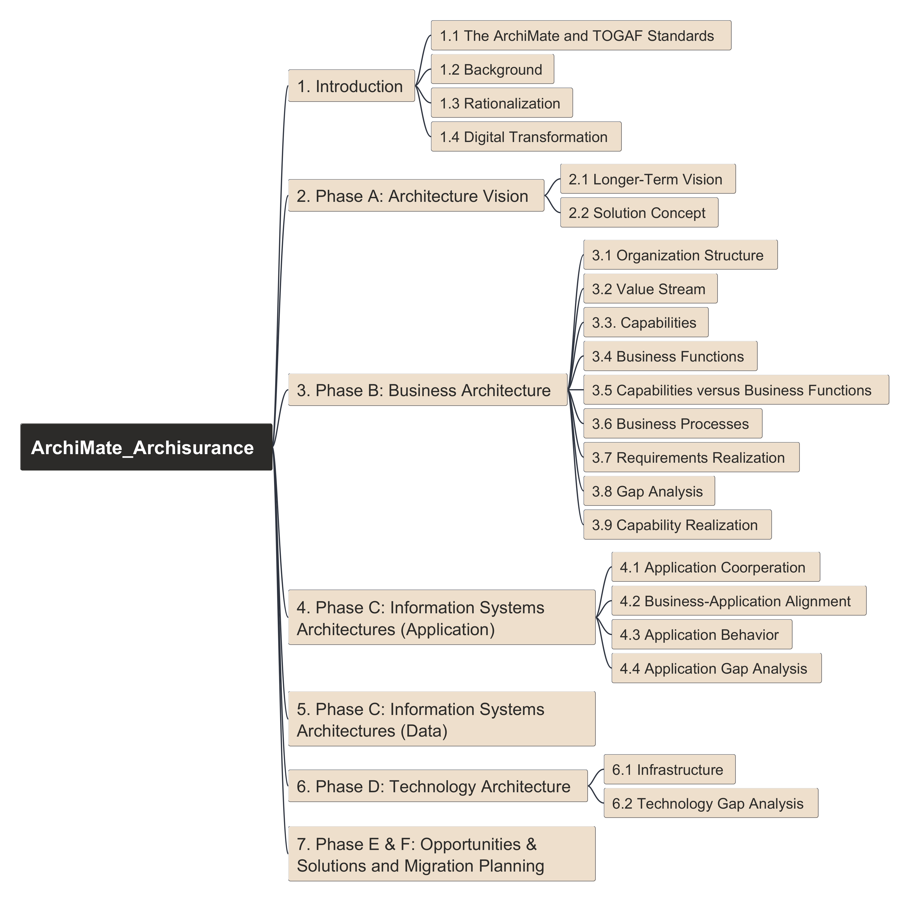

# ArchiMate ArchiSurance Practice (Edition 2025)

Updated ArchiSurance Modeling Practice Repository using Archi Tool: 

Get ArchiSurance Case Study version 3.2 from [OpenGroup Library Site.](https://publications.opengroup.org/y231)

Structure of the case studay as below:

You need FreePlane  tool to access mindmap file here - [ArchiMate_Archisurance.mm](ArchiMate_Archisurance.mm)

---

View exported HTML report for ArchiSurance here: [HTML Report](ArchiSurance_HTML_Report/index.html)

Feel free to raise your questions under videos or put here in Discussion Board.