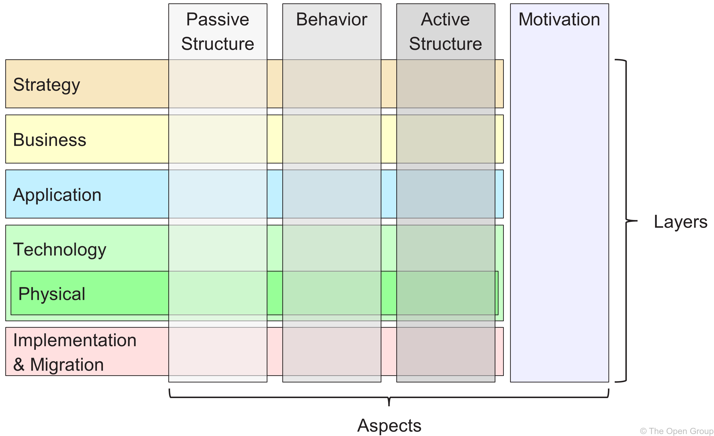

# 01 Introduction

Table of Contents
- [01 Introduction](#01-introduction)
  - [1.0 Opening Question](#10-opening-question)
  - [1.1 Background](#11-background)
  - [1.2 The ArchiMate Specification](#12-the-archimate-specification)
  - [01.3 Purpose](#013-purpose)

## 1.0 Opening Question

One first questions from [alidayani](https://github.com/alidayani) in Discussion Board, responding the modeling challenge, are

- why ArchiMate® for security architect, why not other models? and
- why set apart SABSA® architect with normal one?

In [Chapter 3](../03_Introduction_of_ArchiMate/README.md), we'll look at overall landscape of ArchiMate®, but here we may try to put some historical evolvement of OpenGroup so setting the scene:

1. TOGAF was developed from OpenGroup from Enterprise Architecture and for Enterprise Architects
2. The definition of "Enterprise Architecture" and in the lifecyle of the phases A to F, with Change Mangement in the center.
3. To answer the needs of modeling EA complying TOGAF, ArchiMate was introduced, and was commonly grouped in horizontal and vertical matrix in the industry
4. From top to bottom of horizontal - not meaning the prioritization, just placement - Business Architecture, Application Architecture, Technology Architecture - as core
5. Vertical crossing above layers called Solution Architecture, which is not explicitly visible in ArchiMate
6. ArchiMate is not one "dead" standard, it's keep evolving, and adding more context like Strategy, Motivation, Implementation & Migration
7. Expanding certain layers are also possible, like adding more notation in Technology Layer to model manufacturing enterprise with Physical Architecture meaning
8. ArchiMate community has long opened discussion thread about how ArchiMate to cope with data modeling, since there's no clear Inforemation Architecture layer there

Now, come to our Security Architecture, we should respect first that there're lots of architect roles in the world, sitting not only in IT side but also business side, ArchiMate is now only cover part of those context, but as one modeling language, it is really capable to extend in necessity.

So, you don't see Security Architecture layer in ArchiMate, doesn't means ArchiMate (or TOGAF, or OpenGroup) forgot Security Architects role, that's exactly similar like Information Architecture, means we may not yet find one common-accepted and easy adopted way to adding some more notations. However, keep in mind, the scope of "Enterprise Architecture" is "the Enterprise", so definitely, Security Architecture is in the scope of overall EA.

Then we can recap the purpose of this document, which are from the guide:

- "This document discusses how security architecture concepts can be expressed using The Open Group ArchiMate® modeling language."
- "This document describes a model-based approach for creating SABSA® artifacts using ArchiMate notation and tooling."
- "The integration of security into Enterprise Architecture methodologies, through the alignment of SABSA® concepts with the Zachman Framework™, the TOGAF® Standard, and other popular frameworks, has been established for several years." -- positive side
- "In practice, however, the lack of native support for security concepts in Enterprise Architecture modeling notations (and therefore tools and processes) has placed security architects at a disadvantage to their architectural peers." -- negative side

Why not other models? Not limited, you're freely to choose any other models or modeling language to perform your work, as long as you and your colleague, your stakeholders and your partners have those as common language.

If you look for "Information Security Framework" via any search engine, you may get following, but not limited, list of the IT security standards and frameworks:

- ISO 27001 series
- NIST SP 800-53
- NIST SP 800-171
- NIST CSF
- NIST SP 1800 series
- COBIT (from ISACA)
- CIS Controls
- HITRUST Common Security Framework
- GDPR
- COSO
- FISMA
- NERC CIP

Searching "Top Security Frameworks used by CISOs in 2025", got below 5 ones:

- NIST Cybersecurity Framework (CSF 2.0)
- ISO/IEC 27001
- CIS Controls (Version 8)
- Zero Trust Architecture
- Factor Analysis of Information Risk (FAIR)

Interesting is I found SABSA is not popular as I expected, from another point of view, that's also meaning there're quite a lot of work need to communicate SABSA to the broader audience, even to the CISOs group as well.

## 1.1 Background

Purposes of "Security Architecture":

- Protect the organization's information assets and capabilities
- Produce artifacts that guide the Enteprise Architecture development

Check here the "SABSA Blue Book" (Executive Summary):

 (Note: book cover is just for illustration, AI generated)

SABSA is a proven methodology for developing business-driven, risk and opportunity focused Security Architectures at both enterprise and solutions level that traceably support business objectives.

"Ultimately, real-world systems recognize a single, _de facto_ architecture: what __ISO 42010__ calls the __Entity of Interest (EoI)__. It makes sense to strive towards a single holistic model of the EoI, capable of describing, validating, querying and analyzing all its pertinet (相关的) functional and non-functional aspects, including the security perspective.

## 1.2 The ArchiMate Specification

Get the specification here: https://www.opengroup.org/archimate-forum/archimate-overview

Put into the analogy in below since all of them are __visual modeling languange__:

- ArchiMate: supports the description, analysis, and development of enterprise business and IT systems
- UML (Unified Modeling Language): describes software design
- BPMN (Business Process Model and Notation): describes business processes

Referred from nice article by Visual Paradigm (https://guides.visual-paradigm.com/uml-vs-bpmn-vs-archimate-in-visual-modeling/), below I'm putting the comparison into a table (prevent that online page may be not available someday ;-p):

| Aspect |  |  |  |
| --- | --- | --- | --- |
| Purpose | General-purpose modeling langauge used for software engineering, system design, and various other domains. | Specifically designed for modeling business processes, workflows, and interactions within organizations. | Enterprise architecture modeling language for describing and visualizing an organization's architecture across business, information, application, and technology layers. |
| Notation | Provides a wide range of diagram types, including class diagrams, use case diagrams, sequence diagrams, state diagrams, etc., each with its own set of symbols. | Uses a standardized set of symbols and notation specifically tailored for modeling business processes and activities. Symbols include tasks, events, gateways, and flows. | Offers a defined set of concepts and symbols to represent elements, such as business processes, applications, technology, and relationships betwen them. |
| Scope | Versatile and can be used for various aspects of software and system modeling, ranging form high-level architecture to detailed design. | Focused on modeling business processes and workflows, making it suitable for porocess analysis, improvement, and automation. | Primarily used for enterprise architecture modeling and aligning business and IT aspects, less suitable for detailed software design. |
| Audience| Typically used by software architects, designers, and developers, as well as other stakeholders involved in software engineering. | Targeted at business analysts, procss modelers, and non-technical stakeholders involved in business process management and optimization. | Mainly intended for enterprise architects and stakeholders involved in strategic planning and aligning of business and IT. |
| Clarity | Offers a wide range of diagrams, which can sometimes lead to complexity, but also allows for detailed specification. | Provides clear and intuitive (直观的) visual representations of business processes, making it accessible to both technical and non-technical audiences. | Promotes a holistic and clear view of an organization's architecture, facilitating alignment between business and IT. |
| Adoption | Widespread adoption in the software industry, with many UML modeling tools and resources available. | Widely used in organizations for business process modeling and automation, with numerous BPMN-compliant tools. | Commonly used in enterprise architecture practices, often alongside TOGAF (The Open Group Architecture Framework). |
| Complexity | Can be complex due to its broand range of diagrams and elements, making it potentially overwhelming for simple tasks. | Designed to be relatively simple and straighforward for modeling business processes, reducing complexity. | Provides a structured and systematic approach to enterprise architecture modeling, but can be complex for beginners. |
| Learning Curve | May have a steep learning curve, especially for beginners, due to its versatility and extensive features. | Generally easier to learn, particularly for those with a business process background, as it focuses on specific aspects of an organization. | Requires understanding of enterprise architecture concepts which can be challenging for newcomers. |
| Integration | Often integrated into software development processes and used with various methodologies like Agile, Waterfall, etc. | Frequently used alongside business process management (BPM) and automation tools to execute and monitor processes. | Often used in conjunction for comprehensive enterprise architecture management. |
| Use Cases | Suitable for software design, system architecture, object-oriented modeling, and more. | Best suited for modeling and optimizing business processes and workflows within organizations. | Ideal for capturing and communicting the structure and dynamics of an organizaiton's architecture. |
| Industry Standards | Standardized by the Object Management Group (OMG), with various UML profiles available for specific domains. | Developed and maintained by the OMG as well, with the focus on business process modeling and management. | Also maintained by the OMG (*?), it complements TOGAF for enterprise architecture standards. |
| Example Diagrams | Class Diagram, Use Case Diagram, Sequence Diagram, State Machine Diagram, Activity Diagram, etc. | Process Flow Diagram, Collaboration Diagram, Choreography Diagram, Message Flow Diagram, etc. | Business Layer Diagram, Application Layer Diagram, Technology Layer Diagram, Motivation Diagram, etc. |

*Question: is ArchiMate maintained by OMG? Strange to me. (Checked with Open Group, seems this statement is wrong on the page: ArchiMate is owned by The Open Group)

Here is the ArchiMate® language structure:

Find certified ArchiMate individuals: https://archimate-cert.opengroup.org/certified-individuals

Working files:

- [Snapshot ArchiMate Model - Figure01](./ArchiMate_SABSA_Figure01.archimate)
- [ArchiMate Exported Image](./Figure01_A-Simple-ArchiMate-Diagram.png)

## 01.3 Purpose

From the guide, it aims to answer following two main focus area questions:

1. What can currently be achieved within the constraints of ArchiMate language and certified tools?
2. What might further be achieved via a security-specific extension to the core language, and what would such an extension look like?

---

[<button type="button">Chapter 02»</button>](../02_Rationale_of_Alignment/README.md) [<button type="button">HOME</button>](../README.md)

---

Any comments are welcome, feel free to raise pull-request or post in [Discussion Board](https://github.com/yasenstar/ArchiMate_SABSA/discussions)