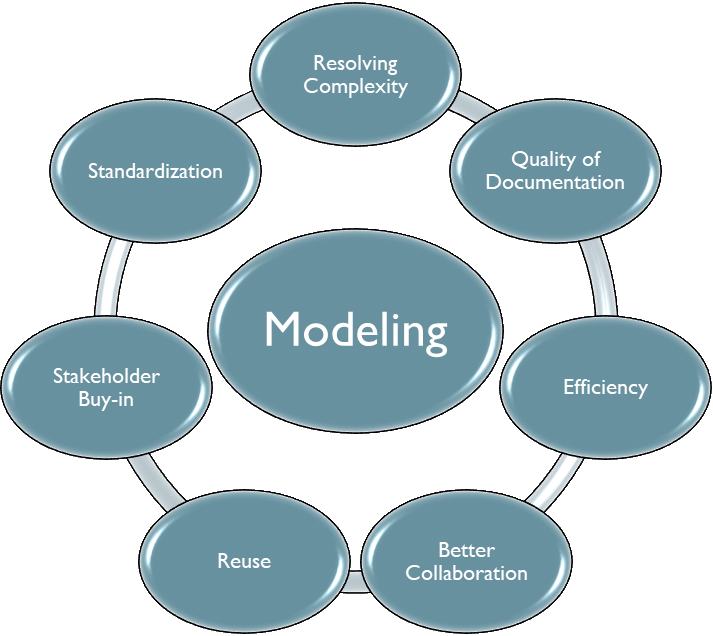
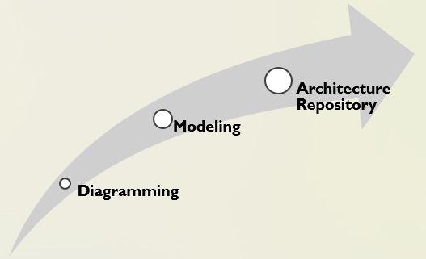

# 02 Rationale for the Alignment of SABSA and ArchiMate

Table of Contents

- [02 Rationale for the Alignment of SABSA and ArchiMate](#02-rationale-for-the-alignment-of-sabsa-and-archimate)
  - [02.1 Benefits of Modeling](#021-benefits-of-modeling)
  - [02.2 The Case for an ArchiMate Security Perspective](#022-the-case-for-an-archimate-security-perspective)
  - [02.3 Benefits that Modeling Can Bring to SABSA](#023-benefits-that-modeling-can-bring-to-sabsa)
  - [02.4 Benefits of Modeling to the Practitioner](#024-benefits-of-modeling-to-the-practitioner)
  - [02.5 Vendor Neutrality](#025-vendor-neutrality)

## 02.1 Benefits of Modeling

Models serves a system's structure or behavior in following ways, without interacting system itself:

- document
- query
- analyze
- explain
- explore
- validate
- plan
- teach
- predict

The characteristics of modeling are:

| Characteristics | Illustration |
| --- | --- |
| - Resolving complexity - Quality of documentation - Efficiency - Better collaboration - Reuse - Stakeholder buy-in - Standarization |  |

Furthermore, let's distinguish below three concepts, which may exist in different architectural team:

| Name | Detail | Archi Context |
| --- | --- | --- |
| Diagramming | A diagram is a picture that shows elements and their relationships, while a second diagram that displays the same elements and relationships but does not share an underlying model may easily become inconsistent with the original diagram. | Archi Sketch View can be sample of Diagramming |
| Modeling | A model is a non-visual artifact that defines elements and the relationships between them, which you can choose to produce a diagram | Standalone Archi Usage is one typical Modeling Tool |
| Architecture Repository | A central storage system that maintains and provides access to all architecture artifacts, models, principles, standards, and governance assets created and used by an enterprise. | Archi with coArchi plug-in and utilizing source control within whole architecture team for collaborating |

## 02.2 The Case for an ArchiMate Security Perspective

With a Security Overlay (安全覆盖) extending the language with a means of expressing security perspectives, the ArchiMate® modeling language has the potential to unify the distinct but intrinsically (本质上) interrelated domains between "Enterprise Architecture" and "Enterprise Security Architecture".

## 02.3 Benefits that Modeling Can Bring to SABSA

According to SABSA methodology,

- Focus: risk-driven enterprise information security and information assurance
- Goal: deliver security solutions and architectures designed to support critical business initiatives.

Performing SABSA well requires a formidable (强大) information management capability in order to keep artifacts current and consistent as the required velocity.

A model-driven approach has the potential to resolve this information management problem:

- By generating artifacts as views of a single underlying model, any changes to an item is immediately effective globally.
- Qualities such as referential integrity can be revalidated automatically.
- The review cycle is streamlined (based on views reflecting stakeholder perspectives), and
- When all is correct, the documentation set can be auto-generated with the assurance that it is consistent with a single source of truth.

## 02.4 Benefits of Modeling to the Practitioner

...to have observed that the act of committing an idea to writing, of explaining a concept in layman's terms or of implementing some intuitive (直觉的) functionality in software will often uncover gaps, nuances (细微差别), false assumptions, special cases, and other conundrums (难题) that ultimately lead to a deeper and more complete understanding.

Modeling is just such an activity: the factorization of an EoI into structural/behavioral dimensions, the focus on one aspect at a time, the careful construction of viewpoints within notational constraints.

The act of modeling often revewals key insights that might otherwise be glossed (光泽) over in an informal diagram, lost in the data of a spreadsheet or lie inconspicuously (不显眼地) in a lengthy, serialized, text-bsaed description.

In short, the discipline of modeling is likely to train the practitioner into being a sharper, more effective, security analyst.

## 02.5 Vendor Neutrality

The ArchiMate diagrams featured in this guide document and realted models have been created using the free Archi® modeling tool.

---

[<button type="button">«Chapter 01</button>](../01_Introduction/README.md) [<button type="button">Chapter 03»</button>](../03_Introduction_of_ArchiMate/README.md) [<button type="button">HOME</button>](../README.md)

---

Any comments are welcome, feel free to raise pull-request or post in [Discussion Board](https://github.com/yasenstar/ArchiMate_SABSA/discussions)