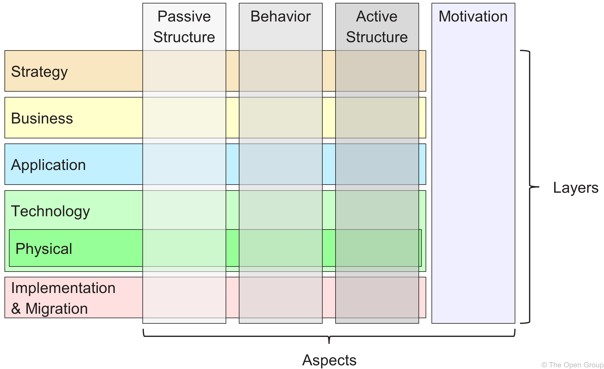

# 03 An Introduction to the ArchiMate® Language

Table of Contents

- [03 An Introduction to the ArchiMate® Language](#03-an-introduction-to-the-archimate-language)
  - [3.1 Core Elements](#31-core-elements)
  - [3.2 Core Relationships](#32-core-relationships)
  - [3.3 Extension Layers and Elements](#33-extension-layers-and-elements)
  - [3.4 ArchiMate Language Customization](#34-archimate-language-customization)
    - [3.4.1 User-Defined Attributes](#341-user-defined-attributes)
    - [3.4.2 Sepcialization and "Stereotypes" -- IMPORTANT](#342-sepcialization-and-stereotypes----important)
    - [3.4.3 Overloaded Relationships](#343-overloaded-relationships)
  - [3.5 The ArchiMate Full Framework](#35-the-archimate-full-framework)
  - [Some Learning Sources about ArchiMate](#some-learning-sources-about-archimate)
  - [About ArchiMate License and Trademark](#about-archimate-license-and-trademark)

## 3.1 Core Elements

The ArchiMate core elements belong to one of 3 categories (think about them from one graph / triple aspect):

 - Active Structure Elements (Subject)
 - Behavior Elements (Predicate)
 - Passive Structure Elements (Object)

Support _service-oriented_ viewpoints:

- Enternal Behavior Elements (Services)
- Internal Behavior Elements (Processes & Functions)
- External Active Structure Elements (Interfaces)
- Internal Active Structure Elements (Actors, Roles, Applications, Devices)

## 3.2 Core Relationships

Four relationships categories:

| Category | Purpose | Relationships |
| --- | --- | --- |
| Structural | Model the static construction or composition of elements | composition, aggregation, realization, assignment |
| Dependency | How elements support each other | serving, access, influence, association |
| Dynamic | Model information and control flows between elements | triggering, flow |
| Specialization | others | specializing |

The language __does not allow__ elements and relationships to be combined arbitrarily (任意地).

## 3.3 Extension Layers and Elements

- Strategy Layer (change to "Layer" from 3.2): Resource, Capability, Course of Action, Value Stream
- Motivation Elements: Stakeholder, Driver, Assessment, Goal, Outcome, Principle, Requirement, Constraint, Meaning, Value
- Implementation and Migration Layer: Work Package, Deliverable, Implementation Event, Plateau, Gap
- Composition Elements: Location, Grouping

## 3.4 ArchiMate Language Customization

- ArchiMate Model File: [ArchiMate_SABSA_Figure02.archimate](./ArchiMate_SABSA_Figure02.archimate)
- ArchiMate Exported Image: [Figure02_In-Model-vs-Out-of-Model-Specialization.png](./Figure02_In-Model-vs-Out-of-Model-Specialization.png)

### 3.4.1 User-Defined Attributes

link to ArchiMate Specification 14.1 "Adding Attributes to ArchiMate Concepts"
- Both the ArchiMate Specification and the Model Exchange File Format support basic property types: string, integer, real, boolean, currency, date, time, URL, etc.
- In order to support compound properties, the Security Overlay occasionally uses text strings in JavaScript™ Object Notation (JSON) format

### 3.4.2 Sepcialization and "Stereotypes" -- IMPORTANT

- "In-Model" specialization uses the specoialization relationship introducted in [3.2.1](#32-core-relationships) to show that one element is a particular kind of another (i.e. a subtype)
- "Out-of-Model" specialization is denoted by double chevrons in a type-qualified name (resembinling a UML stereotype: « »)
  - "Staff Member" is modeled using Specialization relation
  - "Threat Agent" is modeled using «_stereotype_» notation, emphasizing that it is somewhat untypical of "a _buisness entity of performing behavior_", it is not derived from another Actor via inheritance.
- "isAbstract" property is denoted by Security Overlay with its name in _Italics_, which is another UML convention.

### 3.4.3 Overloaded Relationships

The ArchiMate language uses relationship overloading: the same symbol represents different but semantically compatible concepts in different context.

Overloading trades minimization of the vocabulary for a minor loss of precision.

The Security Overlay will further overload relationships in keeping with this general principles.

## 3.5 The ArchiMate Full Framework

You already see this in [Chapter 1: Introduction](../01_Introduction/README.md):

Then below is the mapping of the ArchiMate Specification to the TOGAF Architecture Development Method (ADM):

## Some Learning Sources about ArchiMate

- ArchiMate Modeling Case Study - ArchiSurance
  - [Udemy - Archi (ArchiMate) Modeling Practices with ArchiSurance](https://www.udemy.com/course/archi-archimate-modeling-practices-with-archisurance/)
  - [Udemy - ArchiMate - ArchiSurance 4.3 - Modeling Practice (2025)](https://www.udemy.com/course/archimate-archisurance-modeling-practice-2025/)
  - [YouTube videolist - ArchiTool Modeling Practice - ArchiSurance (ArchiMate)](https://www.youtube.com/playlist?list=PL6DEHvciXKeXj1IlGBRB0KMaSv5Xt38uk)
- ArchiMate Modeling Case Study - ArchiMetal
  - [Udemy - Archi (ArchiMate) Modeling Practices with ArchiMetal](https://www.udemy.com/course/archi-archimate-modeling-practices-with-archimetal/)
  - [YouTube videolist - ArchiTool Modeling Practice - ArchiMetal (ArchiMate)](https://studio.youtube.com/playlist/PL6DEHvciXKeW_08V5guF_LIaxTOnx5b-s/edit)

Joint ArchiMate with Ontology in Modeling:

- [Udemy - Master ArchiMate 3.2 Specification - Ontology and Modeling](https://www.udemy.com/course/build-ontology-view-with-learning-archimate/?referralCode=6A3B23ADD67551B38D2B)
  
- [YouTube video list - Build Ontology View on ArchiMate 3.2 Language Meta-Model](https://studio.youtube.com/playlist/PL6DEHvciXKeUWWe--FiiSIyga0vt3kBpI/edit)

Welcome to have your support to my packaged course, well you may also view a series of those videos in YouTube as I'd like that can be shared more.

## About ArchiMate License and Trademark

Look at this post: https://ea.rna.nl/2016/05/23/is-archimate-an-open-standard-not-really/comment-page-1/ (Also I put [PDF version](./Is_ArchiMate_an_Open_Standard_Not_really.pdf) extracted)

---

[<button type="button">«Chapter 02</button>](../02_Rationale_of_Alignment/README.md) [<button type="button">Chapter 04»</button>](../04_Align_SABSA_and_ArchiMate_Framework/README.md) [<button type="button">HOME</button>](../README.md)

---

Any comments are welcome, feel free to raise pull-request or post in [Discussion Board](https://github.com/yasenstar/ArchiMate_SABSA/discussions)