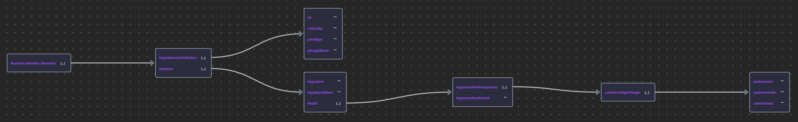
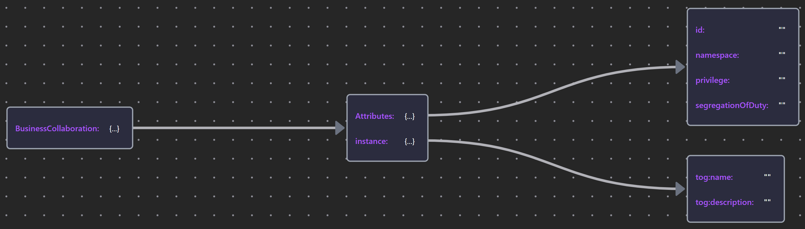

# 06 Modeling the Contextual Security Architecture

- [06 Modeling the Contextual Security Architecture](#06-modeling-the-contextual-security-architecture)
  - [6.0 Overview](#60-overview)
    - [Table 19: SABSA Contextual Architecture](#table-19-sabsa-contextual-architecture)
    - [Figure 29: Developing and Maintaining the Contextual Security Architecture](#figure-29-developing-and-maintaining-the-contextual-security-architecture)
    - [Table 20: Contextual Elements](#table-20-contextual-elements)
  - [6.1 Business Assets](#61-business-assets)
    - [6.1.1 Capability and Value Stream](#611-capability-and-value-stream)
    - [6.1.2 Business Object](#612-business-object)
    - [6.1.3 Business Service, Interface, and Service Level Agreements](#613-business-service-interface-and-service-level-agreements)
  - [6.2 Business Risk](#62-business-risk)
  - [6.3 Business Process/Function/Interaction](#63-business-processfunctioninteraction)
  - [6.4 Business Roles and Actors](#64-business-roles-and-actors)
    - [6.4.1 Governance](#641-governance)
    - [6.4.2 Threat Actors](#642-threat-actors)
  - [6.5 Business Geography](#65-business-geography)
  - [6.6 Business Time Dependencies](#66-business-time-dependencies)


## 6.0 Overview

The SABSA Matrix illustration:


_Sourse: https://www.slideshare.net/MVeeraragaloo/sabsa-implementationpart-viver10_

another Matrix view with Lifecycle context:


_Source: https://www.alctraining.com.sg/course/sabsa-foundation/_

### Table 19: SABSA Contextual Architecture

Using Protégé tool, the snapshot ontology model is here: [sabsa_matrices_2018_table19.rdf](./Table19/sabsa_matrices_2018_Table19.rdf)

Putting SABSA Contextual Architecture layer in the middle, below is the screenshot from onto-graph, base on Table19:


### Figure 29: Developing and Maintaining the Contextual Security Architecture

Tha above outline enables us to visualize the set of processes and activities necessary to create and maintain an Architectural Description of the Contextual Architecture, expressed in ArchiMate Specification in below Figure 29.

Snapshot ArchiMate Model: [Model till Figure29](./Figure29/ArchiMate_SABSA_Figure29.archimate)


### Table 20: Contextual Elements

Here are the summarization of native ArchiMate elements that are available to model the contextual layer:


Snapshot ArchiMate Model: [Archi Model till Table20](./Table20/ArchiMate_SABSA_Table20.archimate)

## 6.1 Business Assets

### 6.1.1 Capability and Value Stream

- `Value Stream` is a behavioral element within ArchiMate's Strategy Layer
- A key principle of a `Value Stream` is that its value is always defined from the perspective of the Stakeholder, the consumer of the product, service, or deliverable, and not on its intrinsic value; i.e., the cost of production
- The value of `Value Stream` can be modeled in the ArchiMate language using the `Value` element.

Here is an example of a Value Stream is provided by the ArchiMate Specification:


Snapshot ArchiMate Model: [Figure 30 Value Stream Modeling](./Figure30/ArchiMate_SABSA_Figure30.archimate)

### 6.1.2 Business Object

- `Business Object` represent Information Assets.

| Element | Schema File | Schema Visualization |
| --- | --- | --- |
| Business Object | [Business Object JSON](./Table22/BusinessObject.json) |  |

Below Figure 31 shows the relation with SABSA Attributes: a `Business Object` (Medical Record) has confidentiality property of "CONFIDENTIAL" and is also tagged with the SABSA Attribute of the same name.


Snapshot ArchiMate Model: [Figure31 Model](./Figure31/ArchiMate_SABSA_Figure31.archimate)

Label Expression for `Business Object` - Medical Record:

```BASH
${name}
---------------------------------
confidentiality: ${property:confidentiality}
integrity: ${property:integrity}
authenticity: ${property:authenticy}
pii: {
    "classification":"${property:pii-classification}"
    "couldBeMinor":"${property:pii-couldBeMinor}"
    "reviewPeriod":"${property:pii-reviewPeriod}"
}
retention: ${property:retention}
```

### 6.1.3 Business Service, Interface, and Service Level Agreements

In terms of asset analysis, the most important aspects of service elements are those committed in a Service Level Agreement (SLA) that incurs panalties if not delivered.

- Business Layer services need a distinct property set when they are offered through human interfaces.
- SLA is using `Contract` element, a bespoke `Requirement`/`Constraint` may also be used where a simple property is insufficient.
- `Business Service`s may be offered via multiple interfaces (`Business Interface`)

| Element | Schema File | Schema Visualization |
| --- | --- | --- |
| Business Servie (SLA) | [Business Service (SLA) JSON](./Table23/BusinessService-SLA.json) |  |
| Business Interface | [Business Interface JSON](./Table23/BusinessInterface.json) |  |

## 6.2 Business Risk

- Risk, threats, vulnerabilities, and opportunities can be modeled at the Business and Strategy level using the orthodox ArchiMate approach discussed in [Section 4.3](../04_Align_SABSA_and_ArchiMate_Framework/README.md#43-risk--security-modeling-in-the-archimet-specification)
- The Security Overlay adds stereotyps(«») of motivational layer elements for this purpose, introduced in [Section 5.5](../05_Motivation_Aspect/README.md#55-impact-threat-vulnerability-and-risk)

## 6.3 Business Process/Function/Interaction

- `Business Process` are often categorized in terms of their criticality to core business mission, capabilities, and value chains.
- Behavioral elements may also be deemed sensitive due to the way they operate on information.

| Element | Schema File | Schema Visualization |
| --- | --- | --- |
| Business Behavior Elements (Process/Function/Interaction) | [Business Behavior Elements JSON](./Table24/BusinessBehaviorElements.json) |  |
| Access Relationship | [Access Relationship JSON](./Table24/Access.json) |  |

## 6.4 Business Roles and Actors

In ArchiMate Specification, `Actors` represent human or organizational entities that can be assigned to `Roles` that describe:

- The extent of their responsibilities with respect to a given `business process`
- Their use of `business and application services`

| Element | Schema File | Schema Visualization |
| --- | --- | --- |
| Business Actor | [Business Actor JSON](./Table25/BusinessActor.json) |  |
| «DataSubject» | [«DataSubject» JSON](./Table25/«DataSubject».json) |  |
| Business Role | [Business Role JSON](./Table25/BusinessRole.json) |  |
| Business Collaboration | [Business Collaboration JSON](./Table25/BusinessCollaboration.json) |  |
| Serving Relation | [Serving JSON](./Table25/Serving.json) |  |

### 6.4.1 Governance

Governance runs like a seam through the People column of the SABSA Matrix.

RACI presents an interesting design consideration in the ArchiMate Specification. Applying "Subject-Verb-Object" syntax to RACI requires considering what the "Process of Being Accounatable" means and what it would look like.


Snapshot ArchiMate Model: [Figure32: Representing RACI Relationships](./Figure32/ArchiMate_SABSA_Figure32.archimate)

Refer to 5.3.1 for similar Singularities issues.

| a) A Pattern Repeated in Multiple Views | b) ... Causes Entanglement in the Underlying Model |
| --- | --- | 
|  |  |

Snapshot ArchiMate Model: [Figure33](./Figure33/ArchiMate_SABSA_Figure33.archimate)

| a) Solved by a Tetiary Relationship | b) Solved by Specialization of an Abstract Base Role |
| --- | --- | 
|  |  |

Snapshot ArchiMate Model: [Figure34](./Figure34/ArchiMate_SABSA_Figure34.archimate)

| Element | Schema File | Schema Visualization |
| --- | --- | --- |
| «RACI» | [RACI JSON](./Table26/RACI.json) |  |

### 6.4.2 Threat Actors

Seurity models, by definition, have to consider the potential abuse of a system through malicious intent.

Three possible ways of modeling Threats are:

1. As an `Actor`: A constituency that is known to pose an accidental or intentional threat
2. As a `Role`: Representing a malicious intent, directed against the target system
3. As an `action (a behavior or event)` that occurs by error, omission, or intent

All of above three raise concerns shown in below Figure 35:


Snapshot ArchiMate Model: [Figure 35: Possibilities for Modeling Threat Actors](./Figure35/ArchiMate_SABSA_Figure35.archimate)

Below Figure 36 shows sensitivity in the representation of threats:


Snapshot ArchiMate Model: [Figure 36: Sensitivity in the Representation of Threats](./Figure36/ArchiMate_SABSA_Figure36.archimate)

The profile for the Threat Agent element is shown as below schema:

| Element | Schema File | Schema Visualization |
| --- | --- | --- |
| Threat Agent | [Threat Agent JSON](./Table27/ThreatAgent.json) |  |

## 6.5 Business Geography

- Business geography is easily modeled using the ArchiMate `Location` element unadorned (朴素).

## 6.6 Business Time Dependencies

- The SABSA Time cell is concerned with the delivery schedule of `goals` and responding to `events`.
- Target dates in the ArchiMate Specification are intrinsic to the definition of a `Goal` (a desired state to be reached by a defined point in time) and can be make explicit through `Implementation and Migration` views.
- The `Business Event` element can be used unadorned.

---

[<button type="button">«Chapter 05</button>](../05_Motivation_Aspect/README.md) [<button type="button">Chapter 07»</button>](../07_Modeling_Conceptual_Security_Architecture/README.md) [<button type="button">HOME</button>](../README.md)

---

Any comments, feel free to post to the [Discussion Board](https://github.com/yasenstar/ArchiMate_SABSA/discussions).