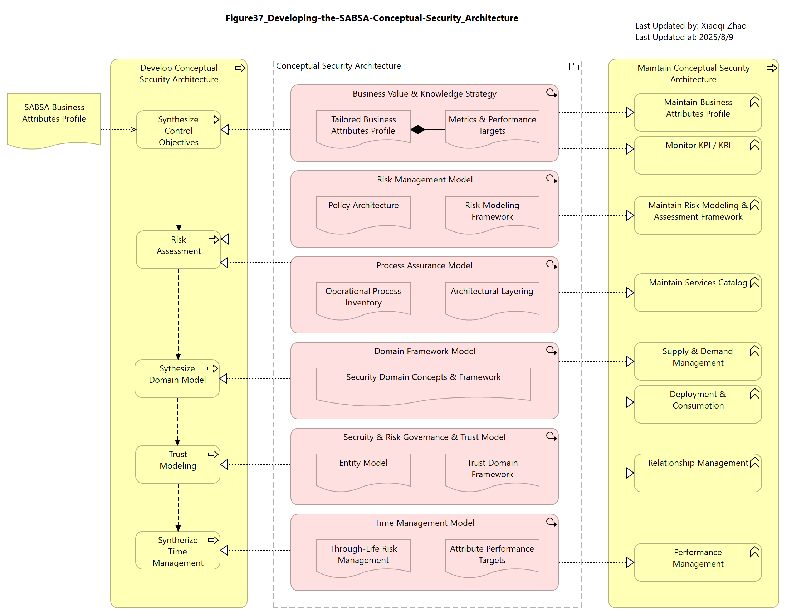

# 07 Modeling the Conceptual Security Architecture

- [07 Modeling the Conceptual Security Architecture](#07-modeling-the-conceptual-security-architecture)
  - [7.0 Overview](#70-overview)
    - [Table 28: SABSA Conceptual Security Architecture](#table-28-sabsa-conceptual-security-architecture)
    - [Figure 37: Developing the SABSA Conceptual Security Architecture](#figure-37-developing-the-sabsa-conceptual-security-architecture)
  - [7.1 Attribute Profiling](#71-attribute-profiling)
    - [Figure 38: Attribute Profiling (i)](#figure-38-attribute-profiling-i)
    - [Figure 39: Attribute Profiling (ii)](#figure-39-attribute-profiling-ii)
    - [Figure 40: Attribute Profiling (iii)](#figure-40-attribute-profiling-iii)
    - [Figure 41: Completed Attribute Profile](#figure-41-completed-attribute-profile)
  - [7.2 Risk Management \& Strategy](#72-risk-management--strategy)
    - [7.2.1 Risk Management](#721-risk-management)
      - [Figure 42: Business Risk Analysis Process](#figure-42-business-risk-analysis-process)
    - [7.2.2 Policy Architecture](#722-policy-architecture)
      - [Figure 43: Compliance Metamodel](#figure-43-compliance-metamodel)
      - [Figure 44: An Example Compliance Model - NIST 800-53](#figure-44-an-example-compliance-model---nist-800-53)
    - [7.2.3 Multi-Regulatory Compliance](#723-multi-regulatory-compliance)
      - [Figure 45: Control Consolidation](#figure-45-control-consolidation)
      - [Figure 46: Possible Duplicate Objectives, Coupled Through Attribute Profile](#figure-46-possible-duplicate-objectives-coupled-through-attribute-profile)
  - [7.3 Conceptual Security Services](#73-conceptual-security-services)
    - [Figure 47: Security Services in the Conceptual Layer](#figure-47-security-services-in-the-conceptual-layer)
  - [7.4 Identity and Trust](#74-identity-and-trust)
    - [7.4.1 Identity and Access Rights](#741-identity-and-access-rights)
      - [Figure 48: What is the Security Overlay Would Like to Express](#figure-48-what-is-the-security-overlay-would-like-to-express)
      - [Figure 49: What the ArchiMate Specification Supports](#figure-49-what-the-archimate-specification-supports)
      - [Table 29: Elements used in Logical Access Management](#table-29-elements-used-in-logical-access-management)
    - [7.4.2 Roles and Responsibilities](#742-roles-and-responsibilities)
      - [Figure 50: Modeling Identity and Role Concepts](#figure-50-modeling-identity-and-role-concepts)
    - [7.4.3 Trust](#743-trust)
      - [Figure 51: Common Examples of Signals Crossing Domain Boundaries](#figure-51-common-examples-of-signals-crossing-domain-boundaries)
      - [Figure 52: Simple Trust Relationships using Flow](#figure-52-simple-trust-relationships-using-flow)
      - [Figure 53: Trust Attributes Associated with Inter-Domain Signals](#figure-53-trust-attributes-associated-with-inter-domain-signals)
      - [Table 30: Elements and Relationships used in Trust Modeling](#table-30-elements-and-relationships-used-in-trust-modeling)
  - [7.5 Domain Framework Model](#75-domain-framework-model)
    - [Table 31: Security Domain Mapping](#table-31-security-domain-mapping)
  - [7.6 Security Events](#76-security-events)
    - [Table 32: Security Events](#table-32-security-events)

## 7.0 Overview

### Table 28: SABSA Conceptual Security Architecture

Snapshot Protege RDF File: [sabsa_matrices_2018_ch07.rdf](./sabsa_matrices_2018_ch07.rdf)

You may find the detail descriptions per Artifacts and Avtivity, the ontology / matrix outline enables the visualizing the set of processes and activities necessary to create and maintain an Architecture Descroption of the Conceptual Architecture.

### Figure 37: Developing the SABSA Conceptual Security Architecture

Although the Conceptual layer has no ArchiMate equivalent, many of the asset (What) and motivation (Why) concepts (attribute profiles, metrics, risk, compliance, control objectives, and layering, etc.) have already been discussed as stereotypes of Motivation elements (see [Chapter 5](../05_Motivation_Aspect/README.md))

Snapshot ArchiMate Model: [Figure 37: Developing SABSA Conceptual Security Architecture](./Figure37/ArchiMate_SABSA_Figure37.archimate)

## 7.1 Attribute Profiling

Key points for presenting SABSA Attributes in ArchiMate language:

- SABSA Attributes are at the apex of the `motivation` pyramid - more abstract than Control Objectives
- SABSA Attributes are global atomic singletons: existing at most once in the model and never appearing, even as copies, more than once in any ArchiMate diagram
- In models, SABSA Attribute profiles are constructed using `influence relationships` to form tree structures that broadly follow the layered architecture
- Each SABSA Attribute may influence/be influenced by zero or more other Attributes, but the tree structure must hold: these `influence relationships` should not be directed downwards from higher to lower layers, so circular paths should not occur in the structure
- SABSA Attributes should be associated to the elements to which they apply, and must be influenced by another `Motivation element`: typically, another Attribute and ultimately by a `Goal` or `Requirement`

### Figure 38: Attribute Profiling (i)

Following section describes the creation of such a profile through a worked example from [GDPR Article 5](https://gdpr-info.eu/art-5-gdpr/), which sets out the principles relating to the processing of personal data.

Article 5 clause (a) states:

"Personal data shall be (a) processed __lawfully__, __fairly__ and in a __transparent__ manner in relation to the data subject ("lawfulness, fairness, and transparency")."

Below Figure 38 shows the Attribute Profiling (i):

.png)

Snapshot ArchiMate Model: [Figure 38: Attribute Profiling (i)](./Figure38/ArchiMate_SABSA_Figure38.archimate)

### Figure 39: Attribute Profiling (ii)

Article 5 clause (b) states:

"(b) collected for __specified__, __explicit__ and __legitimate__ purposes and not further processed in a manner that is incompatible with those purposes; further processing for archiving purposes in the public interest, scientific or historical research purposes or statistical purposes shall, in accordance with Article 89(1), not be considered to be incompatible with the initial purposes (‘purpose limitation’);"

.png)

Snapshot ArchiMate Model: [Figure 39: Attribute Profiling (ii)](./Figure39/ArchiMate_SABSA_Figure39.archimate)

### Figure 40: Attribute Profiling (iii)

Article 5 clause (c) & (d) states:

"(c) __adequate__, __relevant__ and __limited__ to what is necessary in relation to the purposes for which they are processed (‘data minimisation’);"

"(d) __accurate__ and, where necessary, __kept up to date__; every reasonable step must be taken to ensure that personal data that are inaccurate, having regard to the purposes for which they are processed, are erased or rectified without delay (‘accuracy’);"

.png)

Snapshot ArchiMate Model: [Figure 40: Attribute Profiling (iii)](./Figure40/ArchiMate_SABSA_Figure40.archimate)

### Figure 41: Completed Attribute Profile

Article 5 clause (e) & (f) states:

"(e) kept in a form which permits __identification__ of data subjects for no longer than is necessary for the purposes for which the personal data are processed; personal data may be stored for longer periods insofar as the personal data will be processed solely for archiving purposes in the public interest, scientific or historical research purposes or statistical purposes in accordance with Article 89(1) subject to implementation of the appropriate technical and organisational measures required by this Regulation in order to safeguard the rights and freedoms of the data subject (‘storage limitation’);"

"(f) processed in a manner that ensures appropriate security of the personal data, including __protection__ against unauthorised or unlawful processing and against __accidental loss__, __destruction or damage__, using appropriate technical or organisational measures (‘__integrity__ and __confidentiality__’)."

"2. The controller shall be __responsible__ for, and be able to demonstrate compliance with, paragraph 1 (‘accountability’)."

Snapshot ArchiMate Model: [Figure 41: Completed Attribute Profile](./Figure41/ArchiMate_SABSA_Figure41.archimate)

## 7.2 Risk Management & Strategy

Risk and its constituent factors (threat, vulnerability and impact) are modeled as stereotypes of `Assessment` (adhering to the guidance in [Section 4.3](../04_Align_SABSA_and_ArchiMate_Framework/README.md#43-risk--security-modeling-in-the-archimet-specification) and [Section 5.5](../05_Motivation_Aspect/README.md#55-impact-threat-vulnerability-and-risk))

The Security Overlay provides high-level representations of these concepts that can be adapted to suit an organization's preferred risk methodology. The schema for these elements has already been presented in [Table 13: Risk Element Properties](../05_Motivation_Aspect/README.md#table-13-risk-element-properties)

### 7.2.1 Risk Management

#### Figure 42: Business Risk Analysis Process

The `Motivation` apsect of the SABSA Matrix also addresses the process of risk management. Recalling the discussion of architectural planes in [Section 4.2](../04_Align_SABSA_and_ArchiMate_Framework/README.md#42-an-overview-of-the-task), a risk analysis process would be modeled in the 2nd architecture (Management Processes) and look something like that shown in below Figure 42:

Snapshot ArchiMate Model: [Figure 42: Business Risk Analysis Process](./Figure42/ArchiMate_SABSA_Figure42.archimate)

### 7.2.2 Policy Architecture

The Policy Architecture is a framework of codified statements of regulatory compliance controls or those documented in the organization's policies and standards.

As discussed in [Section 5.8](../05_Motivation_Aspect/README.md#58-regulations-and-standards), policies, standards, and regulations are modeled as `Representation` stereotypes containing a structure of `Groupings`, `Articles/Mandates`, `Compliance Objectives`, and `Requirements`.

#### Figure 43: Compliance Metamodel

To help manage the organization's compliance posture, the Security Overlay provides elements that support the architectural pattern shown in the below Figure 43 - metamodel:

Snapshot ArchiMate Model: [Figure 43: Compliance Metamodel](./Figure43/ArchiMate_SABSA_Figure43.archimate)

The structure of the compliance document is shown on the left, the Target Architecture on the right.

Two kinds of relationships link them: one denoting the applicability (applicable to) of Control Objectives to Assets (core layer elements) and the other implementation (implements) of Control Requirement (and Constraints) by real-world Controls.

A state of compliance posture is demonstrated if, and only if, the following can be established:

- Each Asset to which an Objective applies is protected by a Control that implements each of the Requirements necessary to realize that Objective; i.e., these exists the closed path
- All Controls on these paths produce Evidence of effectiveness that meet minimum criteria.

The former, necessary but not sufficient, may be established by path analysis of the model.

The extent to which the latter can be automated varies on a control-by-control basis.

#### Figure 44: An Example Compliance Model - NIST 800-53

Below Figure 44 shows how this might be applied to model compliances with [NIST SP800-35r5 Objective, AC-1](https://csrc.nist.gov/pubs/sp/800/35/final):

Snapshot ArchiMate Model: [Figure 44: An Example Compalince Model](./Figure44/ArchiMate_SABSA_Figure44.archimate)

### 7.2.3 Multi-Regulatory Compliance

#### Figure 45: Control Consolidation

During Section 5.7 and Section 7.1 we can build an Attribute profile from a multi-tiered risk analysis or compliance mandate to produce a structure that resembels either the right or left side of below Figure 45:

Snapshot ArchiMate Model: [Figure 45: Control Consolidation](./Figure45/ArchiMate_SABSA_Figure45.archimate)

#### Figure 46: Possible Duplicate Objectives, Coupled Through Attribute Profile

## 7.3 Conceptual Security Services

The Process cell of the SABSA Matrix considers the "How" of Conceptual Layer Services.

[Section 4.3](../04_Align_SABSA_and_ArchiMate_Framework/README.md#43-risk--security-modeling-in-the-archimet-specification) describes how Control Requirements must eventually be implemented by concrete measures in the core layers, shown in [Figure 8](../04_Align_SABSA_and_ArchiMate_Framework/Figure08_Mapping-of-Risk-and-Security-Elements.png) as Security Services and later extended in [Section 5.10](../05_Motivation_Aspect/README.md#510-control-mechanisms) by the Security Overlay's «Control» stereotype for non-service-oriented mechanisms.

However, 2 important security services must be represented at the conceptual level because they mediate the use of Logical layer resources by Business Layer Actors -- Authentication and Access Control.

### Figure 47: Security Services in the Conceptual Layer

Below Figure 47 shows some possible options to represent these services in our models:

Snapshot ArchiMate Model: [Figure 47: Security Services in Comceptual Layer](./Figure47/ArchiMate_SABSA_Figure47.archimate)

Two importants things to note:

1. Conceptual services are Singletons: the idea of an Authentication Service, e.g., is unique, no matter how many ways it might be implemented
2. A convention on service placement: Access Control mediates access to services; Actors authenticate to interfaces

## 7.4 Identity and Trust

The "People" cell of the SABSA Conceptual Layer considers how business entities (Organizational Actors and Roles) can be mapped to their Logical conterparts (Accounts and Application Roles); an important topic, given the emphasis placed on Logical Access Management (LAM) in security governance.

Similarly, the trust that exists between real-world actors needs to be made explicit in our models if it is to be adequately protected.

### 7.4.1 Identity and Access Rights

LAM is a logical layer process that provides Contextual entities (Actors in Business Layer) with suitably provisioned accounts, principally to access applications and technology.

A few Conceptual elements (Principal, Access Rights, Credentials) are required to establish this mapping from Contextual to Logical elements.

Currently, none of the concepts mentioned, nor any representation of Accounts and Application Roles, exist in the ArchiMate Specification.

#### Figure 48: What is the Security Overlay Would Like to Express

Below Figure 48 shows what Security Overlay would like to express:

Snapshot ArchiMate Model: [Figure 48: What the Security Overlay Would Like ot Express](./Figure48/ArchiMate_SABSA_Figure48.archimate)

#### Figure 49: What the ArchiMate Specification Supports

Unfortunately, these cases extend the grammer of the ArchiMate language beyond that for it was designed: `realization` between elements of the same type and Role `composition` into Application are not legal.

The closest approximation supported by the language specification is shown in below Figure 49, with an improvised `Realization` relationship (created from a stereotyped Serving) used to derive Conceptual layer elements from Business ones and Logical layer entities from Conceptual ones.

Snapshot ArchiMate Model: [Figure 49: What the ArchiMate Sepcification Supports](./Figure49/ArchiMate_SABSA_Figure49.archimate)

#### Table 29: Elements used in Logical Access Management

| Element | Schema File | Schema Visualization |
| --- | --- | --- |
| «Principal» | [Principal JSON](./Table29/Principal.json) |  |
| «Authorization» | [Authorization JSON](./Table29/Authorization.json) |  |
| «Credential» | [Credential JSON](./Table29/Credential.json) |  |

### 7.4.2 Roles and Responsibilities

The SABSA Conceptual People cell addresses the concepts of role and responsibility.

At the Business Layer, `roles` are defined in terms of mediating an `Actor`'s engagement in behavior (e.g., processes).

The task of the Conceptual model is not just to map these `role` `assignments` from the physical to the virtual realm but to do so in the way that is manageable, tranparent, efficient, maintainable, scalable, and auditable.

#### Figure 50: Modeling Identity and Role Concepts

Below Figure 50 shows how the concepts established earlier can be used to illustrate the relationship between Business Layer entities (An employee engaging is Business Process Y in the Role X). To perform Process Y, the Employee needs to perform 3 functions (A, B, and C) using application Z.

Snapshot ArchiMate Model: [Figure 50: Modeling Identity and Role Concepts](./Figure50/ArchiMate_SABSA_Figure50.archimate)

In the Conceptual layer, the employee is instantiated as a Principal with an Office System User profile, assigned to an Authorization profile appropriate for staff of Department XX, in the Business Role X.

This Authorization profile (sometimes called a Group Profile) is an organization-wide set of authorizations, defining an employee's full access rights to the office network domain, multiple application

When authenticated, the Principal is presented to a given target application - Z, the application binds the Principal, by its identifier, to a local account that has been assigned a specific Application Role, whose profile includes access to Functions A, B, and C.

### 7.4.3 Trust

The final aspect of the Conceptual People cell is that of the trust exists between Business Actors.

Trust is essential to business transactions yet rarely made explicit in conventional Architectual Description.

Trust causes business partners to accept risks that would otherwise be declined, based on intangibles such as reputation, personal history, or the expectation of a long-term relationship. It is essentially a human quality that, though it cannot be reproduced outside the context of the business relationship, must be protected as soon as any part of that transaction is delegated to technology (e.g., an Agent, a process, or an IT system).

#### Figure 51: Common Examples of Signals Crossing Domain Boundaries

The analysis of signals crossing a security domain boundary provides a means to identify any implicit trust in the context of the interaction.

Trust must be represented explicitly in the model to derive the necessary protection requirements.

Below Example (Figure 51) shows the inter-domain signals:

Snapshot ArchiMate Model: [Figure 51: Common Examples of Signals Crossing Domain Boundaries](./Figure51/ArchiMate_SABSA_Figure51.archimate)

#### Figure 52: Simple Trust Relationships using Flow

A modeler may opt to assign an Object to all domains in which it is used or "free" it by not assigning it at all. The choice will often be determined by the sensitivity of the information: objects subject to regulation, e.g., should be assigned to a security domain if access from outside that domain is a concern.

Another characteristic of a valid trust model is that, while any element may be a "_trusted_" entity, only an active structure (or behavior assigned to an active structure) can be a "_trusting_" entity.

To model trust in ArchiMate language, a stereotype flow relationship that "A trusts B" seems most intuitive. It can also convey a direction of trust that is independent of that of the underlying signal or show opposing flows to indeicate bi-directional trust.

Like SABSA Business Attributes, Trust is modeled as a stereotype of `Principle` that, like Attributes, should only by _`influenced`_ in the model through the `realization` of Control Objectives.

Below Figure 52 shows a simple example of trust concepts expressed using ArchiMate Language in this way:

Snapshot ArchiMate Model: [Figure 52: Simple Trust Relationships using Flow](./Figure52/ArchiMate_SABSA_Figure52.archimate)

#### Figure 53: Trust Attributes Associated with Inter-Domain Signals

This approach offers simplicity but, despite being a good first attempt, it has a couple of issues:

1. the trust relationships are not linked to the underlying signal. Whenever more than one signal is drawn between a pair of entities, analysis cannot contextualize which trust belongs with wich signal.
2. the ArchiMate grammer prevents `flow relationships` from connecting to a passive structure. Trust in an Object, as in _"I trust every email that comes from my bank"_, cannot be expressed using this approach.

In below Figure 53, to overcome these limitations, the Security Overlay offers an alternative representation using Trust stereotypes alone:

Snapshot ArchiMate Model: [Figure 53: Trust Attributes Associated with Inter-Domain Signals](./Figure53/ArchiMate_SABSA_Figure53.archimate)

#### Table 30: Elements and Relationships used in Trust Modeling

The above alternative representation lacks a visual representation of the direction of trust, which is not necessarily the same as that of the signal, that can be partly offset by good naming of the Trust element and elaborated by its textual description.

For automated analysis, the Overlay provides a __directionality__ preperty that sets the direction of the trust relative to the associated signal, referring to below table as the schemas:

| Element | Schema File | Schema Visualization |
| --- | --- | --- |
| «Trust» | [Trust JSON](./Table30/TrustElement.json) |  |
| Trust Relation | [Trust Relation JSON](./Table30/TrustRelationship.json) |  |

## 7.5 Domain Framework Model

The Conceptual Domain framework denotes security domains in the System of Interest. The Security Overlay models them using a «SecurityDomain» stereotype of Grouping. These domains are as essential basis for creating Trust Models: the analysis of security concerns that arise from signals (service calls, system accesses, event triggers, and data flows) that are enacted across domain boundaries.

### Table 31: Security Domain Mapping

Where a SecurityDomain perfectly aligns with an existing bounded space (physical, logical, organizational, jurisdictional, network zone) defined by __`Grouping`__ or __`Location`__, the Security Overlay offers an __isSecurityDomain__ property, set FALSE by default, as a means of marking them as security domains without duplication.

| Element | Schema File | Schema Visualization |
| --- | --- | --- |
| Location / Grouping | [Location/Grouping JSON](./Table31/LocationGrouping.json) |  |
| «SecurityDomain» | [Security Domain JSON](./Table31/«SecurityDomain».json) |  |

## 7.6 Security Events

Security events are expressed using a similar approach to that outlined above.

### Table 32: Security Events

| Element | Schema File | Schema Visualization |
| --- | --- | --- |
| Any Event | [Any Event JSON](./Table32/AnyEvent.json) |  |
| Security Event | [Security Event JSON](./Table32/«SecurityEvent».json) |  |

---

[<button type="button">«Chapter 06</button>](../06_Modeling_Contextual_Security_Architecture/README.md) [<button type="button">Chapter 08»</button>](../08_Modeling_Logical_Security_Architecture/README.md) [<button type="button">HOME</button>](../README.md)

---

Any comments, feel free to post to the [Discussion Board](https://github.com/yasenstar/ArchiMate_SABSA/discussions).