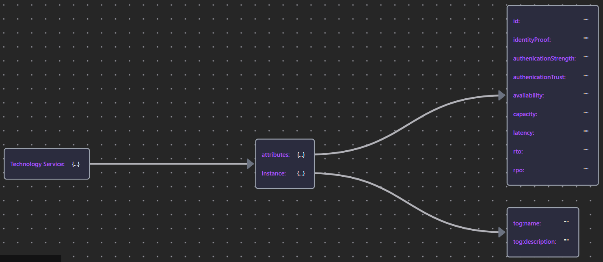

# 09 Modeling the Physical Security Architecture

- [09 Modeling the Physical Security Architecture](#09-modeling-the-physical-security-architecture)
  - [9.0 Physical Overview](#90-physical-overview)
    - [Table 38: Physical Matrix in Ontology View](#table-38-physical-matrix-in-ontology-view)
    - [Table 39: Component Matrix in Ontology View](#table-39-component-matrix-in-ontology-view)
    - [Figure 64: Developing SABSA Physical Security Architecture](#figure-64-developing-sabsa-physical-security-architecture)
  - [9.1 Data and Technology Assets](#91-data-and-technology-assets)
    - [9.1.1 Artifact](#911-artifact)
      - [9.1.1.1 Executable](#9111-executable)
      - [9.1.1.2 Data](#9112-data)
      - [9.1.1.3 Configuration](#9113-configuration)
    - [9.1.2 Device and Node](#912-device-and-node)
  - [9.2 Risk Management Practices](#92-risk-management-practices)
    - [9.2.1 Defect](#921-defect)
  - [9.3 Process Mechanisms](#93-process-mechanisms)
    - [9.3.1 Technology Functions and Services](#931-technology-functions-and-services)
    - [9.3.2 System Software](#932-system-software)
  - [9.4 Human-Mechine Interfaces](#94-human-mechine-interfaces)
    - [9.4.1 Technology Interface](#941-technology-interface)
  - [9.5 Physical Environment](#95-physical-environment)
  - [9.6 Timing and Interrupts](#96-timing-and-interrupts)
    - [9.6.1 Technology Security Events](#961-technology-security-events)

## 9.0 Physical Overview

### Table 38: Physical Matrix in Ontology View

Physical Artifacts:

| Assets (What) | Motivation (Why) | Process (How) | People (Who) | Location (Where) | Time (When) |
| :--- | :--- | :--- | :--- | :--- | :--- |
| Data Assets | Risk Management Practices| Process Mechanisms | Human Interface | Infrastructure | Processing Schedule |
| - Dictionary & Data Storage - Devices Inventory | - Risk Management Rules & Procedures - Risk Metadata | - Working Procedures - Application Software - Middleware - Systems - Security Mechanisms Process Control Points | - User Interface to Business Systems - Identity & Access Control Systems | - Workspaces - Host Platforms, Layout of Devices & Networks | - Timing & Sequencing of Processes & Sessions |

Physical Activities:

| Assets (What) | Motivation (Why) | Process (How) | People (Who) | Location (Where) | Time (When) |
| :--- | :--- | :--- | :--- | :--- | :--- |
| Physical Asset Management | Risk Data Management | Operations Management | User Support | Resources Management | Performance Data Collection |
| - Change Management - Platform & Data Storage Management | - Risk Procedure Management - Risk Metadata Management | - Job, Incident, Event & Disaster Recovery Management | - Service Desk - Problem Management -Request Management | - Physical & Environmental - Security Management - Real Estate & Facilities Management | - Business Systems Monitoring - Procedure Management |

Below we're again using Protege to expand our SABSA Physical Architecture Matrix Ontology:

Snapshot Protege Ontology File: [SABSA Matrics 2018 - Ch09 - Physical](./Table38/sabsa_matrices_2018_ch09-table38.rdf)

### Table 39: Component Matrix in Ontology View

Below we're again using Protege to expand our SABSA Component Architecture Matrix Ontology:

Snapshot Protege Ontology File: [SABSA Matrics 2018 - Ch08](./Table39/sabsa_matrices_2018_ch09-table39.rdf)

### Figure 64: Developing SABSA Physical Security Architecture

Snapshot ArchiMate Model: [Figure 64: Developing the SABSA Physical Security Architecture](./Figure64/ArchiMate_SABSA_Figure64.archimate)

## 9.1 Data and Technology Assets

The principal `Assets` in this cell are the persisted formats of information/knowledge (applications and data) and IT infrastructure (hardware, system software, and network components).

The "bricks & mortar" type of physicla `Assets` are described in [Section 9.5: Physical Environment](#95-physical-environment)

### 9.1.1 Artifact

In standard ArchiMate notation, `Artifact` serves as the universal passive structure element of the `Technology Layer`. It is overloaded to represent any kind of `data object` in the file system: executables, scripits, data and configuration files, databases, documents, specifications - everything in fact, except `System Software`.

The Security Overlay refines `Artifact` into sub-types that better reflect its different purposes and provides appropriate properties: see below Figure 65.

Snapshot ArchiMate Model: [Figure 65: Stereotypes of Artifact](./Figure65/ArchiMate_SABSA_Figure65.archimate)

#### 9.1.1.1 Executable

#### 9.1.1.2 Data

#### 9.1.1.3 Configuration

Snapshot ArchiMate Model: [Figure 66: Configuration Files](./Figure66/ArchiMate_SABSA_Figure66.archimate)

### 9.1.2 Device and Node

`Nodes` represent a computational or physical resource that hosts, manipulates or interacts with other computational or physical resources.

`Devices` model physical IT resources (i.e., hardware) upon which system software and `Artifacts` may be stored or deployed for execution.

When modeling security infrastructure, it is sometimes useful to model `nodes` and `devices` having a specific security purpose as distinct stereotypes so taht role-specific properties can be assigned.

Below Figure 67 example shows a Hardware Security Module (HSM) being modeled as a stereotyped `Device` with properties that reflect FIPS-140-2 assurance levels and a VPN Gateway as a stereotyped `Node` with preperties that reflect the Common Criteria Evaluation Assurance Levels (EAL) for the protection profile of a type of product.

Snapshot ArchiMate Model: [Figure 67: Stereotyping Security Nodes and Devices](./Figure67/ArchiMate_SABSA_Figure67.archimate)

## 9.2 Risk Management Practices

### 9.2.1 Defect

Software Defects are either published in product threat advisories, CVE (Common Vulnerabilities and Exposures, [CVE.org](https://www.cve.org)) lists, or discovered in custom code.

The main exception to this is an organizataion's process for approving deviations. Often there is legitimate business pressure for software to be deployed inot Production despite defects: a planned security control may not have been completed in time, or a penetration test has uncovereed a problem at the eleventh hour. In such circumstances, a decision must be made on risk. Models can be analyzed as "what if" scenarios to inform these risk decisions.

Below Figure 68 illustrates how highly relevant risk information is readily at hand:

Snapshot ArchiMate Model: [Figure 68: Risk Management Practices](./Figure68/ArchiMate_SABSA_Figure68.archimate)

## 9.3 Process Mechanisms

From a security perspective, `Technology Services` fall into 2 main categories:
1. those that `realize` the security services identified in the conceptual layer, and
2. those that provide general platform services to `Applications`.

Below Figure 69 illustrates the pattern by which a conceptual security service, authentication, is `realized` by two distinct `Technology Services`: one which provides a single sign-on (SSO) `capability` for the organization domain, and the other, the local authentication mechanisms of a cloud application.

Snapshot ArchiMate Model: [Figure 69: Realization of Security Services](./Figure69/ArchiMate_SABSA_Figure69.archimate)

Similar patterns can be deployed for other security services provided by the infrastructure:
- Security Incident Event Management (SIEM)
- Privileged Access Management Virus Scan
- Data Leak Prvention, and so on

The _closed loops_, including the invocation fo the conceptual Authentication service, its technical implementations and the `services` being protected, means that the model can not only verify that assurance strength `requirements` required by each `Application Service` are met, but also trace any Compliance `requirements` by identifying the closed loops described in [Section 7.2.2](../07_Modeling_Conceptual_Security_Architecture/README.md#722-policy-architecture).

Turning to `Technology Services` in general, while the ability to enforce access control is as important as the earlier analysis of `Application Services`, it is often mitigated by being co-located on the same `Node`, local network (`Communication Network`), or network domain. Priority should focus, therefore, on service invocations (调用) that originate outside trust domain boundaries.

### 9.3.1 Technology Functions and Services

| Element | Schema File | Schema Visualization |
| --- | --- | --- |
| Technology Service | [Tech Srv JSON](./Table40/TechService.json) |  |
| Technology Process Technology Function | [Tech Proc & Func JSON](./Table40/TechProcFunc.json) |  |

### 9.3.2 System Software

| Element | Schema File | Schema Visualization |
| --- | --- | --- |
| System Software | [Tech Srv JSON](./Table40/SystemSoftware.json) |  |

## 9.4 Human-Mechine Interfaces

### 9.4.1 Technology Interface

| Element | Schema File | Schema Visualization |
| --- | --- | --- |
| Technology Interface | [Tech Int JSON](./Table40/TechInterface.json) |  |

## 9.5 Physical Environment

## 9.6 Timing and Interrupts

### 9.6.1 Technology Security Events

| Element | Schema File | Schema Visualization |
| --- | --- | --- |
| «Executable» | [Executable JSON](./Table40/Executable.json) |  |
| «Data»| [Data JSON](./Table40/Data.json) |  |
| «Defect» Service | [Defect JSON](./Table40/Defect.json) |  |

---

[<button type="button">«Chapter 08</button>](../08_Modeling_Logical_Security_Architecture/README.md) [<button type="button">Chapter 10»</button>](../10_Conclusion/README.md) [<button type="button">HOME</button>](../README.md)

---

Any comments, feel free to post to the [Discussion Board](https://github.com/yasenstar/ArchiMate_SABSA/discussions).