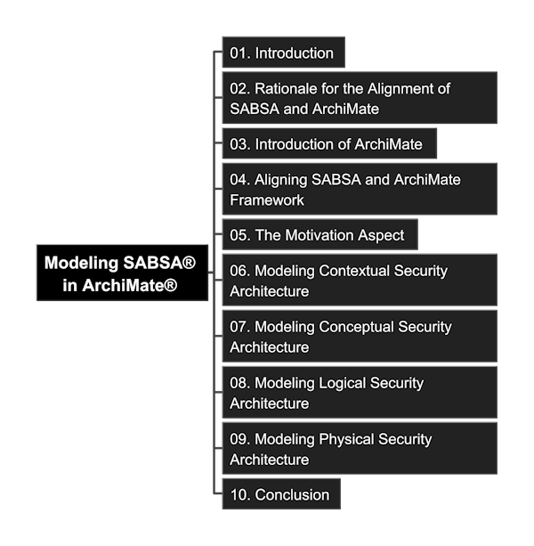

# ArchiMate_SABSA

- [ArchiMate\_SABSA](#archimate_sabsa)
  - [Read and Check Detail (Content in the Book)](#read-and-check-detail-content-in-the-book)
  - [Resources](#resources)
  - [Content Mindmap](#content-mindmap)
  - [Brief Introduction](#brief-introduction)
  - [Extended Variable Views on SABSA](#extended-variable-views-on-sabsa)
  - [Other References](#other-references)
  - [Tools Used for Demo and Tutorial](#tools-used-for-demo-and-tutorial)
  - [Modeling Tutorial Videos and Repositories](#modeling-tutorial-videos-and-repositories)
  - [Markdown Editing Tips](#markdown-editing-tips)

Practice of Modeling SABSA with the ArchiMate Specification

## Read and Check Detail (Content in the Book)

- [01. Introduction](./01_Introduction/README.md)
- [02. Rationale for the Alignment of SABSA® and ArchiMate®](./02_Rationale_of_Alignment/README.md)
- [03. An Introduction to the ArchiMate® Language](./03_Introduction_of_ArchiMate/README.md)
- [04. Aigning SABSA® and ArchiMate® Framework](./04_Align_SABSA_and_ArchiMate_Framework/README.md)
- [05. The Motivation Aspect](./05_Motivation_Aspect/README.md)
- [06. Modeling Contextual Security Architecture](./06_Modeling_Contextual_Security_Architecture/README.md)
- [07. Modeling Conceptual Security Architecture](./07_Modeling_Conceptual_Security_Architecture/README.md)
- [08. Modeling Logical Security Architecture](./08_Modeling_Logical_Security_Architecture/README.md)
- [09. Modeling Physical Security Architecture](./09_Modeling_Physical_Security_Architecture/README.md)
- [10. Conclusion](./10_Conclusion/README.md)

## Resources

- This Guide "A Guide to Modeling SABSA® with the ArchiMate® Specification" can be downloaded from Open Group site: https://publications.opengroup.org/guides/archimate/g24b
- You may request variable SABSA® whitepaper from site: https://sabsa.org/white-paper-requests/, notice it would require you use your company's business email address
  - [TSI-W100-SABSA-White-Paper](./Docs/TSI-W100-SABSA-White-Paper.pdf)
  - [TSI-T100-Modeling-SABSA-with-ArchiMate, Release 1.0, October 2019](https://sabsacourses.com/wp-content/uploads/2021/02/TSI-T100-Modelling-SABSA-with-ArchiMate.pdf), here is the [local downloadable link](./Docs/TSI-T100-Modelling-SABSA-with-ArchiMate.pdf)
  - [TSI-W117-SABSA-TOGAF-Integration](./Docs/TSI-W117-SABSA-TOGAF-Integration.pdf)
  - [TSI-R101-SABSA-Matrices-2018-Release-Notes](./Docs/TSI-R101-SABSA-Matrices-2018-Release-Notes.pdf)

## Content Mindmap

Get [Freeplane](https://docs.freeplane.org/getting-started/getting-started.html) and click to open the MindMap (you need to Fork or Clone repository to your local to open it.)

You can check [markdown format of mindmap](./Modeling-SABSA-in-ArchiMate.md) if you haven't installed Freeplane yet.

## Brief Introduction

SABSA® (Sherwood Applied Business Security Architecture) is a methodology for developing risk-driven enterprise information security and information assurance architectures and for delivering security infrastructure solutions that support critical business initiatives. It is an open standard, comprising a number of frameworks, models, methods and processes, free for use by all, with no licensing required for end-user organizations who make use of the standard in developing and implementing architectures and solutions. (Source: W100 - SABSA® White Paper)

The Joint Working Group, between SABSA and the Open Group, was established around 2024, aims to following variable purpose:

- develop a settled consensus of core security elements, relationships, and properties - referred to collectively as the "Security Overlay".
- propose a reference of vocabulary, patterns, and conventions in this domain, to further enterprise security as a practice, and encourage the wider appreciation of security concepts in general and the SABSA approach in particular.
- incentivize toolmakers to facilitate support for security within their products, no need to focus on how to model the security perspective.

The practice in this repository is to detail go through the guide, and using Archi (ArchiMate® modeling tool) to create the hands-on model step-by-step, so that it can be tailored by every architecture team to their own company's EA+Security meta-model creation.

## Extended Variable Views on SABSA

- [SABSA Framework for Enterprise Architects (avolution)](./Docs/SABSA_Framework_Viewed_from_avolution.md)
- [SABSA – In 3 Minutes](https://www.vanharen.net/standards/sabsa/sabsa-in-3-minutes/), local copy: [LINK](./Docs/SABSA_in_3min_Van-Haren-Group.pdf)
- [Enterprise Security Architect - A Top-down Approach from ISACA in 2017](https://www.isaca.org/resources/isaca-journal/issues/2017/volume-4/enterprise-security-architecturea-top-down-approach), local copy: [LINK](./Docs/Enterprise_Security_Architecture—A_Top-down_Approach_ISACA_2017.pdf)

## Other References

- [David Lynas Consulting on SABSA](https://davidlynas.com/sabsa/)

## Tools Used for Demo and Tutorial

- Repository tracking: [VS Code](https://code.visualstudio.com/)
- Video cover and contents: Microsoft Powerpoint or any slide tool
- Mindmap: [FreePlane](https://www.freeplane.org/)
- ArchiMate Modeling: [Archi](https://archimatetool.com/)
- Schema Documentation in JSON: visualized via "JSON Crack" or "JSON Lens", and many others similar extension
- Knowlege on Metamodel with relationship: [Protégé](https://protege.stanford.edu/software.php#desktop-protege)
- Non-ArchiMate Diagramming, e.g. hierarchical chart: [PlantUML](https://plantuml.com/)

## Modeling Tutorial Videos and Repositories

- YouTube Channel: [YouTube Video List](https://www.youtube.com/playlist?list=PL6DEHvciXKeVoCRsMg9Z3_eZSilbf8W1e)
- DouYin 抖音: [Video List in DouYin](https://www.douyin.com/video/7510864092345765156)
- Udemy Course: [Modeling SABSA in ArchiMate using Archi (and Protege, PlantUML and JSON)](https://www.udemy.com/course/modeling-sabsa-in-archimate-using-archi/?referralCode=A7C514E23B59103E9FC3)
- Repository in Gitee: https://gitee.com/yasenstar/ArchiMate_SABSA

## Markdown Editing Tips

Key in special character in Markdown through ALT + code (need to use number pad):

- « : Alt + 0171
- » : Alt + 0187
- ® : Copyright, Alt + 0174
- ™ : Alt + 0153
- é : Alt + 130
- ∞ : note that "Alt + 236 or 8734" is not working in my machine, instead, using Windows Emoji keyboard works (Press `Win + .` then click `Symbols -> Math Symbols -> Select ∞)

Key in special characters in Markdown through HTML syntax:

- superscript: use "sup" tag
- subscript: use "sub" tag

---

Comments are welcome, leave your thoughts in [Discussion Board](https://github.com/yasenstar/ArchiMate_SABSA/discussions).