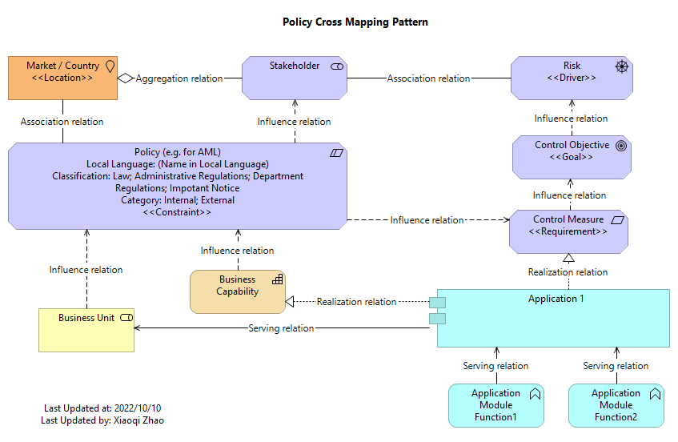

# Policy Mapping using Archimate Language

Policy is kind of generic word, in Gerben Wierda's "Mastering ArchiMate" book, there's one practical chapter talks about "Modeling Risk & Security with Motivation Elements".

The suggestion from Gerben is using below 3 notations within Motivation layer to model the **Risk**, as below:

- A **Risk** can be modeled using ArchiMate's **Driver** element
- A **Control Objective** can be modeled using ArchiMate's **Goal** element
- A **Control Measure** (sometimes just 'Control', sometimes referred to as 'Countermeasure') element can be modeled using ArchiMate's **Requirement** element.

This minimum modeling can be connected via **influence relation** like this:

.png)

While, it would be more relevant to have the cross-layer's mapping view, and Risk itself can be generically represented by a **Policy** (either internal control policies or external laws or regulations), then below is one proposed view connecting with other artefacts:

The **Policy** can then be added certain properties depending on the actual content like in the sample.

The key relationships used in this pattern are listed here:

| Source | Source Notation | Target | Target Notation | Relationship |
| --- | --- | --- | --- | --- |
| Control Measure | Requirement | Control Objective | Goal | Influence Relation |
| Control Objective | Goal | Risk | Driver | Influence Relation |
| Policy | Constraint | Control Measure | Requirement | Influence Relation |
| Policy | Constraint | Market / Country | Location | Association Relation |
| Policy | Constraint | Stakeholder | Stakeholder | Influence Relation |
| Risk | Driver | Stakeholder | Stakeholder | Association Relation |
| Application | Application Component | Control Measure | Requirement | Realization Relation |
| Application | Application Component | Business Capability | Capability | Realization Relation |
| Application | Application Component | Business Unit | Business Role | Serving Relation |
| Business Capability | Capability | Policy | Constraint | Influence Relation |
| Business Unit | Business Role | Policy | Constraint | Influence Relation |
| Application Module | Applicaiton Function | Application | Application Component | Serving Relation |

Welcome comments!

2022-10-10, Montreal, CA