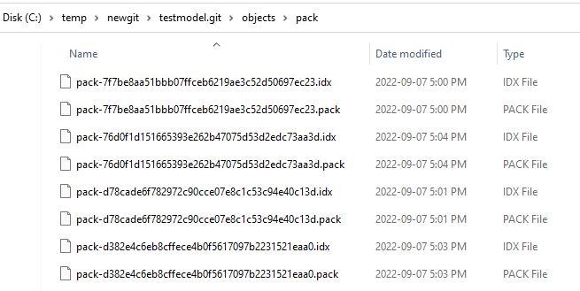

# Using Archi Tool (with coArchi plug-in) in a Local Git Server

Normally through coArchi workspace, we add or retrieve a Archi model from remote Git repository (github, Azure DevOps, etc.), you might ask why we need to do this via local Git server?

Simple answers, not only for fun, but also sometimes we just want to create private model for private using, utilizing any remote Git server involving _cloud_ into your route, Privacy people may not like that.

It may not exactly running like remote repository, but below steps I've referred from variable nice articles (thanks [godo.dev](https://www.godo.dev/), [Sergey Polezhaev](https://medium.com/@piteryo7/how-to-set-up-git-server-on-local-network-windows-tutorial-7ec5cd2df3b1)), below are the steps I've practiced and for your reference.

## Create a Local Git Server

If you have one another server running in your local network, that would be great, assume that is one Linux server with a host name as `localserver`, you can remotely connect that via ssh:

```
$ ssh [username]@localserver
```

Here, I'd like to go with even simpler way, no need other server, I'm using Windows 11 with Git 2.37.0, let's start to create Git server on the PC and connect that.

1. Come to one folder you like in Windows Explore, my sample is just `c:\temp`, where you want to initialize the Git server, Give it a name without spaces. I just create one `newgit` subfolder but you can just use the whatever folder your like.

    

2. Under `newgit`, right click the empty area and choose `Git Bash Here` to open git bash in this folder

    

3. In Git Bash terminal, type

    ```
    git init testmodel.git --bare
    ```

    Note: you can try to name the folder without `.git` at the end, however, in some cases it leads to troubles.

    Now, you have your local Git Server, congratulation, and remember your Git server path, e.g. my sample is `c:\temp\newgit\testmodel.git`, you need this for Archi below.

## Configure User Name and Password

To connect Git from coArchi, you need fill in three information:

- URL
- User Name
- Password

    

You already have URL (saying the local Path on-hand from above step), you need to make other two.

Still in Git Bash, type

```
$ git config user.name "Your Name"
$ git config user.email "Your Email"
$ git config user.password "Password"
```

Note: here I don't have `--global` option as I just want those information are applying to this repository, not impact my others.

## Connect Archi model with local Git server

Open Archi, create one new local model, if you've already have coArchi plug-in, you should see `Collaboration` in the menu bar.

Select your local model, then from `Collaboration`, choose `Add Local Model to Workspace and Publish`:


In the pop up `New Model Repository` (as above) empty dialog, fill in URL, User Name and Password that we have prepared before. Clidk `OK`, you will see your local model appeared in the `Collaboration Workspace` list.

You can then work like remote Git without different in Archi, when you publish your model, the local Git server will get updated.

Also, you can create multiple branch and those information can be viewed / switched in local Git through standard command.

## Difference between using remote and local Git server

As mentioned in the beginning, this is just a "play" purpose for now, I haven't put my working model to this local Git server, and below you can find the folder structure difference as well:

| Repo Type | Folders Structure Screen | Memo |
| --- | --- | --- 
| Remote Repository (e.g. Azure DevOps) |  | This structure is the clear XML structure and can see different elements (Archimate layers) as well as views (called diagrams) as different folders |
| Local Git Server |   | The folder is still like the ones when initial the repository, and the elements created are stored under .\object\pack subfolders, every element is one pack |

Need further observation on this, but at least, you are able to use coArchi with this local Git, within Git Bash, type `$ git branch`, you can see the list of branches of Archi model in Collaboration Worksapce:


and you can check the version history in Git Bash through `$ git log`, which will list the current active branch's history, like below:


Enjoy and welcome to hear from your opinion and comments. ([Mail to Me](mailto:xiaoqizhao@outlook.com))