# Saudi NORA Framework Implementation Guide

## Document Information
- **Document Title:** Saudi National Overall Reference Architecture (NORA) Implementation Guide
- **Document Version:** 1.0
- **Document Date:** 2024-12-19
- **Document Owner:** Enterprise Architecture Team
- **Approved By:** Chief Architect / Digital Government Liaison
- **Review Frequency:** Quarterly DGA alignment reviews
- **Next Review:** 2025-03-19

## Executive Summary

This document provides a comprehensive implementation guide for aligning enterprise architecture with the Saudi National Overall Reference Architecture (NORA) framework developed by the Digital Government Authority (DGA). The guide outlines specific requirements, principles, and implementation strategies to ensure full compliance with Saudi digital government standards and Vision 2030 objectives.

### Key Points
- **Vision 2030 Alignment:** Full integration with Saudi Arabia's national transformation agenda
- **DGA Compliance:** Adherence to Digital Government Authority standards and guidelines
- **Citizen-Centric Services:** Arabic-first, accessible, and inclusive digital services
- **Cybersecurity Excellence:** Robust security framework aligned with National Cybersecurity Authority
- **Digital Economy Enablement:** Support for Saudi digital economy initiatives and NEOM projects

### Saudi NORA Framework Overview

```mermaid
graph TD
    A[Saudi NORA Framework] --> B[Vision 2030 Alignment]
    A --> C[Digital Government Authority Standards]
    A --> D[National Cybersecurity Framework]
    A --> E[Citizen Experience Excellence]
    A --> F[Government Efficiency]
    
    B --> B1[Economic Diversification]
    B --> B2[Digital Transformation]
    B --> B3[Smart Cities Development]
    B --> B4[Innovation Ecosystem]
    
    C --> C1[Government Platform Integration]
    C --> C2[API Standards and Guidelines]
    C --> C3[Data Governance Framework]
    C --> C4[Digital Identity Management]
    
    D --> D1[Essential Cybersecurity Controls]
    D --> D2[Data Protection and Localization]
    D --> D3[Threat Intelligence Sharing]
    D --> D4[Incident Response Framework]
    
    E --> E1[Arabic-First Design]
    E --> E2[Accessibility Standards]
    E --> E3[Multi-Channel Service Delivery]
    E --> E4[User Experience Optimization]
    
    F --> F1[Process Digitization]
    F --> F2[Shared Services Platform]
    F --> F3[Interoperability Standards]
    F --> F4[Performance Measurement]
```

## Purpose and Scope

### Document Purpose
Provide comprehensive guidance for implementing Saudi NORA compliance within enterprise architecture initiatives, ensuring alignment with Digital Government Authority requirements, Vision 2030 objectives, and national digital transformation goals.

### Scope
**In Scope:**
- Saudi NORA compliance requirements and implementation
- Digital Government Authority (DGA) standards alignment
- Vision 2030 digital transformation objectives
- National Cybersecurity Authority (NCA) framework compliance
- Arabic language and cultural considerations
- Government platform integration requirements
- Regulatory compliance with Saudi laws and regulations

**Out of Scope:**
- International compliance frameworks (unless specifically referenced by Saudi NORA)
- Non-government sector specific requirements
- Private sector only digital initiatives

## Saudi Vision 2030 and Digital Transformation Context

### Vision 2030 Digital Pillars

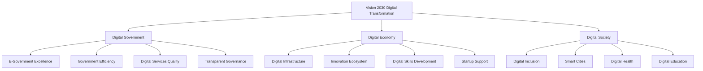

### Key Vision 2030 Targets
- **90%** of government services to be digital by 2030
- **80%** citizen satisfaction with government digital services
- **100%** government entities connected to unified platform
- **95%** government processes to be automated
- Top **5** ranking in digital government maturity globally

### Saudi Digital Government Program Objectives
1. **Digital-First Government:** Prioritize digital channels for all government services
2. **Unified Government Platform:** Single point of access for all citizen services
3. **Data-Driven Decision Making:** Leverage data analytics for policy and service improvement
4. **Innovation and Emerging Technologies:** Adopt AI, blockchain, and IoT for government services
5. **Cybersecurity Excellence:** Maintain highest standards of digital security and privacy

## Saudi NORA Architecture Domains

### 1. Business Architecture Domain

#### Government Process Excellence Framework

```mermaid
graph TD
    A[Government Process Excellence] --> B[Process Digitization]
    A --> C[Service Design]
    A --> D[Performance Management]
    A --> E[Citizen Journey Optimization]
    
    B --> B1[End-to-End Digitization]
    B --> B2[Automation Implementation]
    B --> B3[Paper Process Elimination]
    B --> B4[Digital Workflow Management]
    
    C --> C1[Human-Centered Design]
    C --> C2[Arabic-First Interfaces]
    C --> C3[Multi-Modal Interaction]
    C --> C4[Accessibility Compliance]
    
    D --> D1[KPI Monitoring]
    D --> D2[Service Quality Metrics]
    D --> D3[Citizen Satisfaction Tracking]
    D --> D4[Efficiency Measurement]
    
    E --> E1[Citizen Persona Development]
    E --> E2[Journey Mapping]
    E --> E3[Touchpoint Optimization]
    E --> E4[Experience Measurement]
```

#### Saudi Government Service Standards
| Standard | Requirement | Implementation | Compliance Level |
|----------|-------------|----------------|------------------|
| **Arabic Language Priority** | All interfaces must prioritize Arabic | RTL design, Arabic NLP | Mandatory |
| **Response Time** | <3 seconds for simple transactions | Performance optimization | Mandatory |
| **Availability** | 99.9% uptime for citizen services | Redundant infrastructure | Mandatory |
| **Accessibility** | WCAG 2.1 AA + Saudi accessibility standards | Universal design | Mandatory |
| **Mobile-First** | All services must work on mobile devices | Responsive design | Mandatory |

### 2. Information Architecture Domain

#### Data Governance Framework

```mermaid
graph TD
    A[Saudi Data Governance] --> B[Data Sovereignty]
    A --> C[Data Quality Management]
    A --> D[Data Privacy Protection]
    A --> E[Data Sharing Standards]
    
    B --> B1[Data Localization Requirements]
    B --> B2[Cross-Border Data Controls]
    B --> B3[Strategic Data Classification]
    B --> B4[National Data Assets Protection]
    
    C --> C1[Data Quality Standards]
    C --> C2[Master Data Management]
    C --> C3[Data Lineage Tracking]
    C --> C4[Data Validation Processes]
    
    D --> D1[PDPL Compliance]
    D --> D2[Consent Management]
    D --> D3[Data Minimization]
    D --> D4[Right to Privacy]
    
    E --> E1[Government Data Exchange]
    E --> E2[Open Data Initiative]
    E --> E3[Data API Standards]
    E --> E4[Metadata Management]
```

#### Saudi Personal Data Protection Law (PDPL) Compliance
- **Lawful Basis:** All data processing must have explicit lawful basis
- **Consent Management:** Clear and informed consent for personal data collection
- **Data Minimization:** Collect only necessary data for specified purposes
- **Data Localization:** Store personal data within Saudi Arabia unless exempted
- **Individual Rights:** Provide access, correction, deletion, and portability rights
- **Breach Notification:** Report data breaches to authorities within 72 hours

### 3. Application Architecture Domain

#### Government Platform Integration Architecture

```mermaid
graph TD
    A[Government Platform Integration] --> B[Unified Government Platform]
    A --> C[API Management]
    A --> D[Service Integration]
    A --> E[Identity Federation]
    
    B --> B1[Absher Platform Integration]
    B --> B2[Government Service Bus]
    B --> B3[Shared Service Registry]
    B --> B4[Common User Interface]
    
    C --> C1[Saudi API Standards]
    C --> C2[API Gateway Management]
    C --> C3[Rate Limiting and Security]
    C --> C4[API Lifecycle Management]
    
    D --> D1[Service Composition]
    D --> D2[Workflow Orchestration]
    D --> D3[Event-Driven Architecture]
    D --> D4[Microservices Design]
    
    E --> E1[National Digital Identity]
    E --> E2[Single Sign-On (NSSO)]
    E --> E3[Multi-Factor Authentication]
    E --> E4[Identity Verification Services]
```

#### Required Government Platform Integrations

| Platform | Purpose | Integration Type | Priority | Compliance Status |
|----------|---------|------------------|----------|-------------------|
| **Absher** | Citizen services unified platform | API Integration | Critical | Required |
| **NSSO** | National Single Sign-On | Federation | Critical | Required |
| **SADAD** | National payment gateway | API Integration | High | Required |
| **Esal** | Government procurement platform | API Integration | Medium | Recommended |
| **Etimad** | Accreditation and licensing | API Integration | Medium | Recommended |
| **Qiwa** | Labor market platform | API Integration | Low | Optional |

### 4. Technology Architecture Domain

#### Cloud and Infrastructure Standards

```mermaid
graph TD
    A[Saudi Cloud Infrastructure] --> B[Cloud-First Strategy]
    A --> C[Data Center Requirements]
    A --> D[Network Architecture]
    A --> E[Disaster Recovery]
    
    B --> B1[Government Cloud Adoption]
    B --> B2[Hybrid Cloud Strategy]
    B --> B3[Multi-Cloud Approach]
    B --> B4[Cloud Security Framework]
    
    C --> C1[Local Data Center Presence]
    C --> C2[Geographic Redundancy]
    C --> C3[Sovereign Cloud Requirements]
    C --> C4[Edge Computing Capabilities]
    
    D --> D1[Government Network Integration]
    D --> D2[Secure Connectivity]
    D --> D3[API Gateway Architecture]
    D --> D4[Content Delivery Network]
    
    E --> E1[Business Continuity Planning]
    E --> E2[Backup and Recovery]
    E --> E3[Failover Procedures]
    E --> E4[RTO/RPO Requirements]
```

#### Technology Stack Requirements

| Technology Layer | Saudi Requirements | Recommended Solutions | Compliance Notes |
|------------------|-------------------|----------------------|-----------------|
| **Cloud Platform** | Local presence required | Microsoft Azure Saudi, AWS Saudi | Data sovereignty compliance |
| **Database Systems** | Arabic support mandatory | SQL Server, Oracle, PostgreSQL | Unicode and RTL support |
| **Application Platform** | Microservices architecture | Kubernetes, Docker, OpenShift | Container orchestration |
| **Integration Platform** | Government API compliance | MuleSoft, WSO2, Azure API Management | API gateway with security |
| **Analytics Platform** | Arabic text analytics | Power BI, Tableau, Qlik | Arabic language processing |
| **Security Platform** | NCA compliance required | Azure Sentinel, Splunk | Government security standards |

### 5. Security Architecture Domain

#### National Cybersecurity Framework Alignment

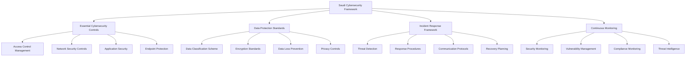

#### Essential Cybersecurity Controls (ECC) Implementation

| Control Domain | Saudi Requirement | Implementation Priority | Compliance Status |
|----------------|-------------------|------------------------|-------------------|
| **Identify** | Asset inventory and risk assessment | Critical | Mandatory |
| **Protect** | Security controls and training | Critical | Mandatory |
| **Detect** | Continuous monitoring and detection | Critical | Mandatory |
| **Respond** | Incident response procedures | High | Mandatory |
| **Recover** | Business continuity and recovery | High | Mandatory |

## Implementation Roadmap

### Phase 1: Foundation and Compliance (Months 1-6)

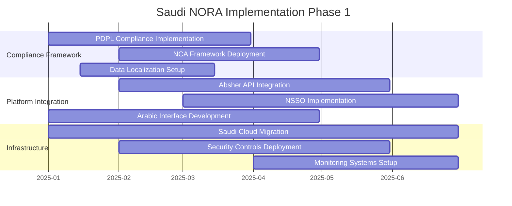

### Phase 2: Integration and Enhancement (Months 7-12)

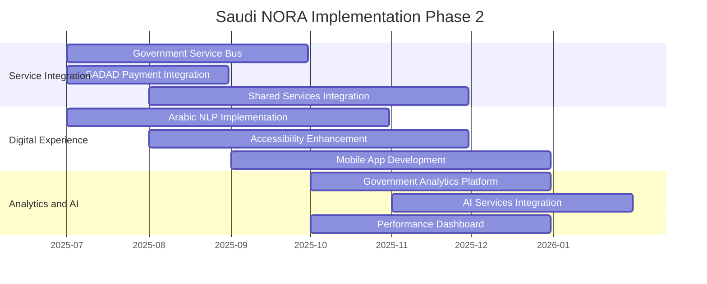

### Phase 3: Optimization and Innovation (Months 13-18)

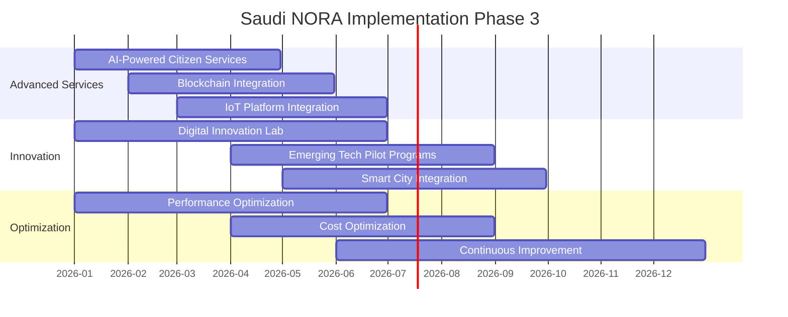

## Compliance Monitoring and Governance

### Saudi NORA Compliance Dashboard

```mermaid
graph TD
    A[Compliance Monitoring] --> B[DGA Standards Compliance]
    A --> C[Vision 2030 KPI Tracking]
    A --> D[Cybersecurity Compliance]
    A --> E[Citizen Satisfaction Metrics]
    
    B --> B1[API Standards Adherence]
    B --> B2[Platform Integration Status]
    B --> B3[Data Governance Compliance]
    B --> B4[Service Quality Metrics]
    
    C --> C1[Digital Service Adoption]
    C --> C2[Government Efficiency]
    C --> C3[Innovation Metrics]
    C --> C4[Economic Impact]
    
    D --> D1[ECC Implementation Status]
    D --> D2[Security Incident Metrics]
    D --> D3[Data Protection Compliance]
    D --> D4[Threat Intelligence Integration]
    
    E --> E1[Service Satisfaction Scores]
    E --> E2[Digital Channel Usage]
    E --> E3[Accessibility Compliance]
    E --> E4[Arabic Language Quality]
```

### Key Performance Indicators (KPIs)

| KPI Category | Metric | Target | Current | Status |
|--------------|--------|--------|---------|--------|
| **Vision 2030 Alignment** | Digital service percentage | 90% | 75% | 🟡 In Progress |
| **Citizen Satisfaction** | Service satisfaction score | 80% | 72% | 🟡 In Progress |
| **Platform Integration** | Government platform connectivity | 100% | 65% | 🟡 In Progress |
| **Arabic Language Support** | Arabic interface coverage | 100% | 85% | 🟡 In Progress |
| **Cybersecurity Compliance** | ECC implementation | 100% | 90% | 🟢 Good |
| **Data Localization** | Data sovereignty compliance | 100% | 95% | 🟢 Good |

## Success Factors and Best Practices

### Critical Success Factors

1. **Executive Leadership Commitment**
   - Strong sponsorship from senior government liaisons
   - Clear alignment with organizational Vision 2030 goals
   - Adequate resource allocation for Saudi compliance initiatives

2. **Cultural and Language Considerations**
   - Arabic-first design approach in all digital interfaces
   - Cultural sensitivity in user experience design
   - Local talent with Arabic language and government expertise

3. **Government Partnership and Collaboration**
   - Strong relationships with Digital Government Authority (DGA)
   - Active participation in government digital initiatives
   - Regular engagement with National Cybersecurity Authority (NCA)

4. **Continuous Compliance Monitoring**
   - Real-time monitoring of Saudi NORA compliance metrics
   - Regular audits and assessments with government standards
   - Proactive updating of systems to meet evolving requirements

### Implementation Best Practices

```mermaid
graph TD
    A[Saudi NORA Best Practices] --> B[Government Engagement]
    A --> C[Technical Excellence]
    A --> D[Cultural Adaptation]
    A --> E[Continuous Learning]
    
    B --> B1[Regular DGA Communication]
    B --> B2[Government Liaison Programs]
    B --> B3[Policy Monitoring]
    B --> B4[Stakeholder Management]
    
    C --> C1[Saudi Cloud Expertise]
    C --> C2[Arabic Technology Stack]
    C --> C3[Security Best Practices]
    C --> C4[Integration Patterns]
    
    D --> D1[Arabic Language Priority]
    D --> D2[Cultural User Research]
    D --> D3[Local Accessibility Standards]
    D --> D4[Islamic Calendar Integration]
    
    E --> E1[Government Training Programs]
    E --> E2[Technology Updates]
    E --> E3[Compliance Monitoring]
    E --> E4[Best Practice Sharing]
```

## Conclusion and Next Steps

### Strategic Recommendations

1. **Prioritize Government Platform Integration**
   - Focus on critical integrations (Absher, NSSO, SADAD) first
   - Establish dedicated government liaison team
   - Implement phased integration approach

2. **Invest in Arabic Language Capabilities**
   - Develop comprehensive Arabic language technology stack
   - Train teams on Arabic interface design principles
   - Implement Arabic natural language processing capabilities

3. **Strengthen Cybersecurity Posture**
   - Complete Essential Cybersecurity Controls (ECC) implementation
   - Establish continuous security monitoring aligned with NCA standards
   - Implement data localization and sovereignty requirements

4. **Build Government Expertise**
   - Recruit team members with Saudi government experience
   - Establish partnerships with local system integrators
   - Participate in DGA training and certification programs

### Long-term Vision

The successful implementation of Saudi NORA compliance will position the organization as a leading digital government service provider, contributing to Vision 2030 objectives while delivering exceptional citizen experiences that reflect Saudi cultural values and technological excellence.

---

**Document Status:** Final  
**Last Updated:** 2024-12-19  
**Next Review:** 2025-03-19