# ArchiMate Business Layer Models

## Overview
This document contains comprehensive ArchiMate 3.2 business layer models representing the enterprise's business architecture. The models follow ArchiMate notation standards and provide detailed views of business strategy, structure, behavior, and information aspects.

## ArchiMate Business Layer Framework

### Business Layer Elements
- **Passive Structure:** Business objects and information
- **Active Structure:** Business actors, roles, and collaborations
- **Behavior:** Business processes, functions, events, and services
- **Strategy:** Business capabilities, resources, and value streams

### Model Categories
1. **Business Strategy Models:** Capabilities, value propositions
2. **Business Structure Models:** Organizational structure, roles
3. **Business Behavior Models:** Processes, functions, interactions
4. **Business Information Models:** Objects, representations

## Business Strategy Models

### Business Capability Map

```mermaid
graph TB
    subgraph "Strategy Layer"
        CV[Customer Value<br/>📊 Capability] --> CX[Customer Experience<br/>📊 Capability]
        CV --> PM[Product Management<br/>📊 Capability]
        CV --> SM[Service Management<br/>📊 Capability]
        
        CX --> CA[Customer Acquisition<br/>📊 Capability]
        CX --> CR[Customer Retention<br/>📊 Capability]
        CX --> CS[Customer Service<br/>📊 Capability]
        
        PM --> PD[Product Development<br/>📊 Capability]
        PM --> PL[Product Lifecycle<br/>📊 Capability]
        PM --> QM[Quality Management<br/>📊 Capability]
        
        SM --> SD[Service Delivery<br/>📊 Capability]
        SM --> SO[Service Operations<br/>📊 Capability]
        SM --> SI[Service Innovation<br/>📊 Capability]
    end
    
    subgraph "Business Layer"
        CA --> LG[Lead Generation<br/>🎯 Business Process]
        CR --> RM[Relationship Management<br/>🎯 Business Process]
        CS --> SS[Support Services<br/>🎯 Business Process]
        
        PD --> RD[Research & Development<br/>🎯 Business Process]
        PL --> LC[Lifecycle Management<br/>🎯 Business Process]
        QM --> QA[Quality Assurance<br/>🎯 Business Process]
        
        SD --> FL[Fulfillment<br/>🎯 Business Process]
        SO --> OP[Operations<br/>🎯 Business Process]
        SI --> IN[Innovation<br/>🎯 Business Process]
    end
```

### Value Stream Model

```mermaid
graph LR
    subgraph "Value Stream: Customer Solution Delivery"
        VS[Customer Solution Delivery<br/>💰 Value Stream]
        
        subgraph "Value Stage 1"
            VS --> V1[Understand Customer Needs<br/>💎 Value Stream Element]
            V1 --> MR[Market Research<br/>📊 Capability]
            V1 --> CN[Customer Needs Analysis<br/>📊 Capability]
        end
        
        subgraph "Value Stage 2"
            V1 --> V2[Design Solution<br/>💎 Value Stream Element]
            V2 --> SD[Solution Design<br/>📊 Capability]
            V2 --> PA[Product Architecture<br/>📊 Capability]
        end
        
        subgraph "Value Stage 3"
            V2 --> V3[Develop & Build<br/>💎 Value Stream Element]
            V3 --> PD[Product Development<br/>📊 Capability]
            V3 --> QA[Quality Assurance<br/>📊 Capability]
        end
        
        subgraph "Value Stage 4"
            V3 --> V4[Market & Sell<br/>💎 Value Stream Element]
            V4 --> MK[Marketing<br/>📊 Capability]
            V4 --> SL[Sales<br/>📊 Capability]
        end
        
        subgraph "Value Stage 5"
            V4 --> V5[Deliver & Support<br/>💎 Value Stream Element]
            V5 --> DL[Delivery<br/>📊 Capability]
            V5 --> CS[Customer Support<br/>📊 Capability]
        end
    end
```

### Business Model Canvas

```mermaid
graph TB
    subgraph "Business Model Canvas"
        subgraph "Key Partnerships"
            KP1[Technology Partners<br/>👥 Business Actor]
            KP2[Channel Partners<br/>👥 Business Actor]
            KP3[Strategic Alliances<br/>👥 Business Actor]
        end
        
        subgraph "Key Activities"
            KA1[Product Development<br/>🎯 Business Process]
            KA2[Marketing & Sales<br/>🎯 Business Process]
            KA3[Customer Support<br/>🎯 Business Process]
        end
        
        subgraph "Key Resources"
            KR1[Development Team<br/>👤 Business Role]
            KR2[Technology Platform<br/>🏛️ Business Object]
            KR3[Brand Assets<br/>🏛️ Business Object]
        end
        
        subgraph "Value Propositions"
            VP1[Digital Transformation<br/>💰 Value]
            VP2[Cost Reduction<br/>💰 Value]
            VP3[Efficiency Improvement<br/>💰 Value]
        end
        
        subgraph "Customer Relationships"
            CR1[Self-Service<br/>🎯 Business Service]
            CR2[Personal Assistance<br/>🎯 Business Service]
            CR3[Community<br/>🎯 Business Service]
        end
        
        subgraph "Channels"
            CH1[Direct Sales<br/>🎯 Business Process]
            CH2[Partner Channel<br/>🎯 Business Process]
            CH3[Online Platform<br/>🎯 Business Process]
        end
        
        subgraph "Customer Segments"
            CS1[Enterprise Customers<br/>👥 Business Actor]
            CS2[SMB Customers<br/>👥 Business Actor]
            CS3[Government Sector<br/>👥 Business Actor]
        end
        
        subgraph "Cost Structure"
            C1[Development Costs<br/>💰 Value]
            C2[Marketing Costs<br/>💰 Value]
            C3[Operations Costs<br/>💰 Value]
        end
        
        subgraph "Revenue Streams"
            R1[Subscription Revenue<br/>💰 Value]
            R2[Professional Services<br/>💰 Value]
            R3[License Revenue<br/>💰 Value]
        end
    end
    
    KP1 --> KA1
    KA1 --> VP1
    VP1 --> CR1
    CR1 --> CS1
    
    KR1 --> KA1
    VP1 --> CH1
    CH1 --> CS1
    
    KA1 --> C1
    CS1 --> R1
```

## Business Structure Models

### Organizational Structure Model

```mermaid
graph TD
    subgraph "Executive Level"
        CEO[Chief Executive Officer<br/>👤 Business Role]
        BOD[Board of Directors<br/>👥 Business Actor]
        
        CEO --> CTO[Chief Technology Officer<br/>👤 Business Role]
        CEO --> CMO[Chief Marketing Officer<br/>👤 Business Role]
        CEO --> CFO[Chief Financial Officer<br/>👤 Business Role]
        CEO --> CHRO[Chief HR Officer<br/>👤 Business Role]
    end
    
    subgraph "Technology Division"
        CTO --> VPE[VP Engineering<br/>👤 Business Role]
        CTO --> VPI[VP Infrastructure<br/>👤 Business Role]
        CTO --> VPAI[VP AI & Analytics<br/>👤 Business Role]
        
        VPE --> DEV[Development Teams<br/>👥 Business Actor]
        VPI --> OPS[Operations Teams<br/>👥 Business Actor]
        VPAI --> DATA[Data Science Teams<br/>👥 Business Actor]
    end
    
    subgraph "Marketing Division"
        CMO --> VPPM[VP Product Marketing<br/>👤 Business Role]
        CMO --> VPDM[VP Digital Marketing<br/>👤 Business Role]
        
        VPPM --> PM[Product Marketing Teams<br/>👥 Business Actor]
        VPDM --> DM[Digital Marketing Teams<br/>👥 Business Actor]
    end
    
    subgraph "Finance Division"
        CFO --> FC[Financial Controller<br/>👤 Business Role]
        CFO --> TR[Treasury<br/>👤 Business Role]
        
        FC --> AC[Accounting Teams<br/>👥 Business Actor]
        TR --> FM[Financial Management<br/>👥 Business Actor]
    end
    
    subgraph "Human Resources"
        CHRO --> TA[Talent Acquisition<br/>👤 Business Role]
        CHRO --> TD[Talent Development<br/>👤 Business Role]
        
        TA --> REC[Recruitment Teams<br/>👥 Business Actor]
        TD --> TRN[Training Teams<br/>👥 Business Actor]
    end
```

### Business Role Collaboration Model

## Business Behavior Models

### Core Business Process Model

```mermaid
graph TD
    subgraph "Customer Acquisition Process"
        E1[Customer Inquiry<br/>⚡ Business Event] --> P1[Lead Qualification<br/>🎯 Business Process]
        P1 --> |qualified lead| P2[Needs Assessment<br/>🎯 Business Process]
        P1 --> |unqualified| P3[Lead Nurturing<br/>🎯 Business Process]
        
        P2 --> P4[Solution Design<br/>🎯 Business Process]
        P4 --> P5[Proposal Development<br/>🎯 Business Process]
        P5 --> P6[Contract Negotiation<br/>🎯 Business Process]
        P6 --> P7[Customer Onboarding<br/>🎯 Business Process]
        
        P3 --> |re-qualification| P1
    end
    
    subgraph "Service Delivery Process"
        P7 --> P8[Service Provisioning<br/>🎯 Business Process]
        P8 --> P9[Service Monitoring<br/>🎯 Business Process]
        P9 --> P10[Issue Resolution<br/>🎯 Business Process]
        P10 --> P11[Service Optimization<br/>🎯 Business Process]
        P11 --> P9
    end
    
    subgraph "Customer Success Process"
        P7 --> P12[Success Planning<br/>🎯 Business Process]
        P12 --> P13[Value Realization<br/>🎯 Business Process]
        P13 --> P14[Expansion Planning<br/>🎯 Business Process]
        P14 --> P15[Renewal Management<br/>🎯 Business Process]
    end
```

### Business Service Model

```mermaid
graph TB
    subgraph "Customer-Facing Services"
        CS1[Consultation Service<br/>🎯 Business Service] --> |consumes| CF1[Solution Design<br/>⚙️ Business Function]
        CS2[Implementation Service<br/>🎯 Business Service] --> |consumes| CF2[System Integration<br/>⚙️ Business Function]
        CS3[Support Service<br/>🎯 Business Service] --> |consumes| CF3[Technical Support<br/>⚙️ Business Function]
        CS4[Training Service<br/>🎯 Business Service] --> |consumes| CF4[Knowledge Transfer<br/>⚙️ Business Function]
    end
    
    subgraph "Internal Services"
        IS1[Development Service<br/>🎯 Business Service] --> |consumes| IF1[Software Development<br/>⚙️ Business Function]
        IS2[Marketing Service<br/>🎯 Business Service] --> |consumes| IF2[Campaign Management<br/>⚙️ Business Function]
        IS3[Sales Service<br/>🎯 Business Service] --> |consumes| IF3[Opportunity Management<br/>⚙️ Business Function]
        IS4[Operations Service<br/>🎯 Business Service] --> |consumes| IF4[Infrastructure Management<br/>⚙️ Business Function]
    end
    
    subgraph "Support Services"
        SS1[HR Service<br/>🎯 Business Service] --> |consumes| SF1[Talent Management<br/>⚙️ Business Function]
        SS2[Finance Service<br/>🎯 Business Service] --> |consumes| SF2[Financial Management<br/>⚙️ Business Function]
        SS3[Legal Service<br/>🎯 Business Service] --> |consumes| SF3[Contract Management<br/>⚙️ Business Function]
        SS4[IT Service<br/>🎯 Business Service] --> |consumes| SF4[Technology Support<br/>⚙️ Business Function]
    end
```

### Business Interaction Model

```mermaid
sequenceDiagram
    participant C as Customer<br/>👥 Business Actor
    participant S as Sales Team<br/>👥 Business Actor
    participant P as Product Team<br/>👥 Business Actor
    participant D as Delivery Team<br/>👥 Business Actor
    participant Su as Support Team<br/>👥 Business Actor
    
    Note over C,Su: Customer Lifecycle Interactions
    
    C->>S: Initial Inquiry
    S->>S: Lead Qualification Process
    S->>P: Requirements Gathering
    P->>S: Solution Proposal
    S->>C: Present Solution
    C->>S: Contract Agreement
    S->>D: Handoff to Delivery
    D->>C: Implementation Service
    D->>Su: Handoff to Support
    Su->>C: Ongoing Support Service
    Su->>S: Renewal Opportunity
    S->>C: Renewal Discussion
```

## Business Information Models

### Business Object Model

### Information Flow Model

```mermaid
graph LR
    subgraph "Information Sources"
        CRM[CRM System<br/>📊 Data Object] --> |customer data| CI[Customer Information<br/>🏛️ Business Object]
        ERP[ERP System<br/>📊 Data Object] --> |financial data| FI[Financial Information<br/>🏛️ Business Object]
        PMS[Project Management<br/>📊 Data Object] --> |project data| PI[Project Information<br/>🏛️ Business Object]
    end
    
    subgraph "Information Processing"
        CI --> |feeds| CA[Customer Analytics<br/>⚙️ Business Function]
        FI --> |feeds| FA[Financial Analysis<br/>⚙️ Business Function]
        PI --> |feeds| PA[Performance Analysis<br/>⚙️ Business Function]
        
        CA --> |produces| CR[Customer Reports<br/>📋 Representation]
        FA --> |produces| FR[Financial Reports<br/>📋 Representation]
        PA --> |produces| PR[Performance Reports<br/>📋 Representation]
    end
    
    subgraph "Information Consumers"
        CR --> |informs| SM[Sales Management<br/>👤 Business Role]
        FR --> |informs| FM[Finance Management<br/>👤 Business Role]
        PR --> |informs| PM[Project Management<br/>👤 Business Role]
    end
```

## Business Motivation Model

### Goal-Objective Hierarchy

```mermaid
graph TD
    subgraph "Strategic Goals"
        G1[Market Leadership<br/>🎯 Goal] --> O1[Increase Market Share to 25%<br/>🎯 Objective]
        G1 --> O2[Achieve Customer Satisfaction 4.5+<br/>🎯 Objective]
        
        G2[Operational Excellence<br/>🎯 Goal] --> O3[Reduce Operational Costs by 30%<br/>🎯 Objective]
        G2 --> O4[Improve Process Efficiency by 50%<br/>🎯 Objective]
        
        G3[Digital Innovation<br/>🎯 Goal] --> O5[Launch 5 New Digital Products<br/>🎯 Objective]
        G3 --> O6[Achieve 90% Cloud Migration<br/>🎯 Objective]
    end
    
    subgraph "Capabilities Required"
        O1 --> C1[Enhanced Marketing<br/>📊 Capability]
        O2 --> C2[Customer Experience<br/>📊 Capability]
        O3 --> C3[Process Automation<br/>📊 Capability]
        O4 --> C4[Lean Operations<br/>📊 Capability]
        O5 --> C5[Product Innovation<br/>📊 Capability]
        O6 --> C6[Cloud Engineering<br/>📊 Capability]
    end
    
    subgraph "Supporting Processes"
        C1 --> P1[Digital Marketing<br/>🎯 Business Process]
        C2 --> P2[Customer Journey<br/>🎯 Business Process]
        C3 --> P3[RPA Implementation<br/>🎯 Business Process]
        C4 --> P4[Continuous Improvement<br/>🎯 Business Process]
        C5 --> P5[Innovation Management<br/>🎯 Business Process]
        C6 --> P6[Cloud Migration<br/>🎯 Business Process]
    end
```

## Model Implementation Guide

### ArchiMate Notation Reference

#### Business Layer Elements
- **👥 Business Actor:** Individual or organizational entity
- **👤 Business Role:** Responsibility for performing behavior
- **🤝 Business Collaboration:** Aggregate of roles working together
- **🎯 Business Process:** Sequence of business behaviors
- **⚙️ Business Function:** Collection of business behavior
- **⚡ Business Event:** Business occurrence that triggers behavior
- **🎯 Business Service:** Explicitly defined exposed business behavior
- **🏛️ Business Object:** Passive element relevant to business
- **📋 Representation:** Perceptible form of information
- **📊 Capability:** Ability to employ resources for specific purpose
- **💰 Value:** Worth, utility, or importance of concept

### Model Relationships
- **Composition:** Part-of relationship (solid diamond)
- **Aggregation:** Consists-of relationship (empty diamond)
- **Assignment:** Allocation of responsibility (solid line)
- **Realization:** Implementation relationship (dashed line)
- **Flow:** Transfer or exchange (arrow)
- **Access:** Data access relationship (dashed arrow)

### Model Validation Checklist

#### Completeness Check
- [ ] All business actors identified
- [ ] All business processes documented
- [ ] All business services defined
- [ ] All information objects captured
- [ ] All relationships mapped

#### Consistency Check
- [ ] Naming conventions followed
- [ ] Relationship types correct
- [ ] No orphaned elements
- [ ] Proper layering maintained
- [ ] Cross-references validated

#### Quality Check
- [ ] Models are readable and understandable
- [ ] Appropriate level of detail
- [ ] Stakeholder reviews completed
- [ ] Business validation obtained
- [ ] Documentation standards met

---
**Document Version:** 1.0  
**Last Updated:** [Date]  
**Owner:** Business Architecture Team  
**Review Frequency:** Quarterly  
**Next Review:** [Date + 3 months]