# Business Function Decomposition

## Overview
This document provides a comprehensive hierarchical decomposition of business functions across the enterprise. The decomposition follows a structured approach to identify, categorize, and detail all business capabilities from strategic level down to operational activities.

## Business Function Framework

### Function Hierarchy Levels
1. **Level 0:** Enterprise Functions (Strategic)
2. **Level 1:** Business Domains (Tactical)
3. **Level 2:** Business Capabilities (Operational)
4. **Level 3:** Business Processes (Procedural)
5. **Level 4:** Activities and Tasks (Execution)

### Function Categories
- **Core Functions:** Primary value-creating activities
- **Support Functions:** Enable and support core functions
- **Management Functions:** Control, coordinate, and govern

## Enterprise Function Architecture

### Level 0: Enterprise Functions

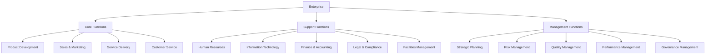

## Core Business Functions

### 1. Product Development Function

#### Level 1: Business Domains
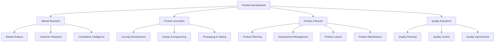

#### Level 2: Business Capabilities Detail

**Market Research Capabilities**
- **Market Analysis (MR1)**
  - Industry trend analysis
  - Market size estimation
  - Growth opportunity assessment
  - Regulatory environment analysis

- **Customer Research (MR2)**
  - Customer needs assessment
  - User experience research
  - Customer segmentation
  - Voice of customer programs

- **Competitive Intelligence (MR3)**
  - Competitor analysis
  - Competitive positioning
  - Threat assessment
  - Market share analysis

**Product Innovation Capabilities**
- **Concept Development (PI1)**
  - Ideation management
  - Concept evaluation
  - Feasibility studies
  - Innovation pipeline management

- **Design & Engineering (PI2)**
  - Product design
  - Engineering specifications
  - Technology selection
  - Design validation

- **Prototyping & Testing (PI3)**
  - Prototype development
  - Performance testing
  - User acceptance testing
  - Compliance testing

### 2. Sales & Marketing Function

#### Level 1: Business Domains
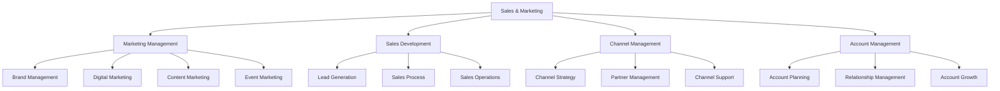

#### Level 2: Business Capabilities Detail

**Marketing Management Capabilities**
- **Brand Management (MKT1)**
  - Brand strategy development
  - Brand positioning
  - Brand communication
  - Brand performance monitoring

- **Digital Marketing (MKT2)**
  - Search engine optimization
  - Social media marketing
  - Email marketing campaigns
  - Marketing automation

- **Content Marketing (MKT3)**
  - Content strategy
  - Content creation
  - Content distribution
  - Content performance analysis

**Sales Development Capabilities**
- **Lead Generation (SD1)**
  - Prospect identification
  - Lead qualification
  - Lead scoring
  - Lead nurturing

- **Sales Process (SD2)**
  - Opportunity management
  - Proposal development
  - Negotiation management
  - Contract closure

### 3. Service Delivery Function

#### Level 1: Business Domains
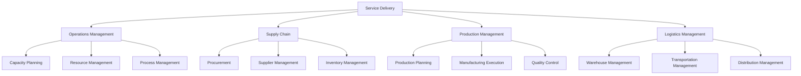

#### Level 2: Business Capabilities Detail

**Operations Management Capabilities**
- **Capacity Planning (OM1)**
  - Demand forecasting
  - Capacity analysis
  - Resource allocation
  - Scalability planning

- **Resource Management (OM2)**
  - Resource scheduling
  - Utilization optimization
  - Skill management
  - Equipment management

**Supply Chain Capabilities**
- **Procurement (SC1)**
  - Vendor selection
  - Contract negotiation
  - Purchase order management
  - Supplier performance monitoring

- **Inventory Management (SC3)**
  - Stock level optimization
  - Inventory tracking
  - Demand planning
  - Obsolescence management

### 4. Customer Service Function

#### Level 1: Business Domains
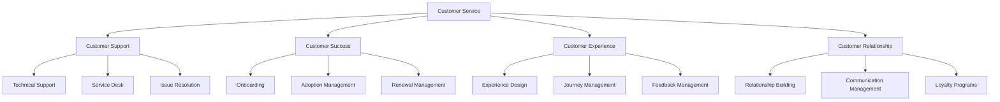

## Support Business Functions

### 1. Human Resources Function

#### Level 1: Business Domains
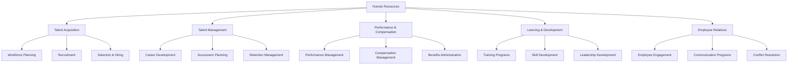

### 2. Information Technology Function

#### Level 1: Business Domains
```mermaid
graph TD
    IT[Information Technology] --> AD[Application Development]
    IT --> IM[Infrastructure Management]
    IT --> DM[Data Management]
    IT --> SM[Security Management]
    IT --> ITS[IT Service Management]
    
    AD --> AD1[Application Design]
    AD --> AD2[Development & Testing]
    AD --> AD3[Application Maintenance]
    
    IM --> IM1[Infrastructure Planning]
    IM --> IM2[System Administration]
    IM --> IM3[Cloud Management]
    
    DM --> DM1[Data Architecture]
    DM --> DM2[Data Quality]
    DM --> DM3[Data Analytics]
    
    SM --> SM1[Security Architecture]
    SM --> SM2[Identity Management]
    SM --> SM3[Incident Response]
    
    ITS --> ITS1[Service Desk]
    ITS --> ITS2[Change Management]
    ITS --> ITS3[Asset Management]
```

### 3. Finance & Accounting Function

#### Level 1: Business Domains
```mermaid
graph TD
    FIN[Finance & Accounting] --> FP[Financial Planning]
    FIN --> AC[Accounting Operations]
    FIN --> TM[Treasury Management]
    FIN --> FM[Financial Management]
    FIN --> CR[Corporate Reporting]
    
    FP --> FP1[Budgeting & Forecasting]
    FP --> FP2[Financial Analysis]
    FP --> FP3[Investment Planning]
    
    AC --> AC1[Accounts Payable]
    AC --> AC2[Accounts Receivable]
    AC --> AC3[General Ledger]
    
    TM --> TM1[Cash Management]
    TM --> TM2[Banking Relationships]
    TM --> TM3[Capital Structure]
    
    FM --> FM1[Cost Management]
    FM --> FM2[Revenue Management]
    FM --> FM3[Profitability Analysis]
    
    CR --> CR1[Financial Reporting]
    CR --> CR2[Regulatory Compliance]
    CR --> CR3[Investor Relations]
```

## Management Business Functions

### 1. Strategic Planning Function

#### Level 1: Business Domains
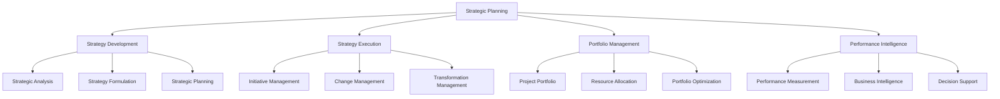

### 2. Risk Management Function

#### Level 1: Business Domains
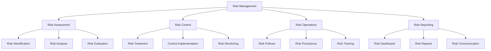

## Function Interaction Matrix

### Cross-Functional Dependencies

| Function | Product Dev | Sales & Marketing | Service Delivery | Customer Service |
|----------|-------------|------------------|------------------|------------------|
| **Product Development** | Core | Requirements Input | Product Specs | Feature Requests |
| **Sales & Marketing** | Roadmap Input | Core | Sales Forecasts | Customer Insights |
| **Service Delivery** | Product Testing | Delivery Capabilities | Core | Service Quality |
| **Customer Service** | Feature Feedback | Lead Generation | Service Issues | Core |

### Information Flow Mapping

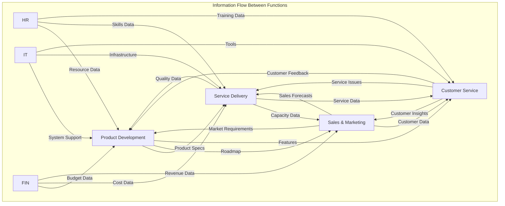

## Function Performance Framework

### Key Performance Indicators by Function

#### Core Functions KPIs
| Function | Primary KPIs | Target Values |
|----------|-------------|---------------|
| Product Development | Time to Market, Innovation Rate | 50% reduction, 30% increase |
| Sales & Marketing | Conversion Rate, Customer Acquisition Cost | 25% increase, 40% reduction |
| Service Delivery | On-time Delivery, Quality Score | 98%, 4.5/5 |
| Customer Service | CSAT, First Call Resolution | 4.5/5, 85% |

#### Support Functions KPIs
| Function | Primary KPIs | Target Values |
|----------|-------------|---------------|
| Human Resources | Employee Engagement, Retention Rate | 85%, 95% |
| Information Technology | System Uptime, User Satisfaction | 99.9%, 4.0/5 |
| Finance & Accounting | Financial Accuracy, Reporting Time | 99.5%, 50% reduction |

#### Management Functions KPIs
| Function | Primary KPIs | Target Values |
|----------|-------------|---------------|
| Strategic Planning | Goal Achievement, Initiative Success | 90%, 85% |
| Risk Management | Risk Coverage, Incident Reduction | 95%, 50% reduction |
| Quality Management | Quality Score, Defect Rate | 4.5/5, <1% |

## Digital Transformation Impact

### Function Automation Potential

#### High Automation Potential (70-90%)
- **Accounts Payable/Receivable:** RPA implementation
- **Inventory Management:** IoT and AI optimization
- **Customer Support:** Chatbots and AI assistance
- **Data Analytics:** Machine learning automation

#### Medium Automation Potential (30-70%)
- **Sales Process:** CRM automation and AI insights
- **Quality Control:** Automated testing and monitoring
- **Recruitment:** AI-powered screening and matching
- **Financial Reporting:** Automated dashboard generation

#### Low Automation Potential (10-30%)
- **Strategic Planning:** Human insight and creativity
- **Relationship Management:** Personal interaction required
- **Complex Problem Solving:** Human expertise needed
- **Creative Design:** Human creativity and innovation

### Technology Enabler Mapping

| Function Category | Primary Technologies | Implementation Priority |
|------------------|---------------------|----------------------|
| Core Functions | AI, IoT, Cloud, Analytics | High |
| Support Functions | RPA, Cloud, Collaboration | Medium |
| Management Functions | BI, Analytics, Dashboards | High |

## Implementation Roadmap

### Phase 1: Foundation (Months 1-6)
- Complete function documentation
- Establish baseline performance metrics
- Identify quick automation opportunities
- Implement basic digital tools

### Phase 2: Enhancement (Months 7-12)
- Deploy automation solutions
- Integrate cross-functional workflows
- Enhance data analytics capabilities
- Optimize resource allocation

### Phase 3: Transformation (Months 13-24)
- Advanced AI implementation
- Predictive analytics deployment
- End-to-end process automation
- Continuous improvement culture

---
**Document Version:** 1.0  
**Last Updated:** [Date]  
**Owner:** Business Architecture Team  
**Review Frequency:** Bi-annually  
**Next Review:** [Date + 6 months]