# Business Process Models

## Overview
This document presents comprehensive business process models for the enterprise, including current state (AS-IS) and future state (TO-BE) process flows. The models follow ArchiMate 3.2 notation and support the digital transformation initiative.

## Process Modeling Framework

### Process Hierarchy
1. **Level 0:** Enterprise Value Chain
2. **Level 1:** Core Business Processes
3. **Level 2:** Sub-processes and Activities
4. **Level 3:** Tasks and Procedures

### Process Classification
- **Core Processes:** Direct customer value creation
- **Support Processes:** Enable core processes
- **Management Processes:** Control and coordinate

## AS-IS Process Models

### Level 0: Enterprise Value Chain

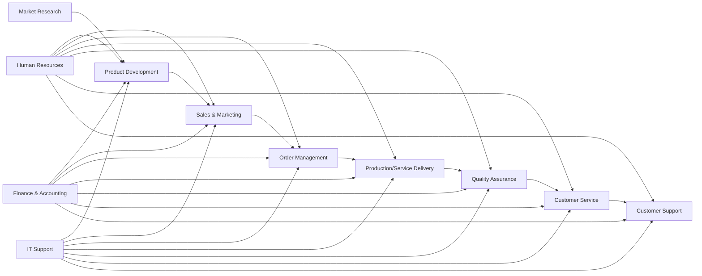

### Level 1: Core Business Processes

#### Customer Acquisition Process (AS-IS)

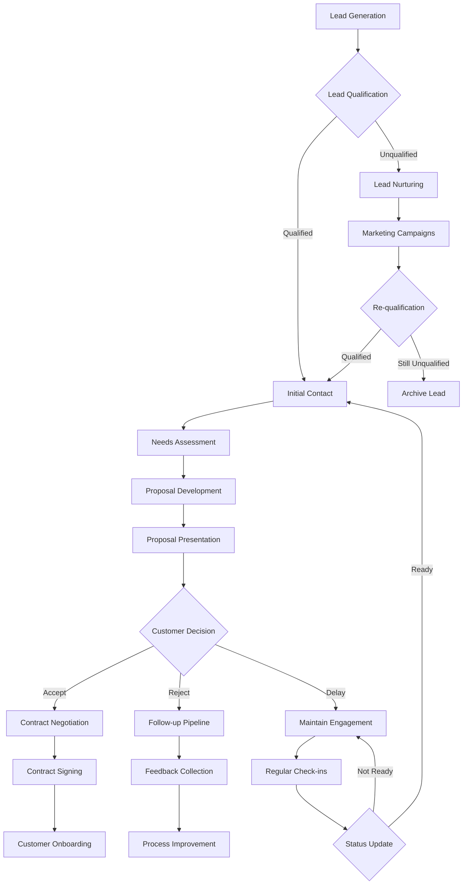

#### Order-to-Cash Process (AS-IS)

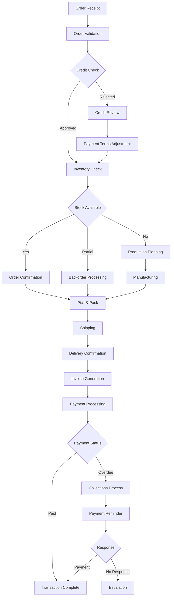

#### Product Development Process (AS-IS)

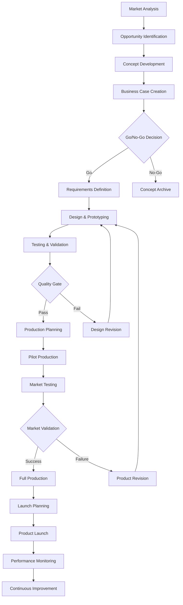

### Level 2: Support Processes

#### Human Resources Management (AS-IS)

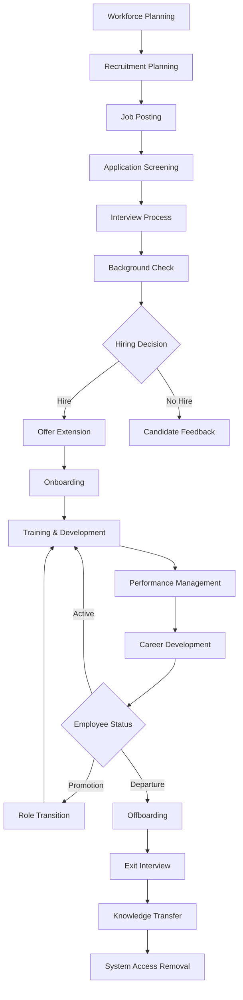

#### Financial Management (AS-IS)

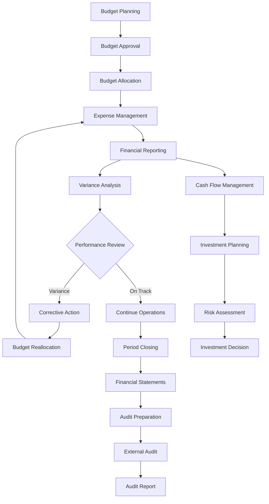

## TO-BE Process Models

### Digital Transformation Vision
The TO-BE processes leverage automation, AI, and cloud technologies to achieve:
- 50% reduction in process cycle times
- 90% automation of routine tasks
- Real-time data-driven decision making
- Seamless customer experience

### Level 1: Transformed Core Processes

#### Customer Acquisition Process (TO-BE)

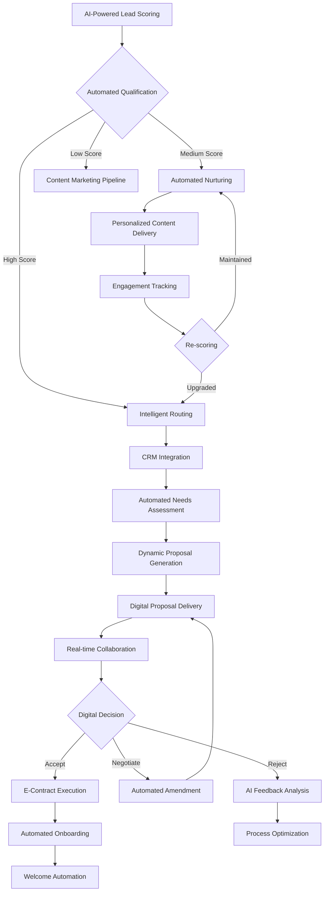

#### Order-to-Cash Process (TO-BE)

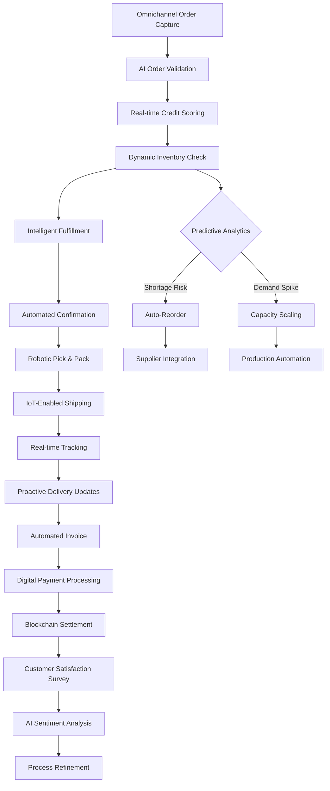

#### Product Development Process (TO-BE)

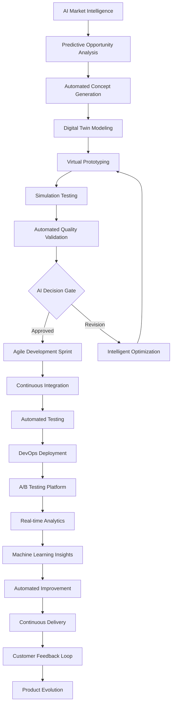

### Level 2: Transformed Support Processes

#### AI-Enhanced HR Management (TO-BE)

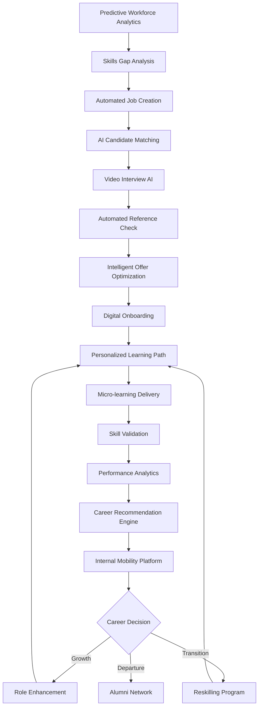

#### Intelligent Financial Management (TO-BE)

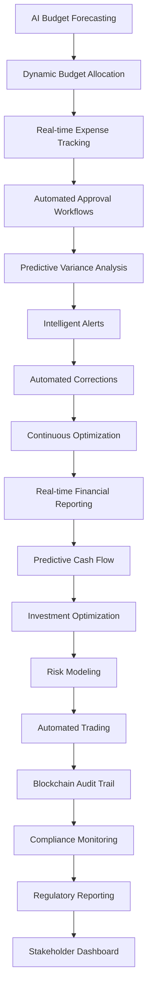

## Process Improvement Analysis

### AS-IS vs TO-BE Comparison

| Process | AS-IS Cycle Time | TO-BE Cycle Time | Improvement |
|---------|------------------|------------------|-------------|
| Customer Acquisition | 30-45 days | 7-14 days | 70% reduction |
| Order-to-Cash | 15-20 days | 3-5 days | 75% reduction |
| Product Development | 18-24 months | 6-12 months | 60% reduction |
| HR Recruitment | 45-60 days | 10-15 days | 75% reduction |
| Financial Reporting | 10-15 days | Real-time | 90% reduction |

### Key Transformation Enablers

#### Technology Enablers
1. **Artificial Intelligence:** Process automation and decision support
2. **Cloud Platform:** Scalability and integration
3. **IoT Sensors:** Real-time data collection
4. **Blockchain:** Security and transparency
5. **RPA:** Task automation

#### Organizational Enablers
1. **Agile Methodology:** Rapid iteration and adaptation
2. **DevOps Culture:** Continuous delivery and improvement
3. **Data-Driven Decision Making:** Analytics-based processes
4. **Customer-Centric Design:** Experience optimization
5. **Cross-Functional Teams:** Collaboration and efficiency

## Implementation Roadmap

### Phase 1: Foundation (Months 1-6)
- Process documentation and standardization
- Basic automation implementation
- Data quality improvement
- Training and change management

### Phase 2: Digitization (Months 7-12)
- Workflow automation deployment
- Integration platform implementation
- Real-time monitoring setup
- Customer portal development

### Phase 3: Intelligence (Months 13-18)
- AI and ML model deployment
- Predictive analytics implementation
- Advanced automation rollout
- Performance optimization

### Phase 4: Innovation (Months 19-24)
- Continuous improvement engine
- Advanced AI capabilities
- Ecosystem integration
- Future technology adoption

## Success Metrics

### Operational Metrics
- Process cycle time reduction
- Error rate improvement
- Resource utilization optimization
- Customer satisfaction increase

### Financial Metrics
- Cost per transaction reduction
- Revenue per process improvement
- ROI on automation investment
- Efficiency gain percentage

### Quality Metrics
- Defect rate reduction
- Compliance score improvement
- SLA achievement rate
- Customer experience score

---
**Document Version:** 1.0  
**Last Updated:** [Date]  
**Owner:** Business Architecture Team  
**Review Frequency:** Quarterly  
**Next Review:** [Date + 3 months]