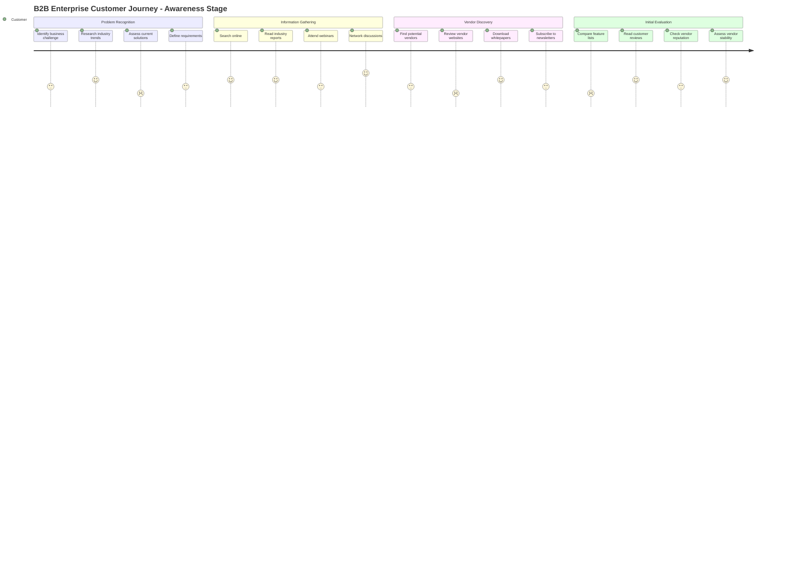
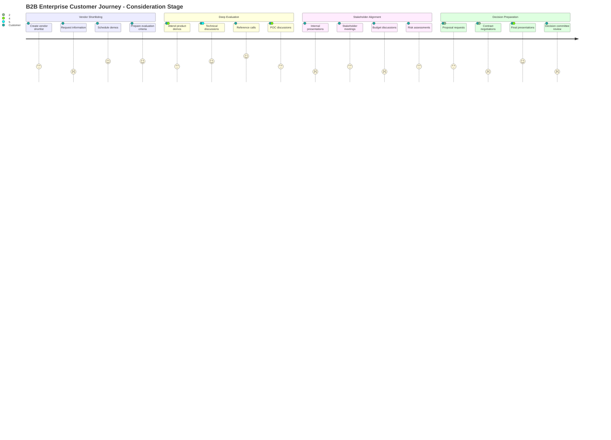
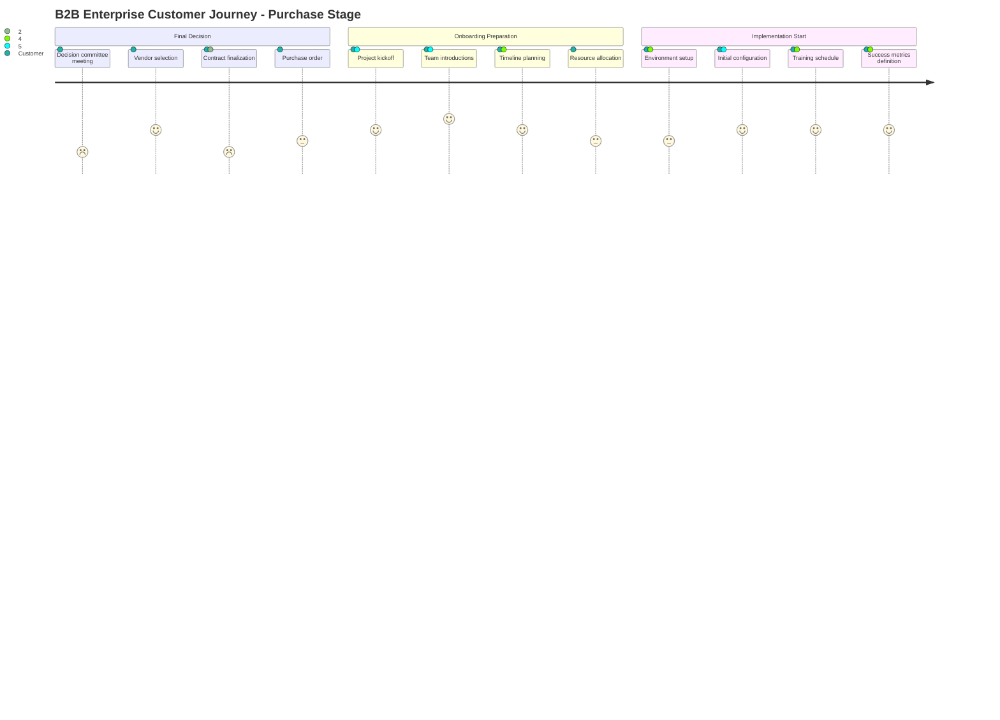
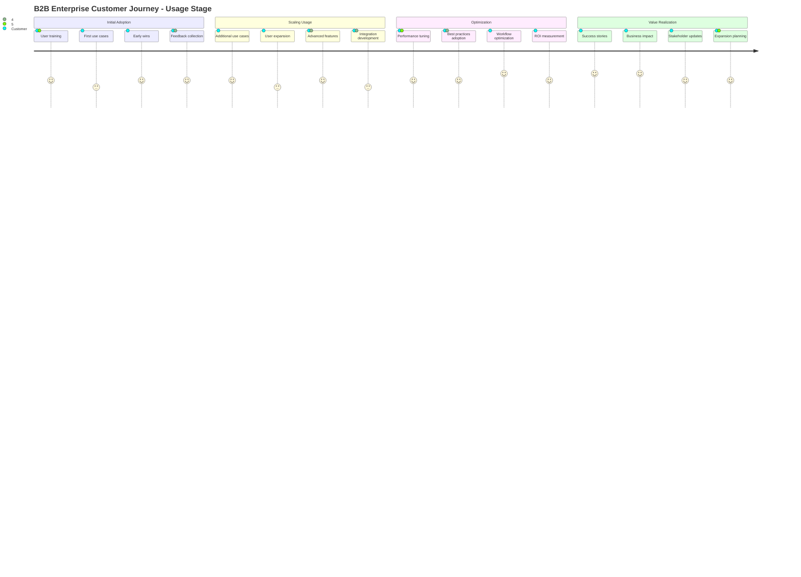
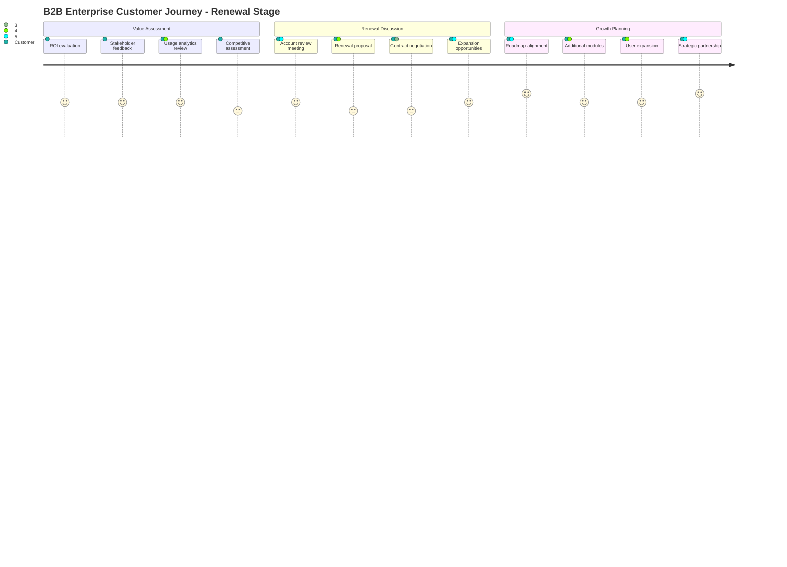
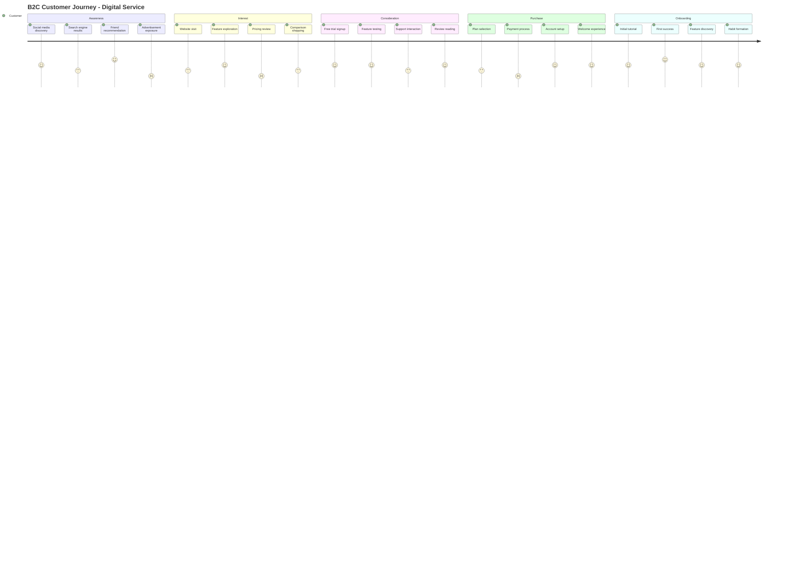
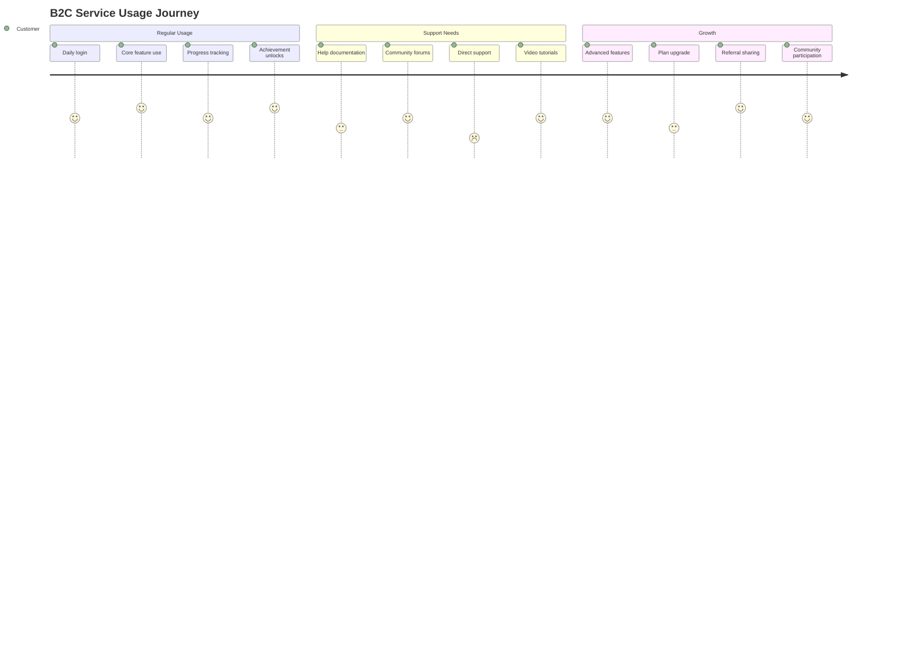

# Customer Journey Maps

## Overview
This document provides comprehensive customer journey mapping across all touchpoints and stages of the customer lifecycle. The maps identify pain points, opportunities, and moments of truth to enhance customer experience and drive business value.

## Customer Journey Mapping Framework

### Journey Mapping Methodology
1. **Customer-Centric Perspective:** View from customer's point of view
2. **Omnichannel Experience:** All touchpoints and channels
3. **Emotional Journey:** Feelings and emotions at each stage
4. **Pain Point Identification:** Friction and frustration sources
5. **Opportunity Discovery:** Improvement and innovation areas

### Customer Personas
#### Primary Persona: Enterprise Decision Maker
- **Role:** IT Director / CTO
- **Goals:** Digital transformation, cost reduction, efficiency
- **Pain Points:** Complex procurement, vendor management, ROI uncertainty
- **Preferred Channels:** Email, LinkedIn, webinars, direct sales

#### Secondary Persona: End User
- **Role:** Business Analyst / Developer
- **Goals:** Easy-to-use solutions, productivity improvement
- **Pain Points:** Learning curve, integration complexity, support quality
- **Preferred Channels:** Online resources, community forums, self-service

## B2B Customer Journey - Enterprise Sales

### Awareness Stage Journey

#### Awareness Stage Touchpoint Analysis

| Touchpoint | Channel | Customer Emotion | Pain Points | Opportunities |
|------------|---------|------------------|-------------|---------------|
| Problem Recognition | Internal | Frustrated 😤 | Lack of clarity on root cause | Provide diagnostic tools |
| Online Search | Web/SEO | Overwhelmed 😵 | Too many options, information overload | Better content curation |
| Industry Reports | Third-party | Analytical 🤔 | Generic insights, not industry-specific | Custom industry content |
| Webinars | Digital Events | Engaged 😊 | Time constraints, generic content | Personalized sessions |
| Vendor Websites | Web | Skeptical 🤨 | Marketing fluff, lack of substance | Authentic customer stories |
| Peer Networks | Social/Events | Trusting 😌 | Limited peer network | Facilitate connections |

### Consideration Stage Journey

#### Consideration Stage Touchpoint Analysis

| Touchpoint | Channel | Customer Emotion | Pain Points | Opportunities |
|------------|---------|------------------|-------------|---------------|
| Demo Requests | Email/Forms | Hopeful 😊 | Complex forms, slow response | Simplified scheduling |
| Product Demos | Video/Web | Engaged 😊 | Generic demos, irrelevant features | Customized scenarios |
| Technical Deep Dive | Sales Engineer | Confident 😌 | Technical complexity, jargon | Clear explanations |
| Reference Calls | Phone | Reassured 😌 | Limited reference options | Diverse references |
| POC Planning | Collaborative | Excited 😄 | Resource requirements, timeline | Rapid POC tools |
| Internal Selling | Internal | Stressed 😰 | Stakeholder alignment, politics | Support materials |
| Proposal Review | Document | Analytical 🤔 | Complex proposals, unclear pricing | Clear, concise proposals |
| Contract Negotiation | Legal/Procurement | Frustrated 😤 | Legal complexity, delays | Simplified contracts |

### Purchase Stage Journey

#### Purchase Stage Touchpoint Analysis

| Touchpoint | Channel | Customer Emotion | Pain Points | Opportunities |
|------------|---------|------------------|-------------|---------------|
| Final Decision | Committee Meeting | Nervous 😰 | Pressure, second-guessing | Decision support tools |
| Contract Signing | Legal Portal | Relieved 😌 | Legal complexity | E-signature platform |
| Project Kickoff | Video Conference | Excited 😄 | Coordination complexity | Structured onboarding |
| Team Introductions | Face-to-face/Virtual | Optimistic 😊 | Role clarity | Clear RACI matrix |
| Environment Setup | Technical | Anxious 😟 | Technical complexity | Automated setup |
| Training Planning | Collaborative | Engaged 😊 | Schedule coordination | Flexible training options |

### Usage/Adoption Stage Journey

#### Usage Stage Touchpoint Analysis

| Touchpoint | Channel | Customer Emotion | Pain Points | Opportunities |
|------------|---------|------------------|-------------|---------------|
| User Training | Learning Platform | Eager 😊 | Learning curve, time investment | Micro-learning modules |
| First Implementation | Application | Hopeful 😊 | Configuration complexity | Templates and wizards |
| Support Requests | Help Desk | Frustrated 😤 | Response time, solution quality | AI-powered support |
| Feature Discovery | In-app | Curious 🤔 | Feature complexity | Guided tours |
| Performance Issues | Monitoring | Concerned 😟 | Performance degradation | Proactive monitoring |
| Success Measurement | Analytics | Satisfied 😌 | Metrics complexity | Automated reporting |
| Best Practices | Community | Engaged 😊 | Knowledge gaps | Peer learning |
| Expansion Planning | Strategic | Optimistic 😊 | Resource constraints | ROI calculators |

### Renewal/Growth Stage Journey

#### Renewal Stage Touchpoint Analysis

| Touchpoint | Channel | Customer Emotion | Pain Points | Opportunities |
|------------|---------|------------------|-------------|---------------|
| ROI Review | Analytics Portal | Analytical 🤔 | Metrics complexity | Automated ROI reports |
| Account Review | Strategic Meeting | Reflective 🤔 | Time investment | Value-focused agenda |
| Renewal Proposal | Sales Process | Cautious 🤔 | Price increases | Value-based pricing |
| Contract Renewal | Legal Process | Resigned 😐 | Process complexity | Simplified renewals |
| Expansion Discussion | Strategic | Interested 😊 | Budget constraints | Phased approach |
| Future Planning | Collaborative | Excited 😄 | Uncertainty | Roadmap alignment |

## B2C Customer Journey - Digital Service

### Discovery to Purchase Journey

### Service Usage Journey

## Pain Point Analysis

### Critical Pain Points

#### High Impact - High Frequency
1. **Complex Onboarding Process**
   - Current Experience: 45% abandonment rate
   - Customer Emotion: Frustrated 😤
   - Business Impact: $2M annual revenue loss
   - Solution: Guided onboarding wizard

2. **Slow Support Response**
   - Current Experience: 24-hour average response
   - Customer Emotion: Angry 😡
   - Business Impact: 15% churn increase
   - Solution: AI-powered chatbot + escalation

3. **Unclear Pricing Structure**
   - Current Experience: 60% price objections
   - Customer Emotion: Confused 😵
   - Business Impact: 30% longer sales cycles
   - Solution: Transparent pricing calculator

#### Medium Impact - High Frequency
1. **Feature Discovery Challenges**
2. **Integration Complexity**
3. **Performance Issues**

#### High Impact - Medium Frequency
1. **Contract Negotiation Delays**
2. **Technical Support Quality**
3. **ROI Measurement Difficulty**

## Opportunity Analysis

### Quick Wins (Low Effort - High Impact)
1. **Email Template Optimization**
   - Effort: 2 weeks
   - Impact: 25% response rate improvement
   - Investment: $10K

2. **Self-Service Portal Enhancement**
   - Effort: 1 month
   - Impact: 40% support ticket reduction
   - Investment: $50K

3. **Onboarding Checklist**
   - Effort: 1 week
   - Impact: 30% completion rate improvement
   - Investment: $5K

### Strategic Initiatives (High Effort - High Impact)
1. **AI-Powered Personalization**
   - Effort: 6 months
   - Impact: 50% engagement improvement
   - Investment: $500K

2. **Omnichannel Experience Platform**
   - Effort: 12 months
   - Impact: 35% customer satisfaction improvement
   - Investment: $2M

3. **Predictive Analytics Implementation**
   - Effort: 9 months
   - Impact: 25% churn reduction
   - Investment: $1M

## Measurement Framework

### Customer Experience Metrics

#### Satisfaction Metrics
- Net Promoter Score (NPS): Target 50+
- Customer Satisfaction Score (CSAT): Target 4.5+
- Customer Effort Score (CES): Target <2.0

#### Engagement Metrics
- Feature Adoption Rate: Target 80%
- Time to First Value: Target <24 hours
- Monthly Active Users: Target 90%

#### Business Impact Metrics
- Customer Lifetime Value: Target 300% increase
- Customer Acquisition Cost: Target 50% reduction
- Churn Rate: Target <5% annually

### Journey Stage Metrics

| Stage | Key Metrics | Current | Target |
|-------|-------------|---------|--------|
| Awareness | Brand Recognition | 25% | 50% |
| Consideration | Demo Attendance | 40% | 70% |
| Purchase | Conversion Rate | 15% | 25% |
| Adoption | Time to Value | 30 days | 7 days |
| Renewal | Renewal Rate | 80% | 95% |

## Implementation Roadmap

### Phase 1: Foundation (Months 1-3)
- Journey mapping completion
- Pain point prioritization
- Quick wins implementation
- Baseline metrics establishment

### Phase 2: Enhancement (Months 4-9)
- Critical pain point resolution
- Channel optimization
- Automation implementation
- Staff training programs

### Phase 3: Innovation (Months 10-18)
- AI and ML integration
- Predictive analytics deployment
- Omnichannel experience
- Advanced personalization

### Phase 4: Optimization (Months 19-24)
- Continuous improvement
- Advanced analytics
- Ecosystem integration
- Future experience design

---
**Document Version:** 1.0  
**Last Updated:** [Date]  
**Owner:** Customer Experience Team  
**Review Frequency:** Quarterly  
**Next Review:** [Date + 3 months]