# Value Stream Maps

## Overview
This document provides comprehensive value stream mapping for key business processes, identifying value-adding and non-value-adding activities. The maps support lean transformation and continuous improvement initiatives by visualizing the flow of materials and information.

## Value Stream Mapping Methodology

### Key Principles
1. **Customer Value Focus:** Activities that customers are willing to pay for
2. **Flow Optimization:** Elimination of waste and bottlenecks
3. **Pull-Based Systems:** Demand-driven production and service delivery
4. **Continuous Improvement:** Regular analysis and optimization

### Waste Categories (7 Wastes + 1)
1. **Transportation:** Unnecessary movement of materials/information
2. **Inventory:** Excess stock or work-in-progress
3. **Motion:** Unnecessary movement of people
4. **Waiting:** Delays and idle time
5. **Overproduction:** Producing more than needed
6. **Over-processing:** Excessive or incorrect processing
7. **Defects:** Errors and rework
8. **Skills:** Underutilization of human potential

## Current State Value Stream Maps

### Customer Acquisition Value Stream (AS-IS)

### Order-to-Cash Value Stream (AS-IS)

```mermaid
flowchart LR
    subgraph "Order Management"
        A[Order Receipt<br/>⏱️ 0.5 days<br/>👥 1 person<br/>💰 $50] --> B[Order Entry<br/>⏱️ 1 day<br/>👥 1 person<br/>💰 $100]
        B --> C[Credit Check<br/>⏱️ 1 day<br/>👥 1 person<br/>💰 $75]
        C --> D[Inventory Check<br/>⏱️ 0.5 days<br/>👥 1 person<br/>💰 $40]
    end
    
    subgraph "Fulfillment"
        D --> E[Pick List Generation<br/>⏱️ 0.5 days<br/>👥 1 person<br/>💰 $50]
        E --> F[Warehouse Picking<br/>⏱️ 1 day<br/>👥 2 people<br/>💰 $200]
        F --> G[Quality Control<br/>⏱️ 1 day<br/>👥 1 person<br/>💰 $100]
        G --> H[Packaging<br/>⏱️ 1 day<br/>👥 2 people<br/>💰 $150]
        H --> I[Shipping<br/>⏱️ 0.5 days<br/>👥 1 person<br/>💰 $75]
    end
    
    subgraph "Financial"
        I --> J[Invoice Generation<br/>⏱️ 1 day<br/>👥 1 person<br/>💰 $100]
        J --> K[Payment Processing<br/>⏱️ 2 days<br/>👥 1 person<br/>💰 $150]
    end
    
    subgraph "Wait Times"
        W1[Wait: Credit Approval<br/>⏱️ 1 day] -.-> D
        W2[Wait: Inventory<br/>⏱️ 3 days] -.-> E
        W3[Wait: Shipping Pickup<br/>⏱️ 1 day] -.-> J
        W4[Wait: Customer Payment<br/>⏱️ 15 days] -.-> K
    end
    
    subgraph "Metrics"
        M1[Total Lead Time: 28 days<br/>Processing Time: 8 days<br/>Wait Time: 20 days<br/>Value Add Ratio: 29%]
    end
```

### Product Development Value Stream (AS-IS)

## Future State Value Stream Maps

### Customer Acquisition Value Stream (TO-BE)

```mermaid
flowchart LR
    subgraph "AI-Powered Marketing"
        A[Automated Lead Scoring<br/>⏱️ 1 hour<br/>🤖 AI System<br/>💰 $10] --> B[Intelligent Qualification<br/>⏱️ 2 hours<br/>🤖 AI + Human<br/>💰 $25]
    end
    
    subgraph "Digital Sales"
        B --> C[Automated Contact<br/>⏱️ 1 hour<br/>🤖 CRM System<br/>💰 $15]
        C --> D[Digital Needs Assessment<br/>⏱️ 4 hours<br/>👥 1 person<br/>💰 $200]
        D --> E[AI Proposal Generation<br/>⏱️ 2 hours<br/>🤖 AI + Template<br/>💰 $50]
        E --> F[Automated Review<br/>⏱️ 1 hour<br/>🤖 AI System<br/>💰 $20]
        F --> G[Virtual Presentation<br/>⏱️ 2 hours<br/>👥 2 people<br/>💰 $300]
    end
    
    subgraph "Smart Contracts"
        G --> H[E-Contract Platform<br/>⏱️ 2 hours<br/>🤖 Smart Contract<br/>💰 $30]
        H --> I[Digital Signature<br/>⏱️ 1 hour<br/>🤖 DocuSign<br/>💰 $20]
    end
    
    subgraph "Automated Onboarding"
        I --> J[Auto Onboarding<br/>⏱️ 2 hours<br/>🤖 Workflow Engine<br/>💰 $50]
    end
    
    subgraph "Minimal Wait Times"
        W1[Real-time Response<br/>⏱️ 0 hours] -.-> C
        W2[Instant Feedback<br/>⏱️ 0 hours] -.-> H
    end
    
    subgraph "Metrics"
        M1[Total Lead Time: 2 days<br/>Processing Time: 16 hours<br/>Wait Time: 0 hours<br/>Value Add Ratio: 100%]
    end
```

### Order-to-Cash Value Stream (TO-BE)

```mermaid
flowchart LR
    subgraph "Omnichannel Orders"
        A[Multi-channel Capture<br/>⏱️ 5 minutes<br/>🤖 API Gateway<br/>💰 $5] --> B[AI Order Validation<br/>⏱️ 2 minutes<br/>🤖 ML Model<br/>💰 $3]
        B --> C[Real-time Credit<br/>⏱️ 1 minute<br/>🤖 AI Scoring<br/>💰 $2]
        C --> D[Dynamic Inventory<br/>⏱️ 30 seconds<br/>🤖 IoT System<br/>💰 $1]
    end
    
    subgraph "Automated Fulfillment"
        D --> E[Auto Pick List<br/>⏱️ 1 minute<br/>🤖 WMS System<br/>💰 $2]
        E --> F[Robotic Picking<br/>⏱️ 30 minutes<br/>🤖 Warehouse Robot<br/>💰 $15]
        F --> G[Auto Quality Check<br/>⏱️ 5 minutes<br/>🤖 Vision System<br/>💰 $3]
        G --> H[Smart Packaging<br/>⏱️ 10 minutes<br/>🤖 Packaging Robot<br/>💰 $8]
        H --> I[Instant Shipping<br/>⏱️ 5 minutes<br/>🤖 Carrier API<br/>💰 $5]
    end
    
    subgraph "Digital Finance"
        I --> J[Auto Invoicing<br/>⏱️ 1 minute<br/>🤖 ERP System<br/>💰 $2]
        J --> K[Digital Payment<br/>⏱️ 2 minutes<br/>🤖 Payment Gateway<br/>💰 $10]
    end
    
    subgraph "No Wait Times"
        W1[Eliminated Waiting<br/>⏱️ 0] -.-> E
    end
    
    subgraph "Metrics"
        M1[Total Lead Time: 1 hour<br/>Processing Time: 1 hour<br/>Wait Time: 0 hours<br/>Value Add Ratio: 100%]
    end
```

### Product Development Value Stream (TO-BE)

```mermaid
flowchart LR
    subgraph "AI Research"
        A[AI Market Intelligence<br/>⏱️ 2 days<br/>🤖 Analytics Platform<br/>💰 $1,000] --> B[Automated Concepts<br/>⏱️ 1 day<br/>🤖 AI Generation<br/>💰 $500]
    end
    
    subgraph "Digital Design"
        B --> C[Auto Requirements<br/>⏱️ 2 days<br/>🤖 NLP System<br/>💰 $800]
        C --> D[Digital Twin Design<br/>⏱️ 10 days<br/>🤖 CAD Automation<br/>💰 $5,000]
        D --> E[Virtual Review<br/>⏱️ 1 day<br/>🤖 Collaboration Tool<br/>💰 $200]
    end
    
    subgraph "Virtual Testing"
        E --> F[Simulation Testing<br/>⏱️ 5 days<br/>🤖 Simulation Engine<br/>💰 $2,500]
        F --> G[AI Validation<br/>⏱️ 2 days<br/>🤖 ML Validation<br/>💰 $1,000]
        G --> H[Continuous Compliance<br/>⏱️ 3 days<br/>🤖 RegTech Platform<br/>💰 $1,500]
    end
    
    subgraph "Agile Production"
        H --> I[Auto Planning<br/>⏱️ 1 day<br/>🤖 Planning System<br/>💰 $300]
        I --> J[3D Pilot Production<br/>⏱️ 5 days<br/>🤖 3D Printing<br/>💰 $2,000]
        J --> K[Digital Launch<br/>⏱️ 3 days<br/>🤖 Marketing Automation<br/>💰 $1,500]
    end
    
    subgraph "Eliminated Waits"
        W1[Parallel Processing<br/>⏱️ 0] -.-> C
        W2[Continuous Integration<br/>⏱️ 0] -.-> F
        W3[Automated Approval<br/>⏱️ 0] -.-> I
    end
    
    subgraph "Metrics"
        M1[Total Lead Time: 35 days<br/>Processing Time: 35 days<br/>Wait Time: 0 days<br/>Value Add Ratio: 100%]
    end
```

## Value Stream Analysis

### Current State Analysis

| Process | Total Time | Processing Time | Wait Time | Value Add % | Cost |
|---------|------------|----------------|-----------|-------------|------|
| Customer Acquisition | 33 days | 21 days | 12 days | 64% | $5,200 |
| Order-to-Cash | 28 days | 8 days | 20 days | 29% | $840 |
| Product Development | 430 days | 295 days | 135 days | 69% | $307,500 |

### Future State Targets

| Process | Target Time | Processing Time | Wait Time | Value Add % | Target Cost |
|---------|-------------|----------------|-----------|-------------|-------------|
| Customer Acquisition | 2 days | 16 hours | 0 hours | 100% | $720 |
| Order-to-Cash | 1 hour | 1 hour | 0 hours | 100% | $56 |
| Product Development | 35 days | 35 days | 0 days | 100% | $16,300 |

### Improvement Opportunities

#### Waste Elimination Targets
1. **Transportation:** Digital handoffs eliminate physical movement
2. **Inventory:** Real-time inventory management reduces stock
3. **Motion:** Automation eliminates manual movement
4. **Waiting:** System integration eliminates delays
5. **Overproduction:** Demand-driven production
6. **Over-processing:** Standardization eliminates redundancy
7. **Defects:** AI quality control prevents errors
8. **Skills:** AI augmentation maximizes human potential

#### Technology Enablers
1. **Artificial Intelligence:** Process automation and optimization
2. **Internet of Things:** Real-time data collection
3. **Robotic Process Automation:** Task automation
4. **Cloud Computing:** Scalable processing power
5. **Digital Twins:** Virtual simulation and testing

## Implementation Strategy

### Lean Transformation Approach

#### Phase 1: Current State Mapping (Months 1-2)
- Document current processes
- Identify value streams
- Measure baseline metrics
- Analyze waste sources

#### Phase 2: Future State Design (Months 3-4)
- Design optimized processes
- Define target metrics
- Plan technology integration
- Develop implementation roadmap

#### Phase 3: Pilot Implementation (Months 5-8)
- Select pilot value stream
- Implement improvements
- Measure results
- Refine approach

#### Phase 4: Full Rollout (Months 9-18)
- Scale successful pilots
- Implement across all streams
- Continuous improvement
- Culture transformation

### Change Management

#### Stakeholder Engagement
1. **Leadership Alignment:** Executive sponsorship and support
2. **Employee Involvement:** Participatory improvement process
3. **Customer Focus:** Voice of customer integration
4. **Supplier Integration:** Extended value stream optimization

#### Training and Development
1. **Lean Principles:** Waste identification and elimination
2. **Technology Skills:** Digital tool proficiency
3. **Problem Solving:** Continuous improvement methodologies
4. **Data Analytics:** Performance measurement and analysis

## Success Metrics

### Operational Metrics
- Lead time reduction percentage
- Process cycle efficiency improvement
- Waste elimination percentage
- First-time-right quality rate

### Financial Metrics
- Cost per transaction reduction
- Working capital optimization
- Revenue per employee increase
- Return on lean investment

### Customer Metrics
- Customer satisfaction improvement
- Net Promoter Score increase
- Customer retention rate
- Time to value realization

### Employee Metrics
- Employee engagement score
- Skills development index
- Innovation suggestion rate
- Process improvement participation

---
**Document Version:** 1.0  
**Last Updated:** [Date]  
**Owner:** Business Process Excellence Team  
**Review Frequency:** Monthly  
**Next Review:** [Date + 1 month]