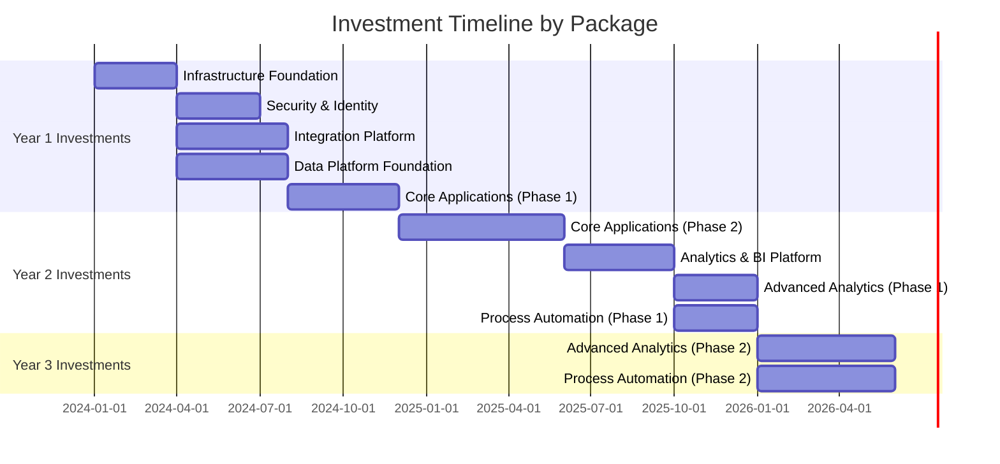
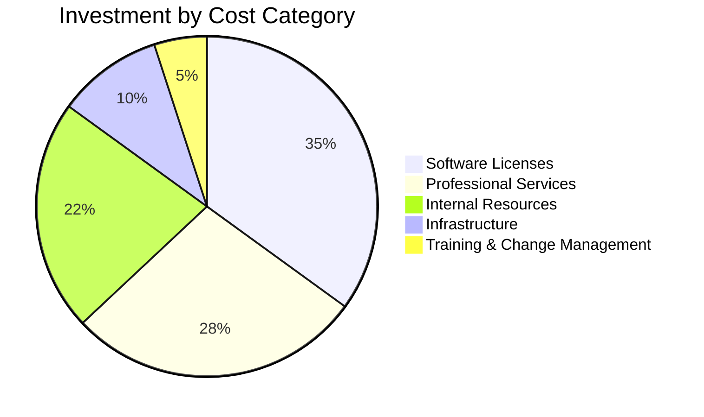
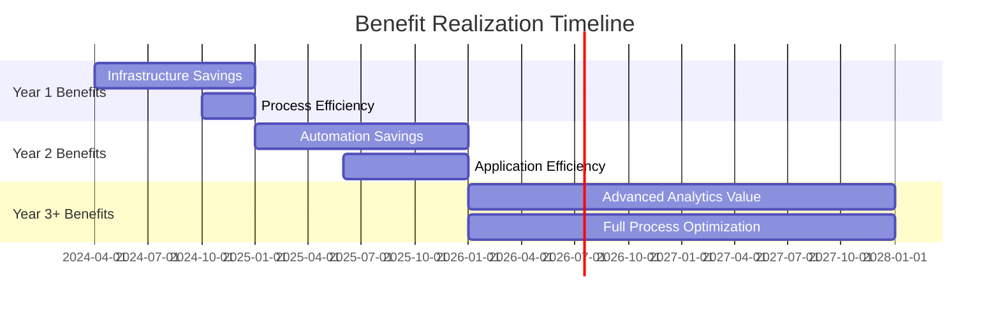
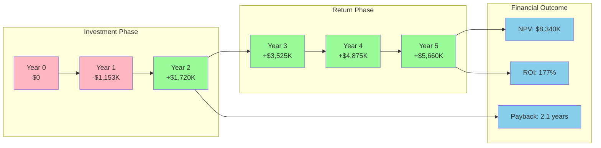
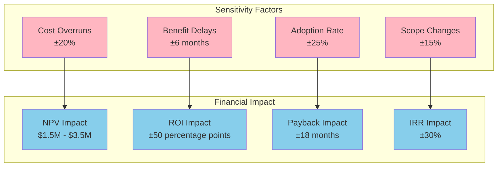
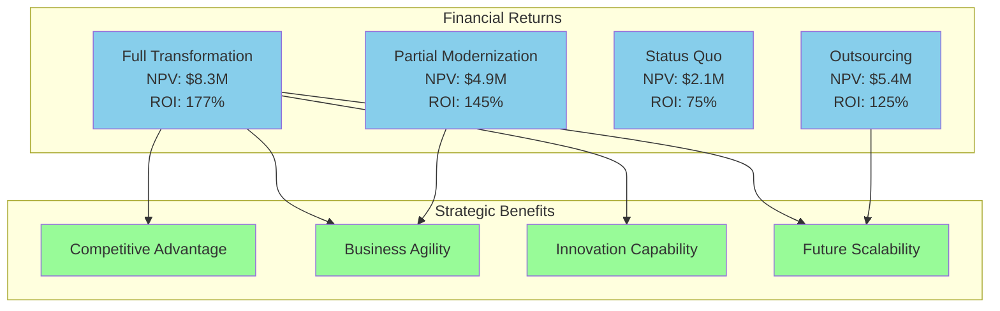
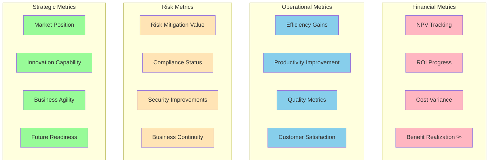

# Cost-Benefit Analysis

## Document Information
- **Document Title:** Cost-Benefit Analysis
- **Document Version:** 1.0
- **Document Date:** September 19, 2025
- **Document Owner:** Financial Planning Office
- **Approved By:** Chief Financial Officer
- **Review Frequency:** Quarterly
- **Next Review:** December 19, 2025

## Executive Summary

This document provides a comprehensive cost-benefit analysis for the digital transformation initiative, quantifying all investments, operational impacts, and expected returns to demonstrate financial viability and support informed decision-making.

### Key Points
- **Total Investment:** $4,720,000 over 32 months
- **Expected 5-Year NPV:** $8,340,000
- **ROI:** 177% over 5 years
- **Payback Period:** 2.1 years
- **IRR:** 68%

### Recommendations Summary
- Proceed with full transformation initiative based on strong financial returns
- Prioritize Package 8 (Process Automation) for fastest payback
- Monitor Package 1 (Infrastructure) for cost optimization opportunities
- Implement benefit realization tracking from project start

## Purpose and Scope

### Document Purpose
Provide comprehensive financial analysis of the digital transformation initiative, quantifying costs, benefits, and returns to support investment decisions and establish baseline for ongoing benefit realization tracking.

### Scope
**In Scope:**
- All direct implementation costs across 8 packages
- Operational cost changes and savings
- Revenue impacts and business value creation
- Productivity improvements and efficiency gains
- Risk mitigation value and compliance benefits
- Technology refresh and maintenance cost avoidance

**Out of Scope:**
- Market opportunity costs and competitive positioning
- Intangible benefits not quantifiable in financial terms
- Individual team compensation and HR costs
- Facility and real estate related costs
- Legal and regulatory cost changes beyond compliance

### Objectives
1. Quantify total cost of ownership for the transformation initiative
2. Identify and value all measurable benefits and returns
3. Perform comprehensive financial analysis including NPV, ROI, and IRR
4. Establish benefit realization tracking framework
5. Support investment decision-making with financial evidence

### Success Criteria
- Clear financial justification for transformation investment
- Detailed cost and benefit breakdown by package and timeline
- Risk-adjusted financial projections with sensitivity analysis
- Benefit realization tracking plan with KPIs and milestones

## Investment Analysis

### Total Cost Breakdown by Package

| Package | Year 1 | Year 2 | Year 3 | Total Investment | % of Total |
|---------|--------|--------|--------|------------------|------------|
| Package 1: Infrastructure | $450,000 | $0 | $0 | $450,000 | 9.5% |
| Package 2: Security & Identity | $320,000 | $0 | $0 | $320,000 | 6.8% |
| Package 3: Integration Platform | $520,000 | $0 | $0 | $520,000 | 11.0% |
| Package 4: Data Platform | $680,000 | $0 | $0 | $680,000 | 14.4% |
| Package 5: Core Applications | $600,000 | $600,000 | $0 | $1,200,000 | 25.4% |
| Package 6: Analytics & BI | $0 | $420,000 | $0 | $420,000 | 8.9% |
| Package 7: Advanced Analytics | $0 | $375,000 | $375,000 | $750,000 | 15.9% |
| Package 8: Process Automation | $0 | $190,000 | $190,000 | $380,000 | 8.0% |
| **Total** | **$2,570,000** | **$1,585,000** | **$565,000** | **$4,720,000** | **100%** |

### Investment Timeline Visualization


### Cost Category Breakdown


## Operational Cost Impact

### Annual Operational Cost Changes

| Cost Category | Current Annual | Future Annual | Annual Savings | 5-Year Savings |
|---------------|----------------|---------------|----------------|----------------|
| IT Infrastructure | $850,000 | $520,000 | $330,000 | $1,650,000 |
| Software Licensing | $720,000 | $890,000 | ($170,000) | ($850,000) |
| IT Support & Maintenance | $640,000 | $380,000 | $260,000 | $1,300,000 |
| Manual Processing | $980,000 | $490,000 | $490,000 | $2,450,000 |
| Compliance & Audit | $320,000 | $180,000 | $140,000 | $700,000 |
| Data Management | $450,000 | $220,000 | $230,000 | $1,150,000 |
| Security Operations | $380,000 | $280,000 | $100,000 | $500,000 |
| Backup & Recovery | $190,000 | $95,000 | $95,000 | $475,000 |
| **Total** | **$4,530,000** | **$3,055,000** | **$1,475,000** | **$7,375,000** |

### Operational Impact Analysis
```mermaid
graph TB
    subgraph "Current State Costs"
        CURRENT_INFRA[Infrastructure: $850K]
        CURRENT_LICENSE[Licensing: $720K]
        CURRENT_SUPPORT[Support: $640K]
        CURRENT_MANUAL[Manual Processes: $980K]
        CURRENT_COMPLIANCE[Compliance: $320K]
        CURRENT_DATA[Data Management: $450K]
        CURRENT_SECURITY[Security: $380K]
        CURRENT_BACKUP[Backup: $190K]
    end
    
    subgraph "Future State Costs"
        FUTURE_INFRA[Infrastructure: $520K]
        FUTURE_LICENSE[Licensing: $890K]
        FUTURE_SUPPORT[Support: $380K]
        FUTURE_MANUAL[Manual Processes: $490K]
        FUTURE_COMPLIANCE[Compliance: $180K]
        FUTURE_DATA[Data Management: $220K]
        FUTURE_SECURITY[Security: $280K]
        FUTURE_BACKUP[Backup: $95K]
    end
    
    subgraph "Annual Savings"
        INFRA_SAVINGS[$330K Saved]
        LICENSE_INCREASE[($170K) Increase]
        SUPPORT_SAVINGS[$260K Saved]
        MANUAL_SAVINGS[$490K Saved]
        COMPLIANCE_SAVINGS[$140K Saved]
        DATA_SAVINGS[$230K Saved]
        SECURITY_SAVINGS[$100K Saved]
        BACKUP_SAVINGS[$95K Saved]
    end
    
    CURRENT_INFRA --> FUTURE_INFRA
    CURRENT_LICENSE --> FUTURE_LICENSE
    CURRENT_SUPPORT --> FUTURE_SUPPORT
    CURRENT_MANUAL --> FUTURE_MANUAL
    
    FUTURE_INFRA --> INFRA_SAVINGS
    FUTURE_LICENSE --> LICENSE_INCREASE
    FUTURE_SUPPORT --> SUPPORT_SAVINGS
    FUTURE_MANUAL --> MANUAL_SAVINGS
    
    classDef current fill:#FFB6C1
    classDef future fill:#87CEEB
    classDef savings fill:#98FB98
    classDef increase fill:#FF6B6B
    
    class CURRENT_INFRA,CURRENT_LICENSE,CURRENT_SUPPORT,CURRENT_MANUAL,CURRENT_COMPLIANCE,CURRENT_DATA,CURRENT_SECURITY,CURRENT_BACKUP current
    class FUTURE_INFRA,FUTURE_LICENSE,FUTURE_SUPPORT,FUTURE_MANUAL,FUTURE_COMPLIANCE,FUTURE_DATA,FUTURE_SECURITY,FUTURE_BACKUP future
    class INFRA_SAVINGS,SUPPORT_SAVINGS,MANUAL_SAVINGS,COMPLIANCE_SAVINGS,DATA_SAVINGS,SECURITY_SAVINGS,BACKUP_SAVINGS savings
    class LICENSE_INCREASE increase
```

## Benefit Analysis

### Quantified Benefits by Category

| Benefit Category | Year 1 | Year 2 | Year 3 | Year 4 | Year 5 | Total 5-Year |
|------------------|--------|--------|--------|--------|--------|--------------|
| **Operational Efficiency** | | | | | | |
| Process Automation Savings | $150,000 | $490,000 | $735,000 | $980,000 | $1,225,000 | $3,580,000 |
| Manual Effort Reduction | $245,000 | $490,000 | $490,000 | $490,000 | $490,000 | $2,205,000 |
| Error Reduction Savings | $65,000 | $130,000 | $195,000 | $260,000 | $325,000 | $975,000 |
| **Technology Savings** | | | | | | |
| Infrastructure Cost Reduction | $110,000 | $330,000 | $330,000 | $330,000 | $330,000 | $1,430,000 |
| Maintenance Cost Avoidance | $87,000 | $260,000 | $260,000 | $260,000 | $260,000 | $1,127,000 |
| Legacy System Retirement | $200,000 | $400,000 | $400,000 | $400,000 | $400,000 | $1,800,000 |
| **Business Value** | | | | | | |
| Faster Time-to-Market | $180,000 | $360,000 | $540,000 | $720,000 | $900,000 | $2,700,000 |
| Improved Decision Making | $95,000 | $190,000 | $285,000 | $380,000 | $475,000 | $1,425,000 |
| Enhanced Customer Experience | $125,000 | $250,000 | $375,000 | $500,000 | $625,000 | $1,875,000 |
| **Risk Mitigation** | | | | | | |
| Security Incident Avoidance | $75,000 | $150,000 | $225,000 | $300,000 | $375,000 | $1,125,000 |
| Compliance Cost Avoidance | $47,000 | $140,000 | $140,000 | $140,000 | $140,000 | $607,000 |
| Business Continuity Improvement | $38,000 | $115,000 | $115,000 | $115,000 | $115,000 | $498,000 |
| **Total Annual Benefits** | **$1,417,000** | **$3,305,000** | **$4,090,000** | **$4,875,000** | **$5,660,000** | **$19,347,000** |

### Benefit Realization Timeline


### Productivity Impact Analysis

| Department | Current FTE | Productivity Gain | Effective FTE Gain | Annual Value |
|------------|-------------|-------------------|-------------------|--------------|
| Finance | 45 | 25% | 11.25 | $787,500 |
| HR | 25 | 30% | 7.5 | $450,000 |
| Operations | 85 | 20% | 17.0 | $1,020,000 |
| IT | 35 | 35% | 12.25 | $1,102,500 |
| Sales | 60 | 15% | 9.0 | $720,000 |
| Customer Service | 40 | 40% | 16.0 | $800,000 |
| Procurement | 20 | 25% | 5.0 | $300,000 |
| **Total** | **310** | **25%** | **78** | **$5,180,000** |

## Financial Projections

### 5-Year Financial Summary

| Year | Investment | Benefits | Net Cash Flow | Cumulative | NPV @ 10% |
|------|------------|----------|---------------|------------|-----------|
| 0 | $0 | $0 | $0 | $0 | $0 |
| 1 | $2,570,000 | $1,417,000 | ($1,153,000) | ($1,153,000) | ($1,048,182) |
| 2 | $1,585,000 | $3,305,000 | $1,720,000 | $567,000 | $1,371,901 |
| 3 | $565,000 | $4,090,000 | $3,525,000 | $4,092,000 | $2,222,066 |
| 4 | $0 | $4,875,000 | $4,875,000 | $8,967,000 | $2,561,538 |
| 5 | $0 | $5,660,000 | $5,660,000 | $14,627,000 | $2,232,677 |
| **Total** | **$4,720,000** | **$19,347,000** | **$14,627,000** | | **$8,340,000** |

### Key Financial Metrics
- **Net Present Value (NPV):** $8,340,000
- **Return on Investment (ROI):** 177%
- **Internal Rate of Return (IRR):** 68%
- **Payback Period:** 2.1 years
- **Benefit-Cost Ratio:** 3.1:1

### Cash Flow Analysis


## Sensitivity Analysis

### Risk-Adjusted Scenarios

| Scenario | Investment Variance | Benefit Variance | NPV | ROI | Payback |
|----------|-------------------|------------------|-----|-----|---------|
| **Best Case** | -5% | +20% | $11,870,000 | 225% | 1.8 years |
| **Most Likely** | 0% | 0% | $8,340,000 | 177% | 2.1 years |
| **Conservative** | +10% | -15% | $4,960,000 | 128% | 2.7 years |
| **Worst Case** | +20% | -30% | $1,580,000 | 78% | 3.9 years |

### Sensitivity Impact Analysis


### Break-Even Analysis

| Metric | Break-Even Point | Current Projection | Margin of Safety |
|--------|------------------|-------------------|------------------|
| Benefit Realization | 65% of projected | 100% | 35% margin |
| Cost Overrun Tolerance | 135% of budget | 100% | 35% tolerance |
| Timeline Extension | 18 months delay | On schedule | 18 month buffer |
| Adoption Rate | 60% minimum | 95% expected | 35% margin |

## Comparative Analysis

### Alternative Investment Options

| Option | Investment | 5-Year NPV | ROI | Payback | Risk Level |
|--------|------------|------------|-----|---------|------------|
| **Full Transformation** | $4,720K | $8,340K | 177% | 2.1 years | Medium |
| Partial Modernization | $2,850K | $4,920K | 145% | 2.4 years | Low |
| Status Quo + Maintenance | $1,200K | $2,100K | 75% | 4.2 years | High |
| Outsourcing Alternative | $3,600K | $5,400K | 125% | 2.8 years | Medium |

### Strategic Value Comparison


## Benefit Realization Framework

### Benefit Tracking and Measurement

| Benefit Category | Key Metrics | Measurement Method | Tracking Frequency | Owner |
|------------------|-------------|-------------------|-------------------|--------|
| Operational Efficiency | Process time reduction, error rates | Time studies, error logs | Monthly | Operations Manager |
| Cost Savings | Actual vs. budget spend | Financial reporting | Monthly | Finance Manager |
| Productivity Gains | Output per FTE, task completion | Performance metrics | Monthly | HR Manager |
| Revenue Impact | Revenue per customer, market share | Sales reporting | Quarterly | Sales Manager |
| Customer Satisfaction | NPS, satisfaction scores | Surveys, feedback | Quarterly | Customer Success |
| Security Improvements | Incident reduction, compliance | Security reports | Monthly | Security Manager |

### Benefit Realization Dashboard


### Success Criteria and KPIs

| KPI | Target | Current Baseline | Measurement |
|-----|--------|------------------|-------------|
| Overall ROI | >150% | N/A | Financial analysis |
| Payback Achievement | <2.5 years | N/A | Cash flow analysis |
| Benefit Realization | >90% | N/A | Monthly tracking |
| Cost Variance | <10% | N/A | Budget monitoring |
| Productivity Improvement | >25% | Current state | Performance metrics |
| Customer Satisfaction | >90% | 78% | Quarterly surveys |
| Employee Satisfaction | >85% | 72% | Annual surveys |
| Security Incident Reduction | >50% | Current rate | Security reports |

## Recommendations

### Investment Decision Recommendations
1. **Proceed with Full Transformation:** Strong financial justification with 177% ROI and $8.3M NPV
2. **Prioritize Quick Wins:** Focus on Package 8 (Process Automation) for fastest payback
3. **Establish Benefit Tracking:** Implement comprehensive benefit realization monitoring from day one
4. **Maintain Contingency:** Allocate 15% contingency budget for cost overrun protection

### Risk Mitigation Strategies
1. **Phase Implementation:** Staged approach to reduce financial exposure
2. **Regular Reviews:** Monthly benefit realization reviews with course correction
3. **Alternative Planning:** Maintain scaled-down options for budget constraints
4. **Performance Monitoring:** Real-time tracking of key financial and operational metrics

### Financial Management Framework
1. **Budget Controls:** Strict change control process for cost management
2. **Benefit Governance:** Cross-functional team for benefit realization oversight
3. **Regular Reporting:** Monthly financial dashboard and quarterly business reviews
4. **Value Engineering:** Continuous optimization of cost-benefit ratios

---
**Document Classification:** Internal  
**Document Location:** Enterprise Architecture Repository  
**Related Documents:** Implementation Packages Definition, Risk Assessment, Business Case