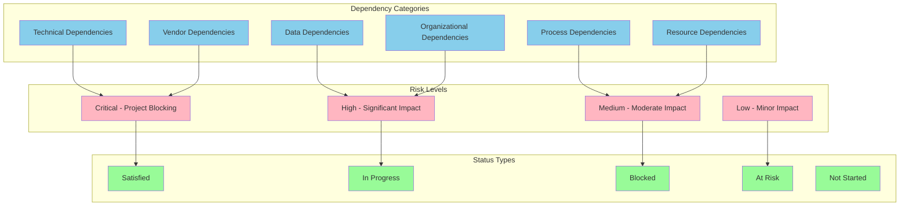
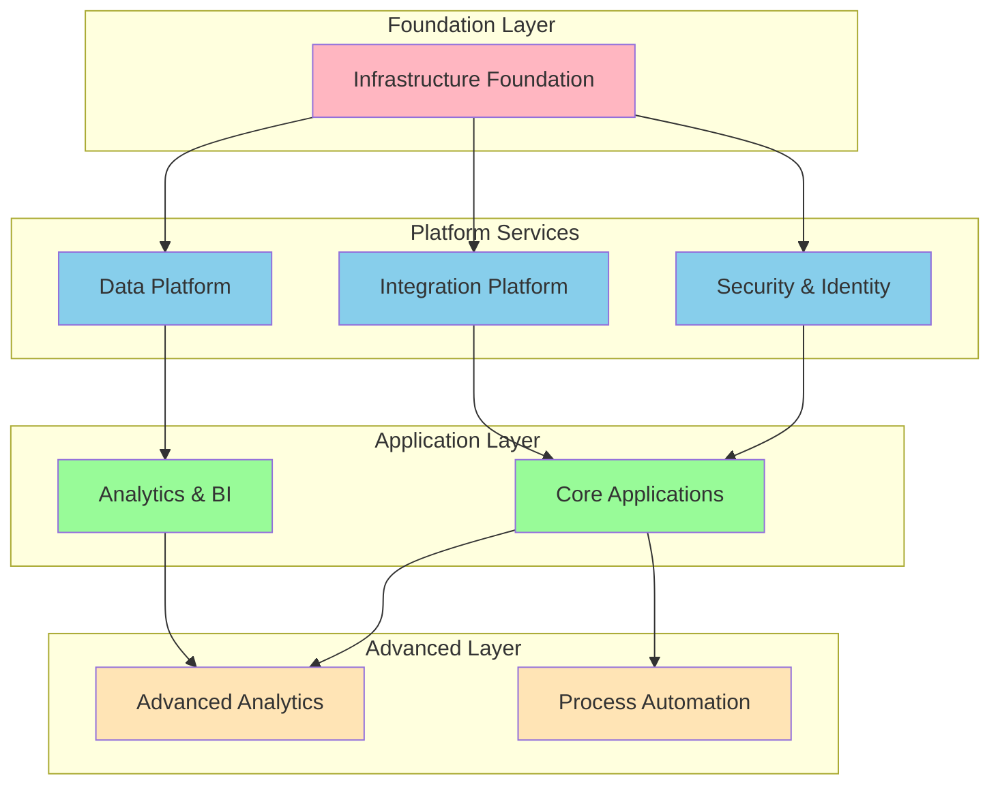
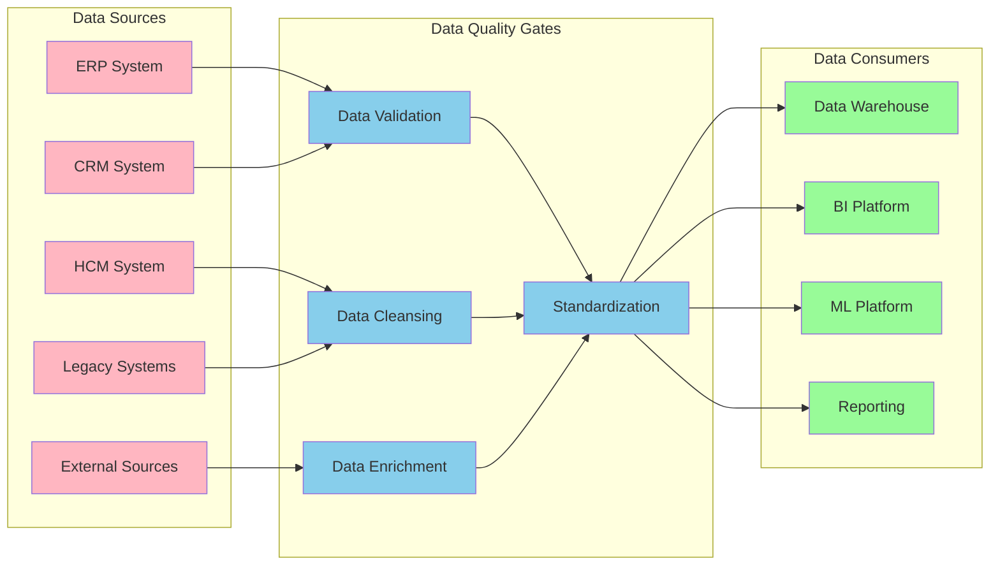
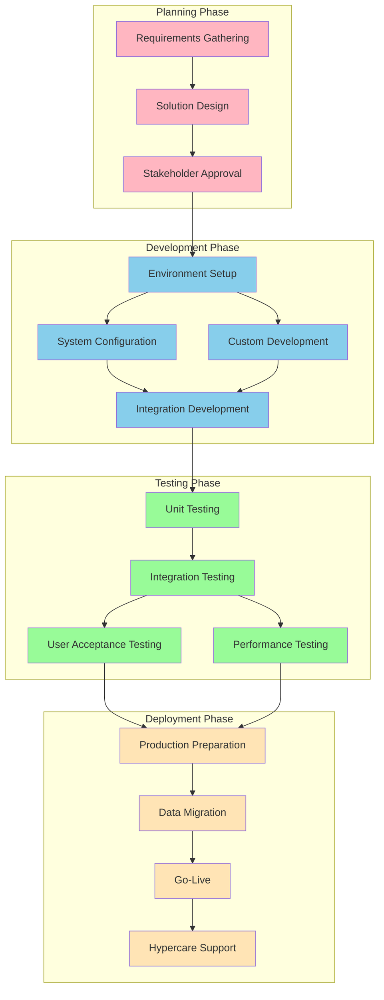
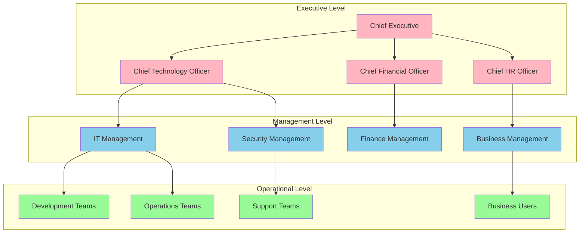
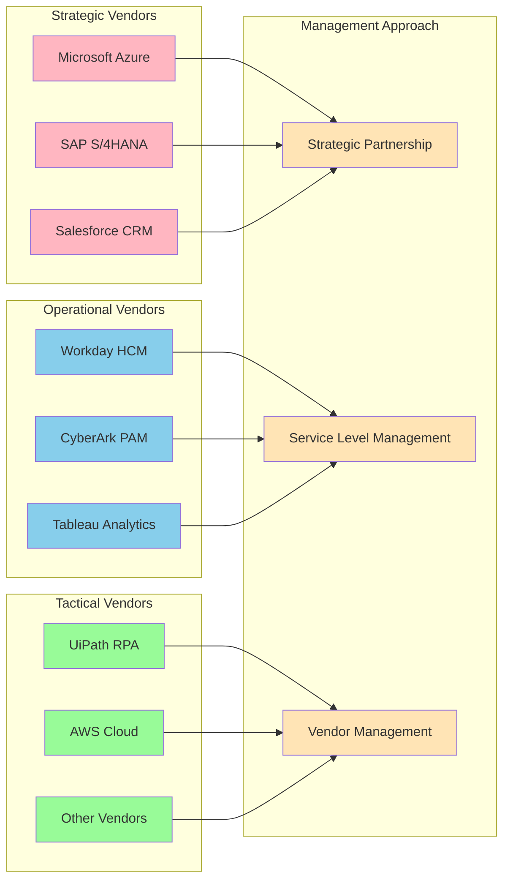
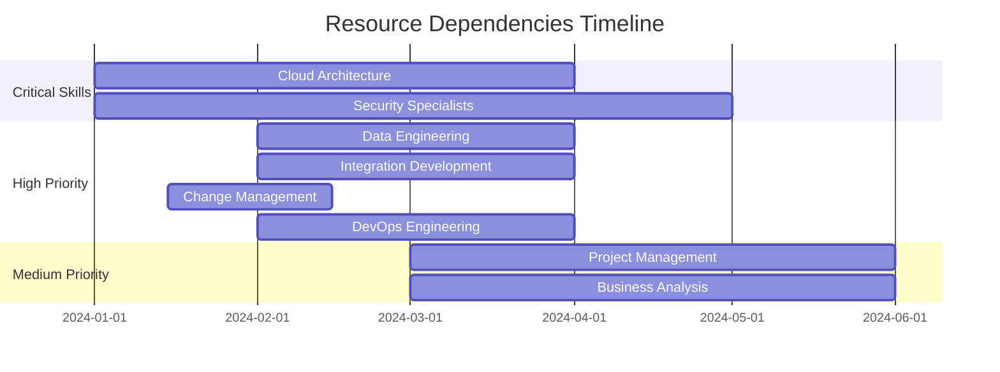
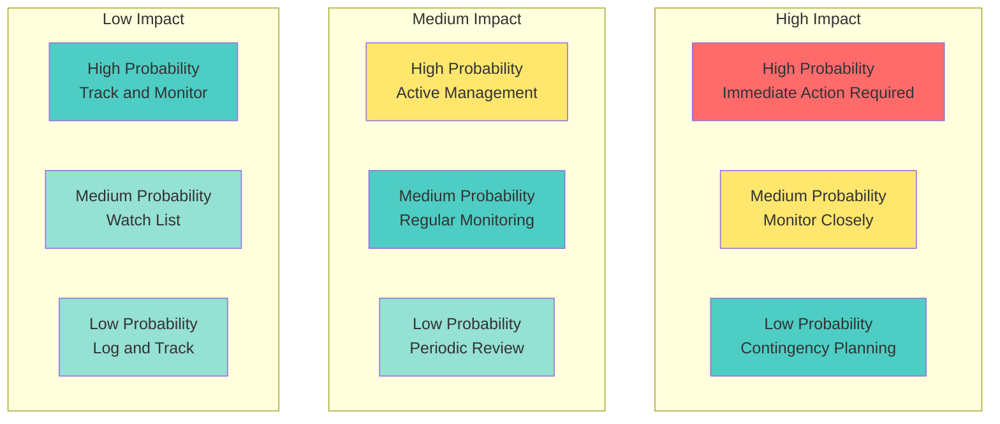

# Dependency Matrix

## Document Information
- **Document Title:** Dependency Matrix
- **Document Version:** 1.0
- **Document Date:** September 19, 2025
- **Document Owner:** Architecture Planning Office
- **Approved By:** Architecture Review Board
- **Review Frequency:** Bi-weekly
- **Next Review:** October 3, 2025

## Executive Summary

This document provides a comprehensive dependency matrix for the digital transformation initiative, mapping all critical dependencies between implementation packages, systems, processes, and organizational elements to ensure successful project execution and risk mitigation.

### Key Points
- 247 total dependencies identified across 8 implementation packages
- 89 critical path dependencies requiring immediate attention
- 34 high-risk dependencies with potential for project delays
- Integrated approach for dependency monitoring and management

### Recommendations Summary
- Implement automated dependency tracking system
- Establish weekly dependency review meetings
- Create escalation procedures for blocked dependencies
- Deploy early warning system for at-risk dependencies

## Purpose and Scope

### Document Purpose
Provide comprehensive mapping of all dependencies across the digital transformation initiative to enable effective planning, risk management, and successful project execution through proactive dependency management.

### Scope
**In Scope:**
- Technical dependencies between systems and platforms
- Data dependencies and information flows
- Process dependencies and sequence requirements
- Organizational dependencies and stakeholder relationships
- Vendor and external dependencies
- Resource and skill dependencies

**Out of Scope:**
- Detailed technical implementation specifications
- Vendor contract negotiations and legal dependencies
- Individual task-level dependencies within packages
- Budget and financial dependencies (covered separately)

### Objectives
1. Identify and catalog all critical dependencies across packages
2. Assess risk levels and potential impact of dependency failures
3. Establish monitoring and management processes for dependencies
4. Enable proactive mitigation of dependency-related risks
5. Support optimized project sequencing and resource allocation

### Success Criteria
- 100% of critical dependencies identified and tracked
- Zero project delays due to unmanaged dependencies
- 95% dependency satisfaction rate throughout implementation
- Effective escalation and resolution of dependency issues

## Dependency Framework

### Dependency Classification System

## Technical Dependencies Matrix

### Infrastructure Dependencies

| Source Package | Target Package | Dependency Description | Type | Risk Level | Current Status | Owner | Target Date |
|----------------|----------------|----------------------|------|------------|----------------|--------|-------------|
| Package 2 (Security) | Package 1 (Infrastructure) | Azure landing zone operational | Technical | Critical | Satisfied | Infrastructure Team | 2024-03-15 |
| Package 3 (Integration) | Package 1 (Infrastructure) | Network connectivity established | Technical | Critical | Satisfied | Infrastructure Team | 2024-03-15 |
| Package 4 (Data Platform) | Package 1 (Infrastructure) | Cloud storage and compute available | Technical | Critical | Satisfied | Infrastructure Team | 2024-03-15 |
| Package 5 (Applications) | Package 2 (Security) | Identity management operational | Technical | Critical | In Progress | Security Team | 2024-06-01 |
| Package 5 (Applications) | Package 3 (Integration) | API gateway and ESB ready | Technical | Critical | In Progress | Integration Team | 2024-06-15 |
| Package 6 (Analytics) | Package 4 (Data Platform) | Data lake and warehouse operational | Technical | Critical | In Progress | Data Team | 2024-07-30 |
| Package 7 (Advanced Analytics) | Package 5 (Applications) | Core applications data available | Technical | High | Not Started | Applications Team | 2024-12-01 |
| Package 7 (Advanced Analytics) | Package 6 (Analytics) | BI platform providing data access | Technical | High | Not Started | BI Team | 2024-10-15 |
| Package 8 (Process Automation) | Package 5 (Applications) | Application APIs available for automation | Technical | High | Not Started | Applications Team | 2024-12-01 |

### Platform Dependencies

## Data Dependencies Matrix

### Data Flow Dependencies

| Data Source | Data Consumer | Data Type | Frequency | Volume | Dependency Risk | Mitigation Strategy |
|-------------|---------------|-----------|-----------|--------|-----------------|-------------------|
| SAP ERP | Data Lake | Transactional Data | Real-time | 10GB/day | High | Backup extraction mechanism |
| Salesforce CRM | Data Warehouse | Customer Data | Hourly | 2GB/day | Medium | API rate limiting management |
| Workday HCM | Analytics Platform | Employee Data | Daily | 500MB/day | Low | Batch processing backup |
| Legacy Systems | Integration Platform | Master Data | Real-time | 5GB/day | Critical | Parallel data feeds |
| External APIs | Data Lake | Market Data | Hourly | 1GB/day | Medium | Data caching strategy |
| IoT Devices | Streaming Platform | Sensor Data | Continuous | 50GB/day | High | Edge processing backup |

### Data Quality Dependencies

## Process Dependencies Matrix

### Business Process Dependencies

| Source Process | Dependent Process | Dependency Type | Business Impact | Risk Level | Mitigation Plan |
|----------------|-------------------|-----------------|-----------------|------------|-----------------|
| User Provisioning | Application Access | Sequential | High | Critical | Automated provisioning |
| Data Migration | Application Testing | Sequential | Critical | Critical | Parallel migration strategy |
| Security Configuration | System Deployment | Prerequisite | Critical | High | Security baseline templates |
| Integration Testing | Go-Live Activities | Quality Gate | High | High | Comprehensive test automation |
| Training Delivery | User Adoption | Enablement | Medium | Medium | Just-in-time training |
| Backup Configuration | System Operation | Operational | High | High | Automated backup validation |

### Process Flow Dependencies

## Organizational Dependencies Matrix

### Stakeholder Dependencies

| Stakeholder Group | Dependent Activity | Dependency Type | Urgency | Complexity | Management Strategy |
|-------------------|-------------------|-----------------|---------|------------|-------------------|
| Executive Leadership | Strategic Approval | Decision | High | Low | Regular executive briefings |
| Business Units | Requirements Validation | Input | High | Medium | Dedicated business liaisons |
| IT Operations | Infrastructure Support | Service | Critical | Medium | SLA-based service agreements |
| Security Team | Compliance Validation | Approval | Critical | High | Embedded security reviewers |
| Legal Department | Contract Approvals | Legal | Medium | High | Early legal engagement |
| HR Department | Change Management | Support | Medium | Medium | Change champion network |
| Finance Department | Budget Approvals | Financial | High | Low | Monthly budget reviews |
| Procurement | Vendor Management | Service | Medium | Medium | Vendor relationship managers |

### Organizational Structure Dependencies

## Vendor Dependencies Matrix

### Critical Vendor Dependencies

| Vendor | Service/Product | Dependency Type | Risk Level | Contract Status | Backup Strategy |
|--------|-----------------|-----------------|------------|-----------------|-----------------|
| Microsoft | Azure Cloud Platform | Infrastructure | Critical | Active | Multi-cloud strategy |
| SAP | S/4HANA Platform | Application | Critical | Active | Alternative ERP evaluation |
| Salesforce | CRM Platform | Application | High | Active | CRM data portability |
| Workday | HCM Platform | Application | High | Active | HR data backup |
| CyberArk | Privileged Access Management | Security | High | Renewal Pending | PAM alternatives identified |
| UiPath | RPA Platform | Automation | Medium | Active | Power Automate backup |
| Tableau | Analytics Platform | Analytics | Medium | Active | Power BI primary platform |
| AWS | Secondary Cloud | Infrastructure | Medium | Active | Azure primary platform |

### Vendor Relationship Management

## Resource Dependencies Matrix

### Skill Dependencies

| Required Skill | Current Availability | Gap | Criticality | Acquisition Strategy | Timeline |
|----------------|---------------------|-----|-------------|-------------------|----------|
| Cloud Architecture | 2 FTE | 3 FTE | Critical | External hiring + training | 3 months |
| Data Engineering | 3 FTE | 4 FTE | High | Contractor supplement | 2 months |
| Security Specialist | 1 FTE | 2 FTE | Critical | External hiring | 4 months |
| Integration Developer | 4 FTE | 2 FTE | High | Internal training | 2 months |
| Change Management | 1 FTE | 3 FTE | High | External consultants | 1 month |
| Project Management | 2 FTE | 1 FTE | Medium | Internal development | 3 months |
| Business Analysis | 3 FTE | 2 FTE | Medium | Training + hiring | 3 months |
| DevOps Engineering | 2 FTE | 3 FTE | High | External hiring | 2 months |

### Resource Allocation Timeline

## Risk Assessment and Mitigation

### Critical Path Dependencies
| Dependency ID | Description | Impact if Failed | Probability | Mitigation Strategy | Owner |
|---------------|-------------|------------------|-------------|-------------------|--------|
| DEP-001 | Azure landing zone readiness | Project delay 6-8 weeks | Low | Parallel Azure/AWS setup | Infrastructure Lead |
| DEP-002 | SAP S/4HANA data migration | Business disruption | Medium | Phased migration approach | ERP Lead |
| DEP-003 | Security compliance approval | Cannot go-live | High | Early security engagement | Security Lead |
| DEP-004 | Integration platform stability | System failures | Medium | Extensive testing protocol | Integration Lead |
| DEP-005 | Change management readiness | User adoption failure | High | Comprehensive training plan | Change Lead |

### Dependency Risk Heatmap

## Monitoring and Management

### Dependency Tracking Dashboard
- **Overall Dependency Health:** 78% (194 of 247 dependencies satisfied)
- **Critical Dependencies Status:** 89% (79 of 89 critical dependencies on track)
- **At-Risk Dependencies:** 15 dependencies requiring immediate attention
- **Blocked Dependencies:** 3 dependencies with active blocks

### Weekly Dependency Review Process
1. **Monday:** Dependency status collection from all package leads
2. **Tuesday:** Risk assessment and impact analysis
3. **Wednesday:** Mitigation strategy development
4. **Thursday:** Stakeholder communication and escalation
5. **Friday:** Action plan finalization and tracking update

### Escalation Matrix
| Risk Level | Initial Response | Escalation Level 1 | Escalation Level 2 | Escalation Level 3 |
|------------|------------------|-------------------|-------------------|-------------------|
| Critical | Immediate (2 hours) | Package Lead (4 hours) | Program Manager (8 hours) | Executive Sponsor (24 hours) |
| High | Same day | Package Lead (1 day) | Program Manager (2 days) | Executive Team (1 week) |
| Medium | 2 business days | Package Lead (3 days) | Program Manager (1 week) | Monthly review |
| Low | 1 week | Package Lead (2 weeks) | Quarterly review | Annual review |

## Success Metrics

### Key Performance Indicators
- **Dependency Satisfaction Rate:** Target 95%, Current 78%
- **Critical Path Adherence:** Target 100%, Current 89%
- **Escalation Response Time:** Target <4 hours, Current 6 hours
- **Risk Mitigation Effectiveness:** Target 90%, Current 85%

### Monthly Reporting
- Dependency status summary and trends
- Risk assessment and mitigation updates
- Resource allocation and skill gap analysis
- Vendor performance and relationship status
- Organizational readiness and change progress

---
**Document Classification:** Internal  
**Document Location:** Enterprise Architecture Repository  
**Related Documents:** Implementation Packages Definition, Risk Assessment, Project Charter