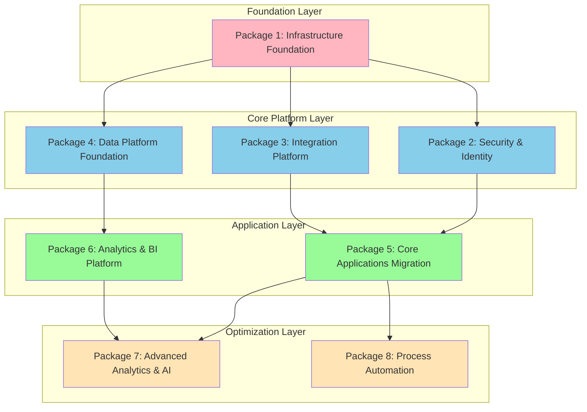
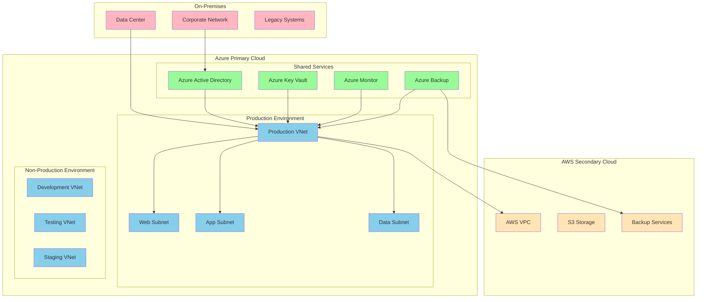
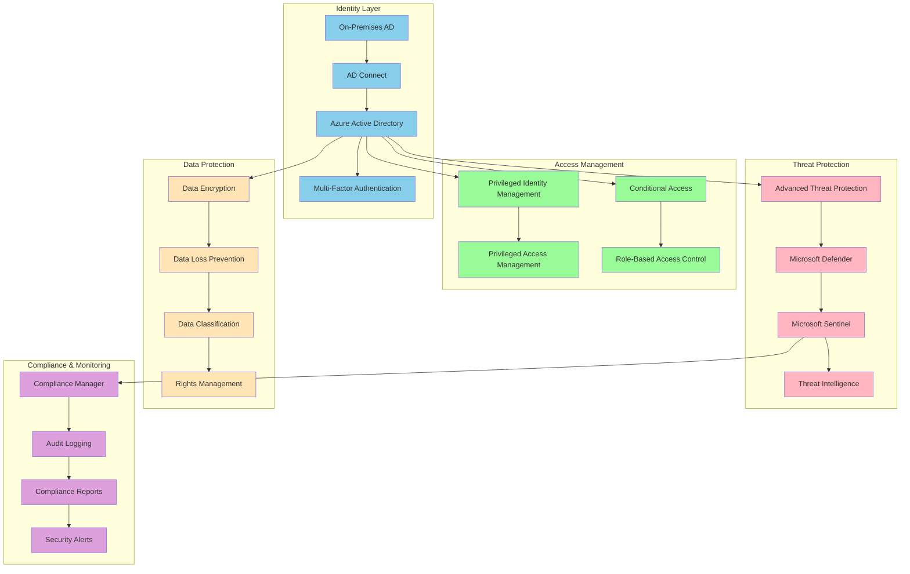
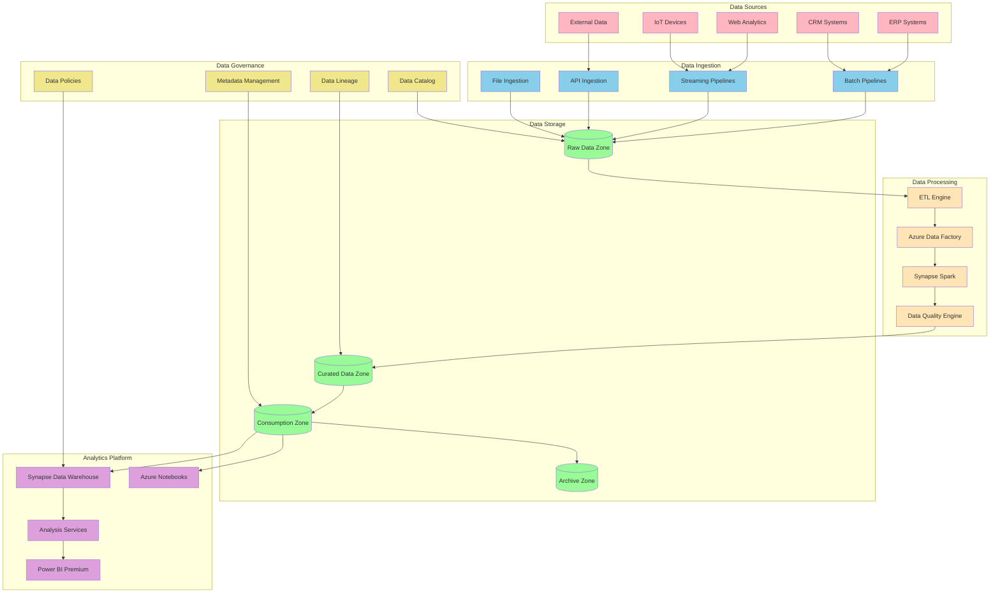
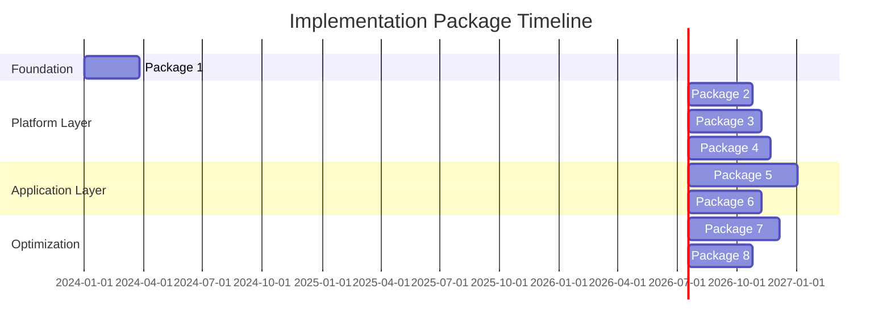

```mermaid
graph TB
    subgraph "External Systems"
        PARTNERS[Partner Systems]
        THIRD_PARTY[Third Party APIs]
        MOBILE_APPS[Mobile Applications]
        WEB_APPS[Web Applications]
    end
    
    subgraph "API Management Layer"
        API_GATEWAY[API Gateway]
        DEV_PORTAL[Developer Portal]
        API_ANALYTICS[API Analytics]
        RATE_LIMITING[Rate Limiting]
    end
    
    subgraph "Integration Services"
        ESB[Enterprise Service Bus]
        MESSAGE_QUEUE[Message Queue]
        EVENT_STREAM[Event Streaming]
        ADAPTERS[Legacy Adapters]
    end
    
    subgraph "Backend Applications"
        ERP[ERP System]
        CRM[CRM System]
        HCM[HCM System]
        CUSTOM_APPS[Custom Applications]
    end
    
    subgraph "Data Services"
        DATABASE[(Databases)]
        DATA_LAKE[(Data Lake)]
        CACHE[(Cache Layer)]
        FILES[(File Systems)]
    end
    
    subgraph "Monitoring & Security"
        MONITORING[Integration Monitoring]
        SECURITY[API Security]
        LOGGING[Centralized Logging]
        ALERTS[Alert Management]
    end
    
    PARTNERS --> API_GATEWAY
    THIRD_PARTY --> API_GATEWAY
    MOBILE_APPS --> API_GATEWAY
    WEB_APPS --> API_GATEWAY
    
    API_GATEWAY --> DEV_PORTAL
    API_GATEWAY --> API_ANALYTICS
    API_GATEWAY --> RATE_LIMITING
    
    API_GATEWAY --> ESB
    API_GATEWAY --> MESSAGE_QUEUE
    API_GATEWAY --> EVENT_STREAM
    
    ESB --> ERP
    ESB --> CRM
    MESSAGE_QUEUE --> HCM
    EVENT_STREAM --> CUSTOM_APPS
    ADAPTERS --> ERP
    
    ESB --> DATABASE
    MESSAGE_QUEUE --> DATA_LAKE
    EVENT_STREAM --> CACHE
    ADAPTERS --> FILES
    
    MONITORING --> API_GATEWAY
    SECURITY --> API_GATEWAY
    LOGGING --> ESB
    ALERTS --> MONITORING
    
    classDef external fill:#FFB6C1
    classDef api fill:#87CEEB
    classDef integration fill:#98FB98
    classDef backend fill:#FFE4B5
    classDef data fill:#DDA0DD
    classDef monitoring fill:#F0E68C
    
    class PARTNERS,THIRD_PARTY,MOBILE_APPS,WEB_APPS external
    class API_GATEWAY,DEV_PORTAL,API_ANALYTICS,RATE_LIMITING api
    class ESB,MESSAGE_QUEUE,EVENT_STREAM,ADAPTERS integration
    class ERP,CRM,HCM,CUSTOM_APPS backend
    class DATABASE,DATA_LAKE,CACHE,FILES data
    class MONITORING,SECURITY,LOGGING,ALERTS monitoring
```

# Implementation Packages Definition

## Document Information
- **Document Title:** Implementation Packages Definition
- **Document Version:** 1.0
- **Document Date:** September 19, 2025
- **Document Owner:** Implementation Planning Team
- **Approved By:** Architecture Review Board
- **Review Frequency:** Monthly
- **Next Review:** October 19, 2025

## Executive Summary

This document defines comprehensive implementation packages for the digital transformation initiative, organizing the transformation into manageable, cohesive units that can be planned, executed, and delivered independently while maintaining overall architecture coherence and business value delivery.

### Key Points
- 8 primary implementation packages covering all transformation domains
- Clearly defined scope, dependencies, and success criteria for each package
- Integrated approach ensuring seamless handoffs between packages
- Risk-based prioritization with early value delivery focus

### Recommendations Summary
- Execute Package 1 (Foundation) first to establish core capabilities
- Run Packages 2-4 in parallel after foundation completion
- Implement Package 5-6 sequentially due to data dependencies
- Deploy Packages 7-8 as optimization and enhancement initiatives

## Purpose and Scope

### Document Purpose
Define discrete implementation packages that organize the digital transformation into manageable units of work, each delivering specific business value while maintaining architectural integrity and enabling progressive transformation execution.

### Scope
**In Scope:**
- Package definition and scope boundaries
- Dependencies and integration points between packages
- Resource requirements and timeline estimates
- Risk assessment and mitigation strategies
- Success criteria and acceptance criteria

**Out of Scope:**
- Detailed project plans and work breakdown structures
- Vendor selection and procurement processes
- Specific technology implementation details
- Individual team assignments and resource allocation

### Objectives
1. Define manageable implementation units with clear scope and boundaries
2. Establish dependencies and sequencing for optimal delivery
3. Enable parallel execution where possible to accelerate transformation
4. Provide clear success criteria and measurement approaches
5. Support risk management through package-level risk assessment

### Success Criteria
- All packages have clearly defined scope and success criteria
- Dependencies are identified and managed effectively
- 80% of packages can be executed in parallel
- Each package delivers measurable business value

## Implementation Package Overview

### Package Structure Framework

## Package Definitions

### Package 1: Infrastructure Foundation

#### Package Overview
Establish core cloud infrastructure, networking, and foundational services required to support all subsequent transformation activities.

#### Scope Definition
**Included Components:**
- Cloud landing zone setup (Azure primary, AWS secondary)
- Network architecture and connectivity
- Basic security controls and monitoring
- Core DevOps toolchain and CI/CD pipelines
- Disaster recovery and backup infrastructure
- Compliance and governance frameworks

**Excluded Components:**
- Application-specific infrastructure
- Advanced security services
- Business application deployments
- Data warehousing and analytics platforms

#### Business Value
- **Primary:** Establish scalable, secure foundation for transformation
- **Secondary:** Reduce operational overhead and increase reliability
- **Metrics:** Infrastructure availability (99.9%), deployment velocity (50% faster)

#### Technical Architecture

#### Implementation Details
- **Duration:** 12 weeks
- **Team Size:** 8 people (2 cloud architects, 3 infrastructure engineers, 1 security specialist, 2 DevOps engineers)
- **Budget:** $450,000
- **Key Milestones:** 
  - Week 4: Cloud landing zones configured
  - Week 8: Network connectivity established
  - Week 12: All environments operational

#### Dependencies
- **Prerequisites:** Cloud provider contracts and access
- **External Dependencies:** Network provider for connectivity
- **Internal Dependencies:** Security policy approvals

#### Risk Assessment
| Risk | Probability | Impact | Mitigation Strategy |
|------|-------------|--------|-------------------|
| Cloud provider outages | Medium | High | Multi-cloud strategy with failover |
| Network connectivity delays | High | Medium | Early engagement with providers |
| Security approval delays | Medium | Medium | Parallel security review process |

#### Success Criteria
- 99.9% infrastructure availability achieved
- All environments provisioned and operational
- Network connectivity <50ms latency
- Security compliance validated
- CI/CD pipelines operational with <10 minute builds

### Package 2: Security & Identity

#### Package Overview
Implement comprehensive security architecture including identity management, access controls, threat protection, and compliance monitoring.

#### Scope Definition
**Included Components:**
- Azure Active Directory configuration and integration
- Multi-factor authentication deployment
- Privileged access management (CyberArk)
- Security monitoring and SIEM (Microsoft Sentinel)
- Data protection and classification
- Compliance monitoring and reporting

**Excluded Components:**
- Application-specific security configurations
- Legacy system security upgrades
- Physical security measures
- Third-party security assessments

#### Business Value
- **Primary:** Establish enterprise-grade security posture
- **Secondary:** Enable compliance and reduce security risks
- **Metrics:** Zero security incidents, 100% compliance rating

#### Technical Architecture

#### Implementation Details
- **Duration:** 14 weeks
- **Team Size:** 6 people (1 security architect, 2 identity specialists, 2 security engineers, 1 compliance specialist)
- **Budget:** $320,000
- **Key Milestones:**
  - Week 4: Azure AD integration complete
  - Week 8: MFA and conditional access deployed
  - Week 12: SIEM operational
  - Week 14: Compliance monitoring active

#### Dependencies
- **Prerequisites:** Package 1 (Infrastructure Foundation) completion
- **External Dependencies:** Security vendor contracts
- **Internal Dependencies:** HR systems for identity data

#### Success Criteria
- 100% user authentication through Azure AD
- MFA enabled for all privileged accounts
- <5 minute incident detection time
- Zero data breaches or compliance violations
- 95% user satisfaction with authentication experience

### Package 3: Integration Platform

#### Package Overview
Deploy enterprise integration platform enabling seamless connectivity between applications, services, and external systems.

#### Scope Definition
**Included Components:**
- API Gateway deployment and configuration
- Enterprise Service Bus (ESB) implementation
- Message queuing and event streaming
- Integration monitoring and analytics
- API developer portal
- Legacy system adapters

**Excluded Components:**
- Application-specific integrations
- Data warehouse ETL processes
- Real-time analytics pipelines
- Custom integration development

#### Business Value
- **Primary:** Enable seamless system integration and data flow
- **Secondary:** Reduce integration complexity and maintenance overhead
- **Metrics:** 99.9% integration availability, 50% faster integration delivery

#### Technical Architecture

#### Implementation Details
- **Duration:** 16 weeks
- **Team Size:** 10 people (2 integration architects, 4 integration developers, 2 API specialists, 2 testing engineers)
- **Budget:** $520,000
- **Key Milestones:**
  - Week 6: API Gateway operational
  - Week 10: ESB and messaging deployed
  - Week 14: Legacy adapters complete
  - Week 16: Developer portal live

#### Dependencies
- **Prerequisites:** Package 1 (Infrastructure) and Package 2 (Security) completion
- **External Dependencies:** Legacy system documentation and access
- **Internal Dependencies:** Application team coordination

#### Success Criteria
- 99.9% API gateway availability
- <100ms average API response time
- 100% legacy systems integrated
- Developer portal adoption by 90% of developers
- Zero integration-related business disruptions

### Package 4: Data Platform Foundation

#### Package Overview
Establish modern data platform with data lake, data warehouse, and analytics capabilities supporting both operational and analytical workloads.

#### Scope Definition
**Included Components:**
- Azure Data Lake Storage implementation
- Azure Synapse Analytics deployment
- Data ingestion pipelines (batch and streaming)
- Data governance and cataloging
- Basic analytics and reporting capabilities
- Data quality and monitoring frameworks

**Excluded Components:**
- Advanced machine learning platforms
- Real-time analytics dashboards
- Self-service analytics tools
- Complex data science workflows

#### Business Value
- **Primary:** Enable data-driven decision making and analytics
- **Secondary:** Consolidate data sources and improve data quality
- **Metrics:** 50% faster report generation, 90% data quality score

#### Technical Architecture

#### Implementation Details
- **Duration:** 18 weeks
- **Team Size:** 12 people (2 data architects, 4 data engineers, 2 BI developers, 2 data analysts, 2 governance specialists)
- **Budget:** $680,000
- **Key Milestones:**
  - Week 6: Data lake infrastructure ready
  - Week 10: Initial data ingestion operational
  - Week 14: Data warehouse deployment complete
  - Week 18: Analytics platform operational

#### Dependencies
- **Prerequisites:** Package 1 (Infrastructure) and Package 3 (Integration) completion
- **External Dependencies:** Data source system access and APIs
- **Internal Dependencies:** Data governance policies and procedures

#### Success Criteria
- 99.5% data platform availability
- <2 hour data freshness for critical datasets
- 90% data quality score across all sources
- 100% compliance with data governance policies
- 50% reduction in report generation time

### Package 5: Core Applications Migration

#### Package Overview
Migrate and modernize core business applications including ERP, CRM, and HCM systems to cloud-native platforms.

#### Scope Definition
**Included Components:**
- SAP S/4HANA Cloud migration
- Salesforce platform optimization
- Workday HCM enhancement
- Legacy application retirement
- Application integration updates
- User training and change management

**Excluded Components:**
- Custom application development
- Advanced analytics applications
- Mobile application development
- Third-party application integrations

#### Business Value
- **Primary:** Modernize core business capabilities and improve efficiency
- **Secondary:** Reduce maintenance costs and improve scalability
- **Metrics:** 40% faster business processes, 30% cost reduction

#### Implementation Details
- **Duration:** 24 weeks
- **Team Size:** 18 people (3 application architects, 6 migration specialists, 4 functional consultants, 3 change managers, 2 testing engineers)
- **Budget:** $1,200,000
- **Key Milestones:**
  - Week 8: SAP S/4HANA migration complete
  - Week 16: Salesforce optimization finished
  - Week 20: Workday enhancements deployed
  - Week 24: Legacy applications retired

#### Dependencies
- **Prerequisites:** Package 2 (Security), Package 3 (Integration) completion
- **External Dependencies:** Vendor support and licensing
- **Internal Dependencies:** Business process documentation and training

#### Success Criteria
- 100% business process functionality maintained
- <2 hours system downtime during migration
- 95% user adoption within 30 days
- 99.9% system availability post-migration
- Zero data loss during migration

### Package 6: Analytics & BI Platform

#### Package Overview
Deploy comprehensive business intelligence and analytics platform enabling self-service analytics and advanced reporting capabilities.

#### Scope Definition
**Included Components:**
- Power BI Premium deployment and configuration
- Tableau Cloud migration and optimization
- Self-service analytics capabilities
- Advanced reporting and dashboards
- Data visualization and storytelling tools
- Analytics governance and security

**Excluded Components:**
- Machine learning and AI capabilities
- Real-time streaming analytics
- Predictive analytics models
- Custom analytics applications

#### Implementation Details
- **Duration:** 16 weeks
- **Team Size:** 8 people (1 BI architect, 3 BI developers, 2 data visualization specialists, 2 training specialists)
- **Budget:** $420,000
- **Key Milestones:**
  - Week 6: Power BI Premium operational
  - Week 10: Tableau Cloud migration complete
  - Week 14: Self-service capabilities deployed
  - Week 16: User training completed

#### Dependencies
- **Prerequisites:** Package 4 (Data Platform) completion
- **External Dependencies:** BI tool licensing and support
- **Internal Dependencies:** Business requirements and user training

#### Success Criteria
- 200+ active Power BI users within 30 days
- 90% user satisfaction with analytics tools
- 60% reduction in manual reporting effort
- 100% critical reports migrated and operational
- <5 second dashboard load times

### Package 7: Advanced Analytics & AI

#### Package Overview
Implement advanced analytics and artificial intelligence capabilities including machine learning platforms and predictive analytics.

#### Scope Definition
**Included Components:**
- Azure Machine Learning platform deployment
- Predictive analytics model development
- AI-powered business insights
- Automated decision-making capabilities
- Advanced data science workflows
- AI governance and ethics framework

#### Implementation Details
- **Duration:** 20 weeks
- **Team Size:** 10 people (2 data scientists, 2 ML engineers, 2 AI specialists, 2 platform engineers, 2 business analysts)
- **Budget:** $750,000

#### Dependencies
- **Prerequisites:** Package 5 (Applications) and Package 6 (Analytics) completion
- **External Dependencies:** AI/ML platform licensing
- **Internal Dependencies:** Data science team training and hiring

#### Success Criteria
- 5+ production ML models deployed
- 25% improvement in prediction accuracy
- 30% automation of manual decision processes
- 95% model performance monitoring coverage
- 100% AI governance compliance

### Package 8: Process Automation

#### Package Overview
Deploy robotic process automation (RPA) and business process automation capabilities to streamline operations and reduce manual effort.

#### Scope Definition
**Included Components:**
- Microsoft Power Automate deployment
- UiPath RPA platform implementation
- Process mining and optimization
- Workflow automation design
- Bot development and deployment
- Automation governance framework

#### Implementation Details
- **Duration:** 14 weeks
- **Team Size:** 8 people (1 automation architect, 3 RPA developers, 2 process analysts, 2 business analysts)
- **Budget:** $380,000

#### Dependencies
- **Prerequisites:** Package 5 (Applications) completion
- **External Dependencies:** RPA platform licensing
- **Internal Dependencies:** Process documentation and optimization

#### Success Criteria
- 20+ automated processes deployed
- 50% reduction in manual processing time
- 95% automation success rate
- 80% employee satisfaction with automation
- $500K annual cost savings achieved

## Implementation Approach

### Package Sequencing Strategy

### Resource Allocation
| Package | Architects | Engineers | Specialists | Total FTE |
|---------|------------|-----------|-------------|-----------|
| Package 1 | 2 | 5 | 1 | 8 |
| Package 2 | 1 | 2 | 3 | 6 |
| Package 3 | 2 | 6 | 2 | 10 |
| Package 4 | 2 | 6 | 4 | 12 |
| Package 5 | 3 | 9 | 6 | 18 |
| Package 6 | 1 | 3 | 4 | 8 |
| Package 7 | 2 | 4 | 4 | 10 |
| Package 8 | 1 | 3 | 4 | 8 |

### Risk Management
- **Cross-Package Dependencies:** Managed through integrated planning and coordination
- **Resource Conflicts:** Resolved through resource pool management and scheduling
- **Technical Risks:** Mitigated through proof-of-concepts and pilot implementations
- **Business Risks:** Addressed through change management and stakeholder engagement

## Financial Impact

### Total Investment by Package
| Package | Investment | Duration | ROI | Payback |
|---------|------------|----------|-----|---------|
| Package 1 | $450K | 12 weeks | 35% | 2.8 years |
| Package 2 | $320K | 14 weeks | 50% | 2.0 years |
| Package 3 | $520K | 16 weeks | 45% | 2.2 years |
| Package 4 | $680K | 18 weeks | 40% | 2.5 years |
| Package 5 | $1,200K | 24 weeks | 55% | 1.8 years |
| Package 6 | $420K | 16 weeks | 60% | 1.7 years |
| Package 7 | $750K | 20 weeks | 35% | 2.9 years |
| Package 8 | $380K | 14 weeks | 70% | 1.4 years |
| **Total** | **$4,720K** | **32 months** | **48%** | **2.1 years** |

### Cumulative Value Delivery
- **Year 1:** $1,500K investment, $600K value delivered
- **Year 2:** $2,200K additional investment, $1,800K value delivered
- **Year 3:** $1,020K additional investment, $2,400K value delivered
- **Total 3-Year NPV:** $3,200K

---
**Document Classification:** Internal  
**Document Location:** Enterprise Architecture Repository  
**Related Documents:** Solution Architecture Blueprints, Migration Planning Strategy