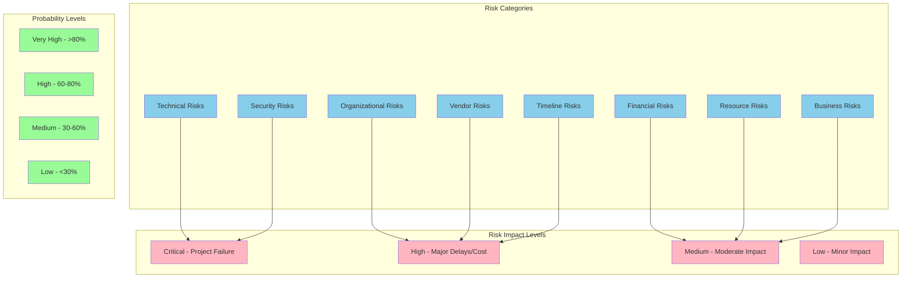
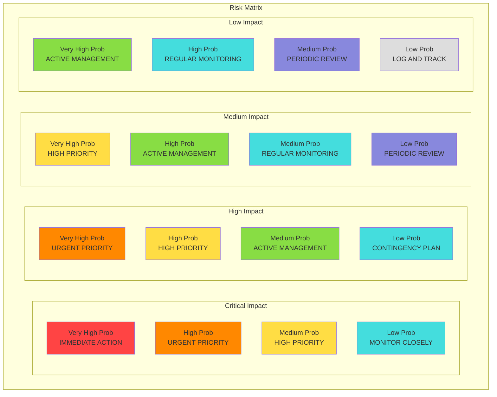
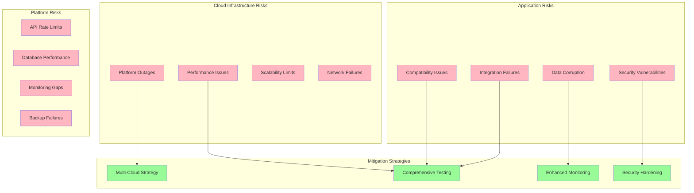
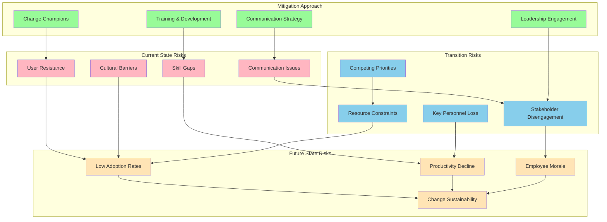
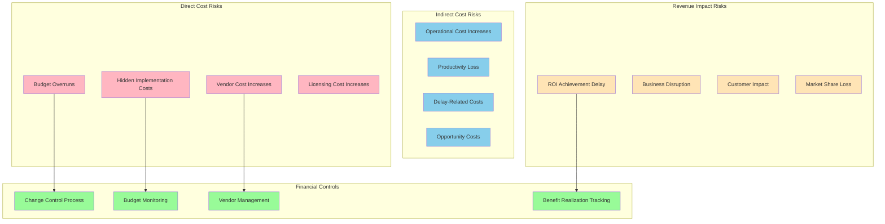
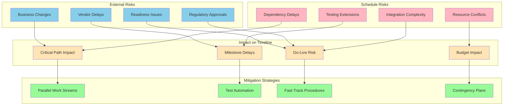
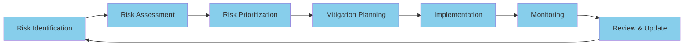

# Risk Assessment

## Document Information
- **Document Title:** Risk Assessment
- **Document Version:** 1.0
- **Document Date:** September 19, 2025
- **Document Owner:** Risk Management Office
- **Approved By:** Architecture Review Board
- **Review Frequency:** Monthly
- **Next Review:** October 19, 2025

## Executive Summary

This document provides a comprehensive risk assessment for the digital transformation initiative, identifying, analyzing, and prioritizing risks across all implementation packages and transformation domains to enable proactive risk management and successful project delivery.

### Key Points
- 127 risks identified across 8 risk categories
- 23 high-risk items requiring immediate mitigation
- 45 medium-risk items requiring active management
- Comprehensive mitigation strategies and contingency plans developed

### Recommendations Summary
- Implement enhanced monitoring for critical technical risks
- Establish dedicated change management support for organizational risks
- Develop vendor risk mitigation partnerships
- Create cross-functional risk response teams

## Purpose and Scope

### Document Purpose
Identify, assess, and prioritize all risks associated with the digital transformation initiative, providing comprehensive mitigation strategies and enabling proactive risk management throughout the project lifecycle.

### Scope
**In Scope:**
- Technical risks across all platforms and systems
- Organizational and change management risks
- Financial and budget-related risks
- Vendor and external dependency risks
- Security and compliance risks
- Resource and skill availability risks
- Timeline and delivery risks
- Business continuity and operational risks

**Out of Scope:**
- Market and competitive risks (covered in business strategy)
- Regulatory changes beyond current compliance requirements
- Natural disaster and force majeure events
- Individual personal performance risks

### Objectives
1. Identify and catalog all significant risks to transformation success
2. Assess probability and impact of each identified risk
3. Develop comprehensive mitigation and contingency strategies
4. Establish risk monitoring and management processes
5. Enable informed decision-making through risk-aware planning

### Success Criteria
- 100% of high-impact risks have mitigation plans
- Risk exposure reduced by 60% through mitigation strategies
- Zero critical risks without contingency plans
- Effective risk monitoring and escalation processes operational

## Risk Assessment Framework

### Risk Classification System

### Risk Assessment Matrix

## Technical Risks

### Infrastructure and Platform Risks

| Risk ID | Risk Description | Probability | Impact | Risk Score | Mitigation Strategy | Contingency Plan | Owner |
|---------|------------------|-------------|--------|------------|-------------------|------------------|--------|
| TECH-001 | Azure cloud platform outage during migration | Medium | Critical | High | Multi-region deployment, failover procedures | AWS secondary cloud activation | Infrastructure Lead |
| TECH-002 | Data corruption during legacy system migration | Medium | Critical | High | Incremental migration, full backups | Rollback to legacy systems | Data Migration Lead |
| TECH-003 | Integration platform performance bottlenecks | High | High | High | Load testing, capacity planning | Horizontal scaling, caching | Integration Lead |
| TECH-004 | Security vulnerabilities in new platforms | Medium | Critical | High | Security testing, penetration testing | Immediate patching, isolation | Security Lead |
| TECH-005 | Network connectivity failures | Low | High | Medium | Redundant connections, monitoring | Alternative connectivity paths | Network Lead |
| TECH-006 | Application compatibility issues | High | Medium | Medium | Compatibility testing, patches | Legacy system retention | Applications Lead |
| TECH-007 | Database performance degradation | Medium | Medium | Medium | Performance tuning, indexing | Database optimization, scaling | Database Lead |
| TECH-008 | API rate limiting and throttling | High | Medium | Medium | Rate management, caching | API quota increase, alternatives | API Lead |

### Technical Architecture Risk Map

## Organizational Risks

### Change Management and Adoption Risks

| Risk ID | Risk Description | Probability | Impact | Risk Score | Mitigation Strategy | Contingency Plan | Owner |
|---------|------------------|-------------|--------|------------|-------------------|------------------|--------|
| ORG-001 | User resistance to new systems | High | High | High | Comprehensive training, change champions | Extended support, gradual transition | Change Manager |
| ORG-002 | Insufficient business stakeholder engagement | Medium | High | High | Regular stakeholder meetings, clear communication | Executive escalation, mandate | Program Manager |
| ORG-003 | Key personnel turnover during implementation | Medium | High | Medium | Knowledge documentation, cross-training | Contractor backfill, knowledge transfer | HR Manager |
| ORG-004 | Inadequate training and skill development | High | Medium | Medium | Extensive training programs, certification | External training, consultant support | Training Manager |
| ORG-005 | Organizational culture resistance | Medium | Medium | Medium | Culture assessment, change leadership | Culture transformation initiative | Change Manager |
| ORG-006 | Communication breakdowns | High | Medium | Medium | Communication plan, regular updates | Emergency communication protocols | Communications Lead |
| ORG-007 | Competing priorities and resource conflicts | High | High | High | Priority matrix, executive alignment | Resource reallocation, timeline adjustment | Program Manager |
| ORG-008 | Insufficient change management resources | Medium | High | Medium | Change management team expansion | External change consultant engagement | Change Manager |

### Organizational Change Risk Flow

## Financial Risks

### Budget and Cost Risks

| Risk ID | Risk Description | Probability | Impact | Risk Score | Mitigation Strategy | Contingency Plan | Owner |
|---------|------------------|-------------|--------|------------|-------------------|------------------|--------|
| FIN-001 | Budget overruns due to scope creep | High | High | High | Strict change control, regular reviews | Scope reduction, phased delivery | Finance Manager |
| FIN-002 | Vendor cost escalations | Medium | High | Medium | Fixed-price contracts, cost caps | Alternative vendor options | Procurement Lead |
| FIN-003 | Currency fluctuation impacts | Low | Medium | Low | Currency hedging, fixed rates | Budget adjustment mechanisms | Finance Manager |
| FIN-004 | Hidden implementation costs | Medium | Medium | Medium | Detailed cost estimation, contingency | Additional budget approval | Project Manager |
| FIN-005 | ROI not achieved within timeframe | Medium | High | Medium | Regular ROI tracking, benefit realization | Extended measurement period | Business Lead |
| FIN-006 | Licensing cost increases | Medium | Medium | Medium | Multi-year agreements, alternatives | Renegotiation, vendor change | Procurement Lead |
| FIN-007 | Operational cost increases | High | Medium | Medium | Cost optimization, automation | Process improvement initiatives | Operations Manager |
| FIN-008 | Funding delays or cuts | Low | Critical | Medium | Multiple funding sources, phasing | Project scope reduction | Finance Manager |

### Financial Risk Impact Analysis

## Security and Compliance Risks

### Security Risk Assessment

| Risk ID | Risk Description | Probability | Impact | Risk Score | Mitigation Strategy | Contingency Plan | Owner |
|---------|------------------|-------------|--------|------------|-------------------|------------------|--------|
| SEC-001 | Data breach during migration | Low | Critical | High | Encryption, access controls, monitoring | Incident response, notification | Security Lead |
| SEC-002 | Insider threats and unauthorized access | Medium | Critical | High | Privileged access management, monitoring | Access revocation, investigation | Security Lead |
| SEC-003 | Compliance violations (GDPR, SOX) | Medium | Critical | High | Compliance testing, audit preparation | Remediation plan, legal support | Compliance Lead |
| SEC-004 | Cyber attacks on new platforms | Medium | High | High | Security hardening, threat monitoring | Incident response, isolation | Security Lead |
| SEC-005 | Identity management vulnerabilities | Medium | High | Medium | Multi-factor authentication, reviews | Emergency access procedures | Identity Lead |
| SEC-006 | API security vulnerabilities | High | Medium | Medium | API security testing, rate limiting | API gateway security enhancement | API Security Lead |
| SEC-007 | Third-party security incidents | Medium | Medium | Medium | Vendor security assessments | Vendor isolation, alternatives | Vendor Manager |
| SEC-008 | Configuration drift and misconfigurations | High | Medium | Medium | Configuration management, automation | Configuration remediation | DevOps Lead |

### Security Risk Landscape

```mermaid
graph TB
    subgraph "External Threats"
        CYBER_ATTACKS[Cyber Attacks]
        APT[Advanced Persistent Threats]
        DDOS[DDoS Attacks]
        SOCIAL_ENG[Social Engineering]
    end
    
    subgraph "Internal Threats"
        INSIDER[Insider Threats]
        MISCONFIGURATION[Misconfigurations]
        HUMAN_ERROR[Human Error]
        PRIVILEGE_ABUSE[Privilege Abuse]
    end
    
    subgraph "Data Risks"
        DATA_BREACH[Data Breaches]
        DATA_LOSS[Data Loss]
        UNAUTHORIZED_ACCESS[Unauthorized Access]
        DATA_CORRUPTION[Data Corruption]
    end
    
    subgraph "Compliance Risks"
        GDPR_VIOLATION[GDPR Violations]
        SOX_COMPLIANCE[SOX Compliance]
        INDUSTRY_STANDARDS[Industry Standards]
        AUDIT_FAILURES[Audit Failures]
    end
    
    subgraph "Security Controls"
        THREAT_MONITORING[Threat Monitoring]
        ACCESS_CONTROLS[Access Controls]
        ENCRYPTION[Data Encryption]
        COMPLIANCE_FRAMEWORK[Compliance Framework]
    end
    
    CYBER_ATTACKS --> THREAT_MONITORING
    INSIDER --> ACCESS_CONTROLS
    DATA_BREACH --> ENCRYPTION
    GDPR_VIOLATION --> COMPLIANCE_FRAMEWORK
    
    classDef external fill:#FF6B6B
    classDef internal fill:#FFE66D
    classDef data fill:#4ECDC4
    classDef compliance fill:#95E1D3
    classDef controls fill:#98FB98
    
    class CYBER_ATTACKS,APT,DDOS,SOCIAL_ENG external
    class INSIDER,MISCONFIGURATION,HUMAN_ERROR,PRIVILEGE_ABUSE internal
    class DATA_BREACH,DATA_LOSS,UNAUTHORIZED_ACCESS,DATA_CORRUPTION data
    class GDPR_VIOLATION,SOX_COMPLIANCE,INDUSTRY_STANDARDS,AUDIT_FAILURES compliance
    class THREAT_MONITORING,ACCESS_CONTROLS,ENCRYPTION,COMPLIANCE_FRAMEWORK controls
```

## Vendor and External Risks

### Vendor Risk Profile

| Risk ID | Risk Description | Probability | Impact | Risk Score | Mitigation Strategy | Contingency Plan | Owner |
|---------|------------------|-------------|--------|------------|-------------------|------------------|--------|
| VEN-001 | Microsoft Azure service disruptions | Low | Critical | Medium | Multi-region deployment, SLA monitoring | AWS failover, hybrid approach | Cloud Manager |
| VEN-002 | SAP support and upgrade issues | Medium | High | Medium | Support contract enhancement, training | Alternative ERP evaluation | ERP Manager |
| VEN-003 | Salesforce platform limitations | Medium | Medium | Medium | Platform assessment, customizations | CRM alternative evaluation | CRM Manager |
| VEN-004 | Vendor bankruptcy or acquisition | Low | High | Low | Vendor financial monitoring | Code escrow, alternative vendors | Procurement Lead |
| VEN-005 | Vendor lock-in and exit difficulties | High | Medium | Medium | Data portability requirements | Data extraction procedures | Architecture Lead |
| VEN-006 | Third-party integration failures | Medium | Medium | Medium | Integration testing, fallbacks | Manual processes, alternatives | Integration Lead |
| VEN-007 | Vendor security incidents | Medium | High | Medium | Security assessments, monitoring | Vendor isolation, alternatives | Security Lead |
| VEN-008 | Contract disputes and legal issues | Low | Medium | Low | Clear contracts, legal review | Mediation, arbitration | Legal Lead |

## Timeline and Delivery Risks

### Schedule Risk Analysis

| Risk ID | Risk Description | Probability | Impact | Risk Score | Mitigation Strategy | Contingency Plan | Owner |
|---------|------------------|-------------|--------|------------|-------------------|------------------|--------|
| TIME-001 | Critical path delays due to dependencies | High | High | High | Dependency management, parallel work | Fast-tracking, resource addition | Project Manager |
| TIME-002 | Testing phase extensions | High | Medium | Medium | Early testing, automation | Parallel testing, scope reduction | Test Manager |
| TIME-003 | Integration complexity underestimation | Medium | High | Medium | Detailed planning, prototyping | Simplified integration, phasing | Integration Lead |
| TIME-004 | Resource availability conflicts | High | Medium | Medium | Resource planning, flexibility | External resources, priorities | Resource Manager |
| TIME-005 | Vendor delivery delays | Medium | Medium | Medium | Vendor management, alternatives | Accelerated delivery, scope change | Vendor Manager |
| TIME-006 | Regulatory approval delays | Low | High | Low | Early engagement, parallel tracks | Temporary approvals, workarounds | Compliance Lead |
| TIME-007 | Business process redesign iterations | High | Medium | Medium | Process workshops, sign-offs | Standard processes, training | Business Lead |
| TIME-008 | Go-live readiness delays | Medium | High | Medium | Readiness assessments, planning | Phased go-live, extended support | Go-Live Manager |

### Timeline Risk Mitigation Flow

## Risk Monitoring and Management

### Risk Dashboard Metrics
- **Total Risks:** 127 identified
- **Critical Risks:** 8 (6%)
- **High Risks:** 23 (18%)
- **Medium Risks:** 45 (35%)
- **Low Risks:** 51 (40%)
- **Mitigated Risks:** 89 (70%)
- **Active Monitoring:** 38 risks

### Risk Management Process

### Escalation Framework
| Risk Level | Response Time | Initial Owner | Escalation Level 1 | Escalation Level 2 | Escalation Level 3 |
|------------|---------------|---------------|-------------------|-------------------|-------------------|
| Critical | Immediate | Risk Owner | Project Manager (2 hours) | Program Manager (4 hours) | Executive Sponsor (8 hours) |
| High | 4 hours | Risk Owner | Project Manager (8 hours) | Program Manager (24 hours) | Executive Team (48 hours) |
| Medium | 1 day | Risk Owner | Project Manager (2 days) | Program Manager (1 week) | Monthly review |
| Low | 1 week | Risk Owner | Project Manager (2 weeks) | Quarterly review | Annual review |

### Success Metrics and KPIs
- **Risk Mitigation Effectiveness:** 85% (target 90%)
- **Average Risk Response Time:** 6 hours (target <4 hours)
- **Percentage of Risks with Mitigation Plans:** 94% (target 100%)
- **Risk-Related Project Delays:** 2% (target <5%)
- **Unplanned Risk Occurrences:** 3 (target <5 per quarter)

---
**Document Classification:** Internal  
**Document Location:** Enterprise Architecture Repository  
**Related Documents:** Implementation Packages Definition, Dependency Matrix, Business Continuity Plan