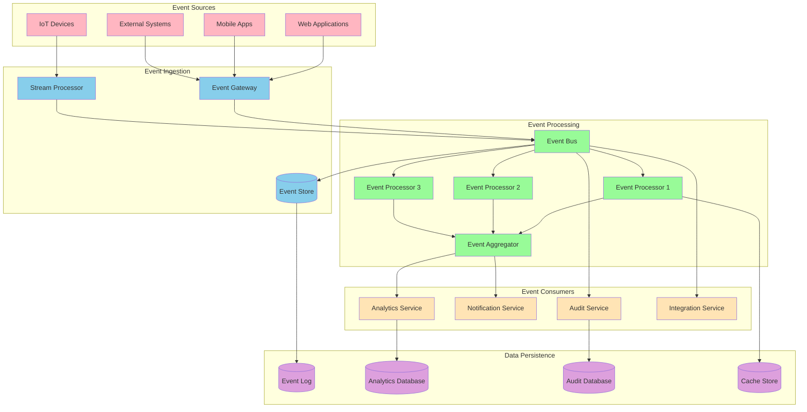
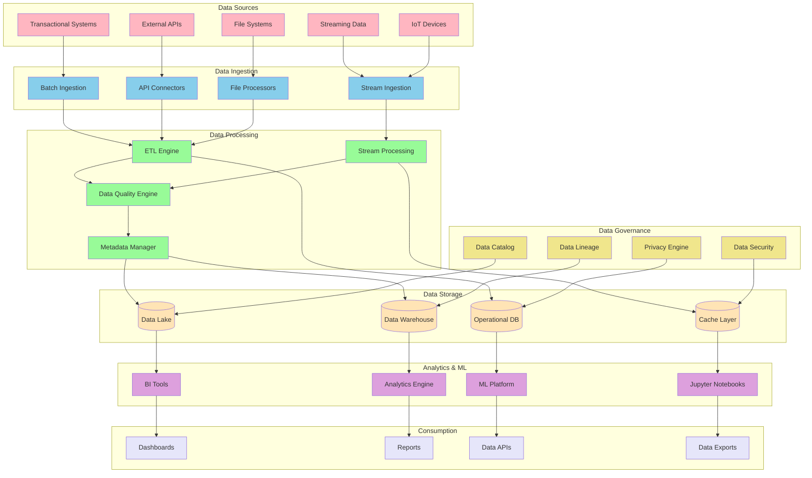
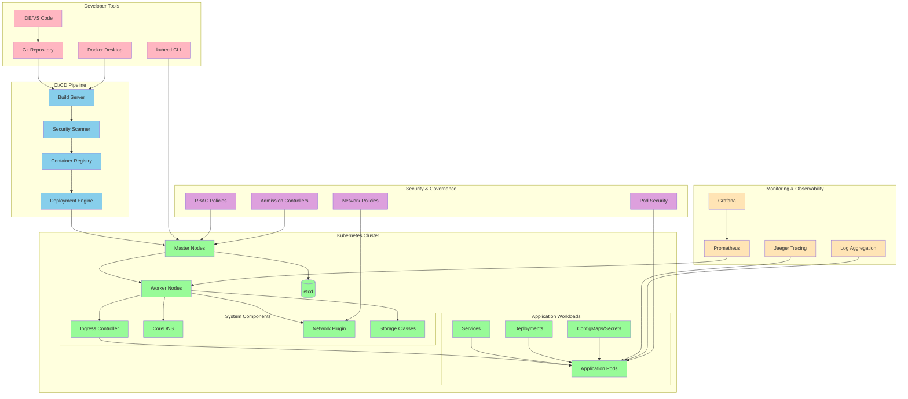
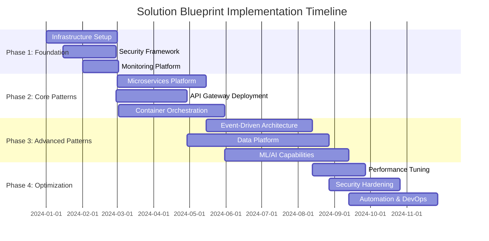

```mermaid
graph TB
    subgraph "Client Layer"
        WEB[Web Application]
        MOBILE[Mobile App]
        THIRD_PARTY[Third Party]
    end
    
    subgraph "API Gateway & Security"
        API_GATEWAY[API Gateway]
        AUTH_SVC[Authentication Service]
        RATE_LIMIT[Rate Limiting]
        WAF[Web Application Firewall]
    end
    
    subgraph "Microservices Layer"
        USER_SVC[User Service]
        ORDER_SVC[Order Service]
        PAYMENT_SVC[Payment Service]
        PRODUCT_SVC[Product Service]
        NOTIFICATION_SVC[Notification Service]
    end
    
    subgraph "Data Layer"
        USER_DB[(User Database)]
        ORDER_DB[(Order Database)]
        PAYMENT_DB[(Payment Database)]
        PRODUCT_DB[(Product Database)]
        CACHE[(Redis Cache)]
    end
    
    subgraph "Infrastructure Services"
        MESSAGE_BUS[Message Bus]
        MONITORING[Monitoring]
        LOGGING[Centralized Logging]
        CONFIG[Configuration Service]
        SERVICE_MESH[Service Mesh]
    end
    
    WEB --> API_GATEWAY
    MOBILE --> API_GATEWAY
    THIRD_PARTY --> API_GATEWAY
    
    API_GATEWAY --> WAF
    WAF --> AUTH_SVC
    API_GATEWAY --> RATE_LIMIT
    
    API_GATEWAY --> USER_SVC
    API_GATEWAY --> ORDER_SVC
    API_GATEWAY --> PAYMENT_SVC
    API_GATEWAY --> PRODUCT_SVC
    
    USER_SVC --> USER_DB
    ORDER_SVC --> ORDER_DB
    PAYMENT_SVC --> PAYMENT_DB
    PRODUCT_SVC --> PRODUCT_DB
    
    USER_SVC --> CACHE
    ORDER_SVC --> CACHE
    
    ORDER_SVC --> MESSAGE_BUS
    PAYMENT_SVC --> MESSAGE_BUS
    NOTIFICATION_SVC --> MESSAGE_BUS
    
    SERVICE_MESH --> USER_SVC
    SERVICE_MESH --> ORDER_SVC
    SERVICE_MESH --> PAYMENT_SVC
    SERVICE_MESH --> PRODUCT_SVC
    
    MONITORING --> SERVICE_MESH
    LOGGING --> SERVICE_MESH
    CONFIG --> SERVICE_MESH
    
    classDef client fill:#FFB6C1
    classDef gateway fill:#87CEEB
    classDef service fill:#98FB98
    classDef data fill:#FFE4B5
    classDef infrastructure fill:#DDA0DD
    
    class WEB,MOBILE,THIRD_PARTY client
    class API_GATEWAY,AUTH_SVC,RATE_LIMIT,WAF gateway
    class USER_SVC,ORDER_SVC,PAYMENT_SVC,PRODUCT_SVC,NOTIFICATION_SVC service
    class USER_DB,ORDER_DB,PAYMENT_DB,PRODUCT_DB,CACHE data
    class MESSAGE_BUS,MONITORING,LOGGING,CONFIG,SERVICE_MESH infrastructure
```

```mermaid
graph TB
    subgraph "External Consumers"
        PARTNER_APP[Partner Applications]
        MOBILE_CLIENT[Mobile Clients]
        WEB_CLIENT[Web Clients]
        THIRD_PARTY[Third Party Systems]
    end
    
    subgraph "API Management Layer"
        API_GATEWAY[API Gateway]
        DEV_PORTAL[Developer Portal]
        API_ANALYTICS[API Analytics]
        RATE_LIMITER[Rate Limiter]
    end
    
    subgraph "Security Layer"
        OAUTH_SERVER[OAuth Server]
        JWT_VALIDATOR[JWT Validator]
        API_KEY_MGR[API Key Manager]
        THREAT_PROTECTION[Threat Protection]
    end
    
    subgraph "Integration Services"
        ADAPTER_SVC[Adapter Service]
        TRANSFORM_SVC[Transformation Service]
        ROUTING_SVC[Routing Service]
        ORCHESTRATION[Orchestration Engine]
    end
    
    subgraph "Backend Systems"
        ERP_SYSTEM[ERP System]
        CRM_SYSTEM[CRM System]
        DATABASE[(Database)]
        LEGACY_SYS[Legacy Systems]
        CLOUD_SVC[Cloud Services]
    end
    
    subgraph "Monitoring & Management"
        MONITORING[API Monitoring]
        LOGGING[Centralized Logging]
        ALERTING[Alerting System]
        DASHBOARD[Management Dashboard]
    end
    
    PARTNER_APP --> API_GATEWAY
    MOBILE_CLIENT --> API_GATEWAY
    WEB_CLIENT --> API_GATEWAY
    THIRD_PARTY --> API_GATEWAY
    
    API_GATEWAY --> OAUTH_SERVER
    API_GATEWAY --> JWT_VALIDATOR
    API_GATEWAY --> API_KEY_MGR
    API_GATEWAY --> THREAT_PROTECTION
    
    API_GATEWAY --> RATE_LIMITER
    API_GATEWAY --> API_ANALYTICS
    DEV_PORTAL --> API_GATEWAY
    
    API_GATEWAY --> ADAPTER_SVC
    API_GATEWAY --> TRANSFORM_SVC
    API_GATEWAY --> ROUTING_SVC
    API_GATEWAY --> ORCHESTRATION
    
    ADAPTER_SVC --> ERP_SYSTEM
    ADAPTER_SVC --> CRM_SYSTEM
    TRANSFORM_SVC --> DATABASE
    ROUTING_SVC --> LEGACY_SYS
    ORCHESTRATION --> CLOUD_SVC
    
    MONITORING --> API_GATEWAY
    LOGGING --> API_GATEWAY
    ALERTING --> MONITORING
    DASHBOARD --> API_ANALYTICS
    
    classDef external fill:#FFB6C1
    classDef management fill:#87CEEB
    classDef security fill:#98FB98
    classDef integration fill:#FFE4B5
    classDef backend fill:#DDA0DD
    classDef monitoring fill:#F0E68C
    
    class PARTNER_APP,MOBILE_CLIENT,WEB_CLIENT,THIRD_PARTY external
    class API_GATEWAY,DEV_PORTAL,API_ANALYTICS,RATE_LIMITER management
    class OAUTH_SERVER,JWT_VALIDATOR,API_KEY_MGR,THREAT_PROTECTION security
    class ADAPTER_SVC,TRANSFORM_SVC,ROUTING_SVC,ORCHESTRATION integration
    class ERP_SYSTEM,CRM_SYSTEM,DATABASE,LEGACY_SYS,CLOUD_SVC backend
    class MONITORING,LOGGING,ALERTING,DASHBOARD monitoring
```

# Solution Architecture Blueprints

## Document Information
- **Document Title:** Solution Architecture Blueprints
- **Document Version:** 1.0
- **Document Date:** September 19, 2025
- **Document Owner:** Solution Architecture Team
- **Approved By:** Architecture Review Board
- **Review Frequency:** Quarterly
- **Next Review:** December 19, 2025

## Executive Summary

This document provides comprehensive solution architecture blueprints for the digital transformation initiative, defining standardized architectural patterns, reference designs, and implementation approaches across all technology domains. These blueprints ensure consistency, reduce complexity, and accelerate delivery while maintaining architectural integrity.

### Key Points
- 12 standardized solution blueprints covering all major architectural patterns
- Cloud-native and hybrid deployment models with multi-cloud support
- Security-by-design principles integrated across all solutions
- Scalable and resilient architectures supporting enterprise growth

### Recommendations Summary
- Adopt microservices architecture blueprint for new application development
- Implement event-driven architecture for real-time data processing
- Deploy API-first integration pattern for all system integrations
- Establish cloud-native data platform for analytics and AI/ML workloads

## Purpose and Scope

### Document Purpose
Define standardized solution architecture blueprints that provide consistent, repeatable, and scalable architectural patterns for digital transformation projects, ensuring alignment with enterprise architecture principles and strategic objectives.

### Scope
**In Scope:**
- Application architecture blueprints
- Data and analytics architecture patterns
- Integration and API architecture designs
- Cloud-native and hybrid deployment patterns
- Security and compliance architectural patterns
- DevOps and CI/CD pipeline architectures

**Out of Scope:**
- Detailed implementation guides (covered in separate documents)
- Vendor-specific configuration details
- Project-specific customizations
- Legacy system decommissioning plans

### Objectives
1. Establish standardized architectural patterns for consistent implementation
2. Reduce solution design complexity and accelerate delivery timelines
3. Ensure architectural compliance and governance across all projects
4. Enable reusability and knowledge sharing across development teams
5. Support scalability and evolution of enterprise architecture

### Success Criteria
- 90% of new projects adopt standardized blueprints
- 50% reduction in solution design time
- 100% compliance with security and governance standards
- 80% reuse rate of common architectural components

## Context and Background

### Business Context
The organization is undergoing digital transformation requiring rapid development and deployment of new capabilities while maintaining operational excellence and security standards. Standardized solution blueprints provide the foundation for achieving these objectives.

### Current State
- Multiple architectural approaches across different projects
- Inconsistent security and compliance implementations
- Limited reusability of architectural components
- Extended solution design and approval cycles

### Drivers for Change
- Need for faster time-to-market for new capabilities
- Requirement for consistent security and compliance posture
- Demand for scalable and cloud-native architectures
- Pressure to reduce development and operational costs

### Constraints and Assumptions
**Constraints:**
- Must comply with existing security and regulatory requirements
- Limited budget for new tooling and infrastructure
- Existing team skills and capabilities

**Assumptions:**
- Cloud-first strategy will be maintained
- Microservices adoption will continue to grow
- API-first approach will be standard for integrations

## Solution Architecture Blueprints

### 1. Microservices Application Architecture

#### Overview
Standardized microservices architecture pattern for building scalable, resilient, and maintainable applications using cloud-native technologies and practices.

#### Architecture Diagram

#### Key Components
- **API Gateway:** Centralized entry point with routing, authentication, and rate limiting
- **Microservices:** Independently deployable services with single responsibilities
- **Service Mesh:** Infrastructure layer providing service-to-service communication
- **Message Bus:** Asynchronous communication between services
- **Monitoring & Logging:** Comprehensive observability across all services

#### Implementation Guidelines
- Each microservice owns its data and database
- Use domain-driven design for service boundaries
- Implement circuit breaker patterns for resilience
- Deploy using container orchestration (Kubernetes)
- Apply 12-factor app principles

### 2. Event-Driven Architecture

#### Overview
Architecture pattern for building responsive, scalable systems that react to events in real-time, enabling loose coupling and high throughput processing.

#### Architecture Diagram

#### Key Components
- **Event Gateway:** Entry point for external events with validation and routing
- **Event Bus:** Central messaging infrastructure for event distribution
- **Stream Processor:** Real-time event processing and transformation
- **Event Store:** Persistent storage for event sourcing and replay
- **Event Processors:** Specialized handlers for different event types

#### Implementation Guidelines
- Use Apache Kafka or Azure Event Hubs for event streaming
- Implement event sourcing for critical business processes
- Apply CQRS (Command Query Responsibility Segregation) pattern
- Ensure idempotent event processing
- Implement event versioning and schema evolution

### 3. API-First Integration Architecture

#### Overview
Standardized approach for building integration solutions with API-first design principles, ensuring consistent, secure, and scalable system interconnections.

#### Architecture Diagram

#### Key Components
- **API Gateway:** Centralized API management with security and routing
- **Developer Portal:** Self-service API documentation and testing
- **Security Layer:** OAuth, JWT, and API key management
- **Integration Services:** Transformation, routing, and orchestration
- **Monitoring:** Comprehensive API performance and usage analytics

#### Implementation Guidelines
- Design APIs using OpenAPI 3.0 specifications
- Implement RESTful design principles and HTTP standards
- Use semantic versioning for API evolution
- Apply rate limiting and throttling policies
- Implement comprehensive API testing and monitoring

### 4. Cloud-Native Data Platform

#### Overview
Modern data platform architecture leveraging cloud-native services for data ingestion, processing, storage, and analytics with support for real-time and batch processing.

#### Architecture Diagram

#### Key Components
- **Data Lake:** Scalable storage for structured and unstructured data
- **Data Warehouse:** Optimized for analytics and reporting workloads
- **Stream Processing:** Real-time data processing and transformation
- **ML Platform:** Integrated machine learning and AI capabilities
- **Data Governance:** Comprehensive data management and compliance

#### Implementation Guidelines
- Use cloud-native data services (Azure Synapse, AWS Redshift, GCP BigQuery)
- Implement data mesh principles for decentralized data ownership
- Apply data lake house architecture for unified analytics
- Ensure GDPR compliance and data privacy controls
- Implement automated data quality monitoring

### 5. Container Orchestration Platform

#### Overview
Standardized container orchestration platform for deploying, managing, and scaling containerized applications using Kubernetes and supporting tools.

#### Architecture Diagram

#### Key Components
- **Kubernetes Cluster:** Core orchestration platform with master and worker nodes
- **CI/CD Integration:** Automated build, test, and deployment pipelines
- **Service Mesh:** Advanced traffic management and security
- **Monitoring Stack:** Comprehensive observability and alerting
- **Security Controls:** RBAC, network policies, and admission controllers

#### Implementation Guidelines
- Use Infrastructure as Code for cluster provisioning
- Implement GitOps for application deployment
- Apply resource quotas and limits for multi-tenancy
- Enable horizontal pod autoscaling and cluster autoscaling
- Implement comprehensive backup and disaster recovery

## Implementation Approach

### Implementation Roadmap

### Resource Requirements
| Resource Type | Phase 1 | Phase 2 | Phase 3 | Phase 4 |
|---------------|---------|---------|---------|---------|
| Solution Architects | 3 | 5 | 7 | 4 |
| DevOps Engineers | 4 | 6 | 8 | 5 |
| Security Specialists | 2 | 3 | 4 | 3 |
| Platform Engineers | 2 | 4 | 6 | 4 |

### Dependencies
- Cloud infrastructure provisioning and setup
- Security framework implementation and approval
- Development team training on new patterns
- Legacy system integration and data migration

## Financial Impact

### Cost Analysis
| Cost Category | Year 1 | Year 2 | Year 3 | Total |
|---------------|--------|--------|--------|-------|
| Cloud Infrastructure | $450K | $520K | $580K | $1,550K |
| Platform Licensing | $180K | $200K | $220K | $600K |
| Professional Services | $300K | $150K | $100K | $550K |
| Training & Certification | $80K | $60K | $40K | $180K |
| **Total** | $1,010K | $930K | $940K | $2,880K |

### Benefit Analysis
| Benefit | Year 1 | Year 2 | Year 3 | Total |
|---------|--------|--------|--------|-------|
| Development Efficiency | $200K | $450K | $650K | $1,300K |
| Operational Cost Savings | $150K | $350K | $500K | $1,000K |
| Infrastructure Optimization | $100K | $250K | $400K | $750K |
| Security & Compliance | $50K | $150K | $250K | $450K |
| **Total** | $500K | $1,200K | $1,800K | $3,500K |

### Return on Investment
- **Net Present Value (NPV):** $1,950K
- **Internal Rate of Return (IRR):** 45%
- **Payback Period:** 2.1 years

## Performance Measurement

### Key Performance Indicators
| KPI | Baseline | Target | Measurement Method | Frequency |
|-----|----------|--------|--------------------|-----------|
| Solution Delivery Time | 6 months | 3 months | Project tracking | Monthly |
| Architecture Compliance | 60% | 95% | Automated scanning | Weekly |
| System Availability | 99.5% | 99.9% | Monitoring tools | Real-time |
| Security Incidents | 12/year | 2/year | Security dashboard | Monthly |

### Success Metrics
- **Blueprint Adoption Rate:** 90% of projects use standardized blueprints
- **Development Velocity:** 50% increase in feature delivery speed
- **System Reliability:** 99.9% uptime across all critical systems
- **Security Posture:** Zero critical security vulnerabilities

### Monitoring and Reporting
- **Reporting Frequency:** Monthly architecture scorecards
- **Report Recipients:** Architecture Board, CTO, Project Managers
- **Review Process:** Quarterly architecture review meetings
- **Escalation Criteria:** <80% compliance or >3 critical issues

---
**Document Classification:** Internal  
**Document Location:** Enterprise Architecture Repository  
**Related Documents:** Technology Standards Catalog, Security Architecture Framework