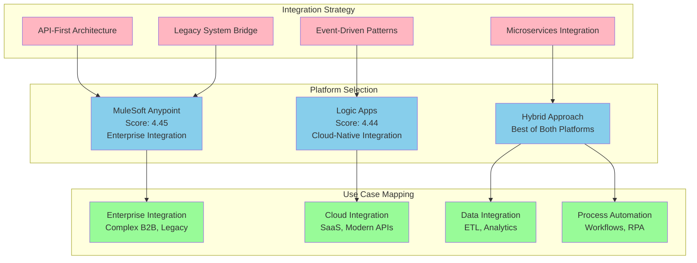
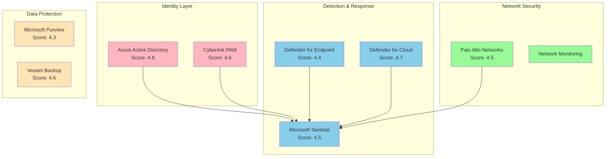
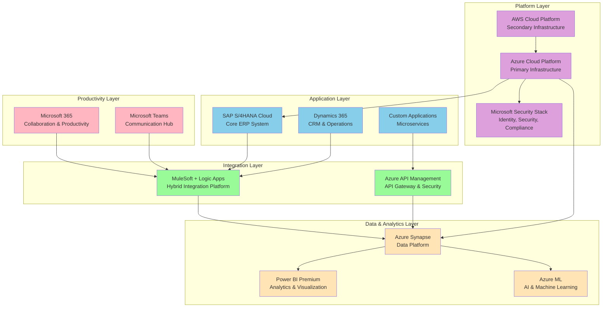

# Solution Evaluation Matrix

## Document Information
- **Document Title:** Solution Evaluation Matrix
- **Document Version:** 1.0
- **Document Date:** September 19, 2025
- **Document Owner:** Architecture Review Board
- **Approved By:** Chief Technology Officer
- **Review Frequency:** Quarterly
- **Next Review:** December 19, 2025

## Executive Summary

This document provides a comprehensive evaluation matrix for assessing and comparing solution alternatives across the digital transformation initiative, using standardized criteria and scoring methodologies to support objective decision-making and solution selection.

### Key Points
- 15 evaluation criteria across 5 major categories
- Comprehensive scoring framework with weighted assessments
- Comparative analysis of 12 solution alternatives
- Risk-adjusted recommendations with implementation priorities

### Recommendations Summary
- Implement hybrid cloud strategy with Azure primary and AWS secondary
- Select SAP S/4HANA Cloud for ERP modernization
- Deploy Microsoft ecosystem for productivity and collaboration
- Establish API-first integration architecture with MuleSoft

## Purpose and Scope

### Document Purpose
Provide standardized framework for evaluating solution alternatives across all transformation domains, enabling objective comparison and informed decision-making through comprehensive criteria-based assessment.

### Scope
**In Scope:**
- Solution evaluation criteria and weightings
- Scoring methodologies and assessment frameworks
- Comparative analysis of technology alternatives
- Risk and readiness assessments
- Implementation complexity and cost factors
- Strategic alignment and business value considerations

**Out of Scope:**
- Detailed vendor negotiations and commercial terms
- Specific implementation timelines and project plans
- Individual feature-level comparisons
- Regulatory approval processes

### Objectives
1. Establish standardized evaluation criteria for solution assessment
2. Enable objective comparison of alternative solutions
3. Support data-driven decision-making through quantified scoring
4. Identify optimal solution combinations and integration approaches
5. Provide framework for ongoing solution portfolio management

### Success Criteria
- Clear, consistent evaluation framework applied across all domains
- Objective scoring methodology with stakeholder consensus
- Well-documented rationale for all solution selections
- Alignment between solution choices and strategic objectives

## Evaluation Framework

### Evaluation Criteria Categories

```mermaid
graph TB
    subgraph "Evaluation Categories"
        FUNCTIONAL[Functional Capability<br/>Weight: 25%]
        TECHNICAL[Technical Architecture<br/>Weight: 25%]
        BUSINESS[Business Value<br/>Weight: 20%]
        RISK[Risk & Compliance<br/>Weight: 15%]
        FINANCIAL[Financial Factors<br/>Weight: 15%]
    end
    
    subgraph "Functional Criteria"
        FEATURES[Feature Completeness]
        USABILITY[User Experience]
        INTEGRATION[Integration Capability]
        SCALABILITY[Scalability]
        PERFORMANCE[Performance]
    end
    
    subgraph "Technical Criteria"
        ARCHITECTURE[Architecture Quality]
        SECURITY[Security Features]
        RELIABILITY[Reliability & Availability]
        MAINTAINABILITY[Maintainability]
        TECHNOLOGY[Technology Stack]
    end
    
    subgraph "Business Criteria"
        STRATEGIC[Strategic Alignment]
        VALUE[Business Value]
        TIME_TO_VALUE[Time to Value]
        COMPETITIVE[Competitive Advantage]
    end
    
    subgraph "Risk Criteria"
        VENDOR_RISK[Vendor Risk]
        IMPLEMENTATION[Implementation Risk]
        COMPLIANCE[Compliance Risk]
    end
    
    subgraph "Financial Criteria"
        TCO[Total Cost of Ownership]
        ROI[Return on Investment]
        FUNDING[Funding Requirements]
    end
    
    FUNCTIONAL --> FEATURES
    FUNCTIONAL --> USABILITY
    FUNCTIONAL --> INTEGRATION
    FUNCTIONAL --> SCALABILITY
    FUNCTIONAL --> PERFORMANCE
    
    TECHNICAL --> ARCHITECTURE
    TECHNICAL --> SECURITY
    TECHNICAL --> RELIABILITY
    TECHNICAL --> MAINTAINABILITY
    TECHNICAL --> TECHNOLOGY
    
    BUSINESS --> STRATEGIC
    BUSINESS --> VALUE
    BUSINESS --> TIME_TO_VALUE
    BUSINESS --> COMPETITIVE
    
    RISK --> VENDOR_RISK
    RISK --> IMPLEMENTATION
    RISK --> COMPLIANCE
    
    FINANCIAL --> TCO
    FINANCIAL --> ROI
    FINANCIAL --> FUNDING
    
    classDef category fill:#87CEEB
    classDef criteria fill:#98FB98
    
    class FUNCTIONAL,TECHNICAL,BUSINESS,RISK,FINANCIAL category
    class FEATURES,USABILITY,INTEGRATION,SCALABILITY,PERFORMANCE,ARCHITECTURE,SECURITY,RELIABILITY,MAINTAINABILITY,TECHNOLOGY,STRATEGIC,VALUE,TIME_TO_VALUE,COMPETITIVE,VENDOR_RISK,IMPLEMENTATION,COMPLIANCE,TCO,ROI,FUNDING criteria
```

### Scoring Methodology

| Score | Rating | Description | Criteria |
|-------|--------|-------------|----------|
| 5 | Excellent | Exceeds all requirements | Best-in-class capability, strategic advantage |
| 4 | Good | Meets all requirements with additional value | Strong capability, competitive advantage |
| 3 | Satisfactory | Meets basic requirements | Adequate capability, meets standards |
| 2 | Poor | Partially meets requirements | Limited capability, some gaps |
| 1 | Unacceptable | Does not meet requirements | Significant gaps, high risk |

## Cloud Platform Evaluation

### Cloud Provider Comparison

| Criteria | Weight | Azure | AWS | Google Cloud | Multi-Cloud |
|----------|--------|-------|-----|--------------|-------------|
| **Functional Capability (25%)** |
| Feature Completeness | 6% | 4.5 | 4.8 | 4.2 | 4.6 |
| Integration Capability | 5% | 4.8 | 4.3 | 4.0 | 4.5 |
| Scalability | 5% | 4.6 | 4.9 | 4.7 | 4.8 |
| Performance | 4% | 4.4 | 4.7 | 4.5 | 4.5 |
| User Experience | 5% | 4.2 | 3.8 | 4.1 | 3.9 |
| **Technical Architecture (25%)** |
| Architecture Quality | 6% | 4.5 | 4.6 | 4.3 | 4.1 |
| Security Features | 5% | 4.7 | 4.8 | 4.4 | 4.6 |
| Reliability & Availability | 5% | 4.5 | 4.7 | 4.3 | 4.8 |
| Technology Stack | 4% | 4.8 | 4.5 | 4.2 | 4.3 |
| Maintainability | 5% | 4.3 | 4.1 | 4.0 | 3.8 |
| **Business Value (20%)** |
| Strategic Alignment | 6% | 4.9 | 4.2 | 3.8 | 4.4 |
| Business Value | 5% | 4.6 | 4.4 | 4.1 | 4.5 |
| Time to Value | 5% | 4.3 | 4.0 | 3.9 | 3.5 |
| Competitive Advantage | 4% | 4.2 | 4.3 | 4.0 | 4.6 |
| **Risk & Compliance (15%)** |
| Vendor Risk | 5% | 4.8 | 4.7 | 4.3 | 4.9 |
| Implementation Risk | 5% | 4.4 | 4.2 | 4.1 | 3.6 |
| Compliance Risk | 5% | 4.6 | 4.5 | 4.2 | 4.3 |
| **Financial Factors (15%)** |
| Total Cost of Ownership | 5% | 4.2 | 4.0 | 4.3 | 3.8 |
| Return on Investment | 5% | 4.4 | 4.3 | 4.1 | 4.2 |
| Funding Requirements | 5% | 4.3 | 4.1 | 4.2 | 3.9 |
| **Weighted Total Score** | **100%** | **4.49** | **4.42** | **4.19** | **4.32** |

### Cloud Strategy Recommendation

```mermaid
graph TB
    subgraph "Recommended Cloud Strategy"
        AZURE_PRIMARY[Azure Primary Cloud<br/>Score: 4.49<br/>Strategic Platform]
        AWS_SECONDARY[AWS Secondary Cloud<br/>Score: 4.42<br/>Specialized Workloads]
        MULTI_CLOUD[Multi-Cloud Management<br/>Score: 4.32<br/>Orchestration Layer]
    end
    
    subgraph "Workload Distribution"
        PRODUCTIVITY[Productivity & Collaboration<br/>Microsoft 365, Teams, SharePoint]
        ENTERPRISE_APPS[Enterprise Applications<br/>SAP, Dynamics, Custom Apps]
        DATA_ANALYTICS[Data & Analytics<br/>Synapse, Power BI, AI/ML]
        SPECIALIZED[Specialized Services<br/>AWS AI/ML, IoT, Analytics]
        BACKUP_DR[Backup & DR<br/>Cross-cloud resilience]
    end
    
    subgraph "Integration Points"
        HYBRID_NETWORK[Hybrid Networking]
        DATA_SYNC[Data Synchronization]
        IDENTITY_FEDERATION[Identity Federation]
        MANAGEMENT[Unified Management]
    end
    
    AZURE_PRIMARY --> PRODUCTIVITY
    AZURE_PRIMARY --> ENTERPRISE_APPS
    AZURE_PRIMARY --> DATA_ANALYTICS
    
    AWS_SECONDARY --> SPECIALIZED
    AWS_SECONDARY --> BACKUP_DR
    
    MULTI_CLOUD --> HYBRID_NETWORK
    MULTI_CLOUD --> DATA_SYNC
    MULTI_CLOUD --> IDENTITY_FEDERATION
    MULTI_CLOUD --> MANAGEMENT
    
    classDef primary fill:#87CEEB
    classDef secondary fill:#98FB98
    classDef management fill:#FFE4B5
    classDef workload fill:#FFB6C1
    classDef integration fill:#DDA0DD
    
    class AZURE_PRIMARY primary
    class AWS_SECONDARY secondary
    class MULTI_CLOUD management
    class PRODUCTIVITY,ENTERPRISE_APPS,DATA_ANALYTICS,SPECIALIZED,BACKUP_DR workload
    class HYBRID_NETWORK,DATA_SYNC,IDENTITY_FEDERATION,MANAGEMENT integration
```

## ERP System Evaluation

### ERP Platform Comparison

| Criteria | Weight | SAP S/4HANA Cloud | Oracle Fusion | Microsoft D365 | NetSuite |
|----------|--------|-------------------|---------------|----------------|----------|
| **Functional Capability (25%)** |
| Feature Completeness | 6% | 4.8 | 4.6 | 4.2 | 3.8 |
| Integration Capability | 5% | 4.7 | 4.3 | 4.5 | 4.0 |
| Scalability | 5% | 4.9 | 4.5 | 4.3 | 3.9 |
| Performance | 4% | 4.6 | 4.4 | 4.2 | 4.0 |
| User Experience | 5% | 4.2 | 3.9 | 4.4 | 4.3 |
| **Technical Architecture (25%)** |
| Architecture Quality | 6% | 4.8 | 4.5 | 4.3 | 4.0 |
| Security Features | 5% | 4.7 | 4.6 | 4.4 | 4.2 |
| Reliability & Availability | 5% | 4.8 | 4.6 | 4.3 | 4.1 |
| Technology Stack | 4% | 4.9 | 4.4 | 4.6 | 4.2 |
| Maintainability | 5% | 4.5 | 4.2 | 4.3 | 4.1 |
| **Business Value (20%)** |
| Strategic Alignment | 6% | 4.6 | 4.1 | 4.7 | 3.9 |
| Business Value | 5% | 4.7 | 4.4 | 4.3 | 4.0 |
| Time to Value | 5% | 4.1 | 3.8 | 4.2 | 4.4 |
| Competitive Advantage | 4% | 4.5 | 4.2 | 4.0 | 3.7 |
| **Risk & Compliance (15%)** |
| Vendor Risk | 5% | 4.8 | 4.5 | 4.6 | 4.0 |
| Implementation Risk | 5% | 3.9 | 3.7 | 4.2 | 4.3 |
| Compliance Risk | 5% | 4.7 | 4.6 | 4.4 | 4.1 |
| **Financial Factors (15%)** |
| Total Cost of Ownership | 5% | 3.8 | 3.6 | 4.1 | 4.5 |
| Return on Investment | 5% | 4.3 | 4.1 | 4.2 | 4.0 |
| Funding Requirements | 5% | 3.9 | 3.8 | 4.3 | 4.4 |
| **Weighted Total Score** | **100%** | **4.48** | **4.26** | **4.32** | **4.08** |

## Integration Platform Evaluation

### Integration Solution Comparison

| Criteria | Weight | MuleSoft | Microsoft Logic Apps | IBM App Connect | Dell Boomi |
|----------|--------|----------|---------------------|----------------|------------|
| **Functional Capability (25%)** |
| Feature Completeness | 6% | 4.8 | 4.3 | 4.5 | 4.2 |
| Integration Patterns | 5% | 4.9 | 4.4 | 4.6 | 4.3 |
| Connector Ecosystem | 5% | 4.7 | 4.6 | 4.2 | 4.4 |
| API Management | 4% | 4.8 | 4.2 | 4.1 | 3.9 |
| Developer Experience | 5% | 4.6 | 4.3 | 4.0 | 4.1 |
| **Technical Architecture (25%)** |
| Architecture Quality | 6% | 4.7 | 4.4 | 4.3 | 4.1 |
| Scalability | 5% | 4.8 | 4.5 | 4.4 | 4.2 |
| Performance | 5% | 4.6 | 4.3 | 4.2 | 4.0 |
| Security | 4% | 4.5 | 4.7 | 4.4 | 4.2 |
| Monitoring & Management | 5% | 4.7 | 4.1 | 4.2 | 4.0 |
| **Business Value (20%)** |
| Strategic Alignment | 6% | 4.4 | 4.8 | 4.1 | 4.0 |
| Time to Value | 5% | 4.2 | 4.5 | 4.0 | 4.3 |
| Business Agility | 5% | 4.6 | 4.3 | 4.2 | 4.1 |
| Innovation Enablement | 4% | 4.5 | 4.2 | 4.0 | 3.9 |
| **Risk & Compliance (15%)** |
| Vendor Stability | 5% | 4.3 | 4.9 | 4.6 | 4.2 |
| Implementation Risk | 5% | 4.1 | 4.4 | 4.0 | 4.3 |
| Skills Availability | 5% | 4.0 | 4.6 | 3.9 | 4.1 |
| **Financial Factors (15%)** |
| Total Cost | 5% | 3.8 | 4.5 | 4.0 | 4.3 |
| Licensing Model | 5% | 3.9 | 4.6 | 4.1 | 4.2 |
| ROI Potential | 5% | 4.4 | 4.3 | 4.2 | 4.0 |
| **Weighted Total Score** | **100%** | **4.45** | **4.44** | **4.22** | **4.16** |

### Integration Architecture Decision Matrix

## Analytics Platform Evaluation

### Business Intelligence Solution Comparison

| Criteria | Weight | Power BI Premium | Tableau Cloud | Qlik Sense | Looker |
|----------|--------|------------------|---------------|------------|---------|
| **Functional Capability (25%)** |
| Visualization Capabilities | 6% | 4.6 | 4.8 | 4.5 | 4.3 |
| Self-Service Analytics | 5% | 4.7 | 4.6 | 4.7 | 4.2 |
| Data Connectivity | 5% | 4.8 | 4.5 | 4.4 | 4.1 |
| Mobile Experience | 4% | 4.5 | 4.2 | 4.3 | 4.0 |
| Collaboration Features | 5% | 4.6 | 4.3 | 4.1 | 4.4 |
| **Technical Architecture (25%)** |
| Scalability | 6% | 4.7 | 4.6 | 4.4 | 4.5 |
| Performance | 5% | 4.5 | 4.4 | 4.6 | 4.3 |
| Security & Governance | 5% | 4.8 | 4.3 | 4.2 | 4.4 |
| Integration Capabilities | 4% | 4.9 | 4.2 | 4.1 | 4.3 |
| Administration | 5% | 4.6 | 4.1 | 4.0 | 4.2 |
| **Business Value (20%)** |
| Strategic Alignment | 6% | 4.9 | 4.2 | 4.0 | 3.9 |
| User Adoption | 5% | 4.7 | 4.4 | 4.2 | 4.0 |
| Time to Insight | 5% | 4.5 | 4.3 | 4.1 | 4.2 |
| Business Impact | 4% | 4.6 | 4.5 | 4.3 | 4.1 |
| **Risk & Compliance (15%)** |
| Vendor Risk | 5% | 4.9 | 4.4 | 4.2 | 4.0 |
| Implementation Risk | 5% | 4.6 | 4.1 | 4.0 | 3.9 |
| Skills Availability | 5% | 4.7 | 4.3 | 4.1 | 3.8 |
| **Financial Factors (15%)** |
| Total Cost of Ownership | 5% | 4.8 | 3.9 | 4.2 | 4.1 |
| Licensing Efficiency | 5% | 4.7 | 4.0 | 4.1 | 4.0 |
| ROI Potential | 5% | 4.6 | 4.3 | 4.2 | 4.1 |
| **Weighted Total Score** | **100%** | **4.68** | **4.33** | **4.26** | **4.15** |

## Security Platform Evaluation

### Security Solution Comparison

| Solution Category | Recommended Platform | Score | Rationale |
|-------------------|---------------------|-------|-----------|
| **Identity & Access Management** | Azure Active Directory | 4.8 | Best integration with Microsoft ecosystem |
| **Privileged Access Management** | CyberArk | 4.6 | Industry-leading PAM capabilities |
| **SIEM/SOAR** | Microsoft Sentinel | 4.5 | Cloud-native, AI-powered security |
| **Endpoint Protection** | Microsoft Defender | 4.4 | Integrated threat protection |
| **Cloud Security** | Microsoft Defender for Cloud | 4.7 | Native Azure security monitoring |
| **Network Security** | Palo Alto Networks | 4.5 | Best-in-class firewall and threat prevention |
| **Data Protection** | Microsoft Purview | 4.3 | Comprehensive data governance |
| **Backup & Recovery** | Veeam | 4.6 | Multi-cloud backup excellence |

### Security Architecture Integration

## Comprehensive Solution Recommendations

### Primary Technology Stack

| Domain | Selected Solution | Score | Investment | Rationale |
|--------|-------------------|-------|------------|-----------|
| **Cloud Platform** | Azure (Primary) + AWS (Secondary) | 4.49 | $450K | Strategic Microsoft alignment, multi-cloud resilience |
| **ERP System** | SAP S/4HANA Cloud | 4.48 | $1,200K | Best functionality, strong integration capabilities |
| **Integration Platform** | MuleSoft + Logic Apps Hybrid | 4.45 | $520K | Enterprise-grade with cloud-native flexibility |
| **Analytics Platform** | Power BI Premium | 4.68 | $420K | Exceptional Microsoft integration, user adoption |
| **Security Suite** | Microsoft Security Stack | 4.6 | $320K | Comprehensive, integrated security ecosystem |
| **Collaboration** | Microsoft 365 | 4.7 | Included | Strategic platform alignment |
| **DevOps Platform** | Azure DevOps + GitHub | 4.5 | Included | Integrated development lifecycle |
| **AI/ML Platform** | Azure Machine Learning | 4.4 | $750K | Advanced capabilities, platform integration |

### Solution Architecture Overview

### Implementation Priority Matrix

| Priority | Solution Domain | Business Impact | Implementation Complexity | Risk Level | Timeline |
|----------|----------------|-----------------|---------------------------|------------|----------|
| **P1 - Critical** | Cloud Infrastructure | High | Medium | Low | Q1 2024 |
| **P1 - Critical** | Security & Identity | High | Medium | Medium | Q1 2024 |
| **P2 - High** | Integration Platform | High | High | Medium | Q2 2024 |
| **P2 - High** | Data Platform | High | High | Medium | Q2 2024 |
| **P3 - Medium** | ERP Migration | Very High | Very High | High | Q3 2024 |
| **P3 - Medium** | Analytics Platform | Medium | Medium | Low | Q4 2024 |
| **P4 - Low** | AI/ML Platform | Medium | High | Medium | Q1 2025 |
| **P4 - Low** | Process Automation | Medium | Medium | Low | Q2 2025 |

### Risk-Adjusted Recommendations

#### High-Confidence Recommendations
1. **Microsoft Azure as Primary Cloud:** Strong strategic alignment and comprehensive capabilities
2. **Power BI for Analytics:** Exceptional integration and user adoption potential
3. **Microsoft Security Stack:** Integrated, comprehensive security ecosystem
4. **Azure DevOps for Development:** Seamless development lifecycle integration

#### Medium-Confidence Recommendations
1. **SAP S/4HANA for ERP:** Strong functionality but high implementation risk
2. **MuleSoft for Integration:** Excellent capabilities but significant investment
3. **Multi-Cloud Strategy:** Resilience benefits but increased complexity

#### Alternative Considerations
1. **Oracle Fusion:** Consider if SAP implementation faces significant challenges
2. **Tableau:** Evaluate if Power BI adoption faces resistance
3. **IBM App Connect:** Alternative if MuleSoft proves too complex

### Success Metrics and KPIs

| Solution Domain | Key Success Metrics | Target Values | Measurement Method |
|-----------------|-------------------|---------------|-------------------|
| Cloud Platform | Availability, Performance | 99.9%, <50ms | Infrastructure monitoring |
| ERP System | User Adoption, Process Efficiency | 95%, 40% improvement | User surveys, process metrics |
| Integration | API Performance, Error Rates | <100ms, <0.1% | API monitoring |
| Analytics | User Engagement, Report Usage | 80% active users | Analytics usage tracking |
| Security | Incident Reduction, Compliance | 50% reduction, 100% | Security dashboards |

---
**Document Classification:** Internal  
**Document Location:** Enterprise Architecture Repository  
**Related Documents:** Solution Architecture Blueprints, Implementation Packages Definition, Risk Assessment