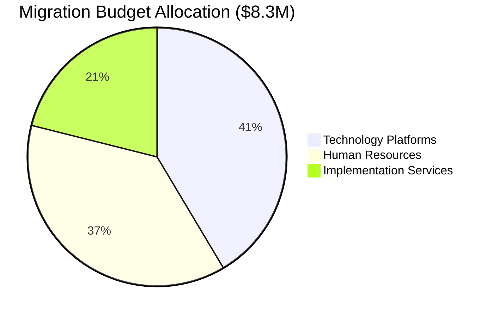
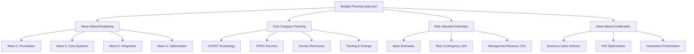
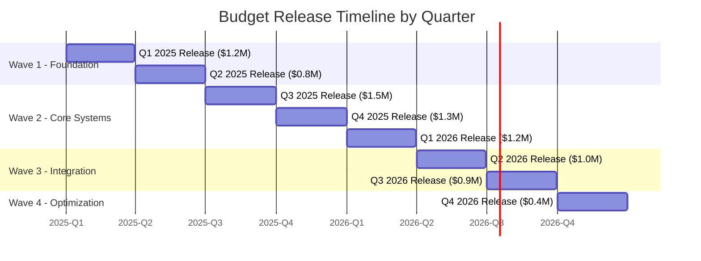
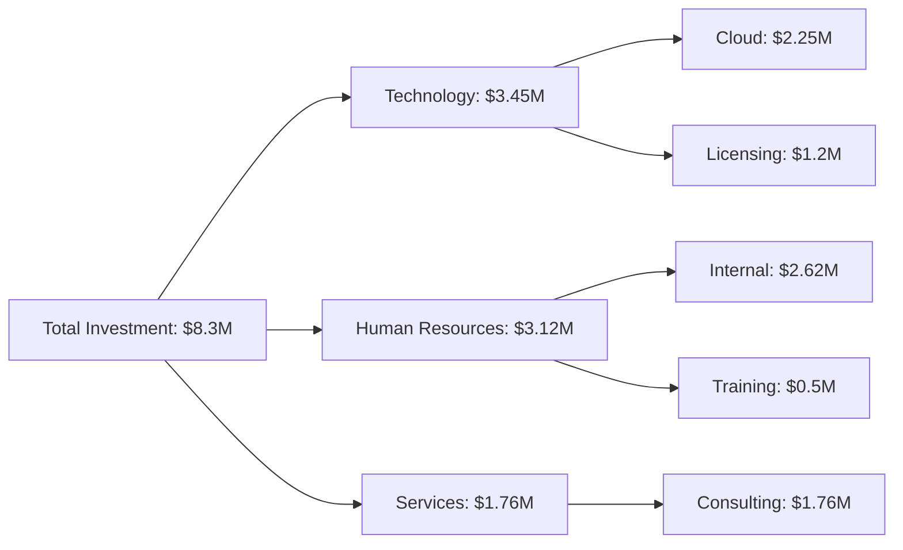
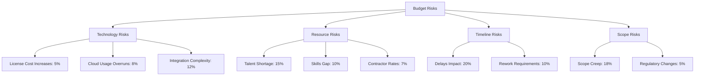
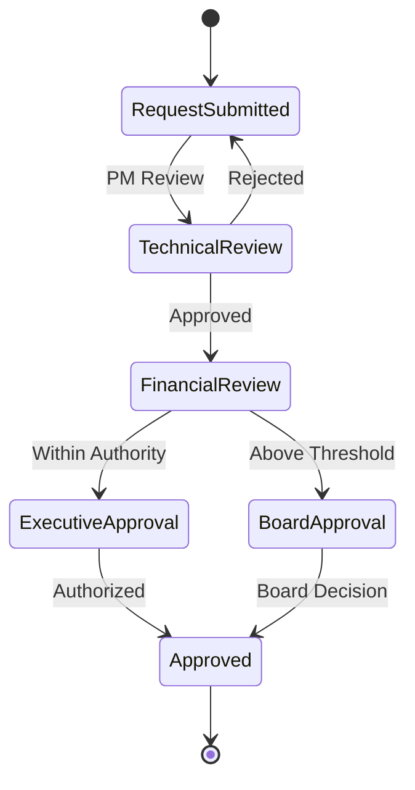
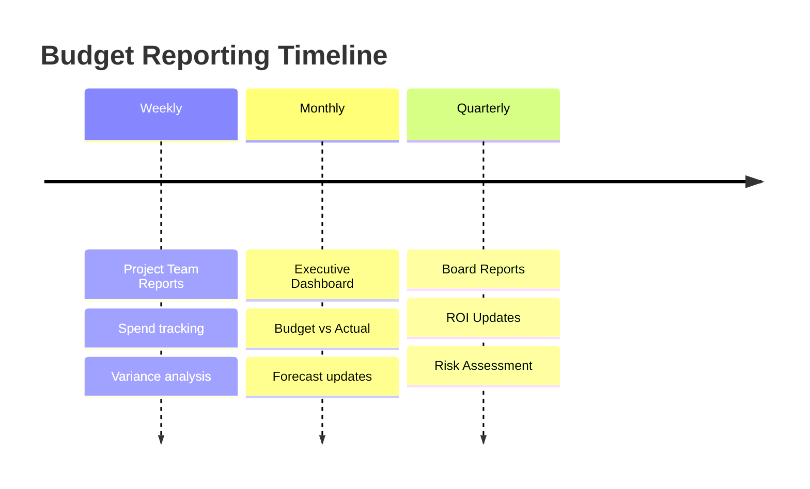
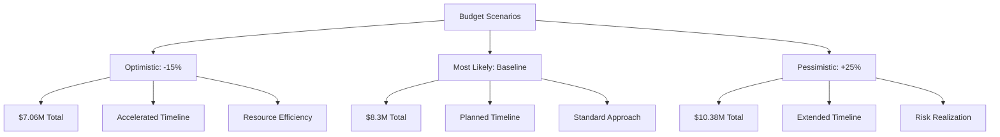

# Migration Budget Planning Document

## Document Information
- **Document Title:** Enterprise Architecture Migration Budget Planning
- **Document Version:** 1.0
- **Document Date:** 2024-12-19
- **Document Owner:** Enterprise Architecture Team
- **Approved By:** CTO / CFO
- **Review Frequency:** Monthly during migration
- **Next Review:** 2025-01-19

## Executive Summary

This document provides comprehensive budget planning for the enterprise architecture migration initiative, covering all phases from preparation through post-implementation optimization. The total investment is $8.3M over 32 months with an expected NPV of $12.4M and ROI of 149%.

### Key Points
- Total Migration Budget: $8,325,000 over 32 months
- Technology Platform Investment: $3,450,000 (41.4%)
- Human Resources: $3,120,000 (37.5%)
- Implementation Services: $1,755,000 (21.1%)
- Quarterly budget releases aligned with migration waves

### Budget Summary by Category

## Purpose and Scope

### Document Purpose
Define comprehensive budget planning, cost allocation, and financial controls for the enterprise architecture migration initiative aligned with TOGAF ADM Phase F requirements.

### Scope
**In Scope:**
- Technology platform licensing and infrastructure costs
- Internal and external human resource costs
- Implementation and consulting services
- Training and change management costs
- Risk mitigation and contingency planning
- Financial governance and control mechanisms

**Out of Scope:**
- Ongoing operational costs post-migration
- Business-as-usual IT operations
- Legacy system decommissioning costs
- Facilities and real estate costs

## Budget Planning Overview

### Financial Planning Approach

## Detailed Budget Breakdown

### 1. Technology Platform Costs ($3,450,000)

#### 1.1 Cloud Infrastructure

| Component | Wave | Annual Cost | 3-Year Total | Notes |
|-----------|------|-------------|--------------|-------|
| Azure Premium | W1-W4 | $450,000 | $1,350,000 | Multi-region deployment |
| AWS Secondary | W2-W4 | $180,000 | $540,000 | DR and specialized services |
| Hybrid Connectivity | W1-W4 | $120,000 | $360,000 | ExpressRoute, VPN Gateway |

#### 1.2 Platform Licensing

| Platform | License Type | Annual Cost | 3-Year Total | User Count |
|----------|-------------|-------------|--------------|------------|
| SAP S/4HANA Cloud | Enterprise | $320,000 | $960,000 | 800 users |
| Power BI Premium | Per User | $25,000 | $75,000 | 250 users |
| MuleSoft Anypoint | Enterprise | $45,000 | $135,000 | Unlimited |
| Microsoft 365 E5 | Per User | $8,000 | $24,000 | 800 users |

#### 1.3 Security and Governance

| Component | Wave | Annual Cost | 3-Year Total | Coverage |
|-----------|------|-------------|--------------|----------|
| Azure Sentinel | W1-W4 | $36,000 | $108,000 | SIEM/SOAR |
| Privileged Access Mgmt | W1-W4 | $24,000 | $72,000 | Admin access |
| Data Loss Prevention | W2-W4 | $18,000 | $54,000 | Data protection |

### 2. Human Resources Costs ($3,120,000)

#### 2.1 Internal Resources

```mermaid
gantt
    title Internal Resource Allocation by Quarter
    dateFormat  X
    axisFormat %s
    
    section Architecture Team
    Enterprise Architects (3 FTE)    :0, 32
    Solution Architects (4 FTE)      :0, 32
    Data Architects (2 FTE)          :6, 32
    
    section Development Team
    Senior Developers (8 FTE)        :3, 30
    Integration Specialists (4 FTE)  :6, 24
    DevOps Engineers (3 FTE)         :0, 32
    
    section Project Management
    Program Manager (1 FTE)          :0, 32
    Project Managers (2 FTE)         :3, 30
    Scrum Masters (2 FTE)            :3, 24
```

| Role Category | FTE Count | Avg Annual Cost | Total Cost | Duration |
|---------------|-----------|-----------------|------------|----------|
| Enterprise Architects | 3 | $150,000 | $1,200,000 | 32 months |
| Solution Architects | 4 | $130,000 | $1,387,000 | 32 months |
| Data Architects | 2 | $135,000 | $720,000 | 26 months |
| Senior Developers | 8 | $120,000 | $2,400,000 | 27 months |
| Integration Specialists | 4 | $125,000 | $1,500,000 | 18 months |
| DevOps Engineers | 3 | $115,000 | $920,000 | 32 months |
| Program Manager | 1 | $140,000 | $373,000 | 32 months |
| Project Managers | 2 | $110,000 | $495,000 | 27 months |
| **Total Internal Resources** | | | **$3,120,000** | |

#### 2.2 Skills Development Investment

| Training Category | Participants | Cost per Person | Total Investment |
|-------------------|--------------|-----------------|------------------|
| Cloud Architecture Certification | 15 | $8,000 | $120,000 |
| SAP S/4HANA Training | 25 | $6,000 | $150,000 |
| DevOps and CI/CD | 12 | $5,000 | $60,000 |
| Data Analytics and BI | 20 | $4,000 | $80,000 |
| Security and Compliance | 30 | $3,000 | $90,000 |
| **Total Training Investment** | | | **$500,000** |

### 3. Implementation Services ($1,755,000)

#### 3.1 External Consulting Services

| Service Category | Provider Type | Duration | Total Cost | Deliverables |
|------------------|---------------|----------|------------|--------------|
| SAP Implementation | SAP Gold Partner | 18 months | $650,000 | S/4HANA deployment |
| Cloud Migration | Azure Partner | 12 months | $480,000 | Infrastructure migration |
| Integration Services | MuleSoft Partner | 15 months | $420,000 | API and data integration |
| Security Assessment | Cybersecurity Firm | 6 months | $180,000 | Security framework |
| Change Management | Organizational Consulting | 24 months | $225,000 | User adoption |

#### 3.2 Third-Party Tools and Services

| Tool/Service | Category | Annual Cost | Duration | Total Cost |
|--------------|----------|-------------|----------|------------|
| Architecture Modeling Tools | Design | $45,000 | 3 years | $135,000 |
| Testing Automation Platform | Quality | $30,000 | 2 years | $60,000 |
| Monitoring and Observability | Operations | $25,000 | 3 years | $75,000 |
| Backup and Recovery Services | Data Protection | $20,000 | 3 years | $60,000 |

## Wave-Based Budget Allocation

### Budget Release Schedule

### Quarterly Budget Breakdown

| Quarter | Wave | Technology | HR Costs | Services | Total Quarter | Cumulative |
|---------|------|------------|----------|----------|---------------|------------|
| Q1 2025 | W1 | $450,000 | $520,000 | $230,000 | $1,200,000 | $1,200,000 |
| Q2 2025 | W1 | $280,000 | $390,000 | $130,000 | $800,000 | $2,000,000 |
| Q3 2025 | W2 | $520,000 | $650,000 | $330,000 | $1,500,000 | $3,500,000 |
| Q4 2025 | W2 | $480,000 | $580,000 | $240,000 | $1,300,000 | $4,800,000 |
| Q1 2026 | W2 | $450,000 | $520,000 | $230,000 | $1,200,000 | $6,000,000 |
| Q2 2026 | W3 | $380,000 | $420,000 | $200,000 | $1,000,000 | $7,000,000 |
| Q3 2026 | W3 | $320,000 | $390,000 | $190,000 | $900,000 | $7,900,000 |
| Q4 2026 | W4 | $170,000 | $150,000 | $80,000 | $400,000 | $8,300,000 |

## Cost-Benefit Analysis

### Investment Summary

### Return on Investment

| Financial Metric | Year 1 | Year 2 | Year 3 | Total |
|------------------|--------|--------|--------|-------|
| **Investment** | $4,800,000 | $2,900,000 | $600,000 | $8,300,000 |
| **Cost Savings** | $1,200,000 | $2,800,000 | $3,500,000 | $7,500,000 |
| **Revenue Benefits** | $800,000 | $2,400,000 | $4,200,000 | $7,400,000 |
| **Net Benefit** | -$2,800,000 | $2,300,000 | $7,100,000 | $6,600,000 |
| **Cumulative NPV** | -$2,545,000 | -$636,000 | $5,636,000 | $12,400,000 |

### Break-Even Analysis

- **Break-Even Point:** Month 19 (Q3 2026)
- **Payback Period:** 22 months
- **NPV (3 years):** $12,400,000
- **IRR:** 68%
- **ROI:** 149%

## Risk and Contingency Planning

### Budget Risk Assessment

### Contingency Allocation

| Risk Category | Probability | Impact | Contingency | Amount |
|---------------|-------------|--------|-------------|---------|
| Technology Complexity | 25% | High | 12% | $414,000 |
| Resource Availability | 35% | Medium | 15% | $468,000 |
| Timeline Delays | 20% | High | 20% | $332,000 |
| Scope Changes | 30% | Medium | 18% | $449,000 |
| **Total Contingency** | | | | **$1,663,000** |

### Management Reserve

- **Base Budget:** $8,300,000
- **Contingency (20%):** $1,663,000
- **Management Reserve (10%):** $830,000
- **Total Authorized Budget:** $10,793,000

## Financial Governance and Controls

### Budget Approval Workflow

### Spending Controls

| Control Type | Threshold | Approval Required | Review Frequency |
|--------------|-----------|-------------------|------------------|
| Quarterly Budget Release | $100,000+ | CFO | Quarterly |
| Emergency Spending | $50,000+ | CTO + CFO | As needed |
| Vendor Contracts | $25,000+ | Procurement | Monthly |
| Travel and Training | $10,000+ | PM | Monthly |
| Technology Procurement | $15,000+ | Architecture Review | Bi-weekly |

### Budget Monitoring and Reporting

#### Key Performance Indicators

| KPI | Target | Current | Status |
|-----|--------|---------|--------|
| Budget Variance | ±5% | 2.3% | ✅ Green |
| Schedule Performance | ±10% | 5.2% | ✅ Green |
| Cost Performance Index | >0.95 | 1.02 | ✅ Green |
| Earned Value | Plan vs Actual | 98% | ✅ Green |

#### Reporting Schedule

## Budget Optimization Strategies

### Cost Optimization Initiatives

1. **Cloud Cost Management**
   - Reserved instance purchasing (20% savings)
   - Auto-scaling optimization (15% savings)
   - Resource rightsizing (10% savings)

2. **Resource Optimization**
   - Shared service model implementation
   - Cross-training to reduce contractor dependency
   - Offshore development team utilization

3. **Procurement Efficiency**
   - Volume licensing agreements
   - Multi-year contract negotiations
   - Vendor consolidation strategies

### Value Engineering

| Initiative | Investment | Annual Savings | Payback Period |
|------------|------------|----------------|----------------|
| Automation Tools | $150,000 | $300,000 | 6 months |
| Process Optimization | $75,000 | $180,000 | 5 months |
| Self-Service Capabilities | $120,000 | $240,000 | 6 months |
| Performance Monitoring | $90,000 | $150,000 | 7 months |

## Budget Scenarios and Sensitivity Analysis

### Scenario Planning

### Sensitivity Analysis

| Variable | -20% | -10% | Base | +10% | +20% | Impact |
|----------|------|------|------|------|------|--------|
| Technology Costs | $6.64M | $7.47M | $8.3M | $9.13M | $9.96M | High |
| Resource Rates | $7.68M | $7.99M | $8.3M | $8.61M | $8.92M | Medium |
| Timeline Extension | $8.3M | $8.3M | $8.3M | $9.13M | $9.96M | High |
| Scope Changes | $8.3M | $8.3M | $8.3M | $9.46M | $10.79M | Very High |

## Conclusion and Recommendations

### Key Recommendations

1. **Approve Base Budget:** $8.3M with 20% contingency allocation
2. **Implement Wave-Based Releases:** Quarterly budget approvals aligned with deliverables
3. **Establish Financial Controls:** Monthly variance reporting and quarterly reviews
4. **Optimize Cloud Costs:** Implement cost management from Wave 1
5. **Invest in Automation:** Early automation investment for long-term savings

### Success Factors

- Strong financial governance and controls
- Regular budget monitoring and forecasting
- Proactive risk management and contingency planning
- Value-driven investment decisions
- Stakeholder engagement and transparency

### Next Steps

1. Secure budget approval from executive committee
2. Establish financial governance framework
3. Implement budget tracking and reporting systems
4. Begin Wave 1 procurement and resource allocation
5. Initiate cost optimization programs

---

**Document Status:** Final  
**Last Updated:** 2024-12-19  
**Next Review:** 2025-01-19