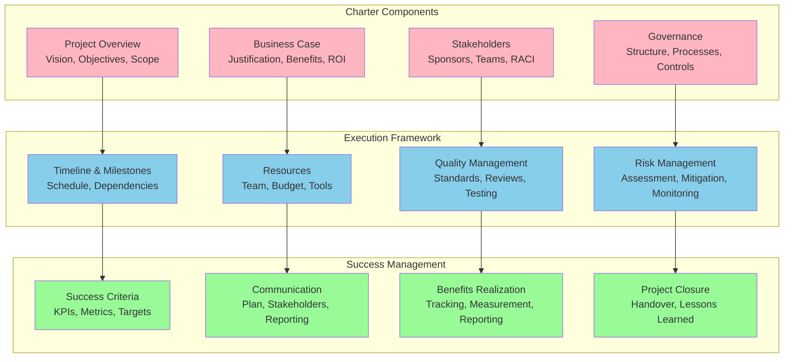
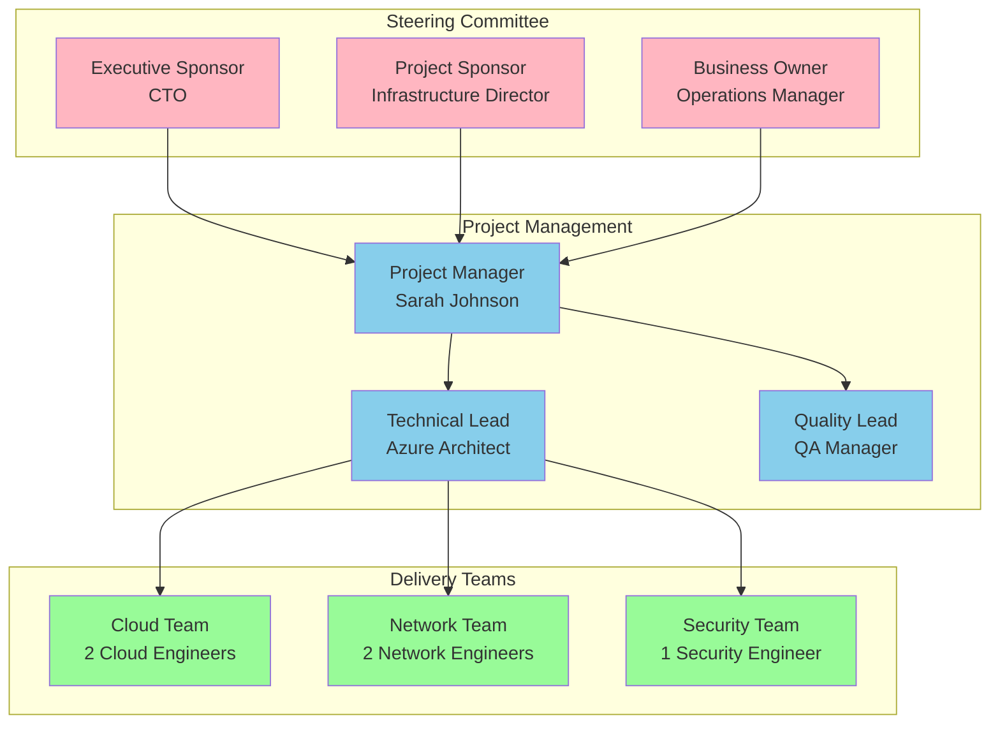
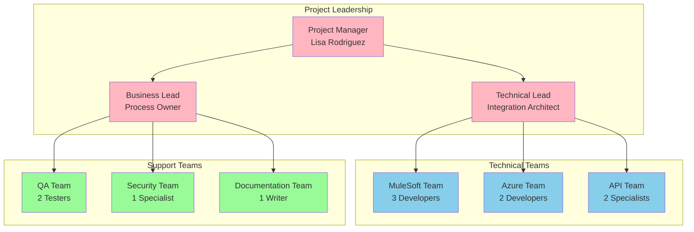
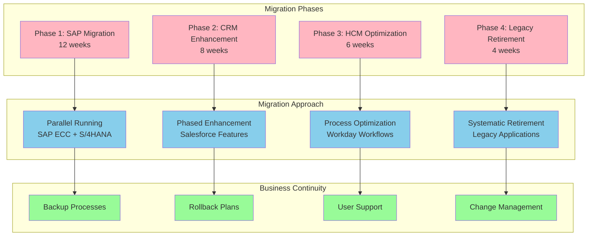
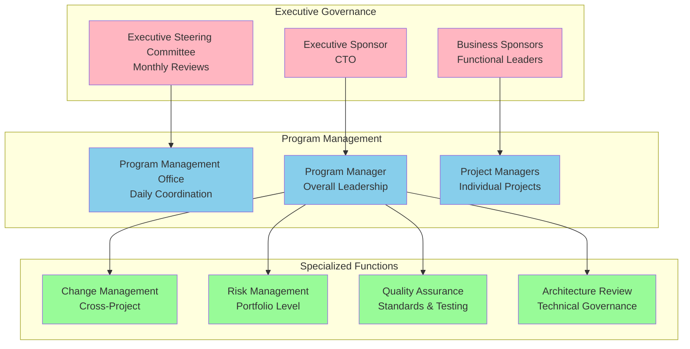

# Implementation Project Charters

## Document Information
- **Document Title:** Implementation Project Charters
- **Document Version:** 1.0
- **Document Date:** September 19, 2025
- **Document Owner:** Program Management Office
- **Approved By:** Executive Steering Committee
- **Review Frequency:** At project initiation
- **Next Review:** As required for new projects

## Executive Summary

This document provides comprehensive project charters for all implementation packages within the digital transformation initiative, defining scope, objectives, governance, and success criteria for each project to ensure aligned execution and successful delivery.

### Key Points
- 8 comprehensive project charters aligned with implementation packages
- Standardized governance framework across all projects
- Clear accountability and decision-making structures
- Integrated risk management and quality assurance approaches
- Unified success metrics and benefit realization tracking

### Recommendations Summary
- Establish dedicated project management office for coordination
- Implement standardized project governance across all charters
- Deploy integrated project portfolio management tools
- Create cross-project dependency management framework

## Purpose and Scope

### Document Purpose
Define comprehensive project charters for each implementation package, establishing clear project boundaries, objectives, governance structures, and success criteria to enable effective project execution and delivery.

### Scope
**In Scope:**
- Individual project charters for all 8 implementation packages
- Project governance structures and decision-making frameworks
- Resource allocation and team structures
- Risk management and quality assurance approaches
- Success metrics and benefit realization frameworks

**Out of Scope:**
- Detailed project work breakdown structures
- Day-to-day project management procedures
- Individual resource assignments and job descriptions
- Vendor contract negotiations and commercial terms

### Objectives
1. Establish clear project scope and objectives for each package
2. Define governance structures and decision-making authority
3. Allocate resources and establish team structures
4. Implement risk management and quality frameworks
5. Create accountability and success measurement systems

### Success Criteria
- All projects delivered within scope, time, and budget
- Clear governance and decision-making throughout execution
- Effective resource allocation and team performance
- Proactive risk management and issue resolution
- Achievement of projected benefits and business value

## Project Charter Framework

### Standardized Charter Structure

## Package 1 Project Charter: Infrastructure Foundation

### Project Overview
- **Project Name:** Infrastructure Foundation Implementation
- **Project Code:** IF-2024-001
- **Project Manager:** Sarah Johnson
- **Project Sponsor:** Chief Technology Officer
- **Duration:** 12 weeks (January 1 - March 22, 2024)
- **Budget:** $450,000

### Project Vision and Objectives
**Vision:** Establish a robust, scalable, and secure cloud infrastructure foundation that supports the entire digital transformation initiative.

**Primary Objectives:**
1. Deploy Azure cloud landing zone with multi-region capability
2. Establish hybrid connectivity between on-premises and cloud
3. Implement foundational security controls and monitoring
4. Create DevOps toolchain and CI/CD capabilities
5. Set up disaster recovery and backup infrastructure

### Business Case and Justification
- **Business Driver:** Enable cloud-first digital transformation strategy
- **Expected Benefits:** 40% reduction in infrastructure costs, 99.9% availability
- **ROI:** 35% over 3 years
- **Payback Period:** 2.8 years

### Project Scope
**In Scope:**
- Azure subscription and resource group setup
- Virtual network architecture and connectivity
- Identity and access management foundation
- Security baseline implementation
- Monitoring and alerting infrastructure
- DevOps toolchain deployment

**Out of Scope:**
- Application-specific infrastructure
- Advanced security services (handled in Package 2)
- Data platform infrastructure (handled in Package 4)

### Stakeholder Matrix
| Role | Name | Responsibility | Authority Level |
|------|------|----------------|-----------------|
| **Executive Sponsor** | CTO | Strategic direction, funding approval | High |
| **Project Sponsor** | Infrastructure Director | Day-to-day sponsorship, decisions | High |
| **Project Manager** | Sarah Johnson | Project execution, coordination | Medium |
| **Technical Lead** | Azure Architect | Technical design, implementation | Medium |
| **Team Members** | Infrastructure Engineers (5) | Implementation, configuration | Low |

### Project Governance

### Key Milestones and Timeline
| Milestone | Target Date | Success Criteria |
|-----------|-------------|------------------|
| Project Initiation | January 1, 2024 | Team assembled, charter approved |
| Azure Landing Zone | February 1, 2024 | Core infrastructure operational |
| Network Connectivity | February 15, 2024 | Hybrid connectivity established |
| Security Baseline | March 1, 2024 | Security controls implemented |
| DevOps Platform | March 15, 2024 | CI/CD pipelines operational |
| Project Closure | March 22, 2024 | All deliverables completed |

### Success Criteria
- Infrastructure availability: 99.9%
- Network latency: <50ms between on-premises and cloud
- Security compliance: 100% baseline controls implemented
- DevOps capability: <10 minute build and deploy cycles
- Budget variance: <5%
- Schedule variance: <5%

## Package 2 Project Charter: Security & Identity

### Project Overview
- **Project Name:** Security & Identity Framework Implementation
- **Project Code:** SI-2024-002
- **Project Manager:** Michael Chen
- **Project Sponsor:** Chief Information Security Officer
- **Duration:** 14 weeks (March 1 - June 7, 2024)
- **Budget:** $320,000

### Project Vision and Objectives
**Vision:** Establish a comprehensive, zero-trust security framework that protects enterprise assets while enabling secure digital transformation.

**Primary Objectives:**
1. Deploy Azure Active Directory as primary identity provider
2. Implement multi-factor authentication across all systems
3. Establish privileged access management with CyberArk
4. Deploy Microsoft Sentinel for security monitoring
5. Implement data protection and compliance frameworks

### Stakeholder Matrix
| Role | Name | Responsibility | Authority Level |
|------|------|----------------|-----------------|
| **Executive Sponsor** | CISO | Security strategy, compliance | High |
| **Project Sponsor** | Security Director | Security implementation | High |
| **Project Manager** | Michael Chen | Project coordination | Medium |
| **Technical Lead** | Security Architect | Security design | Medium |
| **Team Members** | Security Engineers (3) | Implementation | Low |

### Key Success Metrics
- Zero security incidents during implementation
- 100% user authentication through Azure AD
- MFA adoption: 100% for privileged accounts, 95% for standard users
- Security incident detection: <5 minutes
- Compliance score: 95% across all frameworks

## Package 3 Project Charter: Integration Platform

### Project Overview
- **Project Name:** Enterprise Integration Platform Implementation
- **Project Code:** IP-2024-003
- **Project Manager:** Lisa Rodriguez
- **Project Sponsor:** Chief Technology Officer
- **Duration:** 16 weeks (April 1 - July 26, 2024)
- **Budget:** $520,000

### Project Vision and Objectives
**Vision:** Create a unified integration platform that enables seamless connectivity between all enterprise systems and external partners.

**Primary Objectives:**
1. Deploy MuleSoft Anypoint Platform for enterprise integration
2. Implement Azure Logic Apps for cloud-native workflows
3. Establish API gateway and management capabilities
4. Create integration monitoring and analytics
5. Develop integration patterns and standards

### Team Structure

### Success Criteria
- 99.9% API gateway availability
- <100ms average API response time
- 100% legacy systems connected
- Developer portal adoption: 90% of development teams
- Integration delivery time: 50% reduction

## Package 4 Project Charter: Data Platform Foundation

### Project Overview
- **Project Name:** Data Platform Foundation Implementation
- **Project Code:** DP-2024-004
- **Project Manager:** Jennifer Liu
- **Project Sponsor:** Chief Data Officer
- **Duration:** 18 weeks (April 1 - August 16, 2024)
- **Budget:** $680,000

### Project Vision and Objectives
**Vision:** Build a modern, scalable data platform that enables data-driven decision making and advanced analytics capabilities.

**Primary Objectives:**
1. Deploy Azure Synapse Analytics as data platform
2. Implement data lake architecture with multiple zones
3. Establish data ingestion pipelines (batch and streaming)
4. Create data governance and quality frameworks
5. Deploy basic analytics and reporting capabilities

### Risk Management Framework
| Risk Category | Mitigation Strategy | Owner | Review Frequency |
|---------------|-------------------|--------|------------------|
| **Data Quality** | Automated validation, profiling | Data Engineers | Weekly |
| **Performance** | Load testing, optimization | Platform Team | Bi-weekly |
| **Security** | Encryption, access controls | Security Team | Weekly |
| **Integration** | Phased approach, testing | Integration Team | Daily |

### Success Criteria
- Data platform availability: 99.5%
- Data ingestion latency: <1 hour for critical data
- Data quality score: 90% across all sources
- Query performance: <30 seconds for standard reports
- Storage cost efficiency: 30% reduction vs current state

## Package 5 Project Charter: Core Applications Migration

### Project Overview
- **Project Name:** Core Applications Migration
- **Project Code:** CA-2024-005
- **Project Manager:** David Kumar
- **Project Sponsor:** Chief Operating Officer
- **Duration:** 24 weeks (August 1, 2024 - January 31, 2025)
- **Budget:** $1,200,000

### Project Vision and Objectives
**Vision:** Successfully migrate and modernize core business applications to cloud-native platforms while maintaining business continuity.

**Primary Objectives:**
1. Migrate SAP ECC to SAP S/4HANA Cloud
2. Enhance Salesforce CRM capabilities
3. Optimize Workday HCM implementation
4. Retire and replace legacy applications
5. Ensure seamless business operations throughout migration

### Complex Migration Strategy

### Success Criteria
- Zero critical business disruptions
- User adoption: 95% within 30 days of go-live
- System performance: Baseline +20%
- Data integrity: 100% maintained
- Process efficiency: 40% improvement

## Package 6 Project Charter: Analytics & BI Platform

### Project Overview
- **Project Name:** Analytics & Business Intelligence Platform
- **Project Code:** BI-2024-006
- **Project Manager:** Amanda Foster
- **Project Sponsor:** Chief Data Officer
- **Duration:** 16 weeks (October 1, 2024 - January 24, 2025)
- **Budget:** $420,000

### Project Objectives
1. Deploy Power BI Premium for enterprise analytics
2. Migrate existing reports to modern platform
3. Implement self-service analytics capabilities
4. Create executive dashboards and KPI monitoring
5. Establish analytics governance framework

### Success Criteria
- 200+ active Power BI users within 30 days
- 90% user satisfaction with analytics tools
- 60% reduction in manual reporting effort
- <5 second dashboard load times
- 100% critical reports migrated successfully

## Package 7 Project Charter: Advanced Analytics & AI

### Project Overview
- **Project Name:** Advanced Analytics & AI Platform
- **Project Code:** AI-2025-007
- **Project Manager:** Dr. Robert Chen
- **Project Sponsor:** Chief Technology Officer
- **Duration:** 20 weeks (February 1 - June 27, 2025)
- **Budget:** $750,000

### Project Objectives
1. Deploy Azure Machine Learning platform
2. Develop predictive analytics models
3. Implement AI-powered business insights
4. Create automated decision-making capabilities
5. Establish AI governance and ethics framework

### Success Criteria
- 5+ production ML models deployed
- 25% improvement in prediction accuracy
- 30% automation of manual decisions
- 95% model performance monitoring
- 100% AI governance compliance

## Package 8 Project Charter: Process Automation

### Project Overview
- **Project Name:** Process Automation Implementation
- **Project Code:** PA-2025-008
- **Project Manager:** Kevin Thompson
- **Project Sponsor:** Chief Operating Officer
- **Duration:** 14 weeks (June 1 - September 5, 2025)
- **Budget:** $380,000

### Project Objectives
1. Deploy Microsoft Power Automate and UiPath RPA
2. Automate 20+ key business processes
3. Implement process mining and optimization
4. Create automation governance framework
5. Deliver measurable efficiency improvements

### Success Criteria
- 20+ automated processes deployed
- 50% reduction in manual processing time
- 95% automation success rate
- 80% employee satisfaction with automation
- $500K annual cost savings achieved

## Cross-Project Governance Framework

### Program Management Office Structure

### Integrated Success Metrics

| Metric Category | Program Target | Measurement Method | Reporting Frequency |
|-----------------|----------------|-------------------|-------------------|
| **Delivery Performance** | 95% on-time delivery | Project tracking | Weekly |
| **Quality Standards** | <2% defect rate | Quality metrics | Sprint-based |
| **Budget Management** | <5% variance | Financial reporting | Monthly |
| **Benefit Realization** | 100% of projected benefits | Business metrics | Quarterly |
| **Stakeholder Satisfaction** | >85% satisfaction score | Surveys | Quarterly |
| **Risk Management** | <5% high-risk items | Risk assessments | Weekly |

---
**Document Classification:** Internal  
**Document Location:** Enterprise Architecture Repository  
**Related Documents:** Implementation Roadmap, Migration Strategy, Resource Allocation Plan