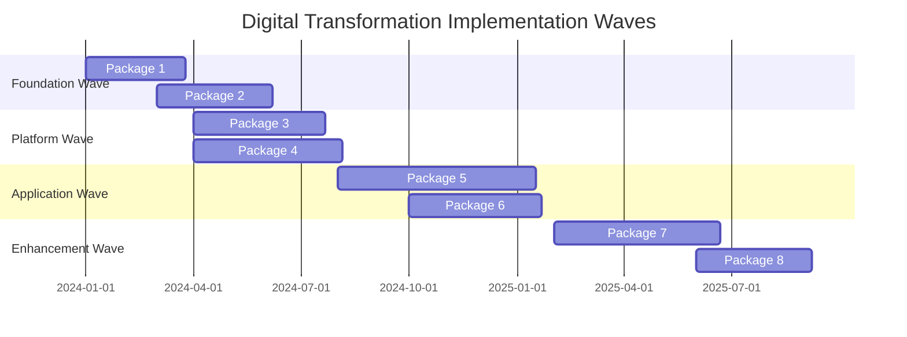
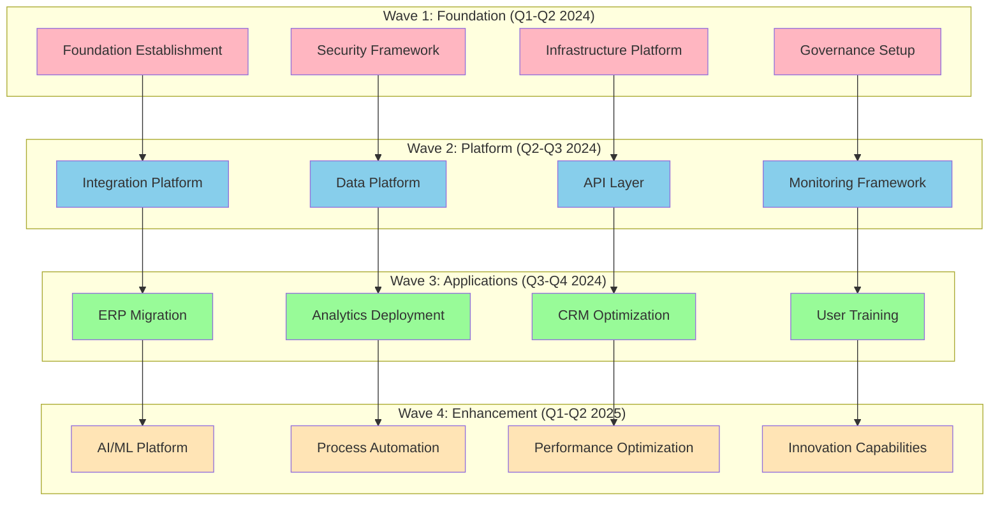
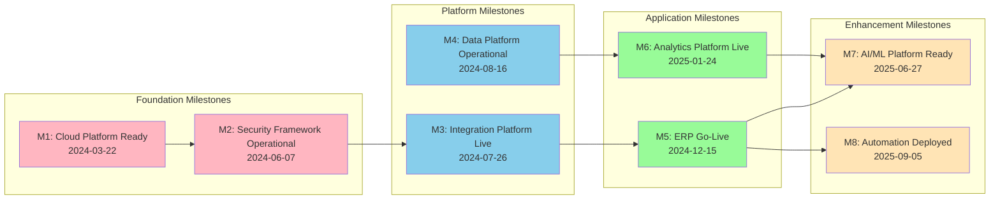
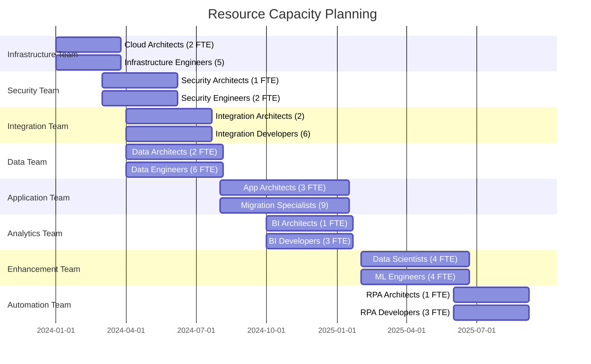
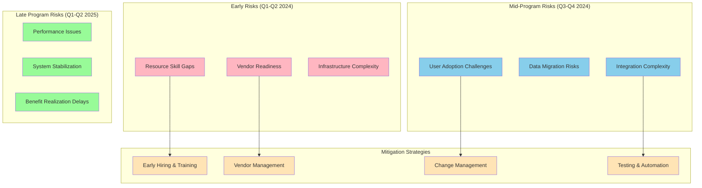
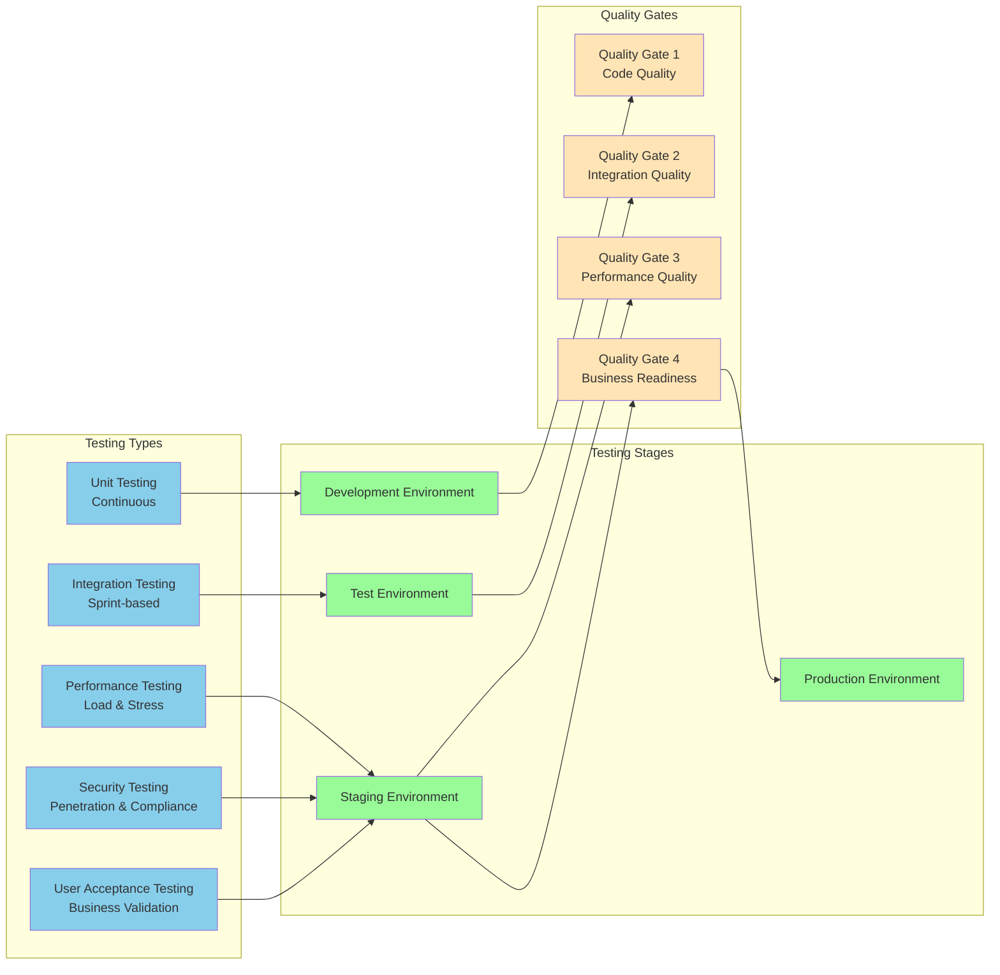
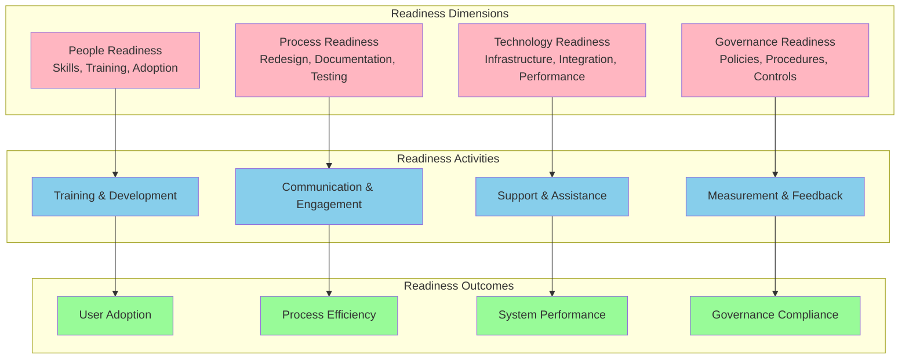
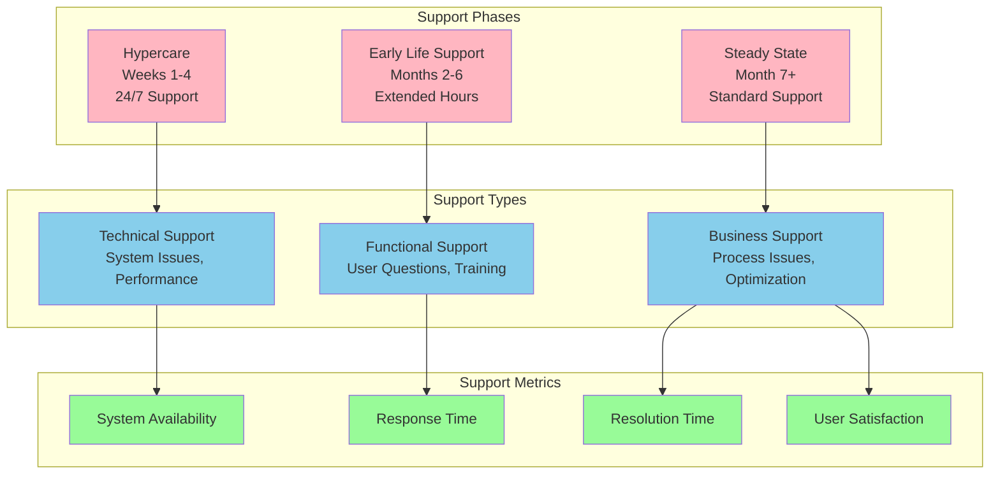

# Implementation Roadmap

## Document Information
- **Document Title:** Implementation Roadmap
- **Document Version:** 1.0
- **Document Date:** September 19, 2025
- **Document Owner:** Program Management Office
- **Approved By:** Executive Steering Committee
- **Review Frequency:** Monthly
- **Next Review:** October 19, 2025

## Executive Summary

This document provides a comprehensive implementation roadmap for the digital transformation initiative, detailing the strategic approach, timeline, milestones, and execution framework for delivering all solution packages and achieving transformation objectives.

### Key Points
- 32-month transformation timeline across 8 implementation packages
- Phased approach with 4 distinct execution waves
- 127 major milestones and 45 critical decision points
- Risk-based sequencing with early value delivery focus
- Integrated change management and business readiness approach

### Recommendations Summary
- Execute Foundation Wave (Packages 1-2) immediately to establish platform
- Implement Platform Wave (Packages 3-4) in parallel for maximum efficiency
- Sequence Application Wave (Package 5-6) for business continuity
- Deploy Enhancement Wave (Packages 7-8) for competitive advantage

## Purpose and Scope

### Document Purpose
Define comprehensive roadmap for implementing the digital transformation initiative, providing detailed timeline, sequencing, dependencies, and execution framework to guide successful transformation delivery.

### Scope
**In Scope:**
- Complete implementation timeline with milestones and dependencies
- Resource allocation and capacity planning across all phases
- Risk management and mitigation strategies throughout execution
- Change management and business readiness activities
- Quality assurance and testing strategies
- Go-live planning and post-implementation support

**Out of Scope:**
- Detailed project work breakdown structures
- Individual resource assignments and job descriptions
- Vendor contract negotiations and commercial terms
- Day-to-day operational procedures

### Objectives
1. Provide clear roadmap for transformation execution
2. Establish realistic timeline with achievable milestones
3. Define resource requirements and capacity needs
4. Identify critical dependencies and sequencing requirements
5. Enable effective program management and tracking

### Success Criteria
- All packages delivered on time and within budget
- Zero critical business disruptions during implementation
- 95% user adoption within 90 days of go-live
- Achievement of projected ROI within 24 months

## Strategic Implementation Approach

### Transformation Waves Overview

### Wave-Based Execution Strategy

## Detailed Implementation Timeline

### Master Timeline with Critical Path

| Phase | Package | Start Date | End Date | Duration | Dependencies | Critical Path |
|-------|---------|------------|----------|----------|--------------|---------------|
| **Wave 1** | | | | | | |
| Foundation | Package 1: Infrastructure | 2024-01-01 | 2024-03-22 | 12 weeks | None | ✓ |
| Foundation | Package 2: Security & Identity | 2024-03-01 | 2024-06-07 | 14 weeks | Package 1 (Week 8) | ✓ |
| **Wave 2** | | | | | | |
| Platform | Package 3: Integration Platform | 2024-04-01 | 2024-07-26 | 16 weeks | Package 1, Package 2 | ✓ |
| Platform | Package 4: Data Platform | 2024-04-01 | 2024-08-16 | 18 weeks | Package 1 | |
| **Wave 3** | | | | | | |
| Applications | Package 5: Core Applications | 2024-08-01 | 2025-01-31 | 24 weeks | Package 2, Package 3 | ✓ |
| Applications | Package 6: Analytics & BI | 2024-10-01 | 2025-01-24 | 16 weeks | Package 4 | |
| **Wave 4** | | | | | | |
| Enhancement | Package 7: Advanced Analytics | 2025-02-01 | 2025-06-27 | 20 weeks | Package 5, Package 6 | |
| Enhancement | Package 8: Process Automation | 2025-06-01 | 2025-09-05 | 14 weeks | Package 5 | |

### Milestone Framework

## Resource Allocation and Capacity Planning

### Resource Requirements by Wave

| Wave | Duration | Peak FTE | Total Effort | Key Roles | Budget |
|------|----------|----------|--------------|-----------|--------|
| **Wave 1: Foundation** | 14 weeks | 14 FTE | 196 person-weeks | Cloud Architects, Security Specialists | $770,000 |
| **Wave 2: Platform** | 18 weeks | 22 FTE | 396 person-weeks | Integration Architects, Data Engineers | $1,200,000 |
| **Wave 3: Applications** | 24 weeks | 26 FTE | 624 person-weeks | Application Specialists, Change Managers | $1,620,000 |
| **Wave 4: Enhancement** | 20 weeks | 18 FTE | 360 person-weeks | Data Scientists, Automation Specialists | $1,130,000 |
| **Total Program** | 32 months | 26 FTE (peak) | 1,576 person-weeks | Cross-functional teams | $4,720,000 |

### Resource Capacity Timeline

### Skill Development and Training Plan

| Skill Area | Current Capacity | Required Capacity | Gap | Training Plan | Timeline |
|------------|------------------|-------------------|-----|---------------|----------|
| Cloud Architecture | 2 FTE | 5 FTE | 3 FTE | Azure certifications, external hiring | 3 months |
| Data Engineering | 3 FTE | 8 FTE | 5 FTE | Internal training, contractors | 2 months |
| Security Specialists | 1 FTE | 4 FTE | 3 FTE | External hiring, certifications | 4 months |
| Integration Development | 4 FTE | 8 FTE | 4 FTE | Platform training, contractors | 2 months |
| Change Management | 1 FTE | 6 FTE | 5 FTE | External consultants, training | 1 month |
| DevOps Engineering | 2 FTE | 6 FTE | 4 FTE | Internal development, hiring | 3 months |

## Risk Management and Mitigation

### Program-Level Risks and Mitigation

| Risk Category | Risk Description | Probability | Impact | Mitigation Strategy | Contingency Plan |
|---------------|------------------|-------------|--------|-------------------|------------------|
| **Technical** | Integration complexity underestimated | High | High | Proof of concepts, early prototyping | Simplified integration, extended timeline |
| **Resource** | Key skill shortages | Medium | High | Early hiring, contractor engagement | External consultants, adjusted scope |
| **Vendor** | Vendor delivery delays | Medium | Medium | Vendor management, alternatives | Alternative vendors, in-house development |
| **Business** | User resistance to change | High | Medium | Comprehensive change management | Extended training, phased adoption |
| **Financial** | Budget overruns | Medium | High | Strict change control, regular reviews | Scope reduction, additional funding |
| **Timeline** | Critical path delays | High | High | Buffer time, parallel execution | Fast-track procedures, resource addition |

### Risk Mitigation Timeline

## Quality Assurance and Testing Strategy

### Testing Framework by Wave

| Testing Phase | Wave 1 | Wave 2 | Wave 3 | Wave 4 |
|---------------|--------|--------|--------|--------|
| **Unit Testing** | Infrastructure components | API endpoints, data pipelines | Application functions | ML models, automation scripts |
| **Integration Testing** | Cloud services | Platform integrations | System integrations | End-to-end workflows |
| **Performance Testing** | Infrastructure capacity | Data processing, API performance | Application performance | Analytics performance |
| **Security Testing** | Security controls | Data security, API security | Application security | AI/ML security |
| **User Acceptance Testing** | Admin interfaces | Developer tools | Business applications | Analytics dashboards |

### Testing Timeline and Approach

## Change Management and Business Readiness

### Change Management Strategy by Wave

| Wave | Change Focus | Key Activities | Success Metrics |
|------|--------------|----------------|-----------------|
| **Wave 1** | Technical Readiness | IT team training, process updates | 100% team certification |
| **Wave 2** | Platform Adoption | Developer training, integration testing | 95% developer competency |
| **Wave 3** | Business Transformation | User training, process redesign | 90% user adoption |
| **Wave 4** | Culture Change | Advanced skills, innovation mindset | 85% engagement score |

### Business Readiness Framework

### Training and Enablement Plan

| Role Group | Training Requirements | Delivery Method | Timeline | Success Criteria |
|------------|----------------------|-----------------|----------|------------------|
| **IT Operations** | Cloud platforms, security tools | Hands-on workshops | Pre-go-live | 100% certification |
| **Developers** | Integration platforms, APIs | Online + labs | Sprint-based | 95% competency |
| **Business Users** | New applications, processes | Classroom + e-learning | Just-in-time | 90% adoption |
| **Power Users** | Advanced features, analytics | Mentoring + practice | Post-go-live | 85% proficiency |
| **Executives** | Strategic benefits, dashboards | Executive briefings | Quarterly | 100% engagement |

## Go-Live Strategy and Post-Implementation

### Phased Go-Live Approach

| Package | Go-Live Strategy | Approach | Risk Level | Support Model |
|---------|------------------|----------|------------|---------------|
| **Package 1-2** | Big Bang | All environments simultaneously | Low | 24/7 monitoring |
| **Package 3-4** | Phased | By integration tier | Medium | Extended support hours |
| **Package 5** | Pilot + Rollout | Department by department | High | Hypercare model |
| **Package 6** | Progressive | Report by report | Low | Standard support |
| **Package 7-8** | Gradual | Feature by feature | Medium | Enhanced monitoring |

### Post-Implementation Support Framework

## Success Metrics and KPIs

### Program Success Metrics

| Category | Metric | Target | Measurement Method | Frequency |
|----------|--------|--------|-------------------|-----------|
| **Delivery** | On-time delivery | 95% of milestones | Project tracking | Weekly |
| **Quality** | Defect density | <2 defects per function point | Testing metrics | Sprint |
| **Budget** | Cost variance | <5% over budget | Financial reporting | Monthly |
| **Adoption** | User adoption rate | >90% within 90 days | User analytics | Weekly |
| **Performance** | System availability | >99.5% | Infrastructure monitoring | Daily |
| **Business** | Process efficiency | >30% improvement | Process metrics | Monthly |
| **ROI** | Return on investment | >150% within 24 months | Financial analysis | Quarterly |

### Benefit Realization Tracking
- **Monthly:** Operational metrics, user adoption, system performance
- **Quarterly:** Financial benefits, business value, strategic progress
- **Annually:** ROI achievement, competitive position, transformation maturity

---
**Document Classification:** Internal  
**Document Location:** Enterprise Architecture Repository  
**Related Documents:** Implementation Packages Definition, Risk Assessment, Migration Strategy