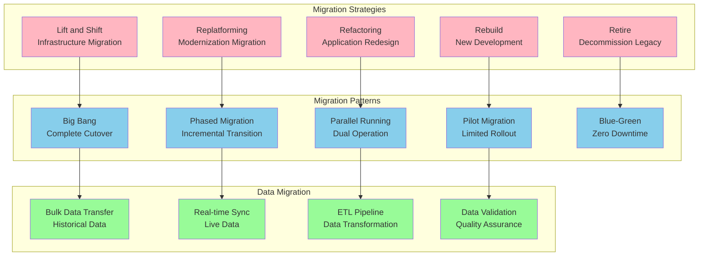
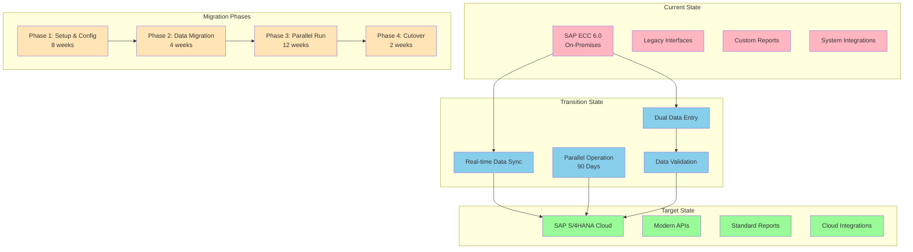
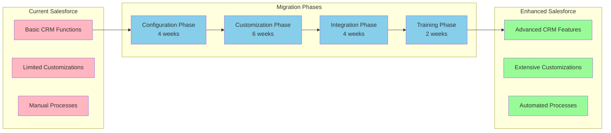
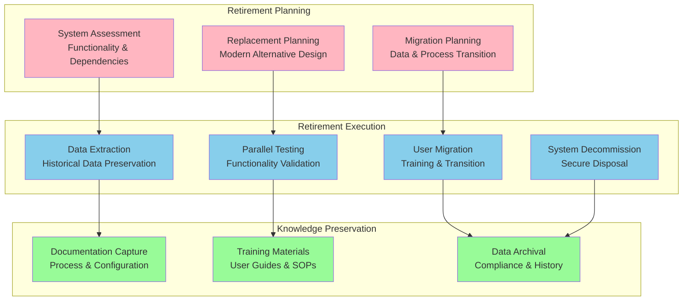
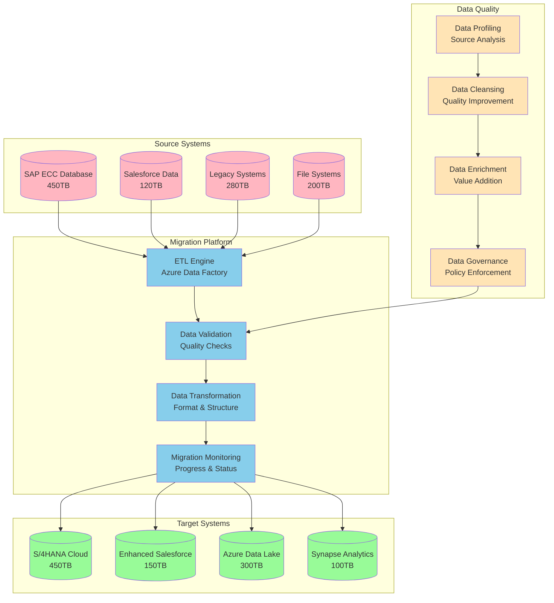
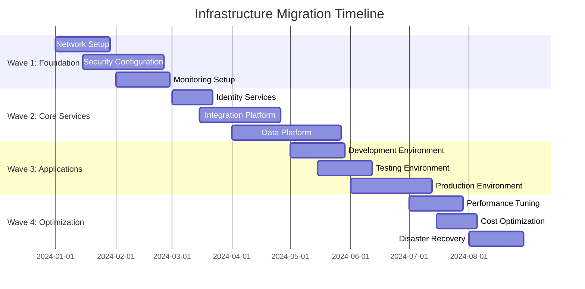
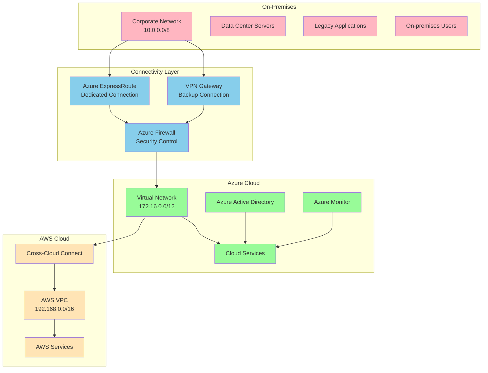
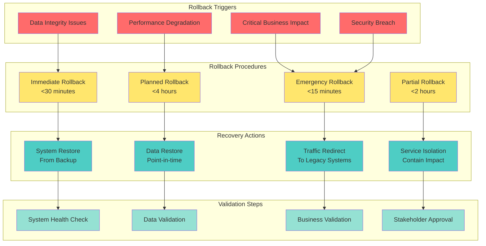
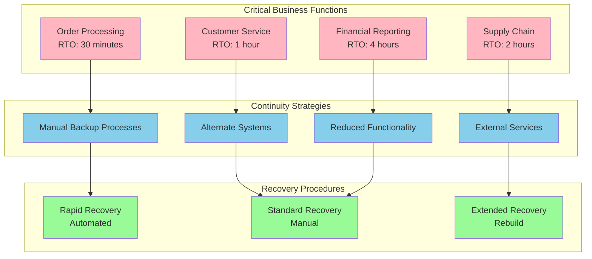

# Migration Strategy Document

## Document Information
- **Document Title:** Migration Strategy Document
- **Document Version:** 1.0
- **Document Date:** September 19, 2025
- **Document Owner:** Migration Planning Office
- **Approved By:** Architecture Review Board
- **Review Frequency:** Bi-weekly
- **Next Review:** October 3, 2025

## Executive Summary

This document defines the comprehensive migration strategy for transitioning from current state architecture to the target digital transformation vision, ensuring minimal business disruption while maximizing value delivery and maintaining operational continuity.

### Key Points
- Multi-phase migration approach spanning 32 months
- Zero-downtime migration strategy for critical business systems
- Data migration strategy handling 850TB of enterprise data
- Legacy system retirement plan for 47 applications
- Business continuity assurance throughout transformation

### Recommendations Summary
- Implement parallel running strategy for critical ERP systems
- Use phased data migration with real-time synchronization
- Deploy blue-green deployment methodology for applications
- Establish comprehensive rollback procedures for all migrations

## Purpose and Scope

### Document Purpose
Define comprehensive strategy for migrating from current state to target architecture, ensuring successful transformation while maintaining business operations, data integrity, and system availability.

### Scope
**In Scope:**
- Application migration strategies and methodologies
- Data migration approaches and data quality assurance
- Infrastructure migration and cloud adoption strategies
- Business process transition and change management
- Legacy system retirement and decommissioning
- Risk mitigation and rollback procedures

**Out of Scope:**
- Detailed technical implementation procedures
- Vendor-specific migration tools configuration
- Individual data mapping specifications
- User training content and materials

### Objectives
1. Define migration approach that minimizes business risk and disruption
2. Establish data migration strategy ensuring integrity and continuity
3. Create application migration methodology with rollback capabilities
4. Develop infrastructure migration plan with performance assurance
5. Plan legacy system retirement with knowledge preservation

### Success Criteria
- Zero critical business disruptions during migration
- 99.9% data integrity maintained throughout migration
- <2 hour downtime for any individual system migration
- 100% rollback capability for all migration phases
- Complete legacy system retirement within 18 months post-migration

## Migration Methodology Framework

### Migration Approach Overview

### Migration Decision Matrix

| System Category | Migration Strategy | Pattern | Rationale | Risk Level |
|-----------------|-------------------|---------|-----------|------------|
| **Infrastructure** | Lift and Shift | Big Bang | Standard infrastructure patterns | Low |
| **Security Systems** | Replatform | Phased | Security continuity critical | Medium |
| **Integration Platform** | Rebuild | Blue-Green | Modern architecture required | Medium |
| **ERP System** | Replatform | Parallel | Business continuity essential | High |
| **CRM System** | Refactor | Phased | Moderate customization needed | Medium |
| **Analytics Platform** | Rebuild | Pilot | New capabilities required | Low |
| **Legacy Applications** | Retire | Phased | Functionality replaced | Low |

## Application Migration Strategy

### ERP System Migration (SAP S/4HANA)

#### Migration Approach: Parallel Running Strategy

#### ERP Migration Timeline and Activities

| Phase | Duration | Key Activities | Success Criteria | Rollback Plan |
|-------|----------|----------------|------------------|---------------|
| **Phase 1: Setup** | 8 weeks | System provisioning, basic configuration | System operational, connectivity established | Decommission new system |
| **Phase 2: Data Migration** | 4 weeks | Historical data transfer, validation | 100% data integrity validated | Restore from backup |
| **Phase 3: Parallel Run** | 12 weeks | Dual operation, process validation | Business processes confirmed | Continue legacy operation |
| **Phase 4: Cutover** | 2 weeks | Final cutover, legacy decommission | Full business operation | Immediate rollback capability |

### CRM System Migration (Salesforce Enhancement)

#### Migration Approach: Phased Enhancement Strategy

### Legacy Application Retirement Strategy

#### Retirement Prioritization Matrix

| Application | Business Criticality | Technical Debt | Retirement Priority | Timeline | Replacement |
|-------------|---------------------|----------------|-------------------|----------|-------------|
| **Legacy Inventory System** | Low | High | P1 - Immediate | Q1 2024 | ERP Module |
| **Custom Reporting Tool** | Medium | High | P1 - Immediate | Q2 2024 | Power BI |
| **File Sharing System** | Low | Medium | P2 - Short-term | Q3 2024 | SharePoint |
| **Legacy Portal** | Medium | High | P2 - Short-term | Q4 2024 | Modern Portal |
| **Spreadsheet Applications** | Low | Low | P3 - Medium-term | Q1 2025 | Process Automation |
| **Legacy Integration Tools** | High | High | P2 - Short-term | Q2 2024 | Integration Platform |

#### Legacy Retirement Process

## Data Migration Strategy

### Data Migration Framework

#### Data Migration Architecture

### Data Migration Phases and Timeline

| Phase | Duration | Data Volume | Strategy | Success Criteria |
|-------|----------|-------------|----------|------------------|
| **Phase 1: Historical Data** | 6 weeks | 600TB | Bulk transfer | 100% data transferred, validated |
| **Phase 2: Master Data** | 4 weeks | 50TB | Synchronized migration | 99.9% accuracy achieved |
| **Phase 3: Transactional Data** | 8 weeks | 200TB | Real-time sync | <1 hour lag time |
| **Phase 4: Final Cutover** | 1 week | Delta | Final synchronization | Zero data loss |

### Data Quality Assurance Framework

| Quality Dimension | Measurement Method | Target | Validation Process |
|-------------------|-------------------|--------|--------------------|
| **Completeness** | Record count validation | 100% | Automated reconciliation |
| **Accuracy** | Business rule validation | 99.9% | Sampling and verification |
| **Consistency** | Cross-system validation | 99.5% | Reference data checks |
| **Timeliness** | Freshness validation | <1 hour | Real-time monitoring |
| **Validity** | Format and range checks | 99.9% | Automated validation rules |

## Infrastructure Migration Strategy

### Cloud Migration Approach

#### Infrastructure Migration Waves

### Cloud Migration Strategy by Component

| Component | Current State | Target State | Migration Strategy | Timeline |
|-----------|---------------|--------------|-------------------|----------|
| **Compute** | Physical servers | Azure VMs + Containers | Lift and shift + modernization | 12 weeks |
| **Storage** | SAN storage | Azure Storage + managed disks | Data migration + sync | 8 weeks |
| **Network** | On-premises LAN | Azure Virtual Network | Hybrid connectivity | 6 weeks |
| **Security** | Perimeter security | Zero trust model | Security transformation | 14 weeks |
| **Backup** | Tape backup | Cloud backup | Service migration | 4 weeks |
| **Monitoring** | Legacy tools | Azure Monitor | Tool replacement | 6 weeks |

### Hybrid Connectivity Strategy

## Risk Mitigation and Rollback Strategy

### Migration Risk Categories and Mitigation

| Risk Category | Specific Risks | Probability | Impact | Mitigation Strategy |
|---------------|----------------|-------------|--------|-------------------|
| **Data Loss** | Corruption, incomplete transfer | Low | Critical | Multiple backups, validation |
| **Business Disruption** | Extended downtime, process failure | Medium | High | Parallel running, phased approach |
| **Performance Issues** | System slowdown, capacity limits | Medium | Medium | Load testing, capacity planning |
| **Integration Failures** | API failures, connectivity issues | High | Medium | Fallback mechanisms, monitoring |
| **User Adoption** | Resistance, training gaps | High | Medium | Change management, support |
| **Technical Debt** | Legacy dependencies, compatibility | Medium | High | Technical assessment, modernization |

### Comprehensive Rollback Framework

### Rollback Readiness Assessment

| System Component | Rollback Method | Recovery Time | Data Loss Risk | Validation Required |
|------------------|----------------|---------------|----------------|-------------------|
| **Infrastructure** | Infrastructure as Code | 30 minutes | None | Health checks |
| **Applications** | Blue-green deployment | 15 minutes | None | Functional testing |
| **Data** | Point-in-time restore | 2 hours | <1 hour | Data validation |
| **Integrations** | Circuit breaker | 5 minutes | None | Connectivity tests |
| **Security** | Policy rollback | 10 minutes | None | Security validation |

## Business Continuity and Communication

### Business Continuity Framework

#### Continuity Planning by Business Function

### Communication Strategy

| Stakeholder Group | Communication Method | Frequency | Content Focus |
|------------------|---------------------|-----------|---------------|
| **Executive Leadership** | Executive dashboard | Weekly | Progress, risks, decisions |
| **Business Users** | Email updates, town halls | Bi-weekly | Changes, training, support |
| **IT Teams** | Slack channels, standups | Daily | Technical progress, issues |
| **External Partners** | Portal updates | Monthly | Integration impacts |
| **Customers** | Website notices | As needed | Service impacts |

### Success Metrics and KPIs

| Category | Metric | Target | Measurement |
|----------|--------|--------|-------------|
| **Migration Success** | Systems migrated on time | 95% | Project tracking |
| **Data Quality** | Data integrity maintained | 99.9% | Automated validation |
| **Business Continuity** | Unplanned downtime | <2 hours total | Monitoring |
| **User Adoption** | User acceptance | 90% within 30 days | Surveys |
| **Performance** | System performance | Baseline +10% | Performance monitoring |
| **Cost** | Migration budget variance | <5% | Financial tracking |

---
**Document Classification:** Internal  
**Document Location:** Enterprise Architecture Repository  
**Related Documents:** Implementation Roadmap, Risk Assessment, Business Continuity Plan