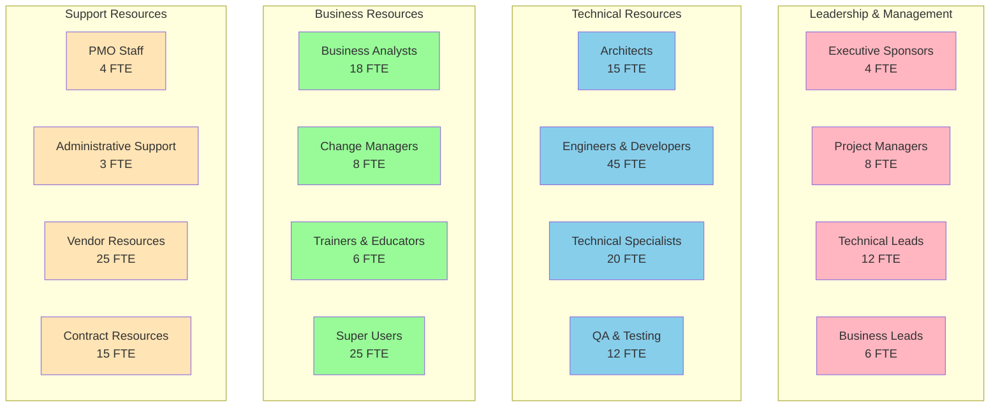
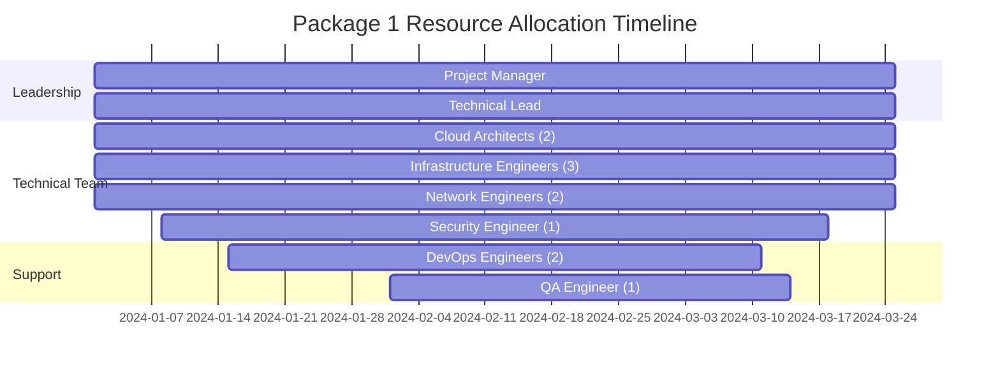
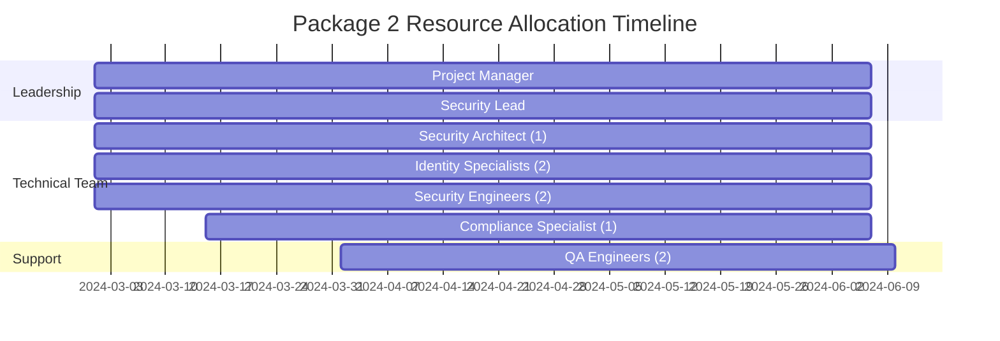
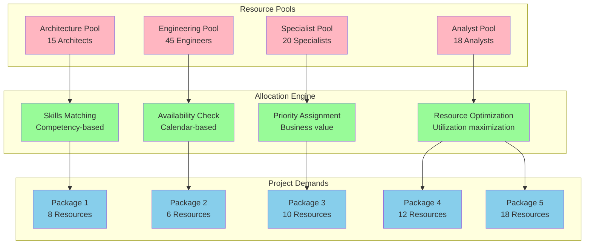
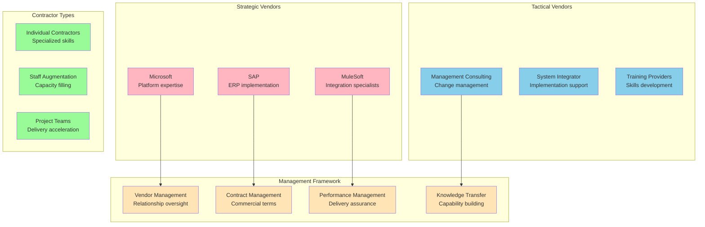
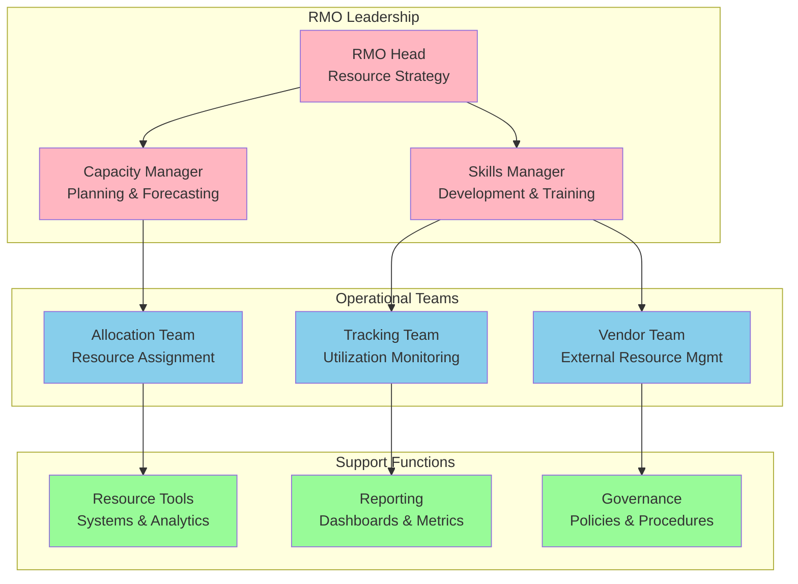

# Resource Allocation Plan

## Document Information
- **Document Title:** Resource Allocation Plan
- **Document Version:** 1.0
- **Document Date:** September 19, 2025
- **Document Owner:** Resource Management Office
- **Approved By:** Program Management Office
- **Review Frequency:** Weekly
- **Next Review:** September 26, 2025

## Executive Summary

This document provides a comprehensive resource allocation plan for the digital transformation initiative, detailing human resources, skills requirements, capacity planning, and resource optimization strategies across all implementation packages to ensure successful project delivery.

### Key Points
- 126 total FTE requirement across 32-month implementation
- 15 specialized skill categories with defined competency levels
- Dynamic resource allocation model with 85% utilization target
- Cross-project resource sharing and optimization framework
- Comprehensive training and development program

### Recommendations Summary
- Implement skills-based resource allocation matrix
- Establish resource pool management with cross-project flexibility
- Deploy resource forecasting and capacity planning tools
- Create centers of excellence for specialized skills

## Purpose and Scope

### Document Purpose
Define comprehensive resource allocation strategy for the digital transformation initiative, ensuring optimal resource utilization, skill development, and capacity management across all projects and phases.

### Scope
**In Scope:**
- Human resource allocation across all 8 implementation packages
- Skills assessment and gap analysis
- Capacity planning and utilization optimization
- Training and development programs
- Resource forecasting and demand management
- Vendor and contractor resource management

**Out of Scope:**
- Individual compensation and salary structures
- Detailed job descriptions and role specifications
- Performance management and evaluation processes
- Facility and infrastructure resource allocation

### Objectives
1. Optimize resource allocation across all transformation projects
2. Ensure adequate skilled resources are available when needed
3. Minimize resource conflicts and maximize utilization
4. Develop internal capabilities through training and mentoring
5. Establish effective resource governance and management processes

### Success Criteria
- 85% average resource utilization across all projects
- Zero critical projects delayed due to resource constraints
- 90% internal skills availability by end of program
- <10% resource-related budget variance
- 95% resource satisfaction and engagement scores

## Resource Allocation Framework

### Resource Categories and Structure


### Resource Allocation Model

| Resource Type | Total Demand | Internal Available | External Required | Allocation Strategy |
|---------------|--------------|-------------------|-------------------|-------------------|
| **Executive Sponsors** | 4 FTE | 4 FTE | 0 FTE | Dedicated assignment |
| **Project Managers** | 8 FTE | 6 FTE | 2 FTE | Mix of internal and external |
| **Solution Architects** | 15 FTE | 8 FTE | 7 FTE | Skills-based allocation |
| **Cloud Engineers** | 20 FTE | 12 FTE | 8 FTE | Capability development |
| **Data Engineers** | 15 FTE | 8 FTE | 7 FTE | Specialized contractors |
| **Integration Developers** | 10 FTE | 7 FTE | 3 FTE | Internal with augmentation |
| **Business Analysts** | 18 FTE | 15 FTE | 3 FTE | Business unit allocation |
| **Change Managers** | 8 FTE | 3 FTE | 5 FTE | External consulting support |
| **QA Engineers** | 12 FTE | 9 FTE | 3 FTE | Mixed approach |
| **Total** | **126 FTE** | **84 FTE** | **42 FTE** | **67% Internal / 33% External** |

## Skills Assessment and Gap Analysis

### Current Skills Inventory

| Skill Category | Required Level | Current Capacity | Gap Analysis | Development Strategy |
|----------------|---------------|------------------|--------------|-------------------|
| **Cloud Architecture** | Expert (5) | Intermediate (3) | 2 levels | Certification + mentoring |
| **Data Engineering** | Advanced (4) | Beginner (2) | 2 levels | Training + external hire |
| **Security Engineering** | Expert (5) | Advanced (4) | 1 level | Specialized training |
| **Integration Development** | Advanced (4) | Intermediate (3) | 1 level | Platform-specific training |
| **DevOps Engineering** | Advanced (4) | Intermediate (3) | 1 level | Tool-specific training |
| **Business Analysis** | Advanced (4) | Advanced (4) | 0 levels | Maintain current level |
| **Change Management** | Expert (5) | Beginner (2) | 3 levels | External consultants |
| **Project Management** | Advanced (4) | Advanced (4) | 0 levels | Methodology training |

### Skills Development Matrix

```mermaid
graph TB
    subgraph "Technical Skills"
        CLOUD[Cloud Platforms<br/>Azure, AWS, Multi-cloud]
        DATA[Data Engineering<br/>ETL, Analytics, ML]
        SECURITY[Security<br/>Identity, Compliance, Monitoring]
        INTEGRATION[Integration<br/>APIs, ESB, Messaging]
        DEVOPS[DevOps<br/>CI/CD, Infrastructure as Code]
    end
    
    subgraph "Business Skills"
        ANALYSIS[Business Analysis<br/>Requirements, Process Design]
        CHANGE[Change Management<br/>Adoption, Training, Communication]
        PROJECT[Project Management<br/>Agile, Waterfall, Hybrid]
        DOMAIN[Domain Expertise<br/>Industry, Functional Knowledge]
    end
    
    subgraph "Development Approach"
        INTERNAL_TRAINING[Internal Training<br/>Courses, Workshops, Labs]
        EXTERNAL_TRAINING[External Training<br/>Vendor, University, Bootcamp]
        MENTORING[Mentoring<br/>Senior-Junior Pairing]
        CERTIFICATION[Certification<br/>Industry Standards]
        HIRING[Strategic Hiring<br/>Key Skills Acquisition]
    end
    
    CLOUD --> EXTERNAL_TRAINING
    DATA --> HIRING
    SECURITY --> CERTIFICATION
    INTEGRATION --> INTERNAL_TRAINING
    DEVOPS --> MENTORING
    
    ANALYSIS --> INTERNAL_TRAINING
    CHANGE --> EXTERNAL_TRAINING
    PROJECT --> CERTIFICATION
    DOMAIN --> MENTORING
    
    classDef technical fill:#87CEEB
    classDef business fill:#98FB98
    classDef development fill:#FFE4B5
    
    class CLOUD,DATA,SECURITY,INTEGRATION,DEVOPS technical
    class ANALYSIS,CHANGE,PROJECT,DOMAIN business
    class INTERNAL_TRAINING,EXTERNAL_TRAINING,MENTORING,CERTIFICATION,HIRING development
```


### Training and Development Program

| Training Program | Target Audience | Duration | Delivery Method | Expected Outcome |
|------------------|----------------|----------|-----------------|-------------------|
| **Azure Fundamentals** | All technical staff | 40 hours | Online + labs | Azure certification |
| **Data Engineering Bootcamp** | Data team | 80 hours | Intensive workshop | Advanced data skills |
| **Security Awareness** | All staff | 16 hours | E-learning | Security consciousness |
| **Agile Project Management** | Project managers | 32 hours | Classroom + coaching | Agile certification |
| **Change Management** | Business leads | 24 hours | Workshop + mentoring | Change capability |
| **API Development** | Developers | 32 hours | Hands-on labs | Integration skills |
| **Business Analysis** | Analysts | 40 hours | Case studies | BA certification |
| **Leadership Development** | Team leads | 48 hours | Executive program | Leadership skills |

## Resource Allocation by Project Phase

### Wave 1: Foundation (Q1-Q2 2024)

#### Package 1: Infrastructure Foundation


#### Package 2: Security & Identity


### Wave 2: Platform (Q2-Q3 2024)

#### Resource Overlap and Optimization
| Resource | Package 3 | Package 4 | Overlap Period | Optimization Strategy |
|----------|-----------|-----------|----------------|----------------------|
| **Integration Architect** | 100% | 20% | 8 weeks | Design review and consultation |
| **Data Architect** | 20% | 100% | 12 weeks | Cross-platform architecture |
| **Cloud Engineers** | 40% | 60% | 16 weeks | Shared infrastructure team |
| **QA Engineers** | 50% | 50% | 10 weeks | Integrated testing approach |

### Wave 3: Applications (Q3-Q4 2024)

#### Package 5: Core Applications Migration - Resource Intensive Phase
```mermaid
graph TB
    subgraph "SAP Migration Team"
        SAP_PM[SAP Project Manager<br/>24 weeks]
        SAP_ARCH[SAP Architect<br/>24 weeks]
        SAP_FUNC[Functional Consultants (4)<br/>20 weeks]
        SAP_TECH[Technical Consultants (3)<br/>16 weeks]
    end
    
    subgraph "CRM Enhancement Team"
        CRM_LEAD[CRM Lead<br/>16 weeks]
        SF_ADMIN[Salesforce Admin (2)<br/>16 weeks]
        SF_DEV[Salesforce Developers (2)<br/>12 weeks]
    end
    
    subgraph "Change Management Team"
        CHANGE_MGR[Change Manager<br/>24 weeks]
        TRAINERS[Trainers (3)<br/>16 weeks]
        SUPER_USERS[Super Users (12)<br/>8 weeks]
    end
    
    subgraph "Support Teams"
        DATA_MIGRATION[Data Migration (4)<br/>12 weeks]
        TESTING[Testing Team (6)<br/>20 weeks]
        CUTOVER[Cutover Team (8)<br/>4 weeks]
    end
    
    classDef sap fill:#FFB6C1
    classDef crm fill:#87CEEB
    classDef change fill:#98FB98
    classDef support fill:#FFE4B5
    
    class SAP_PM,SAP_ARCH,SAP_FUNC,SAP_TECH sap
    class CRM_LEAD,SF_ADMIN,SF_DEV crm
    class CHANGE_MGR,TRAINERS,SUPER_USERS change
    class DATA_MIGRATION,TESTING,CUTOVER support
```

### Wave 4: Enhancement (Q1-Q2 2025)

#### Specialized Resource Requirements
| Specialty | Package 7 (AI/ML) | Package 8 (Automation) | Shared Resources | Total Need |
|-----------|-------------------|------------------------|------------------|------------|
| **Data Scientists** | 4 FTE | 1 FTE | Analytics expertise | 5 FTE |
| **ML Engineers** | 4 FTE | 0 FTE | Model deployment | 4 FTE |
| **RPA Developers** | 0 FTE | 3 FTE | Process automation | 3 FTE |
| **Process Analysts** | 1 FTE | 2 FTE | Process optimization | 3 FTE |
| **AI Ethics Specialist** | 1 FTE | 0 FTE | Governance | 1 FTE |

## Resource Optimization Strategies

### Cross-Project Resource Sharing Model


### Resource Utilization Optimization

| Optimization Strategy | Description | Expected Benefit | Implementation |
|----------------------|-------------|------------------|----------------|
| **Skills-Based Allocation** | Match resources based on competencies | 20% efficiency gain | Resource management system |
| **Cross-Project Sharing** | Share specialists across projects | 15% cost reduction | Shared resource pools |
| **Just-in-Time Staffing** | Allocate resources when needed | 25% utilization improvement | Dynamic scheduling |
| **Knowledge Transfer** | Rotate resources for skill building | 30% internal capability increase | Mentoring programs |
| **Vendor Optimization** | Strategic use of external resources | 10% cost optimization | Vendor management |

### Capacity Planning and Forecasting

| Period | Total Demand | Internal Capacity | External Need | Utilization Target |
|--------|--------------|-------------------|---------------|-------------------|
| **Q1 2024** | 45 FTE | 38 FTE | 7 FTE | 85% |
| **Q2 2024** | 62 FTE | 48 FTE | 14 FTE | 87% |
| **Q3 2024** | 78 FTE | 58 FTE | 20 FTE | 89% |
| **Q4 2024** | 95 FTE | 68 FTE | 27 FTE | 88% |
| **Q1 2025** | 72 FTE | 72 FTE | 15 FTE | 86% |
| **Q2 2025** | 58 FTE | 65 FTE | 8 FTE | 84% |

## Vendor and Contractor Management

### External Resource Strategy

#### Vendor Categories and Management Approach


### Contractor Integration Framework

| Integration Aspect | Approach | Success Criteria | Management Process |
|-------------------|----------|------------------|-------------------|
| **Onboarding** | Standardized 2-week process | 100% completion | HR + IT coordination |
| **Knowledge Transfer** | Mandatory documentation | All deliverables captured | Weekly reviews |
| **Quality Standards** | Same as internal staff | Meet all KPIs | Regular assessments |
| **Cultural Integration** | Team inclusion activities | 85% satisfaction score | Team lead responsibility |
| **Exit Planning** | 30-day knowledge transfer | Zero knowledge loss | Structured handover |

## Resource Governance and Management

### Resource Management Office (RMO) Structure


### Resource Performance Metrics

| Metric Category | KPI | Target | Measurement Method | Frequency |
|-----------------|-----|--------|-------------------|-----------|
| **Utilization** | Average resource utilization | 85% | Time tracking system | Weekly |
| **Availability** | Resource availability for critical projects | 95% | Resource planning tool | Daily |
| **Skills Development** | Internal skills capability improvement | 30% annually | Skills assessments | Quarterly |
| **Satisfaction** | Resource satisfaction score | >80% | Employee surveys | Quarterly |
| **Cost Efficiency** | Cost per delivered outcome | Baseline -15% | Financial analysis | Monthly |
| **Quality** | Resource-related defect rate | <2% | Quality metrics | Sprint-based |

### Resource Allocation Decision Framework

| Decision Level | Authority | Scope | Approval Process | Escalation |
|----------------|-----------|-------|------------------|------------|
| **Operational** | Project Manager | Day-to-day allocation | Team lead approval | Resource Manager |
| **Tactical** | Resource Manager | Cross-project allocation | RMO approval | Program Manager |
| **Strategic** | Program Manager | Major resource changes | PMO + Sponsor approval | Executive Sponsor |
| **Executive** | Executive Sponsor | Budget and strategy changes | Steering committee | Board level |

## Success Metrics and KPIs

### Resource Management Success Framework

| Success Dimension | Primary Metrics | Targets | Benefits |
|------------------|----------------|---------|----------|
| **Efficiency** | Resource utilization, cost per outcome | 85% utilization, 15% cost reduction | Optimized resource investment |
| **Effectiveness** | Project delivery, quality metrics | 95% on-time, <2% defects | Successful project outcomes |
| **Development** | Skills improvement, internal capability | 30% skills growth, 90% internal staffing | Enhanced organizational capability |
| **Satisfaction** | Employee satisfaction, retention | >80% satisfaction, <10% turnover | Engaged and motivated workforce |

### Monthly Resource Review Process
1. **Week 1:** Resource utilization analysis and capacity forecasting
2. **Week 2:** Skills gap assessment and training plan updates
3. **Week 3:** Vendor performance review and contract optimization
4. **Week 4:** Strategic resource planning and allocation decisions

---
**Document Classification:** Internal  
**Document Location:** Enterprise Architecture Repository  
**Related Documents:** Implementation Roadmap, Project Charters, Budget Planning Document