# Timeline and Milestone Plan

## Document Information
- **Document Title:** Enterprise Architecture Migration Timeline and Milestone Plan
- **Document Version:** 1.0
- **Document Date:** 2024-12-19
- **Document Owner:** Program Management Office
- **Approved By:** CTO / Program Sponsor
- **Review Frequency:** Weekly during active phases
- **Next Review:** 2025-01-05

## Executive Summary

This document defines the comprehensive timeline and milestone framework for the enterprise architecture migration initiative. The program spans 32 months across 4 major waves, with 47 key milestones and 156 deliverables scheduled for systematic delivery.

### Key Points
- **Total Duration:** 32 months (January 2025 - August 2027)
- **Major Waves:** 4 implementation waves with parallel execution streams
- **Critical Milestones:** 47 major milestones with clear success criteria
- **Go-Live Dates:** Phased rollout starting Month 12 through Month 28
- **Completion Target:** August 2027 with 3-month optimization period

### Timeline Overview

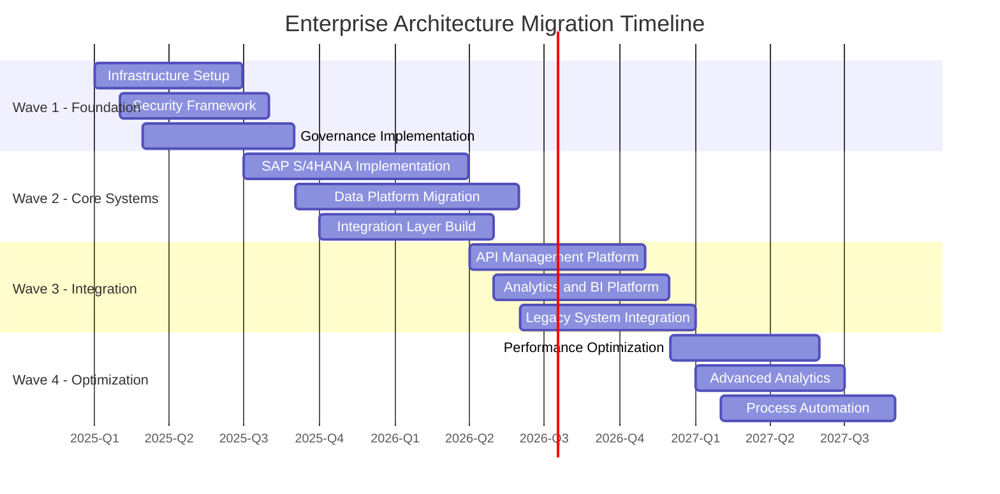

## Purpose and Scope

### Document Purpose
Define detailed timeline, milestone framework, dependencies, and success criteria for the enterprise architecture migration initiative aligned with TOGAF ADM Phase F requirements.

### Scope
**In Scope:**
- Comprehensive project timeline across all workstreams
- Major milestone definitions and success criteria
- Critical path analysis and dependency management
- Resource scheduling and capacity planning
- Risk-based schedule contingencies
- Change control and baseline management

**Out of Scope:**
- Detailed task-level scheduling (managed in project tools)
- Operational maintenance schedules
- Business continuity planning
- Individual performance management

## Master Timeline Architecture

### Timeline Planning Approach

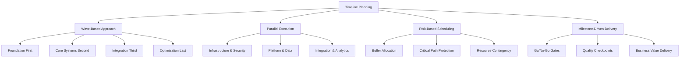

## Wave 1: Foundation (Months 1-8)

### Wave 1 Overview
**Duration:** January 2025 - August 2025 (8 months)  
**Primary Focus:** Infrastructure, security, and governance foundation  
**Success Criteria:** Secure, scalable platform ready for core system implementation

### Wave 1 Detailed Timeline

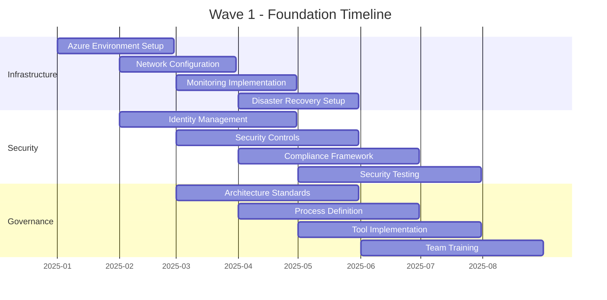

### Wave 1 Key Milestones

| Milestone | Target Date | Success Criteria | Dependencies | Risk Level |
|-----------|-------------|------------------|--------------|------------|
| M1.1 - Azure Foundation Complete | 2025-02-28 | Infrastructure deployed, tested | Vendor contracts | Low |
| M1.2 - Security Framework Active | 2025-05-31 | All security controls operational | Infrastructure | Medium |
| M1.3 - Governance Processes Live | 2025-06-30 | Standards published, tools deployed | Team training | Low |
| M1.4 - Wave 1 Go-Live Ready | 2025-08-31 | All foundation components certified | All previous | Medium |

### Wave 1 Critical Dependencies

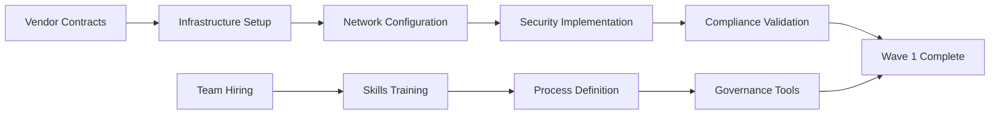

## Wave 2: Core Systems (Months 7-15)

### Wave 2 Overview
**Duration:** July 2025 - March 2026 (9 months)  
**Primary Focus:** SAP S/4HANA implementation and core data platform migration  
**Success Criteria:** Production-ready ERP and data platforms with full functionality

### Wave 2 Detailed Timeline

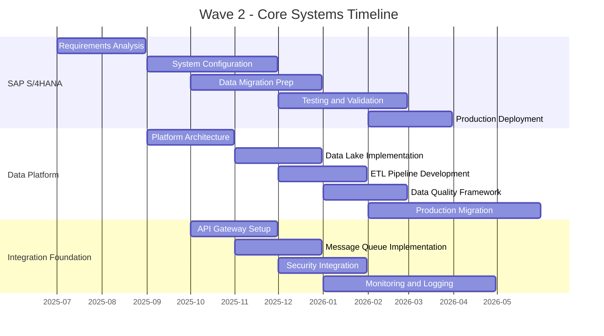

### Wave 2 Key Milestones

| Milestone | Target Date | Success Criteria | Dependencies | Risk Level |
|-----------|-------------|------------------|--------------|------------|
| M2.1 - SAP Foundation Ready | 2025-09-30 | Requirements approved, environment configured | Wave 1 complete | Medium |
| M2.2 - Data Platform MVP | 2025-12-31 | Core data lake operational | Infrastructure | High |
| M2.3 - Integration Layer Active | 2026-01-31 | API gateway and messaging ready | Security framework | Medium |
| M2.4 - SAP Go-Live | 2026-03-31 | SAP production deployment successful | Data migration | High |
| M2.5 - Wave 2 Production Ready | 2026-04-30 | All core systems operational | Testing complete | High |

### Wave 2 Critical Path Analysis

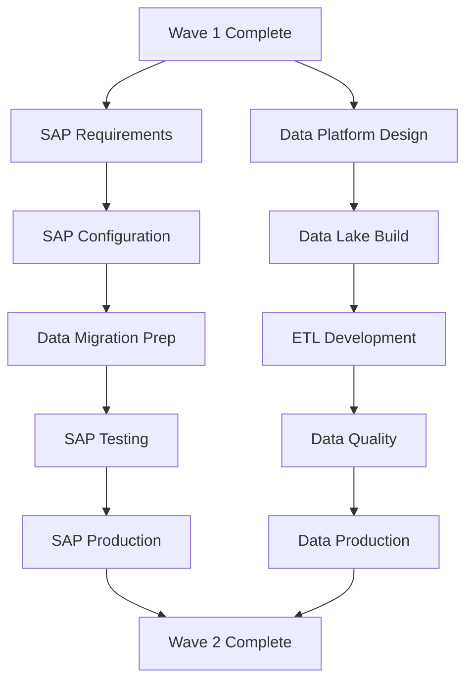

## Wave 3: Integration (Months 16-24)

### Wave 3 Overview
**Duration:** April 2026 - December 2026 (9 months)  
**Primary Focus:** System integration, analytics platform, and legacy modernization  
**Success Criteria:** Fully integrated ecosystem with comprehensive analytics capabilities

### Wave 3 Detailed Timeline

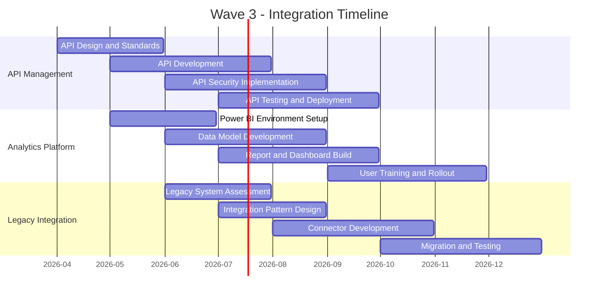

### Wave 3 Key Milestones

| Milestone | Target Date | Success Criteria | Dependencies | Risk Level |
|-----------|-------------|------------------|--------------|------------|
| M3.1 - API Framework Complete | 2026-06-30 | API standards and gateway operational | Wave 2 systems | Medium |
| M3.2 - Analytics Platform Live | 2026-08-31 | Power BI environment with core reports | Data platform | Medium |
| M3.3 - Legacy Integration Ready | 2026-09-30 | Integration patterns validated | API framework | High |
| M3.4 - Full System Integration | 2026-11-30 | All systems integrated and tested | All components | High |
| M3.5 - Wave 3 Business Ready | 2026-12-31 | End-to-end processes operational | User training | Medium |

## Wave 4: Optimization (Months 25-32)

### Wave 4 Overview
**Duration:** January 2027 - August 2027 (8 months)  
**Primary Focus:** Performance optimization, advanced analytics, and process automation  
**Success Criteria:** Optimized, automated systems delivering maximum business value

### Wave 4 Detailed Timeline

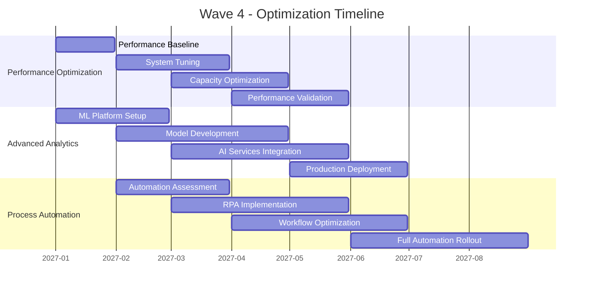

### Wave 4 Key Milestones

| Milestone | Target Date | Success Criteria | Dependencies | Risk Level |
|-----------|-------------|------------------|--------------|------------|
| M4.1 - Performance Baseline | 2027-02-28 | Performance metrics established | Wave 3 complete | Low |
| M4.2 - ML Platform Operational | 2027-04-30 | Machine learning models deployed | Data platform | Medium |
| M4.3 - Automation Framework Live | 2027-06-30 | Process automation implemented | System integration | Medium |
| M4.4 - Optimization Complete | 2027-08-31 | All optimization targets achieved | All components | Low |

## Master Milestone Framework

### Program-Level Milestones

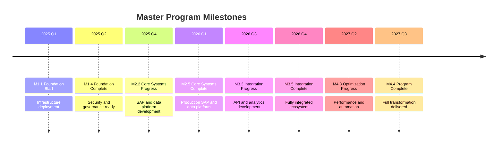

### Milestone Success Criteria Matrix

| Milestone Category | Technical Criteria | Business Criteria | Quality Criteria |
|-------------------|-------------------|-------------------|------------------|
| **Foundation** | Infrastructure deployed | Security compliance | Performance targets met |
| **Core Systems** | Systems operational | Business processes enabled | Data quality validated |
| **Integration** | APIs functional | End-to-end workflows | Integration testing passed |
| **Optimization** | Performance optimized | Automation delivered | User satisfaction achieved |

## Critical Path and Dependencies

### Program Critical Path

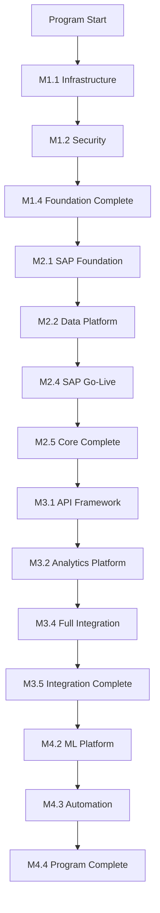

### Inter-Wave Dependencies

| Dependency Type | From Wave | To Wave | Description | Impact |
|-----------------|-----------|---------|-------------|--------|
| **Technical** | W1 | W2 | Infrastructure foundation | Critical |
| **Data** | W2 | W3 | Core data platform | Critical |
| **Integration** | W3 | W4 | System connectivity | High |
| **Process** | W2 | W4 | Business process stability | Medium |
| **Security** | W1 | All | Security framework | Critical |

## Risk-Based Schedule Management

### Schedule Risk Assessment

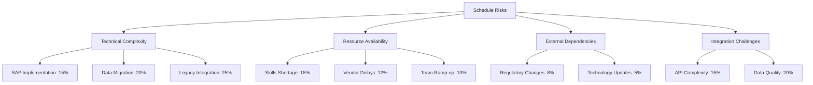

### Schedule Contingency Planning

| Risk Factor | Probability | Impact | Mitigation | Buffer Allocation |
|-------------|-------------|--------|------------|------------------|
| SAP Implementation Delays | 30% | 3 months | Parallel workstreams | 4 weeks |
| Data Migration Issues | 25% | 2 months | Phased migration | 3 weeks |
| Resource Availability | 35% | 1.5 months | Contractor backup | 2 weeks |
| Integration Complexity | 20% | 2 months | Proof of concepts | 3 weeks |
| Legacy System Issues | 15% | 1 month | Alternative approaches | 2 weeks |

## Resource Scheduling and Capacity

### Resource Allocation Timeline

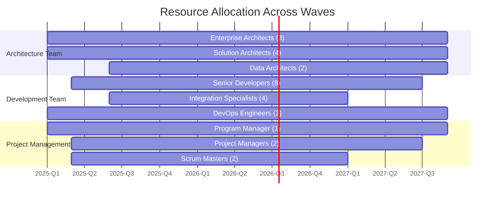

### Peak Resource Periods

| Period | Peak Demand | Resource Type | Capacity Plan |
|--------|-------------|---------------|---------------|
| Q3-Q4 2025 | 85 FTE | Development & Integration | Contractor augmentation |
| Q1-Q2 2026 | 90 FTE | SAP & Data specialists | External partners |
| Q2-Q3 2026 | 78 FTE | Integration & Testing | Cross-training |
| Q1-Q2 2027 | 65 FTE | Optimization & Automation | Internal resources |

## Change Control and Baseline Management

### Schedule Baseline Management

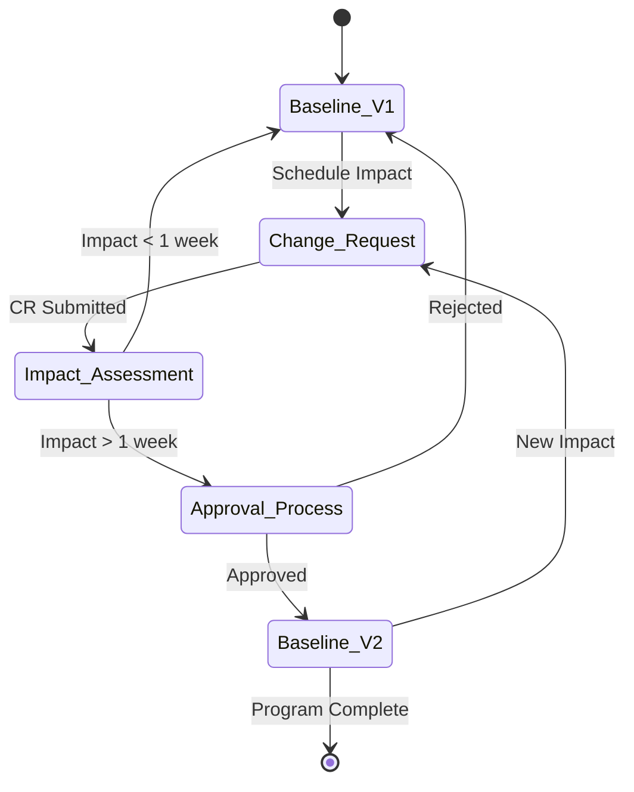

### Change Control Thresholds

| Change Type | Threshold | Approval Required | Documentation |
|-------------|-----------|-------------------|---------------|
| **Minor Adjustment** | < 1 week | Project Manager | Change log |
| **Moderate Change** | 1-4 weeks | Program Manager | Change request |
| **Major Change** | > 4 weeks | Steering Committee | Impact assessment |
| **Baseline Revision** | > 8 weeks | Executive Sponsor | Full rebaseline |

## Monitoring and Reporting

### Schedule Performance Metrics

| Metric | Target | Calculation | Frequency |
|--------|--------|-----------| |
| Schedule Performance Index (SPI) | > 0.95 | Earned Value / Planned Value | Weekly |
| Critical Path Variance | ± 1 week | Actual vs Planned Critical Path | Weekly |
| Milestone Achievement Rate | > 90% | Milestones On-Time / Total Milestones | Monthly |
| Resource Utilization | 85-95% | Actual Hours / Planned Hours | Weekly |

### Dashboard and Reporting

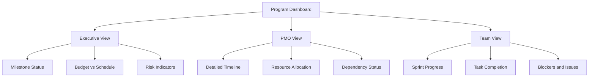

### Reporting Schedule

| Report Type | Audience | Frequency | Content |
|-------------|----------|-----------|---------|
| **Daily Standup** | Team Leads | Daily | Progress, blockers, plans |
| **Weekly Status** | PMO | Weekly | Milestone progress, risks |
| **Monthly Dashboard** | Executives | Monthly | Overall health, key decisions |
| **Quarterly Review** | Steering Committee | Quarterly | Strategic alignment, changes |

## Success Criteria and Acceptance

### Program Success Criteria

1. **Schedule Performance**
   - All major milestones delivered within ±2 weeks
   - Critical path maintained within tolerance
   - No more than 3 baseline revisions

2. **Quality Delivery**
   - All deliverables meet acceptance criteria
   - Quality gates passed without exception
   - Stakeholder satisfaction > 85%

3. **Business Value**
   - Business processes operational as planned
   - Performance targets achieved
   - ROI projections met or exceeded

### Milestone Acceptance Process

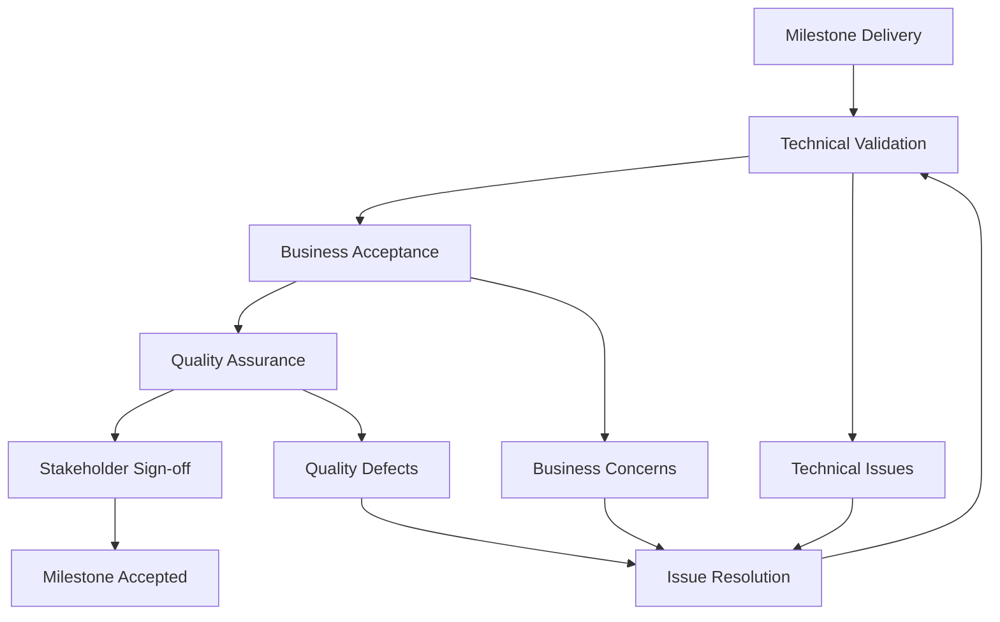

## Conclusion and Next Steps

### Timeline Success Factors

1. **Rigorous Planning:** Detailed timeline with realistic estimates
2. **Proactive Management:** Early identification and mitigation of risks
3. **Stakeholder Engagement:** Regular communication and feedback
4. **Flexible Execution:** Adaptive approach to changing requirements
5. **Quality Focus:** Never compromise quality for schedule

### Immediate Next Steps

1. **Baseline Approval:** Secure executive approval for master timeline
2. **Resource Confirmation:** Finalize all resource allocations
3. **Tool Setup:** Implement project management and tracking tools
4. **Communication Plan:** Establish reporting and communication protocols
5. **Wave 1 Kickoff:** Begin foundation implementation activities

### Long-term Success Monitoring

- Monthly timeline reviews with stakeholder feedback
- Quarterly strategic alignment assessments
- Continuous improvement of planning and execution processes
- Post-implementation lessons learned capture
- Knowledge transfer and organizational capability building

---

**Document Status:** Final  
**Last Updated:** 2024-12-19  
**Next Review:** 2025-01-05