# Architecture Compliance Reports

## Document Information
- **Document Title:** Enterprise Architecture Implementation Governance - Architecture Compliance Reports
- **Document Version:** 1.0
- **Document Date:** 2024-12-19
- **Document Owner:** Enterprise Architecture Team
- **Approved By:** Chief Architect / CTO
- **Review Frequency:** Monthly compliance reports, quarterly assessments
- **Next Review:** 2025-01-19

## Executive Summary

This document defines the comprehensive Architecture Compliance Reporting framework for monitoring, measuring, and ensuring adherence to enterprise architecture standards, principles, and governance policies throughout the implementation program. The framework provides automated compliance monitoring, deviation detection, and corrective action tracking across all architectural domains.

### Key Points
- **Automated Compliance Monitoring:** Real-time tracking of architecture adherence
- **Multi-Domain Coverage:** Business, application, data, technology, and security compliance
- **Exception Management:** Formal process for handling deviations and waivers
- **Continuous Improvement:** Feedback loop for standard enhancement
- **Risk-Based Approach:** Prioritized compliance based on business impact

### Compliance Framework Overview

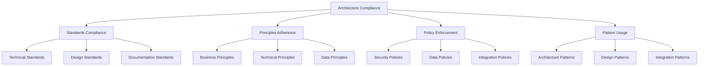

## Purpose and Scope

### Document Purpose
Define comprehensive architecture compliance reporting framework, monitoring mechanisms, assessment criteria, and corrective action processes aligned with TOGAF ADM Phase G requirements and enterprise governance standards.

### Scope
**In Scope:**
- Architecture compliance monitoring and reporting
- Standards adherence assessment and tracking
- Exception and waiver management processes
- Compliance metrics and KPI frameworks
- Automated compliance checking mechanisms
- Corrective action planning and tracking
- Regular compliance review and audit processes

**Out of Scope:**
- Individual code quality reviews
- Operational compliance monitoring
- Financial compliance reporting
- Legal and regulatory compliance (unless architecture-related)

## Architecture Compliance Framework

### Compliance Domains and Standards

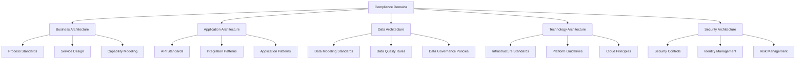

### Compliance Assessment Levels

| Level | Description | Assessment Frequency | Criteria | Remediation SLA |
|-------|-------------|---------------------|----------|-----------------|
| **Level 1 - Automated** | Real-time automated checks | Continuous | Binary pass/fail | Immediate |
| **Level 2 - Periodic** | Scheduled compliance reviews | Weekly | Scored assessment | 7 days |
| **Level 3 - Milestone** | Gate-based comprehensive review | Per milestone | Full evaluation | 30 days |
| **Level 4 - Audit** | Independent compliance audit | Quarterly | Formal assessment | 60 days |

## Business Architecture Compliance

### Business Process Compliance Standards

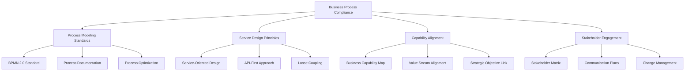

### Business Architecture Compliance Report

**Reporting Period:** December 2024  
**Overall Compliance Score:** 87%

| Compliance Area | Score | Trend | Issues | Actions Required |
|-----------------|-------|-------|--------|------------------|
| **Process Modeling** | 92% | ↗ | 2 minor | Update 3 process models |
| **Service Design** | 89% | → | 1 moderate | Review API contracts |
| **Capability Alignment** | 85% | ↗ | 3 minor | Update capability map |
| **Stakeholder Engagement** | 83% | ↘ | 4 moderate | Enhance communication |

### Business Process Compliance Details

| Process | Standard | Compliance % | Issues | Remediation Plan |
|---------|----------|--------------|--------|------------------|
| Order Management | BPMN 2.0 | 95% | None | Maintain current state |
| Customer Onboarding | Service Design | 88% | API versioning | Update API strategy |
| Financial Reporting | Capability Model | 82% | Capability gaps | Enhance capability definition |
| Supply Chain | Process Optimization | 90% | Documentation | Complete process docs |

## Application Architecture Compliance

### Application Standards Framework

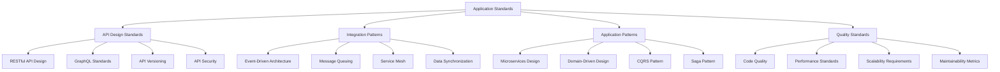

### Application Compliance Assessment

**Assessment Date:** 2024-12-19  
**Applications Assessed:** 24  
**Overall Compliance:** 91%

| Application Domain | Compliance Score | Critical Issues | High Issues | Medium Issues |
|-------------------|------------------|-----------------|-------------|---------------|
| **Core Business Applications** | 94% | 0 | 1 | 3 |
| **Integration Services** | 96% | 0 | 0 | 2 |
| **Data Processing** | 89% | 1 | 2 | 4 |
| **User Interfaces** | 87% | 0 | 3 | 6 |
| **Security Services** | 98% | 0 | 0 | 1 |

### API Compliance Dashboard

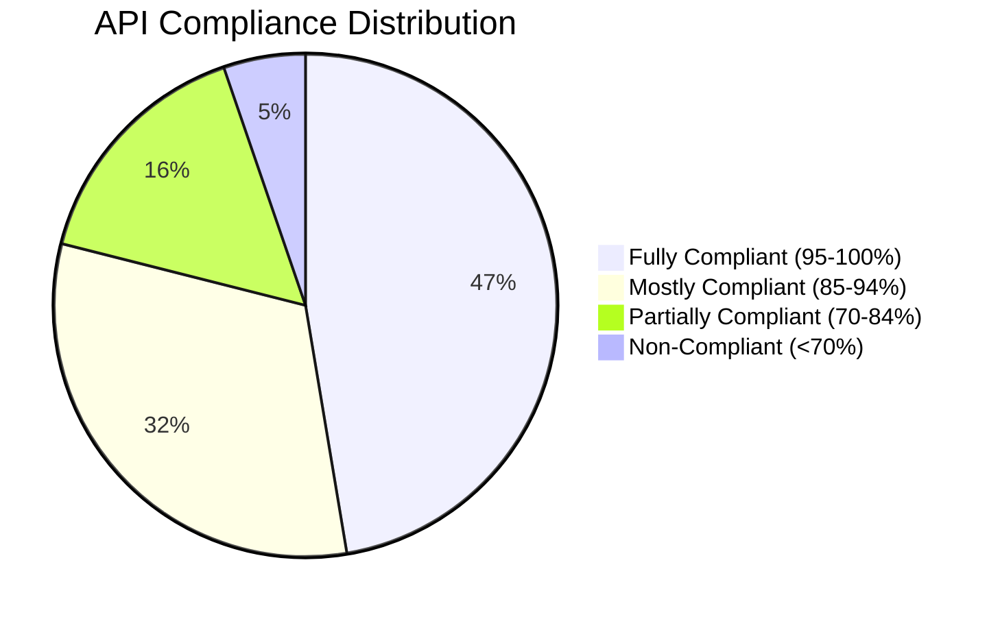

### Application Compliance Details

| Application | API Score | Integration Score | Pattern Score | Quality Score | Overall |
|-------------|-----------|-------------------|---------------|---------------|---------|
| **SAP S/4HANA API** | 96% | 94% | 98% | 92% | 95% |
| **Customer Portal** | 88% | 92% | 86% | 90% | 89% |
| **Order Management** | 94% | 96% | 92% | 88% | 92% |
| **Analytics Service** | 92% | 89% | 94% | 91% | 91% |
| **Payment Gateway** | 98% | 95% | 96% | 94% | 96% |
| **Legacy Connector** | 72% | 68% | 75% | 70% | 71% |

## Data Architecture Compliance

### Data Governance Compliance Framework

```mermaid
graph TD
    A[Data Governance Compliance] --> B[Data Quality Standards]
    A --> C[Data Security Policies]
    A --> D[Data Modeling Standards]
    A --> E[Data Lifecycle Management]
    
    B --> B1[Accuracy Requirements]
    B --> B2[Completeness Rules]
    B --> B3[Consistency Checks]
    B --> B4[Timeliness Metrics]
    
    C --> C1[Access Controls]
    C --> C2[Encryption Standards]
    C --> C3[Privacy Protection]
    C --> C4[Audit Logging]
    
    D --> D1[Logical Data Models]
    D --> D2[Physical Data Models]
    D --> D3[Master Data Management]
    D --> D4[Metadata Management]
    
    E --> E1[Data Retention Policies]
    E --> E2[Archival Procedures]
    E --> E3[Disposal Standards]
    E --> E4[Backup Requirements]
```

### Data Compliance Assessment Results

**Assessment Period:** Q4 2024  
**Data Assets Evaluated:** 156  
**Overall Data Compliance:** 89%

| Data Domain | Quality Score | Security Score | Modeling Score | Lifecycle Score | Overall |
|-------------|---------------|----------------|----------------|-----------------|---------|
| **Customer Data** | 94% | 97% | 91% | 88% | 92% |
| **Financial Data** | 96% | 98% | 94% | 92% | 95% |
| **Product Data** | 87% | 91% | 89% | 85% | 88% |
| **Operational Data** | 82% | 88% | 84% | 80% | 83% |
| **Analytics Data** | 90% | 92% | 88% | 86% | 89% |

### Data Quality Compliance Dashboard

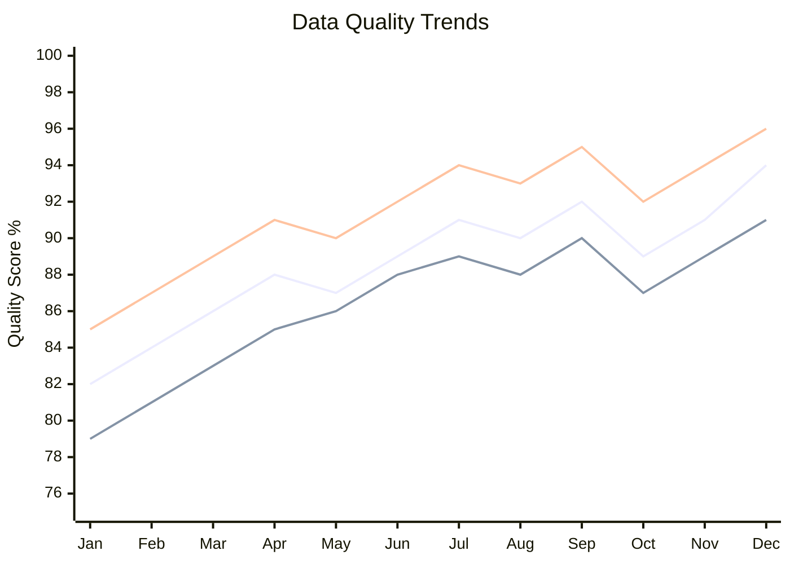

### Data Compliance Violations

| Violation Type | Count | Severity | Business Impact | Remediation Status |
|----------------|-------|----------|-----------------|-------------------|
| **Missing Data Quality Rules** | 12 | Medium | Low | In Progress |
| **Inadequate Access Controls** | 3 | High | Medium | Completed |
| **Incomplete Data Models** | 8 | Medium | Medium | Planned |
| **Missing Encryption** | 2 | Critical | High | Completed |
| **Retention Policy Gaps** | 15 | Low | Low | In Progress |

## Technology Architecture Compliance

### Infrastructure Compliance Standards

```mermaid
graph TD
    A[Technology Compliance] --> B[Cloud Standards]
    A --> C[Infrastructure Patterns]
    A --> D[Platform Guidelines]
    A --> E[Monitoring Requirements]
    
    B --> B1[Azure Well-Architected]
    B --> B2[Multi-Region Deployment]
    B --> B3[Resource Tagging]
    B --> B4[Cost Optimization]
    
    C --> C1[High Availability]
    C --> C2[Disaster Recovery]
    C --> C3[Scalability Patterns]
    C --> C4[Performance Standards]
    
    D --> D1[Container Standards]
    D --> D2[Kubernetes Guidelines]
    D --> D3[DevOps Practices]
    D --> D4[CI/CD Pipelines]
    
    E --> E1[Application Monitoring]
    E --> E2[Infrastructure Monitoring]
    E --> E3[Security Monitoring]
    E --> E4[Business Monitoring]
```

### Technology Compliance Assessment

**Assessment Date:** 2024-12-19  
**Infrastructure Components:** 89  
**Overall Technology Compliance:** 93%

| Technology Domain | Compliance Score | Violations | Trend | Target |
|-------------------|------------------|------------|-------|--------|
| **Cloud Infrastructure** | 96% | 2 Low | ↗ | 95% |
| **Container Platform** | 94% | 3 Medium | → | 90% |
| **DevOps Pipeline** | 91% | 4 Medium | ↗ | 90% |
| **Monitoring Systems** | 89% | 5 Medium | ↗ | 85% |
| **Network Architecture** | 97% | 1 Low | → | 95% |

### Cloud Compliance Dashboard

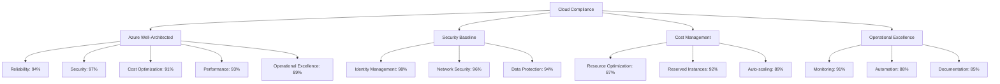

## Security Architecture Compliance

### Security Compliance Framework

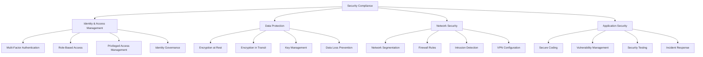

### Security Compliance Assessment

**Assessment Period:** December 2024  
**Security Controls Evaluated:** 147  
**Overall Security Compliance:** 95%

| Security Domain | Implementation % | Effectiveness % | Compliance Score |
|-----------------|------------------|-----------------|------------------|
| **Identity Management** | 98% | 96% | 97% |
| **Data Protection** | 94% | 93% | 94% |
| **Network Security** | 97% | 95% | 96% |
| **Application Security** | 91% | 89% | 90% |
| **Incident Response** | 96% | 94% | 95% |

### Security Control Compliance Matrix

| Control Family | Total Controls | Implemented | Compliant | Exceptions | Score |
|----------------|----------------|-------------|-----------|------------|-------|
| **Access Control** | 25 | 24 | 23 | 1 | 96% |
| **Audit & Accountability** | 18 | 18 | 17 | 0 | 94% |
| **Configuration Management** | 22 | 21 | 20 | 1 | 95% |
| **Identification & Authentication** | 15 | 15 | 15 | 0 | 100% |
| **System & Communication Protection** | 28 | 27 | 26 | 1 | 96% |
| **System & Information Integrity** | 20 | 19 | 18 | 1 | 95% |

## Compliance Exception Management

### Exception Request Process

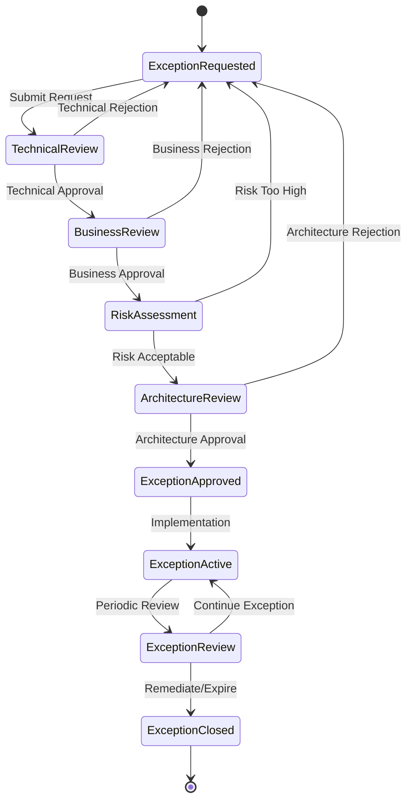

### Current Active Exceptions

| Exception ID | Domain | Description | Approval Date | Expiry Date | Risk Level | Owner |
|--------------|--------|-------------|---------------|-------------|------------|-------|
| EXC-001 | Application | Legacy API non-REST format | 2024-10-15 | 2025-04-15 | Medium | John Smith |
| EXC-002 | Data | Customer data in legacy format | 2024-11-01 | 2025-05-01 | Low | Jane Doe |
| EXC-003 | Technology | On-premises backup system | 2024-09-20 | 2025-03-20 | High | Mike Johnson |
| EXC-004 | Security | Temporary elevated access | 2024-12-01 | 2025-01-01 | Medium | Sarah Wilson |

### Exception Risk Dashboard

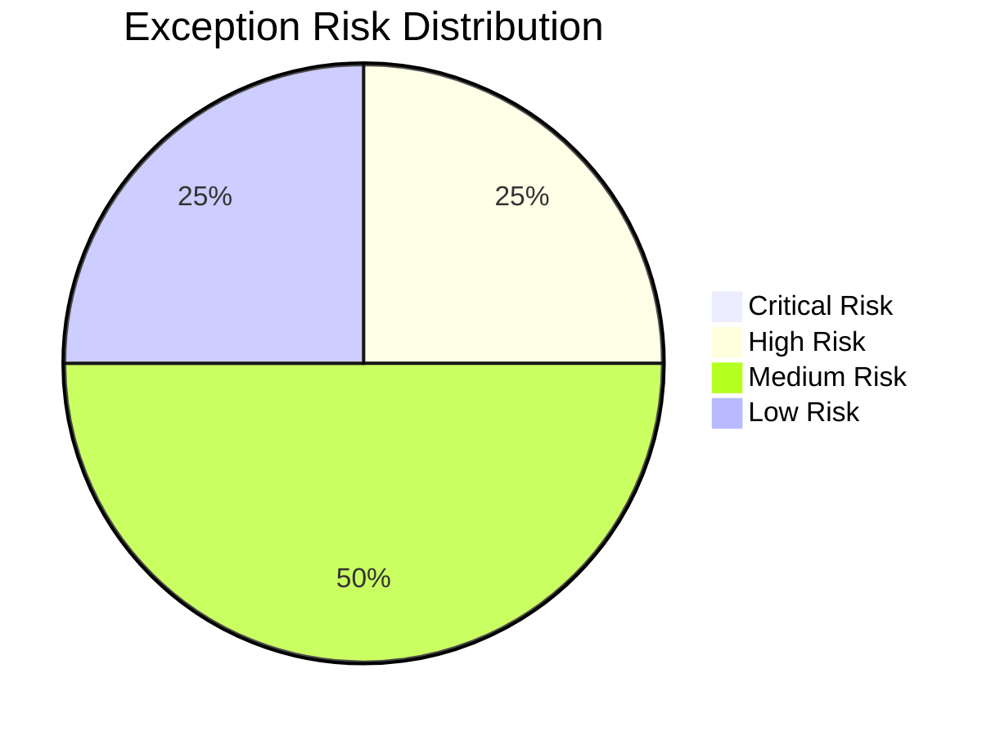

## Compliance Monitoring and Automation

### Automated Compliance Checking

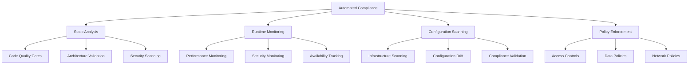

### Compliance Automation Tools

| Tool Category | Tool Name | Coverage | Integration | Automation Level |
|---------------|-----------|----------|-------------|------------------|
| **Code Analysis** | SonarQube | 95% | Azure DevOps | Fully Automated |
| **Security Scanning** | Azure Security Center | 90% | Azure Portal | Fully Automated |
| **Infrastructure** | Azure Policy | 100% | Azure Resource Manager | Fully Automated |
| **Configuration** | Chef InSpec | 85% | CI/CD Pipeline | Semi-Automated |
| **API Compliance** | Spectral | 80% | Git Hooks | Fully Automated |

### Monitoring Dashboard Metrics

| Metric | Current | Target | Trend | Status |
|--------|---------|--------|-------|--------|
| **Automated Check Coverage** | 87% | 90% | ↗ | 🟡 Improving |
| **False Positive Rate** | 8% | <5% | ↘ | 🟡 Reducing |
| **Mean Time to Detection** | 4.2 hours | <4 hours | ↘ | 🟡 Improving |
| **Mean Time to Resolution** | 18 hours | <24 hours | ↘ | 🟢 Good |

## Compliance Reporting and Analytics

### Compliance Trend Analysis

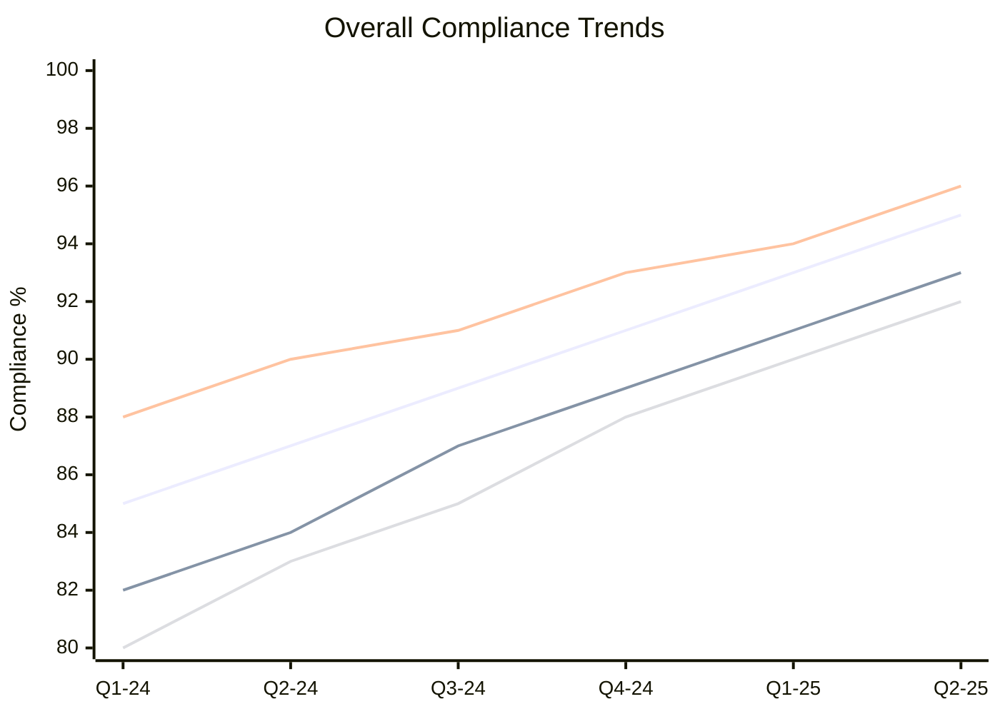

### Compliance KPI Dashboard

| KPI | Current | Target | Q4 Trend | Annual Trend |
|-----|---------|--------|----------|--------------|
| **Overall Compliance Score** | 91% | 90% | ↗ | ↗ |
| **Critical Violations** | 2 | <5 | ↘ | ↘ |
| **Average Resolution Time** | 5.2 days | <7 days | ↘ | ↘ |
| **Compliance Automation Rate** | 87% | 85% | ↗ | ↗ |
| **Exception Approval Rate** | 23% | <30% | → | ↘ |

### Predictive Compliance Analytics

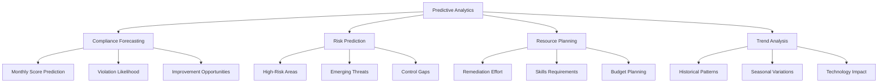

## Compliance Improvement Framework

### Continuous Improvement Process

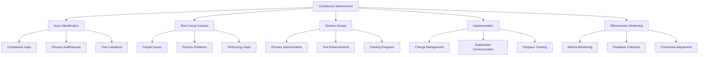

### Improvement Initiatives

| Initiative | Objective | Timeline | Owner | Expected Improvement |
|------------|-----------|----------|-------|----------------------|
| **Automated Testing** | Increase coverage to 95% | Q1 2025 | DevOps Team | +8% compliance |
| **Policy Automation** | Automate policy enforcement | Q2 2025 | Security Team | +5% efficiency |
| **Training Program** | Enhance team capabilities | Ongoing | HR + Architecture | +10% awareness |
| **Tool Integration** | Improve tool connectivity | Q1 2025 | IT Team | +15% automation |

## Success Metrics and Reporting

### Compliance Success Criteria

| Success Factor | Metric | Target | Current | Status |
|----------------|--------|--------|---------|--------|
| **Overall Compliance** | Weighted Score | >90% | 91% | ✅ Met |
| **Critical Issues** | Count | <3 | 2 | ✅ Met |
| **Resolution Time** | Average Days | <7 | 5.2 | ✅ Met |
| **Automation Coverage** | Percentage | >85% | 87% | ✅ Met |
| **Stakeholder Satisfaction** | Survey Score | >85% | 88% | ✅ Met |

### Executive Compliance Summary

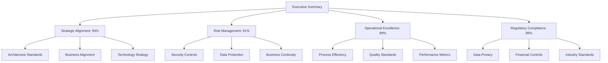

## Conclusion and Next Steps

### Key Recommendations

1. **Enhance Automation:** Increase automated compliance checking to 95% coverage
2. **Improve Integration:** Better integration between compliance tools and dashboards
3. **Strengthen Training:** Enhanced architecture compliance training for all teams
4. **Optimize Processes:** Streamline exception management and approval processes
5. **Expand Monitoring:** Implement predictive compliance analytics capabilities

### Action Plan

| Action | Priority | Owner | Timeline | Success Criteria |
|--------|----------|-------|----------|------------------|
| **Deploy Advanced Analytics** | High | Architecture Team | Q1 2025 | Predictive capabilities active |
| **Enhance Tool Integration** | Medium | IT Team | Q2 2025 | 95% tool connectivity |
| **Implement Training Program** | High | HR + Architecture | Q1 2025 | 100% team certification |
| **Optimize Exception Process** | Medium | Governance Team | Q1 2025 | 50% faster approvals |

### Long-term Vision

The Architecture Compliance framework will evolve to provide:
- Real-time, intelligent compliance monitoring with AI-powered insights
- Automated remediation for common compliance violations
- Predictive analytics for proactive compliance management
- Self-healing architecture capabilities for automatic compliance restoration
- Integrated governance across the entire technology ecosystem

---

**Document Status:** Final  
**Last Updated:** 2024-12-19  
**Next Review:** 2025-01-19