# Project Portfolio Dashboard

## Document Information
- **Document Title:** Enterprise Architecture Implementation Governance - Project Portfolio Dashboard
- **Document Version:** 1.0
- **Document Date:** 2024-12-19
- **Document Owner:** Program Management Office
- **Approved By:** CTO / Program Sponsor
- **Review Frequency:** Real-time updates, weekly reviews
- **Next Review:** 2025-01-05

## Executive Summary

This document defines the comprehensive Project Portfolio Dashboard framework for monitoring and governing the enterprise architecture implementation. The dashboard provides real-time visibility into project health, resource utilization, risk exposure, and business value delivery across all 8 implementation projects and 4 transformation waves.

### Key Points
- **Real-time Monitoring:** Live project health indicators across all initiatives
- **Multi-dimensional Views:** Executive, operational, and technical perspectives
- **Predictive Analytics:** Early warning systems and trend analysis
- **Integrated Governance:** Automated compliance monitoring and reporting
- **Value Tracking:** Business benefits realization and ROI monitoring

### Dashboard Architecture Overview

## Purpose and Scope

### Document Purpose
Define comprehensive dashboard framework for real-time monitoring, governance, and decision support of the enterprise architecture implementation program aligned with TOGAF ADM Phase G requirements.

### Scope
**In Scope:**
- Real-time project portfolio monitoring
- Multi-level dashboard views and analytics
- Automated governance and compliance tracking
- Resource and capacity management dashboards
- Business value and ROI tracking
- Risk and issue management visualization
- Integration with project management tools

**Out of Scope:**
- Individual task-level tracking
- Personal performance management
- Financial accounting systems
- Operational service monitoring

## Executive Dashboard View

### Strategic Health Overview

### Executive KPI Dashboard

| KPI Category | Metric | Current | Target | Trend | Status |
|--------------|--------|---------|--------|--------|--------|
| **Schedule** | Program Schedule Performance | 96% | >95% | ↗ | 🟢 Green |
| **Budget** | Cost Performance Index | 1.02 | >0.95 | ↗ | 🟢 Green |
| **Quality** | Deliverable Acceptance Rate | 94% | >90% | ↗ | 🟢 Green |
| **Risk** | High-Risk Items | 3 | <5 | ↘ | 🟢 Green |
| **Value** | Benefits Realization | 65% | 60% | ↗ | 🟢 Green |
| **Resources** | Team Utilization | 87% | 80-90% | → | 🟢 Green |

### Executive Heat Map

```mermaid
graph TD
    A[Project Portfolio Heat Map] --> B[Wave 1: Foundation]
    A --> C[Wave 2: Core Systems]
    A --> D[Wave 3: Integration]
    A --> E[Wave 4: Optimization]
    
    B --> B1[Infrastructure: 🟢 Green]
    B --> B2[Security: 🟢 Green]
    B --> B3[Governance: 🟡 Yellow]
    
    C --> C1[SAP Implementation: 🟡 Yellow]
    C --> C2[Data Platform: 🟢 Green]
    C --> C3[Integration Layer: 🟢 Green]
    
    D --> D1[API Management: 🟢 Green]
    D --> D2[Analytics Platform: 🟢 Green]
    D --> D3[Legacy Integration: 🟡 Yellow]
    
    E --> E1[Performance Optimization: 🔵 Future]
    E --> E2[Advanced Analytics: 🔵 Future]
    E --> E3[Process Automation: 🔵 Future]
```

## Program Management Dashboard

### Wave Progress Tracking

### Milestone Achievement Dashboard

| Wave | Milestone | Planned Date | Actual Date | Status | Variance | Impact |
|------|-----------|--------------|-------------|--------|----------|--------|
| W1 | M1.1 - Azure Foundation | 2025-02-28 | 2025-02-25 | ✅ Complete | -3 days | None |
| W1 | M1.2 - Security Framework | 2025-05-31 | In Progress | 🔄 Active | On Track | None |
| W1 | M1.3 - Governance Process | 2025-06-30 | Not Started | ⏳ Planned | - | None |
| W2 | M2.1 - SAP Foundation | 2025-09-30 | Not Started | ⏳ Planned | - | None |
| W2 | M2.2 - Data Platform MVP | 2025-12-31 | Not Started | ⏳ Planned | - | None |

### Dependency Management Matrix

## Project Health Dashboard

### Project Status Matrix

| Project | Health | Schedule | Budget | Quality | Risk | Team | Deliverables |
|---------|--------|----------|--------|---------|------|------|--------------|
| **Infrastructure Setup** | 🟢 Green | 🟢 96% | 🟢 98% | 🟢 95% | 🟢 Low | 🟢 85% | 8/10 Complete |
| **Security Implementation** | 🟡 Yellow | 🟡 92% | 🟢 101% | 🟢 93% | 🟡 Medium | 🟢 88% | 5/8 Complete |
| **SAP S/4HANA Deploy** | 🟡 Yellow | 🟡 89% | 🔴 105% | 🟡 87% | 🔴 High | 🟡 82% | 2/12 Complete |
| **Data Platform Migration** | 🟢 Green | 🟢 94% | 🟢 99% | 🟢 96% | 🟢 Low | 🟢 90% | 4/10 Complete |
| **Integration Layer** | 🟢 Green | 🟢 98% | 🟢 97% | 🟢 94% | 🟢 Low | 🟢 89% | 3/8 Complete |
| **API Management** | 🔵 Future | - | - | - | - | - | 0/6 Planned |
| **Analytics Platform** | 🔵 Future | - | - | - | - | - | 0/8 Planned |
| **Legacy Integration** | 🔵 Future | - | - | - | - | - | 0/5 Planned |

### Quality Metrics Dashboard

## Resource Management Dashboard

### Resource Utilization Overview

### Skills and Capacity Matrix

| Skill Category | Available | Required | Utilization | Gap | Forecast |
|----------------|-----------|----------|-------------|-----|----------|
| **Enterprise Architecture** | 3 | 3 | 100% | 0 | Stable |
| **Solution Architecture** | 4 | 4 | 95% | 0 | Stable |
| **SAP Specialists** | 6 | 8 | 125% | -2 | Critical |
| **Data Engineers** | 8 | 10 | 110% | -2 | High Demand |
| **Integration Specialists** | 4 | 6 | 115% | -2 | Growing Need |
| **Cloud Architects** | 5 | 5 | 90% | 0 | Stable |
| **DevOps Engineers** | 3 | 4 | 105% | -1 | Moderate Gap |
| **Security Specialists** | 3 | 3 | 95% | 0 | Stable |

### Resource Forecast Dashboard

## Financial Performance Dashboard

### Budget vs Actual Tracking

### Financial Health Indicators

| Financial Metric | Current | Target | Variance | Trend | Status |
|------------------|---------|---------|----------|--------|--------|
| **Total Program Budget** | $8.30M | $8.30M | 0% | - | 🟢 Baseline |
| **Spent to Date** | $1.95M | $2.00M | -2.5% | ↗ | 🟢 Under Budget |
| **Forecast at Completion** | $8.48M | $8.30M | +2.2% | ↗ | 🟡 Watch |
| **Cost Performance Index** | 1.02 | >0.95 | +7.4% | ↗ | 🟢 Good |
| **Budget Variance** | +$180K | ±$415K | +2.2% | ↗ | 🟢 Within Range |
| **Contingency Used** | $120K | $1.66M | 7.2% | ↗ | 🟢 Available |

### ROI and Value Tracking

## Risk and Issue Management Dashboard

### Risk Portfolio Overview

### Active Issues Dashboard

| Issue ID | Category | Severity | Description | Owner | Age | Status |
|----------|----------|----------|-------------|-------|-----|--------|
| ISS-001 | Technical | High | SAP environment connectivity | John Smith | 5 days | In Progress |
| ISS-002 | Resource | Medium | Data architect unavailable | Jane Doe | 12 days | Mitigation Plan |
| ISS-003 | Process | Low | Approval workflow delays | Mike Johnson | 8 days | Under Review |
| ISS-004 | Quality | Medium | Test environment instability | Sarah Wilson | 3 days | Investigation |
| ISS-005 | Budget | High | Cloud costs exceeding forecast | Tom Brown | 15 days | Action Plan |

### Risk Trending Analysis

## Governance and Compliance Dashboard

### Architecture Compliance Monitoring

### Governance Gate Status

| Gate | Project | Planned Date | Status | Criteria Met | Outstanding Items |
|------|---------|--------------|--------|--------------|-------------------|
| **G1** | Infrastructure | 2025-02-28 | ✅ Passed | 8/8 | None |
| **G2** | Security | 2025-05-31 | 🔄 In Review | 6/8 | 2 Security tests |
| **G3** | SAP Foundation | 2025-09-30 | ⏳ Upcoming | 0/10 | Architecture review |
| **G4** | Data Platform | 2025-12-31 | ⏳ Upcoming | 0/8 | Design approval |

## Technical Performance Dashboard

### System Performance Metrics

| System Component | Availability | Response Time | Throughput | Error Rate | Trend |
|------------------|--------------|---------------|------------|------------|--------|
| **Azure Infrastructure** | 99.9% | 0.8s | 1,200 req/s | 0.1% | ↗ |
| **Security Layer** | 99.8% | 1.2s | 800 req/s | 0.2% | → |
| **API Gateway** | 99.7% | 1.5s | 600 req/s | 0.3% | ↗ |
| **Data Platform** | 99.6% | 2.1s | 400 req/s | 0.4% | ↗ |
| **Integration Layer** | 99.5% | 1.8s | 300 req/s | 0.5% | → |

### Infrastructure Health

## Dashboard Implementation Framework

### Technical Architecture

### Data Integration Strategy

| Data Source | Type | Frequency | Method | Format |
|-------------|------|-----------|---------|--------|
| **Azure DevOps** | Project Data | Real-time | REST API | JSON |
| **SAP Project System** | Financial Data | Daily | ODATA | XML |
| **Power BI** | Analytics Data | Hourly | Power Query | CSV |
| **Azure Monitor** | Technical Metrics | Real-time | Event Hub | JSON |
| **Git Repositories** | Code Metrics | Hourly | Git API | JSON |
| **Jira** | Issue Tracking | Real-time | Webhook | JSON |

### User Access and Security

## Automation and Alerting

### Automated Alert Framework

| Alert Type | Trigger Condition | Severity | Recipients | Action Required |
|------------|-------------------|----------|------------|-----------------|
| **Budget Variance** | >5% over budget | High | CFO, PMO | Budget review |
| **Schedule Delay** | >1 week behind | Medium | PM, Sponsor | Recovery plan |
| **Quality Gate Fail** | <90% acceptance | High | QA Lead, Architect | Quality review |
| **Resource Overload** | >100% utilization | Medium | Resource Mgr | Reallocation |
| **Risk Escalation** | New high risk | High | Risk Owner, PMO | Mitigation plan |
| **System Outage** | <99% availability | Critical | DevOps, CTO | Incident response |

### Predictive Analytics

## Success Metrics and KPIs

### Dashboard Effectiveness Metrics

| Metric | Target | Current | Trend | Notes |
|--------|--------|---------|-------|-------|
| **User Adoption** | >90% | 87% | ↗ | Training ongoing |
| **Data Accuracy** | >95% | 97% | → | High quality |
| **Response Time** | <3 seconds | 2.1s | ↗ | Performance good |
| **Update Frequency** | Real-time | 30 seconds | ↗ | Near real-time |
| **Decision Speed** | 50% improvement | 45% | ↗ | Good progress |

### Business Impact Measurement

## Conclusion and Next Steps

### Implementation Roadmap

1. **Phase 1 (Weeks 1-4):** Core dashboard development and data integration
2. **Phase 2 (Weeks 5-8):** Advanced analytics and predictive modeling
3. **Phase 3 (Weeks 9-12):** User training and adoption support
4. **Phase 4 (Weeks 13-16):** Optimization and continuous improvement

### Success Factors

- **Executive Sponsorship:** Strong leadership support and engagement
- **Data Quality:** Accurate, timely, and relevant information
- **User Adoption:** Comprehensive training and change management
- **Technical Excellence:** Robust, scalable, and secure platform
- **Continuous Improvement:** Regular feedback and enhancement cycles

### Long-term Vision

The Project Portfolio Dashboard will evolve into an intelligent governance platform that:
- Provides predictive insights for proactive decision-making
- Automates routine governance and compliance activities
- Enables self-service analytics for all stakeholders
- Integrates with enterprise systems for seamless operations
- Supports strategic portfolio optimization and value maximization

---

**Document Status:** Final  
**Last Updated:** 2024-12-19  
**Next Review:** 2025-01-05