# Quality Assurance Framework

## Document Information
- **Document Title:** Enterprise Architecture Implementation Governance - Quality Assurance Framework
- **Document Version:** 1.0
- **Document Date:** 2024-12-19
- **Document Owner:** Quality Assurance Team
- **Approved By:** CTO / Quality Director
- **Review Frequency:** Monthly framework reviews, quarterly assessments
- **Next Review:** 2025-01-19

## Executive Summary

This document defines the comprehensive Quality Assurance Framework for the enterprise architecture implementation program. The framework establishes quality standards, testing methodologies, defect management processes, and continuous improvement practices to ensure delivery of high-quality, reliable, and maintainable solutions aligned with business requirements and architectural principles.

### Key Points
- **Comprehensive Quality Coverage:** Quality assurance across all architectural domains and project phases
- **Multi-Level Testing Strategy:** Unit, integration, system, performance, and user acceptance testing
- **Automated Quality Gates:** Continuous integration with automated quality checkpoints
- **Risk-Based Testing:** Prioritized testing approach based on business impact and technical risk
- **Continuous Improvement:** Feedback-driven enhancement of quality processes and standards

### Quality Framework Overview

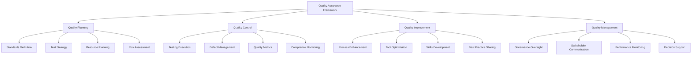

## Purpose and Scope

### Document Purpose
Define comprehensive quality assurance framework, standards, processes, and governance mechanisms to ensure high-quality delivery of enterprise architecture implementation aligned with TOGAF ADM Phase G requirements and industry best practices.

### Scope
**In Scope:**
- Quality assurance planning and strategy
- Testing methodologies and frameworks
- Quality control processes and checkpoints
- Defect management and resolution
- Quality metrics and performance indicators
- Continuous quality improvement processes
- Quality governance and oversight mechanisms

**Out of Scope:**
- Individual test case development
- Specific testing tool implementations
- Operational quality monitoring
- Third-party vendor quality assessment

## Quality Standards and Principles

### Quality Principles Framework

```mermaid
graph TD
    A[Quality Principles] --> B[Fitness for Purpose]
    A --> C[Continuous Improvement]
    A --> D[Risk-Based Approach]
    A --> E[Stakeholder Focus]
    
    B --> B1[Business Requirements Alignment]
    B --> B2[Technical Architecture Compliance]
    B --> B3[Performance Standards Achievement]
    B --> B4[User Experience Excellence]
    
    C --> C1[Process Optimization]
    C --> C2[Tool Enhancement]
    C --> C3[Skills Development]
    C --> C4[Knowledge Sharing]
    
    D --> D1[Risk Assessment]
    D --> D2[Priority-Based Testing]
    D --> D3[Impact Analysis]
    D --> D4[Mitigation Strategies]
    
    E --> E1[Business Stakeholder Satisfaction]
    E --> E2[User Community Engagement]
    E --> E3[Technical Team Collaboration]
    E --> E4[Executive Transparency]
```

### Quality Standards Matrix

| Quality Attribute | Definition | Measurement Criteria | Target Threshold | Monitoring Method |
|-------------------|------------|---------------------|------------------|-------------------|
| **Functionality** | System performs required functions correctly | Test pass rate, defect density | >95% pass rate | Automated testing |
| **Reliability** | System performs consistently under conditions | MTBF, availability | 99.5% availability | Monitoring tools |
| **Performance** | System meets response time and throughput requirements | Response time, TPS | <2s response | Performance testing |
| **Usability** | System is easy to use and learn | User satisfaction, task completion | >85% satisfaction | User testing |
| **Security** | System protects information and maintains access control | Vulnerability count, penetration test | Zero critical vulnerabilities | Security scanning |
| **Maintainability** | System can be modified effectively and efficiently | Code complexity, documentation quality | <10 cyclomatic complexity | Static analysis |
| **Portability** | System can be transferred to different environments | Environment compatibility | 100% environment support | Deployment testing |

## Quality Management Approach

### Quality Lifecycle Integration

```mermaid
graph TD
    A[Quality Lifecycle] --> B[Requirements Phase]
    A --> C[Design Phase]
    A --> D[Development Phase]
    A --> E[Testing Phase]
    A --> F[Deployment Phase]
    A --> G[Maintenance Phase]
    
    B --> B1[Requirements Review]
    B --> B2[Acceptance Criteria Definition]
    B --> B3[Test Strategy Planning]
    
    C --> C1[Design Review]
    C --> C2[Architecture Validation]
    C --> C3[Test Plan Development]
    
    D --> D1[Code Review]
    D --> D2[Unit Testing]
    D --> D3[Static Analysis]
    
    E --> E1[Integration Testing]
    E --> E2[System Testing]
    E --> E3[User Acceptance Testing]
    
    F --> F1[Deployment Testing]
    F --> F2[Smoke Testing]
    F --> F3[Go-Live Support]
    
    G --> G1[Performance Monitoring]
    G --> G2[Defect Analysis]
    G --> G3[Continuous Improvement]
```

### Quality Gate Framework

| Gate | Phase | Entry Criteria | Exit Criteria | Approval Authority |
|------|-------|----------------|---------------|-------------------|
| **G1** | Requirements | Business requirements complete | Requirements approved, test strategy defined | Business Analyst + Architect |
| **G2** | Design | Architecture design complete | Design approved, test plans ready | Chief Architect + QA Lead |
| **G3** | Development | Code development complete | Code reviewed, unit tests passed | Tech Lead + Senior Developer |
| **G4** | Integration | Components integrated | Integration tests passed, defects resolved | QA Manager + System Architect |
| **G5** | System | System testing complete | System tests passed, performance validated | QA Director + Project Manager |
| **G6** | Release | User acceptance complete | UAT passed, production readiness confirmed | Business Owner + CTO |

## Testing Strategy and Methodology

### Comprehensive Testing Framework

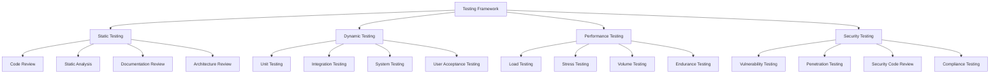

### Testing Levels and Coverage

| Testing Level | Coverage Target | Automation Level | Frequency | Responsibility |
|---------------|-----------------|------------------|-----------|----------------|
| **Unit Testing** | >90% code coverage | 100% automated | Every commit | Developers |
| **Component Testing** | >85% functionality | 90% automated | Daily build | Development Team |
| **Integration Testing** | >80% interfaces | 75% automated | Sprint completion | QA Team |
| **System Testing** | >95% requirements | 60% automated | Release candidate | QA Team |
| **User Acceptance Testing** | 100% business scenarios | 25% automated | Pre-production | Business Users |
| **Performance Testing** | Key user journeys | 80% automated | Release milestone | Performance Team |
| **Security Testing** | Critical security requirements | 70% automated | Sprint completion | Security Team |

### Test Automation Strategy

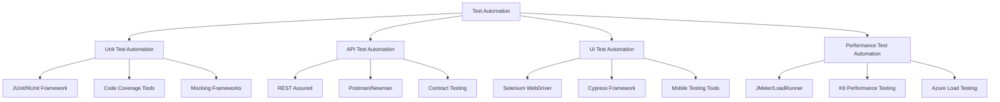

## Quality Control Processes

### Defect Management Lifecycle

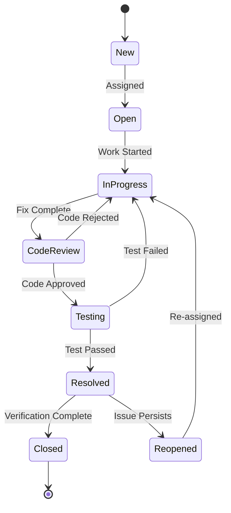

### Defect Classification Framework

| Severity | Definition | Response Time | Resolution Time | Escalation |
|----------|------------|---------------|-----------------|------------|
| **Critical** | System unusable, data corruption | 1 hour | 4 hours | Immediate to CTO |
| **High** | Major functionality impacted | 4 hours | 24 hours | Same day to PM |
| **Medium** | Minor functionality affected | 24 hours | 72 hours | Next business day |
| **Low** | Cosmetic or enhancement | 72 hours | Next sprint | No escalation |

### Current Defect Status Dashboard

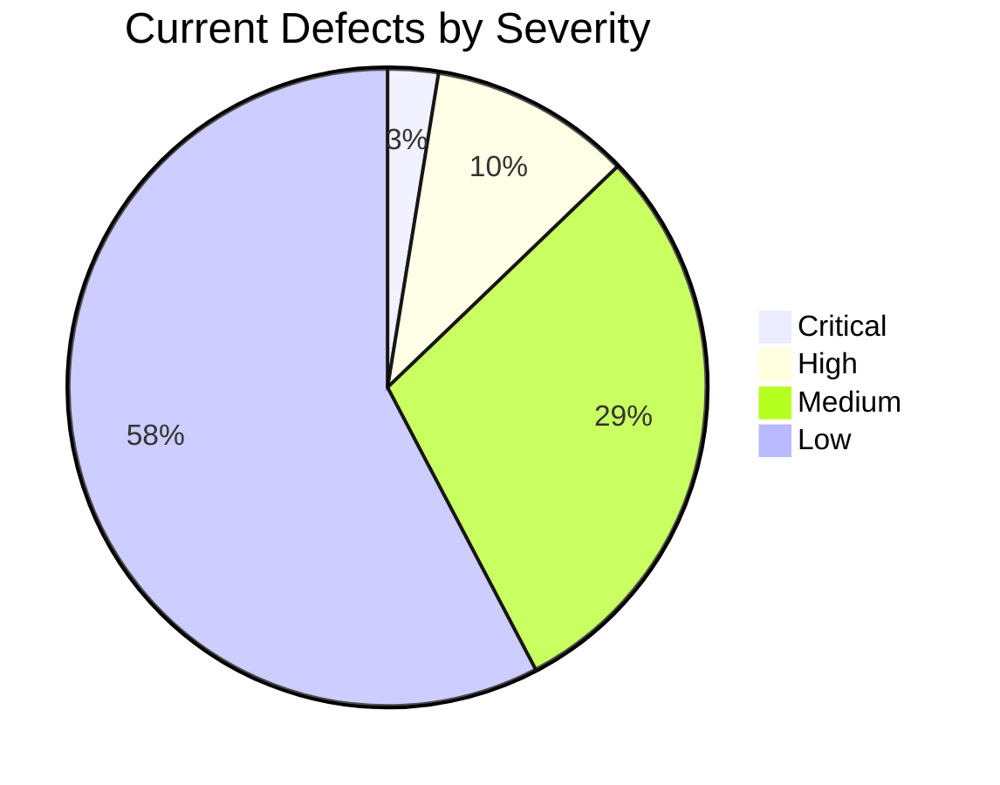

### Defect Metrics and Trends

| Metric | Current | Target | Trend | Status |
|--------|---------|--------|-------|--------|
| **Total Active Defects** | 78 | <100 | ↘ | 🟢 Good |
| **Critical Defects** | 2 | <5 | → | 🟢 Acceptable |
| **Defect Escape Rate** | 8% | <10% | ↘ | 🟢 Good |
| **Average Resolution Time** | 3.2 days | <5 days | ↘ | 🟢 Good |
| **Reopen Rate** | 12% | <15% | ↗ | 🟡 Watch |
| **Customer Reported Defects** | 5% | <8% | ↘ | 🟢 Excellent |

## Test Execution and Results

### Test Execution Dashboard

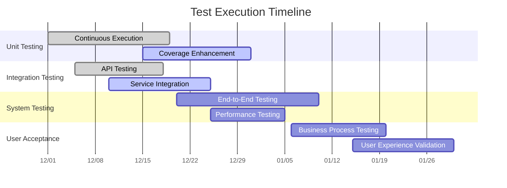

### Test Results Summary

| Test Category | Tests Planned | Tests Executed | Pass Rate | Coverage | Defects Found |
|---------------|---------------|----------------|-----------|----------|---------------|
| **Unit Tests** | 2,847 | 2,847 | 94.2% | 91% | 165 |
| **Integration Tests** | 456 | 398 | 92.7% | 87% | 29 |
| **System Tests** | 234 | 187 | 89.3% | 94% | 20 |
| **Performance Tests** | 45 | 32 | 87.5% | 78% | 4 |
| **Security Tests** | 67 | 56 | 96.4% | 83% | 2 |
| **User Acceptance Tests** | 156 | 89 | 91.0% | 68% | 8 |

### Quality Metrics Dashboard

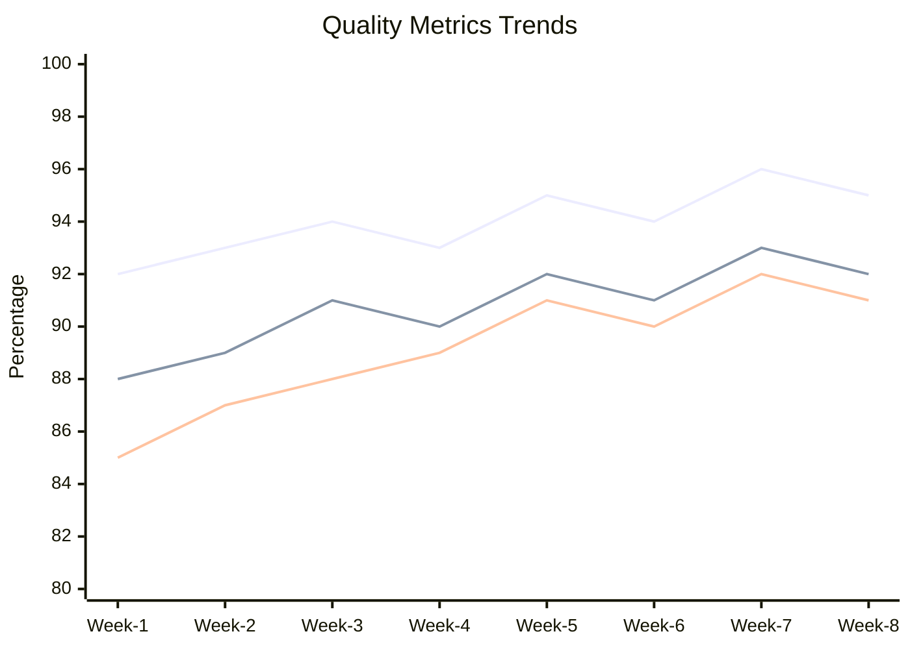

## Performance and Non-Functional Testing

### Performance Testing Framework

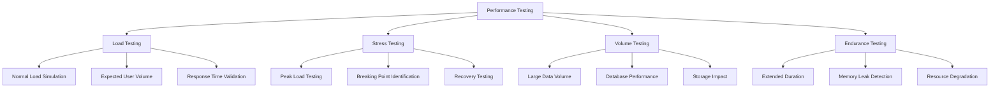

### Performance Test Results

| Performance Metric | Target | Current | Trend | Status |
|--------------------|--------|---------|-------|--------|
| **Response Time (95th percentile)** | <2 seconds | 1.8 seconds | ↘ | 🟢 Good |
| **Throughput** | >1000 TPS | 1,150 TPS | ↗ | 🟢 Excellent |
| **CPU Utilization** | <70% | 65% | → | 🟢 Good |
| **Memory Usage** | <80% | 72% | ↘ | 🟢 Good |
| **Error Rate** | <1% | 0.3% | ↘ | 🟢 Excellent |
| **Availability** | >99.5% | 99.7% | ↗ | 🟢 Excellent |

### Scalability Testing Results

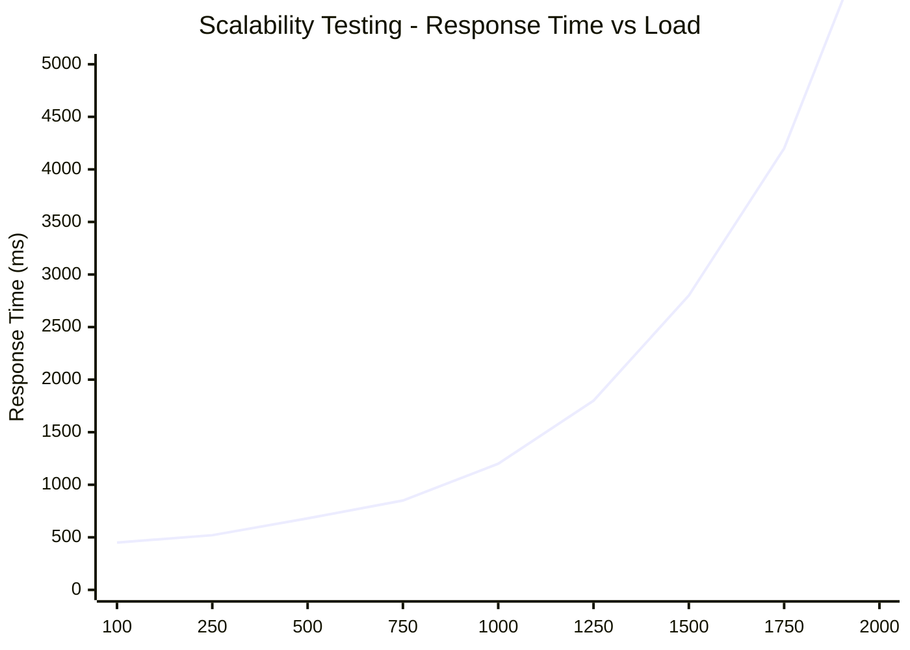

## Security and Compliance Testing

### Security Testing Framework

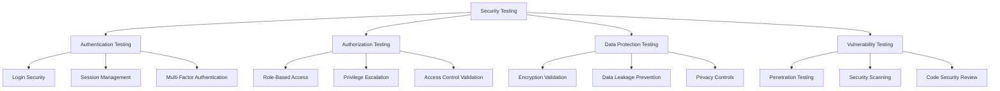

### Security Test Results

| Security Domain | Tests Executed | Vulnerabilities Found | Severity | Status |
|-----------------|----------------|----------------------|----------|--------|
| **Authentication** | 23 | 0 | N/A | ✅ Pass |
| **Authorization** | 34 | 2 | Low | 🟡 Minor Issues |
| **Data Protection** | 28 | 1 | Medium | 🟡 In Progress |
| **Input Validation** | 45 | 3 | Low-Medium | 🟡 Minor Issues |
| **Session Management** | 18 | 0 | N/A | ✅ Pass |
| **Error Handling** | 22 | 1 | Low | 🟡 Minor Issue |

### Compliance Testing Status

| Compliance Framework | Requirements | Tests Passed | Compliance % | Certification Status |
|---------------------|--------------|--------------|--------------|---------------------|
| **GDPR** | 47 | 45 | 96% | 🟢 Compliant |
| **ISO 27001** | 114 | 108 | 95% | 🟢 Compliant |
| **SOC 2 Type II** | 89 | 84 | 94% | 🟡 In Progress |
| **NIST Cybersecurity** | 156 | 147 | 94% | 🟡 In Progress |

## Quality Automation and Tools

### Quality Tool Ecosystem

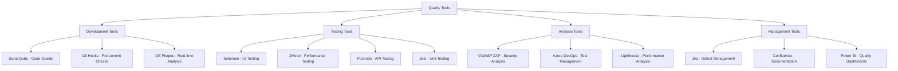

### Tool Integration and Automation

| Tool Category | Primary Tool | Integration Level | Automation % | ROI Impact |
|---------------|--------------|------------------|--------------|------------|
| **Code Quality** | SonarQube | Fully Integrated | 100% | High |
| **Unit Testing** | Jest/JUnit | Fully Integrated | 100% | High |
| **API Testing** | Postman/Newman | Partially Integrated | 85% | Medium |
| **UI Testing** | Selenium | Partially Integrated | 70% | Medium |
| **Performance Testing** | JMeter | Manual Integration | 60% | Low |
| **Security Testing** | OWASP ZAP | Manual Integration | 55% | Low |

### CI/CD Quality Pipeline

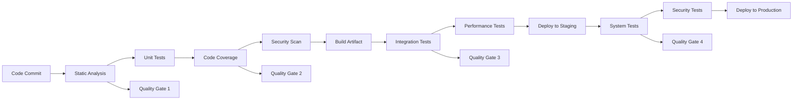

## Quality Metrics and KPIs

### Quality Dashboard KPIs

| KPI Category | Metric | Current | Target | Trend | Status |
|--------------|--------|---------|--------|-------|--------|
| **Test Coverage** | Code Coverage | 91% | >90% | ↗ | 🟢 Good |
| **Test Effectiveness** | Defect Detection Rate | 92% | >90% | → | 🟢 Good |
| **Quality Gates** | Gate Pass Rate | 89% | >85% | ↗ | 🟢 Good |
| **Automation** | Test Automation Coverage | 78% | >75% | ↗ | 🟢 Good |
| **Defect Management** | First Time Fix Rate | 83% | >80% | ↗ | 🟢 Good |
| **Customer Satisfaction** | Quality Rating | 4.2/5 | >4.0 | ↗ | 🟢 Excellent |

### Quality Trend Analysis

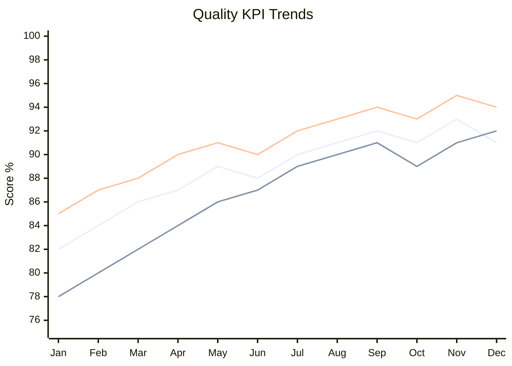

### Quality ROI Analysis

| Quality Initiative | Investment | Annual Savings | ROI | Payback Period |
|-------------------|------------|----------------|-----|----------------|
| **Test Automation** | $150,000 | $300,000 | 200% | 6 months |
| **Static Analysis Tools** | $50,000 | $120,000 | 240% | 5 months |
| **Performance Testing** | $75,000 | $200,000 | 267% | 4.5 months |
| **Security Testing** | $60,000 | $180,000 | 300% | 4 months |
| **Quality Training** | $40,000 | $100,000 | 250% | 4.8 months |

## Risk Management and Mitigation

### Quality Risk Assessment

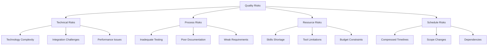

### Risk Mitigation Strategies

| Risk Category | Risk Description | Probability | Impact | Mitigation Strategy | Owner |
|---------------|------------------|-------------|--------|-------------------|-------|
| **Technical** | Complex integration issues | Medium | High | Proof of concepts, early testing | Technical Lead |
| **Process** | Inadequate test coverage | Low | High | Automated testing, continuous monitoring | QA Manager |
| **Resource** | Testing expertise shortage | Medium | Medium | Training programs, external consultants | HR Manager |
| **Schedule** | Compressed testing timeline | High | Medium | Parallel testing, automation | Project Manager |

## Continuous Improvement Framework

### Quality Improvement Process

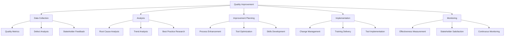

### Improvement Initiatives

| Initiative | Objective | Timeline | Owner | Expected Benefit |
|------------|-----------|----------|-------|------------------|
| **Enhanced Automation** | Increase test automation to 85% | Q1 2025 | QA Team | 40% effort reduction |
| **AI-Powered Testing** | Implement AI test generation | Q2 2025 | Innovation Team | 50% faster test creation |
| **Performance Optimization** | Improve testing efficiency | Q1 2025 | DevOps Team | 30% faster execution |
| **Quality Training** | Enhance team capabilities | Ongoing | HR + QA | 25% defect reduction |

## Stakeholder Communication

### Quality Communication Framework

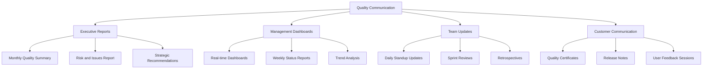

### Stakeholder Satisfaction

| Stakeholder Group | Satisfaction Score | Key Concerns | Action Items |
|------------------|-------------------|--------------|--------------|
| **Executive Team** | 4.3/5 | Budget efficiency | Cost optimization plan |
| **Business Users** | 4.1/5 | User experience | Enhanced usability testing |
| **Development Team** | 3.9/5 | Testing efficiency | Process streamlining |
| **Operations Team** | 4.2/5 | System reliability | Enhanced monitoring |

## Success Criteria and Future Vision

### Quality Success Metrics

| Success Factor | Current | Target | Achievement |
|----------------|---------|---------|-------------|
| **Overall Quality Score** | 92% | 90% | ✅ Exceeded |
| **Customer Satisfaction** | 4.2/5 | 4.0/5 | ✅ Exceeded |
| **Defect Escape Rate** | 8% | <10% | ✅ Met |
| **Test Automation Coverage** | 78% | 75% | ✅ Exceeded |
| **Time to Market** | 15% improvement | 10% | ✅ Exceeded |

### Future Quality Vision

The Quality Assurance Framework will evolve to provide:
- **AI-Powered Testing:** Intelligent test generation and execution
- **Predictive Quality Analytics:** Proactive quality issue identification
- **Self-Healing Systems:** Automated quality issue resolution
- **Continuous Quality Optimization:** Real-time quality improvement
- **Integrated Quality Ecosystem:** Seamless quality across all systems

### Next Steps

1. **Implement Advanced Analytics:** Deploy AI-powered quality insights
2. **Enhance Automation:** Increase test automation coverage to 85%
3. **Optimize Processes:** Streamline quality processes for efficiency
4. **Expand Training:** Comprehensive quality skills development
5. **Strengthen Integration:** Better tool and process integration

---

**Document Status:** Final  
**Last Updated:** 2024-12-19  
**Next Review:** 2025-01-19