# Architecture Change Control Process

## Document Information
- **Document Title:** Enterprise Architecture Change Management - Architecture Change Control Process
- **Document Version:** 1.0
- **Document Date:** 2024-12-19
- **Document Owner:** Enterprise Architecture Team
- **Approved By:** Chief Architect / CTO
- **Review Frequency:** Quarterly process reviews, annual framework assessment
- **Next Review:** 2025-03-19

## Executive Summary

This document defines the comprehensive Architecture Change Control Process for managing, evaluating, and implementing changes to the enterprise architecture. The process ensures that all architectural modifications are properly assessed for impact, risk, and business value while maintaining architectural integrity and alignment with strategic objectives.

### Key Points
- **Controlled Change Management:** Structured process for evaluating and approving architecture changes
- **Impact Assessment Framework:** Comprehensive analysis of technical, business, and risk implications
- **Stakeholder Governance:** Clear roles, responsibilities, and approval authorities
- **Version Control Integration:** Seamless integration with configuration management systems
- **Continuous Monitoring:** Real-time tracking of change implementation and effectiveness

### Change Control Framework Overview

```mermaid
graph TD
    A[Architecture Change Control] --> B[Change Identification]
    A --> C[Change Assessment]
    A --> D[Change Approval]
    A --> E[Change Implementation]
    A --> F[Change Monitoring]
    
    B --> B1[Change Request Submission]
    B --> B2[Initial Triage]
    B --> B3[Change Classification]
    
    C --> C1[Impact Analysis]
    C --> C2[Risk Assessment]
    C --> C3[Cost-Benefit Analysis]
    C --> C4[Stakeholder Review]
    
    D --> D1[Technical Review Board]
    D --> D2[Architecture Review Board]
    D --> D3[Executive Approval]
    
    E --> E1[Implementation Planning]
    E --> E2[Change Execution]
    E --> E3[Validation Testing]
    
    F --> F1[Performance Monitoring]
    F --> F2[Compliance Verification]
    F --> F3[Post-Implementation Review]
```

## Purpose and Scope

### Document Purpose
Define comprehensive architecture change control processes, governance mechanisms, and management frameworks to ensure controlled, risk-managed evolution of enterprise architecture aligned with TOGAF ADM Phase H requirements and organizational change management standards.

### Scope
**In Scope:**
- Architecture change identification and categorization
- Change impact assessment and risk analysis
- Change approval workflows and governance
- Change implementation planning and execution
- Post-implementation monitoring and validation
- Change documentation and knowledge management
- Integration with configuration management systems

**Out of Scope:**
- Application-specific code changes
- Operational configuration changes
- Business process changes (unless impacting architecture)
- Hardware maintenance activities

## Architecture Change Management Principles

### Change Management Principles Framework

```mermaid
graph TD
    A[Change Management Principles] --> B[Controlled Evolution]
    A --> C[Risk-Based Approach]
    A --> D[Stakeholder Alignment]
    A --> E[Continuous Improvement]
    
    B --> B1[Planned Change Implementation]
    B --> B2[Architectural Integrity Maintenance]
    B --> B3[Version Control and Traceability]
    B --> B4[Rollback Capability]
    
    C --> C1[Comprehensive Risk Assessment]
    C --> C2[Impact-Based Prioritization]
    C --> C3[Mitigation Strategy Development]
    C --> C4[Contingency Planning]
    
    D --> D1[Business Value Alignment]
    D --> D2[Stakeholder Consultation]
    D --> D3[Communication and Transparency]
    D --> D4[Consensus Building]
    
    E --> E1[Process Optimization]
    E --> E2[Lessons Learned Integration]
    E --> E3[Best Practice Adoption]
    E --> E4[Capability Enhancement]
```

### Change Control Objectives

| Objective | Description | Success Criteria | Measurement Method |
|-----------|-------------|------------------|-------------------|
| **Architecture Integrity** | Maintain coherent architecture vision | Zero critical conflicts | Architecture compliance audit |
| **Risk Management** | Minimize change-related risks | <5% change-related incidents | Incident tracking system |
| **Business Alignment** | Ensure changes support business goals | >90% business value realization | Benefits tracking |
| **Stakeholder Satisfaction** | Meet stakeholder expectations | >85% satisfaction rating | Stakeholder surveys |
| **Process Efficiency** | Optimize change processing time | <30 days average cycle time | Process metrics dashboard |

## Change Classification and Categorization

### Change Type Classification

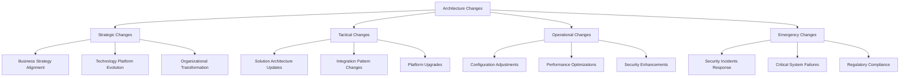

### Change Impact Categories

| Impact Level | Description | Examples | Approval Authority | Timeline |
|--------------|-------------|----------|-------------------|----------|
| **Critical** | Fundamental architecture changes | Core platform replacement | Executive Committee | 90+ days |
| **High** | Major component or pattern changes | New integration platform | Architecture Review Board | 30-90 days |
| **Medium** | Significant feature or service changes | API versioning strategy | Technical Review Board | 15-30 days |
| **Low** | Minor configuration or optimization | Performance tuning | Technical Lead | 5-15 days |
| **Emergency** | Urgent fixes for critical issues | Security vulnerability patch | Emergency Committee | 1-5 days |

### Change Classification Matrix

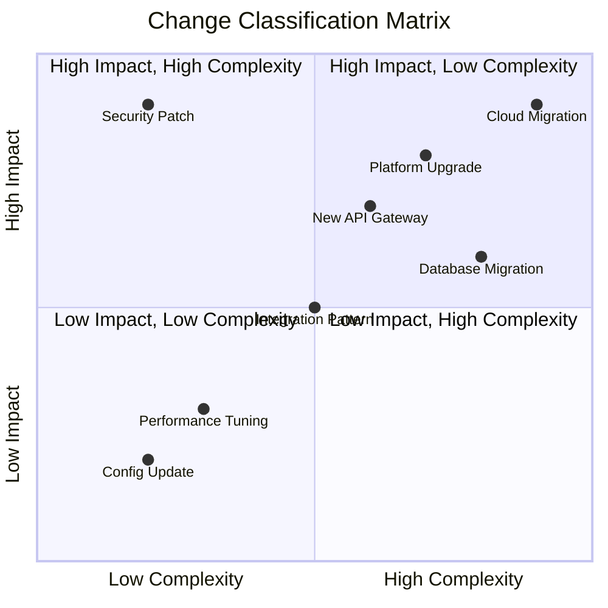

## Change Request Process

### Change Request Lifecycle

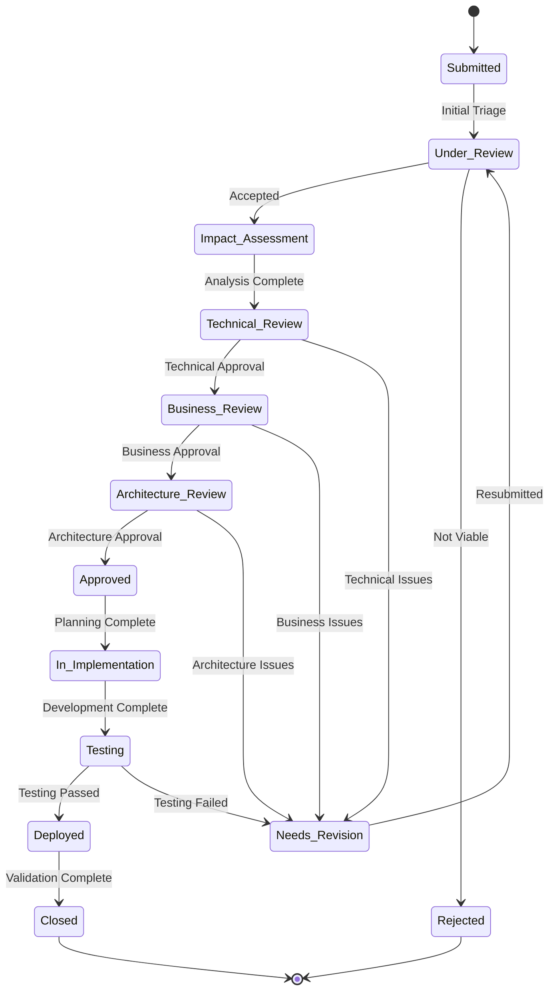

### Change Request Form Template

| Field | Type | Required | Description |
|-------|------|----------|-------------|
| **Change ID** | Auto-generated | Yes | Unique identifier for the change request |
| **Requestor** | Person | Yes | Individual or team submitting the change |
| **Change Title** | Text | Yes | Brief descriptive title of the proposed change |
| **Business Justification** | Text Area | Yes | Detailed business rationale and expected benefits |
| **Current State Description** | Text Area | Yes | Description of existing architecture/process |
| **Proposed Future State** | Text Area | Yes | Description of desired architecture/process |
| **Impacted Systems** | Multi-select | Yes | List of systems affected by the change |
| **Impacted Stakeholders** | Multi-select | Yes | Stakeholder groups affected by the change |
| **Urgency Level** | Dropdown | Yes | Priority level (Critical/High/Medium/Low) |
| **Complexity Estimate** | Dropdown | Yes | Estimated complexity (Simple/Medium/Complex) |
| **Implementation Timeline** | Date Range | Yes | Proposed start and end dates |
| **Dependencies** | Text Area | No | Dependencies on other changes or projects |
| **Risk Assessment** | Text Area | Yes | Initial risk identification and concerns |
| **Success Criteria** | Text Area | Yes | Measurable criteria for change success |

### Change Request Assessment Workflow

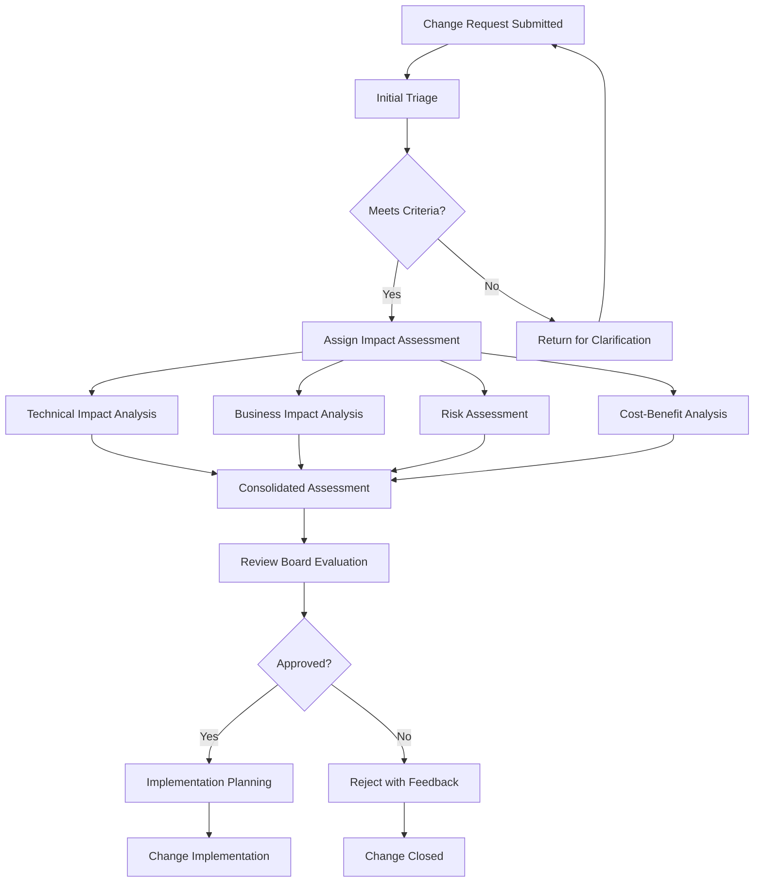

## Impact Assessment Framework

### Multi-Dimensional Impact Analysis

```mermaid
graph TD
    A[Impact Assessment] --> B[Technical Impact]
    A --> C[Business Impact]
    A --> D[Operational Impact]
    A --> E[Financial Impact]
    A --> F[Risk Impact]
    
    B --> B1[System Architecture]
    B --> B2[Integration Points]
    B --> B3[Data Architecture]
    B --> B4[Security Architecture]
    
    C --> C1[Business Processes]
    C --> C2[User Experience]
    C --> C3[Service Delivery]
    C --> C4[Compliance Requirements]
    
    D --> D1[Performance]
    D --> D2[Availability]
    D --> D3[Scalability]
    D --> D4[Maintainability]
    
    E --> E1[Implementation Costs]
    E --> E2[Operational Costs]
    E --> E3[Training Costs]
    E --> E4[Opportunity Costs]
    
    F --> F1[Technical Risks]
    F --> F2[Business Risks]
    F --> F3[Security Risks]
    F --> F4[Compliance Risks]
```

### Impact Assessment Criteria

| Impact Dimension | Low Impact | Medium Impact | High Impact | Critical Impact |
|------------------|------------|---------------|-------------|-----------------|
| **Technical** | Single component | Multiple components | System architecture | Enterprise architecture |
| **Business** | Minor process change | Significant process change | Major workflow impact | Business model change |
| **Operational** | <2 hour downtime | 2-8 hour downtime | 8-24 hour downtime | >24 hour downtime |
| **Financial** | <$50K impact | $50K-$250K impact | $250K-$1M impact | >$1M impact |
| **Risk** | Minimal risk | Manageable risk | Significant risk | Unacceptable risk |
| **Stakeholders** | Single team | Multiple teams | Business unit | Organization-wide |

### Current Change Impact Dashboard

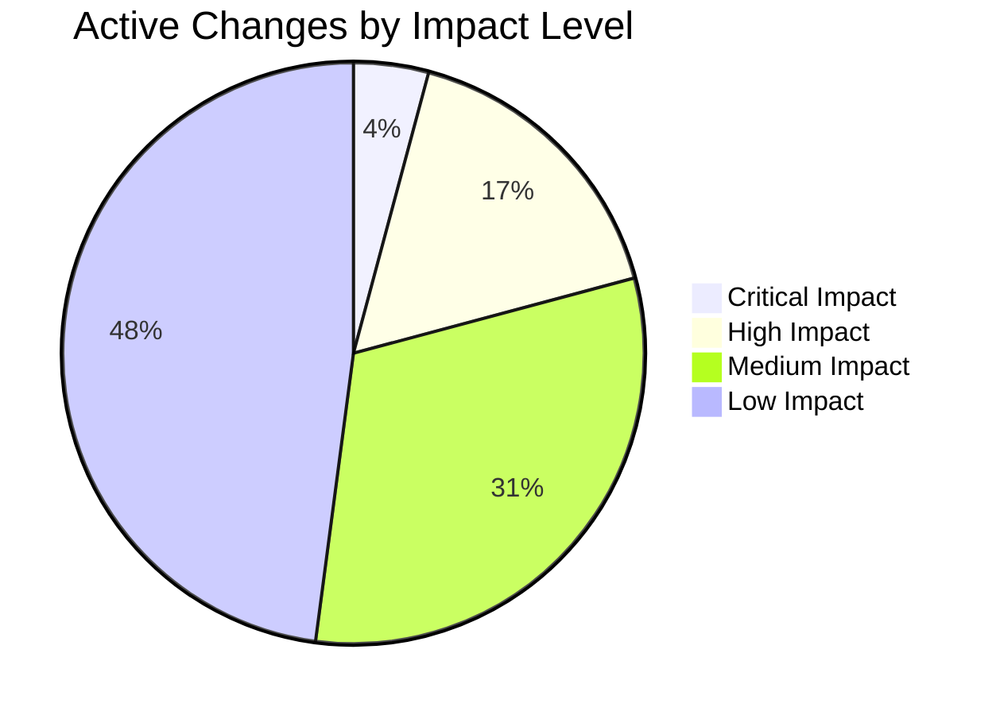

## Risk Assessment and Management

### Change Risk Assessment Framework

```mermaid
graph TD
    A[Change Risk Assessment] --> B[Technical Risks]
    A --> C[Business Risks]
    A --> D[Operational Risks]
    A --> E[External Risks]
    
    B --> B1[Architecture Compatibility]
    B --> B2[Integration Complexity]
    B --> B3[Performance Impact]
    B --> B4[Security Vulnerabilities]
    
    C --> C1[Business Disruption]
    C --> C2[Process Inefficiencies]
    C --> C3[User Adoption Issues]
    C --> C4[Competitive Disadvantage]
    
    D --> D1[Service Availability]
    D --> D2[Data Integrity]
    D --> D3[Backup and Recovery]
    D --> D4[Skills and Resources]
    
    E --> E1[Vendor Dependencies]
    E --> E2[Regulatory Changes]
    E --> E3[Market Conditions]
    E --> E4[Technology Evolution]
```

### Risk Management Strategies

| Risk Level | Probability Range | Impact Range | Management Strategy | Approval Required |
|------------|------------------|--------------|-------------------|------------------|
| **Very High** | >70% | Critical | Avoid or transfer risk | Executive approval |
| **High** | 50-70% | High-Critical | Mitigate with contingency | Architecture board |
| **Medium** | 30-50% | Medium-High | Monitor and prepare | Technical board |
| **Low** | 10-30% | Low-Medium | Accept with monitoring | Team lead |
| **Very Low** | <10% | Low | Accept | No additional approval |

### Risk Mitigation Planning

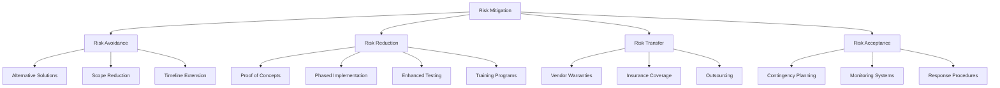

## Change Approval Governance

### Approval Authority Matrix

| Change Category | Technical Review | Business Review | Architecture Review | Executive Approval | Final Authority |
|-----------------|------------------|-----------------|---------------------|-------------------|-----------------|
| **Strategic** | Required | Required | Required | Required | CTO/CEO |
| **High Impact** | Required | Required | Required | Optional | Chief Architect |
| **Medium Impact** | Required | Required | Optional | Not Required | Architecture Board |
| **Low Impact** | Required | Optional | Not Required | Not Required | Technical Lead |
| **Emergency** | Post-implementation | Post-implementation | Post-implementation | Post-implementation | Incident Commander |

### Review Board Structure

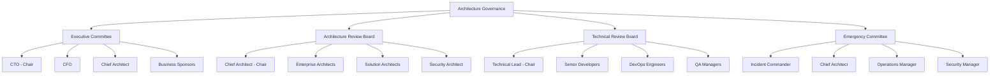

### Approval Decision Criteria

| Criterion | Weight | Evaluation Method | Scoring Range |
|-----------|--------|-------------------|---------------|
| **Business Value** | 30% | ROI and benefits analysis | 1-10 scale |
| **Technical Feasibility** | 25% | Architecture assessment | 1-10 scale |
| **Risk Level** | 20% | Risk assessment matrix | 1-10 scale |
| **Resource Availability** | 15% | Capacity planning | 1-10 scale |
| **Strategic Alignment** | 10% | Strategy mapping | 1-10 scale |

### Approval Workflow Process

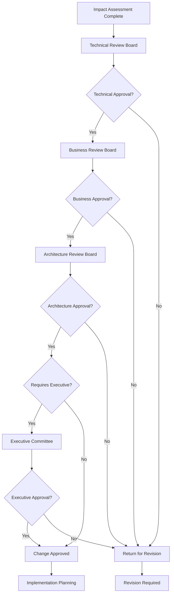

## Change Implementation Management

### Implementation Planning Framework

```mermaid
graph TD
    A[Implementation Planning] --> B[Technical Planning]
    A --> C[Resource Planning]
    A --> D[Timeline Planning]
    A --> E[Risk Planning]
    
    B --> B1[Architecture Design]
    B --> B2[Development Plan]
    B --> B3[Testing Strategy]
    B --> B4[Deployment Plan]
    
    C --> C1[Team Assignment]
    C --> C2[Skill Requirements]
    C --> C3[Budget Allocation]
    C --> C4[Vendor Coordination]
    
    D --> D1[Milestone Definition]
    D --> D2[Dependencies Mapping]
    D --> D3[Critical Path Analysis]
    D --> D4[Schedule Optimization]
    
    E --> E1[Risk Mitigation]
    E --> E2[Contingency Planning]
    E --> E3[Rollback Strategy]
    E --> E4[Communication Plan]
```

### Implementation Phase Management

| Phase | Objectives | Key Activities | Success Criteria | Gate Review |
|-------|------------|----------------|------------------|-------------|
| **Planning** | Detailed implementation plan | Design, resource allocation, scheduling | Plan approved by stakeholders | Planning Gate |
| **Development** | Build/configure solution | Coding, configuration, unit testing | Code quality standards met | Development Gate |
| **Testing** | Validate solution quality | Integration, system, user acceptance testing | All tests passed | Testing Gate |
| **Deployment** | Release to production | Production deployment, cutover | System operational | Deployment Gate |
| **Validation** | Confirm success | Performance monitoring, user feedback | Success criteria achieved | Closure Gate |

### Implementation Monitoring Dashboard

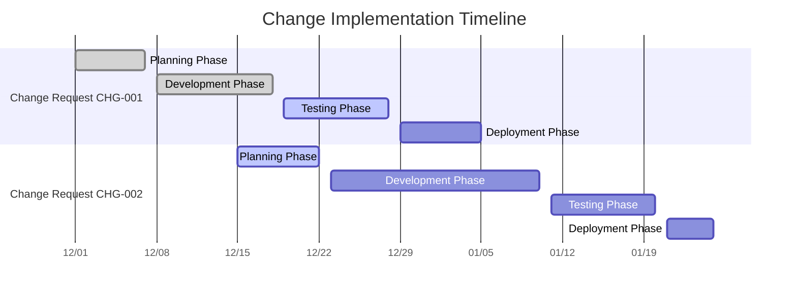

## Version Control and Configuration Management

### Architecture Version Control Strategy

```mermaid
graph TD
    A[Version Control Strategy] --> B[Repository Structure]
    A --> C[Branching Strategy]
    A --> D[Merge Process]
    A --> E[Release Management]
    
    B --> B1[Architecture Documents]
    B --> B2[Design Artifacts]
    B --> B3[Configuration Files]
    B --> B4[Standard Templates]
    
    C --> C1[Main Branch - Production]
    C --> C2[Development Branch]
    C --> C3[Feature Branches]
    C --> C4[Hotfix Branches]
    
    D --> D1[Pull Request Process]
    D --> D2[Peer Review Requirements]
    D --> D3[Automated Validation]
    D --> D4[Merge Approval Workflow]
    
    E --> E1[Version Tagging]
    E --> E2[Release Notes]
    E --> E3[Rollback Procedures]
    E --> E4[Change Documentation]
```

### Configuration Management Process

| Configuration Item | Versioning Scheme | Review Process | Approval Required | Storage Location |
|-------------------|-------------------|----------------|-------------------|------------------|
| **Architecture Documents** | Major.Minor.Patch | Peer review + architect | Chief Architect | Git Repository |
| **Design Models** | Date-based versioning | Technical review | Solution Architect | Model Repository |
| **Standards and Patterns** | Semantic versioning | Board review | Architecture Board | Standards Library |
| **Configuration Files** | Environment-specific | Change control | Operations Team | Configuration DB |

### Change Traceability Matrix

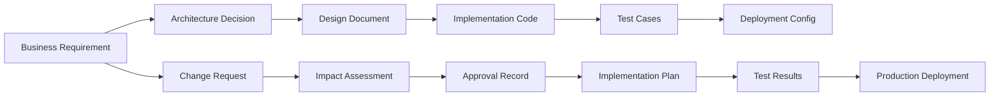

## Change Monitoring and Post-Implementation Review

### Change Performance Monitoring

```mermaid
graph TD
    A[Change Monitoring] --> B[Technical Performance]
    A --> C[Business Performance]
    A --> D[Operational Performance]
    A --> E[User Satisfaction]
    
    B --> B1[System Performance Metrics]
    B --> B2[Integration Point Health]
    B --> B3[Error Rates and Logs]
    B --> B4[Security Compliance]
    
    C --> C1[Business KPI Achievement]
    C --> C2[Process Efficiency Gains]
    C --> C3[Cost Impact Analysis]
    C --> C4[Revenue Impact Assessment]
    
    D --> D1[Service Availability]
    D --> D2[Response Time Performance]
    D --> D3[Capacity Utilization]
    D --> D4[Maintenance Efficiency]
    
    E --> E1[User Feedback Surveys]
    E --> E2[Support Ticket Analysis]
    E --> E3[Adoption Rate Metrics]
    E --> E4[Training Effectiveness]
```

### Post-Implementation Review Process

| Review Phase | Timeline | Participants | Objectives | Deliverables |
|--------------|----------|--------------|------------|--------------|
| **Immediate Review** | 1 week post-deployment | Technical team | Validate deployment success | Deployment report |
| **Short-term Review** | 1 month post-deployment | Project team + stakeholders | Assess initial performance | Performance report |
| **Long-term Review** | 3 months post-deployment | All stakeholders | Evaluate business impact | Benefits realization report |
| **Annual Review** | 12 months post-deployment | Architecture board | Strategic assessment | Architecture impact analysis |

### Change Effectiveness Metrics

| Metric Category | Metric | Target | Current | Trend | Status |
|-----------------|--------|--------|---------|-------|--------|
| **Change Success Rate** | Successful implementations | >95% | 96% | ↗ | 🟢 Good |
| **Change Cycle Time** | Average approval to deployment | <30 days | 28 days | ↘ | 🟢 Good |
| **Change Defect Rate** | Post-implementation defects | <5% | 3% | ↘ | 🟢 Excellent |
| **Stakeholder Satisfaction** | Average satisfaction rating | >4.0/5 | 4.2/5 | ↗ | 🟢 Excellent |
| **Business Value Realization** | Expected vs actual benefits | >90% | 94% | ↗ | 🟢 Excellent |

## Emergency Change Management

### Emergency Change Classification

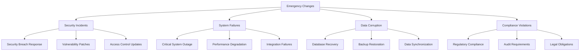

### Emergency Change Process

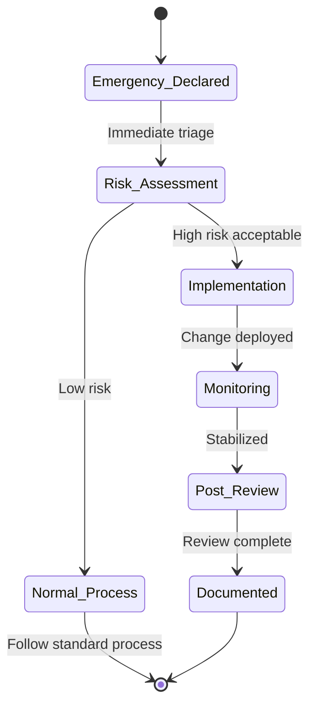

### Emergency Approval Authority

| Emergency Type | Severity | Immediate Approval | Post-Implementation Review | Documentation Required |
|----------------|----------|-------------------|---------------------------|------------------------|
| **Security Critical** | P1 | Security Manager + On-call Architect | Within 24 hours | Full impact assessment |
| **System Critical** | P1 | Operations Manager + Technical Lead | Within 24 hours | Full impact assessment |
| **Business Critical** | P1 | Business Owner + Architecture Lead | Within 48 hours | Business impact analysis |
| **Compliance Critical** | P2 | Compliance Officer + Legal | Within 72 hours | Compliance assessment |

## Change Communication Management

### Communication Framework

```mermaid
graph TD
    A[Change Communication] --> B[Stakeholder Identification]
    A --> C[Communication Planning]
    A --> D[Message Development]
    A --> E[Channel Selection]
    A --> F[Feedback Management]
    
    B --> B1[Executive Sponsors]
    B --> B2[Business Users]
    B --> B3[Technical Teams]
    B --> B4[External Partners]
    
    C --> C1[Communication Timeline]
    C --> C2[Frequency Planning]
    C --> C3[Escalation Procedures]
    C --> C4[Feedback Mechanisms]
    
    D --> D1[Executive Summaries]
    D --> D2[Technical Details]
    D --> D3[User Impact Analysis]
    D --> D4[Training Materials]
    
    E --> E1[Email Notifications]
    E --> E2[Dashboard Updates]
    E --> E3[Town Hall Meetings]
    E --> E4[Documentation Portals]
    
    F --> F1[Stakeholder Surveys]
    F --> F2[Feedback Forms]
    F --> F3[Q&A Sessions]
    F --> F4[Issue Escalation]
```

### Communication Plan Template

| Communication Type | Audience | Frequency | Channel | Content | Owner |
|-------------------|----------|-----------|---------|---------|-------|
| **Status Updates** | All stakeholders | Weekly | Email + Dashboard | Progress, issues, risks | Project Manager |
| **Executive Briefings** | Leadership team | Monthly | Presentation | Strategic impact, ROI | Architecture Lead |
| **Technical Updates** | Development teams | Bi-weekly | Team meetings | Technical details, dependencies | Technical Lead |
| **User Communications** | End users | As needed | Portal + Training | Impact, training, support | Business Lead |

## Continuous Improvement

### Change Process Improvement Framework

```mermaid
graph TD
    A[Process Improvement] --> B[Performance Analysis]
    A --> C[Stakeholder Feedback]
    A --> D[Best Practice Research]
    A --> E[Process Enhancement]
    
    B --> B1[Metrics Analysis]
    B --> B2[Trend Identification]
    B --> B3[Bottleneck Detection]
    B --> B4[Efficiency Assessment]
    
    C --> C1[Stakeholder Surveys]
    C --> C2[Focus Groups]
    C --> C3[Retrospectives]
    C --> C4[Complaints Analysis]
    
    D --> D1[Industry Standards]
    D --> D2[Competitor Analysis]
    D --> D3[Technology Evolution]
    D --> D4[Regulatory Changes]
    
    E --> E1[Process Redesign]
    E --> E2[Tool Enhancement]
    E --> E3[Training Updates]
    E --> E4[Policy Revisions]
```

### Improvement Initiatives

| Initiative | Objective | Timeline | Owner | Expected Benefit |
|------------|-----------|----------|-------|------------------|
| **Process Automation** | Reduce manual effort by 50% | Q1 2025 | Process Team | Faster cycle times |
| **AI-Powered Assessment** | Enhance impact analysis accuracy | Q2 2025 | Innovation Team | Better risk prediction |
| **Stakeholder Portal** | Improve transparency and communication | Q1 2025 | IT Team | Higher satisfaction |
| **Integration Enhancement** | Better tool connectivity | Q2 2025 | DevOps Team | Improved efficiency |

## Success Metrics and KPIs

### Change Management KPIs

| KPI Category | Metric | Current | Target | Trend | Status |
|--------------|--------|---------|--------|-------|--------|
| **Process Efficiency** | Average cycle time | 28 days | <30 days | ↘ | 🟢 Good |
| **Change Success** | Implementation success rate | 96% | >95% | ↗ | 🟢 Excellent |
| **Risk Management** | Change-related incidents | 2% | <5% | ↘ | 🟢 Excellent |
| **Stakeholder Satisfaction** | Overall satisfaction | 4.2/5 | >4.0/5 | ↗ | 🟢 Excellent |
| **Business Value** | Benefits realization | 94% | >90% | ↗ | 🟢 Excellent |

### Performance Dashboard

```mermaid
xychart-beta
    title "Change Management Performance Trends"
    x-axis [Jan, Feb, Mar, Apr, May, Jun, Jul, Aug, Sep, Oct, Nov, Dec]
    y-axis "Score/Days" 0 --> 40
    line [35, 34, 32, 30, 29, 28, 27, 26, 28, 27, 28, 26]
    line [92, 93, 94, 95, 96, 95, 96, 97, 95, 96, 96, 97]
```

## Future Vision and Roadmap

### Future State Vision

The Architecture Change Control Process will evolve to provide:
- **AI-Powered Impact Assessment:** Automated analysis of change implications
- **Predictive Risk Management:** Proactive identification of potential issues
- **Self-Service Change Requests:** Streamlined submission and tracking
- **Real-Time Collaboration:** Enhanced stakeholder engagement and decision-making
- **Continuous Compliance:** Automated adherence to architectural standards

### Implementation Roadmap

| Phase | Timeline | Objectives | Key Deliverables |
|-------|----------|------------|------------------|
| **Phase 1** | Q1 2025 | Process automation foundation | Automated workflows, enhanced tools |
| **Phase 2** | Q2 2025 | AI and analytics integration | Predictive capabilities, smart assessments |
| **Phase 3** | Q3 2025 | Stakeholder experience enhancement | Self-service portal, mobile access |
| **Phase 4** | Q4 2025 | Advanced governance capabilities | Real-time compliance, continuous monitoring |

## Conclusion and Next Steps

### Key Success Factors

1. **Executive Support:** Strong leadership commitment to change governance
2. **Process Adoption:** Comprehensive training and change management
3. **Tool Integration:** Seamless connectivity between systems and processes
4. **Continuous Improvement:** Regular assessment and enhancement of processes
5. **Stakeholder Engagement:** Active participation and feedback from all stakeholders

### Immediate Next Steps

1. **Finalize Process Documentation:** Complete all process templates and guidelines
2. **Implement Supporting Tools:** Deploy and configure change management systems
3. **Train Stakeholders:** Comprehensive training program for all participants
4. **Pilot Testing:** Execute pilot changes to validate and refine processes
5. **Launch Communication Campaign:** Announce and promote the new change process

### Long-term Success Monitoring

- Monthly process performance reviews with continuous optimization
- Quarterly stakeholder satisfaction assessments
- Semi-annual process maturity evaluations
- Annual strategic alignment reviews
- Continuous integration of industry best practices and emerging technologies

---

**Document Status:** Final  
**Last Updated:** 2024-12-19  
**Next Review:** 2025-03-19