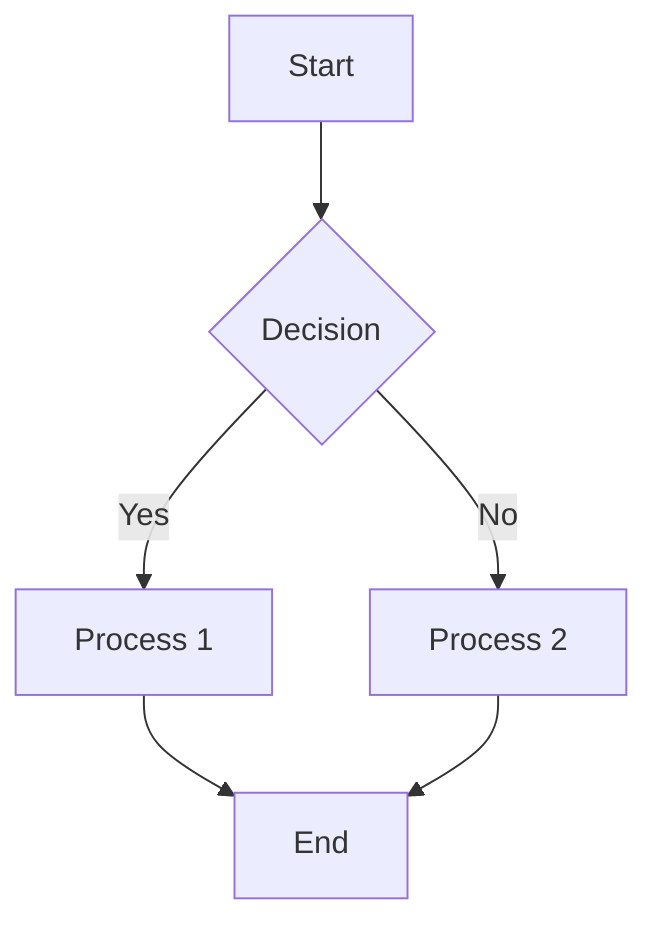
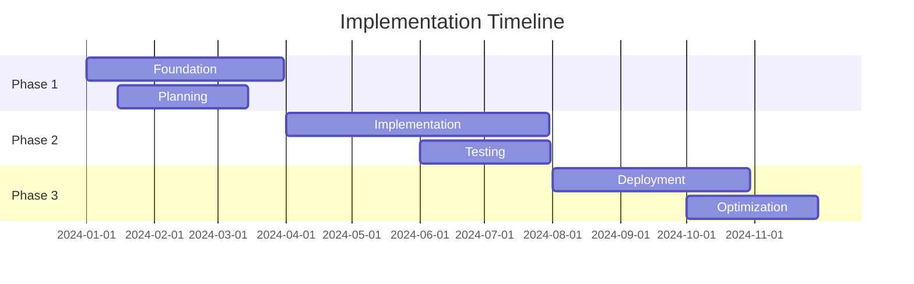

# Enterprise Architecture Document Template

## Document Information
- **Document Title:** [Insert Title]
- **Document Version:** [Version Number]
- **Document Date:** [Creation Date]
- **Document Owner:** [Owner Name/Team]
- **Approved By:** [Approval Authority]
- **Review Frequency:** [Review Schedule]
- **Next Review:** [Next Review Date]

## Executive Summary
[Provide a concise overview of the document purpose, key findings, recommendations, and expected outcomes. This section should be readable by executive stakeholders who may not read the full document.]

### Key Points
- [Key point 1]
- [Key point 2]
- [Key point 3]

### Recommendations Summary
- [Recommendation 1]
- [Recommendation 2]
- [Recommendation 3]

## Purpose and Scope

### Document Purpose
[Clearly state why this document exists and what it aims to achieve]

### Scope
**In Scope:**
- [Item 1]
- [Item 2]
- [Item 3]

**Out of Scope:**
- [Item 1]
- [Item 2]
- [Item 3]

### Objectives
1. [Objective 1]
2. [Objective 2]
3. [Objective 3]

### Success Criteria
- [Success criterion 1]
- [Success criterion 2]
- [Success criterion 3]

## Context and Background

### Business Context
[Explain the business context that drives the need for this deliverable]

### Current State
[Describe the current state situation being addressed]

### Drivers for Change
- [Driver 1]
- [Driver 2]
- [Driver 3]

### Constraints and Assumptions
**Constraints:**
- [Constraint 1]
- [Constraint 2]

**Assumptions:**
- [Assumption 1]
- [Assumption 2]

## Main Content Section

### [Primary Content Area 1]
[Detailed content for the main subject matter]

#### Subsection 1.1
[Detailed information]

#### Subsection 1.2
[Detailed information]

### [Primary Content Area 2]
[Detailed content for the main subject matter]

#### Mermaid Diagram Example

### [Primary Content Area 3]
[Detailed content for the main subject matter]

## Analysis and Assessment

### Current State Analysis
[Analysis of current situation]

### Gap Analysis
| Area | Current State | Target State | Gap | Priority |
|------|---------------|--------------|-----|----------|
| [Area 1] | [Current] | [Target] | [Gap] | [Priority] |
| [Area 2] | [Current] | [Target] | [Gap] | [Priority] |

### Risk Assessment
| Risk | Probability | Impact | Mitigation Strategy | Owner |
|------|-------------|--------|-------------------|--------|
| [Risk 1] | [High/Med/Low] | [High/Med/Low] | [Strategy] | [Owner] |
| [Risk 2] | [High/Med/Low] | [High/Med/Low] | [Strategy] | [Owner] |

## Recommendations and Solutions

### Primary Recommendations
1. **[Recommendation 1]**
   - Description: [Description]
   - Rationale: [Why this recommendation]
   - Impact: [Expected impact]
   - Timeline: [Implementation timeline]
   - Resources: [Required resources]

2. **[Recommendation 2]**
   - Description: [Description]
   - Rationale: [Why this recommendation]
   - Impact: [Expected impact]
   - Timeline: [Implementation timeline]
   - Resources: [Required resources]

### Alternative Options
[Discuss alternative approaches that were considered but not recommended]

## Implementation Approach

### Implementation Roadmap

### Resource Requirements
| Resource Type | Quantity | Duration | Skills Required |
|---------------|----------|----------|-----------------|
| [Resource 1] | [Number] | [Duration] | [Skills] |
| [Resource 2] | [Number] | [Duration] | [Skills] |

### Dependencies
- [Dependency 1]
- [Dependency 2]
- [Dependency 3]

## Financial Impact

### Cost Analysis
| Cost Category | Year 1 | Year 2 | Year 3 | Total |
|---------------|--------|--------|--------|-------|
| [Category 1] | [Amount] | [Amount] | [Amount] | [Total] |
| [Category 2] | [Amount] | [Amount] | [Amount] | [Total] |
| **Total** | [Total Y1] | [Total Y2] | [Total Y3] | [Grand Total] |

### Benefit Analysis
| Benefit | Year 1 | Year 2 | Year 3 | Total |
|---------|--------|--------|--------|-------|
| [Benefit 1] | [Amount] | [Amount] | [Amount] | [Total] |
| [Benefit 2] | [Amount] | [Amount] | [Amount] | [Total] |
| **Total** | [Total Y1] | [Total Y2] | [Total Y3] | [Grand Total] |

### Return on Investment
- **Net Present Value (NPV):** [NPV Amount]
- **Internal Rate of Return (IRR):** [IRR Percentage]
- **Payback Period:** [Payback Period]

## Performance Measurement

### Key Performance Indicators
| KPI | Baseline | Target | Measurement Method | Frequency |
|-----|----------|--------|--------------------|-----------|
| [KPI 1] | [Baseline] | [Target] | [Method] | [Frequency] |
| [KPI 2] | [Baseline] | [Target] | [Method] | [Frequency] |

### Success Metrics
- [Metric 1]: [Definition and target]
- [Metric 2]: [Definition and target]
- [Metric 3]: [Definition and target]

### Monitoring and Reporting
- **Reporting Frequency:** [Frequency]
- **Report Recipients:** [Stakeholders]
- **Review Process:** [Review procedure]
- **Escalation Criteria:** [When to escalate]

## Governance and Compliance

### Governance Framework
[Describe governance structure and decision-making process]

### Compliance Requirements
- [Requirement 1]
- [Requirement 2]
- [Requirement 3]

### Approval Process
1. [Step 1]
2. [Step 2]
3. [Step 3]

## Change Management

### Change Impact Assessment
[Assess the impact of changes on organization, processes, and people]

### Communication Strategy
- **Target Audiences:** [List audiences]
- **Key Messages:** [Core messages]
- **Communication Channels:** [Channels to use]
- **Timeline:** [Communication schedule]

### Training and Support
- **Training Requirements:** [Training needs]
- **Support Strategy:** [Support approach]
- **Knowledge Transfer:** [Transfer plan]

## Quality Assurance

### Quality Standards
- [Standard 1]
- [Standard 2]
- [Standard 3]

### Review Process
- **Review Stages:** [Review points]
- **Review Criteria:** [What to review]
- **Reviewers:** [Who reviews]

### Validation Approach
[How to validate the deliverable meets requirements]

## Appendices

### Appendix A: Detailed Analysis
[Additional detailed information]

### Appendix B: Supporting Data
[Data tables, charts, and detailed metrics]

### Appendix C: Technical Specifications
[Technical details and specifications]

### Appendix D: Stakeholder Feedback
[Summary of stakeholder input and feedback]

### Appendix E: References and Standards
- [Reference 1]
- [Reference 2]
- [Reference 3]

### Appendix F: Glossary and Definitions
| Term | Definition |
|------|------------|
| [Term 1] | [Definition] |
| [Term 2] | [Definition] |

---

## Document Control

| Version | Date | Author | Changes |
|---------|------|--------|---------|
| 0.1 | [Date] | [Author] | Initial draft |
| 1.0 | [Date] | [Author] | Final version |

**Document Classification:** [Public/Internal/Confidential/Restricted]  
**Document Location:** [File path or repository location]  
**Related Documents:** [List of related documents]