# Mermaid Diagram Templates for Enterprise Architecture

## Overview
This document provides standardized Mermaid diagram templates for enterprise architecture deliverables, ensuring consistency and clarity across all architectural visualizations.

## Business Architecture Diagrams

### Business Process Flow
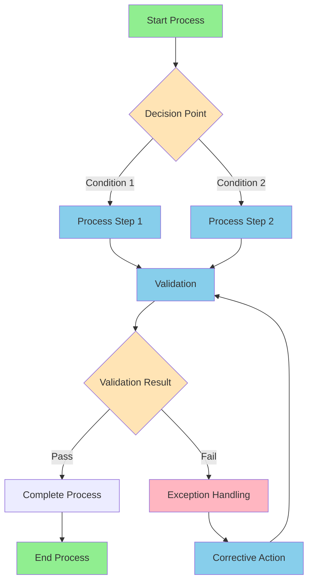

### Organizational Structure
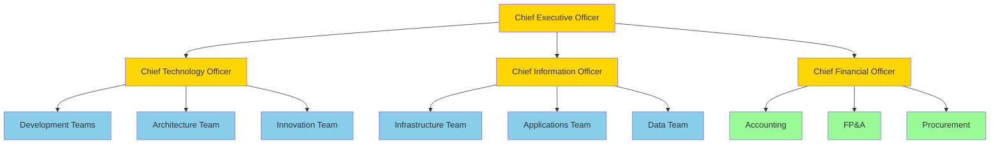

### Business Capability Map
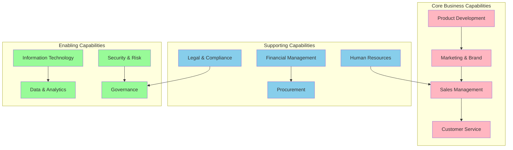

### Value Stream Map
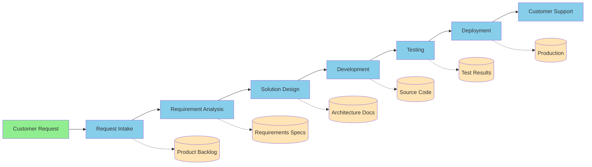

## Application Architecture Diagrams

### Application Landscape
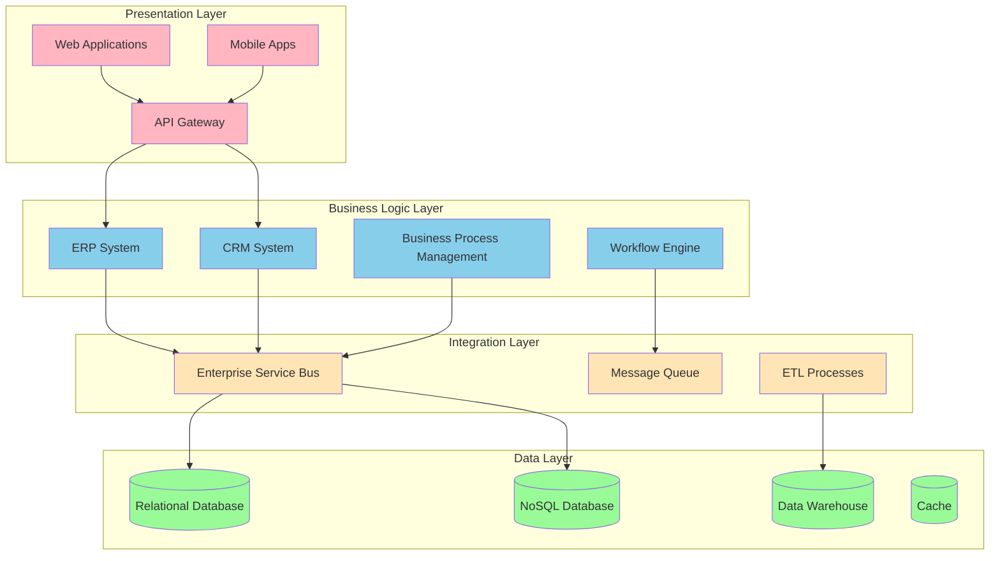

### Application Integration Pattern
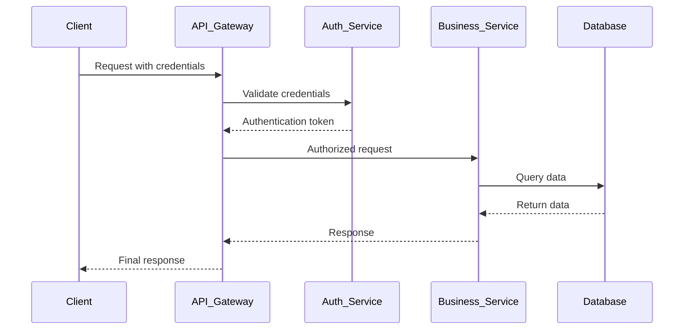

### Microservices Architecture
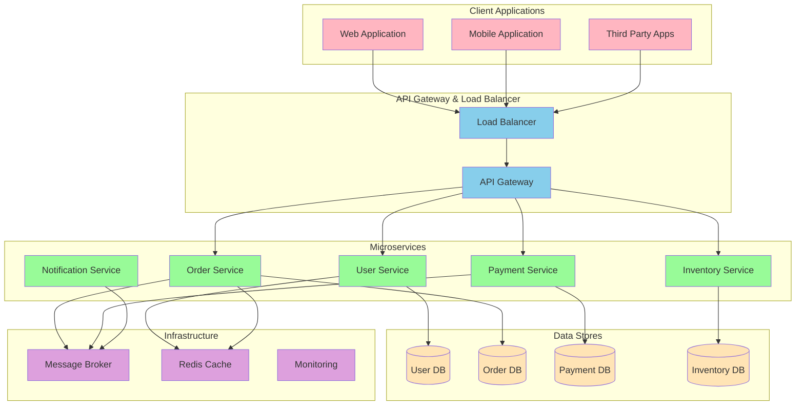

## Technology Architecture Diagrams

### Infrastructure Architecture
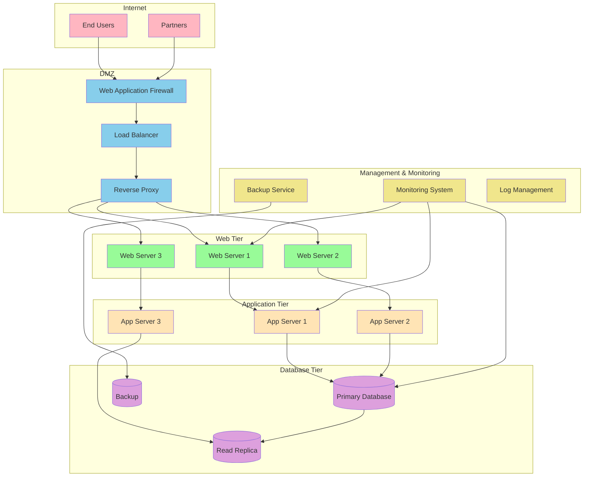

### Cloud Architecture
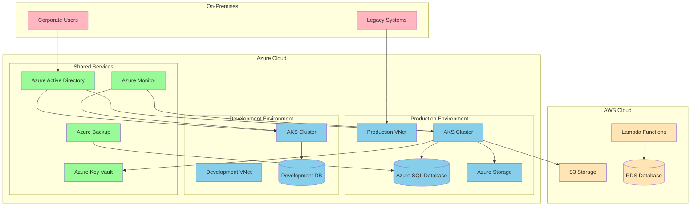

### Network Architecture
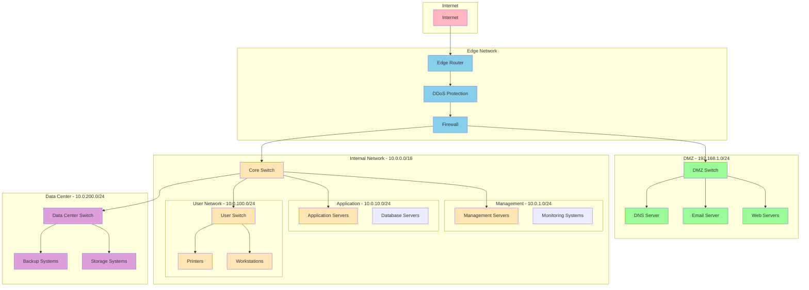

## Data Architecture Diagrams

### Data Flow Diagram
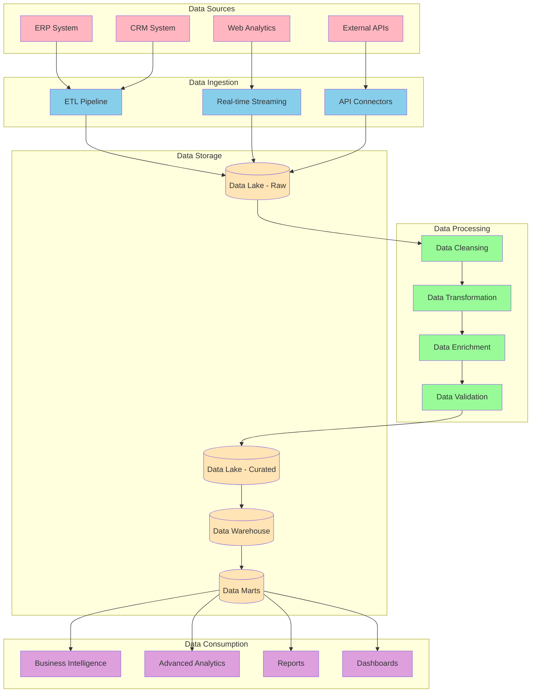

### Data Model Relationships
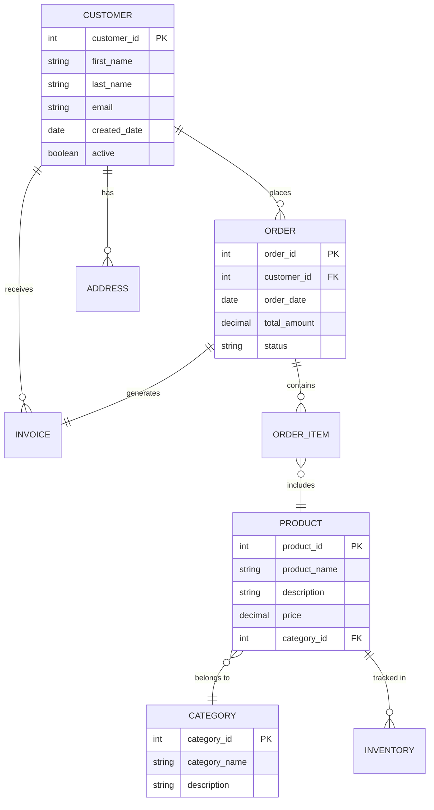

## Security Architecture Diagrams

### Security Layers
```mermaid
graph TB
    subgraph "Perimeter Security"
        FIREWALL[Next-Gen Firewall]
        WAF[Web Application Firewall]
        IPS[Intrusion Prevention]
        DLP[Data Loss Prevention]
    end
    
    subgraph "Network Security"
        SEGMENTATION[Network Segmentation]
        VPN[VPN Gateway]
        NAC[Network Access Control]
        MONITORING[Network Monitoring]
    end
    
    subgraph "Identity & Access"
        IAM[Identity Management]
        MFA[Multi-Factor Auth]
        PAM[Privileged Access]
        SSO[Single Sign-On]
    end
    
    subgraph "Application Security"
        SAST[Static Analysis]
        DAST[Dynamic Analysis]
        RASP[Runtime Protection]
        API_SEC[API Security]
    end
    
    subgraph "Data Security"
        ENCRYPTION[Data Encryption]
        MASKING[Data Masking]
        TOKENIZATION[Tokenization]
        KEY_MGMT[Key Management]
    end
    
    subgraph "Endpoint Security"
        EDR[Endpoint Detection]
        ANTIVIRUS[Antivirus]
        PATCH_MGMT[Patch Management]
        DEVICE_CONTROL[Device Control]
    end
    
    FIREWALL --> SEGMENTATION
    WAF --> API_SEC
    IPS --> MONITORING
    
    IAM --> SSO
    MFA --> PAM
    
    SAST --> RASP
    DAST --> API_SEC
    
    ENCRYPTION --> KEY_MGMT
    MASKING --> TOKENIZATION
    
    EDR --> DEVICE_CONTROL
    ANTIVIRUS --> PATCH_MGMT
    
    classDef perimeter fill:#FFB6C1
    classDef network fill:#87CEEB
    classDef identity fill:#98FB98
    classDef application fill:#FFE4B5
    classDef data fill:#DDA0DD
    classDef endpoint fill:#F0E68C
    
    class FIREWALL,WAF,IPS,DLP perimeter
    class SEGMENTATION,VPN,NAC,MONITORING network
    class IAM,MFA,PAM,SSO identity
    class SAST,DAST,RASP,API_SEC application
    class ENCRYPTION,MASKING,TOKENIZATION,KEY_MGMT data
    class EDR,ANTIVIRUS,PATCH_MGMT,DEVICE_CONTROL endpoint
```

## Implementation and Migration Diagrams

### Migration Timeline
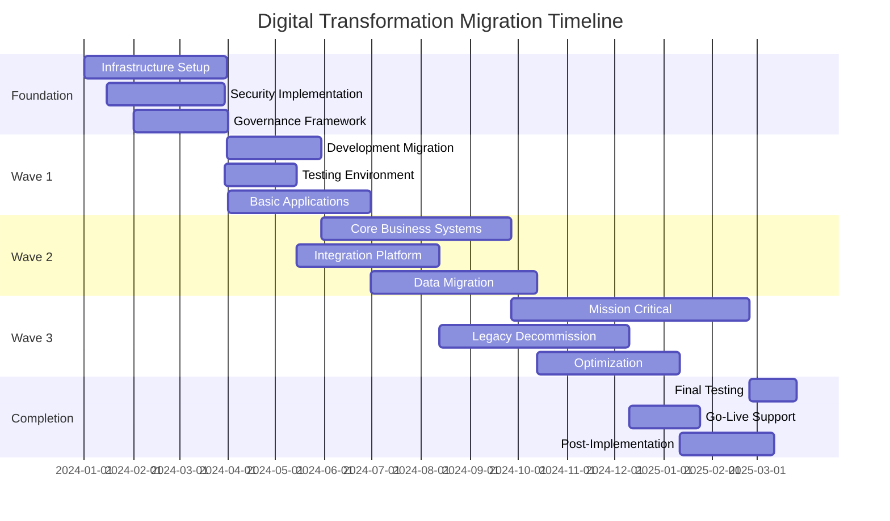

### Deployment Architecture
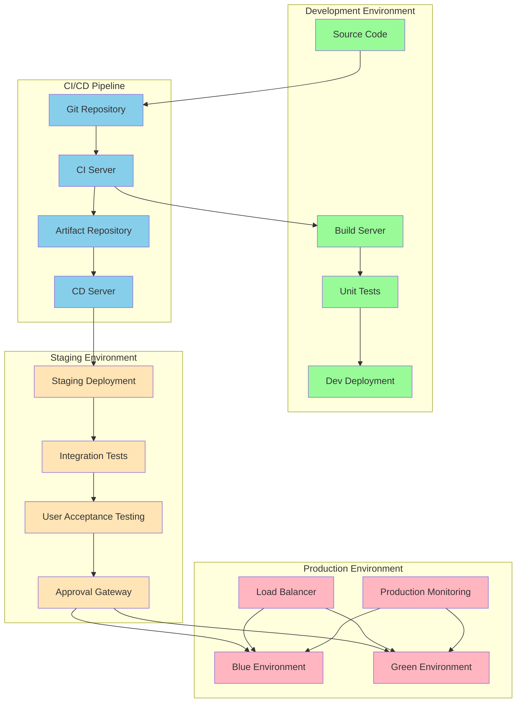

## Customization Guidelines

### Color Scheme Standards
- **Core Business Functions:** `#FFB6C1` (Light Pink)
- **Supporting Services:** `#87CEEB` (Sky Blue)
- **Enabling Technologies:** `#98FB98` (Pale Green)
- **Data and Storage:** `#FFE4B5` (Moccasin)
- **Security and Compliance:** `#DDA0DD` (Plum)
- **External Systems:** `#F0E68C` (Khaki)

### Diagram Conventions
1. **Start/End nodes:** Use rounded rectangles
2. **Process steps:** Use rectangles
3. **Decision points:** Use diamonds
4. **Data stores:** Use cylinders
5. **External systems:** Use hexagons
6. **Services:** Use circles

### Best Practices
1. Keep diagrams focused and uncluttered
2. Use consistent naming conventions
3. Include legends for complex diagrams
4. Ensure proper flow direction (top-to-bottom, left-to-right)
5. Group related elements using subgraphs
6. Use appropriate arrow types for relationships
7. Include version control information

---
**Template Version:** 1.0  
**Last Updated:** September 19, 2025  
**Owner:** Enterprise Architecture Team  
**Usage:** Standard template for all EA diagrams