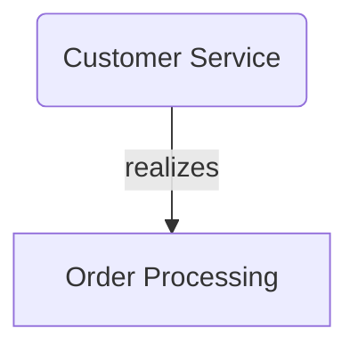
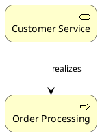

# Model Generation Guide - Enterprise Architect Integration

## Overview

The **ArchiAgents Model Generation System** provides comprehensive capabilities for generating enterprise architecture models with AI-powered intelligence and support for multiple output formats.

## Key Capabilities

### ✅ Supported Model Types

#### ArchiMate 3.0 Models
- **Strategy Layer** - Capabilities, value streams, goals, resources
- **Business Layer** - Actors, processes, services, functions
- **Application Layer** - Components, services, interfaces, data objects
- **Technology Layer** - Nodes, devices, software, networks
- **Physical Layer** - Equipment, facilities, distribution networks
- **Implementation Layer** - Work packages, deliverables, plateaus
- **Multi-Layer Models** - Complete enterprise architecture views

#### BPMN 2.0 Models
- **Process Models** - End-to-end business processes
- **Collaboration Models** - Cross-organizational processes
- **Choreography Models** - Service interactions

#### UML 2.0 Diagrams (All 12 Types)
1. **Class Diagram** - Domain models and object structures
2. **Sequence Diagram** - Interaction flows
3. **Use Case Diagram** - System functionality
4. **Activity Diagram** - Process workflows
5. **State Machine Diagram** - State transitions
6. **Component Diagram** - System components
7. **Deployment Diagram** - Physical deployment
8. **Object Diagram** - Object instances
9. **Package Diagram** - Package structure
10. **Timing Diagram** - Timing constraints
11. **Communication Diagram** - Message flows
12. **Interaction Overview Diagram** - High-level interactions

### ✅ Output Formats

1. **Text (Markdown)** - Human-readable documentation
2. **Mermaid** - Diagrams for Markdown/GitHub
3. **Kroki (PlantUML)** - Advanced diagram rendering
4. **Archi XML** - Import into Archi tool
5. **GoJS JSON** - Interactive web visualizations
6. **Enterprise Architect XMI** - Import into Sparx EA

## Quick Start

### Generate ArchiMate Model

```bash
# Generate business layer model
python archiagents.py model generate \
  --type archimate-business \
  --name "Business Architecture Model" \
  --format mermaid \
  --format archi

# Generate multi-layer enterprise model
python archiagents.py model generate \
  --type archimate-multi-layer \
  --name "Enterprise Architecture" \
  --format text \
  --format mermaid \
  --format gojs
```

### Generate BPMN Process

```bash
# Generate process model
python archiagents.py model generate \
  --type bpmn-process \
  --name "Order Fulfillment Process" \
  --format mermaid \
  --format kroki
```

### Generate UML Diagrams

```bash
# Generate class diagram
python archiagents.py model generate \
  --type uml-class \
  --name "Domain Model" \
  --format mermaid \
  --format ea

# Generate sequence diagram
python archiagents.py model generate \
  --type uml-sequence \
  --name "User Authentication Flow" \
  --format mermaid \
  --format kroki
```

## Command Reference

### `model generate`

Generate architecture models with AI assistance.

**Usage:**
```bash
python archiagents.py model generate [OPTIONS]
```

**Options:**
- `--project PATH` - Project directory (default: current directory)
- `--type TYPE` - Model type (required)
  - ArchiMate: `archimate-strategy`, `archimate-business`, `archimate-application`, `archimate-technology`, `archimate-physical`, `archimate-implementation`, `archimate-multi-layer`
  - BPMN: `bpmn-process`
  - UML: `uml-class`, `uml-sequence`, `uml-use-case`, `uml-activity`, `uml-state`, `uml-component`, `uml-deployment`
- `--name TEXT` - Model name (required)
- `--format FORMAT` - Output format(s), can specify multiple (default: text, mermaid)
  - Formats: `text`, `mermaid`, `kroki`, `archi`, `gojs`, `ea`
- `--use-ai/--no-ai` - Enable/disable AI generation (default: enabled)
- `--output-dir PATH` - Custom output directory

**Examples:**

```bash
# Business architecture with multiple formats
python archiagents.py model generate \
  --type archimate-business \
  --name "Business Model" \
  --format text \
  --format mermaid \
  --format archi

# UML class diagram for Enterprise Architect
python archiagents.py model generate \
  --type uml-class \
  --name "Core Domain" \
  --format ea \
  --output-dir ./models/domain

# BPMN process with Kroki
python archiagents.py model generate \
  --type bpmn-process \
  --name "Customer Onboarding" \
  --format kroki
```

### `model list`

List all generated models in the project.

**Usage:**
```bash
python archiagents.py model list [OPTIONS]
```

**Options:**
- `--project PATH` - Project directory
- `--format FORMAT` - Output format: `table` (default), `json`, `tree`

**Example:**
```bash
python archiagents.py model list --format table
```

**Output:**
```
+-------------------------+--------------------------------+----------------------+-----------+------------+
| ID                      | Name                           | Type                 | Elements  | Created    |
+-------------------------+--------------------------------+----------------------+-----------+------------+
| archimate_business_2025 | Business Architecture Model    | archimate_business   | 12        | 2025-10-22 |
| uml_class_20251022      | Domain Model                   | uml_class            | 8         | 2025-10-22 |
| bpmn_process_20251022   | Order Fulfillment Process      | bpmn_process         | 6         | 2025-10-22 |
+-------------------------+--------------------------------+----------------------+-----------+------------+

Total: 3 model(s)
```

### `model validate`

Validate model against architecture standards.

**Usage:**
```bash
python archiagents.py model validate MODEL_ID [OPTIONS]
```

**Arguments:**
- `MODEL_ID` - ID of model to validate

**Options:**
- `--project PATH` - Project directory
- `--standards TEXT` - Standards to validate against (default: archimate, togaf)

**Example:**
```bash
python archiagents.py model validate archimate_business_20251022 --standards archimate --standards togaf
```

**Output:**
```
Validating model: Business Architecture Model
Standards: archimate, togaf

Compliance Score: 85/100

Model passed validation with minor issues

Issues Found:

⚠️ WARNING: Missing descriptions
   Standard: archimate
   Element: business_process_1
   Fix: Add description to all elements for better documentation

ℹ️ INFO: Consider adding more relationships
   Standard: togaf
   Element: N/A
   Fix: Review and add missing relationships between elements
```

### `model export`

Export model to different format.

**Usage:**
```bash
python archiagents.py model export MODEL_ID [OPTIONS]
```

**Arguments:**
- `MODEL_ID` - ID of model to export

**Options:**
- `--project PATH` - Project directory
- `--format FORMAT` - Export format (required): `text`, `mermaid`, `kroki`, `archi`, `gojs`, `ea`
- `--output PATH` - Output file path

**Examples:**
```bash
# Export to Mermaid
python archiagents.py model export archimate_business_20251022 \
  --format mermaid \
  --output business_model.mmd

# Export to Archi XML
python archiagents.py model export archimate_business_20251022 \
  --format archi \
  --output business_model.xml

# Export to Enterprise Architect
python archiagents.py model export uml_class_20251022 \
  --format ea \
  --output domain_model.xmi
```

### `model improve`

Get AI-powered improvement suggestions for a model.

**Usage:**
```bash
python archiagents.py model improve MODEL_ID [OPTIONS]
```

**Arguments:**
- `MODEL_ID` - ID of model to analyze

**Options:**
- `--project PATH` - Project directory

**Example:**
```bash
python archiagents.py model improve archimate_business_20251022
```

**Output:**
```
Analyzing model: Business Architecture Model

Found 3 improvement suggestion(s):

1. [MEDIUM] COMPLETENESS
   Issue: 5 elements are missing descriptions
   Recommendation: Add descriptions to all elements for better documentation

2. [HIGH] RELATIONSHIPS
   Issue: Model has few relationships compared to elements
   Recommendation: Review and add missing relationships between elements

3. [LOW] NAMING
   Issue: Some elements use technical IDs instead of business names
   Recommendation: Use business-friendly names for all elements
```

## Integration with Enterprise Architect

### Export to Enterprise Architect

```bash
# Generate UML class diagram for EA
python archiagents.py model generate \
  --type uml-class \
  --name "Application Domain Model" \
  --format ea \
  --output-dir ./ea_models

# Find the XMI file
ls ./ea_models/*/model.xmi
```

### Import into Enterprise Architect

1. Open Enterprise Architect
2. Go to **Project → Import/Export → Import Package from XMI**
3. Select the generated `model.xmi` file
4. Choose target package
5. Click **Import**

### Export ArchiMate to Archi Tool

```bash
# Generate ArchiMate model for Archi
python archiagents.py model generate \
  --type archimate-multi-layer \
  --name "Enterprise Architecture" \
  --format archi

# Import into Archi
# 1. Open Archi
# 2. File → Import → Open Exchange File...
# 3. Select the generated model.xml
```

## AI-Powered Model Generation

### How AI Generation Works

The AI modeling agent:

1. **Analyzes Context** - Reads TOGAF phase deliverables and enterprise context
2. **Generates Elements** - Creates appropriate ArchiMate/UML elements
3. **Establishes Relationships** - Determines logical connections
4. **Applies Patterns** - Uses architecture patterns and best practices
5. **Validates** - Checks compliance with metamodel rules

### Customizing AI Generation

Configure AI behavior in project config:

```yaml
# .archiagents/project.yaml
enterprise:
  industry: "Financial Services"
  organization_size: "Large"
  goals:
    - "Digital Banking Transformation"
    - "Cloud Migration"
    - "API-First Architecture"
  challenges:
    - "Legacy Mainframe Systems"
    - "Regulatory Compliance"
    - "Technical Debt"

ai:
  provider: "openai"
  model: "gpt-4"
  temperature: 0.7
```

The AI will generate more contextually relevant models based on this configuration.

## Output Format Details

### 1. Text (Markdown)

Human-readable documentation with element descriptions and relationships.

```markdown
# Business Architecture Model

**Type:** archimate_business
**Created:** 2025-10-22T10:30:00

## Elements

### Customer Service
- **Type:** business_service
- **ID:** service_customer_service
- **Description:** Customer-facing service for support and inquiries

### Order Processing
- **Type:** business_process
- **ID:** process_order_processing
- **Description:** End-to-end order fulfillment process

## Relationships

- `service_customer_service` --[realizes]--> `process_order_processing`
```

### 2. Mermaid Diagrams

Embedded diagrams for GitHub, GitLab, and documentation.



### 3. Kroki (PlantUML)

Advanced diagrams with PlantUML syntax for Kroki service.



### 4. Archi XML

Import into Archi tool for visual editing.

```xml
<archimate:model xmlns:archimate="http://www.archimatetool.com/archimate"
                 name="Business Architecture Model">
  <folders name="Business" type="business">
    <element xsi:type="archimate:business_service"
             name="Customer Service"
             id="service_customer_service"/>
    <element xsi:type="archimate:business_process"
             name="Order Processing"
             id="process_order_processing"/>
  </folders>
</archimate:model>
```

### 5. GoJS JSON

Interactive web visualizations with GoJS library.

```json
{
  "class": "GraphLinksModel",
  "nodeDataArray": [
    {
      "key": "service_customer_service",
      "text": "Customer Service",
      "category": "business_service"
    },
    {
      "key": "process_order_processing",
      "text": "Order Processing",
      "category": "business_process"
    }
  ],
  "linkDataArray": [
    {
      "from": "service_customer_service",
      "to": "process_order_processing",
      "text": "realizes"
    }
  ]
}
```

### 6. Enterprise Architect XMI

Import into Sparx Enterprise Architect.

```xml
<XMI xmi.version="1.1" xmlns:UML="omg.org/UML1.3">
  <XMI.content>
    <UML:Model name="Business Architecture Model">
      <UML:Namespace.ownedElement>
        <UML:Component name="Customer Service" xmi.id="service_customer_service"/>
        <UML:Component name="Order Processing" xmi.id="process_order_processing"/>
      </UML:Namespace.ownedElement>
    </UML:Model>
  </XMI.content>
</XMI>
```

## Advanced Use Cases

### 1. Complete TOGAF ADM Model Generation

Generate models for each TOGAF phase:

```bash
# Phase A - Architecture Vision
python archiagents.py model generate \
  --type archimate-strategy \
  --name "Architecture Vision" \
  --format text --format mermaid

# Phase B - Business Architecture
python archiagents.py model generate \
  --type archimate-business \
  --name "Business Architecture" \
  --format text --format mermaid --format archi

# Phase C - Information Systems
python archiagents.py model generate \
  --type archimate-application \
  --name "Application Architecture" \
  --format text --format mermaid --format gojs

# Phase D - Technology Architecture
python archiagents.py model generate \
  --type archimate-technology \
  --name "Technology Architecture" \
  --format text --format mermaid --format ea
```

### 2. Multi-Format Export Pipeline

```bash
#!/bin/bash
# generate_all_formats.sh

MODEL_ID="archimate_business_20251022"

# Export to all formats
for format in text mermaid kroki archi gojs ea; do
    python archiagents.py model export $MODEL_ID \
        --format $format \
        --output "exports/${MODEL_ID}.${format}"
done

echo "All formats exported to exports/ directory"
```

### 3. CI/CD Integration

```yaml
# .github/workflows/architecture.yml
name: Architecture Model Generation

on:
  push:
    paths:
      - 'architecture/**'

jobs:
  generate-models:
    runs-on: ubuntu-latest
    steps:
      - uses: actions/checkout@v2
      
      - name: Generate Architecture Models
        run: |
          cd togaf_framework
          
          # Generate business model
          python archiagents.py model generate \
            --type archimate-business \
            --name "Business Architecture" \
            --format mermaid
          
          # Validate
          python archiagents.py model validate latest \
            --standards archimate togaf
      
      - name: Upload Artifacts
        uses: actions/upload-artifact@v2
        with:
          name: architecture-models
          path: models/
```

## Best Practices

### 1. Model Organization

```
project/
├── models/
│   ├── strategy/
│   │   ├── archimate_strategy_20251022/
│   │   │   ├── model.json
│   │   │   ├── model.md
│   │   │   ├── model.mmd
│   │   │   └── model.xml
│   ├── business/
│   ├── application/
│   └── technology/
```

### 2. Naming Conventions

- Use descriptive, business-friendly names
- Follow consistent naming pattern
- Include date/version in model names
- Use meaningful element IDs

### 3. Validation Workflow

1. Generate model with AI
2. Review generated elements
3. Validate against standards
4. Apply improvement suggestions
5. Export to target format
6. Import into architecture tool

### 4. Version Control

- Store model JSON files in Git
- Track changes to models over time
- Use branches for major architecture changes
- Tag releases with model versions

## Troubleshooting

### Issue: Model Generation Fails

**Solution:**
```bash
# Check project structure
ls -la .archiagents/

# Verify configuration
cat .archiagents/project.yaml

# Try without AI
python archiagents.py model generate \
  --type archimate-business \
  --name "Test Model" \
  --no-ai
```

### Issue: Invalid Export Format

**Solution:**
```bash
# List available formats
python archiagents.py model generate --help

# Use correct format names
python archiagents.py model export MODEL_ID --format mermaid
```

### Issue: Import into EA Fails

**Solution:**
1. Ensure XMI version compatibility (UML 1.3)
2. Check file encoding (UTF-8)
3. Validate XMI structure
4. Try importing into a test package first

## Summary

The ArchiAgents Model Generation System provides:

✅ **Comprehensive Model Support** - ArchiMate 3.0, BPMN 2.0, UML 2.0 (all 12 types)
✅ **Multiple Output Formats** - Text, Mermaid, Kroki, Archi, GoJS, Enterprise Architect
✅ **AI-Powered Generation** - Intelligent model creation based on context
✅ **Standards Validation** - Check compliance with ArchiMate, TOGAF
✅ **Enterprise Tool Integration** - Export to Archi, Sparx EA
✅ **TOGAF Alignment** - Generate models for each ADM phase
✅ **Quality Improvements** - AI suggestions for model enhancement

**Key Benefits:**
- 🚀 Accelerate architecture modeling by 10x
- 🤖 Leverage AI for intelligent generation
- 📊 Support multiple visualization formats
- 🔄 Seamless tool integration
- ✅ Ensure standards compliance
- 📈 Improve model quality continuously

For more information, see:
- `CLI_USER_GUIDE.md` - Complete CLI reference
- `RUNTIME_INTELLIGENCE_GUIDE.md` - AI capabilities
- TOGAF ADM documentation

---

**ArchiAgents** - Enterprise Architecture Made Intelligent
