# Runtime Intelligence Layer Guide

## Overview

The **Runtime Intelligence Layer** is an autonomous AI-driven system that provides intelligent decision-making, real-time analysis, and continuous guidance across TOGAF phases and ArchiMate layers. It creates a closed-loop intelligent architecture management system that can operate autonomously or provide recommendations for manual review.

## Architecture

```mermaid
graph TB
    subgraph "Runtime Intelligence Layer"
        Controller[Autonomous Architecture Controller]
        
        subgraph "Core Intelligence Engines"
            DecisionEngine[Decision Engine]
            ArchiMateAnalyzer[ArchiMate Model Analyzer]
            TOGAFAdvisor[TOGAF Phase Advisor]
        end
        
        subgraph "Learning & Knowledge"
            KnowledgeGraph[Knowledge Graph]
            LearningSystem[Learning System]
        end
        
        Controller --> DecisionEngine
        Controller --> ArchiMateAnalyzer
        Controller --> TOGAFAdvisor
        Controller --> KnowledgeGraph
        Controller --> LearningSystem
    end
    
    subgraph "TOGAF ADM Phases"
        PhaseA[Phase A: Architecture Vision]
        PhaseB[Phase B: Business Architecture]
        PhaseC[Phase C: Information Systems]
        PhaseD[Phase D: Technology Architecture]
        PhaseE[Phase E: Opportunities & Solutions]
        PhaseF[Phase F: Migration Planning]
        PhaseG[Phase G: Implementation Governance]
        PhaseH[Phase H: Architecture Change Management]
    end
    
    subgraph "ArchiMate Model"
        Strategy[Strategy Layer]
        Business[Business Layer]
        Application[Application Layer]
        Technology[Technology Layer]
        Physical[Physical Layer]
        Implementation[Implementation Layer]
        Motivation[Motivation Layer]
    end
    
    Controller -.->|Guide| PhaseA
    Controller -.->|Guide| PhaseB
    Controller -.->|Guide| PhaseC
    Controller -.->|Guide| PhaseD
    
    Controller -.->|Analyze| Strategy
    Controller -.->|Analyze| Business
    Controller -.->|Analyze| Application
    Controller -.->|Analyze| Technology
    
    classDef controller fill:#4CAF50,stroke:#2E7D32,color:#fff
    classDef engine fill:#2196F3,stroke:#1565C0,color:#fff
    classDef phase fill:#FF9800,stroke:#E65100,color:#fff
    classDef layer fill:#9C27B0,stroke:#6A1B9A,color:#fff
    
    class Controller controller
    class DecisionEngine,ArchiMateAnalyzer,TOGAFAdvisor,KnowledgeGraph,LearningSystem engine
    class PhaseA,PhaseB,PhaseC,PhaseD,PhaseE,PhaseF,PhaseG,PhaseH phase
    class Strategy,Business,Application,Technology,Physical,Implementation,Motivation layer
```



## Components

### 1. Autonomous Architecture Controller

The master orchestrator that integrates all intelligence components and manages autonomous operation.

**Key Features:**
- **Autonomous Mode**: Enable/disable automatic decision approval
- **Phase Management**: Start and track TOGAF phases
- **Event Logging**: Complete audit trail of all actions
- **Health Monitoring**: Real-time architecture health scoring (0-100)
- **Auto-Response**: Automatic action generation for critical issues
- **Comprehensive Reporting**: Status reports with metrics and recommendations

**Usage:**
```python
from runtime_intelligence import AutonomousArchitectureController

# Initialize controller
controller = AutonomousArchitectureController(
    enterprise_name="GlobalTech Corporation",
    project_name="Digital Transformation",
    autonomous_mode=True  # Enable autonomous decision-making
)

# Start a TOGAF phase
recommendations = controller.start_phase(
    phase="phase_a",
    objectives=[
        "Define architecture vision",
        "Identify stakeholders",
        "Establish governance"
    ]
)

# Get architecture health
health = controller.get_architecture_health()
print(f"Health Score: {health['score']}/100")
print(f"Status: {health['status']}")
```

### 2. Decision Engine

AI-driven decision-making engine with confidence scoring and implementation planning.

**Decision Types:**
- `STRATEGIC`: Strategic direction and business alignment
- `TACTICAL`: Operational and tactical choices
- `TECHNICAL`: Technology and implementation decisions
- `ORGANIZATIONAL`: Structure and process decisions
- `GOVERNANCE`: Compliance and oversight decisions
- `RISK`: Risk management decisions
- `COMPLIANCE`: Regulatory compliance decisions
- `OPTIMIZATION`: Performance and efficiency decisions

**Confidence Levels:**
- `VERY_HIGH` (90-100%): Clear best option
- `HIGH` (75-90%): Strong recommendation
- `MEDIUM` (50-75%): Moderate confidence
- `LOW` (25-50%): Weak differentiation
- `VERY_LOW` (<25%): Uncertain

**Features:**
- Multi-criteria evaluation (feasibility, cost, time, complexity, risk, alignment, fit)
- Type-specific composite scoring (different weights per decision type)
- Confidence calculation based on option differentiation
- 3-phase implementation planning (Preparation, Implementation, Validation)
- Risk identification and mitigation strategies
- Approval workflow determination
- Decision history tracking

**Usage:**
```python
from runtime_intelligence import (
    RuntimeDecisionEngine,
    DecisionContext,
    DecisionOption,
    DecisionType,
    DecisionPriority
)

# Create decision engine
engine = RuntimeDecisionEngine()

# Define decision context
context = DecisionContext(
    decision_type=DecisionType.STRATEGIC,
    priority=DecisionPriority.HIGH,
    togaf_phase="phase_a",
    archimate_layer="strategy",
    decision_scope="Cloud Migration Strategy",
    business_drivers=["Cost reduction", "Scalability", "Innovation"]
)

# Define decision options
options = [
    DecisionOption(
        name="Lift and Shift",
        description="Migrate existing applications as-is",
        feasibility=0.9,
        cost=500000,
        estimated_time_days=90,
        complexity=0.3,
        risk_level=0.2,
        strategic_alignment=0.6,
        technical_fit=0.7
    ),
    DecisionOption(
        name="Re-architecture",
        description="Redesign for cloud-native",
        feasibility=0.7,
        cost=2000000,
        estimated_time_days=365,
        complexity=0.8,
        risk_level=0.6,
        strategic_alignment=0.95,
        technical_fit=0.9
    )
]

# Make decision
decision = engine.make_decision(
    context=context,
    options=options,
    use_ai=False  # Use rule-based scoring
)

print(f"Recommended: {decision.recommended_option.name}")
print(f"Confidence: {decision.confidence}")
print(f"Reasoning: {decision.reasoning}")
```

### 3. ArchiMate Model Analyzer

Intelligent ArchiMate 3.0 model analysis with gap detection, dependency analysis, and pattern recognition.

**ArchiMate Layers:**
- `STRATEGY`: Capabilities, courses of action, resources
- `BUSINESS`: Processes, functions, services, actors
- `APPLICATION`: Components, interfaces, data objects
- `TECHNOLOGY`: Nodes, devices, networks, artifacts
- `PHYSICAL`: Equipment, facilities, distribution networks
- `IMPLEMENTATION`: Work packages, deliverables, plateaus
- `MOTIVATION`: Stakeholders, drivers, goals, principles

**Element Types:** 30+ ArchiMate element types across all layers

**Relationship Types:**
- `COMPOSITION`: Part-of relationships
- `AGGREGATION`: Grouping relationships
- `ASSIGNMENT`: Resource assignments
- `REALIZATION`: Implementation relationships
- `SERVING`: Service delivery
- `ACCESS`: Data access
- `INFLUENCE`: Influence relationships
- `TRIGGERING`: Event triggering
- `FLOW`: Data/control flow
- `SPECIALIZATION`: Inheritance
- `ASSOCIATION`: General associations

**Analysis Types:**

1. **Gap Analysis**
   - Missing layers detection
   - Orphaned elements (no relationships)
   - Weak layer alignment (< 20% elements connected)

2. **Dependency Analysis**
   - High coupling detection (> 10 dependencies)
   - Circular dependency detection (DFS algorithm)

3. **Pattern Recognition**
   - Layered architecture patterns
   - Microservices patterns

4. **Optimization Detection**
   - Redundant element detection (similar names/types)

**Usage:**
```python
from runtime_intelligence import (
    ArchiMateModelAnalyzer,
    ArchiMateElement,
    ArchiMateRelationship,
    ArchiMateLayer,
    ElementType,
    RelationshipType
)

# Create analyzer
analyzer = ArchiMateModelAnalyzer()

# Add elements
analyzer.add_element(ArchiMateElement(
    id="APP-001",
    name="Customer Portal",
    element_type=ElementType.APPLICATION_COMPONENT,
    layer=ArchiMateLayer.APPLICATION,
    description="Web-based customer portal"
))

analyzer.add_element(ArchiMateElement(
    id="SRV-001",
    name="Customer Registration Service",
    element_type=ElementType.BUSINESS_SERVICE,
    layer=ArchiMateLayer.BUSINESS
))

# Add relationship
analyzer.add_relationship(ArchiMateRelationship(
    source_id="APP-001",
    target_id="SRV-001",
    relationship_type=RelationshipType.SERVING
))

# Analyze model
insights = analyzer.analyze_model()

for insight in insights:
    print(f"[{insight.severity}] {insight.type}: {insight.description}")
    for rec in insight.recommendations:
        print(f"  → {rec}")
```

### 4. TOGAF Phase Advisor

Phase-specific intelligent recommendations and progress tracking.

**TOGAF Phases:**
- `PRELIMINARY`: Framework and principles
- `PHASE_A`: Architecture Vision
- `PHASE_B`: Business Architecture
- `PHASE_C`: Information Systems Architecture
- `PHASE_D`: Technology Architecture
- `PHASE_E`: Opportunities and Solutions
- `PHASE_F`: Migration Planning
- `PHASE_G`: Implementation Governance
- `PHASE_H`: Architecture Change Management
- `REQUIREMENTS`: Requirements Management

**Recommendation Categories:**
- `deliverable`: Deliverable completion
- `activity`: Key activities
- `decision`: Critical decisions
- `risk`: Risk management
- `stakeholder`: Stakeholder engagement

**Phase Templates:**

Each phase has templates defining:
- **Key Deliverables**: Documents and artifacts required
- **Critical Decisions**: Key decisions to be made

**Example - Phase A: Architecture Vision**
- Deliverables:
  - Architecture Vision document
  - Stakeholder Map
  - Business Principles
  - Architecture Charter
- Critical Decisions:
  - Architecture scope definition
  - Stakeholder engagement approach
  - Governance framework selection

**Usage:**
```python
from runtime_intelligence import TOGAFPhaseAdvisor, TOGAFPhase

# Create advisor
advisor = TOGAFPhaseAdvisor()

# Get recommendations for a phase
recommendations = advisor.advise_phase(
    phase=TOGAFPhase.PHASE_A,
    completed_deliverables=["Architecture Vision"],
    completed_decisions=[]
)

for rec in recommendations:
    print(f"[{rec.priority}] {rec.title}")
    print(f"  Category: {rec.category}")
    print(f"  {rec.description}")
    for action in rec.action_items:
        print(f"  - {action}")

# Get phase progress
progress = advisor.get_phase_progress(
    phase=TOGAFPhase.PHASE_A,
    completed_deliverables=["Architecture Vision"],
    completed_decisions=["Architecture scope definition"]
)

print(f"Phase A Progress: {progress}%")
```

### 5. Knowledge Graph (Foundation)

Knowledge management for architecture patterns, decisions, and principles.

**Node Types:**
- `CONCEPT`: Architectural concepts
- `PATTERN`: Design patterns
- `DECISION`: Architecture decisions
- `PRINCIPLE`: Architecture principles
- `REQUIREMENT`: Requirements
- `BEST_PRACTICE`: Best practices

**Relationship Types:**
- `DEPENDS_ON`: Dependencies
- `SUPPORTS`: Supporting relationships
- `CONFLICTS_WITH`: Conflicts
- `IMPLEMENTS`: Implementation relationships
- `DERIVED_FROM`: Derivation relationships

**Status:** Foundation implemented, ready for expansion

**Usage:**
```python
from runtime_intelligence import (
    ArchitectureKnowledgeGraph,
    KnowledgeNode,
    NodeType,
    Relationship,
    KnowledgeRelationshipType
)

# Create knowledge graph
graph = ArchitectureKnowledgeGraph()

# Add nodes
graph.add_node(KnowledgeNode(
    id="pattern-001",
    node_type=NodeType.PATTERN,
    name="Microservices Architecture",
    description="Distributed architecture pattern"
))

# Add relationships
graph.add_relationship(Relationship(
    source_id="pattern-001",
    target_id="pattern-002",
    relationship_type=KnowledgeRelationshipType.SUPPORTS
))
```

### 6. Learning System (Foundation)

Continuous learning from architecture decisions and feedback.

**Feedback Types:**
- `success`: Successful implementation
- `failure`: Failed implementation
- `partial_success`: Partially successful

**Status:** Foundation implemented, ready for expansion

**Usage:**
```python
from runtime_intelligence import ArchitectureLearningSystem, LearningFeedback

# Create learning system
learning = ArchitectureLearningSystem()

# Record feedback
learning.record_feedback(LearningFeedback(
    decision_id="dec-001",
    outcome="success",
    actual_cost=450000,
    actual_time_days=85,
    lessons_learned=["Thorough planning reduced risks"]
))

# Analyze patterns
patterns = learning.analyze_patterns()
```

## Key Workflows

### Autonomous Phase Management

```python
# Initialize autonomous controller
controller = AutonomousArchitectureController(
    enterprise_name="GlobalTech Corp",
    project_name="Digital Transformation",
    autonomous_mode=True
)

# Start Phase A with objectives
recommendations = controller.start_phase(
    phase="phase_a",
    objectives=[
        "Define architecture vision",
        "Identify stakeholders",
        "Establish governance framework",
        "Define business principles"
    ]
)

print(f"Generated {len(recommendations)} recommendations")

# Build ArchiMate model
controller.archimate_analyzer.add_element(ArchiMateElement(
    id="CAP-001",
    name="Digital Customer Engagement",
    element_type=ElementType.CAPABILITY,
    layer=ArchiMateLayer.STRATEGY
))

# Perform autonomous analysis
insights = controller.analyze_architecture()

print(f"Found {len(insights)} insights")

# Make autonomous decision
decision = controller.make_autonomous_decision(
    decision_title="Cloud Migration Strategy",
    decision_context={
        "scope": "Cloud Migration Strategy",
        "phase": "phase_a",
        "layer": "strategy",
        "type": "strategic",
        "priority": "high"
    },
    options=[
        {
            "name": "Lift and Shift",
            "description": "Migrate as-is",
            "feasibility": 0.9,
            "cost": 500000,
            "time_days": 90,
            "complexity": 0.3,
            "risk": 0.2
        }
    ]
)

# Check architecture health
health = controller.get_architecture_health()
print(f"Health Score: {health['score']}/100 ({health['status']})")

# Generate comprehensive report
report = controller.generate_report()
print(report)
```

### Impact Assessment

```python
# Assess impact of architectural change
impact = controller.assess_impact(
    element_id="APP-002",
    change_type="replace",
    change_description="Replace legacy CRM with modern solution"
)

print(f"Severity: {impact['severity']}")
print(f"Affected Elements: {len(impact['affected_elements'])}")

# Auto-mitigation will be generated for high/critical impact
if 'auto_mitigation' in impact:
    print("Auto-Mitigation Plan:")
    for step in impact['auto_mitigation']['steps']:
        print(f"  - {step}")
```

### Health Monitoring

```python
# Get current architecture health
health = controller.get_architecture_health()

print(f"Health Score: {health['score']}/100")
print(f"Status: {health['status']}")
print(f"Critical Issues: {health['critical_count']}")
print(f"High Issues: {health['high_count']}")
print(f"Medium Issues: {health['medium_count']}")

# Health-based recommendations
for rec in health['recommendations']:
    print(f"  → {rec}")
```

## Decision Types & Scoring

### Composite Scoring Weights

Different decision types use different scoring weights to reflect priorities:

**STRATEGIC Decisions** (Focus: Alignment)
- Strategic Alignment: 40%
- Feasibility: 20%
- Risk Level: 20%
- Cost: 20%

**TACTICAL Decisions** (Focus: Balance)
- Feasibility: 30%
- Technical Fit: 30%
- Complexity: 20%
- Cost: 20%

**TECHNICAL Decisions** (Focus: Technical Fit)
- Technical Fit: 40%
- Feasibility: 30%
- Complexity: 20%
- Cost: 10%

**ORGANIZATIONAL Decisions** (Focus: Feasibility & Alignment)
- Feasibility: 30%
- Strategic Alignment: 30%
- Risk Level: 20%
- Cost: 20%

**GOVERNANCE Decisions** (Focus: Feasibility & Risk)
- Feasibility: 30%
- Risk Level: 30%
- Strategic Alignment: 20%
- Cost: 20%

**RISK Decisions** (Focus: Risk)
- Risk Level: 40%
- Feasibility: 30%
- Cost: 20%
- Technical Fit: 10%

**COMPLIANCE Decisions** (Focus: Feasibility & Risk)
- Feasibility: 40%
- Risk Level: 30%
- Cost: 20%
- Technical Fit: 10%

**OPTIMIZATION Decisions** (Focus: Technical & Complexity)
- Technical Fit: 30%
- Complexity: 30%
- Cost: 20%
- Feasibility: 20%

### Confidence Calculation

Confidence is determined by the score spread between the top two options:

- **Spread > 0.3**: VERY_HIGH confidence (90-100%)
- **Spread > 0.2**: HIGH confidence (75-90%)
- **Spread > 0.1**: MEDIUM confidence (50-75%)
- **Spread > 0.05**: LOW confidence (25-50%)
- **Spread ≤ 0.05**: VERY_LOW confidence (<25%)

## Architecture Health Scoring

Health score is calculated as: `100 - (critical×20 + high×10 + medium×5)`

**Health Status Levels:**
- **HEALTHY** (80-100): Architecture in good condition
- **FAIR** (60-79): Some issues to address
- **AT_RISK** (40-59): Significant issues requiring attention
- **CRITICAL** (<40): Urgent action required

## Best Practices

### 1. Start with Autonomous Mode Disabled

```python
# Start with manual review
controller = AutonomousArchitectureController(
    enterprise_name="MyOrg",
    project_name="MyProject",
    autonomous_mode=False  # Require manual approval
)

# Review recommendations before enabling autonomous mode
```

### 2. Build Complete ArchiMate Models

```python
# Include elements from all relevant layers
analyzer.add_element(...)  # Strategy layer
analyzer.add_element(...)  # Business layer
analyzer.add_element(...)  # Application layer
analyzer.add_element(...)  # Technology layer

# Add relationships to connect layers
analyzer.add_relationship(...)
```

### 3. Provide Rich Decision Context

```python
context = DecisionContext(
    decision_type=DecisionType.STRATEGIC,
    priority=DecisionPriority.HIGH,
    togaf_phase="phase_a",
    archimate_layer="strategy",
    decision_scope="Clear scope description",
    business_drivers=["Specific", "Measurable", "Drivers"],
    stakeholders=["CTO", "CFO", "Business Leaders"],
    constraints=["Budget: $5M", "Timeline: 12 months"],
    current_state="Detailed current state",
    target_state="Clear target state"
)
```

### 4. Define Comprehensive Options

```python
option = DecisionOption(
    name="Clear Option Name",
    description="Detailed description",
    # Scores (0.0 to 1.0)
    feasibility=0.8,
    strategic_alignment=0.9,
    technical_fit=0.85,
    # Risk (0.0 = low, 1.0 = high)
    risk_level=0.3,
    # Complexity (0.0 = simple, 1.0 = complex)
    complexity=0.4,
    # Financial
    cost=1500000,
    # Timeline
    estimated_time_days=180,
    # Qualitative
    benefits=["Benefit 1", "Benefit 2"],
    dependencies=["Dependency 1"],
    constraints=["Constraint 1"]
)
```

### 5. Regular Health Monitoring

```python
# Monitor health regularly
health = controller.get_architecture_health()

if health['status'] == 'critical':
    # Take immediate action
    print("CRITICAL: Urgent action required")
    
    # Review critical issues
    for insight in health['insights']:
        if insight.severity == 'critical':
            # Address critical issues
            pass
```

### 6. Leverage Event Logging

```python
# Review event history
for event in controller.events:
    print(f"{event['timestamp']}: {event['type']} - {event['description']}")
```

### 7. Progressive Autonomy

```python
# Start manual
controller.autonomous_mode = False

# Build confidence
# ... make several decisions with manual review ...

# Enable autonomy for low-risk decisions
if decision.priority == DecisionPriority.LOW and decision.confidence == 'very_high':
    controller.autonomous_mode = True
```

## Integration with AI Multi-Agent System

The Runtime Intelligence Layer integrates seamlessly with the existing AI Multi-Agent System:

```python
from ai_orchestrator import TOGAFOrchestrator
from runtime_intelligence import AutonomousArchitectureController

# Create orchestrator with runtime intelligence
orchestrator = TOGAFOrchestrator(
    enterprise_name="GlobalTech",
    project_name="Digital Transformation"
)

# Create runtime intelligence controller
controller = AutonomousArchitectureController(
    enterprise_name="GlobalTech",
    project_name="Digital Transformation",
    llm=orchestrator.llm  # Use same LLM
)

# Execute phase with AI agents
result = await orchestrator.execute_phase_async(
    phase="phase_a",
    objectives=["Define vision", "Identify stakeholders"]
)

# Get autonomous recommendations
recommendations = controller.start_phase(
    phase="phase_a",
    objectives=["Define vision", "Identify stakeholders"]
)

# Combine AI agent outputs with runtime intelligence
# - AI agents provide content generation
# - Runtime intelligence provides guidance and validation
```

## Performance Metrics

The Runtime Intelligence Layer tracks key metrics:

**Decision Metrics:**
- Decision count by type, priority, confidence
- Average decision time
- Decision approval rate (autonomous vs manual)
- Decision success rate (requires feedback)

**Analysis Metrics:**
- Analysis execution time
- Insights generated by severity
- Model complexity (elements, relationships, layers)
- Pattern recognition rate

**Phase Metrics:**
- Phase progress percentage
- Deliverable completion rate
- Decision completion rate
- Time per phase

**Health Metrics:**
- Health score trend over time
- Issue resolution time by severity
- Critical issue count
- Health status distribution

## Troubleshooting

### Issue: Low Confidence Decisions

**Cause:** Options too similar in scoring

**Solution:**
1. Differentiate options more clearly
2. Add more evaluation criteria
3. Use AI-based analysis for nuanced evaluation
4. Review decision type weights

### Issue: Too Many Insights

**Cause:** Incomplete ArchiMate model

**Solution:**
1. Add missing layer elements
2. Add relationships between elements
3. Use progressive refinement (start simple, add detail)

### Issue: Low Health Score

**Cause:** Unresolved critical/high issues

**Solution:**
1. Review critical insights first
2. Follow auto-generated mitigation plans
3. Address high-coupling and circular dependencies
4. Complete missing deliverables

### Issue: Incorrect Progress Calculation

**Cause:** Missing deliverable/decision tracking

**Solution:**
1. Record completed deliverables
2. Record completed decisions
3. Verify phase objectives are complete

## Examples

See `examples/runtime_intelligence_demo.py` for a comprehensive demonstration including:

1. Controller initialization
2. TOGAF Phase A startup
3. ArchiMate model building (7 elements across 4 layers)
4. Autonomous model analysis
5. Autonomous decision-making (cloud migration with 3 options)
6. Impact assessment (system replacement)
7. Phase status tracking
8. Architecture health monitoring
9. Comprehensive reporting

Run the demo:
```bash
cd togaf_framework
python examples/runtime_intelligence_demo.py
```

## Future Enhancements

### Knowledge Graph Expansion
- Graph algorithms (shortest path, centrality, clustering)
- Pattern library with pre-built architecture patterns
- Semantic querying and reasoning
- Decision pattern storage and retrieval
- Best practice recommendations based on patterns

### Learning System Expansion
- Feedback processing and analysis
- Pattern recognition from decision history
- Recommendation improvement based on outcomes
- Success rate tracking by decision type
- Predictive analytics for decision outcomes
- A/B testing for decision strategies

### Additional Features
- Multi-language support for international teams
- Integration with architecture tools (Archi, Sparx EA)
- Real-time collaboration features
- Advanced visualization (3D models, interactive diagrams)
- Compliance checking (GDPR, HIPAA, SOC 2)
- Cost optimization recommendations
- Automated documentation generation

## License

This Runtime Intelligence Layer is part of the TOGAF Framework implementation and follows the same license terms.

## Support

For questions, issues, or feature requests:
1. Review this guide and examples
2. Check troubleshooting section
3. Review event logs for detailed operation history
4. Enable verbose logging for debugging

---

**Runtime Intelligence Layer** - Autonomous AI-driven architecture management across TOGAF phases and ArchiMate layers.
